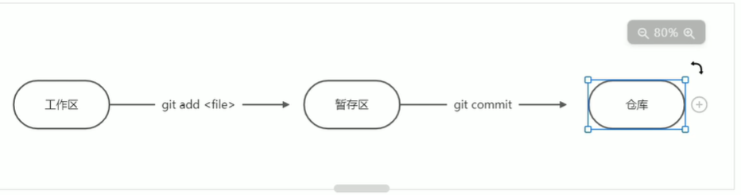
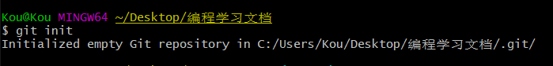

## Git的三个概念

+ 提交 commit
+ 仓库 repository
+ 分支 branch





## 常用命令

`git init`：将文件夹变成仓库。




`git --version`：查看git的版本

`git add -A`：将工作区中的所有文件提交到暂存区

`git commit -m "注释"`：将暂存区文件提交到仓库

`git config --global user.email/name "邮箱/姓名"`：配置用户的邮箱/姓名

`git log --stat`：查看提交记录

`git checkout 文件名`：工作区回滚

`git reset HEAD^1`：撤销最后一次提交

`git config --system --list`：查看系统config

`git config --global  --list`：查看当前用户（global）配置

`git config --local  --list`：查看当前仓库配置信息

`git config user.name`：查看user.name

`git config user.email`：查看user.email

### 分支相关命令

`git checkout -b 分支名`：以==当前分支为基础==新建一个分支

`git checkout 分支名`：切换到一个分支

`git merge 分支名`：将"分支名"与当前分支合并

`git merge --abort`：放弃本次合并

`git branch`：显示所有分支

`git branch -D 分支名`：删除分支

第一次推送到Github

```bas
git remote add origin https://github.com/Kou1688/Learning-document.git
git branch -M main
git push -u origin main
```

`git push`： 推送到远程仓库

`git pull` ：拉取远程仓库

