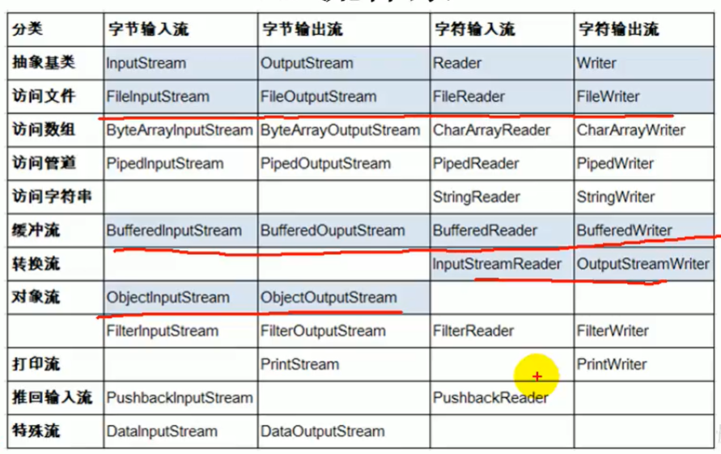

[TOC]


# IO流


## 1.File类


### 1.1 File类的理解

1. File类的一个对象，代表一个文件或一个文件目录。
2. File类的声明在Java.io包下。
3. File类中涉及到关于文件或文件目录的创建，删除，重命名，修改时间，文件大小等方法，并未涉及到写入或读取文件内容的操作。
4. 如果需要读取或写入文件内容，必须使用IO流完成。
5. 后续File类对象常会作为参数传递到流的构造器中，指明读取或写入的“终点”。


### 1.2 File类的实例化

常用构造器：

+ ```java
  File(String parentPath, String childPath)
  File file3 = new File("C:\\Users\\Kou\\Desktop", "JavaSenior");
  ```

+ ```java
  File(File parent, String child) 
  File file4 = new File(file3,"hi.txt");
  ```

+ ```java
  File(String pathname)
  File file = new File("hello.txt");
  File file1 = new File("C:\\Users\\Kou\\Desktop\\file.txt");
  ```

  

### 1.3 路径的分类

相对路径：相较于某个路径下，指明的路径。

绝对路径：包括盘符在内的文件或文件目录的路径。

**idea中**：

说明：如果在JUnit中的单元测试方法测试，相对路径即为当前module下。

​			如果使用main方法测试，相对路径即为当前Project下。


路径的分隔符：windows：\\ \   unix：/


### 1.4 常用方法

```java
public void test02() {
    File file1 = new File("hello.txt");
    File file2 = new File("C:\\Users\\Kou\\Desktop\\io\\hi.txt");

    //获取绝对路径
    System.out.println(file1.getAbsolutePath());
    System.out.println(file1.getPath());
    System.out.println(file1.getName());
    System.out.println(file1.getParent());
    System.out.println(file1.length());
    //获取最后一次修改时间
    System.out.println(new Date(file1.lastModified()));

    System.out.println();

    System.out.println(file2.getAbsolutePath());
    System.out.println(file2.getPath());
    System.out.println(file2.getName());
    System.out.println(file2.getParent());
    System.out.println(file2.length());
    System.out.println(file2.lastModified());
}
```


```java
/**
* 适用于文件目录
* String[] list()  获取指定目录下的所有文件或者文件目录的名称数组
* File[] listFiles()   获取指定目录下所有文件或者文件目录的File数组
*/
@Test
public void test03() {
    File file1 = new File("C:\\Users\\Kou\\Desktop\\编程学习文档");

    String[] list = file1.list();
    assert list != null;
    for (String s : list) {
        System.out.println(s);
    }

    System.out.println();

    File[] listFiles = file1.listFiles();
    assert listFiles != null;
    for (File s : listFiles) {
        System.out.println(s);
    }
}
```


```java
/**
     * public boolean renameTo(File dest):把文件重命名为指定的文件路径
     * 要想返回true，需要file1在硬盘中是存在的，且file2不能存在（剪切并重命名）
     */
@Test
public void test04() {
    File file1 = new File("hello.txt");
    File file2 = new File("C:\\Users\\Kou\\Desktop\\io\\hi.txt");

    boolean renameTo = file1.renameTo(file2);
    System.out.println(renameTo);
}
```


```java
/**
     * 创建与删除
     * Java中的删除不走回收站
     * 创建硬盘中对应的文件或文件目录
     * boolean createNewFile():创建文件。若存在，返回false
     * boolean mkdir():创建文件目录。
     * boolean mkdirs():创建文件目录，如果上层目录不存在，一并创建（级联创建）
     */
@Test
public void test05() throws IOException {
    File file1 = new File("hi.txt");
    if (!file1.exists()){
        file1.createNewFile();
        System.out.println("创建成功");
    }else {
        //文件若存在，删除
        file1.delete();
        System.out.println("删除成功");
    }
}

@Test
public void test06(){
    File file1 = new File("C:\\Users\\Kou\\Desktop\\io\\io1\\io3");


    boolean mkdir = file1.mkdir();
    if (mkdir){
        System.out.println("创建成功1");
    }

    File file2 = new File("C:\\Users\\Kou\\Desktop\\io\\io1\\io4");

    boolean mkdirs = file2.mkdirs();
    if (mkdirs){
        System.out.println("创建成功2");
    }
}
```


## 2.IO原理及流分类

IO是Input/Output的缩写，IO用于处理设备之间的数据传输。

Java程序中，对于输入输出操作以”==流Stream==“的方式进行。

java.io包下提供了各种"流"类和接口，用以获取数据。


输入输出：外部数据读取到内存，内存数据输出到外部


### 2.1 流分类

按操作==数据单位==不同分:

+ 字节流(8bit)		直接操作  InputStream/OutStream
+ 字符流(16bit)      使用缓冲区  Reader/Writer

按数据流的==流向==不同分为:

+ 输入流
+ 输出流

按流的==角色==的不同:

+ 节点流
+ 处理流





## 3.FileReader与FileWriter（字符流）


### 3.1 读入数据的基本操作

代码:io01

```java
/**
     * 将hello.txt文件内容读入程序中，并输出到控制台
     * read():返回读入的一个字符。如果达到文件末尾，返回-1
     * 异常处理：为了保证流资源一定能执行关闭操作，需要使用try/catch/finally处理
     * 读入的文件一定要存在，否则就会报FileNotFoundException
     */
@Test
public void testFileReader() {
    FileReader fr = null;
    try {
        //Test测试 相对路径实例化一个File对象，指明要操作的文件
        File file = new File("hello.txt");
        //2.提供具体的流
        fr = new FileReader(file);

        //3.数据的读入
        //read():返回读入的一个字符。如果达到文件末尾，返回-1
        int data;
        while ((data = fr.read()) != -1) {
            System.out.print((char) data);
        }
    } catch (IOException e) {
        e.printStackTrace();
    } finally {
        //4.流的关闭操作
        try {
            if (fr != null) {
                fr.close();
            }
        } catch (IOException e) {
            e.printStackTrace();
        }
    }

}
```


```java

    /**
     * 对read()操作升级：使用read的重载方法
     */
    @Test
    public void testFileReader1() {
        FileReader fr = null;
        try {
            //1.File类的实例化
            File file = new File("hello.txt");

            //2.FileReader流的实例化
            fr = new FileReader(file);

            //3.读入的操作
            //read(char[] cbuf):返回每次读入cbuf数组中的字符的个数,如果达到文件末尾返回-1

            char[] cbuf = new char[5];
            int len = 0;

            while ((len = fr.read(cbuf)) != -1) {
                //方式一
//                for (int i = 0; i < len; i++) {
//                    System.out.print(cbuf[i]);
//                }

                //方式二(费内存)
                String str = new String(cbuf, 0, len);
                System.out.print(str);
           }

        } catch (IOException e) {
            e.printStackTrace();
        } finally {
            //4.资源的关闭
            if (fr != null) {
                try {
                    fr.close();
                } catch (IOException e) {
                    e.printStackTrace();
                }
            }
        }

    }
```


### 3.2 写出数据的基本操作

```java
/**
     * 说明：
     * 输出操作，对应的File可以不存在。
     * 如果不存在，自动创建此文件
     * 如果存在:
     * append:false 覆盖原有文件 
     * append:true 在原有文件上追加   
     * 默认为false
     */
@Test
public void testFileWriter() throws IOException {
    //1.提供File类的对象，指明写出到的文件
    File file = new File("hello1.txt");

    //2.提供FileWriter对象，用于数据的写出
    FileWriter fw = new FileWriter(file);

    //3.写出操作
    fw.write("I have a dream!\n");
    fw.write("you need to have a dream!");

    //4.流资源的关闭
    fw.close();
}
```


### 3.3 使用FileReader与FileWriter实现文本文件的复制

```java
@Test
public void testFileReaderFileWriter() {
    FileReader fr = null;
    FileWriter fw = null;
    try {
        //1.创建File类对象，指明读入和写出的文件
        File srcFile = new File("hello.txt");
        File destFile = new File("hello2.txt");

        //2.创建输入和输出流的对象
        fr = new FileReader(srcFile);
        fw = new FileWriter(destFile);

        //3.数据的读入与输出操作
        char[] cbuf = new char[5];
        //记录每次读入到cbuf数组中字符的个数
        int len;

        while ((len = fr.read(cbuf)) != -1) {
            fw.write(cbuf, 0, len);
        }
    } catch (IOException e) {
        e.printStackTrace();
    } finally {
        try {
            //4.关闭流资源
            if (fw != null) {
                fw.close();
            }
        } catch (IOException e) {
            e.printStackTrace();
        }

        try {
            if (fr != null) {
                fr.close();
            }
        } catch (IOException e) {
            e.printStackTrace();
        }
    }
}
```


## 4.FileInputStream与FileOutStream（字节流）


代码：io2

#### 字符流和字节流能处理的文件类型

1. 对于文本文件（.txt .java  .c .cpp ），使用字符流处理
2. 对于非文本文件，使用字节流处理


### 4.1 对图片的复制操作

```java
/**
     * 实现对图片的复制操作
     */
@Test
public void testFileOutputStream() {

    FileInputStream fis = null;
    FileOutputStream fos = null;
    try {
        File srcFile = new File("img.png");
        File destFile = new File("img2.png");

        fis = new FileInputStream(srcFile);
        fos = new FileOutputStream(destFile);

        //复制的过程
        byte[] buffer = new byte[5];
        int len;

        while ((len = fis.read(buffer)) != -1) {
            fos.write(buffer, 0, len);
        }
    } catch (IOException e) {
        e.printStackTrace();
    } finally {
        if (fos != null) {
            try {
                fos.close();
            } catch (IOException e) {
                e.printStackTrace();
            }
        }
        if (fis != null) {
            try {
                fis.close();
            } catch (IOException e) {
                e.printStackTrace();
            }
        }
    }

}
```


### 4.2 指定路径下文件的复制

```java
    /**
     * 指定路径下文件的复制
     */
    public void copyFile(String srcPath, String destPath) {
        FileInputStream fis = null;
        FileOutputStream fos = null;
        try {
            File srcFile = new File(srcPath);
            File destFile = new File(destPath);

            fis = new FileInputStream(srcFile);
            fos = new FileOutputStream(destFile);

            //复制的过程
            byte[] buffer = new byte[1024];
            int len;

            while ((len = fis.read(buffer)) != -1) {
                fos.write(buffer, 0, len);
            }
        } catch (IOException e) {
            e.printStackTrace();
        } finally {
            if (fos != null) {
                try {
                    fos.close();
                } catch (IOException e) {
                    e.printStackTrace();
                }
            }
            if (fis != null) {
                try {
                    fis.close();
                } catch (IOException e) {
                    e.printStackTrace();
                }
            }
        }
    }

    @Test
    public void testCopyFile() {
        long start = System.currentTimeMillis();

        String srcPath = "C:\\Users\\Kou\\Desktop\\01-视频.mp4";
        String desPath = "C:\\Users\\Kou\\Desktop\\02-视频.mp4";
        copyFile(srcPath,desPath);

        long end = System.currentTimeMillis();

        //3258毫秒
        System.out.println("复制花费时间为：" + (end - start));
    }
```


## 5.缓冲流


代码：io3


```java
/**
 * 处理流之一：缓冲流的使用
 * 1.缓冲流:
 * BufferedInputStream
 * BufferedOutputStream
 * BufferedReader
 * BufferedWriter
 * <p>
 * 2.作用：提高流的读取，写入的速度
 *   原因：内部提供了一个缓冲区
 *
 * @author Kou
 * @date: 2021/7/20 14:04
 */
public class BufferedTest {

    @Test
    public void bufferedStreamTest() {
        BufferedInputStream bis = null;
        BufferedOutputStream bos = null;
        try {
            //1.造文件
            File srcFile = new File("img.png");
            File desrFile = new File("img2.png");
            //2.造流
            FileInputStream fis = new FileInputStream(srcFile);
            FileOutputStream fos = new FileOutputStream(desrFile);
            //3.造缓冲流
            bis = new BufferedInputStream(fis);
            bos = new BufferedOutputStream(fos);
            //4.复制的细节:读取写入的过程
            byte[] buffer = new byte[10];
            int len;
            while ((len = bis.read(buffer)) != -1) {
                bos.write(buffer, 0, len);
            }
        } catch (IOException e) {
            e.printStackTrace();
        } finally {
            //5.资源关闭
            //要求:先关闭外层流，再关闭内层的流
            if (bos!=null) {
                try {
                    bos.close();
                } catch (IOException e) {
                    e.printStackTrace();
                }
            }
            if (bis!=null) {
                try {
                    bis.close();
                } catch (IOException e) {
                    e.printStackTrace();
                }
            }

            //说明:关闭外层流同时，内层流也会自动关闭。关闭内层流可以省略
        }
    }

    /**
     * 实现文件复制的方法
     */
    public void copyFileWithBuffered(String srcPath,String destPath){
        BufferedInputStream bis = null;
        BufferedOutputStream bos = null;
        try {
            //1.造文件
            File srcFile = new File(srcPath);
            File desrFile = new File(destPath);
            //2.造流
            FileInputStream fis = new FileInputStream(srcFile);
            FileOutputStream fos = new FileOutputStream(desrFile);
            //3.造缓冲流
            bis = new BufferedInputStream(fis);
            bos = new BufferedOutputStream(fos);
            //4.复制的细节:读取写入的过程
            byte[] buffer = new byte[1024];
            int len;
            while ((len = bis.read(buffer)) != -1) {
                bos.write(buffer, 0, len);
            }
        } catch (IOException e) {
            e.printStackTrace();
        } finally {
            //5.资源关闭
            //要求:先关闭外层流，再关闭内层的流
            if (bos!=null) {
                try {
                    bos.close();
                } catch (IOException e) {
                    e.printStackTrace();
                }
            }
            if (bis!=null) {
                try {
                    bis.close();
                } catch (IOException e) {
                    e.printStackTrace();
                }
            }

            //说明:关闭外层流同时，内层流也会自动关闭。关闭内层流可以省略
        }
    }

    @Test
    public void testCopyFileWithBuffered(){
        long start = System.currentTimeMillis();

        String srcPath = "C:\\Users\\Kou\\Desktop\\01-视频.mp4";
        String desPath = "C:\\Users\\Kou\\Desktop\\02-视频.mp4";
        copyFileWithBuffered(srcPath,desPath);

        long end = System.currentTimeMillis();

        //3258毫秒
        System.out.println("复制花费时间为：" + (end - start));
    }
}
```


处理流就是“套接”在已有的流的基础之上。


```java
    /**
     * 实现文本文件的复制
     */
    @Test
    public void testBufferedReaderBufferedWriter() {

        BufferedReader br = null;
        BufferedWriter bw = null;
        try {
            br = new BufferedReader(new FileReader(new File("hello.txt")));
            bw = new BufferedWriter(new FileWriter(new File("hello3.txt")));

            //读写操作
            char[] cbuf = new char[1024];
            int len;

            while ((len = br.read(cbuf)) != -1) {
                bw.write(cbuf, 0, len);
            }
        } catch (IOException e) {
            e.printStackTrace();
        } finally {
            //关闭资源
            if (bw!=null) {
                try {
                    bw.close();
                } catch (IOException e) {
                    e.printStackTrace();
                }
            }
            if (br!=null) {
                try {
                    br.close();
                } catch (IOException e) {
                    e.printStackTrace();
                }
            }
        }

    }
```


### 5.1 图片的加密解密

```java
    /**
     * 图片加密
     */
    @Test
    public void test1() {

        FileInputStream fis = null;
        FileOutputStream fos = null;
        try {
            fis = new FileInputStream("img.png");
            fos = new FileOutputStream("imgSecret.png");

            byte[] buffer = new byte[20];
            int len;
            while ((len = fis.read(buffer)) != -1) {

                for (int i = 0; i < len; i++) {
                    buffer[i]= (byte) (buffer[i]^5);
                }

                fos.write(buffer, 0, len);
            }
        } catch (IOException e) {
            e.printStackTrace();
        } finally {
            if (fos!=null) {
                try {
                    fos.close();
                } catch (IOException e) {
                    e.printStackTrace();
                }
            }
            if (fis!=null) {
                try {
                    fis.close();
                } catch (IOException e) {
                    e.printStackTrace();
                }
            }
        }

    }

    /**
     * 图片的解密
     */
    @Test
    public void test2() {

        FileInputStream fis = null;
        FileOutputStream fos = null;
        try {
            fis = new FileInputStream("imgSecret.png");
            fos = new FileOutputStream("img4.png");

            byte[] buffer = new byte[20];
            int len;
            while ((len = fis.read(buffer)) != -1) {

                for (int i = 0; i < len; i++) {
                    buffer[i]= (byte) (buffer[i]^5);
                }

                fos.write(buffer, 0, len);
            }
        } catch (IOException e) {
            e.printStackTrace();
        } finally {
            if (fos!=null) {
                try {
                    fos.close();
                } catch (IOException e) {
                    e.printStackTrace();
                }
            }
            if (fis!=null) {
                try {
                    fis.close();
                } catch (IOException e) {
                    e.printStackTrace();
                }
            }
        }

    }
```


## 6.转换流

字符与字节流的相互转换

```java
/**
* 处理流：属于字符流
* InputStreamReader:将一个字节的输入流转换为字符的输入流
* OutputStreamWriter:将一个字符的输出流转换为字节的输出流
*/
```


### 6.1 InputStreamReader

```java
    /**
     * InputStreamReader的使用由字节输入流转换为字符输入流
     */
    @Test
    public void test1() throws IOException {
        FileInputStream fis = new FileInputStream("hello.txt");
        //参数2指明了字符集，具体使用哪个字符集取决于文件保存时使用的字符集
        InputStreamReader isr = new InputStreamReader(fis, StandardCharsets.UTF_8);

        char[] cbuf = new char[20];
        int len;
        while ((len = isr.read(cbuf)) != -1) {
            String str = new String(cbuf, 0, len);
            System.out.println(str);
        }
        isr.close();
    }
```


### 6.2 综合使用InputStreamReader OutStreamWriter


```java
/**
 * 处理流：属于字符流
 * InputStreamReader:将一个字节的输入流转换为字符的输入流
 * OutputStreamWriter:将一个字符的输出流转换为字节的输出流
 * <p>
 * 2.作用：提供字节流与字符流之间的转换
 * <p>
 * 3.解码:字节、字节数组  -->字符数组、字符串
 * 编码:字符数组、字符串 -->字节、字节数组
 *
 * @author Kou
 * @date: 2021/7/20 15:23
 */
public class InputStreamReaderTest {


    /**
     * InputStreamReader的使用由字节输入流转换为字符输入流
     */
    @Test
    public void test1() throws IOException {
        FileInputStream fis = new FileInputStream("hello.txt");
        //参数2指明了字符集，具体使用哪个字符集取决于文件保存时使用的字符集
        InputStreamReader isr = new InputStreamReader(fis, StandardCharsets.UTF_8);

        char[] cbuf = new char[20];
        int len;
        while ((len = isr.read(cbuf)) != -1) {
            String str = new String(cbuf, 0, len);
            System.out.println(str);
        }
        isr.close();
    }


    /**
     * 综合使用InputStreamReader OutStreamWriter
     */
    @Test
    public void test2() throws IOException {
        //1.造文件
        File file1 = new File("hello.txt");
        File file2 = new File("hello_gbk.txt");

        //2.造流
        FileInputStream fis = new FileInputStream(file1);
        FileOutputStream fos = new FileOutputStream(file2);

        InputStreamReader isr = new InputStreamReader(fis, StandardCharsets.UTF_8);
        OutputStreamWriter osw = new OutputStreamWriter(fos, "GBK");

        //3.读写过程
        char[] cbuf = new char[20];
        int len;
        while ((len = isr.read(cbuf)) != -1) {
            osw.write(cbuf, 0, len);
        }

        //4.关闭流
        isr.close();
        osw.close();
    }
}

```


## 7.标准输入输出流

代码：io06


## 8.打印流

io6

实现将基本数据类型的数据格式转换为字符串输出

