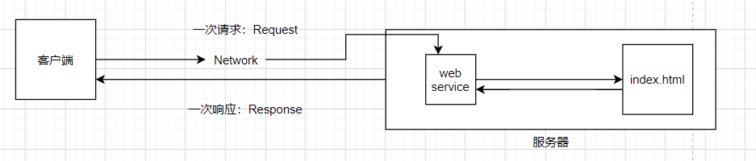

[TOC]

# JavaWeb

## 1.基本概念

### 1.1 前言

web开发：

+ web	网页
+ 静态web
  + html，css
  + 提供给所有人看的数据始终不会发生变化

+ 动态web
  + 提供给所有人看的数据始终会发生变化，不同时间不同地点，看到的信息各不相同。
  + 技术栈：servlet/jsp，asp，php

在Java中，动态web资源开发技术统称为JavaWeb

### 1.2 web应用程序

web应用程序：可以提供浏览器访问的程序；

+ a.html，b.html……多个web资源，这些web资源可以被外界访问。
+ 能访问到的任何一个页面或者资源都存在于世界的某一个角落的计算机上。
+ URL
+ 这些统一的web资源会被放在同一个文件夹下，web应用程序-->tomcat：服务器
+ 一个web应用由多部分组成（静态web，动态web）
  + html,css,js
  + jsp,servlet
  + Java程序
  + jar包
  + 配置文件（properties）

web应用程序编写完毕之后，若想提供给外界访问：需要一个服务器来统一管理；

### 1.3 静态web

+ *.htm ,  *.html，这些都是网页的后缀，如果服务器上存在这些东西，我们就可以直接进行读取。

  

