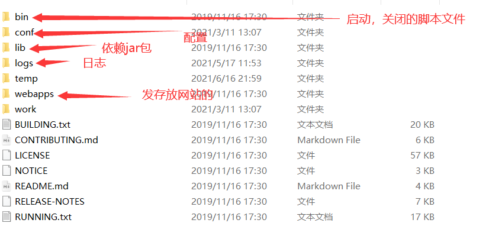
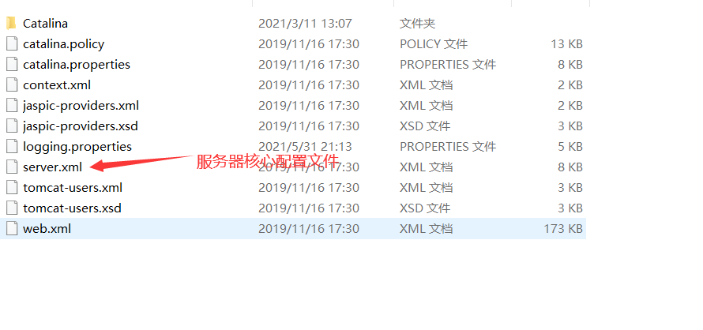
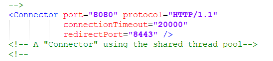
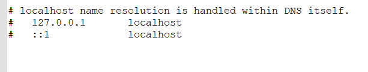
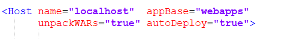
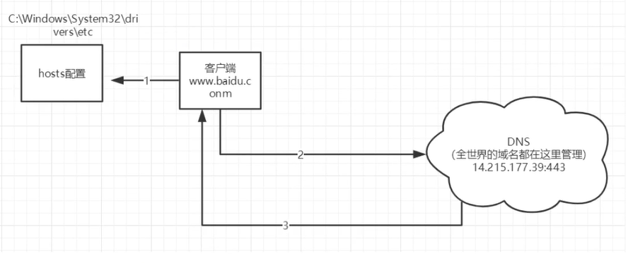
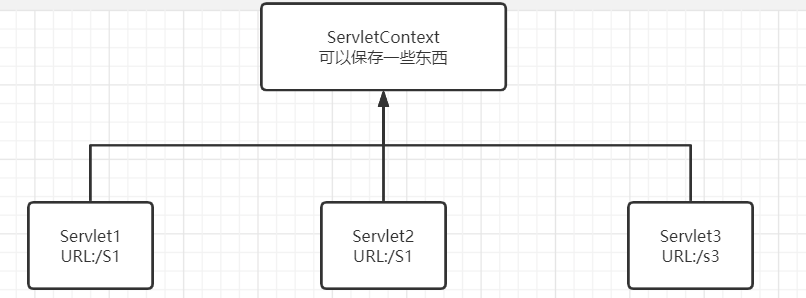

[TOC]


# JavaWeb


## 1.基本概念


### 1.1 前言

web开发：

+ web	网页
+ 静态web
  + html，css
  + 提供给所有人看的数据始终不会发生变化

+ 动态web
  + 提供给所有人看的数据始终会发生变化，不同时间不同地点，看到的信息各不相同。
  + 技术栈：servlet/jsp，asp，php

在Java中，动态web资源开发技术统称为JavaWeb


### 1.2 web应用程序

web应用程序：可以提供浏览器访问的程序；

+ a.html，b.html……多个web资源，这些web资源可以被外界访问。
+ 能访问到的任何一个页面或者资源都存在于世界的某一个角落的计算机上。
+ URL
+ 这些统一的web资源会被放在同一个文件夹下，web应用程序-->tomcat：服务器
+ 一个web应用由多部分组成（静态web，动态web）
  + html,css,js
  + jsp,servlet
  + Java程序
  + jar包
  + 配置文件（properties）

web应用程序编写完毕之后，若想提供给外界访问：需要一个服务器来统一管理；


### 1.3 静态web

+ *.htm ,  *.html，这些都是网页的后缀，如果服务器上存在这些东西，我们就可以直接进行读取。

  


+ 静态web的缺点
  + web页面无法动态更新，所有用户看到的都是同一个页面
    + 轮播，点击特效：伪动态
    + JavaScript
    + VBScript
  + 无法和数据库交互（数据无法持久化，用户无法交互）


### 1.4 动态web

页面会动态展示：“web页面展示效果因人而异”

缺点：

+ 假如服务器动态web资源出现了错误，我们需要重新编写我们的**后台程序**，重新发布
  + 停机维护

优点：

+ 页面可以动态更新
+ 可以与数据库交互（数据持久化）


--------------

## 2.web服务器


### 2.1 技术相关

ASP：

+ 微软
+ 在HTML中嵌入了VB脚本


JSP/Servlet：

B/S：浏览器/服务器

C/S：客户端和服务器

+ sun公司主推的B/S架构

+ 基于Java语言


PHP

+ 世界上最好的语言！


### 2.2 Web服务器

服务器是一种被动的操作，用来处理用户的一些请求和给用户一些相应信息；


**IIS**：

微软，ASP……Windows中自带的


**Tomcat**


Tomcat是Apache 软件基金会（Apache Software Foundation）的Jakarta 项目中的一个核心项目，最新的Servlet 和JSP 规范总是能在Tomcat 中得到体现，因为Tomcat 技术先进、性能稳定，而且**免费**，因而深受Java 爱好者的喜爱并得到了部分软件开发商的认可，成为目前比较流行的Web 应用服务器。

Tomcat 服务器是一个免费的开放源代码的Web 应用服务器，属于轻量级应用[服务器](https://baike.baidu.com/item/服务器)，在中小型系统和并发访问用户不是很多的场合下被普遍使用，是开发和调试JSP 程序的首选。对于一个JavaWeb初学者来说，是最佳选择。

……


-------------

## 3.Tomcat


+ tomcat默认端口号：8080
+ mysql：3306
+ http：80
+ https：443


文件夹作用



启动**Tomcat**：

命令行`startup.bat`

端口：http://localhost:8080/


### 3.1 配置



**修改端口号**：




C:\Windows\System32\drivers\etc\hosts      可以更改localhost指向





+ 默认的主机名为：localhost->127.0.0.1
+ 默认网站应用存放的位置：webapps


**面试题**：谈谈网站时如何进行访问的？

1. 输入一个域名

2. 检查本机C:\Windows\System32\drivers\etc\hosts 配置文件下有无这个域名映射

   1. 有：直接返回对应的ip地址，这个地址中，有我们需要访问的web程序，可以直接访问

      localhost name resolution is handled within DNS itself.

      127.0.0.1       localhost

      ::1             localhost

   2. 没有：去DNS服务器找，找到返回，否则返回错误。




### 3.4 发布一个web网站

不会先模仿

+ 将自己写的网站，放到服务器（Tomcat）中指定的web应用的文件夹（webapps），就可以访问了

+ 网站应该有的结构

  ```java
  --webapps：tomcat服务器的web目录
      -ROOT
      -****：网站目录名
      	-WEB-INF
      		-classes：Java程序
      		-lib：web应用所依赖的jar包
      		-web.xml网站配置文件
      	-index.html默认的首页
      	-static
      		-css
      			-style.css
      		-js
      		-img
      	-……
  ```

  


## 4.HTTP


### 4.1 什么是HTTP

HTTP（超文本传输协议）是一个简单的请求响应协议，通常运行在TCP之上。

客户端HTTP：生成针对目标Web服务器的HTTP请求报文

服务器HTTP：对Web服务器请求的内容的处理。

+ 80

Https：安全的

+ 443


### 4.2 两个时代

+ http1.0
  + HTTP/1.0：客户端可以与web服务端连接后，只能获得一个web资源
+ http2.0
  + HTTP/1.1：可以获得多个web资源


### 4.3 HTTP请求

+ 客户端--发请求(Request)--服务器

```java
Request URL: https://www.baidu.com/  请求地址
Request Method: GET		get方法/post方法
Status Code: 200 OK		状态码
Remote Address: 36.152.44.96:443	远程地址，地址+端口号
Referrer Policy: strict-origin-when-cross-origin	
```

1. **请求行**

+ 请求行中的请求方式：GET
+ 请求方式：Get,Post,HEAD,PUT……
  + get：请求能够携带的参数比较少，大小有限制，会在浏览器的url地址栏显示数据内容，不安全但高效
  + post：请求能够携带的参数没有限制，大小没有限制，不会在浏览器的url地址栏显示数据内容，安全但不高效

2. **消息头**

   ```java
   Accept: text/html		告诉浏览器所支持的数据类型
   Accept-Encoding: gzip, deflate, br	编码格式
   Accept-Language: zh-CN,zh;q=0.9		告诉浏览器它的语言环境
   Cache-Control: max-age=0		缓存控制
   Connection: keep-alive		告诉浏览器，请求完成还是断开连接   连接类型：持久连接
   ```

   


### 4.4 HTTP响应

+ 服务器--响应--客户端

百度：

```java
Cache-Control: private		缓存控制
Connection: keep-alive		连接
Content-Encoding: gzip		编码
Content-Type: text/html;charset=utf-8	响应文本类型
```


**响应状态码**：

200：请求响应成功

3**：请求重定向

+ 重定向：重新转到给定的位置

4**：找不到资源   404

+ 资源不存在

5**：服务器代码错误  500   502：网关错误


**常见面试题：**

当你的浏览器中地址栏输入地址并回车的一瞬间到页面能够展示回来，经历了什么？


-------------

## 5.Maven

导入jar包

**项目架构管理工具**

目前用来就是方便导jar包

核心思想：**约定大于配置**

+ 有约束，不要去违反

Maven会规定好该如何编写Java代码，必须按照这个规范来。

war模式：将WEB工程以包的形式上传到服务器 ；
war exploded模式：将WEB工程以当前文件夹的位置关系上传到服务器；


--------------------------

## 6.Servlet

==Servlet是一个Java应用程序，运行在服务器端，用来处理客户端请求并作出响应的程序。==

```xml
<!-- web.xml是配置web的核心文件-->
    <!--注册servlet-->
    <servlet>
        <servlet-name>helloServlet</servlet-name>
        <servlet-class>com.kou.servlet.HelloServlet</servlet-class>
    </servlet>

    <!--一个servlet对应一个Mapping：映射-->
    <servlet-mapping>
        <servlet-name>helloServlet</servlet-name>
        <!--映射请求路径-->
        <url-pattern>/kou</url-pattern>
    </servlet-mapping>
```


### 6.1 Servlet

+ servlet是一门开发动态web的技术
+ 把实现了Servlet接口的Java程序叫做：Servlet


### 6.2 HelloServlet

+ 编写一个普通类
+ 实现servlet接口
+ servlet有两个默认实现类，这里实现HttpServlet

```java
public class HelloServlet extends HttpServlet {

    /**
     * 由于get和post只是请求实现的不同方式，可以相互调用，业务逻辑都一样
     */
    @Override
    protected void doGet(HttpServletRequest req, HttpServletResponse resp) throws ServletException, IOException {
        //响应流
        PrintWriter writer = resp.getWriter();
        writer.print("Hello Servlet");
    }

    @Override
    protected void doPost(HttpServletRequest req, HttpServletResponse resp) throws ServletException, IOException {
        doGet(req, resp);
    }
}
```


+ 编写Servlet的映射
  + 为什么需要映射？

    我们写的是Java程序，但是要通过浏览器访问，而浏览器需要连接web服务器，所以我们需要在web服务中注册我们写的Servlet，还需给他一个浏览器能够访问的路径

  ```xml
    <!--注册servlet-->
    <servlet>
      <servlet-name>hello</servlet-name>
      <servlet-class>com.kou.servlet.HelloServlet</servlet-class>
    </servlet>
    
    <!--servlet的请求路径-->
    <servlet-mapping>
      <servlet-name>hello</servlet-name>
      <url-pattern>/hello</url-pattern>
    </servlet-mapping>
  ```

  

+ 启动测试


### 6.3 Servlet原理


#### servlet如何接收数据

 Http协议会将网页中的所有内容包装成为一个request对象传递给servlet ，Servlet通过这个对象拿到表单中的所有数据，处理完成之后，通过Response对象返回给客户端浏览器。

#### servlet生命周期

Servlet的生命周期是由Tomcat容器管理的

1. 客户发出请求—>Web 服务器转发到Web容器Tomcat；

2. Tomcat主线程对转发来用户的请求做出响应创建两个对象：HttpServletRequest和HttpServletResponse；

3. 从请求中的URL中找到正确Servlet，Tomcat为其创建或者分配一个线程，同时把2创建的两个对象传递给该线程；

4. Tomcat调用Servlet的servic()方法，根据请求参数的不同调用doGet()或者doPost()方法；

5. 假设是HTTP GET请求，doGet()方法生成静态页面，并组合到响应对象里；
6. Servlet线程结束，Tomcat将响应对象转换为HTTP响应发回给客户，同时删除请求和响应对象。
   从该过程中，我们可以理解Servlet的生命周期：Servlet类加载（对应3步）；Servlet实例化（对应3步）；调用init方法（对应3步）；调用service()方法（对应4、5步）；；调用destroy()方法（对应6步）。


①客户端向服务器端发出请求；

②这个过程比较重要，这时Tomcat会创建两个对象：HttpServletResponse和HttpServletRequest。并将它们的引用（注意是引用）传给刚分配的线程；

③线程开始着手接洽servlet；

④servlet根据传来的是GET和POST，分别调用doGet()和doPost()方法进行处理；

⑤和⑥servlet将处理后的结果通过线程传回Tomcat，并在之后将这个线程销毁或者送还线程池；

⑦Tomcat将处理后的结果变成一个HTTP响应发送回客户端，这样，客户端就可以接受到处理后的结果了。


### 6.4 Mapping问题

1. 一个Servlet请求可以指定一个映射路径

   ```xml
   <!--注册servlet-->
       <servlet>
           <servlet-name>hello</servlet-name>
           <servlet-class>com.kou.servlet.HelloServlet</servlet-class>
       </servlet>
   
       <!--servlet的请求路径-->
       <servlet-mapping>
           <servlet-name>hello</servlet-name>
           <url-pattern>/hello</url-pattern>
       </servlet-mapping>
   ```

   

2. 一个Servlet请求可以指定多个个映射路径

   ```xml
   <!--注册servlet-->
       <servlet>
           <servlet-name>hello</servlet-name>
           <servlet-class>com.kou.servlet.HelloServlet</servlet-class>
       </servlet>
   
       <!--servlet的请求路径-->
       <servlet-mapping>
           <servlet-name>hello</servlet-name>
           <url-pattern>/hello</url-pattern>
       </servlet-mapping>
       <servlet-mapping>
           <servlet-name>hello</servlet-name>
           <url-pattern>/hello1</url-pattern>
       </servlet-mapping>
   ```

   

3. 一个Servlet请求可以指定通用映射路径

   ```xml
   <!--注册servlet-->
       <servlet>
           <servlet-name>hello</servlet-name>
           <servlet-class>com.kou.servlet.HelloServlet</servlet-class>
       </servlet>
   
       <!--servlet的请求路径-->
       <servlet-mapping>
           <servlet-name>hello</servlet-name>
           <url-pattern>/hello/*</url-pattern>
       </servlet-mapping>
   ```

   

4. 指定一些后缀或前缀

```xml
<!--注册servlet-->
    <servlet>
        <servlet-name>hello</servlet-name>
        <servlet-class>com.kou.servlet.HelloServlet</servlet-class>
    </servlet>

    <!--自定义映射servlet的请求路径-->
    <servlet-mapping>
        <servlet-name>hello</servlet-name>
        <url-pattern>*.kou</url-pattern>
    </servlet-mapping>
```


5. 优先级问题：

   指定了固有的映射路径优先级最高，如果找不到就会走默认。


### 6.5 ServletContext

代码：servlet-02

web容器在启动时，它会为每个web程序都创建一个ServletContext对象，代表当前的web应用。

代码：servlet-02  .servlet

+ 共享数据

  我在这个Servlet中保存的数据，可以在另一个servlet中拿到。

  


#### 请求转发：

```java
public class ServletDemo04 extends HttpServlet {
    @Override
    protected void doGet(HttpServletRequest req, HttpServletResponse resp) throws ServletException, IOException {
        ServletContext context = this.getServletContext();
        //转发的请求路径   转发路径不变，重定向路径会改变
        //调用forward实现请求转发
        context.getRequestDispatcher("/gp").forward(req,resp);
    }

    @Override
    protected void doPost(HttpServletRequest req, HttpServletResponse resp) throws ServletException, IOException {
        doGet(req, resp);
    }
}
```


#### 读取资源文件

类路径classpath在输出目录下

需要一个文件流

```java
public class ServletDemo05 extends HttpServlet {
    @Override
    protected void doGet(HttpServletRequest req, HttpServletResponse resp) throws ServletException, IOException {
        InputStream resourceAsStream = this.getServletContext().getResourceAsStream("/WEB-INF/classes/com/kou/servlet/aa.properties");
        Properties prop = new Properties();
        prop.load(resourceAsStream);
        String username = prop.getProperty("username");
        String pwd = prop.getProperty("password");
        resp.setContentType("text/html;charset=utf-8");
        resp.getWriter().print(username+":"+pwd);
    }

    @Override
    protected void doPost(HttpServletRequest req, HttpServletResponse resp) throws ServletException, IOException {
        doGet(req, resp);
    }
}
```


### 6.6 HttpServletResponse

web服务器接收到客户端的http请求，会针对这个请求，分别创建一个代表请求的HttpServletRequest，代表响应的HttpServletResponse对象；

+ 如果要获取客户端请求过来的参数：找HttpServletRequest
+ 如果要给客户端响应一些信息：找HttpServletResponse


1. #### 简单分类

   负责向浏览器发送数据的方法：

   ```java
   ServletOutputStream getOutputStream() throws IOException;
   PrintWriter getWriter() throws IOException;
   ```

   负责向浏览器发送响应头的方法：

   ```java
   void setCharacterEncoding(String var1);
   
   void setContentLength(int var1);
   
   void setContentLengthLong(long var1);
   
   void setContentType(String var1);
   void setDateHeader(String var1, long var2);
   
   void addDateHeader(String var1, long var2);
   
   void setHeader(String var1, String var2);
   
   void addHeader(String var1, String var2);
   
   void setIntHeader(String var1, int var2);
   
   void addIntHeader(String var1, int var2);
   ```


2. #### 常见应用

   1. 向浏览器输出消息


2. 下载文件
   + 要获取下载文件的路径
   + 下载的文件名是什么？
   + 设置让浏览器能够支持下载我们需要的东西
   + 获取下载文件的输入流
   + 创建缓冲区
   + 获取OutputStream对象
   + 将FileOutStream流写入缓冲区
   + 使用OutputStream将缓冲区中的数据输出到客户端


### 6.7 HttpServletRequest
