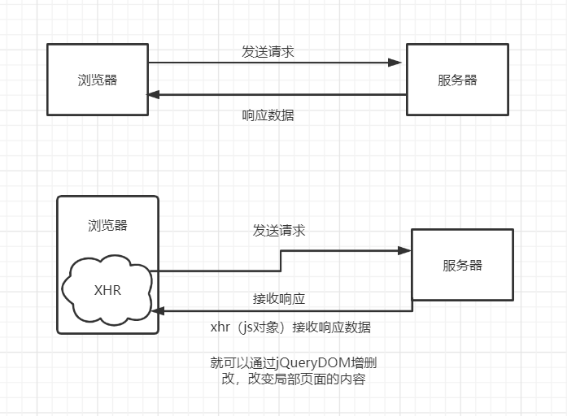

[TOC]


# JavaWeb


## 1.基本概念


### 1.1 前言

web开发：

+ web	网页
+ 静态web
  + html，css
  + 提供给所有人看的数据始终不会发生变化

+ 动态web
  + 提供给所有人看的数据始终会发生变化，不同时间不同地点，看到的信息各不相同。
  + 技术栈：servlet/jsp，asp，php

在Java中，动态web资源开发技术统称为JavaWeb


### 1.2 web应用程序

web应用程序：可以提供浏览器访问的程序；

+ a.html，b.html……多个web资源，这些web资源可以被外界访问。
+ 能访问到的任何一个页面或者资源都存在于世界的某一个角落的计算机上。
+ URL
+ 这些统一的web资源会被放在同一个文件夹下，web应用程序-->tomcat：服务器
+ 一个web应用由多部分组成（静态web，动态web）
  + html,css,js
  + jsp,servlet
  + Java程序
  + jar包
  + 配置文件（properties）

web应用程序编写完毕之后，若想提供给外界访问：需要一个服务器来统一管理；


### 1.3 静态web

+ *.htm ,  *.html，这些都是网页的后缀，如果服务器上存在这些东西，我们就可以直接进行读取。

  


+ 静态web的缺点
  + web页面无法动态更新，所有用户看到的都是同一个页面
    + 轮播，点击特效：伪动态
    + JavaScript
    + VBScript
  + 无法和数据库交互（数据无法持久化，用户无法交互）


### 1.4 动态web

页面会动态展示：“web页面展示效果因人而异”

缺点：

+ 假如服务器动态web资源出现了错误，我们需要重新编写我们的**后台程序**，重新发布
  + 停机维护

优点：

+ 页面可以动态更新
+ 可以与数据库交互（数据持久化）


--------------

## 2.web服务器


### 2.1 技术相关

ASP：

+ 微软
+ 在HTML中嵌入了VB脚本


JSP/Servlet：

B/S：浏览器/服务器

C/S：客户端和服务器

+ sun公司主推的B/S架构

+ 基于Java语言


PHP

+ 世界上最好的语言！


### 2.2 Web服务器

服务器是一种被动的操作，用来处理用户的一些请求和给用户一些相应信息；


**IIS**：

微软，ASP……Windows中自带的


**Tomcat**


Tomcat是Apache 软件基金会（Apache Software Foundation）的Jakarta 项目中的一个核心项目，最新的Servlet 和JSP 规范总是能在Tomcat 中得到体现，因为Tomcat 技术先进、性能稳定，而且**免费**，因而深受Java 爱好者的喜爱并得到了部分软件开发商的认可，成为目前比较流行的Web 应用服务器。

Tomcat 服务器是一个免费的开放源代码的Web 应用服务器，属于轻量级应用[服务器](https://baike.baidu.com/item/服务器)，在中小型系统和并发访问用户不是很多的场合下被普遍使用，是开发和调试JSP 程序的首选。对于一个JavaWeb初学者来说，是最佳选择。

……


-------------

## 3.Tomcat


+ tomcat默认端口号：8080
+ mysql：3306
+ http：80
+ https：443


文件夹作用


启动**Tomcat**：

命令行`startup.bat`

端口：http://localhost:8080/


### 3.1 配置


**修改端口号**：


==C:\Windows\System32\drivers\etc\hosts      可以更改localhost指向==


+ 默认的主机名为：localhost->127.0.0.1
+ 默认网站应用存放的位置：webapps


**面试题**：谈谈网站时如何进行访问的？

1. 输入一个域名

2. 检查本机C:\Windows\System32\drivers\etc\hosts 配置文件下有无这个域名映射

   1. 有：直接返回对应的ip地址，这个地址中，有我们需要访问的web程序，可以直接访问

      localhost name resolution is handled within DNS itself.

      127.0.0.1       localhost

      ::1             localhost

   2. 没有：去DNS服务器找，找到返回，否则返回错误。


### 3.4 发布一个web网站

不会先模仿

+ 将自己写的网站，放到服务器（Tomcat）中指定的web应用的文件夹（webapps），就可以访问了

+ 网站应该有的结构

  ```java
  --webapps：tomcat服务器的web目录
      -ROOT
      -****：网站目录名
      	-WEB-INF
      		-classes：Java程序
      		-lib：web应用所依赖的jar包
      		-web.xml网站配置文件
      	-index.html默认的首页
      	-static
      		-css
      			-style.css
      		-js
      		-img
      	-……
  ```

  


## 4.HTTP


### 4.1 什么是HTTP

HTTP（超文本传输协议）是一个简单的请求响应协议，通常运行在TCP之上。

客户端HTTP：生成针对目标Web服务器的HTTP请求报文

服务器HTTP：对Web服务器请求的内容的处理。

+ 80

Https：安全的

+ 443


### 4.2 两个时代

+ http1.0
  + HTTP/1.0：客户端可以与web服务端连接后，只能获得一个web资源
+ http2.0
  + HTTP/1.1：可以获得多个web资源


### 4.3 HTTP请求

+ 客户端--发请求(Request)--服务器

```java
Request URL: https://www.baidu.com/  请求地址
Request Method: GET		get方法/post方法
Status Code: 200 OK		状态码
Remote Address: 36.152.44.96:443	远程地址，地址+端口号
Referrer Policy: strict-origin-when-cross-origin	
```

1. **请求行**

+ 请求行中的请求方式：GET
+ 请求方式：Get,Post,HEAD,PUT……
  + get：请求能够携带的参数比较少，大小有限制，会在浏览器的url地址栏显示数据内容，不安全但高效
  + post：请求能够携带的参数没有限制，大小没有限制，不会在浏览器的url地址栏显示数据内容，安全但不高效

2. **消息头**

   ```java
   Accept: text/html		告诉浏览器所支持的数据类型
   Accept-Encoding: gzip, deflate, br	编码格式
   Accept-Language: zh-CN,zh;q=0.9		告诉浏览器它的语言环境
   Cache-Control: max-age=0		缓存控制
   Connection: keep-alive		告诉浏览器，请求完成还是断开连接   连接类型：持久连接
   ```

   


### 4.4 HTTP响应

+ 服务器--响应--客户端

百度：

```java
Cache-Control: private		缓存控制
Connection: keep-alive		连接
Content-Encoding: gzip		编码
Content-Type: text/html;charset=utf-8	响应文本类型
```


**响应状态码**：

200：请求响应成功

3**：请求重定向

+ 重定向：重新转到给定的位置

4**：找不到资源   404

+ 资源不存在

5**：服务器代码错误  500   502：网关错误


**常见面试题：**

当你的浏览器中地址栏输入地址并回车的一瞬间到页面能够展示回来，经历了什么？


-------------

## 5.Maven

导入jar包

**项目架构管理工具**

目前用来就是方便导jar包

核心思想：**约定大于配置**

+ 有约束，不要去违反

Maven会规定好该如何编写Java代码，必须按照这个规范来。

war模式：将WEB工程以包的形式上传到服务器 ；
war exploded模式：将WEB工程以当前文件夹的位置关系上传到服务器；


--------------------------

## 6.Servlet

==Servlet是一个Java应用程序，运行在服务器端，用来处理客户端请求并作出响应的程序。==

```xml
<!-- web.xml是配置web的核心文件-->
    <!--注册servlet-->
    <servlet>
        <servlet-name>helloServlet</servlet-name>
        <servlet-class>com.kou.servlet.HelloServlet</servlet-class>
    </servlet>

    <!--一个servlet对应一个Mapping：映射-->
    <servlet-mapping>
        <servlet-name>helloServlet</servlet-name>
        <!--映射请求路径-->
        <url-pattern>/kou</url-pattern>
    </servlet-mapping>
```


### 6.1 Servlet

+ servlet是一门开发动态web的技术
+ 把实现了Servlet接口的Java程序叫做：Servlet


### 6.2 HelloServlet

+ 编写一个普通类
+ 实现servlet接口
+ servlet有两个默认实现类，这里实现HttpServlet

```java
public class HelloServlet extends HttpServlet {

    /**
     * 由于get和post只是请求实现的不同方式，可以相互调用，业务逻辑都一样
     */
    @Override
    protected void doGet(HttpServletRequest req, HttpServletResponse resp) throws ServletException, IOException {
        //响应流
        PrintWriter writer = resp.getWriter();
        writer.print("Hello Servlet");
    }

    @Override
    protected void doPost(HttpServletRequest req, HttpServletResponse resp) throws ServletException, IOException {
        doGet(req, resp);
    }
}
```


+ 编写Servlet的映射
  + 为什么需要映射？

    我们写的是Java程序，但是要通过浏览器访问，而浏览器需要连接web服务器，所以我们需要在web服务中注册我们写的Servlet，还需给他一个浏览器能够访问的路径

  ```xml
    <!--注册servlet-->
    <servlet>
      <servlet-name>hello</servlet-name>
      <servlet-class>com.kou.servlet.HelloServlet</servlet-class>
    </servlet>
    
    <!--servlet的请求路径-->
    <servlet-mapping>
      <servlet-name>hello</servlet-name>
      <url-pattern>/hello</url-pattern>
    </servlet-mapping>
  ```

  

+ 启动测试


### 6.3 Servlet原理


#### servlet如何接收数据

 Http协议会将网页中的所有内容包装成为一个request对象传递给servlet ，Servlet通过这个对象拿到表单中的所有数据，处理完成之后，通过Response对象返回给客户端浏览器。

#### servlet生命周期

Servlet的生命周期是由Tomcat容器管理的

1. 客户发出请求—>Web 服务器转发到Web容器Tomcat；

2. Tomcat主线程对转发来用户的请求做出响应创建两个对象：HttpServletRequest和HttpServletResponse；

3. 从请求中的URL中找到正确Servlet，Tomcat为其创建或者分配一个线程，同时把2创建的两个对象传递给该线程；

4. Tomcat调用Servlet的servic()方法，根据请求参数的不同调用doGet()或者doPost()方法；

5. 假设是HTTP GET请求，doGet()方法生成静态页面，并组合到响应对象里；
6. Servlet线程结束，Tomcat将响应对象转换为HTTP响应发回给客户，同时删除请求和响应对象。
   从该过程中，我们可以理解Servlet的生命周期：Servlet类加载（对应3步）；Servlet实例化（对应3步）；调用init方法（对应3步）；调用service()方法（对应4、5步）；；调用destroy()方法（对应6步）。


①客户端向服务器端发出请求；

②这个过程比较重要，这时Tomcat会创建两个对象：HttpServletResponse和HttpServletRequest。并将它们的引用（注意是引用）传给刚分配的线程；

③线程开始着手接洽servlet；

④servlet根据传来的是GET和POST，分别调用doGet()和doPost()方法进行处理；

⑤和⑥servlet将处理后的结果通过线程传回Tomcat，并在之后将这个线程销毁或者送还线程池；

⑦Tomcat将处理后的结果变成一个HTTP响应发送回客户端，这样，客户端就可以接受到处理后的结果了。


### 6.4 Mapping问题

1. 一个Servlet请求可以指定一个映射路径

   ```xml
   <!--注册servlet-->
       <servlet>
           <servlet-name>hello</servlet-name>
           <servlet-class>com.kou.servlet.HelloServlet</servlet-class>
       </servlet>
   
       <!--servlet的请求路径-->
       <servlet-mapping>
           <servlet-name>hello</servlet-name>
           <url-pattern>/hello</url-pattern>
       </servlet-mapping>
   ```

   

2. 一个Servlet请求可以指定多个个映射路径

   ```xml
   <!--注册servlet-->
       <servlet>
           <servlet-name>hello</servlet-name>
           <servlet-class>com.kou.servlet.HelloServlet</servlet-class>
       </servlet>
   
       <!--servlet的请求路径-->
       <servlet-mapping>
           <servlet-name>hello</servlet-name>
           <url-pattern>/hello</url-pattern>
       </servlet-mapping>
       <servlet-mapping>
           <servlet-name>hello</servlet-name>
           <url-pattern>/hello1</url-pattern>
       </servlet-mapping>
   ```

   

3. 一个Servlet请求可以指定通用映射路径

   ```xml
   <!--注册servlet-->
       <servlet>
           <servlet-name>hello</servlet-name>
           <servlet-class>com.kou.servlet.HelloServlet</servlet-class>
       </servlet>
   
       <!--servlet的请求路径-->
       <servlet-mapping>
           <servlet-name>hello</servlet-name>
           <url-pattern>/hello/*</url-pattern>
       </servlet-mapping>
   ```

   

4. 指定一些后缀或前缀

```xml
<!--注册servlet-->
    <servlet>
        <servlet-name>hello</servlet-name>
        <servlet-class>com.kou.servlet.HelloServlet</servlet-class>
    </servlet>

    <!--自定义映射servlet的请求路径-->
    <servlet-mapping>
        <servlet-name>hello</servlet-name>
        <url-pattern>*.kou</url-pattern>
    </servlet-mapping>
```


5. 优先级问题：

   指定了固有的映射路径优先级最高，如果找不到就会走默认。


### 6.5 ServletContext

代码：servlet-02

web容器在启动时，它会为每个web程序都创建一个ServletContext对象，代表当前的web应用。

代码：servlet-02  .servlet

+ 共享数据

  我在这个Servlet中保存的数据，可以在另一个servlet中拿到。

  


#### 请求转发：

```java
public class ServletDemo04 extends HttpServlet {
    @Override
    protected void doGet(HttpServletRequest req, HttpServletResponse resp) throws ServletException, IOException {
        ServletContext context = this.getServletContext();
        //转发的请求路径   转发路径不变，重定向路径会改变
        //调用forward实现请求转发
        context.getRequestDispatcher("/gp").forward(req,resp);
    }

    @Override
    protected void doPost(HttpServletRequest req, HttpServletResponse resp) throws ServletException, IOException {
        doGet(req, resp);
    }
}
```


#### 读取资源文件

类路径classpath在输出目录下

需要一个文件流

```java
public class ServletDemo05 extends HttpServlet {
    @Override
    protected void doGet(HttpServletRequest req, HttpServletResponse resp) throws ServletException, IOException {
        InputStream resourceAsStream = this.getServletContext().getResourceAsStream("/WEB-INF/classes/com/kou/servlet/aa.properties");
        Properties prop = new Properties();
        prop.load(resourceAsStream);
        String username = prop.getProperty("username");
        String pwd = prop.getProperty("password");
        resp.setContentType("text/html;charset=utf-8");
        resp.getWriter().print(username+":"+pwd);
    }

    @Override
    protected void doPost(HttpServletRequest req, HttpServletResponse resp) throws ServletException, IOException {
        doGet(req, resp);
    }
}
```


### 6.6 HttpServletResponse

web服务器接收到客户端的http请求，会针对这个请求，分别创建一个代表请求的HttpServletRequest，代表响应的HttpServletResponse对象；

+ 如果要获取客户端请求过来的参数：找HttpServletRequest
+ 如果要给客户端响应一些信息：找HttpServletResponse


#### 简单分类

负责向浏览器发送数据的方法：

```java
ServletOutputStream getOutputStream() throws IOException;
PrintWriter getWriter() throws IOException;
```

负责向浏览器发送响应头的方法：

```java
void setCharacterEncoding(String var1);

void setContentLength(int var1);

void setContentLengthLong(long var1);

void setContentType(String var1);
void setDateHeader(String var1, long var2);

void addDateHeader(String var1, long var2);

void setHeader(String var1, String var2);

void addHeader(String var1, String var2);

void setIntHeader(String var1, int var2);

void addIntHeader(String var1, int var2);
```


#### 常见应用

1. 向浏览器输出消息


#### 下载文件

+ 要获取下载文件的路径
+ 下载的文件名是什么？
+ 设置让浏览器能够支持下载我们需要的东西
+ 获取下载文件的输入流
+ 创建缓冲区
+ 获取OutputStream对象
+ 将FileOutStream流写入缓冲区
+ 使用OutputStream将缓冲区中的数据输出到客户端


下载示例：

```java
/**
 * @author Kou
 * @date: 2021/7/20 20:20
 */
public class FileServlet extends HttpServlet {
    @Override
    protected void doGet(HttpServletRequest req, HttpServletResponse resp) throws IOException {
        //要获取下载文件的路径
        String realPath = "D:\\code\\JavaEE\\JavaWebStudy\\javaweb-02-servlet\\response\\target\\classes\\img.png";
        System.out.println("下载文件的路径:" + realPath);

        //下载的文件名是什么
        String fileName = realPath.substring(realPath.lastIndexOf("\\") + 1);

        //设置让浏览器能够支持下载我们需要的东西
        resp.setHeader("Content-disposition", "attachment;filename=" + URLEncoder.encode(fileName, "UTF-8"));

        //获取下载文件的输入流
        FileInputStream in = new FileInputStream(realPath);

        //创建缓冲区
        int len;
        byte[] buffer = new byte[1024];

        //获取OutputStream对象
        ServletOutputStream out = resp.getOutputStream();

        //将FileOutStream流写入缓冲区,使用OutputStream将缓冲区中的数据输出到客户端
        while ((len = in.read(buffer)) != -1) {
            out.write(buffer, 0, len);
        }

        //关闭流
        out.close();
        in.close();

    }

    @Override
    protected void doPost(HttpServletRequest req, HttpServletResponse resp) throws ServletException, IOException {
        doGet(req, resp);
    }
}
```


##### 验证码功能

验证码怎么来的？

+ 前端实现
+ 后端实现，需要用到Java的图片类，生产一个图片

```java
/**
 * @author Kou
 * @date: 2021/7/20 20:59
 */
public class ImageServlet extends HttpServlet {
    @Override
    protected void doGet(HttpServletRequest req, HttpServletResponse resp) throws ServletException, IOException {
        //如何浏览器五秒自动刷新一次
        resp.setHeader("refresh", "3");

        //在内存中创建一个图片
        BufferedImage bufferedImage = new BufferedImage(80, 20, BufferedImage.TYPE_INT_RGB);

        //得到图片
        //设置笔
        Graphics2D g = (Graphics2D) bufferedImage.getGraphics();
        //设置图片的背景颜色
        g.setColor(Color.WHITE);
        g.fillRect(0, 0, 80, 20);
        //给图片写数据
        g.setColor(Color.BLUE);
        g.setFont(new Font(null, Font.BOLD, 20));
        g.drawString(makeNum(), 0, 20);

        //告诉浏览器这个请求用图片的方式打开
        resp.setContentType("image/jpg");
        //网站存在缓存，我们需要不让浏览器缓存
        resp.setDateHeader("expires", -1);
        resp.setHeader("Cache-Control", "no-cache");
        resp.setHeader("Pragma", "no-cache");
        //把图片写给浏览器
        ImageIO.write(bufferedImage,"jpg",resp.getOutputStream());
    }

    /**
     * 生成随机数
     */
    private String makeNum() {
        Random random = new Random();
        String num = random.nextInt(9999999) + "";
        StringBuilder sb = new StringBuilder();
        for (int i = 0; i < 7 - num.length(); i++) {
            sb.append("0");
        }
        num = sb + num;
        return num;
    }

    @Override
    protected void doPost(HttpServletRequest req, HttpServletResponse resp) throws ServletException, IOException {
        doGet(req, resp);
    }
}
```


##### ==重定向==

B收到A客户端发出的请求，B让A去访问资源C。

```java
resp.sendRedirect("/response/img");
```

==重定向和转发的区别==

相同点：

+ 页面都会跳转

不同点：

+ 请求转发的时候，url不会发生变化
+ 重定向时，url会发生变化
+ 请求转发发生在服务器端
+ 重定向发生在客户端


### 6.7 HttpServletRequest

HttpServletRequest代表客户端的请求，用户通过Http协议访问服务器，Http请求中的所有信息会被封装到HttpServletRequest，通过这个HttpServletRequest的方法，获得客户端的所有信息。


#### 1.获取前端传递的参数


```java
/**
 * @author Kou
 * @date: 2021/7/21 11:12
 */
public class LoginServlet extends HttpServlet {
    @Override
    protected void doGet(HttpServletRequest req, HttpServletResponse resp) throws ServletException, IOException {
        req.setCharacterEncoding("utf-8");
        String username = req.getParameter("username");
        String password = req.getParameter("password");
        String[] hobby = req.getParameterValues("hobby");
        System.out.println("====================");
        System.out.println(username);
        System.out.println(password);
        System.out.println(Arrays.toString(hobby));
        System.out.println("================");

        //通过请求转发  注意路径问题
        req.getRequestDispatcher("/success.jsp").forward(req, resp);
    }

    @Override
    protected void doPost(HttpServletRequest req, HttpServletResponse resp) throws ServletException, IOException {
        doGet(req, resp);
    }
}
```


==重定向和转发的区别==

相同点：

+ 页面都会跳转

不同点：

+ 请求转发的时候，url不会发生变化
+ 重定向时，url会发生变化    302
+ 请求转发发生在服务器端     307
+ 重定向发生在客户端


## ==7.Cookie  Session==

https://blog.csdn.net/chen13333336677/article/details/100939030

### 7.1 会话

会话：用户打开一个浏览器，点击了很多超链接，访问多个web资源，关闭浏览器，这个过程可以称之为会话。

==cookie是存储在session里的,session是储存在session上的。==

==**cookie和session都是用来跟踪浏览器用户身份的会话方式。**==

**有状态会话**

1. 服务端给客户端一个标志，客户端下次访问服务端带上标志即可。cookie
2. 服务端登记已经来过，下次客户端来的时候服务端来匹配客户端。session


### 7.2 保存会话的两种技术

cookie

+ 客户端技术（响应，请求）


session

+ 服务器技术，利用这个技术，可以保存用户的会话信息。我们可以把信息或者数据放在session中。


常见应用：网站登录之后，下次无需登录。


### 7.3 Cookie

1. 从请求中拿到cookie
2. 服务器响应给客户端cookie

```java
//Cookie，服务器端从客户端获取
//返回数组，说明cookie可能存在多个
Cookie[] cookies = req.getCookies();
//获得Cookie中的键与值
cookie.getName()；
cookie.getValue()
//新建一个cookie
new Cookie("lastLoginTime", System.currentTimeMillis() + "");
//设置cookie的有效期
cookie.setMaxAge(24 * 60 * 60);
//响应给客户端一个cookie
resp.addCookie(cookie);
```


cookie：一般会保存在本地的用户目录下appdata


**工作原理：**

（1）浏览器端第一次发送请求到服务器端
（2）服务器端创建Cookie，该Cookie中包含用户的信息，然后将该Cookie发送到浏览器端
（3）浏览器端再次访问服务器端时会携带服务器端创建的Cookie
（4）服务器端通过Cookie中携带的数据区分不同的用户


一个网站cookie是否存在上限？

+ 一个cookie只能保存一个信息
+ 一个web站点可以给浏览器发送多个cookie，最多存放20个cookie
+ cookie大小有限制4kb
+ 300个cookie浏览器上上限


删除cookie：

+ 不设置有效期，关闭浏览器，自动失效
+ 设置有限期时间为0


### 7.4 Session（重点）


什么是Session：

+ 服务器会给每一个用户（浏览器）创建一个Session对象
+ 一个Session独占一个浏览器，只要浏览器没有关闭，这个Session就存在
+ 用户登录之后，整个网站都可以访问。-->保存用户信息，保存购物车信息


#### Session的工作原理

（1）浏览器端第一次发送请求到服务器端，服务器端创建一个Session，同时会创建一个特殊的Cookie（name为JSESSIONID的固定值，value为session对象的ID），然后将该Cookie发送至浏览器端
（2）浏览器端发送第N（N>1）次请求到服务器端,浏览器端访问服务器端时就会携带该name为JSESSIONID的Cookie对象
（3）服务器端根据name为JSESSIONID的Cookie的value(sessionId),去查询Session对象，从而区分不同用户。
name为JSESSIONID的Cookie不存在（关闭或更换浏览器），返回1中重新去创建Session与特殊的Cookie
name为JSESSIONID的Cookie存在，根据value中的SessionId去寻找session对象
value为SessionId不存在**（Session对象默认存活30分钟）**，返回1中重新去创建Session与特殊的Cookie
value为SessionId存在，返回session对象


==Session在创建的时候，创建了一个cookie。包含了SessionId==


Session和cookie区别

https://blog.csdn.net/chen13333336677/article/details/100939030

+ Cookie是把用户的数据写给用户的浏览器，浏览器保存
+ Session是把用户的数据写到用户独占Session中，服务器端保存（保存重要的信息，减少服务器资源的浪费）
+ Session对象由服务器创建；


使用场景：

+ 保存一个登录用户的信息；
+ 购物车信息；


```java
/**
 * @author Kou
 * @date: 2021/7/21 18:06
 */
public class SessionDemo01 extends HttpServlet {
    @Override
    protected void doGet(HttpServletRequest req, HttpServletResponse resp) throws ServletException, IOException {

        //解决乱码问题
        resp.setContentType("text/html;charset=utf-8");

        //得到Session
        HttpSession session = req.getSession();

        //给Session中存东西
        session.setAttribute("name", new Person("Kou",1));

        //获取Session的ID
        String sessionId = session.getId();

        //判断Session是不是新创建的
        if (session.isNew()) {
            resp.getWriter().write("session创建成功,ID:" + sessionId);
        } else {
            resp.getWriter().write("session已经存在,ID:" + sessionId);
        }
    }

}
```


```java
/**
 * @author Kou
 * @date: 2021/7/21 18:06
 */
public class SessionDemo02 extends HttpServlet {
    @Override
    protected void doGet(HttpServletRequest req, HttpServletResponse resp) throws ServletException, IOException {

        //解决乱码问题
        resp.setContentType("text/html;charset=utf-8");

        //得到Session
        HttpSession session = req.getSession();

        //给Session中存东西
        Person person = (Person) session.getAttribute("name");
        System.out.println(person);

    }

 HttpSession session = req.getSession();
    session.removeAttribute("name");
    //手动注销
    session.invalidate();
```

```xml
<!--设置Session默认的失效时间-->
<session-config>
    <!--15分钟后Session自动失效，以分钟为单位-->
    <session-timeout>1440</session-timeout>
</session-config>
```


## 8.JSP


### 8.1 什么是JSP

Java Service Page：Java服务器端页面。和servlet一样，用于动态web

Html只给用户提供静态数据

Jsp页面可以嵌入Java代码，为用户提供动态数据


### 8.2 JSP原理

浏览器向服务器发送请求，不管访问什么资源，其实都是在访问Servlet。

JSP最终也会被转换成一个Java类。

Jsp本质上就是一个Servlet

```java
 public void _jspInit() {
  }

  public void _jspDestroy() {
  }

  public void _jspService(final HttpServletRequest request, final HttpServletResponse response)
```

1. 判断请求

2. 内置一些对象

   ```java
   final javax.servlet.jsp.PageContext pageContext;	//页面上下文
   javax.servlet.http.HttpSession session = null;		//session
   final javax.servlet.ServletContext application;		//applicationContext
   final javax.servlet.ServletConfig config;			//config
   javax.servlet.jsp.JspWriter out = null;				//out
   final java.lang.Object page = this;					//当前
   ```

   

3. 输出页面前增加的代码

   ```java
   response.setContentType("text/html");
   pageContext = _jspxFactory.getPageContext(this, request, response,
   			null, true, 8192, true);
   _jspx_page_context = pageContext;
   application = pageContext.getServletContext();
   config = pageContext.getServletConfig();
   session = pageContext.getSession();
   out = pageContext.getOut();
   _jspx_out = out;
   ```

   


在jsp页面中

只要是Java代码就会原封不动的输出

如果是html代码，就会由打印流输出


### 8.3 JSP基础语法

```jsp
<%--JSP表达式
    用来将程序的输出，输出到客户端
    <%=变量或表达式%>
--%>
<%=new java.util.Date()%>
```


```jsp
<%--在代码中嵌入html元素--%>
<%
    for (int i = 0; i < 5; i++) {
%>
<h1>hello world <%=i%>
</h1>
<%
    }
%>
```


```jsp
<%--jsp声明(写函数的地方)--%>
<%!
    static {
        System.out.println("loading servlet");
    }

    private int globaVar = 0;

    public void kou() {
        System.out.println("进入了方法kou()");
    }
%>
```


jsp声明：会被编译到jsp生成的Java类中。其他的就会被生成到service方法中。


在jsp中嵌入代码即可。

jsp注释不会在客户端显示，html会。


### 8.4 jsp指令

```jsp
<% @page ...args%>
```

```
<% @include file=""%>
<%--@include会将两个页面合并--%>
页面请求之前预编译，所有代码包含进来之后，一起进行处理，把所有代码合在一起，编译成一个servle
```

```jsp
<%--jsp标签--%>
<%--jsp:include:拼接界面，本质上还是三个--%>
所有代码分别处理，在页面被请求的时候才编译，被编译成多个servlet，页面语法相对独立，处理完成之后再将代码的显示结果（处理结果）组合进来。
<jsp:include page="/common/header.jsp"/>
<h1>网页主题</h1>
<jsp:include page="/common/footer.jsp"/>
```


### 8.5 9大内置对象

+ PageContext 存
+ Request 存
+ Response
+ Session 存
+ Application (ServletContext)  存东西
+ config (ServletConfig)
+ out
+ page
+ exception


```jsp
<%
    //保存的数据只在一个页面中有效
    pageContext.setAttribute("name1", "Kou1");
    //保存的数据只在一次请求中有效，请求转发会携带这个数据
    request.setAttribute("name2", "Kou2");
    //保存的数据只在一次会话中有效，从打开浏览器到关闭浏览器
    session.setAttribute("name3", "Kou3");
    //保存的数据只在服务器中有效，从打开服务器到关闭服务器
    application.setAttribute("name4", "Kou4");
%>
```

request：客户端向服务器发送请求，产生的数据，用户看完就没用了。

session：客户端向服务器发送请求，产生的数据，用户用完一会还有用，购物车，登录信息

application：客户端向服务器发送请求，产生的数据，用户用完了，其他用户还可能使用。


### 8.6 jsp标签、jstl标签、EL表达式

```xml
<!--jstl表达式-->
<dependency>
    <groupId>javax.servlet.jsp.jstl</groupId>
    <artifactId>jstl</artifactId>
    <version>1.2</version>
</dependency>
<!--standard标签库-->
<dependency>
    <groupId>taglibs</groupId>
    <artifactId>standard</artifactId>
    <version>1.1.2</version>
</dependency>
```


EL表达式：${ }

+ **获取数据**
+ **执行运算**
+ **获取web开发的常用对象**
+ **调用Java方法**


**JSP标签**:

```java
<%-- jsp:include --%>

<%--转发--%>
<jsp:forward page="/jsptag2.jsp">
    <jsp:param name="name" value="kou"/>
    <jsp:param name="age" value="18"/>
</jsp:forward>
```


**JSTL表达式**：

JSTL标签库就是为了弥补HTML标签的不足；它自定义了许多标签，可以供我们使用，标签的功能和Java代码一样。


**格式化标签**

**SQL标签**

**XML标签**

**核心标签**（掌握部分）

```jsp
<%@ taglib prefix="c" uri="http://java.sun.com/jsp/jstl/core" %>
```


```jsp
<h4>if测试</h4>
<hr/>

<form action="coreif.jsp" method="get">
    <%--EL表达式获取表单中的数据--%>
    <input type="text" name="username" value="${param.username}">
    <input type="submit" value="登录">

</form>

<%--判断如果提交的用户名是管理员，则登录成功--%>
<c:if test="${param.username=='admin'}" var="isAdmin">
    <c:out value="管理员欢迎您"/>
</c:if>

<c:out value="${isAdmin}"/>
```


```jsp
<%
  ArrayList<String> people = new ArrayList<>();
  people.add(0,"张三");
  people.add(1,"李四");
  people.add(2,"王五");
  people.add(3,"赵六");
  people.add(4,"钱七");
  request.setAttribute("list",people);
%>

<%--
var:每一次遍历出来的对象'
items:要遍历的对象
--%>

<c:forEach var="people" items="${list}">
  <c:out value="${people}"/> <br/>
</c:forEach>

<hr/>

<%--开始结束步长--%>
<%--<c:forEach begin="" end="" step=""/>--%>
```


### 9.JavaBean

实体类

JavaBean：

- 必须有一个无参构造
- 属性必须私有化
- 必须有对应的get/set方法

一般用来和数据库字段做映射   ORM；

ORM：对象关系映射

+ 表-->类
+ 字段-->属性
+ 行记录-->对象

**people表**

| id   | name | age  | address |
| ---- | ---- | ---- | ------- |
| 1    | kou1 | 1    | 徐州    |
| 2    | kou2 | 18   | 徐州    |
| 3    | kou3 | 100  | 徐州    |


```java
class People{
 	private int id;
    private String name;
    private int age;
    private String address;
}

class A{
    new people(1,"kou",3,"徐州")
}
```


## 10.MVC三层架构

什么是MVC：Model  View   Controller	模型，视图，控制器


### 10.1 早些年


用户直接访问控制层，控制层就可以直接操作数据库

```java
servlet--CRUD-->数据库
弊端：耦合度太高，不利于维护
```


### 10.2 三层架构


Model

+ 业务处理：业务逻辑（Service）

+ 数据持久层：CRUD（Dao）

View

+ 展示数据
+ 提供链接发起servlet请求

Controller（Servlet）

+ 接收用户的请求：（req：请求参数，Session信息....）
+ 交给业务层处理对应的代码
+ 控制视图的跳转

```java
登录-->接收用户的请求--->处理用户的请求（获取用户登录的参数，username，password）--->交给业务层处理登录业务（判断用户名密码是否正确）-->Dao层查询用户名和密码是否正确。-->数据库
```


## 11.Filter过滤器

Filter过滤器：用来过滤网站的数据；

+ 处理中文乱码
+ 登陆验证


开发步骤：

1. 导包
2. 编写过滤器

```java
/**
 * @author Kou
 * @date: 2021/7/23 15:22
 */
public class CharacterEncodingFilter implements Filter {
    /**
     * 初始化：web服务器启动就已经初始化，随时等待过滤对象
     */
    @Override
    public void init(FilterConfig filterConfig) throws ServletException {
        System.out.println("CharacterEncodingFilter初始化");
    }


    /**
     * 1.过滤器中的所有代码，在过滤特定请求时都会执行
     * 2.必须要让过滤器继续通行
     *
     * @param chain 链
     */
    @Override
    public void doFilter(ServletRequest request, ServletResponse response, FilterChain chain) throws IOException, ServletException {
        request.setCharacterEncoding("utf-8");
        response.setContentType("text/html;charset=UTF-8");

        System.out.println("CharacterEncodingFilter执行前.....");

        //让我们的请求继续走，如果不写，程序到这就被拦截停止了
        chain.doFilter(request, response);

        System.out.println("CharacterEncodingFilter执行后.....");
    }

    /**
     * 销毁：web服务器关闭时，过滤器销毁
     */
    @Override
    public void destroy() {
        System.out.println("CharacterEncodingFilter销毁");
    }
}
```

3. 在web.xml配置filter

```xml
<filter>
    <filter-name>CharacterEncodingFilter</filter-name>
    <filter-class>com.kou.filter.CharacterEncodingFilter</filter-class>
</filter>
<filter-mapping>
    <filter-name>CharacterEncodingFilter</filter-name>
<!--只要是/filter的任何请求，都会经过这个过滤器-->
    <url-pattern>/filter</url-pattern>
</filter-mapping>
```


## 12.监听器


## 13.过滤器 常见应用

权限拦截：代码Javaweb-filter   Login


## 14.JDBC复习


### 14.1 JDBC操作数据库

JDBC固定步骤：

1. 加载驱动
2. 连接数据库
3. 创建发送SQL对象statement:CRUD
4. 编写SQL
5. 执行SQL
6. 关闭连接

JDBC操作范例：statement不安全

```java
public class TestJdbc {
    public static void main(String[] args) throws ClassNotFoundException, SQLException {
        //配置信息
        String url = "jdbc:mysql://localhost:3306/jdbc?serverTimezone=GMT%2B8&useSSL=false&useUnicode=true&characterEncoding=utf8";
        String username = "root";
        String password = "1234";

        //1.加载驱动
        Class.forName("com.mysql.cj.jdbc.Driver");

        //2.连接数据库
        Connection connection = DriverManager.getConnection(url, username, password);

        //3.向数据库发送Sql的对象:CRUD
        Statement statement = connection.createStatement();

        //4.编写SQL
        String sql = "select * from users";

        //5.执行SQL,返回一个ResultSet结果集
        ResultSet resultSet = statement.executeQuery(sql);

        while (resultSet.next()) {
            System.out.println("id= " + resultSet.getObject("id"));
            System.out.println("name= " + resultSet.getObject("name"));
            System.out.println("password= " + resultSet.getObject("password"));
            System.out.println("email= " + resultSet.getObject("email"));
            System.out.println("birthday= " + resultSet.getObject("birthday"));
        }

        //6.关闭连接，释放资源，先开后关
        resultSet.close();
        statement.close();
        connection.close();
    }
}
```


PreparedStatement：预编译，防止SQL注入

```java
public class TestJdbc2 {
    public static void main(String[] args) throws ClassNotFoundException, SQLException {
        //配置信息
        String url = "jdbc:mysql://localhost:3306/jdbc?serverTimezone=GMT%2B8&useSSL=false&useUnicode=true&characterEncoding=utf8";
        String username = "root";
        String password = "1234";

        //1.加载驱动
        Class.forName("com.mysql.cj.jdbc.Driver");

        //2.连接数据库
        Connection connection = DriverManager.getConnection(url, username, password);

        //3.编写SQL
        String sql = "insert into users(id, name, password, email, birthday) VALUES " +
                "(?,?,?,?,?)";

        //4.预编译
        PreparedStatement preparedStatement = connection.prepareStatement(sql);
        //给第一个占位符赋值为4
        preparedStatement.setInt(1, 4);
        preparedStatement.setString(2, "kou");
        preparedStatement.setString(3, "123456");
        preparedStatement.setString(4, "kou@qq.com");
        preparedStatement.setDate(5, new Date(System.currentTimeMillis()));

        //5.执行SQL
        int i = preparedStatement.executeUpdate();
        if (i > 0) {
            System.out.println("插入成功");
        }

        //6.关闭连接，释放资源，先开后关
        preparedStatement.close();
        connection.close();
    }
}
```


### 14.2 JDBC事务

ACID：保证数据安全。


## 15.文件上传


**文件上传的注意事项**：

+ 为保证服务器安全，上传文件应该放在外界无法直接访问的目录下，比如放在WEB-INF目录下。
+ 为防止出现文件覆盖的现象发生，要为上传文件产生一个唯一的文件名。
+ 要限制上传文件的最大值。
+ 可以限制上传文件的类型，在收到上传文件名时，判断后缀名是否合法。


+ 要有一个form标签
+ form标签的encType属性值必须为multipart/form-data值
+ 在from标签中使用input type=file添加上传的文件
+ 编写服务器代码接收（Servlet程序），处理上传的数据


```java
//表示提交的数据，以多段的形式进行拼接，然后以二进制流的形式发送给服务器
enctype="multipart/form-data"
//表示每段数据的分隔符，是由浏览器每次都随机生成。它就是每段数据的分界符
boundary=----WebKitFormBoundaryq7LeiATj4K7xy5zc
//用于解析上传的数据
   ServletFileUpload
```


## 16.JSON

JavaScript object Notation（JS对象表示法）

json:是一种轻量级数据交换格式

```jsp
{key:value,key:value}
<script type="text/javascript">
    //一个复杂的JS对象
    const student = {
        lastName: "张三",
        age: 18, car: {pp: "宝马", price: "$30000"},
        infos: [{bookName: "西游记", price: 98.98}, 18, true]
    };
    
    //JS对象：属性操作特别方便
    //宝马
    alert(student.car.pp);
    //true
    alert(student.infos[2]);
    alert(student);

    //json的要求是和js对象一样的，只不过key必须是字符串
    //js对象在声明时双引号是可以选择的
    const student2={
        "lastName":"张三",
        "age":18
    }
    //object
    alert(typeof student2)
    
    //JSON(js内置的对象,将js对象转为json字符串,应该是js对象的字符串表示法)
    const strJson= JSON.stringify(student2);
    
    //转为了json字符串类型
    alert(typeof strJson)
</script>
```

如果服务器返回给浏览器的数据是js对象这种样式，浏览器使用js解析就会很方便；

JSON：js对象进行传输（HTTP（只能传输文本））

JSON应该是利于传输的字符串


JSON(js内置的对象,将js对象转为json字符串,应该是js对象的字符串表示法)

==const strJson= JSON.stringify(student2);==


`JSON.parse`：将字符串回转为js对象

```html
<script type="text/javascript">
    let stu={
        "lastName":"张三",
        "age":18
    }

    //假设服务器给我们一个这样的字符串
    let jsonStr = JSON.stringify(stu);
    //想使用这个字符串，并获取到它原来代表的js对象里的属性值
    //需要把字符串（满足js对象表示法（json）格式）转为js对象
    alert(jsonStr.lastName)

    let stu02 = JSON.parse(jsonStr);
    alert(stu02.lastName)
</script>
```


## 17.AJAX

什么是AJAX：异步的JavaScript和XML

AJAX是一种无刷新页面与服务器的交互技术（页面不刷新就可以收到服务器响应的数据）


原来的交互：

1. 发送请求
2. 服务器收到请求，调用对应的servlet进行处理；servlet处理完成会有响应信息生成；
3. 浏览器收到了服务器响应的数据，把之前的页面清除，展示新的数据；（效果就是页面刷新）

现在的交互：（XmlHttpRequest对象）

1. XMLHttpRequest对象帮我们发送请求
2. 服务器收到请求，调用对应的servlet进行处理；servlet处理完会有响应信息生成
3. XMLHttpRequest对象收数据（浏览器就感受不到这个数据了；xhr对象收到这个数据）




XHR原生编程：

```javascript
//创建xhr对象
var xhr=new XMLHttpRequest();
	//建立连接
	xhr.open("GET","login",true);
	//通过地道传输数据
	xhr.send();

//监听shr状态
xmlhttp.onreadystatechange=function()
  {
    //0:请求未初始化，1：服务器连接已建立，2：请求已接收
    //3：请求处理中，4：请求已完成，且响应已就绪
  if (xmlhttp.readyState==4 && xmlhttp.status==200)
    {
        //xmlhttp.responseText：拿到返回的内容：字符串
    document.getElementById("myDiv").innerHTML=xmlhttp.responseText;
    }
  }
非常麻烦
s
```


### 17.1 jQuery-AJAX

代码：ajax

+ $get()

```jsp
<script type="text/javascript" src="js/jquery-3.6.0.min.js"></script>
<%
    pageContext.setAttribute("ctp", request.getContextPath());
%>
<script type="text/javascript">
    //一个复杂的JS对象
    let student = {
        lastName: "张三",
        age: 18, car: {pp: "宝马", price: "$30000"},
        infos: [{bookName: "西游记", price: 98.98}, 18, true]
    };
    //JS对象：属性操作特别方便
    //宝马
    // alert(student.car.pp);
    // //true
    // alert(student.infos[2]);
    // alert(student);

    //json的要求是和js对象一样的，只不过key必须是字符串
    //js对象在声明时双引号是可以选择的
    let student2 = {
        "lastName": "张三",
        "age": 18
    }
    //object
    // alert(typeof student2)
    //JSON(js内置的对象,将js对象转为json字符串,应该是js对象的字符串表示法)
    let strJson = JSON.stringify(student2);
    //转为了json字符串类型
    // alert(typeof strJson)
</script>


<%=new Date()%>
<a href="${ctp}/getInfo" id="aBtn">获取信息</a>


<div id="haha">
    显示信息:${msg}
</div>

<script type="text/javascript">
    <%--    使用 $.get
    $(selector).get(url,data,success(response,status,xhr),dataType)
    data:传递的数据  "k=b&k=v" 传递一个js对象;会自动转为k=b&k=v形式
    success:定义一个回调函数,随便定义一个参数,这个参数就封装了服务器返回的数据
    datatype:返回的数据类型,可以不写,自动判断
    --%>
    $("#aBtn").click(function () {
        $.get("${ctp}/getInfo", {lastName: "Kou", age: 18}, function (abc) {
            //abc代表服务器给我们的数据,如果服务器转发到一个页面,data代表整个页面
            // alert(abc)
            $("#haha").append(abc)
        })
        return false;
    })
</script>


<script type="text/javascript">

    /**
     url:请求地址
     以下参数可选
     data:请求发送的数据,可以写k=v$k=v,也可以写js对象(自动转)
     callback:响应成功回调函数
     type:返回的数据类型,jQuery可以帮我们自动转为指定类型
     js中可以使用"el表达式"取出el表达式的值
     */
    $("#aBtn").click(function () {
        <%--$.get("${ctp}/getStudentInfo",--%>
        <%--    {lastName: "李四", age: 18}--%>
        <%--);--%>

        <%--$.get("${ctp}/getStudentInfo",--%>
        <%--    "lastName='张三'&age=18"--%>
        <%--);--%>

        <%--$.post("${ctp}/getStudentInfo",--%>
        <%--    "lastName=张三&age=18"--%>
        <%--);--%>


        return false;
    })

</script>
```


+ $post()
+ $ajax()（掌握）


服务器使用json工具生成json字符串给浏览器


AJAX改变了传统的交互模式、

1. 发请求
2. 服务器收到请求，处理请求经常要给页面携带数据。request.setAttribute("map",map);转发到页面
3. 浏览器收到页面数据，在页面使用el表达式获取数据

导致页面整个刷新，增加服务器负担


只让服务器返回我们需要的部分数据即可；不用返回整个页面；xhr替代浏览器来接收响应，发送请求。

利用DOM增删改的方式来改变页面的效果。

#### ==什么是ajax：==

xhr对象向服务器发送请求，并收到响应数据，利用dom增删改的方式改变页面效果。

异步无刷新页面技术。

什么叫异步什么叫同步？

+ 异步：不会阻塞浏览器
+ 同步：会阻塞浏览器；因为要等到服务器整个数据请求，完成响应以后才能做其他事情；

```javascript
$("#aBtnAjax").click(function () {
        //发送ajax请求
        //所有请求的属性参数都是可以通过这个js对象定义的;
        let options = {
            //规定请求地址
            url: "${ctp}/getStudentInfo",
            //请求方式
            type: "GET",
            //发送的数据
            data: {"lastName": "haha", age: 22},
            //
            success: function (data) {
                //alert("成功" + data)
                //把收到的数据放在第三个div中
                let lastName = data.lastName;
                let age = data.age;
                $("div:eq(2)").append("姓名:" + lastName + "<br/>年龄:" + age);
                $("div:eq(2)").css("background-color", "#bbb")
            },
            dataType: "json"
        };
        $.ajax(options);

        //禁用默认行为
        return false;
    })
```

