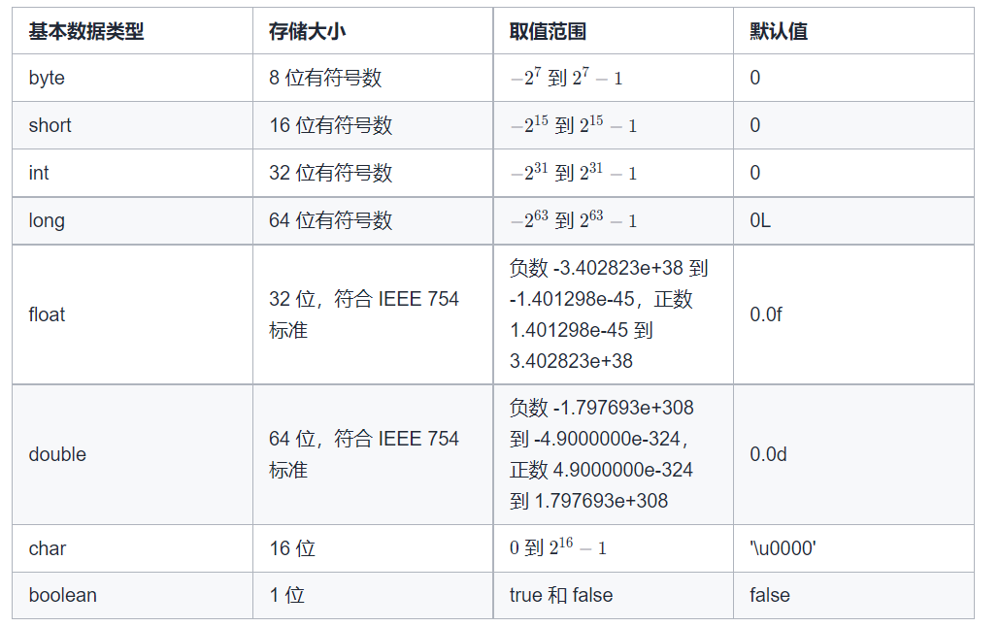
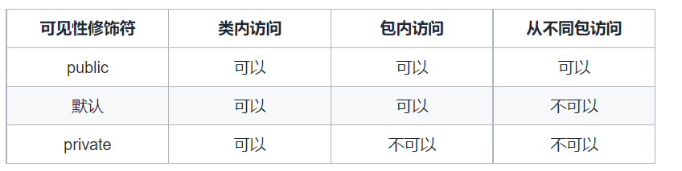
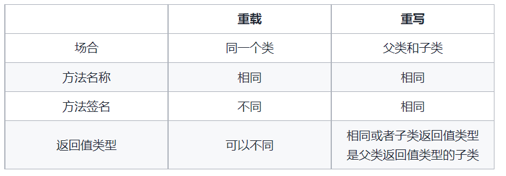
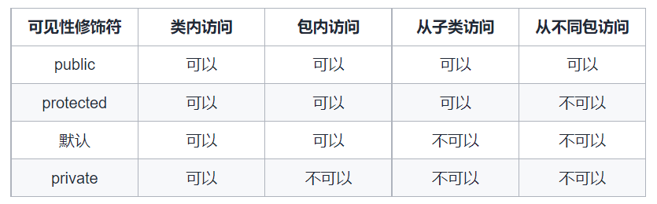

# 基础语法

## 基本数据结构

Java 的基本数据类型有 8 种，包括 6 种数字类型、1 种字符类型和 1 种布尔类型。

### 基本数据类型总览

数字类型包括 4 种整数类型和 2 种浮点数类型，4 种整数类型是` byte、short、int 和 long`，2 种浮点数类型是 `float` 和 `double`。

字符类型是 `char`，用于表示单个字符。Java 使用统一码对字符进行编码。

布尔类型是 `boolean`，包括 `true` 和 `false` 两种取值。




### 数字类型直接量

直接量是在程序中直接出现的常量值。

将整数类型的直接量赋值给整数类型的变量时，只要直接量没有超出变量的取值范围，即可直接赋值，如果直接量超出了变量的取值范围，则会导致编译错误。

整数类型的直接量默认是 `int` 类型，如果直接量超出了 int 类型的取值范围，则必须在其后面加上字母 L 或 l，将直接量显性声明为 `long` 类型，否则会导致编译错误。

浮点类型的直接量默认是 double 类型，如果要将直接量表示成 `float` 类型，则必须在其后面加上字母 F 或 f。将 `double` 类型的直接量赋值给 `float` 类型的变量是不允许的，会导致编译错误。


### 基本数据类型之间的转换

有时需要把不同类型的值混合运算，因此需要对数据类型进行转换。

#### 数字类型转换

不同的数字类型对应不同的范围，按照范围从小到大的顺序依次是：`byte、short、int、long、float、double`。

将小范围类型的变量转换为大范围类型称为拓宽类型，不需要显性声明类型转换。将大范围类型的变量转换为小范围类型称为缩窄类型，必须显性声明类型转换，否则会导致编译错误。

#### 字符类型与数字类型之间的转换

字符类型与数字类型之间可以进行转换。

将数字类型转换成字符类型时，只使用整数的低 16 位（浮点数类型将整数部分转换成字符类型）。

将字符类型转换成数字类型时，字符的统一码转换成指定的数值类型。如果字符的统一码超出了转换成的数值类型的取值范围，则必须显性声明类型转换。

#### 布尔类型不能与其他基本数据类型进行转换

布尔类型不能转换成其他基本数据类型，其他基本数据类型也不能转换成布尔类型。


## 方法

Java 中的方法，在其他语言中也可能被称为过程或函数，是为执行一个操作而组合在一起的语句组。如果一个操作会被多次执行，则可以将该操作定义成一个方法，执行该操作的时候调用方法即可。

#### 方法的语法结构

方法包括方法头和方法体，方法头又可以分成修饰符、返回值类型、方法名和参数列表，因此方法包括 5 个部分。

- 修饰符：修饰符是可选的，告诉编译器如何调用该方法。

+ 返回值类型：方法可以返回一个值，此时返回值类型是方法要返回的值的数据类型。方法也可以没有返回值，此时返回值类型是 `void`。

+ 方法名：方法的实际名称。

+ 参数列表：定义在方法头中的变量称为形式参数或参数，简称形参。当调用方法时，需要给参数传递一个值，称为实际参数，简称实参。参数列表指明方法中的参数类型、次序和数量。参数是可选的，方法可以不包含参数。

+ 方法体：方法体包含具体的语句集合。

方法名和参数表共同构成**方法签名**。


#### 参数的值传递

调用方法时，需要提供实参，实参必须与形参的次序相同，称为参数顺序匹配。实参必须与方法签名中的形参在次序上和数量上**匹配**，在类型上**兼容**，兼容的意思是不需要显性声明类型转换，即类型相同或者类型转换为拓宽类型。

在调用带参数的方法时，实参的**值**赋给形参，称为值传递。Java 中只有值传递，无论形参在方法中如何改变，实参不受影响。

+ 当参数类型是基本数据类型时，传递的是实参的值，因此不能对实参进行修改。

+ 当参数类型是对象时，传递的是对象的引用，此时可以对实参引用的对象进行修改，但是不能让实参引用新的对象。

#### 方法的重载

方法的重载是指在同一个类中的多个方法有相同的名称，但是方法签名不同，编译器能够根据方法签名决定调用哪个方法。由于方法签名由方法名和参数表共同构成，因此方法的重载等同于多个方法有相同的名称和不同的参数列表。

方法的重载可以增加程序的可读性，执行相似操作的方法应该有相同的名称。

关于方法的重载，需要注意以下两点。

+ 方法签名只由方法名和参数列表共同构成，因此被重载的方法必须具有不同的参数列表，而不能通过不同的修饰符和返回值类型进行方法的重载。

+ 如果一个方法调用有多个可能的匹配，则编译器会调用最合适的匹配方法，如果编译器无法判断哪个方法最匹配，则称为歧义调用，会导致编译错误。


## 递归

程序调用自身的编程技巧称为递归。递归方法是直接或间接调用自身的方法。

#### 递归的要点

定义递归方法时，需要定义递归的初始状态、初始状态的处理和递归调用。

初始状态也称为终止条件，即最简单的情况，此时应该直接给出如何处理初始状态。

对于非初始状态，则需要进行递归调用，对子问题进行求解，直到初始状态，然后将结果返回给调用者，直到传回原始的调用者。

递归必须定义初始状态，且保证所有的递归调用都能到达初始状态，否则会发生无限递归，导致栈溢出。

#### 递归的优点

递归的优点是代码简洁且易于理解。如果问题满足递归的特点，即可以分解成子问题且子问题与原始问题相似，则可以使用递归给出自然、直接、简单的解法。

#### 递归的缺点

- 时间和空间的消耗比较大。每一次函数调用都需要在内存栈中分配空间，对栈的操作还需要时间，因此时间复杂度和空间复杂度都会比较高。

- 如果子问题之间存在重叠，则在不加记忆化的情况下，递归会产生重复计算，导致时间复杂度过高。

- 由于栈的空间有限，如果递归调用的次数太多，则可能导致调用栈溢出。

#### 尾递归

当递归调用是方法中最后执行的语句且它的返回值不属于表达式的一部分时，这个递归调用就是尾递归。

尾递归的特点是在返回时直接传回原始的调用者，而不用经过中间的调用者，这个特点很重要，因为大多数现代的编译器会利用该特点自动生成优化的代码。

使用尾递归代替普通的递归，可以在时间和空间方面都带来显著的提升。


以下代码是计算斐波那契数的普通递归和尾递归的实现。

使用普通递归，会产生大量重复计算，导致时间复杂度过高。

使用尾递归，则不会有重复计算。


```java
public class Fibonacci {
    public static long fibonacci(long index) {
        if (index <= 1) {
            return index;
        } else {
            return fibonacci(index - 1) + fibonacci(index - 2);
        }
    }

    public static long fibonacciTailRecursion(long index) {
        return fibonacciTailRecursion(index, 0, 1);
    }

    public static long fibonacciTailRecursion(long index, int curr, int next) {
        if (index == 0) {
            return curr;
        } else {
            return fibonacciTailRecursion(index - 1, next, curr + next);
        }
    }
}

```


# 面向对象

## 面向对象的概念

### 面向对象和面向过程的区别

面向过程：将问题分解成步骤，然后按照步骤实现函数，执行时依次调用函数。数据和对数据的操作是分离的。

面向对象：将问题分解成对象，描述事物在解决问题的步骤中的行为。对象与属性和行为是关联的。

面向过程的优点是性能比面向对象高，不需要面向对象的实例化；缺点是不容易维护、复用和扩展。

面向对象的优点是具有封装、继承、多态的特性，因而容易维护、复用和扩展，可以设计出低耦合的系统；缺点是由于需要实例化对象，因此性能比面向过程低。

### 对象和类

对象是现实世界中可以明确标识的实体，对象有自己独有的状态和行为。对象的状态由数据域的集合构成，对象的行为由方法的集合构成。

类是定义同一类型对象的结构，是对具有相同特征的对象的抽象。类是一个模板，用来定义对象的数据域和方法。可以从一个类创建多个对象，创建对象称为实例化。


## 构造方法

构造方法是一种特殊的方法，调用构造方法可以创建新对象。构造方法可以执行任何操作，实际应用中，构造方法一般用于初始化操作，例如初始化对象的数据域。

### 定义和调用构造方法

构造方法的名称必须和构造方法所在类的名称相同。构造方法可以被重载，即允许在同一个类中定义多个参数列表不同的构造方法。

使用 new 操作符调用构造方法，通过调用构造方法创建对象。

### 默认构造方法

类可以不显性声明构造方法。此时类中隐性声明了一个方法体为空的没有参数的构造方法，称为默认构造方法。只有当类中没有显性声明任何构造方法时，才会有默认构造方法。

### 构造方法与普通方法的区别

构造方法与普通方法有三点区别。

构造方法的名称必须与所在的类的名称相同。

构造方法没有返回类型，包括没有 void。

构造方法通过 new 操作符调用，通过调用构造方法创建对象。


## 静态和实例

Java 的类成员（成员变量、方法等）可以是静态的或实例的。使用关键字 static 修饰的类成员是静态的类成员，不使用关键字 static 修饰的类成员则是实例的类成员。

### 静态和实例的区别

1. 外部调用
   从外部调用静态的类成员时，可以通过类名调用，也可以通过对象名调用。从外部调用实例的类成员，则只能通过对象名调用。

例如对于字符串类型 String，方法 format 是静态的，可以通过 String.format 调用，而方法 length 是实例的，只能通过 str.length 调用，其中 str 是 String 类型的实例。

建议通过类名调用静态的类成员，因为通过类名调用静态的类成员是不需要创建对象的，而且可以提高代码的可读性。

2. 内部访问
   静态方法只能访问静态的类成员，不能访问实例的类成员。实例方法既可以访问实例的类成员，也可以访问静态的类成员。

为什么静态方法不能访问实例的类成员呢？因为实例的类成员是依赖于具体对象（实例）的，而静态方法不依赖于任何实例，因此不存在静态方法直接或间接地访问实例或实例的类成员的情况。

### 判断使用静态或实例

如何判断一个类成员应该被定义成静态的还是实例的呢？取决于类成员是否依赖于具体实例。如果一个类成员依赖于具体实例，则该类成员应该被定义成实例的类成员，否则就应该被定义成静态的类成员。

例如对于字符串类 String，考虑方法 format 和方法 length。

方法 format 的作用是创建格式化的字符串，该方法不依赖于任何 String 的实例，因此是静态方法（类成员）。

方法 length 的作用是获得字符串的长度，由于字符串的长度依赖于具体字符串，因此该方法依赖于 String 的实例，是实例方法（类成员）。

对于数学类 Math，所有的类成员都不依赖于具体的实例，因此都被定义成静态的类成员。


## 初始化块

代码初始化块属于类成员，在加载类时或创建对象时会隐式调用代码初始块。使用初始化块的好处是可以减少多个构造器内的重复代码。

### 初始化块的分类

初始化块可以分成静态初始化块和非静态初始化块，前者在加载类时被隐式调用，后者在创建对象时被隐式调用。

### 单个类的初始化块的执行顺序

如果有初始化块，则初始化块会在其他代码之前被执行。具体而言，静态初始化块会在静态方法之前被执行，非静态初始化块会在构造器和实例方法之前被执行。

由于静态初始化块在加载类时被调用，因此静态初始化块会最先执行，且只会执行一次。

由于非静态初始化块在创建对象时被调用，因此每次创建对象时都会执行非静态初始化块以及执行构造器。非静态初始化块的执行在静态初始化块的执行之后、构造器的执行之前。

### 存在继承关系的初始化块的执行顺序

如果存在继承关系，则在对子类进行类的加载和创建对象时，也会对父类进行类的加载和创建对象。执行顺序仍然是静态初始化块、非静态初始化块、构造器，由于存在继承关系，因此情况较为复杂。

对于两个类的情况，即一个父类和一个子类，执行顺序如下。

1. 执行父类的静态初始化块。

2. 执行子类的静态初始化块。

3. 执行父类的非静态初始化块。

4. 执行父类的构造器。

5. 执行子类的非静态初始化块。

6. 执行子类的构造器。

更一般的情况，对于多个类之间的继承关系（可能超过两个类，例如 B 继承了 A，C 继承了 B），执行顺序如下。

1. 按照从父类到子类的顺序，依次执行每个类的静态初始化块。

2. 按照从父类到子类的顺序，对于每个类，依次执行非静态初始化块和构造器，然后执行子类的非静态初始化块和构造器，直到所有类执行完毕。


## 关键字 this

关键字 this 代表当前对象的引用。当前对象指的是调用类中的属性或方法的对象。

### 关键字 this 用于引用隐藏变量

在方法和构造方法中，可能将属性名用作参数名，在这种情况下，需要引用隐藏的属性名才能给属性设置新值。例如，当属性名和参数名都是 var 时，需要通过 this.var = var 对属性进行赋值。

当方法内部有局部变量和属性名相同时，同样需要通过关键字 this 引用对象的属性。

如果方法内部不存在和属性名相同的局部变量，则在使用属性时，属性前面的 this 可以省略。

### 关键字 this 用于调用其他构造方法

在构造方法中，可以通过关键字 this 调用其他构造方法，具体用法是 this(参数列表)。

Java 要求，在构造方法中如果使用关键字 this 调用其他构造方法，则 this(参数列表) 语句必须出现在其他语句之前。

### 关键字 this 不能在静态代码块中使用

由于关键字 this 代表的是对象的引用，因此依赖于具体对象，而静态方法和静态初始化块不依赖于类的具体对象，因此静态方法和静态初始化块中不能使用关键字 this。


## 可见性修饰符和数据域封装

Java 的可见性修饰符用于控制对类成员的访问。可见性修饰符包括 public、private、protected 和默认修饰符，此处介绍 public、private 和默认修饰符，protected 将在继承和多态部分介绍。

### 不同的可见性修饰符的含义

可见性修饰符 public 表示类成员可以在任何类中访问。

可见性修饰符 private 表示类成员只能从自身所在的类中访问。

如果不加任何可见性修饰符，则称为默认修饰符，表示类成员可以在同一个包里的任何类中访问，此时也称为包私有或包内访问。

以上三种可见性修饰符定义的类成员的可见性如下面的表格所示。




### 数据域封装

可见性修饰符可以用于控制对类成员的访问，也可以用于对数据域进行封装。

数据域封装的含义是，对数据域使用 private 修饰符，将数据域声明为私有域。如果不使用数据域封装，则数据域的值可以从类的外部直接修改，导致数据被篡改以及类难以维护。使用数据域封装的目的是为了避免直接修改数据域的值。

在定义私有数据域的类之外，不能通过直接引用的方式访问该私有数据域，但是仍然可能需要读取和修改数据域的值。为了能够读取私有数据域的值，可以编写 get 方法（称为读取器或访问器）返回数据域的值。为了能够修改私有数据域的值，可以编写 set 方法（称为设置器或修改器）将数据域的值设置为新值。


## 字符串

字符串是常用的数据类型。在 Java 中，常见的字符串类型包括 String、StringBuffer 和 StringBuilder。

### String

从 String 的源码可以看到，String 使用数组存储字符串的内容，数组使用关键词 final 修饰，因此数组内容不可变，使用 String 定义的字符串的值也是不可变的。

由于 String 类型的值不可变，因此每次对 String 的修改操作都会创建新的 String 对象，导致效率低下且占用大量内存空间。

### StringBuffer 和 StringBuilder

StringBuffer 和 StringBuilder 都是 AbstractStringBuilder 的子类，同样使用数组存储字符串的内容，由于数组没有使用关键词 final 修饰，因此数组内容可变，StringBuffer 和 StringBuilder 都是可变类型，可以对字符串的内容进行修改，且不会因为修改而创建新的对象。

在需要经常对字符串的内容进行修改的情况下，应使用 StringBuffer 或 StringBuilder，在时间和空间方面都显著优于 String。

StringBuffer 和 StringBuilder 有哪些区别呢？从源码可以看到，StringBuffer 对定义的方法或者调用的方法使用了关键词 synchronized 修饰，而 StringBuilder 的方法没有使用关键词 synchronized 修饰。由于 StringBuffer 对方法加了同步锁，因此其效率略低于 StringBuilder，但是在多线程的环境下，StringBuilder 不能保证线程安全，因此 StringBuffer 是更优的选择。

### 总结

1. String 是不可变类型，每次对 String 的修改操作都会创建新的 String 对象，导致效率低下且占用大量内存空间，因此 String 适用于字符串常量的情形，不适合需要对字符串进行大量修改的情形。

2. StringBuffer 是可变类型，可以修改字符串的内容且不会创建新的对象，且 StringBuffer 是线程安全的，适用于多线程环境。

3. StringBuilder 是可变类型，与 StringBuffer 相似，在单线程环境下 StringBuilder 的效率略高于 StringBuffer，但是在多线程环境下 StringBuilder 不保证线程安全，因此 StringBuilder 不适合多线程环境。


## 继承

在面向对象程序设计中，可以从已有的类（父类）派生出新类（子类），称为继承。

### 父类和子类

如果已有的类 C1 派生出一个新类 C2，则称 C1 为 C2 的父类，C2 为 C1 的子类。子类从父类中继承可访问的类成员，也可以添加新的类成员。子类通常包含比父类更多的类成员。

继承用来为 is-a 关系建模，子类和父类之间必须存在 is-a 关系。

如果一个类在定义时没有指定继承，它的父类默认是 Object。

### 关键字 super

关键字 super 指向当前类的的父类。关键字 super 可以用于两种途径，一是调用父类的构造方法，二是调用父类的方法。

调用父类的构造方法，使用 super() 或 super(参数)，该语句必须是子类构造方法的第一个语句，且这是调用父类构造方法的唯一方式。

调用父类的方法，使用 super.方法名(参数)。

### 构造方法链

如果构造方法没有显式地调用同一个类中其他的构造方法或父类的构造方法，将隐性地调用父类的无参数构造方法，即编译器会把 super() 作为构造方法的第一个语句。

构造一个类的实例时，将会沿着继承链调用所有父类的构造方法，父类的构造方法在子类的构造方法之前调用，称为构造方法链。

下面用一个例子说明构造方法链。考虑如下代码。

```java
public class Class3 extends Class2 {
    public static void main(String[] args) {
        new Class3();
    }

    public Class3() {
        System.out.println("D");
    }
}

class Class2 extends Class1 {
    public Class2() {
        this("B");
        System.out.println("C");
    }

    public Class2(String s) {
        System.out.println(s);
    }
}

class Class1 {
    public Class1() {
        System.out.println("A");
    }
}
```

由于 Class2 是 Class1 的子类，Class3 是 Class2 的子类，因此在 Class3 的构造方法中的所有语句运行之前，先调用 Class2 的无参数构造方法。Class2 的无参数构造方法调用了有参数构造方法，在 Class2 的有参数构造方法中的所有语句运行之前，先调用 Class1 的无参数构造方法。因此，运行上述代码得到的输出结果是：

```java
A
B
C
D
```


### 方法的重写

子类从父类中继承方法。如果子类修改了父类中定义的方法，则称为方法重写。方法重写要求子类的方法和父类的方法的签名相同。

如果方法的返回值类型是基本数据类型或者 void，则要求子类的方法的返回值类型和父类的方法的返回值类型相同。如果方法的返回值类型是引用类型，则要求返回值类型相同或者子类的方法的返回值类型是父类的方法的返回值类型的子类。

实例方法只有当可访问时才能被重写。由于私有方法不能在定义该方法的类外访问，因此私有方法不能被重写。

静态方法可以被继承，但是不能被重写。

### 重写和重载的区别

重载指在同一个类中定义多个方法，这些方法有相同的名称，但是方法签名不同。

重写指在子类中定义一个方法，该方法与父类中的方法的签名相同，返回值类型相同或者子类的方法的返回值类型是父类的方法的返回值类型的子类。

下面的表格概括了重载和重写的区别。




### 可见性修饰符 protected

之前已经介绍了三种可见性修饰符：public、private 和默认修饰符，此处介绍第四种可见性修饰符：protected。

可见性修饰符 protected 的可见性在 public 和默认之间，表示类成员可以在同一个包里的任何类中访问，也可以在该类的子类中访问。

四种可见性修饰符定义的类成员的可见性如下面的表格所示。



子类可以覆盖父类的 protected 方法，并把该方法的可见性改成 public。但是子类不能降低父类方法的可见性，即不能把父类的 public 方法的可见性改成 protected。

### 关键字 final

关键字 final 可以用于声明常量，表示常量不会改变。

关键字 final 也可以用于修饰类和方法。使用 final 修饰的类是终极类，不能被继承。使用 final 修饰的方法不能被子类重写。

例如，String、StringBuffer 和 StringBuilder 类都使用了关键字 final 修饰，因此这些类不能被继承。

