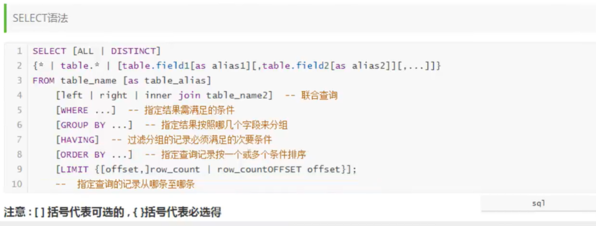
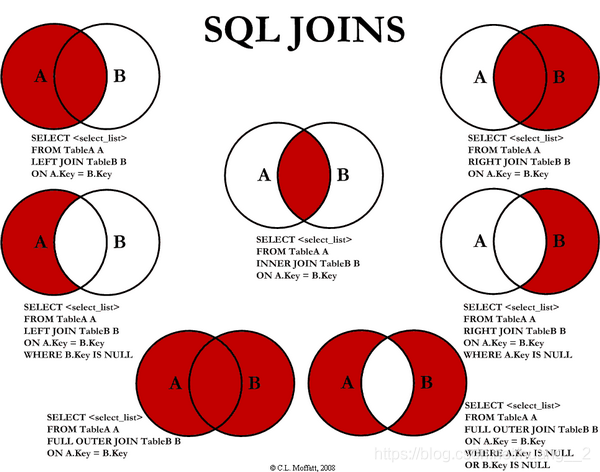
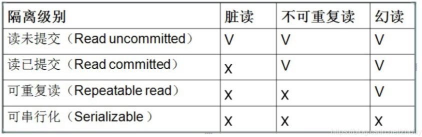
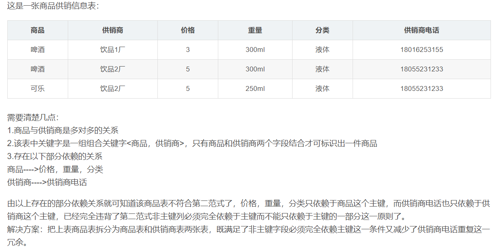
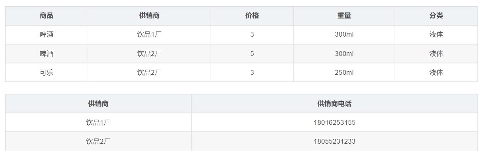
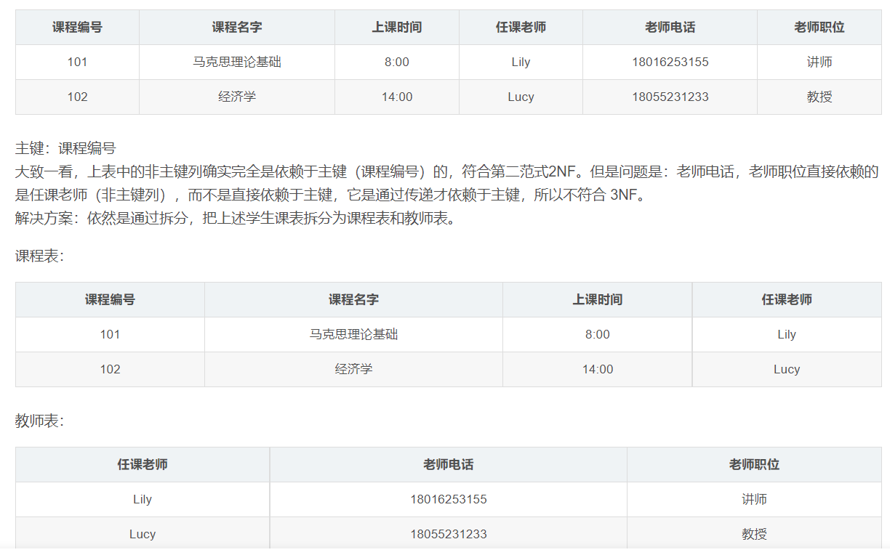
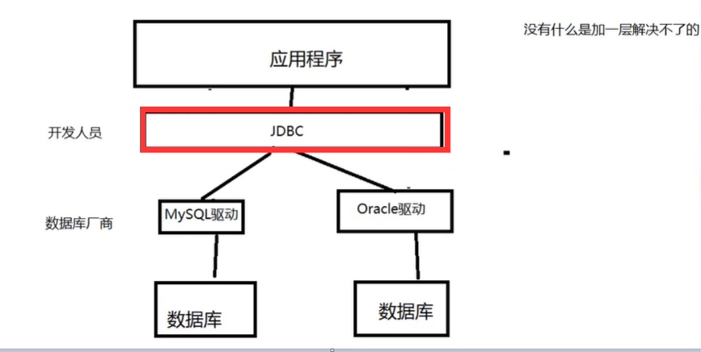

[TOC]


## 1.初识MySQL

JavaEE：企业级Java开发 web

前端（页面：展示数据）

后台（连接点：连接数据库，连接前端）

数据库（存数据）


### 1.1 为什么学习数据库

1. 岗位需求

2. 数据时代

3. 需求：存数据
4. ==数据是所有软件体系中最核心的存在==


### 1.2 什么是数据库

数据库（DB：DataBase）

概念：数据仓库，软件，安装在操作系统之上的。

作用：存储数据，管理数据


### 1.3 数据库分类

##### 关系型数据库：（SQL）

+ MySQL，Oracle，SQL server，DB2
+ 通过表和表之间，行和列之间的关系进行数据的存储

##### 非关系型数据库：（Nosql） Not only

+ Redis，MongDB
+ 非关系型数据库，对象存储，通过对象的自身属性来决定

==**DBMS**==（数据库管理系统）

+ 数据库的管理软件，科学有效的管理数据。


### 1.4 MySQL简介

是一个关系型数据库管理系统

体积小、速度快、总体拥有成本低。

官网：https://www.mysql.com/

安装建议：尽量不要用exe，注册表。尽可能使用压缩包安装。


**数据库xxxx语言**	CRUD 增删改查

DDL 定义

DML 操作

DQL 查询

DCL 控制

##### **Navicat**如看查看历史日志

ctrl+h


-----------------

## 2.操作数据库

操作数据库→操作数据库中的表→操作表中的数据

==mysql关键字不区分大小写==


### 2.1 操作数据库【了解】

1. #### 创建数据库

   ```sql
   CREATE DATABASE [if not EXISTS] westos
   ```

   

2. #### 删除数据库

   ```sql
   DROP DATABASE  IF EXISTS  westos 
   ```

   

3. #### 使用数据库

   如果表明或字段名是特殊字符，使用时要用``

   ```sql
   USE ssmi
   ```

   

4. #### 查看数据库

   ```sql
   SHOW DATABASES  -- 查看所有的数据库
   ```

   

学习思路：

+ 不会的语句使用可视化操作查看sql
+ 固定的语法或关键字必须强行记住


### 2.2 数据库的数据类型【了解】

> 数值

+ tinyint：十分小的数据	1个字节
+ smallint：较小的数据	2个字节
+ mediumint：中等大小数据    3个字节
+ **int：标准整数	4个字节**    常用
+ big：较大的数据    8个字节
+ float：浮点数    4个字节
+ double：浮点数    8个字节（精度问题）
+ decimal：字符串形式浮点数    金融计算使用一般会使用


> 字符串

+ char：字符串固定大小    0~255
+ varchar：可变字符串    0~65535 常用的变量 String
+ tinytext：微型文本    2^8^-1

+ text：文本串    2^16^ -1    保存大文本


> 时间日期

+ date：YYYY-MM-DD    日期格式
+ time：HH:mm:ss    时间格式
+ **datetime：YYYY-MM-DD  HH:mm:ss   最常用的时间格式**
+ timestamp：时间戳，1970.1.1到现在的毫秒数   也较为常用
+ year：年份表示


> null

+ 没有值，未知
+ ==注意，不要使用NULL进行运算==


### 2.3 数据库的字段属性【重点】

==Unsigned：==

+ 无符号整数
+ 不能声明为负数

==zerofill==：

+ 0填充的
+ 不足的位数，使用0来填充

==自增AUTO_INCREMENT：==

+ 自动在上一条记录的基础上+1
+ 通常用来设置唯一主键，必须是整数类型
+ 可以自定义设计主键自增的起始值

==非空：NULL NOT NULL==

+ 假设设置为not null，如果不给它赋值，就会报错
+ NULL，如果不填写值，默认NULL

==默认==：

+ 设置默认的值！


每一个表都必须存在以下五个字段，未来做项目用，表示一个记录存在的意义

id 主键

`version` 乐观锁

is_delete 伪删除

gmt_create 创建时间

gmt_update 修改时间


### 2.4 创建数据库表【重点】

```sql
-- 注意点，使用英文（），表的名称和字段尽量使用``括起来
-- AUTO_INCREMENT自增
-- 字符串用单引号括起来
-- 所有语句后面加,最后一个不用加
-- PRIMARY KEY 主键
CREATE TABLE IF NOT EXISTS `student`(
	`id` INT(4) NOT NULL AUTO_INCREMENT COMMENT '学号',
	`name` VARCHAR(30) NOT NULL DEFAULT '匿名' COMMENT '姓名',
	`pwd` VARCHAR(20) NOT NULL DEFAULT '123456' COMMENT '密码',
	`gender` VARCHAR(2) NOT NULL DEFAULT '女' COMMENT '性别',
	`birthday` datetime DEFAULT NULL COMMENT '出生日期',
	`address` VARCHAR(100) DEFAULT NULL COMMENT '家庭住址',
	`email` VARCHAR(50) DEFAULT NULL COMMENT '电子邮箱',
	PRIMARY KEY(`id`)
)ENGINE=INNODB DEFAULT CHARSET=utf8m
```

```sql
CREATE TABLE [IF NOT EXISTS] `表名`(
	`字段名` 列类型[属性][索引][注释],
    `字段名` 列类型[属性][索引][注释],
    `字段名` 列类型[属性][索引][注释],
    ……   
)[表类型][字符集设置][注释]
```

```sql
SHOW CREATE DATABASE school -- 查看创建数据库的语句
SHOW CREATE TABLE student -- 查看创建表的定义语句
DESC student -- 显示表的结构
```


### 2.5 数据库表的类型

```sql
-- 关于数据库引擎
/*
INNODB 默认使用
MYISAM 早年使用
*/
```


|              | MYISAM | INNODB               |
| ------------ | ------ | -------------------- |
| 事务支持     | 不支持 | 支持                 |
| 数据行锁定   | 不支持 | 支持                 |
| 外键约束     | 不支持 | 支持                 |
| 全文索引     | 支持   | 不支持               |
| 表空间的大小 | 较小   | 较大，约为 MYISAM2倍 |

**常规使用操作：**

+  MYISAM：节约空间，速度较快
+ INNODB：安全性高，事务处理，多表多用户操作

> 在物理空间存在的位置

所有的数据库文件都存在data目录下，本质还是文件的存储

**mysql引擎在物理文件上的区别**

+   INNODB在数据库表中只有一个*.frm文件，以及上级目录下的ibdata1文件

  MySQL-8.0没有.frm表结构文件，并入.ibd文件中了

+ MYISAM对应文件
  + *.frm-表结构定义文件
  + *.MYD 数据文件（data）
  + *.MYI 索引（index）

**设置数据库表的字符集编码**

```sql
CHARSET=utf8
```

不设置的话，会是mysql默认的字符集编码~（不支持中文）

MySQL默认编码是Latin1

在my.ini中配置默认的编码

```sql
character-set-server=utf8
```


### 2.6 修改和删除表

```sql
-- 修改表名 
ALTER TABLE 旧表名 RENAME AS 新表名

-- 增加表的字段
-- ALTER TABLE 表名 ADD 字段名 列属性
ALTER TABLE teacher1 ADD age int(11)

-- 修改表的字段（重命名，修改约束）
-- 修改约束 MODIFY
-- ALTER TABLE 表名 MODIFY 字段名 列属性
ALTER TABLE teacher1 MODIFY age VARCHAR(11)
-- 字段重命名 CHANGE
-- ALTER TABLE 表名 CHANGE 旧字段名 新字段名 [列属性]
ALTER TABLE teacher1 CHANGE age age1 INT(1)

-- 删除表的字段 DROP
-- ALTER TABLE 表名 DROP 字段名
ALTER TABLE teacher1 DROP age1

-- 删除表(如果表存在删除)
-- DROP TABLE IF EXISTS 表名
DROP TABLE IF EXISTS teacher1
```

==所有的创建和删除操作尽量加上判断，以免报错==

注意点：

+ ``所有字段名，使用反引号包裹
+ 注释   --  /**/
+ sql关键字大小写不敏感，建议小写


-----------------------

## 3.MySQL数据管理


### 3.1 外键（了解）

方式一：在创建表的时候增加约束

```sql
CREATE TABLE `grade` (
`gradeid` INT ( 10 ) NOT NULL AUTO_INCREMENT COMMENT '年级id',
`gradename` VARCHAR ( 50 ) NOT NULL COMMENT '年级名称',
PRIMARY KEY ( `gradeid` ) 
) ENGINE = INNODB DEFAULT CHARSET = utf8


-- 学生表的gradeid字段 要去引用年级表的gradeid
-- 定义外键key
-- 给这个外键添加约束
CREATE TABLE IF NOT EXISTS `student`(
	`id` INT(4) NOT NULL AUTO_INCREMENT COMMENT '学号',
	`name` VARCHAR(30) NOT NULL DEFAULT '匿名' COMMENT '姓名',
	`pwd` VARCHAR(20) NOT NULL DEFAULT '123456' COMMENT '密码',
	`gender` VARCHAR(2) NOT NULL DEFAULT '女' COMMENT '性别',
	`birthday` datetime DEFAULT NULL COMMENT '出生日期',
	`gradeid` int(10) NOT NULL COMMENT '学生的年级',
	`address` VARCHAR(100) DEFAULT NULL COMMENT '家庭住址',
	`email` VARCHAR(50) DEFAULT NULL COMMENT '电子邮箱',
	PRIMARY KEY(`id`),
	KEY `FK_gradeid` (`gradeid`),
	CONSTRAINT `FK_gradeid` FOREIGN KEY (`gradeid`) REFERENCES `grade`(`gradeid`)
)ENGINE=INNODB DEFAULT CHARSET=utf8
```

删除有外键关系的表的时候，必须要删除引用别人的表（从表），在删除被引用的表（主表）

alter table 从表 add constraint 外键（形如：FK_从表 _主表） foreign key (从表外键字段) references 主表(主键字段);

```sql
-- 创建表的时候没有外键关系
ALTER TABLE `student`
ADD CONSTRAINT `FK_gradeid` FOREIGN KEY(`gradeid`) REFERENCES `grade`(`gradeid`);
```

以上操作都是物理外键，数据库级别的外键，不建议使用（避免数据库过多造成困扰），了解即可

+ 数据库就是单纯的表，只用来存数据，只有行（数据）和列（字段）
+ 我们想使用多张表的数据，想使用外键（用程序去实现）


### 3.2 DMA语言（重点）

数据意义：数据存储，数据管理

DML：数据操作语言

+ insert
+ update
+ delete


### 3.3 添加

```sql
-- 插入语句（添加）
-- INSERT INTO 表名([字段名1,字段名2,字段名3]) VALUES('值1'),('值2'),('值3')
INSERT INTO `grade`(`gradename`) VALUES('大四')

-- 由于主键自增我们可以省略主键（如果不写表的字段，就会一一匹配）
INSERT INTO `grade` VALUES('大三')

-- 一般写插入语句，我们一定要数据和字段一一对应

-- 插入多个字段数据数据
INSERT INTO `grade`(`gradename`) 
VALUES('大二'),('大一')


INSERT INTO `student`(`name`,`pwd`,`gender`) 
VALUES('张三','aaaaaa','男')
INSERT INTO `student`(`name`,`pwd`,`gender`) 
VALUES('李四','aaaaaa','男'),('王五','aaaaaa','男')
```

语法：

`INSERT INTO 表名([字段名1,字段名2,字段名3]) VALUES('值1'),('值2'),('值3')`

注意事项：

1. 字段和字段之间使用英文逗号隔开
2. 字段可以省略，值要一一对应
3. 可以同时插入多条数据`VALUES('值1'),('值2'),('值3')`


### 3.4 修改

**update 修改**：

修改谁（条件） set原来的值=新值

```sql
-- 修改学员名字,指定条件
UPDATE `student` SET `name` ='Kou' WHERE id=1

-- 不指定条件的下，会改动所有记录
UPDATE `student` SET `name`='Kou'

-- 语法：
-- UPDATE 表名 SET column_name=value,[column_name=value,.....] where[条件]
```

条件：where 子句 运算符 id等于大于小于某个值，在某个区间内修改

操作符返回布尔值

|      操作符      |    含义    | 范围  | 结果  |
| :--------------: | :--------: | :---: | :---: |
|        =         |    等于    |  5=6  | false |
|     <> 或!=      |   不等于   | 5<>6  | true  |
|        >         |            |       |       |
|        <         |            |       |       |
|        <=        |            |       |       |
|        >=        |            |       |       |
| BETWEEN...and... | 闭合区间[] | [2,5] |       |
|       AND        |    与&&    |       |       |
|        OR        |   或\|\|   |       |       |

```sql
-- 通过多个条件定位数据

UPDATE `student` SET `name` = 'Kou1998' 
WHERE`name` = 'Kou' AND `gender` = '女'
```

`-- UPDATE 表名 SET column_name=value,[column_name=value,.....] where[条件]`

注意：

+ column_name是字段名
+ 条件，筛选的条件，如果没有指定，则会修改所有的列
+ value，是一个具体的值，也可以是一个变量


### 3.5 删除

**delete**

语法：

`delete from 表名 [where 条件]`

```sql
-- 删除数据 (避免这样写)
DELETE FROM `student` 
-- 删除指定数据
DELETE FROM `student` WHERE `id` =1
```


> TRUNCATE
>
> 作用：完全清空一个表，表的结构和索引约束不会变


> DELETE FROM `student` 与TRUNCATE区别

+ 相同点：都能删除数据，都不会删除表结构
+ 不同点：
  + TRUNCATE会重新设置自增列，计数器会归零
  + TRUNCATE不会影响事务

了解：（5.7版）

- 如果表引擎为INNODB  自增列会从1重新开始 （存在内存当中的，断电即失）
- 如果表引擎为MyISAM   会自动从上一个自增量开始 （存在文件中的，不会丢失）


---------------------------

## 4.==DQL查询数据（最重点）==




### 4.1 DQL（数据查询语言）

+ 所有的查询操作都用它 select
+ 简单的查询，复杂的查询它都能做~
+ ==数据库中最核心的语言，最重要的语句==
+ 使用频率最高的语句


### 4.2 指定查询字段

```sql
-- 查询全部的学生 SELECT 字段 FROM 表名
SELECT * FROM `student`
SELECT * FROM `result`

-- 查询指定字段
SELECT `studentno`,`studentname` FROM `student`

-- 别名，给结果起一个名字
-- 可以给字段起别名，也可以给表起别名
SELECT `studentno` AS 学号,`studentname` AS 学生姓名 FROM `student` AS 学生

-- 函数 CONCAT(str1,str2)
-- 字符串连接
SELECT CONCAT('姓名: ',studentname) AS 新名字 FROM `student`
```

语法：`SELECT 字段 FROM 表名`

> 有时候，列名字不是那么见名知意 我们可以起别名==AS==
>
> `字段名 as 别名     表名 as 别名`


#### 4.2.1 去重（distinct）

作用：去除select查询出来的结果中重复的数据，重复的数据只显示一条

```sql
-- 查询一下有哪些同学参加了考试，成绩
-- 查询全部的考试成绩
SELECT * FROM `result` 
-- 查询有哪些同学参加了考试
SELECT `studentno` FROM `result` 
-- 发现重复数据，去重
SELECT DISTINCT `studentno` FROM `result`
```


#### 4.2.2 数据库中的列（表达式）

```sql
-- 查询系统版本(函数)
SELECT VERSION()
-- 用来计算（表达式）
SELECT 100*3-1 as 计算结果
-- 查询自增步长（变量）
SELECT @@auto_increment_increment

-- 学院考试成绩+1分 查看
SELECT `studentno`,`studentresult`+1 as '提分后' FROM result
```

==数据库中的表达式：文本值，列，Null，函数，计算表达式，系统变量....==

select `表达式` from 表


## 4.3 where条件子句

作用：检索数据中<u>符合条件</u>的值

搜索的条件中由一个或多个表达式组成，结果是一个布尔值

> 逻辑运算符

| 运算符  |      语法      |  描述  |
| :-----: | :------------: | :----: |
| and &&  | a and b  a &&b | 逻辑与 |
| or \|\| | a or b  a\|\|b | 逻辑或 |
|   Not   |  not a    ! a  | 逻辑非 |

==尽量使用英文字符==

```sql
-- ==============WHERE==================
SELECT `studentno`,`studentresult` FROM `result`

-- 查询考试成绩在95~100分之间 三种方法
SELECT `studentno`,`studentresult` FROM `result`
WHERE `studentresult`>=95 AND `studentresult`<=100 


SELECT `studentno`,`studentname` FROM `student`
WHERE `gradeid`=2

-- and &&
SELECT `studentno`,`studentresult` FROM `result`
WHERE `studentresult`>=95 &&`studentresult`<=100


-- 模糊查询(区间) BETWEEN AND
SELECT `studentno`,`studentresult` FROM `result`
WHERE `studentresult` BETWEEN 95 AND 100

-- 除了1000号学生之外的同学的成绩
SELECT `studentno`,`studentresult` FROM `result`
WHERE `studentno`!=1000

-- !=   NOT  
SELECT `studentno`,`studentresult` FROM `result`
WHERE NOT `studentno`=1000

-- != <>
SELECT `studentno`,`studentresult` FROM `result`
WHERE `studentno`<>1000
```


#### 4.3.1 模糊查询

**比较运算符**

|   运算符    |       语法        |             描述             |
| :---------: | :---------------: | :--------------------------: |
|   IS NULL   |     a IS NULL     |   操作数值为NULL，结果为真   |
| IS NOT NULL |   a IS NOT NULL   | 如果操作数值为NULL，结果为真 |
|   BETWEEN   | a BETWEEN b AND c |   若a在b和c之间，结果为真    |
|  **LIKE**   |     a like b      | SQL匹配，若a匹配b，结果为真  |
|   **IN**    | a IN（a1,a2,...） | 假设a在a1，a2...中，结果为真 |

**LIKE 结合 %(代表0-任意个字符)  _（一个字符）**

```sql
-- =============模糊查询===========
-- 查询姓寇的同学
-- LIKE 结合 %(代表0-任意个字符)  _（一个字符）
SELECT `studentno`,`studentname` FROM `student`
WHERE studentname LIKE '寇%'

-- 查询姓寇的同学，名字后面只有一个字的
SELECT `studentno`,`studentname` FROM `student`
WHERE `studentname` LIKE '寇_'

-- 查询姓寇的同学，名字后面只有两个个字的
SELECT `studentno`,`studentname` FROM `student`
WHERE `studentname` LIKE '寇__'

-- 查询名字中间有超字的同学
SELECT `studentno`,`studentname` FROM `student`
WHERE `studentname` LIKE '%超%'


-- =============IN===============
-- 查询 1001，1002，1003号学员
SELECT `studentno`,`studentname` FROM `student`
WHERE `studentno`IN(1001,1002,1003)

-- 查询在北京朝阳的学生
SELECT `studentno`,`studentname` FROM `student`
WHERE `address` IN('北京朝阳')


-- ========null  not null=======

-- 查询地址为空的地址null ''
SELECT `studentno`,`studentname` FROM `student`
WHERE `address`='' OR `address` IS NULL

-- 查询有出生日期的同学   不为空
SELECT `studentno`,`studentname` FROM `student`
WHERE 'borndate' IS NOT NULL
```


### 4.4 ==联表查询(重要)==



```sql
-- ==========联表查询==========
-- 查询参加了考试的同学（学号，姓名，科目编号，分数）
/*
思路
1. 分析需求，分析查询的字段来自哪张表（连接查询）
2. 确定使用哪种连接查询？7种
确定交叉点（两个表中哪个数据是相同的）
判断的条件：学生表中的studentno=成绩表studentno
*/
-- JOIN ON 联结查询
-- where 等值查询
-- INNER JOIN
SELECT s.`studentno`,`studentname`,`subjectno`,`studentresult`
FROM `student` as s
INNER JOIN `result` as r
ON s.studentno=r.studentno

-- RIGHT JOIN
SELECT s.`studentno`,`studentname`,`subjectno`,`studentresult`
FROM `student` as s
RIGHT JOIN `result` as r
ON s.studentno=r.studentno

-- LEFT JOIN
SELECT s.`studentno`,`studentname`,`subjectno`,`studentresult`
FROM `student` as s
LEFT JOIN `result` as r
ON s.studentno=r.studentno

-- 查询缺考的同学
SELECT s.`studentno`,`studentname`,`subjectno`,`studentresult`
FROM `student` as s
LEFT JOIN `result` as r
ON s.studentno=r.studentno
WHERE studentresult IS NULL

-- 思考题（查询参加考试的同学信息：学号，学生姓名，科目名，分数）
SELECT s.`studentno`,`studentname`,`subjectname`,studentresult
FROM `student` s
RIGHT JOIN `result` r
ON s.`studentno`=r.`studentno`
INNER JOIN `subject` sub
ON r.`subjectno`=sub.`subjectno`
```

| 操作       | 描述                                                         |
| ---------- | ------------------------------------------------------------ |
| inner join | 如果表中至少有一个匹配，就返回行.内连接，又叫等值连接，只返回两个表中连接字段相等的行。 |
| left join  | 左连接，返回左表中所有的记录以及右表中连接字段相等的记录。   |
| right join | 右连接，返回右表中所有的记录以及左表中连接字段相等的记录。   |

数据库在通过连接两张或多张表来返回记录时，都会生成一张中间的临时表，然后再将这张临时表返回给用户。

在使用 **left jion** 时，**on** 和 **where** 条件的区别如下：

- 1、 **on** 条件是在生成临时表时使用的条件，它不管 **on** 中的条件是否为真，都会返回左边表中的记录。
- 2、**where** 条件是在临时表生成好后，再对临时表进行过滤的条件。这时已经没有 **left join** 的含义（必须返回左边表的记录）了，条件不为真的就全部过滤掉。


#### 4.4.1 自连接

使用的表：

```sql
CREATE TABLE `category`(
	`categoryid` INT(10) UNSIGNED NOT NULL AUTO_INCREMENT COMMENT '主题id',
	`pid` INT(10) NOT NULL COMMENT '父id',
	`categoryName` VARCHAR(50) NOT NULL COMMENT '主题名字',
	PRIMARY KEY(`categoryid`)
)ENGINE=INNODB auto_increment=9 DEFAULT CHARSET=utf8

INSERT INTO `category` (`categoryid`,`pid`,`categoryName`)
VALUES('2','1','信息技术'),
('3','1','软件开发'),
('4','3','数据库'),
('6','1','美术设计'),
('7','5','ps技术'),
('8','2','办公信息');
```


自己的表和自己的表连接，核心：==一张表拆为两张一样的表即可==

父类表

| categoryid | categoryName |
| ---------- | ------------ |
| 2          | 信息技术     |
| 3          | 软件开发     |
| 5          | 美术设计     |
|            |              |

子类

| pid  | categoryid | categoryName |
| ---- | ---------- | ------------ |
| 3    | 4          | 数据库       |
| 2    | 8          | 办公信息     |
| 3    | 6          | web开发      |
| 5    | 7          | ps技术       |

操作：查询父类对应的子类

| 父类     | 子类     |
| -------- | -------- |
| 信息技术 | 办公信息 |
| 软件开发 | 数据库   |
| 软件开发 | web开发  |
| 美术设计 | ps技术   |


### 4.5 分页与排序

```sql
-- ==========分页limit与排序order by===========

-- 排序：升序 asc，降序desc
-- ORDER BY通过哪个字段排序，怎么排
-- 查询结果根据降序排
SELECT s.`studentno`,`studentname`,`subjectname`,`studentresult`
FROM `student` s
INNER JOIN `result` r
ON s.`studentno`=r.`studentno`
INNER JOIN `subject` sub
ON r.`subjectno`=sub.`subjectno`
WHERE subjectname='高等数学-1'
ORDER BY studentresult DESC
```

```sql
-- 100万
-- 为什么要分页？
-- 缓解数据库压力，体验更好，    瀑布流

-- 分页，每页只显示五条数据
-- 语法：LIMIT 起始索引，页面的大小
-- LIMIT 0,5 1~5
-- LIMIT 1,5 2~6
SELECT s.`studentno`,`studentname`,`subjectname`,`studentresult`
FROM `student` s
INNER JOIN `result` r
ON s.`studentno`=r.`studentno`
INNER JOIN `subject` sub
ON r.`subjectno`=sub.`subjectno`
WHERE subjectname='高等数学-1'
ORDER BY studentresult ASC
LIMIT 5,5

-- 第一页 LIMIT 0,5	(1-1)*5
-- 第二页 LIMIT 5,5	(2-1)*5
-- 第三页 LIMIT 10,5 (3-1)*5
-- 第N页  LIMIT ?,5  (当前页-1)*分页大小 
```

 语法：`LIMIT 起始下标，页面的大小`


### 4.6 子查询

where（这个值是计算出来的）

本质：在where中嵌套一个子查询语句

where (select * from)

```sql
-- =======WHERE=============

-- 1. 查询高等数学-1的所有考试结果（学号，科目编号，成绩），降序排列
SELECT `studentno`,r.`subjectno`,`studentresult`
FROM `result` r
INNER JOIN `subject` sub
ON r.subjectno=sub.subjectno
WHERE subjectname='高等数学-1'
ORDER BY studentresult DESC

-- 方式二：使用子查询(由里即外)
SELECT `studentno`,`subjectno`,`studentresult`
FROM `result`
WHERE subjectno=(
	SELECT subjectno 
	FROM `subject` 
	WHERE subjectname='高等数学-1'
)
ORDER BY studentresult DESC

-- 查询所有考高等数学-1的学生学号
SELECT subjectno 
FROM `subject` 
WHERE subjectname='高等数学-1'

-- 分数不小于80分的学生的学号和姓名
SELECT DISTINCT s.`studentno`,`studentname`
FROM `student` s
INNER JOIN result r
on r.studentno=s.studentno
WHERE studentresult>=80

-- 嵌套
-- 在这个基础上增加一个科目，高等数学-1
SELECT DISTINCT s.`studentno`,`studentname`
FROM `student` s
INNER JOIN result r
on r.studentno=s.studentno
WHERE studentresult>=80 AND subjectno=(
	SELECT subjectno 
	FROM `subject`
	WHERE subjectname='高等数学-1'
)

-- 联表
-- 查询课程为高等数学-1且分数不小于80分的同学的学号和姓名
SELECT s.studentno,studentname
FROM student s
INNER JOIN result r
ON s.studentno=r.studentno
INNER JOIN `subject` sub
ON r.subjectno=sub.subjectno
WHERE subjectname IN('高等数学-1') 
AND studentresult>=80


-- 再改造
SELECT studentno,studentname
FROM student 
WHERE studentno IN(
	SELECT studentno 
	FROM result
	WHERE studentresult>=80 AND subjectno=(
		SELECT subjectno
		FROM `subject`
		WHERE subjectname='高等数学-1'
	)
)
```


------------------------

## 5.MySQL函数

https://dev.mysql.com/doc/refman/8.0/en/built-in-function-reference.html

### 5.1 常用函数

```sql
-- ===========常用函数================
-- 数学运算
-- 绝对值
SELECT ABS(-8)
-- 向上取整
SELECT CEILING(9.4)
-- 向下取整
SELECT FLOOR(9.4)
-- 返回一个0-1之间的随机数
SELECT RAND()
-- 判断一个数的符号 负数返回-1，正数返回1
SELECT SIGN(10)


-- 字符串函数
-- 字符串长度
SELECT CHAR_LENGTH('aaaaa')
-- 拼接字符串
SELECT CONCAT('我','爱','你们')
-- 插入，替换
SELECT INSERT('我爱编程hello world',1,0,'超级热爱')
-- 大小写转换
SELECT LOWER('ASD')
SELECT UPPER('dsad')
-- 返回子串第一次出现的索引
SELECT INSTR('Kou','u')
-- 替换指定字符
SELECT REPLACE('坚持就能成功','坚持','努力')

-- 时间函数
SELECT NOW()
```


### 4.7 分组和过滤

```sql
-- 查询不同课程的平均分，最高分，最低分，平均分要大于80

SELECT subjectname,AVG(studentresult) as 平均分,MAX(studentresult),MIN(studentresult)
FROM result r
INNER JOIN `subject` sub
ON r.subjectno=sub.subjectno
-- 通过什么字段来分组
GROUP BY r.subjectno
-- HAVING对分组后的数据进行筛选
HAVING 平均分>80
```


### 5.2 聚合函数(重要)

| 函数名称 | 描述   |
| -------- | ------ |
| COUNT()  | 计数   |
| SUM()    | 求和   |
| AVG()    | 平均值 |
| MAX()    | 最大值 |
| MIN()    | 最小值 |
| ....     |        |

```sql
-- ===========聚合函数=======
-- COUNT(字段)，会忽略所有的null值
SELECT COUNT(studentname) FROM student;
-- 不会忽略null值  本质：计算行数
SELECT COUNT(*) FROM student;
SELECT COUNT(1) FROM student;
```


### 5.3 MD5（扩展）

```sql
-- =======测试MD5加密========
CREATE TABLE `testmd5`(
	`id` INT(4) NOT NULL,
	`name` VARCHAR(20) NOT NULL,
	`pwd` VARCHAR(50) NOT NULL,
	PRIMARY KEY(`id`)
)ENGINE=INNODB CHARSET=utf8

-- 明文密码
INSERT into testmd5 
VALUES(1,'zhangsan','123456'),
(2,'lisi','123456'),
(3,'wangwu','123456');

-- 加密
UPDATE testmd5 set pwd=MD5(pwd)
WHERE id=1


-- 插入的时候加密
INSERT into testmd5 
VALUES(4,'zhangsan',MD5('123456'))


-- 如何校验？将用户传递进来的密码，进行MD5加密，然后比对加密后的值
SELECT * FROM testmd5
WHERE `name`='xiaoming' AND pwd=MD5('123456')
```


-----------------

## 6.==事务==(重点，面试经常问)

### 6.1 什么是事务

==**事务，只是一个操作的集合，是一个程序的执行单元**==

==要么都成功，要么都失败==

----------------

1. SQL执行   A给B转账  A 1000  -->200  B 200
2. SQL执行  B收到A的钱  A 800  -->  B 400

----------------

https://blog.csdn.net/dengjili/article/details/82468576

将一组SQL放在一个批次中去执行

> 事务原则：**ACID原则**：原子性，一致性，隔离性，持久性（脏读，幻读....）

+ ==原子性==：这两个步骤要么一起成功，要么一起失败，不能只发生其中一个动作。

+ ==一致性==：最终一致性。事务前后的数据完整性要保持一致。

+ ==持久性==：事务结束后的数据不随着外界原因导致数据丢失。事务没有提交，恢复原状。事务一旦提交就不可逆。

+ ==隔离性==：事物之间相互独立。多个用户同时操作，隔离开。


### 6.2 事务的隔离级别

> 一般情况下，多个单元操作并发执行，会出现这么几个问题

+ ==脏读==：指一个事务读取了另一个事务未提交的数据。（破坏了隔离性）

+ ==不可重复读==：A事务在本次事务中，对自己未操作过的数据，进行了多次读取，结果出现了不一致的情况。（破坏了一致性，update）

+ ==幻读==：A事务在本次事务中，对自己未操作过的数据，进行了多次读取，第一次读取时，记录不存在，第二次读取时，记录出现了。（破坏了一致性，insert，delete）

  

**解决（制定标准）**：

为了权衡隔离和并发矛盾，定义了四个事务的隔离级别。

+ 读未提交（read-uncommitted）：最低级别，只能保证持久性
+ 读已提交（read-committed）：语句级别
+ 可重复读（repeatable-read）：事务级别
+ 串行化（serializable）：最高级别，事务与事务完全串行化执行，毫无并发可言，性能极低。



这四个级别只是一个标准，各个数据库厂商，并不是完全按照这个标准执行


==**事务，只是一个操作的集合，是一个程序的执行单元**==，满足以上四个特性，可以称为是一个事务。

**事务处理**：可以用来维护数据库的完整性，他保证成批的MySQL操作要么完全执行，要么完全不执行。

+ 事务transaction：指一组SQL语句
+ 回退rollback：指撤销指定SQL语句的过程
+ 提交commit：指将未存储的SQL语句结果写入数据库表
+ 保留点savepoint：指事务处理中设置的临时占位符，可以对他发布回退


------------------

## 7.索引

> MySQL官方对索引的定义为：索引（index）是帮助MySQL高效获取数据的数据结构。提取句子主干，就可以获取索引的本质，索引是数据结构。

+ 主键索引
  + 唯一的标识，主键不可重复。非空且唯一
+ 唯一索引
  + 它通过确保表中没有两个数据行具有完全相同的键值来帮助维护数据完整性
+ 常规索引
  + 默认，key关键字设置
+ 全文索引
  + 在特定引擎下才有
  + 快速定位数据


```sql
CREATE TABLE `app_user`(
	`id` BIGINT(20) UNSIGNED NOT NULL AUTO_INCREMENT,
	`name` VARCHAR(50) DEFAULT '' COMMENT '用户昵称',
	`email` VARCHAR(50) NOT NULL COMMENT '用户邮箱',
	`phone` VARCHAR(20) DEFAULT '' COMMENT '手机号',
	`gender` TINYINT(4) UNSIGNED DEFAULT '0' COMMENT '性别（0:男；1:女）',
	`password` VARCHAR(100) NOT NULL COMMENT '密码',
	`age` TINYINT(4) DEFAULT '0' COMMENT '年龄',
	`create_time` DATETIME DEFAULT CURRENT_TIMESTAMP,
	`update_time` TIMESTAMP NULL DEFAULT CURRENT_TIMESTAMP ON UPDATE CURRENT_TIMESTAMP,
	PRIMARY KEY(`id`)
)ENGINE=INNODB DEFAULT CHARSET=utf8mb4 COMMENT='app用户表'

delimiter $$
set global log_bin_trust_function_creators=TRUE;
-- 写函数之前必须要写，标志
CREATE FUNCTION mock_data ()
RETURNS INT
BEGIN
DECLARE num INT DEFAULT 1000000;
DECLARE i INT DEFAULT 0;
WHILE i<num DO
INSERT INTO app_user ( `name`, `email`, `phone`, `gender`, `password`, `age` )
VALUES
	(
	CONCAT( '用户', i ),
	'123456@qq.com',
	CONCAT( '18', FLOOR( RAND( ) * ( ( 999999999-1000000000 ) + 100000000 ) ) ),
	FLOOR( RAND( ) * 2 ),
	UUID( ),
	FLOOR( RAND( ) * 100 ) 
	) ;
SET i=i+1;
END WHILE;
RETURN i;
END;

SELECT mock_data() -- 执行此函数 生成一百万条数据


EXPLAIN SELECT * FROM app_user
WHERE `name`='用户9999';

-- id_表名_字段名
-- CREATE INDEX 索引名 on 表（字段）
CREATE INDEX id_app_user_name ON app_user(`name`)
```

索引在小数据量时用处不大，但在大数据的时候，区别很明显


### 7.1 索引原则

+ 索引不是越多越好
+ 不要对经常变动的数据加索引
+ 小数据量表不需要索引
+ 索引一般加在常用来查询的字段上

索引的数据结构：

hash类型索引

BTree

http://blog.codinglabs.org/articles/theory-of-mysql-index.html


------------------------------------------------

## 8.权限管理与数据库备份

### 8.1 用户管理

> SQL命令操作

用户表：MySQL.user

```sql
-- 创建用户
CREATE USER kou IDENTIFIED BY '123456'

-- 修改密码(修改当前用户密码)
ALTER USER "root" @ "localhost" IDENTIFIED BY "新密码"

-- 重命名 RENAME USER 原名 TO 新名
RENAME USER kou TO kou2

-- 用户授权 全部的表库全部的权限
GRANT ALL PRIVILEGES ON *.* TO kou

-- 查看权限
SHOW GRANTS for kou
SHOW GRANTS FOR root@localhost

-- 撤销权限 REVOKE 哪些权限,在哪个库撤销，给谁撤销
REVOKE ALL PRIVILEGES ON *.* FROM kou

-- 删除用户
DROP USER kuangshen
```


### 8.2 MySQL备份

为什么备份：

+ 保证重要数据不丢失
+ 数据转移

MySQL数据库备份方式

+ 直接拷贝物理文件

+ 可视化工具转存

+ 命令行导出 mysqld

  ```bash
  mysqldump -h 主机 -u用户名 -p密码 数据库 表名 > 物理磁盘位置/文件名
  ```

  

--------------------------

## 9.规范数据库设计

### 9.1 为什么需要设计

==当数据库比较复杂时，需要设计。==

糟糕的数据库设计：

+ 数据冗余，浪费时间
+ 数据库插入和删除都会麻烦，异常【屏蔽使用物理外键】
+ 程序的性能差

良好的数据库设计：

+ 节省内存空间
+ 保证数据库完整性
+ 方便开发系统

**软件开发中，关于数据库的设计**

+ 分析需求：分析业务和需要处理的数据库的需求
+ 概要设计：设计关系图E-R图


**设计数据库步骤**：以博客为例

+ 收集信息，分析需求
  + 用户表（用户登录注销，用户的个人信息，写博客，创建分类）
  + 分类表（文章分类，谁创建的）
  + 文章表（文章信息）
  + 自定义表（系统信息，某个关键的字，或者一些主字段）key：value
  + ...........
+ 标识实体（把需求落地到每个字段）


### 9.2 三大范式

为什么需要信息规范化？

+ 信息重复
+ 更新异常
+ 插入异常
  + 无法正常显示信息
+ 删除异常
  + 丢失有效的信息


> 三大范式

https://blog.csdn.net/weixin_52837751/article/details/116605537

**第一范式1NF**

原子性：保证每一列不可再分


**第二范式2NF**

前提：满足第一范式

一张表必须有一个主键；非主键类必须完全依赖于主键，而不能只依赖主键的一部分。






**第三范式3NF**

前提：满足第一和第二范式

非主键列必须直接依赖于主键，不能存在传递依赖。




## 10.JDBC（重点）

### 10.1 数据库驱动

驱动：使用驱动打通应用程序和数据库连接


### 10.2 JDBC

简化开发人员的操作




### 10.3 第一个JDBC程序

创建测试数据库：

```sql
CREATE DATABASE `jdbcStudy` CHARACTER SET utf8 COLLATE utf8_general_ci;

USE `jdbcStudy`;

CREATE TABLE `users`(
 `id` INT PRIMARY KEY,
 `NAME` VARCHAR(40),
 `PASSWORD` VARCHAR(40),
 `email` VARCHAR(60),
 birthday DATE
);

 INSERT INTO `users`(`id`,`NAME`,`PASSWORD`,`email`,`birthday`)
VALUES(1,'zhangsan','123456','zs@sina.com','1980-12-04'),
(2,'lisi','123456','lisi@sina.com','1981-12-04'),
(3,'wangwu','123456','wangwu@sina.com','1979-12-04');

```


编写测试代码：

```java
package com.kou.lesson01;

import java.sql.*;

/**
 * 第一个JDBC程序
 *
 * @author Kou
 * @date: 2021/7/12 15:55
 */
public class JdbcFirstDemo {
    public static void main(String[] args) throws SQLException, ClassNotFoundException {
        //1.加载驱动，固定写法
        Class.forName("com.mysql.cj.jdbc.Driver");

        //2.用户信息和URL
        String url =
                "jdbc:mysql://localhost:3306/jdbcstudy?serverTimezone=GMT%2B8&useSSL=false&useUnicode=true&characterEncoding=utf8";
        String username = "root";
        String password = "1234";
        //3.连接成功，返回数据库对象  Connection代表数据库
        Connection connection = DriverManager.getConnection(url, username, password);

        //4.执行SQL对象 Statement执行SQL的对象
        Statement statement = connection.createStatement();

        //5.执行SQL对象去执行SQL，可能存在结果，返回结果
        String sql="SELECT * FROM users";
        //返回结果集,结果集中封装了所有查出的结果
        ResultSet resultSet = statement.executeQuery(sql);
        while (resultSet.next()){
            System.out.println("id="+resultSet.getObject("id"));
            System.out.println("name="+resultSet.getObject("NAME"));
            System.out.println("pwd="+resultSet.getObject("PASSWORD"));
            System.out.println("email="+resultSet.getObject("email"));
            System.out.println("birth="+resultSet.getObject("birthday"));
            System.out.println("==================================");
            
        }

        //6.释放连接
        resultSet.close();
        statement.close();
        connection.close();
    }
}

```

步骤总结：

1. 加载驱动
2. 连接数据库DriverManager
3. 获取执行sql的对象 Statement
4. 获得返回的结果集
5. 释放连接

```java
//jdbc:mysql://主机地址:端口号/数据库名?参数1&参数2&参数3
```


```java
//3.连接成功，返回数据库对象  Connection代表数据库
Connection connection = DriverManager.getConnection(url, username, password);
```

```java
//4.执行SQL对象 Statement执行SQL的对象
Statement statement = connection.createStatement();
```


> ResultSet查询的结果集：封装了所有的查询结果

```java
resultSet.getObject()
resultSet.beforeFirst(); //移动到最前面
resultSet.afterLast();  //移动到最后面
resultSet.next();    //迭代
resultSet.previous();//移动到前一行
```

> 释放资源

```java
//6.释放连接
resultSet.close();
statement.close();
connection.close();	//资源耗费大
```


### 10.4 statement对象

==jdbc中的statement对象用于向数据库发送SQL语句，想完成对数据库的增删改查，只需要通过这个对象向数据库发送增删改查的语句即可。==

使用execute**执行操作

```java
executeUpdate //增删改
```


> SQL注入的问题

sql存在漏洞，会被攻击导致数据泄露。==SQL会被拼接or==


### 10.5 PreparedStatement对象

PreparedStatement可以防止SQL注入，效率更高。

防止sql注入本质：把传递进来的参数当作字符，假设其中存在转义字符，就直接忽略，' 会被直接转义

```java
package com.kou.lesson03;

import com.kou.lesson02.utils.JdbcUtils;

import java.sql.Connection;
import java.sql.PreparedStatement;
import java.sql.SQLException;

/**
 * @author Kou
 * @date: 2021/7/14 11:13
 */
public class TestInsert {
    public static void main(String[] args) {
        Connection conn = null;
        PreparedStatement st = null;

        try {
            conn = JdbcUtils.getConnection();
            String sql = "INSERT INTO users(`id`,`NAME`,`PASSWORD`,`email`,`birthday`)VALUES(?,?,?,?,?)";
            //预编译sql，先写sql，不执行
            st = conn.prepareStatement(sql);

            //手动给参数赋值
            st.setInt(1, 3);
            st.setString(2, "Kou");
            st.setString(3, "123456");
            st.setString(4, "597651320@qq.com");
            //注意点:Date()  System.currentTimeMillis() 获得时间戳
            st.setDate(5, new java.sql.Date(System.currentTimeMillis()));


            //执行
            int i = st.executeUpdate();
            if (i > 0) {
                System.out.println("插入成功!");
            }
        } catch (SQLException e) {
            e.printStackTrace();
        } finally {
            JdbcUtils.release(conn, st, null);
        }
    }
}
```


### 10.6 事务

**隔离性的问题**：

脏读：一个事务读取了另一个没有提交的事务

不可重复读：在同一个事务内，多次读取表中未操作的数据，数据出现前后不一致的情况

幻读：在一个事务内，多次读取到未操作过的数据，第一次读取时记录没出现，第二次读取时记录出现。


> 代码实现

1. 开启事务`conn.setAutoCommit(false);`
2. 一组业务执行完毕，提交事务
3. 可以在catch语句中显式定义回滚语句，但默认失败就会回滚。


### 10.7 数据库连接池

数据库连接--执行完毕--释放   

连接--释放浪费系统资源

**池化技术**：准备一些预先的资源，过来就连接预先准备好的


最小连接数

最大连接数

等待超时


编写连接池，实现一个接口 DataSource

> 开源数据源实现 (拿来即用)

DBCP

C3P0

Druid：阿里巴巴


使用了这些数据库连接池之后，我们在项目开发中就不需要编写连接数据库的代码了。


**DBCP**：

需要用到的jar包：


**C3P0**:


## MySql驱动8.0.11版本的一些使用注意事项

1>解决java.sql.SQLException: The server time zone value '???ú±ê×??±??' is unrecognized or represents more than one time zone.

添加格式：

?serverTimezone=GMT%2B8;
使用的数据库是MySQL，驱动是8.0.11，这是由于数据库和系统时区差异所造成的，在jdbc连接的url后面加上serverTimezone=GMT即可解决问题，如果需要使用gmt+8时区，需要写成GMT%2B8，否则会被解析为空。再一个解决办法就是使用低版本的MySQL jdbc驱动，5.1.28不会存在时区的问题。

2>解决：Fri May 18 15:00:19 CST 2018 WARN: Establishing SSL connection without server's identity verification is not recommended. According to MySQL 5.5.45+, 5.6.26+ and 5.7.6+ requirements SSL connection must be established by default if explicit option isn't set. For compliance with existing applications not using SSL the verifyServerCertificate property is set to 'false'. You need either to explicitly disable SSL by setting useSSL=false, or set useSSL=true and provide truststore for server certificate verification.

在后面加入：useSSL=false

3>解决：Loading class `com.mysql.jdbc.Driver'. This is deprecated. The new driver class is `com.mysql.cj.jdbc.Driver'. The driver is automatically registered via the SPI and manual loading of the driver class is generally unnecessary.

不能这样 driverClass="com.mysql.jdbc.Driver"写了，应该修改成 driverClass="com.mysql.cj.jdbc.Driver"


```java
jdbc:mysql://localhost:3306/jdbcstudy?serverTimezone=GMT%2B8&useSSL=false&useUnicode=true&characterEncoding=utf8
```

