[TOC]


# 1.MQ引言

## 1.1 什么是MQ

MQ:(Mesage Quene)**消息队列**，通过典型的**生产者**和消费者模型，生产者不断向消息队列中生产消息，

消费者不断的从队列获取消息。因为消息的生产和消费都是异步的，而且只关心消息的发送和接收，没有业务逻辑的侵入，轻松的实现系统级按解耦。别名为**消息中间件**	，通过利用高效可靠的消息传递机制进行平台无关的数据交流，并基于数据通信来进行分布式系统的集成。


## 1.2 什么是RabbitMQ

基于`AMQP`协议，erlang语言开发，是部署最广泛的开源消息中间件,是最受欢迎的开源消息中间件之一。

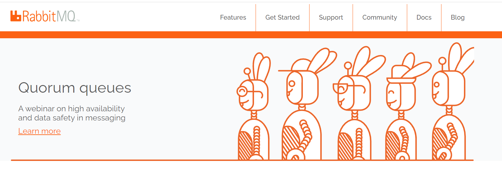

AMQP 协议

```markdown
	AMQP（advanced message queuing protocol）`在2003年时被提出，最早用于解决金融领不同平台之间的消息传递交互问题。顾名思义，AMQP是一种协议，更准确的说是一种binary wire-level protocol（链接协议）。这是其和JMS的本质差别，AMQP不从API层进行限定，而是直接定义网络交换的数据格式。这使得实现了AMQP的provider天然性就是跨平台的。以下是AMQP协议模型:
```

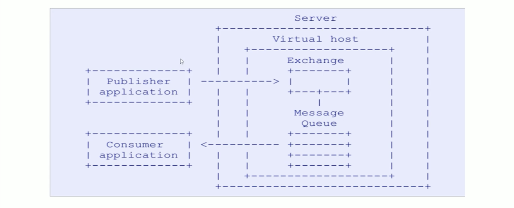


## 1.3 RabbitMQ的安装

```markdown
# 1.将rabbitmq安装包上传到linux系统中
	erlang-22.0.7-1.el7.x86_64.rpm
	rabbitmq-server-3.7.18-1.el7.noarch.rpm

# 2.安装Erlang依赖包
	rpm -ivh erlang-22.0.7-1.el7.x86_64.rpm

# 3.安装RabbitMQ安装包(需要联网)
	yum install -y rabbitmq-server-3.7.18-1.el7.noarch.rpm
		注意:默认安装完成后配置文件模板在:/usr/share/doc/rabbitmq-server-3.7.18/rabbitmq.config.example目录中,需要	
				将配置文件复制到/etc/rabbitmq/目录中,并修改名称为rabbitmq.config
# 4.复制配置文件
	cp /usr/share/doc/rabbitmq-server-3.7.18/rabbitmq.config.example /etc/rabbitmq/rabbitmq.config

# 5.查看配置文件位置
	ls /etc/rabbitmq/rabbitmq.config

# 6.修改配置文件(参见下图:)
	vim /etc/rabbitmq/rabbitmq.config 
```

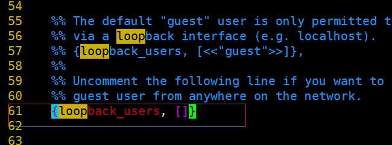

```markdown
# 7.执行如下命令,启动rabbitmq中的插件管理
	rabbitmq-plugins enable rabbitmq_management
	
	出现如下说明:
		Enabling plugins on node rabbit@localhost:
    rabbitmq_management
    The following plugins have been configured:
      rabbitmq_management
      rabbitmq_management_agent
      rabbitmq_web_dispatch
    Applying plugin configuration to rabbit@localhost...
    The following plugins have been enabled:
      rabbitmq_management
      rabbitmq_management_agent
      rabbitmq_web_dispatch

    set 3 plugins.
    Offline change; changes will take effect at broker restart.

# 8.启动RabbitMQ的服务
	systemctl start rabbitmq-server
	systemctl restart rabbitmq-server
	systemctl stop rabbitmq-server
	

# 9.查看服务状态(见下图:)
	systemctl status rabbitmq-server
  ● rabbitmq-server.service - RabbitMQ broker
     Loaded: loaded (/usr/lib/systemd/system/rabbitmq-server.service; disabled; vendor preset: disabled)
     Active: active (running) since 三 2019-09-25 22:26:35 CST; 7s ago
   Main PID: 2904 (beam.smp)
     Status: "Initialized"
     CGroup: /system.slice/rabbitmq-server.service
             ├─2904 /usr/lib64/erlang/erts-10.4.4/bin/beam.smp -W w -A 64 -MBas ageffcbf -MHas ageffcbf -
             MBlmbcs...
             ├─3220 erl_child_setup 32768
             ├─3243 inet_gethost 4
             └─3244 inet_gethost 4
      .........
```

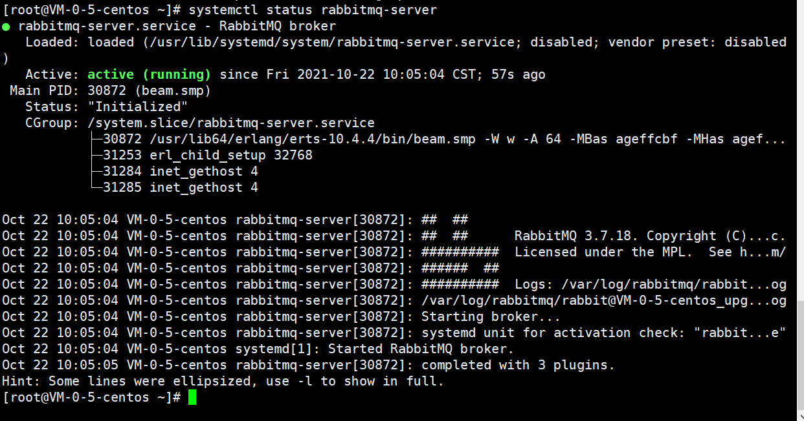

rabbitmq的默认web管理界面端口15672

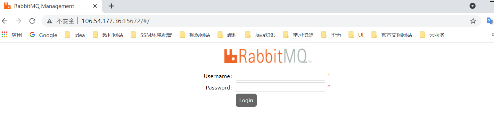

使用guest用户名guest密码登录


# 2.Rabbit的配置

## 2.1 RabbitMQ管理命令行

```markdown
# 1.服务启动相关
	systemctl start|restart|stop|status rabbitmq-server

# 2.管理命令行  用来在不使用web管理界面情况下命令操作RabbitMQ
	rabbitmqctl  help  可以查看更多命令

# 3.插件管理命令行
	rabbitmq-plugins enable|list|disable 
```


## 2.2 Web管理界面


# 3.RabbitMQ的第一个程序

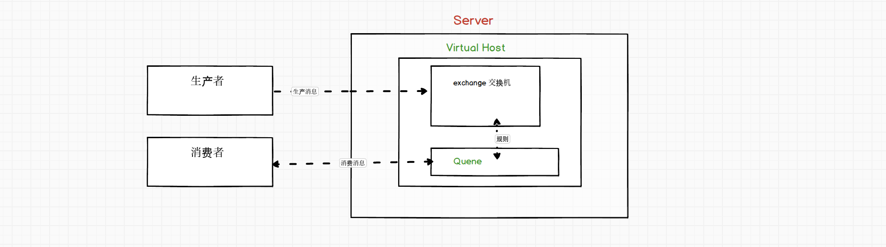

## 3.1 RabbitMQ支持的消息模型


## 3.2 引入依赖

```xml
<dependency>
    <groupId>com.rabbitmq</groupId>
    <artifactId>amqp-client</artifactId>
    <version>5.7.2</version>
</dependency>
```


## 3.3 第一种模型（直连）

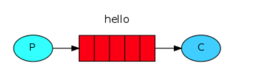

在上图的模型中，有以下概念：

- P：生产者，也就是要发送消息的程序
- C：消费者：消息的接受者，会一直等待消息到来。
- queue：消息队列，图中红色部分。类似一个邮箱，可以缓存消息；生产者向其中投递消息，消费者从其中取出消息。


### 开发生产者

```java
/**
 * @author KouChaoJie
 * @since: 2021/10/22 12:11
 */
public class ProviderTest {
    /**
     * 生产消息
     */
    @Test
    public void testSendMessage() throws IOException, TimeoutException {
        //创建连接mq的连接工厂对象
        ConnectionFactory connectionFactory = new ConnectionFactory();
        //设置连接rabbitmq主机
        connectionFactory.setHost("106.**.***.36");
        //设置端口号
        connectionFactory.setPort(5672);
        //设置连接哪个虚拟主机
        connectionFactory.setVirtualHost("/kou");
        //设置访问虚拟主机的用户名密码
        connectionFactory.setUsername("kou");
        connectionFactory.setPassword("****");

        //获取连接对象
        Connection connection = connectionFactory.newConnection();

        //通过连接获取连接中的通道
        Channel channel = connection.createChannel();
        //通道绑定对应消息队列
        //队列名称,如果队列不存在自动创建
        //参数2:用来定义队列特性是否要持久化 true/false
        //参数3:exclusive是否独占队列
        //参数4:autoDelete:是否在消费完成后自动删除队列
        channel.queueDeclare("hello", false, false, false, null);

        //发布消息
        //交换机名称  队列名称  传递消息额外设置  消息具体内容
        channel.basicPublish("", "hello", null, "hello rabbitmq".getBytes());

        //关闭通道与连接
        channel.close();
        connection.close();
    }
}
```


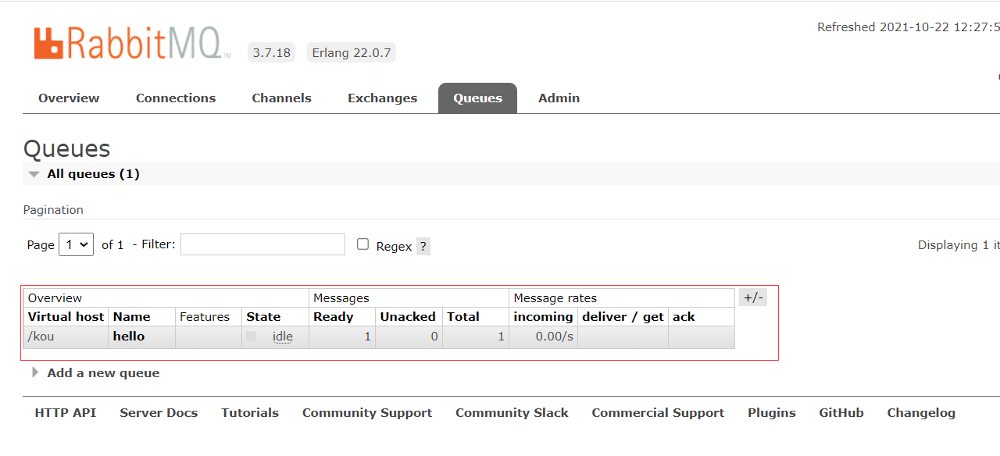


### 开发消费者

```java
/**
 * @author KouChaoJie
 * @since: 2021/10/22 13:18
 */
public class CustomerTest {
    public static void main(String[] args) throws IOException, TimeoutException {
        //创建连接mq的连接工厂对象
        ConnectionFactory connectionFactory = new ConnectionFactory();
        //设置连接rabbitmq主机
        connectionFactory.setHost("106.**.**.36");
        //设置端口号
        connectionFactory.setPort(5672);
        //设置连接哪个虚拟主机
        connectionFactory.setVirtualHost("/kou");
        //设置访问虚拟主机的用户名密码
        connectionFactory.setUsername("kou");
        connectionFactory.setPassword("****");

        Connection connection = connectionFactory.newConnection();
        //通过连接获取连接中的通道
        Channel channel = connection.createChannel();
        channel.queueDeclare("hello", false, false, false, null);

        //消费消息
        //参数1:消费哪个队列的消息,队列名称
        //参数2:开始消息的自动确认机制
        //参数3:消费时的回调接口
        channel.basicConsume("hello", true, new DefaultConsumer(channel) {
            /**
             *
             * @param consumerTag 标签
             * @param envelope 信封
             * @param properties 属性
             * @param body 消息队列中取出的消息
             */
            @Override
            public void handleDelivery(String consumerTag, Envelope envelope, AMQP.BasicProperties properties, byte[] body) throws IOException {
                System.out.println("new String(body)=" + new String(body));
            }
        });
    }
}
```


### 封装连接工具类

```java
/**
 * RabbitMQ连接工具类
 *
 * @author KouChaoJie
 * @since: 2021/10/22 13:42
 */
public class RabbitMqUtils {
    private static final ConnectionFactory CONNECTION_FACTORY;

    static {
        CONNECTION_FACTORY = new ConnectionFactory();
        //设置连接rabbitmq主机
        CONNECTION_FACTORY.setHost("106.**.***.36");
        //设置端口号
        CONNECTION_FACTORY.setPort(5672);
        //设置连接哪个虚拟主机
        CONNECTION_FACTORY.setVirtualHost("/kou");
        //设置访问虚拟主机的用户名密码
        CONNECTION_FACTORY.setUsername("kou");
        CONNECTION_FACTORY.setPassword("****");
    }

    /**
     * 定义提供rabbitmq连接对象的方法
     */
    public static Connection getConnection() {
        try {
            //获取连接对象
            return CONNECTION_FACTORY.newConnection();
        } catch (Exception e) {
            e.printStackTrace();
        }
        return null;
    }

    /**
     * 关闭通道和关闭连接的工具方法
     */
    public static void closeConnectionAndChanel(Channel channel, Connection connection) {
        try {
            if (channel != null) {
                channel.close();
            }

            if (connection != null) {
                connection.close();
            }
        } catch (Exception e) {
            e.printStackTrace();
        }
    }
}
```


### API参数细节

同一个通道可以向不同的队列发送消息

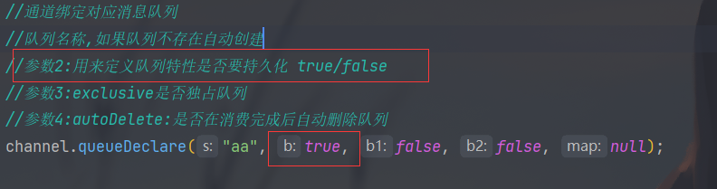

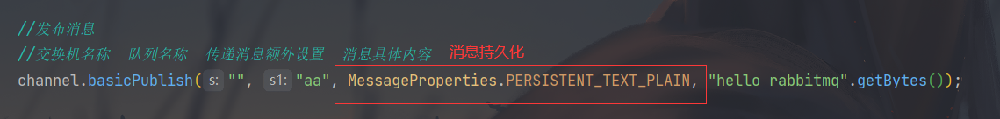

+ 消费者消费完消息断开连接后自动删除队列

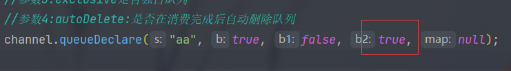


## 3.4 第二种模型（Work queue）

`Work queues`，也被称为（`Task queues`），任务模型。当消息处理比较耗时的时候，可能生产消息的速度会远远大于消息的消费速度。长此以往，消息就会堆积越来越多，无法及时处理。此时就可以使用work 模型：**让多个消费者绑定到一个队列，共同消费队列中的消息**。队列中的消息一旦消费，就会消失，因此任务是不会被重复执行的。

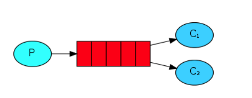

角色：

- P：生产者：任务的发布者
- C1：消费者-1，领取任务并且完成任务，假设完成速度较慢
- C2：消费者-2：领取任务并完成任务，假设完成速度快


### 开发生产者

```java
/**
 * Work Quene生产者
 *
 * @author KouChaoJie
 * @since: 2021/10/22 14:56
 */
public class Provider {
    public static void main(String[] args) throws IOException {
        Connection connection = RabbitMqUtils.getConnection();

        Channel channel = connection.createChannel();

        //通过通道声明队列
        channel.queueDeclare("work", true, false, false, null);

        //生产消息
        for (int i = 0; i < 10; i++) {
            channel.basicPublish("", "work", null, (i + "hello Work Quene").getBytes());
        }

        //关闭资源
        RabbitMqUtils.closeConnectionAndChanel(channel, connection);
    }
}
```


### 开发消费者

```java
/**
 * @author KouChaoJie
 * @since: 2021/10/22 15:04
 */
public class Customer1 {
    public static void main(String[] args) throws IOException {
        Connection connection = RabbitMqUtils.getConnection();
        Channel channel = connection.createChannel();

        channel.queueDeclare("work", true, false, false, null);
        channel.basicConsume("work", true, new DefaultConsumer(channel) {
            @Override
            public void handleDelivery(String consumerTag, Envelope envelope, AMQP.BasicProperties properties, byte[] body) throws IOException {
                System.out.println("消费者-1:" + new String(body));
            }
        });
    }
}

/**
 * @author KouChaoJie
 * @since: 2021/10/22 15:04
 */
public class Customer2 {
    public static void main(String[] args) throws IOException {
        Connection connection = RabbitMqUtils.getConnection();
        Channel channel = connection.createChannel();

        channel.queueDeclare("work", true, false, false, null);
        channel.basicConsume("work", true, new DefaultConsumer(channel) {
            @Override
            public void handleDelivery(String consumerTag, Envelope envelope, AMQP.BasicProperties properties, byte[] body) throws IOException {
                System.out.println("消费者-2:" + new String(body));
                try {
                    Thread.sleep(1000);
                } catch (InterruptedException e) {
                    e.printStackTrace();
                }
            }
        });
    }
}
```

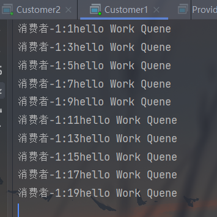

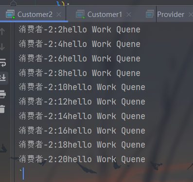

`总结:默认情况下，RabbitMQ将按顺序将每个消息发送给下一个使用者。平均而言，每个消费者都会收到相同数量的消息。这种分发消息的方式称为循环。`

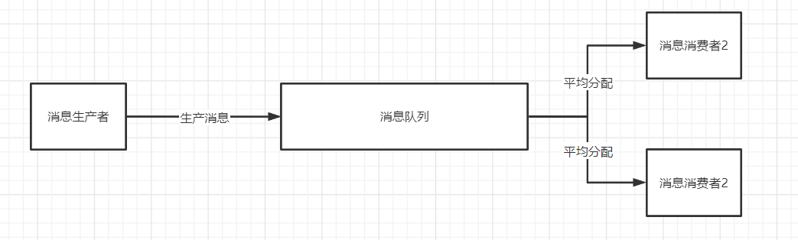


### 消息确认机制与能者多劳的实现

> Doing a task can take a few seconds. You may wonder what happens if one of the consumers starts a long task and dies with it only partly done. With our current code, once RabbitMQ delivers a message to the consumer it immediately marks it for deletion. In this case, if you kill a worker we will lose the message it was just processing. We'll also lose all the messages that were dispatched to this particular worker but were not yet handled.

> But we don't want to lose any tasks. If a worker dies, we'd like the task to be delivered to another worker.

```java
channel.basicQos(1);//一次只接受一条未确认的消息
//参数2:关闭自动确认消息
channel.basicConsume("hello",false,new DefaultConsumer(channel){
  @Override
  public void handleDelivery(String consumerTag, Envelope envelope, AMQP.BasicProperties properties, byte[] body) throws IOException {
    System.out.println("消费者1: "+new String(body));
    channel.basicAck(envelope.getDeliveryTag(),false);//手动确认消息
  }
});
```

- 设置通道一次只能消费一个消息

- 关闭消息的自动确认,开启手动确认消息

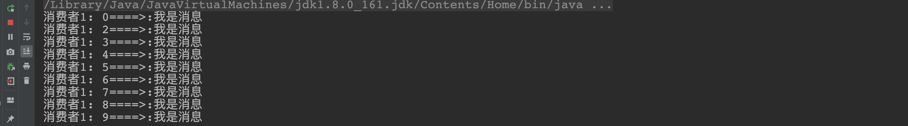

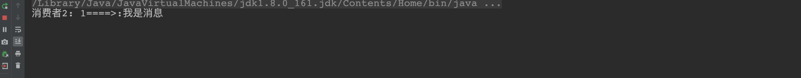


## 3.5 第三种模型（fanout）

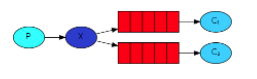

扇出，广播，发布/订阅

在广播模式下，消息发送流程是这样的：

-  可以有多个消费者
-  每个**消费者有自己的queue**（队列）
-  每个**队列都要绑定到Exchange**（交换机）
-  **生产者发送的消息，只能发送到交换机**，交换机来决定要发给哪个队列，生产者无法决定。
-  交换机把消息发送给绑定过的所有队列
-  队列的消费者都能拿到消息。实现一条消息被多个消费者消费

### 1. 开发生产者

```java
//声明交换机
channel.exchangeDeclare("logs","fanout");//广播 一条消息多个消费者同时消费
//发布消息
channel.basicPublish("logs","",null,"hello".getBytes());
```

### 2. 开发消费者-1

```java
//绑定交换机
channel.exchangeDeclare("logs","fanout");
//创建临时队列
String queue = channel.queueDeclare().getQueue();
//将临时队列绑定exchange
channel.queueBind(queue,"logs","");
//处理消息
channel.basicConsume(queue,true,new DefaultConsumer(channel){
  @Override
  public void handleDelivery(String consumerTag, Envelope envelope, AMQP.BasicProperties properties, byte[] body) throws IOException {
    System.out.println("消费者1: "+new String(body));
  }
});
```

### 3. 开发消费者-2

```java
//绑定交换机
channel.exchangeDeclare("logs","fanout");
//创建临时队列
String queue = channel.queueDeclare().getQueue();
//将临时队列绑定exchange
channel.queueBind(queue,"logs","");
//处理消息
channel.basicConsume(queue,true,new DefaultConsumer(channel){
  @Override
  public void handleDelivery(String consumerTag, Envelope envelope, AMQP.BasicProperties properties, byte[] body) throws IOException {
    System.out.println("消费者2: "+new String(body));
  }
});
```

### 4.开发消费者-3

```java
//绑定交换机
channel.exchangeDeclare("logs","fanout");
//创建临时队列
String queue = channel.queueDeclare().getQueue();
//将临时队列绑定exchange
channel.queueBind(queue,"logs","");
//处理消息
channel.basicConsume(queue,true,new DefaultConsumer(channel){
  @Override
  public void handleDelivery(String consumerTag, Envelope envelope, AMQP.BasicProperties properties, byte[] body) throws IOException {
    System.out.println("消费者3: "+new String(body));
  }
});
```

#### 5. 测试结果


## 3.6 第四种模型(Routing)

### Routing 之订阅模型-Direct(直连)

`在Fanout模式中，一条消息，会被所有订阅的队列都消费。但是，在某些场景下，我们希望不同的消息被不同的队列消费。这时就要用到Direct类型的Exchange。`

 在Direct模型下：

- 队列与交换机的绑定，不能是任意绑定了，而是要指定一个`RoutingKey`（路由key）
- 消息的发送方在 向 Exchange发送消息时，也必须指定消息的 `RoutingKey`。
- Exchange不再把消息交给每一个绑定的队列，而是根据消息的`Routing Key`进行判断，只有队列的`Routingkey`与消息的 `Routing key`完全一致，才会接收到消息

流程:


图解：

- P：生产者，向Exchange发送消息，发送消息时，会指定一个routing key。
- X：Exchange（交换机），接收生产者的消息，然后把消息递交给 与routing key完全匹配的队列
- C1：消费者，其所在队列指定了需要routing key 为 error 的消息
- C2：消费者，其所在队列指定了需要routing key 为 info、error、warning 的消息


**生产者**

```java
/**
 * @author KouChaoJie
 * @since: 2021/10/22 17:28
 */
public class Provider {
    public static void main(String[] args) throws IOException {
        Connection connection = RabbitMqUtils.getConnection();
        Channel channel = connection.createChannel();
        String exchangeName = "logs_direct";
        //将通道声明指定的交换机
        //参数1:交换机名称
        //参数2:交换机类型 direct路由模式
        channel.exchangeDeclare(exchangeName, "direct");

        //发送消息
        String routingKey = "error";
        channel.basicPublish(exchangeName, routingKey, null, ("这是direct模型发布的消息基于route_key:" + routingKey + "发送的消息").getBytes());

        RabbitMqUtils.closeConnectionAndChanel(channel, connection);
    }
}
```

**消费者**

```java
/**
 * @author KouChaoJie
 * @since: 2021/10/22 17:36
 */
public class Customer1 {
    public static void main(String[] args) throws IOException {
        Connection connection = RabbitMqUtils.getConnection();
        Channel channel = connection.createChannel();

        String exchangeName = "logs_direct";

        //通道声明交换机以及交换的类型
        channel.exchangeDeclare(exchangeName, "direct");

        //创建临时队列
        String queue = channel.queueDeclare().getQueue();

        //基于路由key绑定队列和交换机
        channel.queueBind(queue, exchangeName, "error");

        //获取消费的消息
        channel.basicConsume(queue, true, new DefaultConsumer(channel) {
            @Override
            public void handleDelivery(String consumerTag, Envelope envelope, AMQP.BasicProperties properties, byte[] body) throws IOException {
                System.out.println("消费者1:" + new String(body));
            }
        });
    }
}


public class Customer2 {
    public static void main(String[] args) throws IOException {
        Connection connection = RabbitMqUtils.getConnection();
        Channel channel = connection.createChannel();

        String exchangeName = "logs_direct";

        //通道声明交换机以及交换的类型
        channel.exchangeDeclare(exchangeName, "direct");

        //创建临时队列
        String queue = channel.queueDeclare().getQueue();

        //基于路由key绑定队列和交换机
        channel.queueBind(queue, exchangeName, "info");
        channel.queueBind(queue, exchangeName, "error");
        channel.queueBind(queue, exchangeName, "waring");

        //获取消费的消息
        channel.basicConsume(queue, true, new DefaultConsumer(channel) {
            @Override
            public void handleDelivery(String consumerTag, Envelope envelope, AMQP.BasicProperties properties, byte[] body) throws IOException {
                System.out.println("消费者2:" + new String(body));
            }
        });
    }
}
```

+ 测试生产者发送Route key为error的消息时

 

 

+ 测试生产者发送Route key为info的消息时

 

 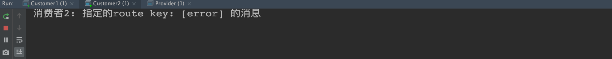


### Routing 之订阅模型-Topic

`Topic`类型的`Exchange`与`Direct`相比，都是可以根据`RoutingKey`把消息路由到不同的队列。只不过`Topic`类型`Exchange`可以让队列在绑定`Routing key` 的时候使用通配符！这种模型`Routingkey` 一般都是由一个或多个单词组成，多个单词之间以”.”分割，例如： `item.insert`


``` markdown
# 统配符
		* (star) can substitute for exactly one word.    匹配不多不少恰好1个词
		# (hash) can substitute for zero or more words.  匹配一个或多个词
# 如:
		audit.#    匹配audit.irs.corporate或者 audit.irs 等
    audit.*   只能匹配 audit.irs
```

#### 1.开发生产者

```java
//生命交换机和交换机类型 topic 使用动态路由(通配符方式)
channel.exchangeDeclare("topics","topic");
String routekey = "user.save";//动态路由key
//发布消息
channel.basicPublish("topics",routekey,null,("这是路由中的动态订阅模型,route key: ["+routekey+"]").getBytes());
```

#### 2.开发消费者-1 

`Routing Key中使用*通配符方式`

```java
 //声明交换机
channel.exchangeDeclare("topics","topic");
//创建临时队列
String queue = channel.queueDeclare().getQueue();
//绑定队列与交换机并设置获取交换机中动态路由
channel.queueBind(queue,"topics","user.*");

//消费消息
channel.basicConsume(queue,true,new DefaultConsumer(channel){
  @Override
  public void handleDelivery(String consumerTag, Envelope envelope, AMQP.BasicProperties properties, byte[] body) throws IOException {
    System.out.println("消费者1: "+new String(body));
  }
});
```

#### 3.开发消费者-2

`Routing Key中使用#通配符方式`

```java
//声明交换机
channel.exchangeDeclare("topics","topic");
//创建临时队列
String queue = channel.queueDeclare().getQueue();
//绑定队列与交换机并设置获取交换机中动态路由
channel.queueBind(queue,"topics","user.#");

//消费消息
channel.basicConsume(queue,true,new DefaultConsumer(channel){
  @Override
  public void handleDelivery(String consumerTag, Envelope envelope, AMQP.BasicProperties properties, byte[] body) throws IOException {
    System.out.println("消费者2: "+new String(body));
  }
});
```

#### 4.测试结果

 

 


# 4.SpringBoot整合RabbitMQ

##### 	1. 引入依赖

```xml
<dependency>
  <groupId>org.springframework.boot</groupId>
  <artifactId>spring-boot-starter-amqp</artifactId>
</dependency>
```

##### 	2. 配置配置文件

```yml
spring:
  application:
    name: springboot_rabbitmq
  rabbitmq:
    host: 10.15.0.9
    port: 5672
    username: ems
    password: 123
    virtual-host: /ems
```

`RabbitTemplate`  用来简化操作     使用时候直接在项目中注入即可使用


## 4.1 整合第一种模型

```java
/**
 * @author KouChaoJie
 * @since: 2021/10/23 14:37
 */
@SpringBootTest
public class RabbitMqTest {
    /**
     * 注入rabbittemplate
     */
    @Autowired
    private RabbitTemplate rabbitTemplate;

    @Test
    public void test() {
        rabbitTemplate.convertAndSend("hello", "hello world");
    }
}
```

```java
/**
 * @author KouChaoJie
 * @since: 2021/10/23 14:40
 */
@Component
@RabbitListener(queuesToDeclare = @Queue(value = "hello", durable = "false", autoDelete = "true"))
public class HelloCustomer {
    @RabbitHandler
    public void receive(String message) {
        System.out.println("message=" + message);
    }
}
```

如果不指定交换机，生产者会将消息发布给AMQP default交换机；而每一个队列，无论后天绑定了哪个交换机，先天会默认绑定AMQP default交换机（无法解绑，这个交换机也无法被删除）；而这个交换机的匹配方式，是通过生产者的routingKey匹配队列的queue name；这就解释了为什么不指定交换机时，会发送给名称为routingKey的队列。


## 4.2 整合第二种模型

```java
 /**
  * work
  */
 @Test
 public void testWork() {
     for (int i = 0; i < 10; i++) {
         rabbitTemplate.convertAndSend("work", "work模型");
     }
 }
```

```java
/**
 * @author KouChaoJie
 * @since: 2021/10/23 15:01
 */
@Component
public class WorkCustomer {

    @RabbitListener(queuesToDeclare = @Queue("work"))
    public void receive1(String message) {
        System.out.println("message1=" + message);
    }

    @RabbitListener(queuesToDeclare = @Queue("work"))
    public void receive2(String message) {
        System.out.println("message2=" + message);
    }
}
```

> `说明:默认在Spring AMQP实现中Work这种方式就是公平调度,如果需要实现能者多劳需要额外配置`


## 4.3 整合第三种广播模式

```java
/**
 * fanout广播
 */
@Test
public void testFanout() {
    rabbitTemplate.convertAndSend("logs", "", "fanout模型发送的消息");
}
```

```java
/**
 * @author KouChaoJie
 * @since: 2021/10/23 15:16
 */
@Component
public class FanoutCustomer {
    @RabbitListener(bindings = {
            @QueueBinding(
                    value = @Queue,
                    exchange = @Exchange(value = "logs", type = "fanout")
            )})
    public void receive1(String message) {
        System.out.println("messsage1=" + message);
    }

    @RabbitListener(bindings = {
            @QueueBinding(
                    value = @Queue,
                    exchange = @Exchange(value = "logs", type = "fanout")
            )})
    public void receive2(String message) {
        System.out.println("messsage2=" + message);
    }
}
```


## 4.4 整合第四种路由模式

```java
/**
 * route路由模式
 */
@Test
public void testRoute(){
    rabbitTemplate.convertAndSend("directs","info","发送info的key相关信息");
}
```

```java
/**
 * @author KouChaoJie
 * @since: 2021/10/23 15:22
 */
@Component
public class RouteCustomer {
    @RabbitListener(bindings = {
            @QueueBinding(value = @Queue,//创建临时队列
                    exchange = @Exchange(value = "directs", type = "direct"),//自定义交换机名称和类型
                    key = {"info", "error", "warn"}
            )
    })
    public void receive1(String message) {
        System.out.println("message1=" + message);
    }

    @RabbitListener(bindings = {
            @QueueBinding(value = @Queue,//创建临时队列
                    exchange = @Exchange(value = "directs", type = "direct"),//自定义交换机名称和类型
                    key = {"error"}
            )
    })
    public void receive2(String message) {
        System.out.println("message2=" + message);
    }
}
```


## 4.5 整合第五种动态路由topic模式（订阅模式）

```java
/**
 * topic模式
 */
@Test
public void testTopic() {
    rabbitTemplate.convertAndSend("topics", "user.save", "user.save的消息");
}
```

```java
/**
 * @author KouChaoJie
 * @since: 2021/10/23 15:33
 */
@Component
public class TopicCustomer {
    @RabbitListener(bindings = {
            @QueueBinding(
                    value = @Queue,
                    exchange = @Exchange(type = "topic", name = "topics"),
                    key = {"user.*"}
            )
    })
    public void receive1(String message) {
        System.out.println("message1=" + message);
    }

    @RabbitListener(bindings = {
            @QueueBinding(
                    value = @Queue,
                    exchange = @Exchange(type = "topic", name = "topics"),
                    key = {"user.#"}
            )
    })
    public void receive2(String message) {
        System.out.println("message2=" + message);
    }
}
```


# 5.MQ应用场景

## 5.1 异步处理

`场景说明：用户注册后，需要发注册邮件和注册短信,传统的做法有两种 1.串行的方式 2.并行的方式`

- `串行方式:` 将注册信息写入数据库后,发送注册邮件,再发送注册短信,以上三个任务全部完成后才返回给客户端。 这有一个问题是,邮件,短信并不是必须的,它只是一个通知,而这种做法让客户端等待没有必要等待的东西. 

 

- `并行方式: `将注册信息写入数据库后,发送邮件的同时,发送短信,以上三个任务完成后,返回给客户端,并行的方式能提高处理的时间。 

 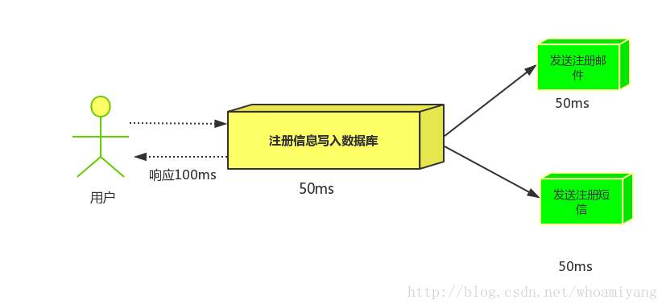

- `消息队列:`假设三个业务节点分别使用50ms,串行方式使用时间150ms,并行使用时间100ms。虽然并行已经提高的处理时间,但是,前面说过,邮件和短信对我正常的使用网站没有任何影响，客户端没有必要等着其发送完成才显示注册成功,应该是写入数据库后就返回.  `消息队列`: 引入消息队列后，把发送邮件,短信不是必须的业务逻辑异步处理 

  

由此可以看出,引入消息队列后，用户的响应时间就等于写入数据库的时间+写入消息队列的时间(可以忽略不计),引入消息队列后处理后,响应时间是串行的3倍,是并行的2倍。


## 5.2 应用解耦

`场景：双11是购物狂节,用户下单后,订单系统需要通知库存系统,传统的做法就是订单系统调用库存系统的接口. `

 

这种做法有一个缺点:

当库存系统出现故障时,订单就会失败。 订单系统和库存系统高耦合.  引入消息队列 

 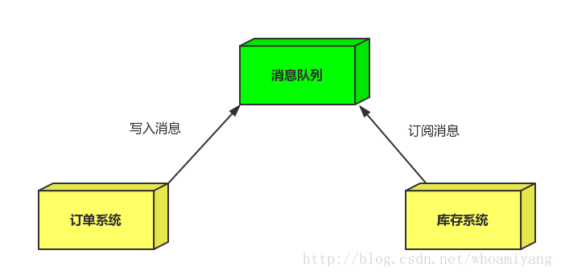

- `订单系统:`用户下单后,订单系统完成持久化处理,将消息写入消息队列,返回用户订单下单成功。

- `库存系统:`订阅下单的消息,获取下单消息,进行库操作。  就算库存系统出现故障,消息队列也能保证消息的可靠投递,不会导致消息丢失.

  

## 5.3 流量削峰

 `场景:` 秒杀活动，一般会因为流量过大，导致应用挂掉,为了解决这个问题，一般在应用前端加入消息队列。  

  `作用:` 

​			1.可以控制活动人数，超过此一定阀值的订单直接丢弃(我为什么秒杀一次都没有成功过呢^^) 

​			2.可以缓解短时间的高流量压垮应用(应用程序按自己的最大处理能力获取订单) 

 

1.用户的请求,服务器收到之后,首先写入消息队列,加入消息队列长度超过最大值,则直接抛弃用户请求或跳转到错误页面.  

2.秒杀业务根据消息队列中的请求信息，再做后续处理.


# 6.RabbitMQ集群

## 6.1 普通集群（副本集群）

+ 架构图

  `默认情况下:RabbitMQ代理操作所需的所有数据/状态都将跨所有节点复制。这方面的一个例外是消息队列，默认情况下，消息队列位于一个节点上，尽管它们可以从所有节点看到和访问`


​	核心解决问题:  `当集群中某一时刻master节点宕机,可以对Quene中信息,进行备份`

##### 集群搭建

```markdown
# 0.集群规划
	node1: 10.***.0.3  mq1  master 主节点
	node2: 10.***.0.4  mq2  repl1  副本节点
	node3: 10.*.0.5  mq3  repl2  副本节点

# 1.克隆三台机器主机名和ip映射
	vim /etc/hosts加入:
		 10.**.**.3 mq1
    	10.***.***.4 mq2
    	10.***.***.5 mq3
	node1: vim /etc/hostname 加入:  mq1
	node2: vim /etc/hostname 加入:  mq2
	node3: vim /etc/hostname 加入:  mq3

# 2.三个机器安装rabbitmq,并同步cookie文件,在node1上执行:
	scp /var/lib/rabbitmq/.erlang.cookie root@mq2:/var/lib/rabbitmq/
	scp /var/lib/rabbitmq/.erlang.cookie root@mq3:/var/lib/rabbitmq/

# 3.查看cookie是否一致:
	node1: cat /var/lib/rabbitmq/.erlang.cookie 
	node2: cat /var/lib/rabbitmq/.erlang.cookie 
	node3: cat /var/lib/rabbitmq/.erlang.cookie 

# 4.后台启动rabbitmq所有节点执行如下命令,启动成功访问管理界面:
	rabbitmq-server -detached 

# 5.在node2和node3执行加入集群命令:
	1.关闭       rabbitmqctl stop_app
	2.加入集群    rabbitmqctl join_cluster rabbit@mq1
	3.启动服务    rabbitmqctl start_app

# 6.查看集群状态,任意节点执行:
	rabbitmqctl cluster_status

# 7.如果出现如下显示,集群搭建成功:
	Cluster status of node rabbit@mq3 ...
	[{nodes,[{disc,[rabbit@mq1,rabbit@mq2,rabbit@mq3]}]},
	{running_nodes,[rabbit@mq1,rabbit@mq2,rabbit@mq3]},
	{cluster_name,<<"rabbit@mq1">>},
	{partitions,[]},
	{alarms,[{rabbit@mq1,[]},{rabbit@mq2,[]},{rabbit@mq3,[]}]}]

# 8.登录管理界面,展示如下状态:
```


```markdown
# 9.测试集群在node1上,创建队列
```


```markdown
# 10.查看node2和node3节点:
```


```markdown
# 11.关闭node1节点,执行如下命令,查看node2和node3:
	rabbitmqctl stop_app
```


---


## 6.2 镜像集群

> This guide covers mirroring (queue contents replication) of classic queues  --摘自官网
>
> By default, contents of a queue within a RabbitMQ cluster are located on a single node (the node on which the queue was declared). This is in contrast to exchanges and bindings, which can always be considered to be on all nodes. Queues can optionally be made *mirrored* across multiple nodes. --摘自官网

`镜像队列机制就是将队列在三个节点之间设置主从关系，消息会在三个节点之间进行自动同步，且如果其中一个节点不可用，并不会导致消息丢失或服务不可用的情况，提升MQ集群的整体高可用性。`


1. ##### 集群架构图

   

   

2. ##### 配置集群架构

   ```markdown
   # 0.策略说明
   	rabbitmqctl set_policy [-p <vhost>] [--priority <priority>] [--apply-to <apply-to>] <name> <pattern>  <definition>
   	-p Vhost： 可选参数，针对指定vhost下的queue进行设置
   	Name:     policy的名称
   	Pattern: queue的匹配模式(正则表达式)
   	Definition：镜像定义，包括三个部分ha-mode, ha-params, ha-sync-mode
              		ha-mode:指明镜像队列的模式，有效值为 all/exactly/nodes
                           all：表示在集群中所有的节点上进行镜像
                           exactly：表示在指定个数的节点上进行镜像，节点的个数由ha-params指定
                           nodes：表示在指定的节点上进行镜像，节点名称通过ha-params指定
               	 ha-params：ha-mode模式需要用到的参数
                   ha-sync-mode：进行队列中消息的同步方式，有效值为automatic和manual
                   priority：可选参数，policy的优先级
                   
                    
   # 1.查看当前策略
   	rabbitmqctl list_policies
   
   # 2.添加策略
   	rabbitmqctl set_policy ha-all '^hello' '{"ha-mode":"all","ha-sync-mode":"automatic"}' 
   	说明:策略正则表达式为 “^” 表示所有匹配所有队列名称  ^hello:匹配hello开头队列
   
   # 3.删除策略
   	rabbitmqctl clear_policy ha-all
   
   # 4.测试集群
   ```

   ----

   
