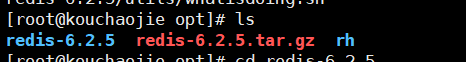
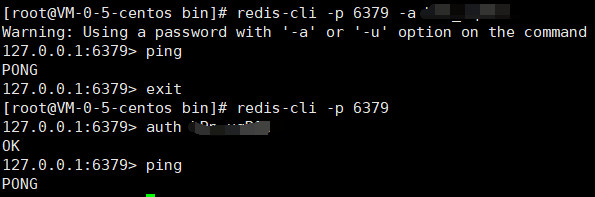
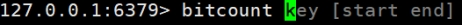
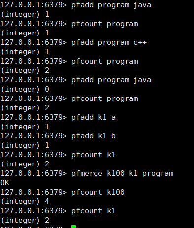
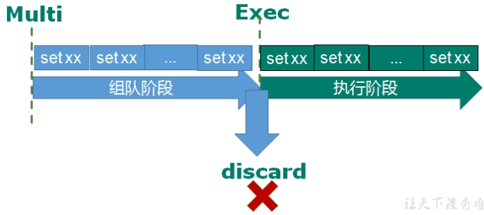
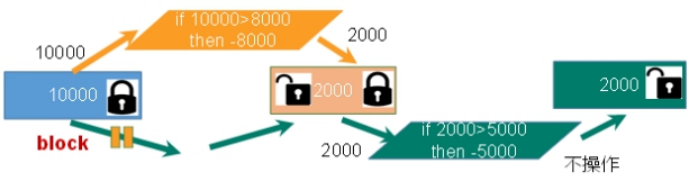
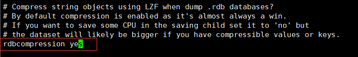
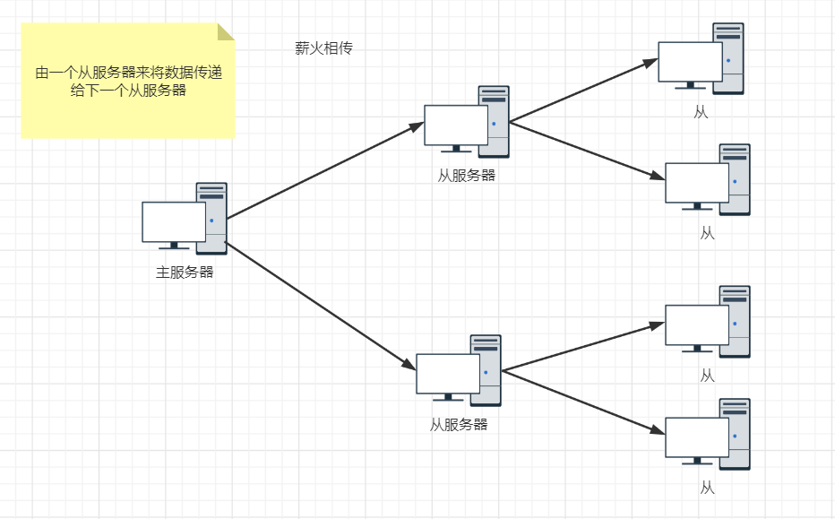
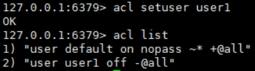

[TOC]


**笔记全部使用Linux版Redis**

**腾讯云服务器上操作**


# 1.NoSQL数据库简介

## 1.1 NoSQL数据库

+ 缓存数据库，完全在内存中，速度快，数据结构简单。解决了CPU及内存压力。
+ 减少IO的读操作。解决IO压力


### 1.1.1 概述

NoSQL(NoSQL = **Not Only SQL** )，意即“不仅仅是SQL”，泛指**非关系型的数据库**。 

NoSQL 不依赖业务逻辑方式存储，而以简单的key-value模式存储。因此大大的增加了数据库的扩展能力。

+ 不遵循SQL标准。

+ 不支持ACID。

+ 远超于SQL的性能。


### 1.1.2 NoSQL适用场景

+ 对数据的高并发的读写
+ 海量数据的读写
+ 对数据高可扩展性


### 1.1.3 NoSQL不适用场景

+ 需要事务支持
+ 基于sql的结构化查询存储，处理复杂的关系
+ **用不着sql和用了sql也不行的情况下，考虑用NoSQL**


### 1.1.4 Redis

+ 数据都在内存中，==支持持久化==，主要用作备份恢复
+ 除了简单的key-value模式，还支持多种数据结构的存储，如list，set，hash，zset等
+ 一般是作为缓存数据库辅助持久化的数据库


# 2.Redis概述安装

- Redis是一个开源的key-value存储系统。

-  和Memcached类似，它支持存储的value类型相对更多，包括string(字符串)、list(链表)、set(集合)、zset(sorted set --有序集合)和hash（哈希类型）。

-  这些数据类型都支持push/pop、add/remove及取交集并集和差集及更丰富的操作，而且这些操作都是原子性的。

+  在此基础上，Redis支持各种不同方式的排序。

+ 与memcached一样，为了保证效率，数据都是缓存在内存中。

+  区别的是Redis会周期性的把更新的数据写入磁盘或者把修改操作写入追加的记录文件。

+ 并且在此基础上实现了master-slave(主从)同步。


## 2.1 应用场景

**配合关系型数据库做高速缓存**

+ 高频次，热门访问的数据，降低数据库IO

+ 分布式架构，做session共享


**多样的数据结构存储持久化数据**


## 2.2 安装

+ 解压`tar -zxvf redis-6.2.1.tar.gz`

+ 

+ 进入redis目录，然后`make`编译

  

+ `make install`

  

+ 安装的默认目录

  

  查看默认安装目录：

  redis-benchmark:性能测试工具，可以在自己本子运行，看看自己本子性能如何

  redis-check-aof：修复有问题的AOF文件，rdb和aof后面讲

  redis-check-dump：修复有问题的dump.rdb文件

  redis-sentinel：Redis集群使用

  redis-server：Redis服务器启动命令

  redis-cli：客户端，操作入口


## 2.3 后台启动

+ 备份redis.conf

  拷贝一份redis.conf到其他目录

  `cp redis.conf /etc/redis.conf`

+ 后台启动设置redis.conf文件里`daemonize no`改成`yes`

  修改redis.conf(128行)文件将里面的daemonize no 改成 yes，让服务在后台启动

+ Redis启动

  


ping：测试验证


使用密码登录的两种方式




+ 关闭

  在终端shutdown关闭

  或杀死redis进程


## 2.4 介绍

+ 默认16个数据库，类似数组下标从0开始，初始默认使用0号库

+ 使用命令 select  <dbid>来切换数据库。如: select 8 

+ 统一密码管理，所有库同样密码。

+ dbsize查看当前数据库的key的数量

+ flushdb清空当前库

+ flushall通杀全部库

支持多数据类型，支持持久化，单线程+多路IO复用

Redis是单线程+多路IO复用技术


# 3.常用五大数据类型

+ String
+ List
+ Set
+ Hash
+ Zset


## 3.1 Redis键Key

+ keys *查看当前库所有key   (匹配：keys *1)

+ exists key判断某个key是否存在


+ type key 查看你的key是什么类型

+ del key    删除指定的key数据

+ unlink key  根据value选择非阻塞删除

>   仅将keys从keyspace元数据中删除，真正的删除会在后续异步操作。


+ expire key 10  10秒钟：为给定的key设置过期时间

+ ttl key 查看还有多少秒过期，-1表示永不过期，-2表示已过期


+ select命令切换数据库

+ dbsize查看当前数据库的key的数量

+ ==flushdb清空当前库==

+ ==flushall通杀全部库==


## 3.2 Redis字符串String


### 3.2.1 简介

redis中最基本类型。

String是**二进制安全**的。因此Redis的String可以包含任何数据。比如jpg图片或者序列化的对象。

一个Redis中字符串value最多是512M.


### 3.2.2 常用命令

+ set  <key><value>添加键值对

+ get  <key>查询对应键值


+ append  <key><value>将给定的<value> 追加到原值的末尾

+ strlen  <key>获得值的长度

+ setnx  <key><value>只有在 key 不存在时   设置 key 的值


+ incr  <key>

  将 key 中储存的数字值增1

  只能对数字值操作，如果为空，新增值为1

+ decr  <key>

  将 key 中储存的数字值减1

  只能对数字值操作，如果为空，新增值为-1


+ incrby / decrby  <key> <步长>将 key 中储存的数字值增减。自定义步长。（**原子操作**）


==原子性==

Redis原子性不同于事务中的原子性，**原子**操作是指不会被线程调度机制打断的操作；

这种操作一旦开始，就一直运行到结束，中间不会有任何 context switch （切换到另一个线程）。

（1）在单线程中， 能够在单条指令中完成的操作都可以认为是"原子操作"，因为中断只能发生于指令之间。

（2）在多线程中，不能被其它进程（线程）打断的操作就叫原子操作。

Redis单命令的原子性主要得益于Redis的单线程。


+ mset  <key1><value1><key2><value2>  ..... 

  同时设置一个或多个 key-value对  

+ mget  <key1><key2><key3> .....

  同时获取一个或多个 value  

+ msetnx <key1><value1><key2><value2>  ..... 

  同时设置一个或多个 key-value 对，当且仅当所有给定 key 都不存在。


+ getrange  <key><起始位置><结束位置>

  获得值的范围，类似java中的substring

+ setrange  <key><起始位置><value>

  用 <value>  覆写<key>所储存的字符串值，从<起始位置>开始(***\*索引从0开始\****)。

  

+ setex  <key><过期时间><value>

  设置键值的同时，设置过期时间，单位秒。

+ getset <key><value>

  以新换旧，设置了新值同时获得旧值。


### 3.2.3 数据结构

String的数据结构为简单动态字符串(Simple Dynamic String,缩写SDS)。是可以修改的字符串，内部结构实现上类似于Java的ArrayList，采用预分配冗余空间的方式来减少内存的频繁分配.

 

如图中所示，内部为当前字符串实际分配的空间capacity一般要高于实际字符串长度len。当字符串长度小于1M时，扩容都是加倍现有的空间，如果超过1M，扩容时一次只会多扩1M的空间。需要注意的是字符串最大长度为512M。


## 3.3 Redis列表List

### 3.3.1 简介

==单键多值==

Redis 列表是简单的字符串列表，按照插入顺序排序。你可以添加一个元素到列表的头部（左边）或者尾部（右边）。它的底层实际是个**双向链表**，对两端的操作性能很高，通过索引下标的操作中间的节点性能会较差。


### 3.3.2 常用命令

+ lpush/rpush  <key><value1><value2><value3> .... 从左边（头插）/右边（尾插）插入一个或多个值。

+ lrange <key><start><stop>  按照索引下标获得元素(从左到右)

+ lpop/rpop  <key>从左边(头)/右边(尾)吐出一个值。**值在键在，值光键亡**。

+ rpoplpush  <key1><key2>从<key1>列表右边吐出一个值，插到<key2>列表左边。

+ lindex <key><index>按照索引下标获得元素(从左到右)

+ llen <key>获得列表长度 

+ linsert <key>  before/after <value><newvalue>在<value>的前面/后面插入<newvalue>插入值

+ lrem <key><n><value>从左边删除n个value(从左到右)

+ lset<key><index><value>将列表key下标为index的值替换成value

  


### 3.3.3 数据结构

List的数据结构为快速链表quickList。

首先在列表元素较少的情况下会使用一块连续的内存存储，这个结构是ziplist，也即是压缩列表。

它将所有的元素紧挨着一起存储，分配的是一块连续的内存。

当数据量比较多的时候才会改成quicklist。

因为普通的链表需要的附加指针空间太大，会比较浪费空间。比如这个列表里存的只是int类型的数据，结构上还需要两个额外的指针prev和next。

 

Redis将链表和ziplist结合起来组成了quicklist。也就是将多个ziplist使用双向指针串起来使用。这样既满足了快速的插入删除性能，又不会出现太大的空间冗余。


## 3.4 Redis集合（set）

### 3.4.1 简介

Redis set对外提供的功能与list类似是一个列表的功能，特殊之处在于set是可以**自动排重**的，当你需要存储一个列表数据，又不希望出现重复数据时，set是一个很好的选择，并且set提供了判断某个成员是否在一个set集合内的重要接口，这个也是list所不能提供的。

Redis的Set是string类型的无序集合。它底层其实是一个value为null的hash表，所以添加，删除，查找的**复杂度都是O(1)**。

一个算法，随着数据的增加，执行时间的长短，如果是O(1)，数据增加，查找数据的时间不变


### 3.4.2 常用命令

+ sadd <key><value1><value2> ..... （尾插）

  将一个或多个 member 元素加入到集合 key 中，已经存在的 member 元素将被忽略

+ smembers <key>取出该集合的所有值。

+ sismember <key><value>判断集合<key>是否为含有该<value>值，有1，没有0

+ scard<key>返回该集合的元素个数。

+ srem <key><value1><value2> .... 删除集合中的某个元素。

+ spop <key>**随机从该集合中吐出一个值。**

+ srandmember <key><n>随机从该集合中取出n个值。不会从集合中删除 。

+ smove <source><destination>value把集合中一个值从一个集合移动到另一个集合

+ sinter <key1><key2>返回两个集合的交集元素。

+ sunion <key1><key2>返回两个集合的并集元素。

+ sdiff <key1><key2>返回两个集合的**差集**元素(key1中的，不包含key2中的)

  

### 3.4.3 数据结构

Set数据结构是dict字典，字典是用哈希表实现的。

Java中HashSet的内部实现使用的是HashMap，只不过所有的value都指向同一个对象。Redis的set结构也是一样，它的内部也使用hash结构，所有的value都指向同一个内部值。


## 3.5 Redis哈希Hash

### 3.5.1 简介

Redis hash 是一个键值对集合。

Redis hash是一个string类型的**field**和**value**的映射表，hash特别适合用于存储对象。

类似Java里面的Map<String,Object>

用户ID为查找的key，存储的value用户对象包含姓名，年龄，生日等信息，如果用普通的key/value结构来存储


通过key(用户ID) + field(属性标签)就可以操作对应属性数据了，既不需要重复存储数据，也不会带来序列化和并发修改控制的问题。


### 3.5.2 常用命令

- hset <key><field><value>给<key>集合中的  <field>键赋值<value>

- hget <key1><field>从<key1>集合<field>取出 value 

- hmset <key1><field1><value1><field2><value2>... 批量设置hash的值

- hexists<key1><field>查看哈希表 key 中，给定域 field 是否存在。 

- hkeys <key>列出该hash集合的所有field

- hvals <key>列出该hash集合的所有value

- hincrby <key><field><increment>为哈希表 key 中的域 field 的值加上增量 1  -1

- hsetnx <key><field><value>将哈希表 key 中的域 field 的值设置为 value ，当且仅当域 field 不存在 .


### 3.5.3 数据结构

Hash类型对应的数据结构是两种：ziplist（压缩列表），hashtable（哈希表）。当field-value长度较短且个数较少时，使用ziplist，否则使用hashtable。


## 3.6 Redis有序集合Zset(sorted set)

### 3.6.1 简介

Redis有序集合zset与普通集合set非常相似，是一个没有重复元素的字符串集合。

不同之处是有序集合的每个成员都关联了一个**评分（score）**,这个评分（score）被用来按照从最低分到最高分的方式排序集合中的成员。集合的成员是唯一的，但是评分可以是重复了 。

因为元素是有序的, 所以你也可以很快的根据评分（score）或者次序（position）来获取一个范围的元素。

访问有序集合的中间元素也是非常快的,因此你能够使用有序集合作为一个没有重复成员的智能列表。


### 3.6.2 常用命令

+ zadd  <key><score1><value1><score2><value2>…

  将一个或多个 member 元素及其 score 值加入到有序集 key 当中。

+ zrange <key><start><stop>  [WITHSCORES]

  返回有序集 key 中，下标在<start><stop>之间的元素，带WITHSCORES，可以让分数一起和值返回到结果集。

- zrangebyscore key minmax [withscores] [limit offset count]

  返回有序集 key 中，所有 score 值介于 min 和 max 之间(包括等于 min 或 max )的成员。有序集成员按 score 值递增(从小到大)次序排列。 

+ zrevrangebyscore key maxmin [withscores] [limit offset count]        

  同上，改为从大到小排列。 

+ zincrby <key><increment><value>    为元素的score加上增量

+ zrem  <key><value>删除该集合下，指定值的元素 

+ zcount <key><min><max>统计该集合，分数区间内的元素个数 

+ zrank <key><value>返回该值在集合中的排名，从0开始。


### 3.6.3 数据结构

SortedSet(zset)是Redis提供的一个非常特别的数据结构，一方面它等价于Java的数据结构Map<String, Double>，可以给每一个元素value赋予一个权重score，另一方面它又类似于TreeSet，内部的元素会按照权重score进行排序，可以得到每个元素的名次，还可以通过score的范围来获取元素的列表。

zset底层使用了两个数据结构

（1）hash，hash的作用就是关联元素value和权重score，保障元素value的唯一性，可以通过元素value找到相应的score值。

（2）跳跃表，跳跃表的目的在于给元素value排序，根据score的范围获取元素列表。


# 4.Redis.conf配置文件介绍


# 5.Redis的发布与订阅

Redis 发布订阅 (pub/sub) 是一种消息通信模式：发送者 (pub) 发送消息，订阅者 (sub) 接收消息。

Redis 客户端可以订阅任意数量的频道。


1、 打开一个客户端订阅channel1

SUBSCRIBE channel1

 

2、打开另一个客户端，给channel1发布消息hello

publish channel1 hello

 

返回的1是订阅者数量

3、打开第一个客户端可以看到发送的消息

 

注：发布的消息没有持久化，如果在订阅的客户端收不到hello，只能收到订阅后发布的消息


# 6.Redis新数据类型

## 6.1 Bitmaps

### 6.1.1简介

现代计算机用二进制（位） 作为信息的基础单位， **1个字节等于8位**， 例如“abc”字符串是由3个字节组成， 但实际在计算机存储时将其用二进制表示， “abc”分别对应的ASCII码分别是97、 98、 99， 对应的二进制分别是01100001、 01100010和01100011，如下图

 

合理地使用操作位能够有效地提高内存使用率和开发效率。

Redis提供了Bitmaps这个“数据类型”可以实现对位的操作：

（1） Bitmaps本身不是一种数据类型， 实际上它就是字符串（key-value） ， 但是**它可以对字符串的位进行操作**。

（2） Bitmaps单独提供了一套命令， 所以在Redis中使用Bitmaps和使用字符串的方法不太相同。 可以把Bitmaps想象成一个以位为单位的数组， 数组的每个单元只能存储0和1， 数组的下标在Bitmaps中叫做偏移量。


**专门进行位操作的字符串**


### 6.1.2 命令

1、setbit

（1）格式

setbit<key><offset><value>设置Bitmaps中某个偏移量的值（0或1）

 

*offset:偏移量从0开始

 

（2）实例

每个独立用户是否访问过网站存放在Bitmaps中， 将访问的用户记做1， 没有访问的用户记做0， 用偏移量作为用户的id。

设置键的第offset个位的值（从0算起） ， 假设现在有20个用户，userid=1， 6， 11， 15， 19的用户对网站进行了访问， 那么当前Bitmaps初始化结果如图

==**8位1bit**==

 

unique:users:20201106代表2020-11-06这天的独立访问用户的Bitmaps

 

注：

很多应用的用户id以一个指定数字（例如10000） 开头， 直接将用户id和Bitmaps的偏移量对应势必会造成一定的浪费， 通常的做法是每次做setbit操作时将用户id减去这个指定数字。

在第一次初始化Bitmaps时， 假如偏移量非常大， 那么整个初始化过程执行会比较慢， 可能会造成Redis的阻塞。

 

2、getbit

（1）格式

getbit<key><offset>获取Bitmaps中某个偏移量的值

 

获取键的第offset位的值（从0开始算）

 

（2）实例

获取id=8的用户是否在2020-11-06这天访问过， 返回0说明没有访问过：

 

 

注：因为100根本不存在，所以也是返回0

 

3、bitcount

统计***\*字符串\****被设置为1的bit数。一般情况下，给定的整个字符串都会被进行计数，通过指定额外的 start 或 end 参数，可以让计数只在特定的位上进行。start 和 end 参数的设置，都可以使用负数值：比如 -1 表示最后一个位，而 -2 表示倒数第二个位，start、end 是指bit组的字节的下标数，二者皆包含。

（1）格式

bitcount<key>[start end] 统计字符串从start字节到end字节比特值为1的数量

 

 

（2）实例

计算2022-11-06这天的独立访问用户数量

 

 

start和end代表起始和结束字节数， 下面操作计算用户id在第1个字节到第3个字节之间的独立访问用户数， 对应的用户id是11， 15， 19。

 

 

举例： ==K1 【01000001 01000000  00000000 00100001】==，对应==【0，1，2，3】==

bitcount K1 1 2  ： 统计下标1、2字节组中bit=1的个数，即01000000  00000000

--》bitcount K1 1 2 　　--》1

 

bitcount K1 1 3  ： 统计下标1、2字节组中bit=1的个数，即01000000  00000000 00100001

--》bitcount K1 1 3　　--》3

 

bitcount K1 0 -2  ： 统计下标0到下标倒数第2，字节组中bit=1的个数，即01000001  01000000  00000000

--》bitcount K1 0 -2　　--》3

 

4、bitop

(1)格式

bitop and(or/not/xor) <destkey> [key…]

 

bitop是一个复合操作， 它可以做多个Bitmaps的and（交集） 、 or（并集） 、 not（非） 、 xor（异或） 操作并将结果保存在destkey中。

 

(2)实例

2020-11-04 日访问网站的userid=1,2,5,9。

setbit unique:users:20201104 1 1

setbit unique:users:20201104 2 1

setbit unique:users:20201104 5 1

setbit unique:users:20201104 9 1

 

 

 

2020-11-03 日访问网站的userid=0,1,4,9。

setbit unique:users:20201103 0 1

setbit unique:users:20201103 1 1

setbit unique:users:20201103 4 1

setbit unique:users:20201103 9 1

 

计算出两天都访问过网站的用户数量

bitop and unique:users:and:20201104_03

 unique:users:20201103unique:users:20201104

 

 

 

计算出任意一天都访问过网站的用户数量（例如月活跃就是类似这种） ， 可以使用or求并集


## 6.2 HyperLogLog

### 6.2.1 简介

在工作当中，我们经常会遇到与统计相关的功能需求，比如统计网站PV（PageView页面访问量）,可以使用Redis的incr、incrby轻松实现。

但像UV（UniqueVisitor，独立访客）、独立IP数、搜索记录数等需要去重和计数的问题如何解决？这种求**集合中不重复元素个数**的问题称为**基数问题**。

解决基数问题有很多种方案：

（1）数据存储在MySQL表中，使用distinct count计算不重复个数

（2）使用Redis提供的hash、set、bitmaps等数据结构来处理

以上的方案结果精确，但随着数据不断增加，导致占用空间越来越大，对于非常大的数据集是不切实际的。

能否能够降低一定的精度来平衡存储空间？Redis推出了HyperLogLog

Redis HyperLogLog 是用来做基数统计的算法，HyperLogLog 的优点是，在输入元素的数量或者体积非常非常大时，计算基数所需的空间总是固定的、并且是很小的。

在 Redis 里面，每个 HyperLogLog 键只需要花费 12 KB 内存，就可以计算接近 2^64 个不同元素的基数。这和计算基数时，元素越多耗费内存就越多的集合形成鲜明对比。

但是，因为 HyperLogLog 只会根据输入元素来计算基数，而不会储存输入元素本身，所以 HyperLogLog 不能像集合那样，返回输入的各个元素。

 

什么是基数?

比如数据集 {1, 3, 5, 7, 5, 7, 8}， 那么这个数据集的基数集为 {1, 3, 5 ,7, 8}, 基数(**不重复元素**)为5。 基数估计就是在误差可接受的范围内，快速计算基数。


### 6.2.2 命令

1、pfadd 

（1）格式

pfadd <key>< element> [element ...]  添加指定元素到 HyperLogLog 中

将所有元素添加到指定HyperLogLog数据结构中。如果执行命令后HLL估计的近似基数发生变化，则返回1，否则返回0。

 

2、pfcount

（1）格式

pfcount<key> [key ...] 计算HLL的近似基数，可以计算多个HLL，比如用HLL存储每天的UV，计算一周的UV可以使用7天的UV合并计算即可


3、pfmerge

（1）格式

pfmerge<destkey><sourcekey> [sourcekey ...]  将一个或多个HLL合并后的结果存储在另一个HLL中，比如每月活跃用户可以使用每天的活跃用户来合并计算可得




## 6.3 Geospatial

### 6.3.1 简介

Redis 3.2 中增加了对GEO类型的支持。GEO，Geographic，地理信息的缩写。该类型，就是元素的2维坐标，在地图上就是经纬度。redis基于该类型，提供了经纬度设置，查询，范围查询，距离查询，经纬度Hash等常见操作。


### 6.3.2 命令

1、geoadd

（1）格式

geoadd<key>< longitude><latitude><member> [longitude latitude member...]  添加地理位置（经度，纬度，名称）

 

（2）实例

geoadd china:city 121.47 31.23 shanghai

geoadd china:city 106.50 29.53 chongqing 114.05 22.52 shenzhen 116.38 39.90 beijing

 

两极无法直接添加，一般会下载城市数据，直接通过 Java 程序一次性导入。

有效的经度从 -180 度到 180 度。有效的纬度从 -85.05112878 度到 85.05112878 度。

当坐标位置超出指定范围时，该命令将会返回一个错误。

已经添加的数据，是无法再次往里面添加的。


2、geopos  

（1）格式

geopos  <key><member> [member...]  获得指定地区的坐标值

 

（2）实例

 

 

 

3、geodist

（1）格式

geodist<key><member1><member2>  [m|km|ft|mi ]  获取两个位置之间的直线距离

 

（2）实例

获取两个位置之间的直线距离

 

单位：

m 表示单位为米[默认值]。

km 表示单位为千米。

mi 表示单位为英里。

ft 表示单位为英尺。

如果用户没有显式地指定单位参数， 那么 GEODIST 默认使用米作为单位

 

4、georadius

（1）格式

georadius<key>< longitude><latitude>radius m|km|ft|mi  以给定的经纬度为中心，找出某一半径内的元素

 

经度 纬度 距离 单位

（2）实例


# 7.Redis Jedis测试

## 7.1 常用操作

+ 导包：

```xml
<!-- jedis -->
<dependency>
    <groupId>redis.clients</groupId>
    <artifactId>jedis</artifactId>
    <version>3.7.0</version>
</dependency>
```


+ 测试

  ```java
  /**
   * 操作key,String
   */
  @Test
  public void demo1() {
      //创建Jedis对象
      Jedis jedis = new Jedis("106.54.177.36", 6379);
      jedis.auth("你的Redis密码");
      //添加数据
      jedis.set("name", "lucy");
      //获取数据
      String name = jedis.get("name");
      System.out.println(name);
      //设置多个key-value
      jedis.mset("k1", "v1", "k2", "v2");
      List<String> mget = jedis.mget("k1", "k2");
      System.out.println(mget);
      Set<String> keys = jedis.keys("*");
      for (String key : keys) {
          System.out.println(key);
      }
  }
  ```


+ 测试list集合

  ```java
  /**
   * 操作List集合
   */
  @Test
  public void demo2() {
      //创建Jedis对象
      Jedis jedis = new Jedis("106.54.177.36", 6379);
      jedis.auth("你的Redis密码");
      jedis.lpush("key1", "lucy", "mary", "jack");
      List<String> valueList = jedis.lrange("key1", 0, -1);
      System.out.println(valueList);
  }
  ```


+ 测试Set集合

  ```java
  /**
   * 操作Set集合
   */
  @Test
  public void demo3() {
      //创建Jedis对象
      Jedis jedis = new Jedis("106.54.177.36", 6379);
      jedis.auth("你的Redis密码");
      jedis.sadd("names", "lucy", "jack");
      Set<String> names = jedis.smembers("names");
      System.out.println(names);
  }
  ```


+ 测试Hash

  ```java
  /**
   * 操作Hash
   */
  @Test
  public void demo4() {
      //创建Jedis对象
      Jedis jedis = new Jedis("106.54.177.36", 6379);
      jedis.auth("你的Redis密码");
      
      //也可以直接传入一个map
      jedis.hset("users", "age", "20");
      String hget = jedis.hget("users", "age");
      System.out.println(hget);
  }
  ```


+ 测试zset

  ```java
  /**
   * 操作zset
   */
  @Test
  public void demo5() {
      //创建Jedis对象
      Jedis jedis = new Jedis("106.54.177.36", 6379);
      jedis.auth("你的Redis密码");
      jedis.zadd("china",100d,"shanghai");
      Set<String> china = jedis.zrange("china", 0, -1);
      System.out.println(china);
  }
  ```


## 7.2 模拟验证码发送

要求：

+ 输入手机号，点击发送后随机生成6位数字码，2分钟有效
  + 使用Random，验证码放在redis里面，设置过期时间120秒

+ 输入验证码，点击验证，返回成功或失败
  + redis中取验证码和输入的验证码比较，判断验证码是否一致

+ 每个手机号每天只能输入3次
  + incr操作，每次发送后+1
  + 大于2，提交不能发送

```java
package com.kou.jedis;

import redis.clients.jedis.Jedis;

import java.util.Random;

/**
 * @author KouChaoJie
 * @date: 2021/9/12 14:06
 */
public class PhoneCode {

    /**
     * 生成6位数字验证码
     */
    public static String getCode() {
        Random random = new Random();
        String code = "";
        for (int i = 0; i < 6; i++) {
            int rand = random.nextInt(10);
            code = code + rand;
        }
        return code;
    }

    /**
     * 每个手机每天只能发送三次
     * 验证码放到redis中,设置过期时间
     */
    public static void verifyCode(String phone) {
        //创建Jedis对象
        Jedis jedis = new Jedis("106.54.177.36", 6379);
        jedis.auth("你的Redis密码");

        //拼接key
        //手机发送次数key
        String countKey = "VerifyCode" + phone + ":count";
        //验证码key拼接
        String codeKey = "VerifyCode" + phone + ":code";

        //每个手机每天只能发送三次
        String count = jedis.get(countKey);
        if (count == null) {
            //没有发送次数,第一次发送
            //设置次数为1
            jedis.setex(countKey, 24 * 60 * 60L, "1");
        } else if (Integer.parseInt(count) <= 2) {
            //发送次数+1
            jedis.incr(countKey);
        } else if (Integer.parseInt(count) > 2) {
            //发送3次,不能再发送
            System.out.println("今天发送次数已满3次");
            jedis.close();
            return;
        }

        //发送验证码放到redis里
        String vcode = getCode();
        jedis.setex(codeKey, 120L, vcode);

        //关闭
        jedis.close();
    }

    /**
     * 校验验证码
     */
    public static void getRedisCode(String phone, String code) {
        //从redis获取验证码
        //创建Jedis对象
        Jedis jedis = new Jedis("106.54.177.36", 6379);
        jedis.auth("你的Redis密码");

        //验证码key拼接
        String codeKey = "VerifyCode" + phone + ":code";
        String redisCode = jedis.get(codeKey);

        //判断
        if (redisCode.equals(code)) {
            System.out.println("成功");
        } else {
            System.out.println("失败");
        }
        jedis.close();
    }

    public static void main(String[] args) {
        //模拟验证码发送
        verifyCode("15751029160");
        //getRedisCode("15751029160","402753");
    }
}
```


# 8.Redis与SpringBpot整合

+ 导包

```xml
<dependency>
    <groupId>org.springframework.boot</groupId>
    <artifactId>spring-boot-starter-data-redis</artifactId>
</dependency>
<!--commons-pool2 -->
<dependency>
    <groupId>org.apache.commons</groupId>
    <artifactId>commons-pool2</artifactId>
    <version>2.11.1</version>
</dependency>
```

+ 配置

```yaml
spring:
  redis:
    #redis服务器地址
    host: 106.54.177.36
    #连接端口号
    port: 6379
    password: 你的redis密码
    #连接超时时间
    timeout: 1800000
    lettuce:
      pool:
        max-active: 20
        max-wait: -1
        max-idle: 5
        min-idle: 0
```

+ 配置类

```java
package com.kou.redis_springboot.config;

import com.fasterxml.jackson.annotation.JsonAutoDetect;
import com.fasterxml.jackson.annotation.PropertyAccessor;
import com.fasterxml.jackson.databind.ObjectMapper;
import com.fasterxml.jackson.databind.jsontype.impl.LaissezFaireSubTypeValidator;
import org.springframework.cache.CacheManager;
import org.springframework.cache.annotation.CachingConfigurerSupport;
import org.springframework.cache.annotation.EnableCaching;
import org.springframework.context.annotation.Bean;
import org.springframework.context.annotation.Configuration;
import org.springframework.data.redis.cache.RedisCacheConfiguration;
import org.springframework.data.redis.cache.RedisCacheManager;
import org.springframework.data.redis.connection.RedisConnectionFactory;
import org.springframework.data.redis.core.RedisTemplate;
import org.springframework.data.redis.serializer.Jackson2JsonRedisSerializer;
import org.springframework.data.redis.serializer.RedisSerializationContext;
import org.springframework.data.redis.serializer.RedisSerializer;
import org.springframework.data.redis.serializer.StringRedisSerializer;

import java.time.Duration;

/**
 * @author KouChaoJie
 * @date: 2021/9/12 14:59
 */
@EnableCaching
@Configuration
public class RedisConfig extends CachingConfigurerSupport {

    @Bean
    @SuppressWarnings("ALL")
    public RedisTemplate<String, Object> redisTemplate(RedisConnectionFactory factory) {
        RedisTemplate<String, Object> template = new RedisTemplate<>();
        RedisSerializer<String> redisSerializer = new StringRedisSerializer();
        Jackson2JsonRedisSerializer jackson2JsonRedisSerializer = new Jackson2JsonRedisSerializer(Object.class);
        ObjectMapper om = new ObjectMapper();
        om.setVisibility(PropertyAccessor.ALL, JsonAutoDetect.Visibility.ANY);
        //om.enableDefaultTyping(ObjectMapper.DefaultTyping.NON_FINAL);
        om.activateDefaultTyping(LaissezFaireSubTypeValidator.instance, ObjectMapper.DefaultTyping.NON_FINAL);
        jackson2JsonRedisSerializer.setObjectMapper(om);
        template.setConnectionFactory(factory);
        //key序列化方式
        template.setKeySerializer(redisSerializer);
        //value序列化
        template.setValueSerializer(jackson2JsonRedisSerializer);
        //value hashmap序列化
        template.setHashValueSerializer(jackson2JsonRedisSerializer);
        return template;
    }

    @Bean
    @SuppressWarnings("ALL")
    public CacheManager cacheManager(RedisConnectionFactory factory) {
        RedisSerializer<String> redisSerializer = new StringRedisSerializer();
        Jackson2JsonRedisSerializer jackson2JsonRedisSerializer = new Jackson2JsonRedisSerializer(Object.class);
        //解决查询缓存转换异常的问题
        ObjectMapper om = new ObjectMapper();
        om.setVisibility(PropertyAccessor.ALL, JsonAutoDetect.Visibility.ANY);
        //om.enableDefaultTyping(ObjectMapper.DefaultTyping.NON_FINAL);
        om.activateDefaultTyping(LaissezFaireSubTypeValidator.instance, ObjectMapper.DefaultTyping.NON_FINAL);
        jackson2JsonRedisSerializer.setObjectMapper(om);
        // 配置序列化（解决乱码的问题）,过期时间600秒
        RedisCacheConfiguration config = RedisCacheConfiguration.defaultCacheConfig()
                .entryTtl(Duration.ofSeconds(600))
                .serializeKeysWith(RedisSerializationContext.SerializationPair.fromSerializer(redisSerializer))
                .serializeValuesWith(RedisSerializationContext.SerializationPair.fromSerializer(jackson2JsonRedisSerializer))
                .disableCachingNullValues();
        RedisCacheManager cacheManager = RedisCacheManager.builder(factory)
                .cacheDefaults(config)
                .build();
        return cacheManager;
    }
}
```

+ 测试

  ```java
  /**
   * @author KouChaoJie
   * @date: 2021/9/12 15:30
   */
  @RestController
  @RequestMapping("/redisTest")
  public class RedisTestController {
      @Autowired
      private RedisTemplate<String, Object> redisTemplate;
      @GetMapping
      public String testRedis() {
          //设置值到redis
          redisTemplate.opsForValue().set("name", "lucy");
          //从redis获取值
          return (String) redisTemplate.opsForValue().get("name");
      }
  }
  ```

  


# 9.Redis事务

## 9.1 Redis事务定义

Redis事务是一个单独的隔离操作：事务中的所有命令都会序列化、按顺序地执行。事务在执行的过程中，不会被其他客户端发送来的命令请求所打断。

Redis事务的主要作用就是**串联多个命令**防止别的命令插队。


## 9.2 Multi、Exec、discard

从输入Multi命令开始，**输入的命令都会依次进入命令队列中，但不会执行**，直到输入Exec后，Redis会将之前的命令队列中的命令依次执行。

组队的过程中可以通过discard来放弃组队。  



+ 组队成功，提交执行


+ 放弃组队

  


## 9.3 事务的错误处理

组队中某个命令出现了报告错误，执行时整个的所有队列都会被取消。

 


如果执行阶段某个命令报出了错误，则只有报错的命令不会被执行，而其他的命令都会执行，不会回滚。


## 9.4 事务冲突

一个请求想给金额减8000

一个请求想给金额减5000

一个请求想给金额减1000


### 9.4.1 悲观锁



**悲观锁(Pessimistic Lock)**, 顾名思义，就是很悲观，每次去拿数据的时候都认为别人会修改，所以每次在拿数据的时候都会上锁，这样别人想拿这个数据就会block直到它拿到锁。**传统的关系型数据库里边就用到了很多这种锁机制**，比如**行锁**，**表锁**等，**读锁**，**写锁**等，都是在做操作之前先上锁。


### 9.4.2 乐观锁


**乐观锁(Optimistic Lock)** 顾名思义，就是很乐观，每次去拿数据的时候都认为别人不会修改，所以不会上锁，但是在更新的时候会判断一下在此期间别人有没有去更新这个数据，可以使用版本号等机制。**乐观锁适用于多读的应用类型，这样可以提高吞吐量**。Redis就是利用这种check-and-set机制实现事务的。


### 9.4.3 watch unwatch

在执行multi之前，先执行watch key1 [key2],可以监视一个(或多个) key ，如果在事务**执行之前这个(或这些) key 被其他命令所改动，那么事务将被打断。**

取消 WATCH 命令对所有 key 的监视。

如果在执行 WATCH 命令之后，EXEC 命令或DISCARD 命令先被执行了的话，那么就不需要再执行UNWATCH 了。


## 9.5 Redis事务三特性

+ 单独的隔离操作 
  + 事务中的所有命令都会序列化、按顺序地执行。事务在执行的过程中，不会被其他客户端发送来的命令请求所打断。 

+ 没有隔离级别的概念 
  + 队列中的命令没有提交之前都不会实际被执行，因为事务提交前任何指令都不会被实际执行

+ 不保证原子性 
  + 事务中如果有一条命令执行失败，其后的命令仍然会被执行，没有回滚 


# 10.Redis事务秒杀案例


**代码：seckill**


## 10.1 Redis事务-秒杀并发模拟

使用ab压力测试

**yum install httpd-tools**

ab -n 1000 -c 100 -p ~/postfile -T application/x-www-form-urlencoded http://192.168.0.101:8080/Seckill/doseckill

超卖问题，使用事务乐观锁解决

乐观锁会造成库存遗留问题

使用LUA脚本解决


# 11.Redis持久化

两种方式：

+ RDB
+ AOF


## 11.1RDB(Redis DataBase)

在**指定的时间间隔**内将内存中的**数据集快照**(当前时间点的数据)写入磁盘， 也就是行话讲的Snapshot快照，它恢复时是将快照文件直接读到内存里

Redis会单独创建（fork）一个子进程来进行持久化，会先将数据写入到 一个临时文件中，待持久化过程都结束了，再用这个临时文件替换上次持久化好的文件。 整个过程中，主进程是不进行任何IO操作的，这就确保了极高的性能 如果需要进行大规模数据的恢复，且对于数据恢复的完整性不是非常敏感，那RDB方式要比AOF方式更加的高效。RDB的缺点是最后一次持久化后的数据可能丢失。


Fork的作用是复制一个与当前进程一样的进程。新进程的所有数据（变量、环境变量、程序计数器等） 数值都和原进程一致，但是是一个全新的进程，并作为原进程的子进程

在Linux程序中，fork()会产生一个和父进程完全相同的子进程，但子进程在此后多会exec系统调用，出于效率考虑，Linux中引入了**写时复制技术**

**一般情况父进程和子进程会共用同一段物理内存**，只有进程空间的各段的内容要发生变化时，才会将父进程的内容复制一份给子进程。


+ 持久化流程

  


+ dump.rdb文件

  在redis.conf中配置文件名称，默认为dump.rdb

  在redis启动时会在启动目录下创建一个dump.rdb

+ stop-writes-on-bgsave-error


当Redis无法写入磁盘的话，直接关掉Redis的写操作

+ rdbcompression 压缩文件



对于存储到磁盘中的快照，可以设置是否进行压缩存储。如果是的话，redis会采用LZF算法进行压缩。

+ Save

  格式：save 秒钟 写操作次数

  RDB是整个内存的压缩过的Snapshot，RDB的数据结构，可以配置复合的快照触发条件，

  默认是1分钟内改了1万次，或5分钟内改了10次，或15分钟内改了1次。

  禁用

  不设置save指令，或者给save传入空字符串

+ 命令save VS bgsave

  save ：save时只管保存，其它不管，全部阻塞。手动保存。不建议。

  bgsave：Redis会在后台异步进行快照操作， 快照同时还可以响应客户端请求。

  可以通过lastsave 命令获取最后一次成功执行快照的时间


### 11.1.1 基本演示

+ 启动redis后创建了dump.rdb文件


+ 在20秒内改动了3个key（已经在save设置）进行持久化操作


### 11.1.2 优劣势

+ 适合大规模的数据恢复

+ 对数据完整性和一致性要求不高更适合使用

+ 节省磁盘空间

+ 恢复速度快


+ Fork的时候，内存中的数据被克隆了一份，大致2倍的膨胀性需要考虑

+ 虽然Redis在fork时使用了**写时拷贝技术**,但是如果数据庞大时还是比较消耗性能。

+ 在备份周期在一定间隔时间做一次备份，所以如果Redis意外down掉的话，就会丢失最后一次快照后的所有修改。


### 11.1.3 RDB备份

先通过config get dir  查询rdb文件的目录 

将*.rdb的文件拷贝到别的地方

rdb的恢复

+ 关闭Redis

+ 先把备份的文件拷贝到工作目录下 cp dump2.rdb dump.rdb

+ 启动Redis, 备份数据会直接加载


## 11.2 AOF(Append Only File)

以日志的形式来记录每个写操作（增量保存），将Redis执行过的所有写指令记录下来(读操作不记录)， 只许追加文件但不可以改写文件，redis启动之初会读取该文件重新构建数据，换言之，redis 重启的话就根据日志文件的内容将写指令从前到后执行一次以完成数据的恢复工作。


**AOF默认不开启**


改成yes


**AOF和RDB同时开启，系统默认取AOF的数据（数据不会存在丢失）**


备份操作和rdb一样


+ 异常恢复
  + 修改默认的appendonly no，改为yes
  + 如遇到AOF文件损坏，通过/usr/local/bin/redis-check-aof--fix appendonly.aof进行恢复
  + 备份被写坏的AOF文件
  + 恢复：重启redis，然后重新加载


### 11.2.1 AOF同步频率设置

+ appendfsync always

  始终同步，每次Redis的写入都会立刻记入日志；性能较差但数据完整性比较好

+ appendfsync everysec

  每秒同步，每秒记入日志一次，如果宕机，本秒的数据可能丢失。

+ appendfsync no

  redis不主动进行同步，把同步时机交给操作系统。


### 11.2.2 AOF持久化流程

（1）客户端的请求写命令会被append追加到AOF缓冲区内；

（2）AOF缓冲区根据AOF持久化策略[always,everysec,no]将操作sync同步到磁盘的AOF文件中；

（3）AOF文件大小超过重写策略或手动重写时，会对AOF文件rewrite重写，压缩AOF文件容量；

（4）Redis服务重启时，会重新load加载AOF文件中的写操作达到数据恢复的目的；

 


### 11.2.3 优劣势


+ 备份机制更稳健，丢失数据概率更低。

+ 可读的日志文本，通过操作AOF稳健，可以处理误操作。


+ 比起RDB占用更多的磁盘空间。

+ 恢复备份速度要慢。

+ 每次读写都同步的话，有一定的性能压力。

+ 存在个别Bug，造成恢复不能。


如果对数据不敏感，可以选单独用RDB。

不建议单独用 AOF，因为可能会出现Bug。

如果只是做纯内存缓存，可以都不用。


# 12.Redis主从复制

https://www.cnblogs.com/kismetv/p/9236731.html#t1

​	主从复制，是指将一台Redis服务器的数据，复制到其他的Redis服务器。前者称为主节点(master)，后者称为从节点(slave)；数据的复制是单向的，只能由主节点到从节点。

一主多从


+ 读写分离，性能扩展

+ 容灾快速恢复


## 12.1 模拟主从复制

配置一主两从

+ 创建空文件夹，复制redis配置文件

  

+ 新建6379 6380 6381配置文件

  redis6379.conf

  redis6380.conf

  redis6381.conf

  

+ 在三个配置文件中写入配置

  include /myredis/redis.conf

  pidfile /var/run/redis_6379.pid

  port 6379

  如果有密码配置masterauth mima

  dbfilename dump6379.rdb

  

  内容记得改


+ 启动三个redis服务

  


+ 连接三个端口


+ 配置主从

  在从机上执行slaveof  <主机ip><主机port>


+ 测试

  主机

  

  + 从机不可进行写操作

  


## 12.2 复制原理与一主二仆

+ 当一个从服务器挂掉之后，重新再连接，会变成一个完全独立的主服务器

+ 在一个从服务器挂掉之后，原来的主服务器进行了set操作，从服务器重新连上后set操作的复制同样能复制到从服务器


+ 当主服务器挂掉后，从服务器状态

  

  从服务器知晓主服务器状态，小弟知道大哥挂掉后，小弟还是小弟

​	


## 12.3 薪火相传



但如果通道中的一个从服务器挂掉之后，数据传递就会中断


## 12.4 反客为主

当一个master宕机后，后面的slave可以立刻升为master，其后面的slave不用做任何修改。

用 slaveof  no one  将从机变为主机。


需要手动完成。


## 12.5 哨兵模式

哨兵模式是反客为主的自动版，能够后台监控主机是否故障，如果故障了根据投票数自动将从库转换为主库。

+ 调整成一主二仆

+ 自定义的/myredis目录下新建sentinel.conf文件，名字决不能错

+ 配置哨兵，填写内容

  

  其中mymaster为监控对象起的服务器名称， 1 为至少有多少个哨兵同意迁移的数量。

+ 启动哨兵

  执行redis-sentinel  /myredis/sentinel.conf 

  

  


​		做失败了。。。。哨兵出错


+ (大概10秒左右可以看到哨兵窗口日志，切换了新的主机)

  哪个从机会被选举为主机呢？根据优先级别：slave-priority 

  原主机重启后会变为从机。


优先级在redis.conf中默认：slave-priority 100，值越小优先级越高

偏移量是指获得原主机数据最全的

每个redis实例启动后都会随机生成一个40位的runid


```java
private static JedisSentinelPool jedisSentinelPool=null;

public static  Jedis getJedisFromSentinel(){
if(jedisSentinelPool==null){
            Set<String> sentinelSet=new HashSet<>();
            sentinelSet.add("192.168.11.103:26379");

            JedisPoolConfig jedisPoolConfig =new JedisPoolConfig();
            jedisPoolConfig.setMaxTotal(10); //最大可用连接数
jedisPoolConfig.setMaxIdle(5); //最大闲置连接数
jedisPoolConfig.setMinIdle(5); //最小闲置连接数
jedisPoolConfig.setBlockWhenExhausted(true); //连接耗尽是否等待
jedisPoolConfig.setMaxWaitMillis(2000); //等待时间
jedisPoolConfig.setTestOnBorrow(true); //取连接的时候进行一下测试 ping pong

jedisSentinelPool=new JedisSentinelPool("mymaster",sentinelSet,jedisPoolConfig);
return jedisSentinelPool.getResource();
        }else{
return jedisSentinelPool.getResource();
        }
}
```


# 13.Redis集群

容量不够，redis如何进行扩容？

并发写操作， redis如何分摊？

另外，主从模式，薪火相传模式，主机宕机，导致ip地址发生变化，应用程序中配置需要修改对应的主机地址、端口等信息。

之前通过代理主机来解决，但是redis3.0中提供了解决方案。就是**无中心化集群**配置。

无中心化集群：任何一台服务器都可以作为集群的入口，它们之间可以互相连通


+ 什么是集群

  Redis 集群实现了对Redis的水平扩容，即启动N个redis节点，将整个数据库分布存储在这N个节点中，每个节点存储总数据的1/N。

  Redis 集群通过分区（partition）来提供一定程度的可用性（availability）： 即使集群中有一部分节点失效或者无法进行通讯， 集群也可以继续处理命令请求。


## 13.1 模拟搭建Redis集群

将之前的rdb文件全部删除


+ 创建6个实例6379，6380，6381，6389，6390，6391

+ 在6个配置文件中加上配置

  cluster-enabled yes  打开集群模式

  cluster-config-file nodes-6379.conf 设定节点配置文件名

  cluster-node-timeout 15000  设定节点失联时间，超过该时间（毫秒），集群自动进行主从切换。


记得替换内容   %s/6379/6380  


+ 启动6个redis服务

  


+ 将6个节点合成一个集群

  进入redis目录里的src目录

  redis-cli --cluster create 106.54.177.36:6379 106.54.177.36:6380 106.54.177.36:6381 106.54.177.36:6389 106.54.177.36:6390 106.54.177.36:6391 --cluster-replicas 1 -a 密码


16384 slots covered.


+ 连接

  -c 采用集群策略连接，设置数据会自动切换到相应的写主机

  cluster nodes 查看集群信息

  


## 13.2 集群操作与故障恢复

+ redis cluster如何分配这六个节点？

  一个集群至少要有三个主节点。

  选项 --cluster-replicas 1 表示我们希望为集群中的每个主节点创建一个从节点。

  分配原则尽量保证每个主数据库运行在不同的IP地址，每个从库和主库不在一个IP地址上。

+ 16384 slots covered.

  一个 Redis 集群包含 16384 个插槽（hash slot）， 数据库中的每个键都属于这 16384 个插槽的其中一个， 

  集群使用公式 CRC16(key) % 16384 来计算键 key 属于哪个槽， 其中 CRC16(key) 语句用于计算键 key 的 CRC16 校验和 。


set k1 v1 计算k1属于哪个插槽，然后往指定插槽里存数据


如果set值失败可以尝试在连接端口时命令行上 -a password


不在一个slot下的键值，是不能使用mget,mset等多键操作。


可以通过{}来分组，以组名来分配插槽


+ 查询集群中的值

  


+ 故障恢复

  主节点下线，从机变主机

  

  原主机重新上线会变成从机

  

  redis.conf中的参数  cluster-require-full-coverage

  如果某一段插槽的主从都挂掉，而cluster-require-full-coverage 为yes ，那么 ，整个集群都挂掉

  如果某一段插槽的主从都挂掉，而cluster-require-full-coverage 为no ，那么，该插槽数据全都不能使用，也无法存储。

  


## 13.3 集群的Jedis开发

```java
//创建对象
HostAndPort hostAndPort=new HostAndPort("106.54.177.36",6379);
JedisCluster jedisCluster=new JedisCluster(hostAndPort);


//进行操作
jedisCluster.set("b1","value1");

String b1 = jedisCluster.get("b1");
System.out.println(b1);

jedisCluster.close();
```


## 13.4 优劣势

+ 实现扩容

+ 分摊压力

+ 无中心配置相对简单


+ 多键操作是不被支持的 

+ 多键的Redis事务是不被支持的。lua脚本不被支持

+ 由于集群方案出现较晚，很多公司已经采用了其他的集群方案，而代理或者客户端分片的方案想要迁移至redis cluster，需要整体迁移而不是逐步过渡，复杂度较大。

## Lettuce

https://www.cnblogs.com/vivotech/p/14989275.html


# 14.Redis应用问题解决


## 14.1 缓存穿透


### 14.1.1 问题描述


一个一定不存在缓存及查询不到的数据，由于缓存是不命中时被动写的，并且出于容错考虑，如果从存储层查不到数据则不写入缓存，这将导致这个不存在的数据每次请求都要到存储层去查询，失去了缓存的意义。


### 14.1.2 解决方案

（1） **对空值缓存：**如果一个查询返回的数据为空（不管是数据是否不存在），我们仍然把这个空结果（null）进行缓存，设置空结果的过期时间会很短，最长不超过五分钟

（2） **设置可访问的名单（白名单）：**

使用bitmaps类型定义一个可以访问的名单，名单id作为bitmaps的偏移量，每次访问和bitmap里面的id进行比较，如果访问id不在bitmaps里面，进行拦截，不允许访问。

（3） **采用布隆过滤器**：(布隆过滤器（Bloom Filter）是1970年由布隆提出的。它实际上是一个很长的二进制向量(位图)和一系列随机映射函数（哈希函数）。

布隆过滤器可以用于检索一个元素是否在一个集合中。它的优点是空间效率和查询时间都远远超过一般的算法，缺点是有一定的误识别率和删除困难。)

将所有可能存在的数据哈希到一个足够大的bitmaps中，一个一定不存在的数据会被 这个bitmaps拦截掉，从而避免了对底层存储系统的查询压力。

（4） **进行实时监控：**当发现Redis的命中率开始急速降低，需要排查访问对象和访问的数据，和运维人员配合，可以设置黑名单限制服务


## 14.2 缓存击穿


key对应的数据存在，但在redis中过期，此时若有大量并发请求过来，这些请求发现缓存过期一般都会从后端DB加载数据并回设到缓存，这个时候大并发的请求可能会瞬间把后端DB压垮。

### 解决方案

key可能会在某些时间点被超高并发地访问，是一种非常“热点”的数据。这个时候，需要考虑一个问题：缓存被“击穿”的问题。

解决问题：

**（1）预先设置热门数据：**在redis高峰访问之前，把一些热门数据提前存入到redis里面，加大这些热门数据key的时长

**（2）实时调整：**现场监控哪些数据热门，实时调整key的过期时长

**（3）使用锁：**

（1） 就是在缓存失效的时候（判断拿出来的值为空），不是立即去load db。

（2） 先使用缓存工具的某些带成功操作返回值的操作（比如Redis的SETNX）去set一个mutex key

（3） 当操作返回成功时，再进行load db的操作，并回设缓存,最后删除mutex key；

（4） 当操作返回失败，证明有线程在load db，当前线程睡眠一段时间再重试整个get缓存的方法。

 

 


## 14.3 缓存雪崩

在极少的时间段，查询**大量**的key集中过期情况


key对应的数据存在，但在redis中过期，此时若有大量并发请求过来，这些请求发现缓存过期一般都会从后端DB加载数据并回设到缓存，这个时候大并发的请求可能会瞬间把后端DB压垮。

缓存雪崩与缓存击穿的区别在于这里针对很多key缓存，前者则是某一个key

 

正常访问

 

缓存失效瞬间


缓存失效时的雪崩效应对底层系统的冲击非常可怕

解决方案：

（1） **构建多级缓存架构：**nginx缓存 + redis缓存 +其他缓存（ehcache等）

（2） 使用锁或队列：

用加锁或者队列的方式保证来保证不会有大量的线程对数据库一次性进行读写，从而避免失效时大量的并发请求落到底层存储系统上。不适用高并发情况

（3） **设置过期标志更新缓存：**

记录缓存数据是否过期（设置提前量），如果过期会触发通知另外的线程在后台去更新实际key的缓存。

（4） **将缓存失效时间分散开：**

比如我们可以在原有的失效时间基础上增加一个随机值，比如1-5分钟随机，这样每一个缓存的过期时间的重复率就会降低，就很难引发集体失效的事件。


## 14.4 分布式锁

随着业务发展的需要，原单体单机部署的系统被演化成分布式集群系统后，由于分布式系统多线程、多进程并且分布在不同机器上，这将使原单机部署情况下的并发控制锁策略失效，单纯的Java API并不能提供分布式锁的能力。为了解决这个问题就需要一种跨JVM的互斥机制来控制共享资源的访问，这就是分布式锁要解决的问题！

分布式锁主流的实现方案：

1. 基于数据库实现分布式锁

2. 基于缓存（Redis等）

3. 基于Zookeeper

每一种分布式锁解决方案都有各自的优缺点：

1. 性能：redis最高

2. 可靠性：zookeeper最高

这里，我们就基于redis实现分布式锁。

### 14.4.1 设置锁和释放时间


1. 多个客户端同时获取锁（setnx）

2. 获取成功，执行业务逻辑{从db获取数据，放入缓存}，执行完成释放锁（del）
3. 锁一直没释放，设置key过期时间，自动释放

3. 其他客户端等待重试


**上锁的时候同时设置过期时间**

`set users 10 nx ex 12`

 					上锁      过期时间   具体时间s


### 14.4.2 编写代码

```java
 @GetMapping("testLock")
 public void testLock(){
     //1获取锁，setnx
     Boolean lock = redisTemplate.opsForValue().setIfAbsent("lock", "111",3, TimeUnit.SECONDS);
     //2获取锁成功、查询num的值
     if(Boolean.TRUE.equals(lock)){
         Object value = redisTemplate.opsForValue().get("num");
         //2.1判断num为空return
         if(ObjectUtils.isEmpty(value)){
             return;
         }
         //2.2有值就转成成int
         int num = Integer.parseInt(value+"");
         //2.3把redis的num加1
         redisTemplate.opsForValue().set("num", ++num);
         //2.4释放锁，del
         redisTemplate.delete("lock");
     }else{
         //3获取锁失败、每隔0.1秒再获取
         try {
             Thread.sleep(100);
             testLock();
         } catch (InterruptedException e) {
             e.printStackTrace();
         }
     }
 }
```


+ 优化设置锁的过期时间


### 14.4.3 使用uuid防止误删


+ 问题

  可能会释放其他服务器的锁。

   

  场景：如果业务逻辑的执行时间是7s。执行流程如下

1. index1业务逻辑没执行完，3秒后锁被自动释放。

2. index2获取到锁，执行业务逻辑，3秒后锁被自动释放。

3. index3获取到锁，执行业务逻辑

4. index1业务逻辑执行完成，开始调用del释放锁，这时释放的是index3的锁，导致index3的业务只执行1s就被别人释放。

   最终等于没锁的情况。

 

解决：setnx获取锁时，设置一个指定的唯一值（例如：uuid）；释放前获取这个值，判断是否自己的锁


```java
@GetMapping("testLock")
public void testLock() {
    String uuid = UUID.randomUUID().toString();
    //1获取锁，setnx
    Boolean lock = redisTemplate.opsForValue().setIfAbsent("lock", uuid, 3, TimeUnit.SECONDS);
    //2获取锁成功、查询num的值
    if (Boolean.TRUE.equals(lock)) {
        Object value = redisTemplate.opsForValue().get("num");
        //2.1判断num为空return
        if (ObjectUtils.isEmpty(value)) {
            return;
        }
        //2.2有值就转成成int
        int num = Integer.parseInt(value + "");
        //2.3把redis的num加1
        redisTemplate.opsForValue().set("num", ++num);
        //2.4释放锁，del
        //判断比较uuid值是否一样
        String lockUuid = (String) redisTemplate.opsForValue().get("lock");
        assert lockUuid != null;
        if (lockUuid.equals(uuid)) {
            redisTemplate.delete("lock");
        }
    } else {
        //3获取锁失败、每隔0.1秒再获取
        try {
            Thread.sleep(100);
            testLock();
        } catch (InterruptedException e) {
            e.printStackTrace();
        }
    }
}
```


### 14.4.4 LUA保证删除原子性

问题：删除操作缺乏原子性

场景：

1. index1执行删除时，查询到的lock值确实和uuid相等

uuid=v1

set(lock,uuid)；

 

2. index1执行删除前，lock刚好过期时间已到，被redis自动释放

在redis中没有了lock，没有了锁。

 

3. index2获取了lock

index2线程获取到了cpu的资源，开始执行方法

uuid=v2

set(lock,uuid)；

4. index1执行删除，此时会把index2的lock删除

index1 因为已经在方法中了，所以不需要重新上锁。index1有执行的权限。index1已经比较完成了，这个时候，开始执行

 

删除的index2的锁！

```java
@GetMapping("testLockLua")
public void testLockLua() {
    //1 声明一个uuid ,将做为一个value 放入我们的key所对应的值中
    String uuid = UUID.randomUUID().toString();
    //2 定义一个锁：lua 脚本可以使用同一把锁，来实现删除！
    // 访问skuId 为25号的商品 100008348542
    // 锁住的是每个商品的数据
    String skuId = "25"; 
    String locKey = "lock:" + skuId; 
    // 3 获取锁
    Boolean lock = redisTemplate.opsForValue().setIfAbsent(locKey, uuid, 3, TimeUnit.SECONDS);
    // 第一种： lock 与过期时间中间不写任何的代码。
    // redisTemplate.expire("lock",10, TimeUnit.SECONDS);//设置过期时间
    // 如果true
    if (Boolean.TRUE.equals(lock)) {
        // 执行的业务逻辑开始
        // 获取缓存中的num 数据
        Object value = redisTemplate.opsForValue().get("num");
        // 如果是空直接返回
        if (StringUtils.isEmpty(value)) {
            return;
        }
        // 不是空 如果说在这出现了异常！ 那么delete 就删除失败！ 也就是说锁永远存在！
        int num = Integer.parseInt(value + "");
        // 使num 每次+1 放入缓存
        redisTemplate.opsForValue().set("num", String.valueOf(++num));
        /*使用lua脚本来锁*/
        // 定义lua 脚本
        String script = "if redis.call('get', KEYS[1]) == ARGV[1] then return redis.call('del', KEYS[1]) else return 0 end";
        // 使用redis执行lua执行
        DefaultRedisScript<Long> redisScript = new DefaultRedisScript<>();
        redisScript.setScriptText(script);
        // 设置一下返回值类型 为Long
        // 因为删除判断的时候，返回的0,给其封装为数据类型。如果不封装那么默认返回String 类型，
        // 那么返回字符串与0 会有发生错误。
        redisScript.setResultType(Long.class);
        // 第一个要是script 脚本 ，第二个需要判断的key，第三个就是key所对应的值。
        redisTemplate.execute(redisScript, Collections.singletonList(locKey), uuid);
    } else {
        // 其他线程等待
        try {
            // 睡眠
            Thread.sleep(1000);
            // 睡醒了之后，调用方法。
            testLockLua();
        } catch (InterruptedException e) {
            e.printStackTrace();
        }
    }
}
```

Lua 脚本详解：


1、加锁

```java
// 1. 从redis中获取锁,set k1 v1 px 20000 nx
String uuid = UUID.randomUUID().toString();
Boolean lock = this.redisTemplate.opsForValue()
      .setIfAbsent("lock", uuid, 2, TimeUnit.SECONDS);
```


 

2、使用lua释放锁

​	

```java4
// 2. 释放锁 del
String script = "if redis.call('get', KEYS[1]) == ARGV[1] then return redis.call('del', KEYS[1]) else return 0 end";
// 设置lua脚本返回的数据类型
DefaultRedisScript<Long> redisScript = new DefaultRedisScript<>();
// 设置lua脚本返回类型为Long
redisScript.setResultType(Long.class);
redisScript.setScriptText(script);
redisTemplate.execute(redisScript, Arrays.asList("lock"),uuid);
```


3、重试

Thread.*sleep*(500); testLock();

 

为了确保分布式锁可用，我们至少要确保锁的实现同时**满足以下四个条件**：

\- 互斥性。在任意时刻，只有一个客户端能持有锁。

\- 不会发生死锁。即使有一个客户端在持有锁的期间崩溃而没有主动解锁，也能保证后续其他客户端能加锁。

\- 解铃还须系铃人。加锁和解锁必须是同一个客户端，客户端自己不能把别人加的锁给解了。

\- 加锁和解锁必须具有原子性。


# 15.Redis6新功能

1、使用acl list命令展现用户权限列表

（1）数据说明

 

2、使用acl cat命令

（1）查看添加权限指令类别

 

（2）加参数类型名可以查看类型下具体命令

 

 

3、使用acl whoami命令查看当前用户

 

 

4、使用aclsetuser命令创建和编辑用户ACL

（1）ACL规则

下面是有效ACL规则的列表。某些规则只是用于激活或删除标志，或对用户ACL执行给定更改的单个单词。其他规则是字符前缀，它们与命令或类别名称、键模式等连接在一起。

| ACL规则                |                                                              |                                                    |
| ---------------------- | ------------------------------------------------------------ | -------------------------------------------------- |
| 类型                   | 参数                                                         | 说明                                               |
| 启动和禁用用户         | ***\*on\****                                                 | 激活某用户账号                                     |
| ***\*off\****          | 禁用某用户账号。注意，已验证的连接仍然可以工作。如果默认用户被标记为off，则新连接将在未进行身份验证的情况下启动，并要求用户使用AUTH选项发送AUTH或HELLO，以便以某种方式进行身份验证。 |                                                    |
| 权限的添加删除         | ***\*+<command>\****                                         | 将指令添加到用户可以调用的指令列表中               |
| ***\*-<command>\****   | 从用户可执行指令列表移除指令                                 |                                                    |
| ***\*+@<category>\**** | 添加该类别中用户要调用的所有指令，有效类别为@admin、@set、@sortedset…等，通过调用ACL CAT命令查看完整列表。特殊类别@all表示所有命令，包括当前存在于服务器中的命令，以及将来将通过模块加载的命令。 |                                                    |
| -@<actegory>           | 从用户可调用指令中移除类别                                   |                                                    |
| ***\*allcommands\****  | +@all的别名                                                  |                                                    |
| ***\*nocommand\****    | -@all的别名                                                  |                                                    |
| 可操作键的添加或删除   | ***\*~<pattern>\****                                         | 添加可作为用户可操作的键的模式。例如~*允许所有的键 |

 

（2）通过命令创建新用户默认权限

acl setuser user1

 

在上面的示例中，我根本没有指定任何规则。如果用户不存在，这将使用just created的默认属性来创建用户。如果用户已经存在，则上面的命令将不执行任何操作。

 

（3）设置有用户名、密码、ACL权限、并启用的用户

acl setuser user2 on >password ~cached:* +get

 

 

(4)切换用户，验证权限


