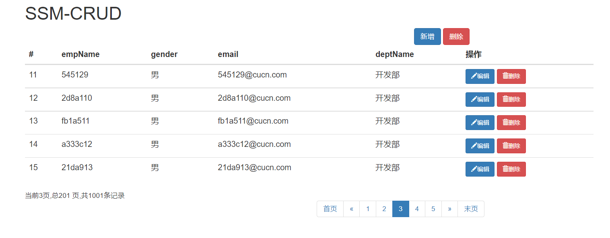
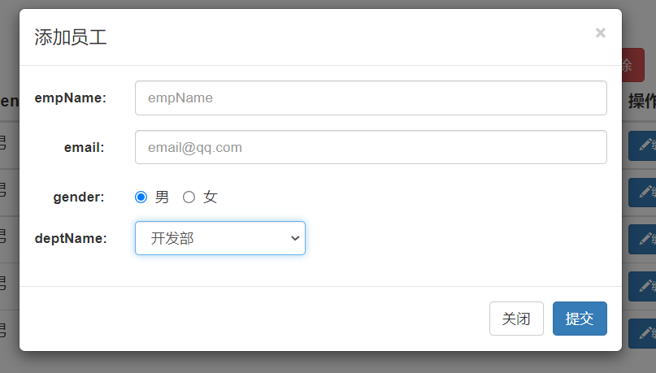
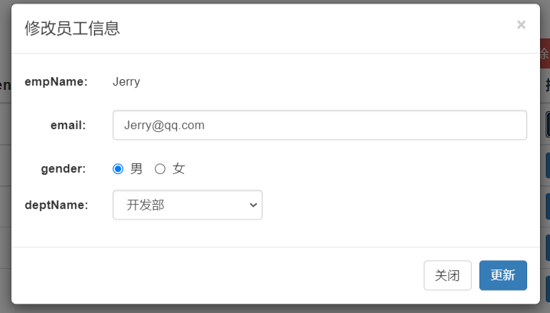

# SSM-CRUD项目


## 简介

### 功能点

1. 分页
2. 数据校验
   + jquery前端校验
   + jsr303后端校验
3. AJAX
4. Rest风格URL；使用http协议请求方式的动词，来表示对资源的操作（GET查询，POST新增，PUT修改，DELETE删除）


### 技术点

+ 基础框架-ssm
+ 数据库MySQL
+ 前端框架-bootstrap快速搭建页面
+ 项目的依赖管理-Maven
+ 分页-pagehelper
+ 逆向工程-Mybatis Generator


## 基础环境搭建


1. 创建Maven工程

   略

2. 引入项目依赖jar包

   + spring
   + mvc
   + mybatis
   + 数据库连接池，驱动包
   + 其他jstl,servlet-api,junit

   ```xml
   <dependencies>
     <!--junit-->
     <dependency>
       <groupId>junit</groupId>
       <artifactId>junit</artifactId>
       <version>4.13.2</version>
       <scope>test</scope>
     </dependency>
   
     <!--Spring,SpringMVC-->
     <dependency>
       <groupId>org.springframework</groupId>
       <artifactId>spring-webmvc</artifactId>
       <version>5.3.9</version>
     </dependency>
     <!--SpringJdbc-->
     <dependency>
       <groupId>org.springframework</groupId>
       <artifactId>spring-jdbc</artifactId>
       <version>5.3.9</version>
     </dependency>
     <!--AOP-->
     <dependency>
       <groupId>org.springframework</groupId>
       <artifactId>spring-aspects</artifactId>
       <version>5.3.9</version>
     </dependency>
   
     <!--MyBatis-->
     <dependency>
       <groupId>org.mybatis</groupId>
       <artifactId>mybatis</artifactId>
       <version>3.5.7</version>
     </dependency>
     <!--MyBatis整合Spring适配包-->
     <dependency>
       <groupId>org.mybatis</groupId>
       <artifactId>mybatis-spring</artifactId>
       <version>2.0.6</version>
     </dependency>
   
     <!--数据库连接池,驱动-->
     <dependency>
       <groupId>mysql</groupId>
       <artifactId>mysql-connector-java</artifactId>
       <version>8.0.26</version>
     </dependency>
     <dependency>
       <groupId>com.mchange</groupId>
       <artifactId>c3p0</artifactId>
       <version>0.9.5.5</version>
     </dependency>
   
     <!--jstl,servlet-api-->
     <!--jstl -->
     <dependency>
       <groupId>javax.servlet.jsp.jstl</groupId>
       <artifactId>jstl</artifactId>
       <version>1.2</version>
     </dependency>
     <!--servlet-api -->
     <dependency>
       <groupId>javax.servlet</groupId>
       <artifactId>javax.servlet-api</artifactId>
       <version>4.0.1</version>
       <scope>provided</scope>
     </dependency>
     
   </dependencies>
   ```


3. 引入BootStrap


### SSM整合

1. web.xml

   ```xml
   <?xml version="1.0" encoding="UTF-8"?>
   
   <web-app xmlns="http://xmlns.jcp.org/xml/ns/javaee"
            xmlns:xsi="http://www.w3.org/2001/XMLSchema-instance"
            xsi:schemaLocation="http://xmlns.jcp.org/xml/ns/javaee
   http://xmlns.jcp.org/xml/ns/javaee/web-app_4_0.xsd"
            version="4.0"
            metadata-complete="false">
       <welcome-file-list>
           <welcome-file>index.jsp</welcome-file>
       </welcome-file-list>
   
       <!--1.动spring容器-->
       <context-param>
           <param-name>contextConfigLocation</param-name>
           <param-value>classpath:applicationContext.xml</param-value>
       </context-param>
       <!--监听器-->
       <listener>
           <listener-class>org.springframework.web.context.ContextLoaderListener</listener-class>
       </listener>
   
       <!--2.MVC的前端控制器-->
       <servlet>
           <servlet-name>dispatcherServlet</servlet-name>
           <servlet-class>org.springframework.web.servlet.DispatcherServlet</servlet-class>
           <init-param>
               <param-name>contextConfigLocation</param-name>
               <param-value>classpath:applicationContextMVC.xml</param-value>
           </init-param>
           <load-on-startup>1</load-on-startup>
       </servlet>
       <servlet-mapping>
           <servlet-name>dispatcherServlet</servlet-name>
           <url-pattern>/</url-pattern>
       </servlet-mapping>
   
       <!--3.字符编码过滤器,放在所有过滤器之前-->
       <filter>
           <filter-name>characterEncodingFilter</filter-name>
           <filter-class>org.springframework.web.filter.CharacterEncodingFilter</filter-class>
           <init-param>
               <param-name>encoding</param-name>
               <param-value>UTF-8</param-value>
           </init-param>
           <init-param>
               <param-name>forceRequestEncoding</param-name>
               <param-value>true</param-value>
           </init-param>
           <init-param>
               <param-name>forceResponseEncoding</param-name>
               <param-value>true</param-value>
           </init-param>
       </filter>
       <filter-mapping>
           <filter-name>characterEncodingFilter</filter-name>
           <url-pattern>/*</url-pattern>
       </filter-mapping>
   
       <!--4.使用Rest风格的URL的过滤器,将普通的post转换为put或delete请求-->
       <filter>
           <filter-name>hiddenHttpMethodFilter</filter-name>
           <filter-class>org.springframework.web.filter.HiddenHttpMethodFilter</filter-class>
       </filter>
       <filter-mapping>
           <filter-name>hiddenHttpMethodFilter</filter-name>
           <url-pattern>/*</url-pattern>
       </filter-mapping>
       
       
   </web-app>
   ```


2. SpringMVC

   ```xml
   <?xml version="1.0" encoding="UTF-8"?>
   <beans xmlns="http://www.springframework.org/schema/beans"
          xmlns:xsi="http://www.w3.org/2001/XMLSchema-instance"
          xmlns:context="http://www.springframework.org/schema/context"
          xmlns:mvc="http://www.springframework.org/schema/mvc"
          xsi:schemaLocation="http://www.springframework.org/schema/beans 
          http://www.springframework.org/schema/beans/spring-beans.xsd 
          http://www.springframework.org/schema/context 
          https://www.springframework.org/schema/context/spring-context.xsd 
          http://www.springframework.org/schema/mvc 
          https://www.springframework.org/schema/mvc/spring-mvc.xsd">
   
       <!--SpringMVC的配置文件,包含网站跳转逻辑的控制,配置-->
       <context:component-scan base-package="com.kou" use-default-filters="false">
           <!--只扫描控制器-->
           <context:include-filter type="annotation" expression="org.springframework.stereotype.Controller"/>
       </context:component-scan>
       
       <!--配置视图解析器,方便页面返回-->
       <bean class="org.springframework.web.servlet.view.InternalResourceViewResolver">
           <property name="prefix" value="/WEB-INF/views/"/>
           <property name="suffix" value=".jsp"/>
       </bean>
       
       <!--两个标准配置-->
       <!--mvc不能处理的请求交给tomcat-->
       <mvc:default-servlet-handler/>
       <!--映射动态请求-->
       <mvc:annotation-driven/>
       
   </beans>
   ```


3. Spring

   ```xml
   <?xml version="1.0" encoding="UTF-8"?>
   <beans xmlns="http://www.springframework.org/schema/beans"
          xmlns:xsi="http://www.w3.org/2001/XMLSchema-instance"
          xmlns:context="http://www.springframework.org/schema/context"
          xmlns:aop="http://www.springframework.org/schema/aop"
          xmlns:tx="http://www.springframework.org/schema/tx"
          xsi:schemaLocation="http://www.springframework.org/schema/beans
          http://www.springframework.org/schema/beans/spring-beans.xsd
          http://www.springframework.org/schema/context
          https://www.springframework.org/schema/context/spring-context.xsd
          http://www.springframework.org/schema/aop
          https://www.springframework.org/schema/aop/spring-aop.xsd
           http://www.springframework.org/schema/tx
           http://www.springframework.org/schema/tx/spring-tx.xsd">
   
       <!--扫描规则-->
       <context:component-scan base-package="com.kou">
           <context:exclude-filter type="annotation" expression="org.springframework.stereotype.Controller"/>
       </context:component-scan>
   
       <!--导入外部配置文件-->
       <context:property-placeholder location="classpath:dbConfig.properties"/>
       <!--数据源-->
       <bean id="dataSource" class="com.mchange.v2.c3p0.ComboPooledDataSource">
           <property name="user" value="${jdbc.username}"/>
           <property name="password" value="${jdbc.password}"/>
           <property name="driverClass" value="${jdbc.driverClass}"/>
           <property name="jdbcUrl" value="${jdbc.jdbcUrl}"/>
       </bean>
   
       <!--mybatis-->
       <!--根据配置文件得到sqlSessionFactory-->
       <bean id="sqlSessionFactoryBean" class="org.mybatis.spring.SqlSessionFactoryBean">
           <property name="configLocation" value="classpath:mybatis-config.xml"/>
           <property name="dataSource" ref="dataSource"/>
           <!--指定xml映射文件位置-->
           <property name="mapperLocations" value="classpath:mapper/*.xml"/>
       </bean>
   
       <!--将每一个dao接口实现放入ioc容器中-->
       <bean class="org.mybatis.spring.mapper.MapperScannerConfigurer">
           <!--指定dao接口所在的包-->
           <property name="basePackage" value="com.kou.crud.dao"/>
       </bean>
   
       <!--配置事务控制-->
       <bean id="manager" class="org.springframework.jdbc.datasource.DataSourceTransactionManager">
           <property name="dataSource" ref="dataSource"/>
       </bean>
       <!--基于xml配置,配置事务;哪些方法切入事务还要写切入点表达式-->
       <aop:config>
           <!--配置切入点表达式-->
           <aop:pointcut id="txPoint" expression="execution(* com.kou.crud.service.*.*(..))"/>
           <aop:advisor advice-ref="myTx" pointcut-ref="txPoint"/>
       </aop:config>
       <!--配置事务增强属性建议-->
       <tx:advice id="myTx" transaction-manager="manager">
           <!--配置事务属性-->
           <tx:attributes>
               <tx:method name="*" rollback-for="java.lang.Exception"/>
               <tx:method name="get*" read-only="true"/>
           </tx:attributes>
       </tx:advice>
   
   </beans>
   ```


### 基础模块

生成mybatis各个模块


搭建spring单元测试环境

```xml
<!--配置一个可执行批量的sqlSession-->
<bean id="sqlSession" class="org.mybatis.spring.SqlSessionTemplate">
    <constructor-arg name="sqlSessionFactory" ref="sqlSessionFactoryBean"/>
    <constructor-arg name="executorType" value="BATCH"/>
</bean>
```

测试mapper


## 查询



步骤

1. 访问index.jsp
2. .index.jsp页面发送出查询员工列表请求
3. EmployeeController来接收请求，查出员工数据
4. 来到list.jsp页面进行展示


+ 搭建分页页面使用bootstrap

+ 显示分页数据

+ 服务器将有效数据以json形式返回给客户端

  以ajax进行

  设计一个通用的返回类

  + index.jsp直接发送ajax请求进行员工分页数据的查询

  + 服务器将查出的数据，以json字符串形式返回给浏览器

  + 浏览器收到js字符串。可以使用json进行解析，使用js通过dom增删改改变页面

  + 返回json。实现客户端的无关性


## 新增



逻辑：

1. 在index页面点击新增
2. 弹出新增对话框
3. 去数据库查询部门列表，显示在对话框中
4. 前端后端校验
5. 用户输入数据完成保存


+ uri
+ /emp/{id} GET 查询员工
+ /emp  POST 保存员工
+ /emp/{id} PUT  修改员工
+ /emp/{id} DELETE  删除员工


## 修改



逻辑：

1. 点击编辑
2. 弹出用户修改模态框（显示用户信息）
3. 点击更新完成修改


## 删除

逻辑：

单个与批量

+ URI:/emp/{id}
+ 
