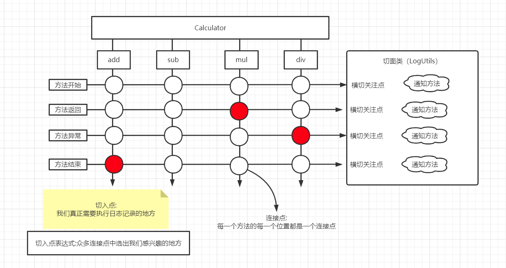

[TOC]


# SSM


## 1.Spring


### 1.1 框架

**半成品软件**

高度抽取可重用代码的一种设计；高度的通用性；

多个可重用模块的集合，形成一个某个领域的整体解决方案；


### 1.2 Spring框架

是一个容器（可以管理所有的组件(类)）框架：

核心关注：==IOC和AOP==

优点：

+ 非侵入式
+ 依赖注入
+ 面向切面编程
+ 容器
+ 组件化
+ 一站式


### 1.3 IOC和DI概述

#### IOC：（Inversion of control）控制反转

控制：获取资源的方式；

+ 主动式

  要什么资源都自己创建

  复杂对象的创建是比较庞大的工程


+ 被动式

  资源的获取不是我们自己创建，而是交给容器创建和设置


容器：管理所有的组件（有功能的类）；容器可以自动的探查出哪些组件（类）需要用到另一些组件（类）；容器帮助我们创建对象，并且把对象赋值过去；

主动的new资源变为被动的接收资源；


#### DI：（Dependency Injection）依赖注入

容器能知道哪个组件（类）在运行时，需要另一个组件（类）；容器通过反射的形式，将容器中准备好的对象注入（利用反射给属性赋值）到类中。


只要是容器管理的组件，都能使用容器提供的强大功能。


### 1.4 Hello World

==代码：ioc_01==

#### 通过各种方式给容器中注册对象

以前是自己new对象，现在所有对象交给容器创建；==给容器中注册组件==


流程：

1. 导包

   ```xml
   <!--Spring核心包-->
   <dependency>
       <groupId>org.springframework</groupId>
       <artifactId>spring-context</artifactId>
       <version>5.3.6</version>
   </dependency>
   <dependency>
       <groupId>org.springframework</groupId>
       <artifactId>spring-beans</artifactId>
       <version>5.3.6</version>
   </dependency>
   <dependency>
       <groupId>org.springframework</groupId>
       <artifactId>spring-core</artifactId>
       <version>5.3.6</version>
   </dependency>
   <dependency>
       <groupId>org.springframework</groupId>
       <artifactId>spring-expression</artifactId>
       <version>5.3.6</version>
   </dependency>
       
   <!--Spring日志包-->
   <dependency>
       <groupId>commons-logging</groupId>
       <artifactId>commons-logging</artifactId>
       <version>1.2</version>
   </dependency>
   ```

   

2. 写配置

   spring配置文件中，集合了spring的ioc容器管理的所有组件

   创建配置文件

   ```xml
   <!--注册一个person对象,Spring会自动创建这个person对象-->
   <!--一个bean标签可以注册一个组件(对象，类)
   class:写要注册的组件的全类名
   id:这个对象的唯一标识
   name:属性名
   valueL:给属性赋值
   -->
   <bean id="person" class="com.kou.bean.Person">
   <!--使用property给属性赋值        -->
       <property name="lastName" value="Kou"/>
       <property name="gender" value="男"/>
       <property name="email" value="kou1688@foxmail.com"/>
       <property name="age" value="18"/>
   </bean>
   ```

   

3. 测试

   ```java
   /**
    * 从容器中拿到这个组件
    */
   @Test
   public void test1(){
       /*
       ApplicationContext:代表ioc容器
       当前应用的xml配置文件在classpath下
       根据spring配置文件得到ioc容器对象
       */
       ClassPathXmlApplicationContext context = new ClassPathXmlApplicationContext("ioc.xml");
       //容器帮我们创建好对象了
       Person bean = context.getBean("person",Person.class);
       System.out.println(bean);
   }
   ```

   

两种方式：

+ ```java
  new FileSystemXmlApplicationContext
  ```

  

+ ```java
  new ClassPathXmlApplicationContext
  ```


==单例:==

https://www.runoob.com/design-pattern/singleton-pattern.html


```java
/*
ApplicationContext:代表ioc容器
当前应用的xml配置文件在classpath下
根据spring配置文件得到ioc容器对象
 几个细节:
 1. ApplicationContext（IOC容器的接口）
 2. 组件的创建工作,是由容器完成;
     Person对象是什么时候创建好了？
     容器中对象的创建在容器创建完成的时候就已经创建好了
 3.同一个组件在ioc容器中是单例的;容器启动完成之前都已经创建准备好的
 4.容器中如果没有组件,获取组件?
    org.springframework.beans.factory.NoSuchBeanDefinitionException: No bean named '**' available
 5.ioc容器在创建这个组件对象时,(property)会利用setter方法进行赋值
 6.javaBean的属性名是由什么决定的?
    Getter/Setter方法是属性名
    set去掉后面那后面一串首字母小写就是属性名
    所有的getter/setter都用自动生成的
*/	
```


##### 构造器赋值

第一种（掌握）

```xml
<!--调用有参构造器进行创建对象并赋值-->
<bean id="person03" class="com.kou.bean.Person">
    <constructor-arg name="lastName" value="小花"/>
    <constructor-arg name="gender" value="女"/>
    <constructor-arg name="email" value="111@qq.com"/>
    <constructor-arg name="age" value="18"/>
</bean>
```


第二种（了解）

```xml
<!--省略name属性的构造器注入,按照构造器参数的位置-->
<bean id="person04" class="com.kou.bean.Person">
    <constructor-arg name="age" index="1" value="18"/>
    <constructor-arg name="email" index="3" value="222@qq.com"/>
    <constructor-arg name="lastName" index="0" value="小花"/>
    <constructor-arg name="gender" index="2" value="女"/>
</bean>
```


##### 通过p名称空间为bean赋值

名称空间是用来防止标签重复的

```xml
<!--p名称空间赋值-->
<!--名称空间是用来防止标签重复的-->
<bean id="person06" class="com.kou.bean.Person"
p:age="18" p:email="666@qq.com" p:gender="男" p:lastName="小明">
</bean>
```


##### 正确的为各种类型属性赋值

###### 集合类属性

```xml
<bean id="car01" class="com.kou.bean.Car">
    <property name="carName" value="宝马"/>
    <property name="color" value="绿色"/>
    <property name="price" value="300000"/>
</bean>
<bean id="book01" class="com.kou.bean.Book">
    <property name="bookName" value="东游记"/>
    <property name="author" value="作者"/>
</bean>
<!--实验4:正确的为各种类型属性赋值-->
<bean id="person01" class="com.kou.bean.Person">
    <!--设置null值-->
    <property name="lastName">
        <null/>
    </property>
    <!--设置引用类型值 引用外部Bean-->
    <property name="car" ref="car01"/>
</bean>
<bean id="person02" class="com.kou.bean.Person">
    <!--如何为list赋值-->
    <property name="books">
        <list>
            <!--内部 内部bean id不能被引用-->
            <bean class="com.kou.bean.Book" p:bookName="西游记" p:a
            <!--引用外部-->
            <ref bean="book01"/>
        </list>
    </property>
    <!--Map-->
    <property name="maps">
        <map>
            <!--一个entry代表一个键值对-->
            <entry key="key01" value="张三"/>
            <entry key="key02" value="18"/>
            <entry key="key03" value-ref="book01"/>
            <entry key="key04">
                <bean class="com.kou.bean.Car">
                    <property name="carName" value="宝马"/>
                </bean>
            </entry>
            <!--<entry>
                <map></map>
            </entry>-->
        </map>
    </property>
    <!--properties-->
    <property name="properties">
        <!--所有的k=v都是string-->
        <props>
            <prop key="username">root</prop>
            <prop key="password">1234</prop>
        </props>
    </property>
</bean>
```


```xml
<!--util名称空间创建集合类型的bean-->
<!--相当于new LinkedHashMap<>()-->
<util:map id="myMap">
    <!--添加元素-->
    <entry key="key01" value="张三"/>
    <entry key="key02" value="18"/>
    <entry key="key03" value-ref="book01"/>
    <entry key="key04">
        <bean class="com.kou.bean.Car">
            <property name="carName" value="宝马"/>
        </bean>
    </entry>
</util:map>
<!--
[ [],Person,12,{} ]
-->
<util:list id="myList">
    <list/>
    <bean class="com.kou.bean.Person"/>
    <value/>
    <ref bean="myMap"/>
</util:list>
```


###### 级联属性赋值

属性的属性


```xml
<!--
级联属性赋值
级联属性可以修改属性的属性,注意原来的bean会被修改
-->
<bean id="person4" class="com.kou.bean.Person">
    <!--为car赋值时，改变car的价格-->
    <property name="car" ref="car01"/>
    <!---->
    <property name="car.price" value="90000"/>
</bean>
```


##### bean重用 模板bean bean之间依赖 作用域

通过继承实现bean配置信息的重用

```xml
<bean id="person5" class="com.kou.bean.Person">
    <property name="lastName" value="张三"/>
    <property name="age" value="18"/>
    <property name="gender" value="男"/>
    <property name="email" value="666@kou.com"/>
</bean>
<!--parent:指定当前bean的配置信息继承与哪一个-->
<bean id="person6" parent="person5">
    <property name="lastName" value="李四"/>
</bean>
```


通过abstract属性创建一个模板bean

```xml
<!--abstract="true" 这个bean配置是一个抽象的,不能获取他的实例,只能被别人用来继承-->
<bean id="person5" class="com.kou.bean.Person" abstract="true">
    <property name="lastName" value="张三"/>
    <property name="age" value="18"/>
    <property name="gender" value="男"/>
    <property name="email" value="666@kou.com"/>
</bean>
```


bean之间的依赖

```xml
<!--
原来是按照配置bean顺序创建bean
可以改变bean的创建顺序
实验8:bean之间的依赖（只是改变创建顺序）
-->
<bean id="person" class="com.kou.bean.Person" depends-on="car,book"/>
<bean id="car" class="com.kou.bean.Car"/>
<bean id="book" class="com.kou.bean.Book"/>
```


实验9:测试bean的作用域,分别创建单实例和多实例的bean♥

```xml
<!--
实验9:测试bean的作用域,分别创建单实例和多实例的bean♥
bean作用域:指定bean是否单实例,xxx;默认:单实例
prototype:多实例(原型)
1.容器启动默认不会去创建多实例bean
2.获取的时候创建这个bean
3.每次获取都会创建一个新的对象
singleton:单例(默认)
1.在容器启动完成之前就已经创建好对象，保存在容器中了
2.任何获取都是获取之前创建好的哪个对象
-->
<bean id="book" class="com.kou.bean.Book">
</bean>
```


##### 配置工厂方法创建的bean

实验五:配置通过静态工厂方法创建的bean、实例工厂方法创建的bean、FactoryBean

bean的创建默认就是框架利用反射new出来的bean实例
工厂模式:工厂帮我们创建对象
静态工厂:工厂本身不用创建对象;通过静态方法调用,对象=工厂类.工厂方法名();
实例工厂:工厂本身需要创建对象;
工厂类 工厂对象=new 工厂类();
工厂对象.方法名("");


```xml
<!--1.静态工厂(不需要创建工厂本身) factory-method指定工厂方法-->
<bean id="airPlane01" class="com.kou.factory.AirPlaneStaticFactory" factory-method="getAirPlane">
    <!--可以为方法指定参数-->
    <constructor-arg value="李四"/>
</bean>
```


```xml
<!--2.实例工厂
    先配置出实例工厂对象
    配置我们要创建的AirPlane使用哪个工厂创建
    factory-bean:使用哪个工厂实例
    factory-method:使用哪个工厂方法
-->
<bean id="airPlaneInstanceFactory" class="com.kou.factory.AirPlaneInstanceFactory"/>
<bean id="airPlane02" class="com.kou.bean.AirPlane" factory-bean="airPlaneInstanceFactory"
      factory-method="getAirPlane">
    <constructor-arg value="张三"/>
</bean>
```


###### 实现FactoryBean的工厂

```java
/**
 * 实现了FactoryBean接口的类是Spring可以认识的工厂类
 * Spring会自动地调用工厂方法创建实例
 * 1.编写一个FactoryBean的实现类
 * 2.在spring配置文件中进行注册
 *
 * @author Kou
 * @date: 2021/7/28 15:25
 */
public class MyFactoryBeanImpl implements FactoryBean<Book> {

    /**
     * 是单例?
     *
     * @return false:不是单例;true:是单例
     */
    @Override
    public boolean isSingleton() {
        return false;
    }

    /**
     * 工厂方法;
     *
     * @return 返回创建的对象
     */
    @Override
    public Book getObject() throws Exception {
        Book book = new Book();
        book.setBookName(UUID.randomUUID().toString());
        return book;
    }

    /**
     * Spring会自动调用这个方法来确认创建的对象是什么类型
     *
     * @return 返回创建的对象类型
     */
    @Override
    public Class<?> getObjectType() {
        return Book.class;
    }
}
```

```xml
<!--FactoryBean是Spring规定的一个接口,只要是这个接口的实现类.Spring都认为是一个工厂
ioc容器启动时不会创建工厂实例-->
<bean id="myFactoryBeanImpl" class="com.kou.factory.MyFactoryBeanImpl"/>
```


##### 创建带有生命周期方法的Bean


代码：ioc_02

```xml
<!--
创建带有生命周期方法的bean
生命周期:bean的创建到销毁
    ioc容器中注册的bean：
        1.单例的bean,容器启动的时候就会创建好,容器关闭也会销毁创建的bean
        2.多实例bean,获取的时候才创建;
    我们可以为bean自定义一些生命周期方法;spring在创建或者销毁的时候就会调用指定的方法
    自定义初始化方法和销毁方法:可以抛异常,但不能有参数
-->
<bean id="book01" class="com.kou.bean.Book" init-method="myInit" destroy-method="myDestroy" scope="prototype">
</bean>
```

```java
/**
 * Bean的生命周期
 * 单例:
 * 构造器---->初始化方法---->(容器关闭)销毁方法
 * 多实例:
 * 获取bean(构造器--->初始化方法)---->容器关闭不会调用bean的销毁方法
 */
```


##### Bean的后置处理器

```java
/**
 * 1.编写后置处理器的实现类
 * 2.将后置处理器注册在配置文件中
 *
 * @author Kou
 * @date: 2021/7/28 18:02
 */
public class MyBeanPostProcessor implements BeanPostProcessor {
    /**
     * 初始化之前调用
     *
     * @param bean 将要初始化的bean
     * @return 返回传入的bean
     */
    @Override
    public Object postProcessBeforeInitialization(Object bean, String beanName) throws BeansException {
        System.out.println(beanName + " bean将调用初始化方法 " + bean);
        return bean;
    }

    /**
     * 初始化方法之后调用
     *
     * @param bean     初始化的bean
     * @param beanName 在xml中配置的id
     * @return 返回的是什么,容器中保存的就是什么
     */
    @Override
    public Object postProcessAfterInitialization(Object bean, String beanName) throws BeansException {
        System.out.println(beanName + " bean初始化方法调用完了 " + bean);
        return bean;
    }
}
```

```xml
<!--
测试bean的后置处理器
Spring有一个接口:后置处理器:可以在bean的初始化前后调用方法
无论bean是否有初始化方法;后置处理器都会默认其有
-->
<bean id="beanPostProcessor" class="com.kou.bean.MyBeanPostProcessor"/>
```


##### Spring管理连接池


```xml
<!--实验12:引用外部配置文件*-->
<!--数据库连接池作为单实例是最好的;一个项目就一个连接池,连接池里面管理很多连接-->
<!--可以让Spring帮我们创建连接池对象,（管理连接池）-->
<bean id="dataSource" class="com.mchange.v2.c3p0.ComboPooledDataSource">
    <property name="user" value="root"/>
    <property name="password" value="1234"/>
    <property name="jdbcUrl" value="jdbc:mysql://localhost:3306/jdbcstudy?
    serverTimezone=GMT%2B8&amp;useSSL=false&amp;useUnicode=true&amp;characterEncoding=utf8"/>
    <property name="driverClass" value="com.mysql.cj.jdbc.Driver"/>
</bean>
```

测试：

```java
/**
 * 从容器中拿到连接池
 */
@Test
public void test02() throws SQLException {
    //按照类型获取，可以获取这个类型下的所有类子类等等
    DataSource bean = ioc.getBean("dataSource",DataSource.class);
    System.out.println(bean.getConnection());
}
```


引用外部文件：

```xml
<!--实验12:引用外部配置文件*,依赖Context名称空间-->
<!--数据库连接池作为单实例是最好的;一个项目就一个连接池,连接池里面管理很多连接-->
<!--可以让Spring帮我们创建连接池对象,（管理连接池）-->
<!--加载外部配置文件  classpath:表示引用类路径下的文件-->
<context:property-placeholder location="classpath:dbconfig.properties"/>
<bean id="dataSource" class="com.mchange.v2.c3p0.ComboPooledDataSource">
    <property name="user" value="${jdbc.username}"/>
    <property name="password" value="${jdbc.password}"/>
    <property name="jdbcUrl" value="${jdbc.Url}"/>
    <property name="driverClass" value="${jdbc.driverClass}"/>
</bean>
```


##### SPEL测试

spring expression language   spring表达式语言

```xml
<!--SPel测试-->
<bean id="person04" class="com.kou.bean.Person">
    <!--字面量-->
    <property name="age" value="#{12345*6}"/>
    <!--引用其他bean的属性值-->
    <property name="lastName" value="#{book01.bookName}"/>
    <property name="car" value="#{car}"/>
    <!--调用静态方法-->
    <property name="email" value="#{T(java.util.UUID).randomUUID().toString()}"/>
    <!--调用非静态方法-->
    <property name="gender" value="#{book01.getBookName()}"/>
</bean>
```


### 1.5 基于XML的自动装配（自定义类型自动赋值）

自定义类型的属性是一个对象，这个对象在容器中可能存在

```xml
<bean id="car" class="com.kou.bean.Car">
    <property name="carName" value="宝马"/>
    <property name="color" value="白色"/>
</bean>
<bean id="book01" class="com.kou.bean.Book">
    <property name="bookName" value="book1"/>
</bean>
<bean id="book02" class="com.kou.bean.Book">
    <property name="bookName" value="book2"/>
</bean>
<bean id="book03" class="com.kou.bean.Book">
    <property name="bookName" value="book3"/>
</bean>

<!--自动赋值(自动装配):仅限于对自定义类型有效
    按照某种规则自动装配
    autowire="byName"
    按照名字:private Car car;
    1.以属性名作为id去容器中找到这个组件,给它赋值。如果找不到就装配null
    autowire="byType"
    1.按照属性类型作为查找依据去容器中找到这个组件;
    ioc.getBean(Car.class)
    2.如果容器中有多个这种类型的组件,报错
    3.如果没找到,装配null
    按照构造器:autowire="constructor"
    1.先按照有参构造器参数的类型进行装配,没有就直接为组件装配null
    2.如果按照类型找到多个;参数名作为id继续匹配
    3.不会报错
自动为属性赋值
-->
<bean id="person" class="com.kou.bean.Person" autowire="byType"/>
```


### 1.6 利用注解装配

**代码ioc_03**

#### 1.6.1 概述

```xml
<!--
    实验15:使用注解分别创建Dao,Service,Controller(控制器:控制网站跳转逻辑Servlet)*
    通过给bean上添加某些注解，可以快速的将bean加入到ioc容器
    四个注解:
    某个类上添加上任何一个注解就能快速将这个组件加入到ioc容器的管理中
    @Controller:给控制层(Servlet)组件添加这个注解
    @Service:给业务逻辑层组件添加
    @Repository:给数据持久层组件添加这个组件
    @Component:组件,不属于以上基层的组件添加
    id默认是类名首字母小写
    注解可以随便加
    Spring底层不会去验证你的这个组件,是否如你注解所说就是一个dao层的或者就是control层组件
    推荐各自层加各自层注解,给程序员看的
    使用注解快速将组件加入容器:
    1.给要添加的组件上标四个注解中的任何一个
    2.告诉Spring自动扫描加了注解的组件,依赖context名称空间
    3.一定要导入AOP包
-->
<!--
    context:component-scan:自动组件扫描
    base-package:指定扫描的基础包,把基础包及他下面所有的包的所有加了注解的类,自动的扫描进ioc容器
-->
<context:component-scan base-package="com.kou"/>
```

```java
/**
 * 使用注解加入到容器中的组件,和使用配置加入到容器中的组件行为都是一样的
 * 1.组件的id,默认就是组件的类名首字母小写
 * 2.组件的作用域,默认就是单例的
 */
```


#### 1.6.2 context:exclude/include-filter排除不必要/指定要的组件

```xml
<context:component-scan base-package="com.kou">
    <!--
    type="annotation" 指定排除规则;按照注解排除;标注了指定注解的组件不要
    expression="" 写注解的全类名
    type="assignable"  按照类排除
    expression="" 写类的全类名
    -->
    <!--<context:exclude-filter type="aspectj" expression="org.springframework.stereotype.Controller"/>-->
    
    <!--context:include-filter 只要哪些组件-->
    <!--context:component-scan 添加use-default-filters="false"-->
    <context:include-filter type="" expression=""/>
</context:component-scan>
```


#### ==1.6.3 AutoWired==

自动装配，优先使用byType，有多个实现类时，使用byName。如果`@Autowired`不能唯一自动装配上属性，则需要通过`@Qualifier(value="xx")`指定注入的对象。建议使用在set方法上。

当将 `@Autowired `注解直接写在成员变量上时，即使设定该成员变量的访问权限为private，那么也会自动将其改变成public；而将 `@Autowired `注解写在成员变量的 setter 方法上则不会出现此问题。所以不建议使用前者

`required属性=false` 指定某个属性的值可以不被设置


**原理**：

```java
@Autowired
private BookService bookService;
/**
先按照类型去容器中找到对应的组件; 
bookService=ioc.getBean("BookService.class");
找到就赋值

没找到就抛异常

找到多个？
 按照变量名作为id继续匹配
 	匹配上？
 	没有匹配？报错

 Qualifier指定一个名为id 
 @Qualifier("")
 
*/
```


方法上有Autowired的话，方法会在bean创建时自动运行，方法上的每一个参数都会自动注入值

@Qualifier("xx")，可以在方法形参位置使用，指定注入的id


##### @Resource与@Autowired的区别

事实上，他们的基本功能都是通过注解实现**依赖注入**，只不过`@Autowired`是`Spring`定义的，而`@Resource`是`JSR-250`定义的。大致功能基本相同，但是还有一些细节不同：

- **依赖识别方式**：@Autowired默认是**byType**可以使用@Qualifier指定Name，@Resource**默认ByName**如果**找不到则ByType**
- **适用对象**：@Autowired可以对**构造器、方法、参数、字段**使用，@Resource只能对**方法、字段**使用
- **提供方**：@Autowired是**Spring**提供的，@Resource是**JSR-250**提供的

`@Resource`扩展性更强，如果切换成另一个容器框架，`@Resource`还是可以使用的


### 1.7 Spring的单元测试

`@ContextConfiguration`指定spring配置文件的位置

==注意！！！！==

SpringJUnit4ClassRunner requires JUnit 4.12 or higher.

```java
@ContextConfiguration(locations = "classpath:applicationContext.xml")
@RunWith(SpringJUnit4ClassRunner.class)
```

Spring单元测试 Junit版本必须是4.13以上

```java
@Autowired
BookController bookController;
@Autowired
BookService bookService;
//不需要再getBean了
```


### 1.8 泛型依赖注入

**代码 ioc_04**

注入一个组件的时候，他的泛型也是参考标准

Spring中可以使用带泛型的父类类型来确定这个子类


### 1.9 IOC总结

ioc是一个容器，帮我们管理所有的组件

1. 依赖注入：@Autowired，自动赋值；
2. 某个组件要使用Spring提供的更多功能必须加入到容器中；


+ 体会：
  1. 容器启动，创建所有单实例bean
  2. autowired自动装配时，是从容器中找这些符合要求的bean
  3. ioc.getBean("***");也是从容器中找到这个bean；
  4. 容器中包括了所有的bean
  5. 调试spring源码，容器到底是什么？其实就是一个map
  6. 这个map中保存所有创建好的bean，并提供外界获取功能
  7. 探索单实例都保存在哪个map中。【源码-扩展】
  8. 源码调试思路
     + 从helloworld开始，给helloworld每一个关键步骤打上断点。进去看里面都做了什么工作。
     + 翻译这个方法干什么的
     + 放行这个方法，看控制台，看debug的每一个变量变化
     + 看方法注释


### 1.10 AOP场景

**代码：aop_01**


AOP：（Aspect Oriented Programming）面向切面编程

OOP：（Object Oriented Programming）面向对象编程


AOP：基于OOP基础之上新的编程思想

指在程序运行期间，将某段代码==动态的切入==到==指定方法的指定位置==进行运行的这种编程方式，称为面向切面编程


场景：计算器运行方法的时候进行日志记录；

1. 直接编写在方法内部；不推荐；修改维护麻烦

   日志记录：系统的辅助功能

   业务逻辑：核心功能

   耦合了

2. 我们希望的是：

   日志模块，在核心功能运行期间，自己动态的加上；

   可以使用动态代理将日志代码动态的在目标方法执行前后先进行执行；


#### 动态代理

JDK提供的动态代理：Proxy类


```java
/**
 * 帮Calculator.java生成代理对象的类
 * newProxyInstance(ClassLoader loader,类<?>[] interfaces,InvocationHandler h)
 *
 * @author Kou
 * @date: 2021/7/30 15:06
 */
public class CalculatorProxy {
    /**
     * 为传入的参数对象创建一个动态代理对象
     *
     * @param calculator 被代理对象
     * @return 代理对象
     */
    public static Calculator getProxy(final Calculator calculator) {
        //被代理对象的类加载器
        ClassLoader loader = calculator.getClass().getClassLoader();
        //被代理对象实现的接口
        Class<?>[] classes = calculator.getClass().getInterfaces();

        //方法执行器;帮助我们目标对象执行目标方法
        InvocationHandler handler = new InvocationHandler() {
            /**
             *
             * @param proxy 代理对象;给jdk使用,任何时候都不要动这个对象
             * @param method 被代理对象的方法
             * @param args 目标方法的参数值
             * @return result
             */
            @Override
            public Object invoke(Object proxy, Method method, Object[] args) {

                //利用反射执行目标方法
                //目标方法执行后的返回值
                Object result = null;
                try {
                    System.out.println(method.getName() + "方法开始执行,用的参数列表:" + Arrays.asList(args));
                    result = method.invoke(calculator, args);
                    System.out.println(method.getName() + "方法执行完成,计算结果是:" + result);
                } catch (Exception e) {
                    System.out.println(method.getName() + "方法执行出现异常,异常信息为" + e.getCause() + "通知异常小组进行排查");
                } finally {
                    System.out.println(method.getName() + "方法最终结束了");
                }

                return result;
            }
        };

        //Proxy为目标创建代理对象
        Object proxy = Proxy.newProxyInstance(loader, classes, handler);

        return (Calculator) proxy;
    }
}
```


有了动态代理，日志记录可以做的非常强大，而且与业务逻辑解耦


加一个LogUtils类，优化日志

```java
public class LogUtils {

    public static void logStart(Method method, Object... args) {
        System.out.println(method.getName() + "方法开始执行,用的参数列表:" + Arrays.asList(args));
    }

    public static void logReturn(Method method, Object result) {
        System.out.println(method.getName() + "方法执行完成,计算结果是:" + result);
    }

    public static void logException(Method method, Exception e) {
        System.out.println(method.getName() + "方法执行出现异常,异常信息为" + e.getCause() + "通知异常小组进行排查");
    }

    public static void logFinally(Method method) {
        System.out.println(method.getName() + "方法最终结束了");
    }
}
```


```java
/**
 * 帮Calculator.java生成代理对象的类
 * newProxyInstance(ClassLoader loader,类<?>[] interfaces,InvocationHandler h)
 *
 * @author Kou
 * @date: 2021/7/30 15:06
 */
public class CalculatorProxy {
    /**
     * 为传入的参数对象创建一个动态代理对象
     *
     * @param calculator 被代理对象
     * @return 代理对象
     */
    public static Calculator getProxy(final Calculator calculator) {
        //被代理对象的类加载器
        ClassLoader loader = calculator.getClass().getClassLoader();
        //被代理对象实现的接口
        Class<?>[] classes = calculator.getClass().getInterfaces();

        //方法执行器;帮助我们目标对象执行目标方法
        InvocationHandler handler = new InvocationHandler() {
            /**
             *
             * @param proxy 代理对象;给jdk使用,任何时候都不要动这个对象
             * @param method 被代理对象的方法
             * @param args 目标方法的参数值
             * @return result
             */
            @Override
            public Object invoke(Object proxy, Method method, Object[] args) {

                //利用反射执行目标方法
                //目标方法执行后的返回值
                Object result = null;
                try {
                    LogUtils.logStart(method, args);
                    result = method.invoke(calculator, args);
                    LogUtils.logReturn(method, result);
                } catch (Exception e) {
                    LogUtils.logException(method, e);
                } finally {
                    LogUtils.logFinally(method);
                }

                return result;
            }
        };

        //Proxy为目标创建代理对象
        Object proxy = Proxy.newProxyInstance(loader, classes, handler);

        return (Calculator) proxy;
    }
}
```


动态代理：

+ 写起来难
+ jdk动态代理，如果被代理对象没有实现任何接口，是无法为他创建代理对象的


所以Spring实现了AOP功能，底层就是动态代理

1. 可以利用Spring一句代码都不写的去创建动态代理

   实现简单，并且没有强制要求必须实现接口


### 1.11 AOP


#### 1.11.1 AOP专业术语




#### 1.11.2 AOP使用


**代码：aop_02**

+ 导包

  ```xml
  <!--AOP-->
  <dependency>
      <groupId>org.springframework</groupId>
      <artifactId>spring-aop</artifactId>
      <version>5.3.6</version>
  </dependency>
  <dependency>
      <groupId>org.aspectj</groupId>
      <artifactId>aspectjweaver</artifactId>
      <version>1.9.2</version>
  </dependency>
  <!--cglib动态代理-->
  <dependency>
      <groupId>cglib</groupId>
      <artifactId>cglib</artifactId>
      <version>3.3.0</version>
  </dependency>
  ```

  

+ 写配置

  1. 将目标类和切面类(封装了通知方法 ( 在目标方法执行前后执行的方法 ) ) 加入到ioc容器中

  2. 还应该告诉spring，到底哪个是切面`@Aspect`

     

  3. 告诉spring切面类里面的每一个方法都是何时何地运行

     ```java
     /**
     写切入点表达式:
     execution(访问权限符 返回值类型 方法签名)
     @Before("execution(public int com.kou.impl.MyMathCalculator.*(int,int))")
     */
     ```

  4. 开启基于注解的aop功能

     ```xml
     <aop:aspectj-autoproxy/>
     ```

```java
/**
告诉spring每个方法都什么时候运行
想在执行目标方法之前运行
<p>
通知注解
Before:在目标方法之前运行  前置通知
After:在目标方法之后运行  后置通知
AfterReturning:在目标方法正常返回之后  返回通知
AfterTrowing:在目标方法抛出异常之后  异常通知
Around:环绕  环绕通知
写切入点表达式:
execution(访问权限符 返回值类型 方法签名)
*/
```


```java
@Aspect
@Component
public class LogUtils {

    /**
     * 告诉spring每个方法都什么时候运行
     * 想在执行目标方法之前运行
     * <p>
     * 通知注解
     * Before:在目标方法之前运行  前置通知
     * After:在目标方法之后运行  后置通知
     * AfterReturning:在目标方法正常返回之后  返回通知
     * AfterTrowing:在目标方法抛出异常之后  异常通知
     * Around:环绕  环绕通知
     *
     * 写切入点表达式:
     * execution(访问权限符 返回值类型 方法签名)
     */
    @Before("execution(public int com.kou.impl.MyMathCalculator.*(int,int))")
    public static void logStart() {
        System.out.println("xxxx" + "方法开始执行,用的参数列表:" + "xxxxx");
    }

    /**
     * 想在目标方法正常完成之后执行
     */
    @After("execution(public int com.kou.impl.MyMathCalculator.*(int,int))")
    public static void logReturn() {
        System.out.println("xxxxx" + "方法执行完成,计算结果是:" + "xxxxx");
    }

    /**
     * 想在目标方法出现异常执行
     */
    @AfterThrowing("execution(public int com.kou.impl.MyMathCalculator.*(int,int))")
    public static void logException() {
        System.out.println("xxxx" + "方法执行出现异常,异常信息为" + "xxxxx" + "通知异常小组进行排查");
    }

    /**
     * 想在目标方法return结束时执行
     */
    @AfterReturning("execution(public int com.kou.impl.MyMathCalculator.*(int,int))")
    public static void logFinally() {
        System.out.println("xxxx" + "方法最终结束了");
    }
}
```


#### 1.11.3 AOP细节


##### 容器中保存的是代理对象


##### cglib为没有接口的组件也能创建代理对象


##### 切入点表达式写法（通配符）

```Java
/**
切入点表达式的写法;
固定写法:execution(访问权限符 返回值类型 方法签名)
<p>

权限位置不能写通配符

通配符:
* :匹配一个或多个字符
execution(public int com.kou.impl.MyMath*r.*(int,int))
匹配任意一个参数:
execution(public int com.kou.impl.MyMathCalculator.*(int,*))
.. :
匹配任意多个参数,任意类型参数:
execution(public int com.kou.impl.MyMathCalculator.*(..))
匹配一层路径:
execution(public int com.kou.*.MyMathCalculator.*(int,int))
匹配多层路径:
execution(public int com.kou..MyMathCalculator.*(int,int))

最模糊的一种:
execution(* *.*(..)) 不推荐写

可以使用逻辑运算符
*/
```


##### 运行顺序

==spring5里：@Before--->@AfterReturning--->@After==


##### 在通知方法执行的时候，拿到目标方法的详细信息

只需要为通知方法的参数列表上写一个参数：JoinPoint

```java
//JoinPoint joinPoint:封装了当前目标方法的详细信息
//@AfterReturning 里用一个Object result来接收返回值
//Exception exception
//指定通知方法可以接收哪些异常信息
```


##### Spring对通知方法的约束

spring对通知方法的要求不严格

==唯一要求的就是方法的参数列表一定不能乱写==

因为通知方法是spring利用反射调用的，每次方法调用得确定这个方法的参数的值;

参数表上的每一个参数,Spring都得知道是什么

不知道的参数一定告诉spring这是什么


##### 切入点表达式的重用

```java
/**
 * 抽取可重用的切入点表达式:
 * 1.随便声明一个没有实现的返回void的空方法
 * 2.给方法上标注PointCut注解
 */
@Pointcut("execution(public int com.kou.impl.MyMathCalculator.*(int,int))")
public void myPoint() {
}
```


##### ==环绕通知==

```java
/**
 * 环绕通知:
 * Spring中最强大的通知方法
 * 根本上就是动态代理
 * method.invoke(obj,args)
 * <p>
 * 四合一通知就是环绕通知;
 * 环绕通知中有一个参数:ProceedingJoinPoint pjp
 */
@Around("myPoint()")
public static Object myAround(ProceedingJoinPoint pjp) throws Throwable {
    Object[] args = pjp.getArgs();
    String name = pjp.getSignature().getName();
    Object proceed = null;
    try {
        //环绕前置通知:
        System.out.println(name + "方法开始执行,用的参数列表:" + Arrays.asList(args));
        //就是利用反射调用目标方法,就是method.invoke
        proceed = pjp.proceed(args);
        //返回通知
        System.out.println(name + "方法执行完成,计算结果为" + proceed);
    } catch (Exception e) {
        System.out.println(name + "方法执行出现异常,异常信息为" + e + "通知异常小组进行排查");
    } finally {
        //后置通知
        System.out.println(name + "方法结束");
    }
    //反射调用后的返回值也一定返回出去
    return proceed;
}
```


##### 环绕通知的执行顺序&&抛出异常让其他通知感受到

环绕通知是优于普通通知执行，执行顺序：

环绕前置---普通前置---目标方法执行-----环绕返回/出现异常----环绕后置---普通返回-----普通后置/异常

```java
//为了让外界能知道这个异常，这个异常一定要抛出去
throw new RuntimeException(e);
```


##### 多切面优先级问题


类似于栈

优先级可以按照切面类首字母来算

==使用@Order设置优先级，数值越小优先级越高==

环绕只是影响当前切面


#### 1.11.4 AOP应用

+ 日志：保存到数据库
+ 权限验证
+ 安全检查
+ 事务控制


#### 1.11.5 基于配置的AOP

**代码：aop_03**

```xml
<!--基于配置的AOP-->
<bean id="myMathCalculator" class="com.kou.impl.MyMathCalculator">
</bean>
<bean id="logUtils" class="com.kou.utils.LogUtils">
</bean>
<bean id="validateAspect" class="com.kou.utils.ValidateAspect">
</bean>
<!--需要AOP名称空间-->
<aop:config>
    <aop:pointcut id="myPoint" expression="execution(* com.kou.impl.*.*(..))"/>
    <!--指定切面-->
    <aop:aspect ref="logUtils">
        <aop:before method="logStart" pointcut="execution(* com.kou.impl.*.*(..))"/>
        <aop:after-returning method="logReturn" pointcut-ref="myPoint" returning="result"/>
        <aop:after-throwing method="logException" pointcut-ref="myPoint" throwing="exception"/>
        <aop:after method="logAfter" pointcut-ref="myPoint"/>
    </aop:aspect>
    <aop:aspect ref="validateAspect">
        <aop:before method="logStart" pointcut="execution(* com.kou.impl.*.*(..))"/>
        <aop:after-returning method="logReturn" pointcut-ref="myPoint" returning="result"/>
        <aop:after-throwing method="logException" pointcut-ref="myPoint" throwing="exception"/>
        <aop:after method="logAfter" pointcut-ref="myPoint"/>
    </aop:aspect>
</aop:config>
```


配置：功能完善，重要的用配置，不重要的用注解l


### 1.12 声明式事务（不重要）

+ 事务：

  操作数据库；

  Spring提供了JdbcTemplate能快捷的操作数据库

  


### 1.13 Spring源码-IOC容器启动创建bean-getBean

IOC：

1. IOC是一个容器
2. 容器启动的时候创建所有单实例对象
3. 我们可以直接从容其中获取到这个对象

SpringIOC：

1. IOC容器的启动过程？启动期间都做了什么？（什么时候创建所有单实例bean）
2. ioc是如何创建这些单实例bean，并如何管理的；到底保存在了哪里？


思路：

从helloWorld开始，调试每个方法的作用

1. ClassPathXmlApplicationContext构造器

   `ApplicationContext ioc = new ClassPathXmlApplicationContext("ioc.xml");`

   ```java
   public ClassPathXmlApplicationContext(
         String[] configLocations, boolean refresh, @Nullable ApplicationContext parent)
         throws BeansException {
      super(parent);
      setConfigLocations(configLocations);
      if (refresh) {
         refresh();
      }
   }
   ```

```java
this(new String[] {configLocation}, true, null);
```

```java
public ClassPathXmlApplicationContext(
      String[] configLocations, boolean refresh, @Nullable ApplicationContext parent)
      throws BeansException {
   super(parent);
   setConfigLocations(configLocations);
   if (refresh) {
       //所有单实例bean创建完成
      refresh();
   }
}
```

```java
public void refresh() throws BeansException, IllegalStateException {
   synchronized (this.startupShutdownMonitor) {
      StartupStep contextRefresh = this.applicationStartup.start("spring.context.refresh");

      // Prepare this context for refreshing.
      prepareRefresh();
		
       //Spring解析xml配置文件将要创建的所有bean的配置信息保存起来
       //观看spring对xml的解析
      // Tell the subclass to refresh the internal bean factory.
      ConfigurableListableBeanFactory beanFactory = obtainFreshBeanFactory();

      // Prepare the bean factory for use in this context.
      prepareBeanFactory(beanFactory);

      try {
         // Allows post-processing of the bean factory in context subclasses.
         postProcessBeanFactory(beanFactory);

         StartupStep beanPostProcess = this.applicationStartup.start("spring.context.beans.post-process");
         // Invoke factory processors registered as beans in the context.
         invokeBeanFactoryPostProcessors(beanFactory);

         // Register bean processors that intercept bean creation.
         registerBeanPostProcessors(beanFactory);
         beanPostProcess.end();
		
          //用来支持国际化功能的
         // Initialize message source for this context.
         initMessageSource();

         // Initialize event multicaster for this context.
         initApplicationEventMulticaster();
		
         //留给子类的方法
         // Initialize other special beans in specific context subclasses.
         onRefresh();

         // Check for listener beans and register them.
         registerListeners();
		
          //初始化所有单实例bean的地方
         // Instantiate all remaining (non-lazy-init) singletons.
         finishBeanFactoryInitialization(beanFactory);

         // Last step: publish corresponding event.
         finishRefresh();
      }

      catch (BeansException ex) {
         if (logger.isWarnEnabled()) {
            logger.warn("Exception encountered during context initialization - " +
                  "cancelling refresh attempt: " + ex);
         }

         // Destroy already created singletons to avoid dangling resources.
         destroyBeans();

         // Reset 'active' flag.
         cancelRefresh(ex);

         // Propagate exception to caller.
         throw ex;
      }

      finally {
         // Reset common introspection caches in Spring's core, since we
         // might not ever need metadata for singleton beans anymore...
         resetCommonCaches();
         contextRefresh.end();
      }
   }
}
```


==BeanFactory==

==finishBeanFactoryInitialization(beanFactory);实现==

+ AbstractApplicationContext

  ```java
  protected void finishBeanFactoryInitialization(ConfigurableListableBeanFactory beanFactory) {
     // Initialize conversion service for this context.
     if (beanFactory.containsBean(CONVERSION_SERVICE_BEAN_NAME) &&
           beanFactory.isTypeMatch(CONVERSION_SERVICE_BEAN_NAME, ConversionService.class)) {
        beanFactory.setConversionService(
              beanFactory.getBean(CONVERSION_SERVICE_BEAN_NAME, ConversionService.class));
     }
  
     // Register a default embedded value resolver if no BeanFactoryPostProcessor
     // (such as a PropertySourcesPlaceholderConfigurer bean) registered any before:
     // at this point, primarily for resolution in annotation attribute values.
     if (!beanFactory.hasEmbeddedValueResolver()) {
        beanFactory.addEmbeddedValueResolver(strVal -> getEnvironment().resolvePlaceholders(strVal));
     }
  
     // Initialize LoadTimeWeaverAware beans early to allow for registering their transformers early.
     String[] weaverAwareNames = beanFactory.getBeanNamesForType(LoadTimeWeaverAware.class, false, false);
     for (String weaverAwareName : weaverAwareNames) {
        getBean(weaverAwareName);
     }
  
     // Stop using the temporary ClassLoader for type matching.
     beanFactory.setTempClassLoader(null);
  
     // Allow for caching all bean definition metadata, not expecting further changes.
     beanFactory.freezeConfiguration();
  	
      //初始化所有单实例bean
     // Instantiate all remaining (non-lazy-init) singletons.
     beanFactory.preInstantiateSingletons();
  }
  ```


+ DefaultListableBeanFactory	:创建bean的

```java
public void preInstantiateSingletons() throws BeansException {
   if (logger.isTraceEnabled()) {
      logger.trace("Pre-instantiating singletons in " + this);
   }

   // Iterate over a copy to allow for init methods which in turn register new bean definitions.
   // While this may not be part of the regular factory bootstrap, it does otherwise work fine.
   //拿到所有要创建的bean的名字
   List<String> beanNames = new ArrayList<>(this.beanDefinitionNames);
	
   //根据beanid获取到bean的定义信息
   // Trigger initialization of all non-lazy singleton beans...
   for (String beanName : beanNames) {
      RootBeanDefinition bd = getMergedLocalBeanDefinition(beanName);
       //判断bean是单实例的，并不是抽象的，并且不是懒加载的
      if (!bd.isAbstract() && bd.isSingleton() && !bd.isLazyInit()) {
          //是否是一个实现了FactoryBean接口的bean
         if (isFactoryBean(beanName)) {
            Object bean = getBean(FACTORY_BEAN_PREFIX + beanName);
            if (bean instanceof FactoryBean) {
               FactoryBean<?> factory = (FactoryBean<?>) bean;
               boolean isEagerInit;
               if (System.getSecurityManager() != null && factory instanceof SmartFactoryBean) {
                  isEagerInit = AccessController.doPrivileged(
                        (PrivilegedAction<Boolean>) ((SmartFactoryBean<?>) factory)::isEagerInit,
                        getAccessControlContext());
               }
               else {
                  isEagerInit = (factory instanceof SmartFactoryBean &&
                        ((SmartFactoryBean<?>) factory).isEagerInit());
               }
               if (isEagerInit) {
                  getBean(beanName);
               }
            }
         }
         else {
            getBean(beanName);
         }
      }
   }

   // Trigger post-initialization callback for all applicable beans...
   for (String beanName : beanNames) {
      Object singletonInstance = getSingleton(beanName);
      if (singletonInstance instanceof SmartInitializingSingleton) {
         StartupStep smartInitialize = this.getApplicationStartup().start("spring.beans.smart-initialize")
               .tag("beanName", beanName);
         SmartInitializingSingleton smartSingleton = (SmartInitializingSingleton) singletonInstance;
         if (System.getSecurityManager() != null) {
            AccessController.doPrivileged((PrivilegedAction<Object>) () -> {
               smartSingleton.afterSingletonsInstantiated();
               return null;
            }, getAccessControlContext());
         }
         else {
            smartSingleton.afterSingletonsInstantiated();
         }
         smartInitialize.end();
      }
   }
}
```


+ getBean(beanName)；创建bean的细节


### 1.14 Spring源码-IOC这个map  getBean

getBean(beanName)；创建bean的细节

```java
//所有的getBean调用的是这个
doGetBean(name, null, null, false)
```

```java
protected <T> T doGetBean(
      String name, @Nullable Class<T> requiredType, @Nullable Object[] args, boolean typeCheckOnly)
      throws BeansException {

   String beanName = transformedBeanName(name);
   Object beanInstance;

    //先从已经注册的所有单实例bean中看有没有个bean，第一次创建bean是没有的
   // Eagerly check singleton cache for manually registered singletons.
   Object sharedInstance = getSingleton(beanName);
   if (sharedInstance != null && args == null) {
      if (logger.isTraceEnabled()) {
         if (isSingletonCurrentlyInCreation(beanName)) {
            logger.trace("Returning eagerly cached instance of singleton bean '" + beanName +
                  "' that is not fully initialized yet - a consequence of a circular reference");
         }
         else {
            logger.trace("Returning cached instance of singleton bean '" + beanName + "'");
         }
      }
      beanInstance = getObjectForBeanInstance(sharedInstance, name, beanName, null);
   }

   else {
      // Fail if we're already creating this bean instance:
      // We're assumably within a circular reference.
      if (isPrototypeCurrentlyInCreation(beanName)) {
         throw new BeanCurrentlyInCreationException(beanName);
      }

      // Check if bean definition exists in this factory.
      BeanFactory parentBeanFactory = getParentBeanFactory();
      if (parentBeanFactory != null && !containsBeanDefinition(beanName)) {
         // Not found -> check parent.
         String nameToLookup = originalBeanName(name);
         if (parentBeanFactory instanceof AbstractBeanFactory) {
            return ((AbstractBeanFactory) parentBeanFactory).doGetBean(
                  nameToLookup, requiredType, args, typeCheckOnly);
         }
         else if (args != null) {
            // Delegation to parent with explicit args.
            return (T) parentBeanFactory.getBean(nameToLookup, args);
         }
         else if (requiredType != null) {
            // No args -> delegate to standard getBean method.
            return parentBeanFactory.getBean(nameToLookup, requiredType);
         }
         else {
            return (T) parentBeanFactory.getBean(nameToLookup);
         }
      }

      if (!typeCheckOnly) {
         markBeanAsCreated(beanName);
      }

      StartupStep beanCreation = this.applicationStartup.start("spring.beans.instantiate")
            .tag("beanName", name);
      try {
         if (requiredType != null) {
            beanCreation.tag("beanType", requiredType::toString);
         }
         RootBeanDefinition mbd = getMergedLocalBeanDefinition(beanName);
         checkMergedBeanDefinition(mbd, beanName, args);

          //拿到创建当前bean之前需要提前创建的bean  如果有就循环创建
         // Guarantee initialization of beans that the current bean depends on.
         String[] dependsOn = mbd.getDependsOn();
         if (dependsOn != null) {
            for (String dep : dependsOn) {
               if (isDependent(beanName, dep)) {
                  throw new BeanCreationException(mbd.getResourceDescription(), beanName,
                        "Circular depends-on relationship between '" + beanName + "' and '" + dep + "'");
               }
               registerDependentBean(dep, beanName);
               try {
                  getBean(dep);
               }
               catch (NoSuchBeanDefinitionException ex) {
                  throw new BeanCreationException(mbd.getResourceDescription(), beanName,
                        "'" + beanName + "' depends on missing bean '" + dep + "'", ex);
               }
            }
         }
		
          //创建bean实例
         // Create bean instance.
         if (mbd.isSingleton()) {
            sharedInstance = getSingleton(beanName, () -> {
               try {
                  return createBean(beanName, mbd, args);
               }
               catch (BeansException ex) {
                  // Explicitly remove instance from singleton cache: It might have been put there
                  // eagerly by the creation process, to allow for circular reference resolution.
                  // Also remove any beans that received a temporary reference to the bean.
                  destroySingleton(beanName);
                  throw ex;
               }
            });
            beanInstance = getObjectForBeanInstance(sharedInstance, name, beanName, mbd);
         }

         else if (mbd.isPrototype()) {
            // It's a prototype -> create a new instance.
            Object prototypeInstance = null;
            try {
               beforePrototypeCreation(beanName);
               prototypeInstance = createBean(beanName, mbd, args);
            }
            finally {
               afterPrototypeCreation(beanName);
            }
            beanInstance = getObjectForBeanInstance(prototypeInstance, name, beanName, mbd);
         }

         else {
            String scopeName = mbd.getScope();
            if (!StringUtils.hasLength(scopeName)) {
               throw new IllegalStateException("No scope name defined for bean ´" + beanName + "'");
            }
            Scope scope = this.scopes.get(scopeName);
            if (scope == null) {
               throw new IllegalStateException("No Scope registered for scope name '" + scopeName + "'");
            }
            try {
               Object scopedInstance = scope.get(beanName, () -> {
                  beforePrototypeCreation(beanName);
                  try {
                     return createBean(beanName, mbd, args);
                  }
                  finally {
                     afterPrototypeCreation(beanName);
                  }
               });
               beanInstance = getObjectForBeanInstance(scopedInstance, name, beanName, mbd);
            }
            catch (IllegalStateException ex) {
               throw new ScopeNotActiveException(beanName, scopeName, ex);
            }
         }
      }
      catch (BeansException ex) {
         beanCreation.tag("exception", ex.getClass().toString());
         beanCreation.tag("message", String.valueOf(ex.getMessage()));
         cleanupAfterBeanCreationFailure(beanName);
         throw ex;
      }
      finally {
         beanCreation.end();
      }
   }

   return adaptBeanInstance(name, beanInstance, requiredType);
}
```


==DefaultSingletonBeanRegistry==

+ getSingleton

```java
public Object getSingleton(String beanName, ObjectFactory<?> singletonFactory) {
   Assert.notNull(beanName, "Bean name must not be null");
   synchronized (this.singletonObjects) {
       //先从一个地方将这个bean get出来
      Object singletonObject = this.singletonObjects.get(beanName);
      if (singletonObject == null) {
         if (this.singletonsCurrentlyInDestruction) {
            throw new BeanCreationNotAllowedException(beanName,
                  "Singleton bean creation not allowed while singletons of this factory are in destruction " +
                  "(Do not request a bean from a BeanFactory in a destroy method implementation!)");
         }
         if (logger.isDebugEnabled()) {
            logger.debug("Creating shared instance of singleton bean '" + beanName + "'");
         }
         beforeSingletonCreation(beanName);
         boolean newSingleton = false;
         boolean recordSuppressedExceptions = (this.suppressedExceptions == null);
         if (recordSuppressedExceptions) {
            this.suppressedExceptions = new LinkedHashSet<>();
         }
         try {
             //创建bean
            singletonObject = singletonFactory.getObject();
            newSingleton = true;
         }
         catch (IllegalStateException ex) {
            // Has the singleton object implicitly appeared in the meantime ->
            // if yes, proceed with it since the exception indicates that state.
            singletonObject = this.singletonObjects.get(beanName);
            if (singletonObject == null) {
               throw ex;
            }
         }
         catch (BeanCreationException ex) {
            if (recordSuppressedExceptions) {
               for (Exception suppressedException : this.suppressedExceptions) {
                  ex.addRelatedCause(suppressedException);
               }
            }
            throw ex;
         }
         finally {
            if (recordSuppressedExceptions) {
               this.suppressedExceptions = null;
            }
            afterSingletonCreation(beanName);
         }
         if (newSingleton) {
             //添加创建的bean
            addSingleton(beanName, singletonObject);
         }
      }
      return singletonObject;
   }
}
```

创建好的对象最终会保存在一个Map中：

ioc容器之一：保存单实例bean的地方，ioc容器其实是众多map的集合

ioc就是一个容器，单实例bean保存在一个map中

==DefaultSingletonBeanRegistry==-singletonObjects

------------------------------

**BeanFactory和ApplicationContext的区别：**

ApplicationContext是BeanFactory的子接口；

BeanFactory：bean工厂接口；负责创建bean实例；容器里面保存所有的单例bean其实是一个map；

Spring最底层的接口


ApplicationContext：容器接口；更多的负责容器功能的实现；（可以基于beanFactory创建好的对象之上完成强大的容器）

容器可以从map中获取这个bean，并且aop。DI。在ApplicationContext接口下的这些类里面；

留给程序员使用的ioc容器接口；ApplicationContext是BeanFactory的子接口；


Spring里面最大的模式就是工厂模式；

BeanFactory：bean工厂；工厂模式；帮用户创建bean


### 1.15 声明式事务


**代码：springtpDetail**


----------------------------------------------------


## 2.Spring MVC


### 2.1 Spring MVC简介

+ Spring实现web模块；简化web开发

```xml
<dependency>
    <groupId>org.springframework</groupId>
    <artifactId>spring-webmvc</artifactId>
    <version>5.3.6</version>
</dependency>
```


### 2.2 Spring MVC配置

```xml
<!--SpringMVC思想是有一个前端控制器能拦截所有请求，并智能派发
    这个前端控制器是一个servlet,应该在web.xml中配置这个servlet来拦截请求
-->
<servlet>
    <servlet-name>springDispatcherServlet</servlet-name>
    <servlet-class>org.springframework.web.servlet.DispatcherServlet</servlet-class>
    <!--servlet的初始化参数-->
    <init-param>
        <param-name>contextConfigLocation</param-name>
        <param-value>classpath:springmvc.xml</param-value>
    </init-param>
    <!--servlet启动加载,原本是第一次访问创建对象
        load-on-startup:在服务器启动时创建
        -->
    <load-on-startup>1</load-on-startup>
</servlet>
<servlet-mapping>
    <servlet-name>springDispatcherServlet</servlet-name>
    <url-pattern>/</url-pattern>
</servlet-mapping>
```


### 2.3 Spring MVC HelloWorld

流程：

+ 导包

+ 写配置

  1. web.xml要写什么

     配置springmvc的前端控制器，指定springmvc配置文件位置

     ```xml
     <!--SpringMVC思想是有一个前端控制器能拦截所有请求，并智能派发
         这个前端控制器是一个servlet,应该在web.xml中配置这个servlet来拦截请求
     -->
     <servlet>
         <servlet-name>springDispatcherServlet</servlet-name>
         <servlet-class>org.springframework.web.servlet.DispatcherServlet</servlet-class>
         <!--servlet的初始化参数-->
         <init-param>
             <param-name>contextConfigLocation</param-name>
             <param-value>classpath:springmvc.xml</param-value>
         </init-param>
         <!--servlet启动加载,原本是第一次访问创建对象
             load-on-startup:在服务器启动时创建
             -->
         <load-on-startup>1</load-on-startup>
     </servlet>
     <servlet-mapping>
         <servlet-name>springDispatcherServlet</servlet-name>
         <url-pattern>/</url-pattern>
     </servlet-mapping>
     ```

  2. 框架自身要写什么

     视图解析器

     ```xml
     <!--配置一个视图解析器,能帮我们拼接页面地址-->
     <bean class="org.springframework.web.servlet.view.InternalResourceViewResolver">
         <property name="prefix" value="/WEB-INF/pages/"/>
         <property name="suffix" value=".jsp"/>
     </bean>
     ```

+ 测试


#### 2.3.1 HelloWorld细节

##### 运行流程

+ 客户端点击链接会发送http://localhost:8080/springmvc/hello 请求
+ 来到tomcat服务器
+ springmvc的前端控制器收到所有请求
+ 来看请求地址和@RequestMapping标注的哪个匹配，来找到到底使用哪个类的哪个方法来处理
+ 前端控制器找到了目标处理器和目标方法，直接利用反射执行目标方法
+ 方法执行完成之后会有一个返回值，SpringMVC认为这个返回值就是要去的页面地址
+ 拿到方法返回值以后，用视图解析器进行拼串得到完整的页面地址
+ 拿到页面地址，前端控制器帮我们转发到页面


##### RequestMapping介绍

告诉SpringMVC这个方法用来处理什么请求

/ 可以省略即使省略也是默认从当前项目下开始   推荐加上


##### 不指定配置文件位置的默认文件

容器会自动去找WEB-INF下的配置文件


##### url-pattern

/：拦截所有请求，不拦截jsp页面，

*.jsp请求    /*：拦截所有请求，拦截jsp页面，

*.jsp请求           处理*.jsp是tomcat做的事；

所有项目的小web.xml都是继承于大web.xml    

DefaultServlet是Tomcat中处理静态资源的？      

除过jsp，和servlet外剩下的都是静态资源；      

index.html：静态资源，tomcat就会在服务器下找到这个资源并返回;     

 我们前端控制器的/禁用了tomcat服务器中的DefaultServlet             

1）服务器的大web.xml中有一个DefaultServlet是url-pattern=/    

2）我们的配置中前端控制器 url-pattern=/       

 静态资源会来到DispatcherServlet（前端控制器）看那个方法的RequestMapping是这个index.html   

 3）为什么jsp又能访问；因为我们没有覆盖服务器中的JspServlet的配置    

4） /* 直接就是拦截所有请求；我们写/；也是为了迎合后来Rest风格的URL地址
