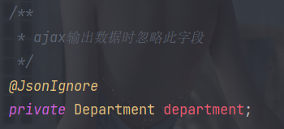

[TOC]


# SSM


## 1.Spring


### 1.1 框架

**半成品软件**

高度抽取可重用代码的一种设计；高度的通用性；

多个可重用模块的集合，形成一个某个领域的整体解决方案；


### 1.2 Spring框架

是一个容器（可以管理所有的组件(类)）框架：

核心关注：==IOC和AOP==

优点：

+ 非侵入式
+ 依赖注入
+ 面向切面编程
+ 容器
+ 组件化
+ 一站式


### 1.3 IOC和DI概述

#### IOC：（Inversion of control）控制反转

控制：获取资源的方式；

+ 主动式

  要什么资源都自己创建

  复杂对象的创建是比较庞大的工程


+ 被动式

  资源的获取不是我们自己创建，而是交给容器创建和设置


容器：管理所有的组件（有功能的类）；容器可以自动的探查出哪些组件（类）需要用到另一些组件（类）；容器帮助我们创建对象，并且把对象赋值过去；

主动的new资源变为被动的接收资源；


#### DI：（Dependency Injection）依赖注入

容器能知道哪个组件（类）在运行时，需要另一个组件（类）；容器通过反射的形式，将容器中准备好的对象注入（利用反射给属性赋值）到类中。


只要是容器管理的组件，都能使用容器提供的强大功能。


### 1.4 Hello World

==代码：ioc_01==

#### 通过各种方式给容器中注册对象

以前是自己new对象，现在所有对象交给容器创建；==给容器中注册组件==


流程：

1. 导包

   ```xml
   <!--Spring核心包-->
   <dependency>
       <groupId>org.springframework</groupId>
       <artifactId>spring-context</artifactId>
       <version>5.3.6</version>
   </dependency>
   <dependency>
       <groupId>org.springframework</groupId>
       <artifactId>spring-beans</artifactId>
       <version>5.3.6</version>
   </dependency>
   <dependency>
       <groupId>org.springframework</groupId>
       <artifactId>spring-core</artifactId>
       <version>5.3.6</version>
   </dependency>
   <dependency>
       <groupId>org.springframework</groupId>
       <artifactId>spring-expression</artifactId>
       <version>5.3.6</version>
   </dependency>
       
   <!--Spring日志包-->
   <dependency>
       <groupId>commons-logging</groupId>
       <artifactId>commons-logging</artifactId>
       <version>1.2</version>
   </dependency>
   ```

   

2. 写配置

   spring配置文件中，集合了spring的ioc容器管理的所有组件

   创建配置文件

   ```xml
   <!--注册一个person对象,Spring会自动创建这个person对象-->
   <!--一个bean标签可以注册一个组件(对象，类)
   class:写要注册的组件的全类名
   id:这个对象的唯一标识
   name:属性名
   valueL:给属性赋值
   -->
   <bean id="person" class="com.kou.bean.Person">
   <!--使用property给属性赋值        -->
       <property name="lastName" value="Kou"/>
       <property name="gender" value="男"/>
       <property name="email" value="kou1688@foxmail.com"/>
       <property name="age" value="18"/>
   </bean>
   ```

   

3. 测试

   ```java
   /**
    * 从容器中拿到这个组件
    */
   @Test
   public void test1(){
       /*
       ApplicationContext:代表ioc容器
       当前应用的xml配置文件在classpath下
       根据spring配置文件得到ioc容器对象
       */
       ClassPathXmlApplicationContext context = new ClassPathXmlApplicationContext("ioc.xml");
       //容器帮我们创建好对象了
       Person bean = context.getBean("person",Person.class);
       System.out.println(bean);
   }
   ```

   

两种方式：

+ ```java
  new FileSystemXmlApplicationContext
  ```

  

+ ```java
  new ClassPathXmlApplicationContext
  ```


==单例:==

https://www.runoob.com/design-pattern/singleton-pattern.html


```java
/*
ApplicationContext:代表ioc容器
当前应用的xml配置文件在classpath下
根据spring配置文件得到ioc容器对象
 几个细节:
 1. ApplicationContext（IOC容器的接口）
 2. 组件的创建工作,是由容器完成;
     Person对象是什么时候创建好了？
     容器中对象的创建在容器创建完成的时候就已经创建好了
 3.同一个组件在ioc容器中是单例的;容器启动完成之前都已经创建准备好的
 4.容器中如果没有组件,获取组件?
    org.springframework.beans.factory.NoSuchBeanDefinitionException: No bean named '**' available
 5.ioc容器在创建这个组件对象时,(property)会利用setter方法进行赋值
 6.javaBean的属性名是由什么决定的?
    Getter/Setter方法是属性名
    set去掉后面那后面一串首字母小写就是属性名
    所有的getter/setter都用自动生成的
*/	
```


##### 构造器赋值

第一种（掌握）

```xml
<!--调用有参构造器进行创建对象并赋值-->
<bean id="person03" class="com.kou.bean.Person">
    <constructor-arg name="lastName" value="小花"/>
    <constructor-arg name="gender" value="女"/>
    <constructor-arg name="email" value="111@qq.com"/>
    <constructor-arg name="age" value="18"/>
</bean>
```


第二种（了解）

```xml
<!--省略name属性的构造器注入,按照构造器参数的位置-->
<bean id="person04" class="com.kou.bean.Person">
    <constructor-arg name="age" index="1" value="18"/>
    <constructor-arg name="email" index="3" value="222@qq.com"/>
    <constructor-arg name="lastName" index="0" value="小花"/>
    <constructor-arg name="gender" index="2" value="女"/>
</bean>
```


##### 通过p名称空间为bean赋值

名称空间是用来防止标签重复的

```xml
<!--p名称空间赋值-->
<!--名称空间是用来防止标签重复的-->
<bean id="person06" class="com.kou.bean.Person"
p:age="18" p:email="666@qq.com" p:gender="男" p:lastName="小明">
</bean>
```


##### 正确的为各种类型属性赋值

###### 集合类属性

```xml
<bean id="car01" class="com.kou.bean.Car">
    <property name="carName" value="宝马"/>
    <property name="color" value="绿色"/>
    <property name="price" value="300000"/>
</bean>
<bean id="book01" class="com.kou.bean.Book">
    <property name="bookName" value="东游记"/>
    <property name="author" value="作者"/>
</bean>
<!--实验4:正确的为各种类型属性赋值-->
<bean id="person01" class="com.kou.bean.Person">
    <!--设置null值-->
    <property name="lastName">
        <null/>
    </property>
    <!--设置引用类型值 引用外部Bean-->
    <property name="car" ref="car01"/>
</bean>
<bean id="person02" class="com.kou.bean.Person">
    <!--如何为list赋值-->
    <property name="books">
        <list>
            <!--内部 内部bean id不能被引用-->
            <bean class="com.kou.bean.Book" p:bookName="西游记" p:a
            <!--引用外部-->
            <ref bean="book01"/>
        </list>
    </property>
    <!--Map-->
    <property name="maps">
        <map>
            <!--一个entry代表一个键值对-->
            <entry key="key01" value="张三"/>
            <entry key="key02" value="18"/>
            <entry key="key03" value-ref="book01"/>
            <entry key="key04">
                <bean class="com.kou.bean.Car">
                    <property name="carName" value="宝马"/>
                </bean>
            </entry>
            <!--<entry>
                <map></map>
            </entry>-->
        </map>
    </property>
    <!--properties-->
    <property name="properties">
        <!--所有的k=v都是string-->
        <props>
            <prop key="username">root</prop>
            <prop key="password">1234</prop>
        </props>
    </property>
</bean>
```


```xml
<!--util名称空间创建集合类型的bean-->
<!--相当于new LinkedHashMap<>()-->
<util:map id="myMap">
    <!--添加元素-->
    <entry key="key01" value="张三"/>
    <entry key="key02" value="18"/>
    <entry key="key03" value-ref="book01"/>
    <entry key="key04">
        <bean class="com.kou.bean.Car">
            <property name="carName" value="宝马"/>
        </bean>
    </entry>
</util:map>
<!--
[ [],Person,12,{} ]
-->
<util:list id="myList">
    <list/>
    <bean class="com.kou.bean.Person"/>
    <value/>
    <ref bean="myMap"/>
</util:list>
```


###### 级联属性赋值

属性的属性


```xml
<!--
级联属性赋值
级联属性可以修改属性的属性,注意原来的bean会被修改
-->
<bean id="person4" class="com.kou.bean.Person">
    <!--为car赋值时，改变car的价格-->
    <property name="car" ref="car01"/>
    <!---->
    <property name="car.price" value="90000"/>
</bean>
```


##### bean重用 模板bean bean之间依赖 作用域

通过继承实现bean配置信息的重用

```xml
<bean id="person5" class="com.kou.bean.Person">
    <property name="lastName" value="张三"/>
    <property name="age" value="18"/>
    <property name="gender" value="男"/>
    <property name="email" value="666@kou.com"/>
</bean>
<!--parent:指定当前bean的配置信息继承与哪一个-->
<bean id="person6" parent="person5">
    <property name="lastName" value="李四"/>
</bean>
```


通过abstract属性创建一个模板bean

```xml
<!--abstract="true" 这个bean配置是一个抽象的,不能获取他的实例,只能被别人用来继承-->
<bean id="person5" class="com.kou.bean.Person" abstract="true">
    <property name="lastName" value="张三"/>
    <property name="age" value="18"/>
    <property name="gender" value="男"/>
    <property name="email" value="666@kou.com"/>
</bean>
```


bean之间的依赖

```xml
<!--
原来是按照配置bean顺序创建bean
可以改变bean的创建顺序
实验8:bean之间的依赖（只是改变创建顺序）
-->
<bean id="person" class="com.kou.bean.Person" depends-on="car,book"/>
<bean id="car" class="com.kou.bean.Car"/>
<bean id="book" class="com.kou.bean.Book"/>
```


实验9:测试bean的作用域,分别创建单实例和多实例的bean♥

```xml
<!--
实验9:测试bean的作用域,分别创建单实例和多实例的bean♥
bean作用域:指定bean是否单实例,xxx;默认:单实例
prototype:多实例(原型)
1.容器启动默认不会去创建多实例bean
2.获取的时候创建这个bean
3.每次获取都会创建一个新的对象
singleton:单例(默认)
1.在容器启动完成之前就已经创建好对象，保存在容器中了
2.任何获取都是获取之前创建好的哪个对象
-->
<bean id="book" class="com.kou.bean.Book">
</bean>
```


##### 配置工厂方法创建的bean

实验五:配置通过静态工厂方法创建的bean、实例工厂方法创建的bean、FactoryBean

bean的创建默认就是框架利用反射new出来的bean实例
工厂模式:工厂帮我们创建对象
静态工厂:工厂本身不用创建对象;通过静态方法调用,对象=工厂类.工厂方法名();
实例工厂:工厂本身需要创建对象;
工厂类 工厂对象=new 工厂类();
工厂对象.方法名("");


```xml
<!--1.静态工厂(不需要创建工厂本身) factory-method指定工厂方法-->
<bean id="airPlane01" class="com.kou.factory.AirPlaneStaticFactory" factory-method="getAirPlane">
    <!--可以为方法指定参数-->
    <constructor-arg value="李四"/>
</bean>
```


```xml
<!--2.实例工厂
    先配置出实例工厂对象
    配置我们要创建的AirPlane使用哪个工厂创建
    factory-bean:使用哪个工厂实例
    factory-method:使用哪个工厂方法
-->
<bean id="airPlaneInstanceFactory" class="com.kou.factory.AirPlaneInstanceFactory"/>
<bean id="airPlane02" class="com.kou.bean.AirPlane" factory-bean="airPlaneInstanceFactory"
      factory-method="getAirPlane">
    <constructor-arg value="张三"/>
</bean>
```


###### 实现FactoryBean的工厂

```java
/**
 * 实现了FactoryBean接口的类是Spring可以认识的工厂类
 * Spring会自动地调用工厂方法创建实例
 * 1.编写一个FactoryBean的实现类
 * 2.在spring配置文件中进行注册
 *
 * @author Kou
 * @date: 2021/7/28 15:25
 */
public class MyFactoryBeanImpl implements FactoryBean<Book> {

    /**
     * 是单例?
     *
     * @return false:不是单例;true:是单例
     */
    @Override
    public boolean isSingleton() {
        return false;
    }

    /**
     * 工厂方法;
     *
     * @return 返回创建的对象
     */
    @Override
    public Book getObject() throws Exception {
        Book book = new Book();
        book.setBookName(UUID.randomUUID().toString());
        return book;
    }

    /**
     * Spring会自动调用这个方法来确认创建的对象是什么类型
     *
     * @return 返回创建的对象类型
     */
    @Override
    public Class<?> getObjectType() {
        return Book.class;
    }
}
```

```xml
<!--FactoryBean是Spring规定的一个接口,只要是这个接口的实现类.Spring都认为是一个工厂
ioc容器启动时不会创建工厂实例-->
<bean id="myFactoryBeanImpl" class="com.kou.factory.MyFactoryBeanImpl"/>
```


##### 创建带有生命周期方法的Bean


代码：ioc_02

```xml
<!--
创建带有生命周期方法的bean
生命周期:bean的创建到销毁
    ioc容器中注册的bean：
        1.单例的bean,容器启动的时候就会创建好,容器关闭也会销毁创建的bean
        2.多实例bean,获取的时候才创建;
    我们可以为bean自定义一些生命周期方法;spring在创建或者销毁的时候就会调用指定的方法
    自定义初始化方法和销毁方法:可以抛异常,但不能有参数
-->
<bean id="book01" class="com.kou.bean.Book" init-method="myInit" destroy-method="myDestroy" scope="prototype">
</bean>
```

```java
/**
 * Bean的生命周期
 * 单例:
 * 构造器---->初始化方法---->(容器关闭)销毁方法
 * 多实例:
 * 获取bean(构造器--->初始化方法)---->容器关闭不会调用bean的销毁方法
 */
```


##### Bean的后置处理器

```java
/**
 * 1.编写后置处理器的实现类
 * 2.将后置处理器注册在配置文件中
 *
 * @author Kou
 * @date: 2021/7/28 18:02
 */
public class MyBeanPostProcessor implements BeanPostProcessor {
    /**
     * 初始化之前调用
     *
     * @param bean 将要初始化的bean
     * @return 返回传入的bean
     */
    @Override
    public Object postProcessBeforeInitialization(Object bean, String beanName) throws BeansException {
        System.out.println(beanName + " bean将调用初始化方法 " + bean);
        return bean;
    }

    /**
     * 初始化方法之后调用
     *
     * @param bean     初始化的bean
     * @param beanName 在xml中配置的id
     * @return 返回的是什么,容器中保存的就是什么
     */
    @Override
    public Object postProcessAfterInitialization(Object bean, String beanName) throws BeansException {
        System.out.println(beanName + " bean初始化方法调用完了 " + bean);
        return bean;
    }
}
```

```xml
<!--
测试bean的后置处理器
Spring有一个接口:后置处理器:可以在bean的初始化前后调用方法
无论bean是否有初始化方法;后置处理器都会默认其有
-->
<bean id="beanPostProcessor" class="com.kou.bean.MyBeanPostProcessor"/>
```


##### Spring管理连接池


```xml
<!--实验12:引用外部配置文件*-->
<!--数据库连接池作为单实例是最好的;一个项目就一个连接池,连接池里面管理很多连接-->
<!--可以让Spring帮我们创建连接池对象,（管理连接池）-->
<bean id="dataSource" class="com.mchange.v2.c3p0.ComboPooledDataSource">
    <property name="user" value="root"/>
    <property name="password" value="1234"/>
    <property name="jdbcUrl" value="jdbc:mysql://localhost:3306/jdbcstudy?
    serverTimezone=GMT%2B8&amp;useSSL=false&amp;useUnicode=true&amp;characterEncoding=utf8"/>
    <property name="driverClass" value="com.mysql.cj.jdbc.Driver"/>
</bean>
```

测试：

```java
/**
 * 从容器中拿到连接池
 */
@Test
public void test02() throws SQLException {
    //按照类型获取，可以获取这个类型下的所有类子类等等
    DataSource bean = ioc.getBean("dataSource",DataSource.class);
    System.out.println(bean.getConnection());
}
```


引用外部文件：

```xml
<!--实验12:引用外部配置文件*,依赖Context名称空间-->
<!--数据库连接池作为单实例是最好的;一个项目就一个连接池,连接池里面管理很多连接-->
<!--可以让Spring帮我们创建连接池对象,（管理连接池）-->
<!--加载外部配置文件  classpath:表示引用类路径下的文件-->
<context:property-placeholder location="classpath:dbconfig.properties"/>
<bean id="dataSource" class="com.mchange.v2.c3p0.ComboPooledDataSource">
    <property name="user" value="${jdbc.username}"/>
    <property name="password" value="${jdbc.password}"/>
    <property name="jdbcUrl" value="${jdbc.Url}"/>
    <property name="driverClass" value="${jdbc.driverClass}"/>
</bean>
```


##### SPEL测试

spring expression language   spring表达式语言

```xml
<!--SPel测试-->
<bean id="person04" class="com.kou.bean.Person">
    <!--字面量-->
    <property name="age" value="#{12345*6}"/>
    <!--引用其他bean的属性值-->
    <property name="lastName" value="#{book01.bookName}"/>
    <property name="car" value="#{car}"/>
    <!--调用静态方法-->
    <property name="email" value="#{T(java.util.UUID).randomUUID().toString()}"/>
    <!--调用非静态方法-->
    <property name="gender" value="#{book01.getBookName()}"/>
</bean>
```


### 1.5 基于XML的自动装配（自定义类型自动赋值）

自定义类型的属性是一个对象，这个对象在容器中可能存在

```xml
<bean id="car" class="com.kou.bean.Car">
    <property name="carName" value="宝马"/>
    <property name="color" value="白色"/>
</bean>
<bean id="book01" class="com.kou.bean.Book">
    <property name="bookName" value="book1"/>
</bean>
<bean id="book02" class="com.kou.bean.Book">
    <property name="bookName" value="book2"/>
</bean>
<bean id="book03" class="com.kou.bean.Book">
    <property name="bookName" value="book3"/>
</bean>

<!--自动赋值(自动装配):仅限于对自定义类型有效
    按照某种规则自动装配
    autowire="byName"
    按照名字:private Car car;
    1.以属性名作为id去容器中找到这个组件,给它赋值。如果找不到就装配null
    autowire="byType"
    1.按照属性类型作为查找依据去容器中找到这个组件;
    ioc.getBean(Car.class)
    2.如果容器中有多个这种类型的组件,报错
    3.如果没找到,装配null
    按照构造器:autowire="constructor"
    1.先按照有参构造器参数的类型进行装配,没有就直接为组件装配null
    2.如果按照类型找到多个;参数名作为id继续匹配
    3.不会报错
自动为属性赋值
-->
<bean id="person" class="com.kou.bean.Person" autowire="byType"/>
```


### 1.6 利用注解装配

**代码ioc_03**

#### 1.6.1 概述

```xml
<!--
    实验15:使用注解分别创建Dao,Service,Controller(控制器:控制网站跳转逻辑Servlet)*
    通过给bean上添加某些注解，可以快速的将bean加入到ioc容器
    四个注解:
    某个类上添加上任何一个注解就能快速将这个组件加入到ioc容器的管理中
    @Controller:给控制层(Servlet)组件添加这个注解
    @Service:给业务逻辑层组件添加
    @Repository:给数据持久层组件添加这个组件
    @Component:组件,不属于以上基层的组件添加
    id默认是类名首字母小写
    注解可以随便加
    Spring底层不会去验证你的这个组件,是否如你注解所说就是一个dao层的或者就是control层组件
    推荐各自层加各自层注解,给程序员看的
    使用注解快速将组件加入容器:
    1.给要添加的组件上标四个注解中的任何一个
    2.告诉Spring自动扫描加了注解的组件,依赖context名称空间
    3.一定要导入AOP包
-->
<!--
    context:component-scan:自动组件扫描
    base-package:指定扫描的基础包,把基础包及他下面所有的包的所有加了注解的类,自动的扫描进ioc容器
-->
<context:component-scan base-package="com.kou"/>
```

```java
/**
 * 使用注解加入到容器中的组件,和使用配置加入到容器中的组件行为都是一样的
 * 1.组件的id,默认就是组件的类名首字母小写
 * 2.组件的作用域,默认就是单例的
 */
```


#### 1.6.2 context:exclude/include-filter排除不必要/指定要的组件

```xml
<context:component-scan base-package="com.kou">
    <!--
    type="annotation" 指定排除规则;按照注解排除;标注了指定注解的组件不要
    expression="" 写注解的全类名
    type="assignable"  按照类排除
    expression="" 写类的全类名
    -->
    <!--<context:exclude-filter type="aspectj" expression="org.springframework.stereotype.Controller"/>-->
    
    <!--context:include-filter 只要哪些组件-->
    <!--context:component-scan 添加use-default-filters="false"-->
    <context:include-filter type="" expression=""/>
</context:component-scan>
```


#### ==1.6.3 AutoWired==

自动装配，优先使用byType，有多个实现类时，使用byName。如果`@Autowired`不能唯一自动装配上属性，则需要通过`@Qualifier(value="xx")`指定注入的对象。建议使用在set方法上。

当将 `@Autowired `注解直接写在成员变量上时，即使设定该成员变量的访问权限为private，那么也会自动将其改变成public；而将 `@Autowired `注解写在成员变量的 setter 方法上则不会出现此问题。所以不建议使用前者

`required属性=false` 指定某个属性的值可以不被设置


**原理**：

```java
@Autowired
private BookService bookService;
/**
先按照类型去容器中找到对应的组件; 
bookService=ioc.getBean("BookService.class");
找到就赋值

没找到就抛异常

找到多个？
 按照变量名作为id继续匹配
 	匹配上？
 	没有匹配？报错

 Qualifier指定一个名为id 
 @Qualifier("")
 
*/
```


方法上有Autowired的话，方法会在bean创建时自动运行，方法上的每一个参数都会自动注入值

@Qualifier("xx")，可以在方法形参位置使用，指定注入的id


##### @Resource与@Autowired的区别

事实上，他们的基本功能都是通过注解实现**依赖注入**，只不过`@Autowired`是`Spring`定义的，而`@Resource`是`JSR-250`定义的。大致功能基本相同，但是还有一些细节不同：

- **依赖识别方式**：@Autowired默认是**byType**可以使用@Qualifier指定Name，@Resource**默认ByName**如果**找不到则ByType**
- **适用对象**：@Autowired可以对**构造器、方法、参数、字段**使用，@Resource只能对**方法、字段**使用
- **提供方**：@Autowired是**Spring**提供的，@Resource是**JSR-250**提供的

`@Resource`扩展性更强，如果切换成另一个容器框架，`@Resource`还是可以使用的


### 1.7 Spring的单元测试

`@ContextConfiguration`指定spring配置文件的位置

==注意！！！！==

SpringJUnit4ClassRunner requires JUnit 4.12 or higher.

```java
@ContextConfiguration(locations = "classpath:applicationContext.xml")
@RunWith(SpringJUnit4ClassRunner.class)
```

Spring单元测试 Junit版本必须是4.13以上

```java
@Autowired
BookController bookController;
@Autowired
BookService bookService;
//不需要再getBean了
```


### 1.8 泛型依赖注入

**代码 ioc_04**

注入一个组件的时候，他的泛型也是参考标准

Spring中可以使用带泛型的父类类型来确定这个子类


### 1.9 IOC总结

ioc是一个容器，帮我们管理所有的组件

1. 依赖注入：@Autowired，自动赋值；
2. 某个组件要使用Spring提供的更多功能必须加入到容器中；


+ 体会：
  1. 容器启动，创建所有单实例bean
  2. autowired自动装配时，是从容器中找这些符合要求的bean
  3. ioc.getBean("***");也是从容器中找到这个bean；
  4. 容器中包括了所有的bean
  5. 调试spring源码，容器到底是什么？其实就是一个map
  6. 这个map中保存所有创建好的bean，并提供外界获取功能
  7. 探索单实例都保存在哪个map中。【源码-扩展】
  8. 源码调试思路
     + 从helloworld开始，给helloworld每一个关键步骤打上断点。进去看里面都做了什么工作。
     + 翻译这个方法干什么的
     + 放行这个方法，看控制台，看debug的每一个变量变化
     + 看方法注释


### 1.10 AOP场景

**代码：aop_01**


AOP：（Aspect Oriented Programming）面向切面编程

OOP：（Object Oriented Programming）面向对象编程


AOP：基于OOP基础之上新的编程思想

指在程序运行期间，将某段代码==动态的切入==到==指定方法的指定位置==进行运行的这种编程方式，称为面向切面编程


场景：计算器运行方法的时候进行日志记录；

1. 直接编写在方法内部；不推荐；修改维护麻烦

   日志记录：系统的辅助功能

   业务逻辑：核心功能

   耦合了

2. 我们希望的是：

   日志模块，在核心功能运行期间，自己动态的加上；

   可以使用动态代理将日志代码动态的在目标方法执行前后先进行执行；


#### 动态代理

JDK提供的动态代理：Proxy类


```java
/**
 * 帮Calculator.java生成代理对象的类
 * newProxyInstance(ClassLoader loader,类<?>[] interfaces,InvocationHandler h)
 *
 * @author Kou
 * @date: 2021/7/30 15:06
 */
public class CalculatorProxy {
    /**
     * 为传入的参数对象创建一个动态代理对象
     *
     * @param calculator 被代理对象
     * @return 代理对象
     */
    public static Calculator getProxy(final Calculator calculator) {
        //被代理对象的类加载器
        ClassLoader loader = calculator.getClass().getClassLoader();
        //被代理对象实现的接口
        Class<?>[] classes = calculator.getClass().getInterfaces();

        //方法执行器;帮助我们目标对象执行目标方法
        InvocationHandler handler = new InvocationHandler() {
            /**
             *
             * @param proxy 代理对象;给jdk使用,任何时候都不要动这个对象
             * @param method 被代理对象的方法
             * @param args 目标方法的参数值
             * @return result
             */
            @Override
            public Object invoke(Object proxy, Method method, Object[] args) {

                //利用反射执行目标方法
                //目标方法执行后的返回值
                Object result = null;
                try {
                    System.out.println(method.getName() + "方法开始执行,用的参数列表:" + Arrays.asList(args));
                    result = method.invoke(calculator, args);
                    System.out.println(method.getName() + "方法执行完成,计算结果是:" + result);
                } catch (Exception e) {
                    System.out.println(method.getName() + "方法执行出现异常,异常信息为" + e.getCause() + "通知异常小组进行排查");
                } finally {
                    System.out.println(method.getName() + "方法最终结束了");
                }

                return result;
            }
        };

        //Proxy为目标创建代理对象
        Object proxy = Proxy.newProxyInstance(loader, classes, handler);

        return (Calculator) proxy;
    }
}
```


有了动态代理，日志记录可以做的非常强大，而且与业务逻辑解耦


加一个LogUtils类，优化日志

```java
public class LogUtils {

    public static void logStart(Method method, Object... args) {
        System.out.println(method.getName() + "方法开始执行,用的参数列表:" + Arrays.asList(args));
    }

    public static void logReturn(Method method, Object result) {
        System.out.println(method.getName() + "方法执行完成,计算结果是:" + result);
    }

    public static void logException(Method method, Exception e) {
        System.out.println(method.getName() + "方法执行出现异常,异常信息为" + e.getCause() + "通知异常小组进行排查");
    }

    public static void logFinally(Method method) {
        System.out.println(method.getName() + "方法最终结束了");
    }
}
```


```java
/**
 * 帮Calculator.java生成代理对象的类
 * newProxyInstance(ClassLoader loader,类<?>[] interfaces,InvocationHandler h)
 *
 * @author Kou
 * @date: 2021/7/30 15:06
 */
public class CalculatorProxy {
    /**
     * 为传入的参数对象创建一个动态代理对象
     *
     * @param calculator 被代理对象
     * @return 代理对象
     */
    public static Calculator getProxy(final Calculator calculator) {
        //被代理对象的类加载器
        ClassLoader loader = calculator.getClass().getClassLoader();
        //被代理对象实现的接口
        Class<?>[] classes = calculator.getClass().getInterfaces();

        //方法执行器;帮助我们目标对象执行目标方法
        InvocationHandler handler = new InvocationHandler() {
            /**
             *
             * @param proxy 代理对象;给jdk使用,任何时候都不要动这个对象
             * @param method 被代理对象的方法
             * @param args 目标方法的参数值
             * @return result
             */
            @Override
            public Object invoke(Object proxy, Method method, Object[] args) {

                //利用反射执行目标方法
                //目标方法执行后的返回值
                Object result = null;
                try {
                    LogUtils.logStart(method, args);
                    result = method.invoke(calculator, args);
                    LogUtils.logReturn(method, result);
                } catch (Exception e) {
                    LogUtils.logException(method, e);
                } finally {
                    LogUtils.logFinally(method);
                }

                return result;
            }
        };

        //Proxy为目标创建代理对象
        Object proxy = Proxy.newProxyInstance(loader, classes, handler);

        return (Calculator) proxy;
    }
}
```


动态代理：

+ 写起来难
+ jdk动态代理，如果被代理对象没有实现任何接口，是无法为他创建代理对象的


所以Spring实现了AOP功能，底层就是动态代理

1. 可以利用Spring一句代码都不写的去创建动态代理

   实现简单，并且没有强制要求必须实现接口


### 1.11 AOP


#### 1.11.1 AOP专业术语


#### 1.11.2 AOP使用


**代码：aop_02**

+ 导包

  ```xml
  <!--AOP-->
  <dependency>
      <groupId>org.springframework</groupId>
      <artifactId>spring-aop</artifactId>
      <version>5.3.6</version>
  </dependency>
  <dependency>
      <groupId>org.aspectj</groupId>
      <artifactId>aspectjweaver</artifactId>
      <version>1.9.2</version>
  </dependency>
  <!--cglib动态代理-->
  <dependency>
      <groupId>cglib</groupId>
      <artifactId>cglib</artifactId>
      <version>3.3.0</version>
  </dependency>
  ```

  

+ 写配置

  1. 将目标类和切面类(封装了通知方法 ( 在目标方法执行前后执行的方法 ) ) 加入到ioc容器中

  2. 还应该告诉spring，到底哪个是切面`@Aspect`

     

  3. 告诉spring切面类里面的每一个方法都是何时何地运行

     ```java
     /**
     写切入点表达式:
     execution(访问权限符 返回值类型 方法签名)
     @Before("execution(public int com.kou.impl.MyMathCalculator.*(int,int))")
     */
     ```

  4. 开启基于注解的aop功能

     ```xml
     <aop:aspectj-autoproxy/>
     ```

```java
/**
告诉spring每个方法都什么时候运行
想在执行目标方法之前运行
<p>
通知注解
Before:在目标方法之前运行  前置通知
After:在目标方法之后运行  后置通知
AfterReturning:在目标方法正常返回之后  返回通知
AfterTrowing:在目标方法抛出异常之后  异常通知
Around:环绕  环绕通知
写切入点表达式:
execution(访问权限符 返回值类型 方法签名)
*/
```


```java
@Aspect
@Component
public class LogUtils {

    /**
     * 告诉spring每个方法都什么时候运行
     * 想在执行目标方法之前运行
     * <p>
     * 通知注解
     * Before:在目标方法之前运行  前置通知
     * After:在目标方法之后运行  后置通知
     * AfterReturning:在目标方法正常返回之后  返回通知
     * AfterTrowing:在目标方法抛出异常之后  异常通知
     * Around:环绕  环绕通知
     *
     * 写切入点表达式:
     * execution(访问权限符 返回值类型 方法签名)
     */
    @Before("execution(public int com.kou.impl.MyMathCalculator.*(int,int))")
    public static void logStart() {
        System.out.println("xxxx" + "方法开始执行,用的参数列表:" + "xxxxx");
    }

    /**
     * 想在目标方法正常完成之后执行
     */
    @After("execution(public int com.kou.impl.MyMathCalculator.*(int,int))")
    public static void logReturn() {
        System.out.println("xxxxx" + "方法执行完成,计算结果是:" + "xxxxx");
    }

    /**
     * 想在目标方法出现异常执行
     */
    @AfterThrowing("execution(public int com.kou.impl.MyMathCalculator.*(int,int))")
    public static void logException() {
        System.out.println("xxxx" + "方法执行出现异常,异常信息为" + "xxxxx" + "通知异常小组进行排查");
    }

    /**
     * 想在目标方法return结束时执行
     */
    @AfterReturning("execution(public int com.kou.impl.MyMathCalculator.*(int,int))")
    public static void logFinally() {
        System.out.println("xxxx" + "方法最终结束了");
    }
}
```


#### 1.11.3 AOP细节


##### 容器中保存的是代理对象


##### cglib为没有接口的组件也能创建代理对象


##### 切入点表达式写法（通配符）

```Java
/**
切入点表达式的写法;
固定写法:execution(访问权限符 返回值类型 方法签名)
<p>

权限位置不能写通配符

通配符:
* :匹配一个或多个字符
execution(public int com.kou.impl.MyMath*r.*(int,int))
匹配任意一个参数:
execution(public int com.kou.impl.MyMathCalculator.*(int,*))
.. :
匹配任意多个参数,任意类型参数:
execution(public int com.kou.impl.MyMathCalculator.*(..))
匹配一层路径:
execution(public int com.kou.*.MyMathCalculator.*(int,int))
匹配多层路径:
execution(public int com.kou..MyMathCalculator.*(int,int))

最模糊的一种:
execution(* *.*(..)) 不推荐写

可以使用逻辑运算符
*/
```


##### 运行顺序

==spring5里：@Before--->@AfterReturning--->@After==


##### 在通知方法执行的时候，拿到目标方法的详细信息

只需要为通知方法的参数列表上写一个参数：JoinPoint

```java
//JoinPoint joinPoint:封装了当前目标方法的详细信息
//@AfterReturning 里用一个Object result来接收返回值
//Exception exception
//指定通知方法可以接收哪些异常信息
```


##### Spring对通知方法的约束

spring对通知方法的要求不严格

==唯一要求的就是方法的参数列表一定不能乱写==

因为通知方法是spring利用反射调用的，每次方法调用得确定这个方法的参数的值;

参数表上的每一个参数,Spring都得知道是什么

不知道的参数一定告诉spring这是什么


##### 切入点表达式的重用

```java
/**
 * 抽取可重用的切入点表达式:
 * 1.随便声明一个没有实现的返回void的空方法
 * 2.给方法上标注PointCut注解
 */
@Pointcut("execution(public int com.kou.impl.MyMathCalculator.*(int,int))")
public void myPoint() {
}
```


##### ==环绕通知==

```java
/**
 * 环绕通知:
 * Spring中最强大的通知方法
 * 根本上就是动态代理
 * method.invoke(obj,args)
 * <p>
 * 四合一通知就是环绕通知;
 * 环绕通知中有一个参数:ProceedingJoinPoint pjp
 */
@Around("myPoint()")
public static Object myAround(ProceedingJoinPoint pjp) throws Throwable {
    Object[] args = pjp.getArgs();
    String name = pjp.getSignature().getName();
    Object proceed = null;
    try {
        //环绕前置通知:
        System.out.println(name + "方法开始执行,用的参数列表:" + Arrays.asList(args));
        //就是利用反射调用目标方法,就是method.invoke
        proceed = pjp.proceed(args);
        //返回通知
        System.out.println(name + "方法执行完成,计算结果为" + proceed);
    } catch (Exception e) {
        System.out.println(name + "方法执行出现异常,异常信息为" + e + "通知异常小组进行排查");
    } finally {
        //后置通知
        System.out.println(name + "方法结束");
    }
    //反射调用后的返回值也一定返回出去
    return proceed;
}
```


##### 环绕通知的执行顺序&&抛出异常让其他通知感受到

环绕通知是优于普通通知执行，执行顺序：

环绕前置---普通前置---目标方法执行-----环绕返回/出现异常----环绕后置---普通返回-----普通后置/异常

```java
//为了让外界能知道这个异常，这个异常一定要抛出去
throw new RuntimeException(e);
```


##### 多切面优先级问题


类似于栈

优先级可以按照切面类首字母来算

==使用@Order设置优先级，数值越小优先级越高==

环绕只是影响当前切面


#### 1.11.4 AOP应用

+ 日志：保存到数据库
+ 权限验证
+ 安全检查
+ 事务控制


#### 1.11.5 基于配置的AOP

**代码：aop_03**

```xml
<!--基于配置的AOP-->
<bean id="myMathCalculator" class="com.kou.impl.MyMathCalculator">
</bean>
<bean id="logUtils" class="com.kou.utils.LogUtils">
</bean>
<bean id="validateAspect" class="com.kou.utils.ValidateAspect">
</bean>
<!--需要AOP名称空间-->
<aop:config>
    <aop:pointcut id="myPoint" expression="execution(* com.kou.impl.*.*(..))"/>
    <!--指定切面-->
    <aop:aspect ref="logUtils">
        <aop:before method="logStart" pointcut="execution(* com.kou.impl.*.*(..))"/>
        <aop:after-returning method="logReturn" pointcut-ref="myPoint" returning="result"/>
        <aop:after-throwing method="logException" pointcut-ref="myPoint" throwing="exception"/>
        <aop:after method="logAfter" pointcut-ref="myPoint"/>
    </aop:aspect>
    <aop:aspect ref="validateAspect">
        <aop:before method="logStart" pointcut="execution(* com.kou.impl.*.*(..))"/>
        <aop:after-returning method="logReturn" pointcut-ref="myPoint" returning="result"/>
        <aop:after-throwing method="logException" pointcut-ref="myPoint" throwing="exception"/>
        <aop:after method="logAfter" pointcut-ref="myPoint"/>
    </aop:aspect>
</aop:config>
```


配置：功能完善，重要的用配置，不重要的用注解l


### 1.12 声明式事务（不重要）

+ 事务：

  操作数据库；

  Spring提供了JdbcTemplate能快捷的操作数据库

  


### 1.13 Spring源码-IOC容器启动创建bean-getBean

IOC：

1. IOC是一个容器
2. 容器启动的时候创建所有单实例对象
3. 我们可以直接从容其中获取到这个对象

SpringIOC：

1. IOC容器的启动过程？启动期间都做了什么？（什么时候创建所有单实例bean）
2. ioc是如何创建这些单实例bean，并如何管理的；到底保存在了哪里？


思路：

从helloWorld开始，调试每个方法的作用

1. ClassPathXmlApplicationContext构造器

   `ApplicationContext ioc = new ClassPathXmlApplicationContext("ioc.xml");`

   ```java
   public ClassPathXmlApplicationContext(
         String[] configLocations, boolean refresh, @Nullable ApplicationContext parent)
         throws BeansException {
      super(parent);
      setConfigLocations(configLocations);
      if (refresh) {
         refresh();
      }
   }
   ```

```java
this(new String[] {configLocation}, true, null);
```

```java
public ClassPathXmlApplicationContext(
      String[] configLocations, boolean refresh, @Nullable ApplicationContext parent)
      throws BeansException {
   super(parent);
   setConfigLocations(configLocations);
   if (refresh) {
       //所有单实例bean创建完成
      refresh();
   }
}
```

```java
public void refresh() throws BeansException, IllegalStateException {
   synchronized (this.startupShutdownMonitor) {
      StartupStep contextRefresh = this.applicationStartup.start("spring.context.refresh");

      // Prepare this context for refreshing.
      prepareRefresh();
		
       //Spring解析xml配置文件将要创建的所有bean的配置信息保存起来
       //观看spring对xml的解析
      // Tell the subclass to refresh the internal bean factory.
      ConfigurableListableBeanFactory beanFactory = obtainFreshBeanFactory();

      // Prepare the bean factory for use in this context.
      prepareBeanFactory(beanFactory);

      try {
         // Allows post-processing of the bean factory in context subclasses.
         postProcessBeanFactory(beanFactory);

         StartupStep beanPostProcess = this.applicationStartup.start("spring.context.beans.post-process");
         // Invoke factory processors registered as beans in the context.
         invokeBeanFactoryPostProcessors(beanFactory);

         // Register bean processors that intercept bean creation.
         registerBeanPostProcessors(beanFactory);
         beanPostProcess.end();
		
          //用来支持国际化功能的
         // Initialize message source for this context.
         initMessageSource();

         // Initialize event multicaster for this context.
         initApplicationEventMulticaster();
		
         //留给子类的方法
         // Initialize other special beans in specific context subclasses.
         onRefresh();

         // Check for listener beans and register them.
         registerListeners();
		
          //初始化所有单实例bean的地方
         // Instantiate all remaining (non-lazy-init) singletons.
         finishBeanFactoryInitialization(beanFactory);

         // Last step: publish corresponding event.
         finishRefresh();
      }

      catch (BeansException ex) {
         if (logger.isWarnEnabled()) {
            logger.warn("Exception encountered during context initialization - " +
                  "cancelling refresh attempt: " + ex);
         }

         // Destroy already created singletons to avoid dangling resources.
         destroyBeans();

         // Reset 'active' flag.
         cancelRefresh(ex);

         // Propagate exception to caller.
         throw ex;
      }

      finally {
         // Reset common introspection caches in Spring's core, since we
         // might not ever need metadata for singleton beans anymore...
         resetCommonCaches();
         contextRefresh.end();
      }
   }
}
```


==BeanFactory==

==finishBeanFactoryInitialization(beanFactory);实现==

+ AbstractApplicationContext

  ```java
  protected void finishBeanFactoryInitialization(ConfigurableListableBeanFactory beanFactory) {
     // Initialize conversion service for this context.
     if (beanFactory.containsBean(CONVERSION_SERVICE_BEAN_NAME) &&
           beanFactory.isTypeMatch(CONVERSION_SERVICE_BEAN_NAME, ConversionService.class)) {
        beanFactory.setConversionService(
              beanFactory.getBean(CONVERSION_SERVICE_BEAN_NAME, ConversionService.class));
     }
  
     // Register a default embedded value resolver if no BeanFactoryPostProcessor
     // (such as a PropertySourcesPlaceholderConfigurer bean) registered any before:
     // at this point, primarily for resolution in annotation attribute values.
     if (!beanFactory.hasEmbeddedValueResolver()) {
        beanFactory.addEmbeddedValueResolver(strVal -> getEnvironment().resolvePlaceholders(strVal));
     }
  
     // Initialize LoadTimeWeaverAware beans early to allow for registering their transformers early.
     String[] weaverAwareNames = beanFactory.getBeanNamesForType(LoadTimeWeaverAware.class, false, false);
     for (String weaverAwareName : weaverAwareNames) {
        getBean(weaverAwareName);
     }
  
     // Stop using the temporary ClassLoader for type matching.
     beanFactory.setTempClassLoader(null);
  
     // Allow for caching all bean definition metadata, not expecting further changes.
     beanFactory.freezeConfiguration();
  	
      //初始化所有单实例bean
     // Instantiate all remaining (non-lazy-init) singletons.
     beanFactory.preInstantiateSingletons();
  }
  ```


+ DefaultListableBeanFactory	:创建bean的

```java
public void preInstantiateSingletons() throws BeansException {
   if (logger.isTraceEnabled()) {
      logger.trace("Pre-instantiating singletons in " + this);
   }

   // Iterate over a copy to allow for init methods which in turn register new bean definitions.
   // While this may not be part of the regular factory bootstrap, it does otherwise work fine.
   //拿到所有要创建的bean的名字
   List<String> beanNames = new ArrayList<>(this.beanDefinitionNames);
	
   //根据beanid获取到bean的定义信息
   // Trigger initialization of all non-lazy singleton beans...
   for (String beanName : beanNames) {
      RootBeanDefinition bd = getMergedLocalBeanDefinition(beanName);
       //判断bean是单实例的，并不是抽象的，并且不是懒加载的
      if (!bd.isAbstract() && bd.isSingleton() && !bd.isLazyInit()) {
          //是否是一个实现了FactoryBean接口的bean
         if (isFactoryBean(beanName)) {
            Object bean = getBean(FACTORY_BEAN_PREFIX + beanName);
            if (bean instanceof FactoryBean) {
               FactoryBean<?> factory = (FactoryBean<?>) bean;
               boolean isEagerInit;
               if (System.getSecurityManager() != null && factory instanceof SmartFactoryBean) {
                  isEagerInit = AccessController.doPrivileged(
                        (PrivilegedAction<Boolean>) ((SmartFactoryBean<?>) factory)::isEagerInit,
                        getAccessControlContext());
               }
               else {
                  isEagerInit = (factory instanceof SmartFactoryBean &&
                        ((SmartFactoryBean<?>) factory).isEagerInit());
               }
               if (isEagerInit) {
                  getBean(beanName);
               }
            }
         }
         else {
            getBean(beanName);
         }
      }
   }

   // Trigger post-initialization callback for all applicable beans...
   for (String beanName : beanNames) {
      Object singletonInstance = getSingleton(beanName);
      if (singletonInstance instanceof SmartInitializingSingleton) {
         StartupStep smartInitialize = this.getApplicationStartup().start("spring.beans.smart-initialize")
               .tag("beanName", beanName);
         SmartInitializingSingleton smartSingleton = (SmartInitializingSingleton) singletonInstance;
         if (System.getSecurityManager() != null) {
            AccessController.doPrivileged((PrivilegedAction<Object>) () -> {
               smartSingleton.afterSingletonsInstantiated();
               return null;
            }, getAccessControlContext());
         }
         else {
            smartSingleton.afterSingletonsInstantiated();
         }
         smartInitialize.end();
      }
   }
}
```


+ getBean(beanName)；创建bean的细节


### 1.14 Spring源码-IOC这个map  getBean

getBean(beanName)；创建bean的细节

```java
//所有的getBean调用的是这个
doGetBean(name, null, null, false)
```

```java
protected <T> T doGetBean(
      String name, @Nullable Class<T> requiredType, @Nullable Object[] args, boolean typeCheckOnly)
      throws BeansException {

   String beanName = transformedBeanName(name);
   Object beanInstance;

    //先从已经注册的所有单实例bean中看有没有个bean，第一次创建bean是没有的
   // Eagerly check singleton cache for manually registered singletons.
   Object sharedInstance = getSingleton(beanName);
   if (sharedInstance != null && args == null) {
      if (logger.isTraceEnabled()) {
         if (isSingletonCurrentlyInCreation(beanName)) {
            logger.trace("Returning eagerly cached instance of singleton bean '" + beanName +
                  "' that is not fully initialized yet - a consequence of a circular reference");
         }
         else {
            logger.trace("Returning cached instance of singleton bean '" + beanName + "'");
         }
      }
      beanInstance = getObjectForBeanInstance(sharedInstance, name, beanName, null);
   }

   else {
      // Fail if we're already creating this bean instance:
      // We're assumably within a circular reference.
      if (isPrototypeCurrentlyInCreation(beanName)) {
         throw new BeanCurrentlyInCreationException(beanName);
      }

      // Check if bean definition exists in this factory.
      BeanFactory parentBeanFactory = getParentBeanFactory();
      if (parentBeanFactory != null && !containsBeanDefinition(beanName)) {
         // Not found -> check parent.
         String nameToLookup = originalBeanName(name);
         if (parentBeanFactory instanceof AbstractBeanFactory) {
            return ((AbstractBeanFactory) parentBeanFactory).doGetBean(
                  nameToLookup, requiredType, args, typeCheckOnly);
         }
         else if (args != null) {
            // Delegation to parent with explicit args.
            return (T) parentBeanFactory.getBean(nameToLookup, args);
         }
         else if (requiredType != null) {
            // No args -> delegate to standard getBean method.
            return parentBeanFactory.getBean(nameToLookup, requiredType);
         }
         else {
            return (T) parentBeanFactory.getBean(nameToLookup);
         }
      }

      if (!typeCheckOnly) {
         markBeanAsCreated(beanName);
      }

      StartupStep beanCreation = this.applicationStartup.start("spring.beans.instantiate")
            .tag("beanName", name);
      try {
         if (requiredType != null) {
            beanCreation.tag("beanType", requiredType::toString);
         }
         RootBeanDefinition mbd = getMergedLocalBeanDefinition(beanName);
         checkMergedBeanDefinition(mbd, beanName, args);

          //拿到创建当前bean之前需要提前创建的bean  如果有就循环创建
         // Guarantee initialization of beans that the current bean depends on.
         String[] dependsOn = mbd.getDependsOn();
         if (dependsOn != null) {
            for (String dep : dependsOn) {
               if (isDependent(beanName, dep)) {
                  throw new BeanCreationException(mbd.getResourceDescription(), beanName,
                        "Circular depends-on relationship between '" + beanName + "' and '" + dep + "'");
               }
               registerDependentBean(dep, beanName);
               try {
                  getBean(dep);
               }
               catch (NoSuchBeanDefinitionException ex) {
                  throw new BeanCreationException(mbd.getResourceDescription(), beanName,
                        "'" + beanName + "' depends on missing bean '" + dep + "'", ex);
               }
            }
         }
		
          //创建bean实例
         // Create bean instance.
         if (mbd.isSingleton()) {
            sharedInstance = getSingleton(beanName, () -> {
               try {
                  return createBean(beanName, mbd, args);
               }
               catch (BeansException ex) {
                  // Explicitly remove instance from singleton cache: It might have been put there
                  // eagerly by the creation process, to allow for circular reference resolution.
                  // Also remove any beans that received a temporary reference to the bean.
                  destroySingleton(beanName);
                  throw ex;
               }
            });
            beanInstance = getObjectForBeanInstance(sharedInstance, name, beanName, mbd);
         }

         else if (mbd.isPrototype()) {
            // It's a prototype -> create a new instance.
            Object prototypeInstance = null;
            try {
               beforePrototypeCreation(beanName);
               prototypeInstance = createBean(beanName, mbd, args);
            }
            finally {
               afterPrototypeCreation(beanName);
            }
            beanInstance = getObjectForBeanInstance(prototypeInstance, name, beanName, mbd);
         }

         else {
            String scopeName = mbd.getScope();
            if (!StringUtils.hasLength(scopeName)) {
               throw new IllegalStateException("No scope name defined for bean ´" + beanName + "'");
            }
            Scope scope = this.scopes.get(scopeName);
            if (scope == null) {
               throw new IllegalStateException("No Scope registered for scope name '" + scopeName + "'");
            }
            try {
               Object scopedInstance = scope.get(beanName, () -> {
                  beforePrototypeCreation(beanName);
                  try {
                     return createBean(beanName, mbd, args);
                  }
                  finally {
                     afterPrototypeCreation(beanName);
                  }
               });
               beanInstance = getObjectForBeanInstance(scopedInstance, name, beanName, mbd);
            }
            catch (IllegalStateException ex) {
               throw new ScopeNotActiveException(beanName, scopeName, ex);
            }
         }
      }
      catch (BeansException ex) {
         beanCreation.tag("exception", ex.getClass().toString());
         beanCreation.tag("message", String.valueOf(ex.getMessage()));
         cleanupAfterBeanCreationFailure(beanName);
         throw ex;
      }
      finally {
         beanCreation.end();
      }
   }

   return adaptBeanInstance(name, beanInstance, requiredType);
}
```


==DefaultSingletonBeanRegistry==

+ getSingleton

```java
public Object getSingleton(String beanName, ObjectFactory<?> singletonFactory) {
   Assert.notNull(beanName, "Bean name must not be null");
   synchronized (this.singletonObjects) {
       //先从一个地方将这个bean get出来
      Object singletonObject = this.singletonObjects.get(beanName);
      if (singletonObject == null) {
         if (this.singletonsCurrentlyInDestruction) {
            throw new BeanCreationNotAllowedException(beanName,
                  "Singleton bean creation not allowed while singletons of this factory are in destruction " +
                  "(Do not request a bean from a BeanFactory in a destroy method implementation!)");
         }
         if (logger.isDebugEnabled()) {
            logger.debug("Creating shared instance of singleton bean '" + beanName + "'");
         }
         beforeSingletonCreation(beanName);
         boolean newSingleton = false;
         boolean recordSuppressedExceptions = (this.suppressedExceptions == null);
         if (recordSuppressedExceptions) {
            this.suppressedExceptions = new LinkedHashSet<>();
         }
         try {
             //创建bean
            singletonObject = singletonFactory.getObject();
            newSingleton = true;
         }
         catch (IllegalStateException ex) {
            // Has the singleton object implicitly appeared in the meantime ->
            // if yes, proceed with it since the exception indicates that state.
            singletonObject = this.singletonObjects.get(beanName);
            if (singletonObject == null) {
               throw ex;
            }
         }
         catch (BeanCreationException ex) {
            if (recordSuppressedExceptions) {
               for (Exception suppressedException : this.suppressedExceptions) {
                  ex.addRelatedCause(suppressedException);
               }
            }
            throw ex;
         }
         finally {
            if (recordSuppressedExceptions) {
               this.suppressedExceptions = null;
            }
            afterSingletonCreation(beanName);
         }
         if (newSingleton) {
             //添加创建的bean
            addSingleton(beanName, singletonObject);
         }
      }
      return singletonObject;
   }
}
```

创建好的对象最终会保存在一个Map中：

ioc容器之一：保存单实例bean的地方，ioc容器其实是众多map的集合

ioc就是一个容器，单实例bean保存在一个map中

==DefaultSingletonBeanRegistry==-singletonObjects

------------------------------

**BeanFactory和ApplicationContext的区别：**

ApplicationContext是BeanFactory的子接口；

BeanFactory：bean工厂接口；负责创建bean实例；容器里面保存所有的单例bean其实是一个map；

Spring最底层的接口


ApplicationContext：容器接口；更多的负责容器功能的实现；（可以基于beanFactory创建好的对象之上完成强大的容器）

容器可以从map中获取这个bean，并且aop。DI。在ApplicationContext接口下的这些类里面；

留给程序员使用的ioc容器接口；ApplicationContext是BeanFactory的子接口；


Spring里面最大的模式就是工厂模式；

BeanFactory：bean工厂；工厂模式；帮用户创建bean


### 1.15 声明式事务


**代码：springtpDetail**


----------------------------------------------------


## 2.Spring MVC


### 2.1 Spring MVC简介

+ Spring实现web模块；简化web开发

```xml
<dependency>
    <groupId>org.springframework</groupId>
    <artifactId>spring-webmvc</artifactId>
    <version>5.3.6</version>
</dependency>
```


### 2.2 Spring MVC配置

```xml
<!--SpringMVC思想是有一个前端控制器能拦截所有请求，并智能派发
    这个前端控制器是一个servlet,应该在web.xml中配置这个servlet来拦截请求
-->
<servlet>
    <servlet-name>springDispatcherServlet</servlet-name>
    <servlet-class>org.springframework.web.servlet.DispatcherServlet</servlet-class>
    <!--servlet的初始化参数-->
    <init-param>
        <param-name>contextConfigLocation</param-name>
        <param-value>classpath:springmvc.xml</param-value>
    </init-param>
    <!--servlet启动加载,原本是第一次访问创建对象
        load-on-startup:在服务器启动时创建
        -->
    <load-on-startup>1</load-on-startup>
</servlet>
<servlet-mapping>
    <servlet-name>springDispatcherServlet</servlet-name>
    <url-pattern>/</url-pattern>
</servlet-mapping>
```

```xml
<!--编码过滤器-->
<filter>
    <filter-name>characterEncodingFilter</filter-name>
    <filter-class>org.springframework.web.filter.CharacterEncodingFilter</filter-class>
    <init-param>
        <param-name>encoding</param-name>
        <param-value>UTF-8</param-value>
    </init-param>
    <init-param>
        <param-name>forceRequestEncoding</param-name>
        <param-value>true</param-value>
    </init-param>
    <init-param>
        <param-name>forceResponseEncoding</param-name>
        <param-value>true</param-value>
    </init-param>
</filter>
<filter-mapping>
    <filter-name>characterEncodingFilter</filter-name>
    <url-pattern>/*</url-pattern>
</filter-mapping>
<!--支持Rest的filter-->
<filter>
    <filter-name>hiddenHttpMethodFilter</filter-name>
    <filter-class>org.springframework.web.filter.HiddenHttpMethodFilter</filter-class>
</filter>
<filter-mapping>
    <filter-name>hiddenHttpMethodFilter</filter-name>
    <url-pattern>/*</url-pattern>
</filter-mapping>
<servlet>
    <servlet-name>dispatcherServlet</servlet-name>
    <servlet-class>org.springframework.web.servlet.DispatcherServlet</servlet-class>
    <init-param>
        <param-name>contextConfigLocation</param-name>
        <param-value>classpath:springmvc.xml</param-value>
    </init-param>
    <load-on-startup>1</load-on-startup>
</servlet>
<servlet-mapping>
    <servlet-name>dispatcherServlet</servlet-name>
    <url-pattern>/</url-pattern>
</servlet-mapping>
```

```xml
<context:component-scan base-package="com.kou"/>
<!--视图解析器,指定前后缀-->
<bean class="org.springframework.web.servlet.view.InternalResourceViewResolver">
    <property name="prefix" value="/WEB-INF/pages/"/>
    <property name="suffix" value=".jsp"/>
</bean>
<!--
默认前端控制器拦截所有资源(除过jsp)，js就404了；要js文件的请求交给tomcat处理的
http://localhost:8080/springmvc/js/jquery-3.2.1.js
-->
<!--告诉SpringMVC,自己映射的请求自己处理,不能处理的请求直接交给Tomcat-->
<!--静态资源能访问了,动态映射又不行了-->
<mvc:default-servlet-handler/>
<!--springmvc可以保证动态请求和静态请求都能访问-->
<mvc:annotation-driven/>

```


### 2.3 Spring MVC HelloWorld


**代码：helloworld**

流程：

+ 导包

+ 写配置

  1. web.xml要写什么

     配置springmvc的前端控制器，指定springmvc配置文件位置

     ```xml
     <!--SpringMVC思想是有一个前端控制器能拦截所有请求，并智能派发
         这个前端控制器是一个servlet,应该在web.xml中配置这个servlet来拦截请求
     -->
     <servlet>
         <servlet-name>springDispatcherServlet</servlet-name>
         <servlet-class>org.springframework.web.servlet.DispatcherServlet</servlet-class>
         <!--servlet的初始化参数-->
         <init-param>
             <param-name>contextConfigLocation</param-name>
             <param-value>classpath:springmvc.xml</param-value>
         </init-param>
         <!--servlet启动加载,原本是第一次访问创建对象
             load-on-startup:在服务器启动时创建
             -->
         <load-on-startup>1</load-on-startup>
     </servlet>
     <servlet-mapping>
         <servlet-name>springDispatcherServlet</servlet-name>
         <url-pattern>/</url-pattern>
     </servlet-mapping>
     ```

  2. 框架自身要写什么

     视图解析器

     ```xml
     <!--配置一个视图解析器,能帮我们拼接页面地址-->
     <bean class="org.springframework.web.servlet.view.InternalResourceViewResolver">
         <property name="prefix" value="/WEB-INF/pages/"/>
         <property name="suffix" value=".jsp"/>
     </bean>
     ```

+ 测试


#### 2.3.1 HelloWorld细节

##### 运行流程

+ 客户端点击链接会发送http://localhost:8080/springmvc/hello 请求
+ 来到tomcat服务器
+ springmvc的前端控制器收到所有请求
+ 来看请求地址和@RequestMapping标注的哪个匹配，来找到到底使用哪个类的哪个方法来处理
+ 前端控制器找到了目标处理器和目标方法，直接利用反射执行目标方法
+ 方法执行完成之后会有一个返回值，SpringMVC认为这个返回值就是要去的页面地址
+ 拿到方法返回值以后，用视图解析器进行拼串得到完整的页面地址
+ 拿到页面地址，前端控制器帮我们转发到页面


##### RequestMapping介绍

告诉SpringMVC这个方法用来处理什么请求

/ 可以省略即使省略也是默认从当前项目下开始   推荐加上


##### 不指定配置文件位置的默认文件

容器会自动去找WEB-INF下的配置文件


##### url-pattern

/：拦截所有请求，不拦截jsp页面，

*.jsp请求    /*：拦截所有请求，拦截jsp页面，

*.jsp请求           处理*.jsp是tomcat做的事；

所有项目的小web.xml都是继承于大web.xml    

DefaultServlet是Tomcat中处理静态资源的？      

除过jsp，和servlet外剩下的都是静态资源；      

index.html：静态资源，tomcat就会在服务器下找到这个资源并返回;     

 我们前端控制器的/禁用了tomcat服务器中的DefaultServlet             

1）服务器的大web.xml中有一个DefaultServlet是url-pattern=/    

2）我们的配置中前端控制器 url-pattern=/       

 静态资源会来到DispatcherServlet（前端控制器）看那个方法的RequestMapping是这个index.html   

 3）为什么jsp又能访问；因为我们没有覆盖服务器中的JspServlet的配置    

4） /* 直接就是拦截所有请求；我们写/；也是为了迎合后来Rest风格的URL地址


#### 2.3.2 @RequestMapping


##### 标注在类或方法上

标注在类上：提供初步的请求映射信息。相对于WEB应用的根目录

```java
-@RequestMapping为当前类所有方法的请求地址指定一个基准路径
```

标注在方法上：提供进一步细分映射信息。相对于类定义处的URL。


##### @RequestMapping的几个方法

```java
/**
 * -@RequestMapping为当前类所有方法的请求地址指定一个基准路径
 *
 * @author Kou
 * @date: 2021/8/6 11:28
 */
@Controller
@RequestMapping("/haha")
public class RequestMappingController {

    @RequestMapping("/handle01")
    public String handle01() {
        System.out.println("RequestMappingController....handle01");
        return "success";
    }

    /**
     * RequestMapping的其他属性
     * method:限定请求方式,默认全接收
     * 【GET】, 【HEAD】, POST, PUT, PATCH, DELETE, OPTIONS, TRACE
     * 不是规定的方式就会报错405.4xx都是客户端错误
     * <p>
     * params:规定请求参数
     * headers:规定请求头;也和params一样能写简单的表达式
     * consumes:只接收内容类型是哪种的请求,规定请求头中的Content-Type
     * produces:告诉浏览器返回的内容类型是什么，给响应头中加上Content-Type
     */
    @RequestMapping(value = "/handle02", method = RequestMethod.GET)
    public String handle02() {
        return "success";
    }

    /**
     * params和headers支持简单的表达式
     * param1:表示请求必须包含名为param1的请求参数
     * params={"username"}
     * params={"username=123"}
     * 发送请求时必须带上一个名为username username=123的参数;没带都会404
     * params={"!username"}
     * 发送请求时不能携带一个名为username的参数;
     * params ={"param1=value1","param2"}
     * 满足多个条件
     */
    @RequestMapping(value = "/handle03", params = {"username"})
    public String handle03() {
        return "success";
    }

    /**
     * User-Agent:浏览器信息
     * 谷歌浏览器信息:
     * Mozilla/5.0 (Windows NT 10.0; Win64; x64) AppleWebKit/537.36 (KHTML, like Gecko) Chrome/92.0.4515.131 Safari/537.36
     * EDGE信息:
     * Mozilla/5.0 (Windows NT 10.0; Win64; x64) AppleWebKit/537.36 (KHTML, like Gecko) Chrome/92.0.4515.107 Safari/537.36 Edg/92.0.902.62
     */
    @RequestMapping(value = "/handle04", headers = {"User-Agent=Mozilla/5.0 (Windows NT 10.0; Win64; x64) AppleWebKit/537.36 (KHTML, like Gecko) Chrome/92.0.4515.107 Safari/537.36 Edg/92.0.902.62"})
    public String handle04() {
        System.out.println("handle04....");
        return "success";
    }
}
```


##### ant风格url

```java
/**
 * RequestMapping模糊匹配
 * Url地址可以写模糊的通配符:
 * ?:能替代任意一个字符
 * *:能替代任意多个字符和一层路径
 * **:能替代多层路径
 *
 * @author Kou
 * @date: 2021/8/6 15:58
 */
@Controller
public class RequestMappingTest {

    @RequestMapping("/antTest01")
    public String antTest01() {
        System.out.println("精确请求地址antTest01");
        return "success";
    }

    /**
     * ?匹配一个字符
     * 模糊和精确多个匹配情况下,精确优先
     */
    @RequestMapping("/antTest0?")
    public String antTest02() {
        System.out.println("antTest02....");
        return "success";
    }

    /**
     * 匹配多个字符或一层路径
     */
    @RequestMapping("/antTest0*")
    public String antTest03() {
        System.out.println("antTest03....");
        return "success";
    }

    @RequestMapping("/a*/antTest01")
    public String antTest04() {
        System.out.println("antTest04....");
        return "success";
    }

    /**
     * 匹配多层路径
     */
    @RequestMapping("/**/antTest0?")
    public String antTest05() {
        System.out.println("antTest05....");
        return "success";
    }
}
```


##### 占位符 @PathVariable

```java
/**
 * 路径上可以有占位符:占位符语法就是可以在任意路径的地方写一个{变量名}
 * 路径上的占位符只能占一层路径
 */
@RequestMapping("/user/{id}")
public String pathVariableTest(@PathVariable("id") String id) {
    System.out.println("路径上的占位符的值:" + id);
    return "success";
}
```


#### 2.3.3 REST

REST:资源表现层状态转化。是一种软件架构思想。

系统希望以非常简洁的URL地址来发请求

怎样表示对一个资源的增删改查用请求方式来区分

REST推荐：/资源名/资源标识符

/book/1    ：GET-----查询一号图书

/book/1	:PUT------更新1号图书

/book/1	:DELETE-------删除1号图书

/book		:POST------添加图书

系统的URL地址就这么来设计即可；

简洁的URL地址提交请求，以请求方式区分对资源的操作


问题：从页面上只能发起两种请求，GET、POST；其他请求方式没法使用


##### 使用Rest构建一个增删改查系统

代码：springmvc_rest


```xml
<!--支持Rest的filter-->
<filter>
    <filter-name>hiddenHttpMethodFilter</filter-name>
    <filter-class>org.springframework.web.filter.HiddenHttpMethodFilter</filter-class>
</filter>
<filter-mapping>
    <filter-name>hiddenHttpMethodFilter</filter-name>
    <url-pattern>/*</url-pattern>
</filter-mapping>
```


```java
@Override
protected void doFilterInternal(HttpServletRequest request, HttpServletResponse response, FilterChain filterChain)
      throws ServletException, IOException {
   HttpServletRequest requestToUse = request;
   if ("POST".equals(request.getMethod()) && request.getAttribute(WebUtils.ERROR_EXCEPTION_ATTRIBUTE) == null) {
       //获取表单上_method带来的值
      String paramValue = request.getParameter(this.methodParam);
      if (StringUtils.hasLength(paramValue)) {
         String method = paramValue.toUpperCase(Locale.ENGLISH);
         if (ALLOWED_METHODS.contains(method)) {
            requestToUse = new HttpMethodRequestWrapper(request, method);
         }
      }
   }
```

高版本Tomcat在转发页面添加:

```jsp
isErrorPage="true"
```


```jsp
<%--
发起图书的增删改查请求:使用REST风格的增删改查地址;
/book/1 GET:查询1号图书
/book/1 DELETE:删除1号图书
/book/1 PUT:更新1号图书
/book/1 POST:添加1号图书

从页面发起PUT、DELETE形式的请求
1.SpringMVC中有一个filter:他可以把普通的请求转化为规定形式的请求:配置这个filter
<filter>
    <filter-name>hiddenHttpMethodFilter</filter-name>
    <filter-class>org.springframework.web.filter.HiddenHttpMethodFilter</filter-class>
</filter>
<filter-mapping>
    <filter-name>hiddenHttpMethodFilter</filter-name>
    <url-pattern>/*</url-pattern>
</filter-mapping>

2.如何发起其他形式请求?
    按照以下要求:1.创建一个post类型的表单
               2.表单项中携带一个_method的参数
               3.这个_method的值就是delete或者put
--%>
<a href="book/1">查询图书</a><br/>

<form action="book" method="post">
    <input type="submit" value="添加1号图书">
</form>
<br/>

<form action="book/1" method="post">
    <input name="_method" value="DELETE"/>
    <input type="submit" value="删除一号图书">
</form>
<br>

<form action="book/1" method="post">
    <input name="_method" value="PUT"/>
    <input type="submit" value="更新一号图书">
</form>
```

```java
/**
 * 处理查询图书
 *
 * @param id 图书id
 */
@RequestMapping(value = "/book/{bid}", method = RequestMethod.GET)
public String getBook(@PathVariable("bid") Integer id) {
    System.out.println("查询到了" + id + "号图书");
    return "success";
}
@RequestMapping(value = "/book", method = RequestMethod.POST)
public String addBook() {
    System.out.println("添加了新的图书");
    return "success";
}
@RequestMapping(value = "/book/{bid}", method = RequestMethod.DELETE)
public String deleteBook(@PathVariable("bid") Integer id) {
    System.out.println("删除了" + id + "号图书");
    return "success";
}
@RequestMapping(value = "/book/{bid}", method = RequestMethod.PUT)
public String updateBook(@PathVariable("bid") Integer id) {
    System.out.println("更新了" + id + "号图书");
    return "success";
}
```


#### 2.3.4 请求参数处理


==**代码：request**==


##### @RequestParam---获取请求参数的值

```html
<a href="handle01?user=tomcat">handle01</a>
```

```java
/**
 * SpringMVC如何获取请求带来的各种信息
 * 默认方式获取请求参数:
 * 直接给方法入参上写一个和请求参数名相同的变量。这个参数就来接收请求参数的值
 * 带:有值 没带:null
 * <p>
 * -@RequestParam:获取请求参数,参数默认是必须带的
 * -@RequestParam("user") String username
 * username=request.getParameter("user")
 * value:指定要获取的参数的key
 * required:参数是否为必填项(是否能为null?)
 * defaultValue:当请求参数未提供或具有空值时用作回退的默认值。
 * <p>
 */
@RequestMapping("/handle01")
public String handle02(@RequestParam(value = "user", required = false) String username) {
    System.out.println("这个变量的值:" + username);
    return "success";
}
```


##### @RequestHeader---获取请求头中某个key的值

```java
/**
 * SpringMVC如何获取请求带来的各种信息
 * 默认方式获取请求参数:
 * 直接给方法入参上写一个和请求参数名相同的变量。这个参数就来接收请求参数的值
 * 带:有值 没带:null
 * <p>
 * -@RequestHeader:获取请求头中某个key的值
 * -@RequestHeader("User-Agent") String userAgent
 * userAgent=request.getHeader("User-Agent")
 * 获取一个不存在的请求头参数回报500错误
 * value:指定要获取的参数的key
 * required:参数是否为必填项(是否能为null?)
 * defaultValue:当请求参数未提供或具有空值时用作回退的默认值。
 */
@RequestMapping("/handle01")
public String handle02(@RequestHeader(value = "User-Agent",required = false) String userAgent) {
    System.out.println("请求头中浏览器的信息:" + userAgent);
    return "success";
}
```


##### @CookieValue---获取某个Cookie的值

```java
/**
 * SpringMVC如何获取请求带来的各种信息
 * 默认方式获取请求参数:
 * 直接给方法入参上写一个和请求参数名相同的变量。这个参数就来接收请求参数的值
 * 带:有值 没带:null
 * <p>
 * -@CookieValue:获取某个Cookie的值
 * 以前的操作获取某个Cookie:
 * Cookie[] cookies=request.getCookies;
 * for(Cookie c:cookies){
 * if("JSESSIONID".equals(c.getName())){
 * String cv=c.getValue();
 * }
 * }
 * 获取一个不存在的Cookie参数会报500错误
 * value:指定要获取的参数的key
 * required:参数是否为必填项(是否能为null?)
 * defaultValue:当请求参数未提供或具有空值时用作回退的默认值。
 */
@RequestMapping("/handle01")
public String handle02(@CookieValue(value = "JSESSIONID",required = false) String jid) {
    System.out.println("Cookie中JSESSIONID的值 :" + jid);
    return "success";
}
```


##### 传入POJO-Spring MVC自动封装

```html
<form action="book" method="post">
    书名:<input type="text" name="bookName"/><br/>
    作者:<input type="text" name="author"/><br/>
    价格:<input type="text" name="price"/><br/>
    库存:<input type="text" name="stock"/><br/>
    销量:<input type="text" name="sales"/><br/>
    <hr/>
    作者省:<input type="text" name="address.province"/>
    市:<input type="text" name="address.city"/>
    街道:<input type="text" name="address.street"/>
    <input type="submit"/>
</form>
```

```java
/**
 * 如果我们的请求参数是一个POJO;
 * SpringMVC会自动的为这个POJO进行赋值?
 * 1.将POJO中的每一个属性从request参数中尝试获取出来,并封装即可
 * 2.还可以级联封装(属性的属性)
 */
@RequestMapping("/book")
public String addBook(Book book) {
    System.out.println("我要保存的图书:" + book);
    return "success";
}
```


##### 传入原生API

```java
/**
 * SpringMVC可以直接在参数上写原生API
 * HttpServletRequest
 * HttpSession
 */
@RequestMapping("/handle03")
public String handle03(HttpSession session, HttpServletRequest request) {
    request.setAttribute("reqParam", "我是请求域中的");
    session.setAttribute("sessionParam", "我是Session域中的");
    return "success";
}
```


##### 解决乱码问题

```java
/**
 * 如果我们的请求参数是一个POJO;
 * SpringMVC会自动的为这个POJO进行赋值?
 * 1.将POJO中的每一个属性从request参数中尝试获取出来,并封装即可
 * 2.还可以级联封装(属性的属性)
 * <p>
 * 提交的数据可能有乱码:
 * 请求乱码:
 * GET请求:改Tomcat的:server.xml 8080端口下:URIEncoding="UTF-8"
 * POST请求:
 */
```

```xml
<!--使用SpringMVC前端控制器写完就直接写字符编码-->
<!--配置一个字符编码的Filter-->
<filter>
    <filter-name>characterEncodingFilter</filter-name>
    <filter-class>org.springframework.web.filter.CharacterEncodingFilter</filter-class>
    <!--解决POST请求乱码-->
    <init-param>
        <param-name>encoding</param-name>
        <param-value>UTF-8</param-value>
    </init-param>
    <init-param>
        <param-name>forceRequestEncoding</param-name>
        <param-value>true</param-value>
    </init-param>
    <!--解决响应乱码-->
    <init-param>
        <param-name>forceResponseEncoding</param-name>
        <param-value>true</param-value>
    </init-param>
</filter>
<filter-mapping>
    <filter-name>characterEncodingFilter</filter-name>
    <url-pattern>/*</url-pattern>
</filter-mapping>
```


#### 2.3.5 数据输出

**代码：output**


##### 传入Model Map ModelMap----传入请求域中

```java
/**
 * 1.可以在方法处传入Map,Model,ModelMap。给这些参数里面保存的所有数据都会放在域中。可以在页面获取
 *
 1.可以在方法处传入Map,Model,ModelMap。给这些参数里面保存的所有数据都会放在域中。可以在页面获取
这三个最终都是BindingAwareModelMap在工作
相当于BindingAwareModelMap中保存的东西都会被放在请求域中
public interface Map<K,V>        public interface Model
         ||                              //
         ||                             //
         \/                            //
public class ModelMap                 //
                   \\                //
              *     ExtendedModelMap
              *              ||
              *              ||
              *              \/
              *     BindingAwareModelMap
 
 
 * @author Kou
 * @date: 2021/8/9 15:16
 */
@Controller
public class OutputController {

    @RequestMapping("/handle01")
    public String handle01(Map<String, Object> map) {
        map.put("msg", "你好");
        return "success";
    }

    @RequestMapping("handle02")
    public String handle02(Model model) {
        model.addAttribute("msg", "你好坏");
        return "success";
    }

    @RequestMapping("handle03")
    public String handle03(ModelMap modelMap) {
        modelMap.addAttribute("msg", "你好棒");
        return "success";
    }

}
```


##### 方法返回值为ModelAndView

数据还是在请求域

```java
/**
2.方法的返回值可以变为ModelAndView
既包含视图信息(页面地址)也包含模型数据(给页面带的数据);
而且数据是放在请求域中;
*/

@RequestMapping("/handle04")
public ModelAndView handle04() {
    //之前的返回值我们就叫视图名;视图名视图解析器是会帮我们最终拼串得到页面的真实地址
    ModelAndView view = new ModelAndView("success");
    view.addObject("msg", "你好哦!");
    return view;
}
```


##### @SessionAttributes给session放数据

```java
/**
* 3.SpringMVC提供了一种可以临时给Session域中保存数据的方式;
 * 使用了一个注解 @SessionAttributes（只能标在类上）
 * -@SessionAttributes(value = "msg")
 * 给BindingAwareModelMap中保存的数据,同时给session放一份
 * value指定保存数据时要给session中放的数据key
 * types = {String.class}:只要保存的是这种类型的数据，给session也放一份
	给session放数据推荐用原生API
 */
@SessionAttributes(value = {"msg"}, types = {String.class})
```


##### 全字段更新引发的问题以及解决思想


#### 2.3.6 Spring MVC源码分析


##### DispatcherServlet结构分析

前端控制器的架构？


##### 请求处理的大致流程

###### doDispatch的详细细节

```java
protected void doDispatch(HttpServletRequest request, HttpServletResponse response) throws Exception {
   HttpServletRequest processedRequest = request;
   HandlerExecutionChain mappedHandler = null;
   boolean multipartRequestParsed = false;
   WebAsyncManager asyncManager = WebAsyncUtils.getAsyncManager(request);
   try {
      ModelAndView mv = null;
      Exception dispatchException = null;
      try {
          
          //1.检查是否是文件上传请求
         processedRequest = checkMultipart(request);
         multipartRequestParsed = (processedRequest != request);
          
          //2.根据当前的请求地址找到哪个类能来处理
         // Determine handler for the current request.
         mappedHandler = getHandler(processedRequest);
          
          //3.如果没有找到哪个处理器(控制器)能处理这个请求就404或抛异常
         if (mappedHandler == null) {
            noHandlerFound(processedRequest, response);
            return;
         }
          
          //4.拿到能执行这个类的所有方法的适配器;（反射工具）
         // Determine handler adapter for the current request.
         HandlerAdapter ha = getHandlerAdapter(mappedHandler.getHandler());
          
         // Process last-modified header, if supported by the handler.
         String method = request.getMethod();
         boolean isGet = "GET".equals(method);
         if (isGet || "HEAD".equals(method)) {
            long lastModified = ha.getLastModified(request, mappedHandler.getHandler());
            if (new ServletWebRequest(request, response).checkNotModified(lastModified) && isGet) {
               return;
            }
         }
         if (!mappedHandler.applyPreHandle(processedRequest, response)) {
            return;
         }
          
         //5.处理器（控制器）的方法被调用
         //适配器执行目标方法;将目标方法执行完成后的返回值作为视图名,设置保存到ModelAndView中
          //目标方法无论怎么写,最终适配器执行完成以后都会将执行后的信息封装成ModelAndView
         // Actually invoke the handler.
         mv = ha.handle(processedRequest, response, mappedHandler.getHandler());
         if (asyncManager.isConcurrentHandlingStarted()) {
            return;
         }
          
          //如果没有视图名设置一个默认的视图名
         applyDefaultViewName(processedRequest, mv);
         mappedHandler.applyPostHandle(processedRequest, response, mv);
      }
      catch (Exception ex) {
         dispatchException = ex;
      }
      catch (Throwable err) {
         // As of 4.3, we're processing Errors thrown from handler methods as well,
         // making them available for @ExceptionHandler methods and other scenarios.
         dispatchException = new NestedServletException("Handler dispatch failed", err);
      }
       
       //6.转发到目标页面
       //根据方法最终执行完成后封装的ModelAndView;
       //转发到对应页面,而且ModelAndView中的数据可以从请求域中获取
      processDispatchResult(processedRequest, response, mappedHandler, mv, dispatchException);
   }
   catch (Exception ex) {
      triggerAfterCompletion(processedRequest, response, mappedHandler, ex);
   }
   catch (Throwable err) {
      triggerAfterCompletion(processedRequest, response, mappedHandler,
            new NestedServletException("Handler processing failed", err));
   }
   finally {
      if (asyncManager.isConcurrentHandlingStarted()) {
         // Instead of postHandle and afterCompletion
         if (mappedHandler != null) {
            mappedHandler.applyAfterConcurrentHandlingStarted(processedRequest, response);
         }
      }
      else {
         // Clean up any resources used by a multipart request.
         if (multipartRequestParsed) {
            cleanupMultipart(processedRequest);
         }
      }
   }
}
```


1. 所有请求过来DispatcherServlet收到请求

2. 调用doDispatch()方法进行处理

   1. getHandler()：根据当前请求地址找到能处理这个请求的目标处理器类(处理器)

      根据当前请求在HandlerMapping中找到这个请求的映射信息，获取到目标处理器类

   2. ==getHandlerAdapter(); 根据当前处理器类获取到能执行这个处理器方法的适配器==

      根据当前处理器类，找到当前类的HandlerAdapter(适配器)

   3. ==使用刚才获取到的适配器(RequestMappingHandlerAdapter)执行目标方法==

   4. ==目标方法执行后会返回一个ModelAndView对象==

   5. 根据ModelAndView的信息转发到具体的页面，并可以在请求域中取出ModelAndView的模型数据


##### HandlerMapping保存请求映射信息

###### getHandler()细节：怎么根据当前请求就能找到哪个类能来处理


getHandler()会返回目标处理器类的执行链


```java
protected HandlerExecutionChain getHandler(HttpServletRequest request) throws Exception {
   if (this.handlerMappings != null) {
      for (HandlerMapping mapping : this.handlerMappings) {
         HandlerExecutionChain handler = mapping.getHandler(request);
         if (handler != null) {
            return handler;
         }
      }
   }
   return null;
}
```

HandlerMapping：处理器映射：它里面保存了每一个处理器能处理哪些方法的映射信息

handlerMap：ioc容器启动创建Controller对象的时候扫描每个处理器都能处理什么请求保存


##### 如何找到目标处理器的适配器

要拿适配器才去执行目标方法

RequestMappingHandlerAdapter:能解析注解的适配器

处理器类中只要有标了注解的这些方法就能用它

```java
protected HandlerAdapter getHandlerAdapter(Object handler) throws ServletException {
   if (this.handlerAdapters != null) {
      for (HandlerAdapter adapter : this.handlerAdapters) {
         if (adapter.supports(handler)) {
            return adapter;
         }
      }
   }
   throw new ServletException("No adapter for handler [" + handler +
         "]: The DispatcherServlet configuration needs to include a HandlerAdapter that supports this handler");
}
```


##### SpringMVC的九大组件

DispatcherServlet中有几个引用类型的属性：SpringMVC的九大组件

SpringMVC在工作的时候，关键位置都是由这些组件完成的

共同点：九大组件全部都是接口，接口就是规范：提供了非常强大的扩展性

SpringMVC的九大组件的工作原理

```java
@Nullable
//文件上传解析器
private MultipartResolver multipartResolver;

//区域信息解析器，和国际化有关
/** LocaleResolver used by this servlet. */
@Nullable
private LocaleResolver localeResolver;

//主题解析器,主题效果更换
/** ThemeResolver used by this servlet. */
@Nullable
private ThemeResolver themeResolver;

//Handler映射信息
/** List of HandlerMappings used by this servlet. */
@Nullable
private List<HandlerMapping> handlerMappings;


//Handler的适配器
/** List of HandlerAdapters used by this servlet. */
@Nullable
private List<HandlerAdapter> handlerAdapters;

//SpringMVC强大的异常解析功能：异常解析器
/** List of HandlerExceptionResolvers used by this servlet. */
@Nullable
private List<HandlerExceptionResolver> handlerExceptionResolve
    

/** RequestToViewNameTranslator used by this servlet. */
@Nullable
private RequestToViewNameTranslator viewNameTranslator;

//FlashMapManager:SpringMVC中运行重定向携带数据的功能
/** FlashMapManager used by this servlet. */
@Nullable
private FlashMapManager flashMapManager;

//视图解析器：
/** List of ViewResolvers used by this servlet. */
@Nullable
private List<ViewResolver> viewResolvers;
```


DispatcherServlet中九大组件初始化

```java
protected void initStrategies(ApplicationContext context) {
   initMultipartResolver(context);
   initLocaleResolver(context);
   initThemeResolver(context);
   initHandlerMappings(context);
   initHandlerAdapters(context);
   initHandlerExceptionResolvers(context);
   initRequestToViewNameTranslator(context);
   initViewResolvers(context);
   initFlashMapManager(context);
}
```


可以在web.xml中修改DispatcherServlet的默认属性

初始化HandlerMappings:

```java
private void initHandlerMappings(ApplicationContext context) {
   this.handlerMappings = null;
   if (this.detectAllHandlerMappings) {
      // Find all HandlerMappings in the ApplicationContext, including ancestor contexts.
      Map<String, HandlerMapping> matchingBeans =
            BeanFactoryUtils.beansOfTypeIncludingAncestors(context, HandlerMapping.class, true, false);
      if (!matchingBeans.isEmpty()) {
         this.handlerMappings = new ArrayList<>(matchingBeans.values());
         // We keep HandlerMappings in sorted order.
         AnnotationAwareOrderComparator.sort(this.handlerMappings);
      }
   }
   else {
      try {
         HandlerMapping hm = context.getBean(HANDLER_MAPPING_BEAN_NAME, HandlerMapping.class);
         this.handlerMappings = Collections.singletonList(hm);
      }
      catch (NoSuchBeanDefinitionException ex) {
         // Ignore, we'll add a default HandlerMapping later.
      }
   }
   // Ensure we have at least one HandlerMapping, by registering
   // a default HandlerMapping if no other mappings are found.
   if (this.handlerMappings == null) {
      this.handlerMappings = getDefaultStrategies(context, HandlerMapping.class);
      if (logger.isTraceEnabled()) {
         logger.trace("No HandlerMappings declared for servlet '" + getServletName() +
               "': using default strategies from DispatcherServlet.properties");
      }
   }
   for (HandlerMapping mapping : this.handlerMappings) {
      if (mapping.usesPathPatterns()) {
         this.parseRequestPath = true;
         break;
      }
   }
}
```


组件的初始化：

有些组件在容器中是使用类型找的，有些组件是使用ID找的

去容器中照这个组件，如果没有找到就用默认的配置；


SpringMVC确定POJO值的三步：

1. 如果隐含模型中有这个key（标了ModelAttribute注解就是注解指定的value，没标就是参数类型的首字母小写）指定的值

   ​	如果有将这个值赋值给bindObject

2. 如果是SessionAttributes标注的属性，就从session中拿
3. 如果都不是就利用反射创建对象


#### 2.3.7 视图解析

**代码：viewResolver**


##### forward前缀指定一个转发操作

forward前缀的转发，不会由我们配置的视图解析器拼串==（请求转发）==

```java
@Controller
public class HelloController {

    @RequestMapping("/hello")
    public ModelAndView hello() {
        //相对路径
        return new ModelAndView("../../hello");
    }

    /**
     * forward:转发到一个页面
     * /hello.jsp，当前项目下的hello
     */
    @RequestMapping("/handle01")
    public ModelAndView handle1() {
        System.out.println("handle01");
        return new ModelAndView("forward:/hello.jsp");
    }

    @RequestMapping("/handle02")
    public ModelAndView handle02(){
        return new ModelAndView("forward:/handle01");
    }
}
```


##### redirect前缀指定重定向到页面

```java
/**
 * 重定向到hello.jsp
 * 有前缀的转发和重定向操作，配置的视图解析器就不会拼串
 * <p>
 * 转发 forward:转发的路径
 * 重定向 redirect:重定向的路径
 */
@RequestMapping("/handle03")
public String handle03() {
    return "redirect:/hello.jsp";
}
/**
 * 多次重定向
 */
@RequestMapping("/handle04")
public String handle04() {
    return "redirect:/handle03";
}
```


##### 【源码】SpringMVC视图解析流程

1. 略


##### jstlView支持便捷的国际化功能

可以支持快速国际化

```jsp
<!--配置一个视图解析器,能帮我们拼接页面地址-->
<!--可以导入JSTL包;fmt:message-->
<bean class="org.springframework.web.servlet.view.InternalResourceViewResolver">
    <property name="prefix" value="/WEB-INF/pages/"/>
    <property name="suffix" value=".jsp"/>
    <property name="viewClass" value="org.springframework.web.servlet.view.JstlView"/>
</bean>
```


+ 让SpringMVC管理国际化资源就行
+ 直接去页面使用<<fmt:message>>


```xml
<!--配置一个视图解析器,能帮我们拼接页面地址-->
<!--可以导入JSTL包;fmt:message-->
<bean class="org.springframework.web.servlet.view.InternalResourceViewResolver">
    <property name="prefix" value="/WEB-INF/pages/"/>
    <property name="suffix" value=".jsp"/>
    <property name="viewClass" value="org.springframework.web.servlet.view.JstlView"/>
</bean>
<!--SpringMVC管理国际化资源文件,配置一个资源文件管理器-->
<bean id="messageSource" class="org.springframework.context.support.ResourceBundleMessageSource">
    <!--basename:指定基础名-->
    <property name="basename" value="i18n_"/>
</bean>
```

```jsp
<%@ page contentType="text/html;charset=UTF-8" language="java" %>
<%@ taglib prefix="" uri="http://java.sun.com/jsp/jstl/fmt" %>
<%@ taglib prefix="fmt" uri="http://java.sun.com/jsp/jstl/fmt" %>
<html>
<head>
    <title>Title</title>
</head>
<body>

<h1>
    <fmt:message key="welcomeInfo"/>
</h1>
<form action="">
    <fmt:message key="username"/> <input/> <br/>
    <fmt:message key="password"/><input/><br/>
    <input type="submit" value="<fmt:message key="loginBtn"/>"/>
</form>
```

==国际化不能用forward前缀==


##### ==view-controller:将请求映射到一个页面==

```xml
<!--发送一个请求（"toLogin"），直接来到web-inf下的login页面；mvc名称空间下有一个请求映射标签-->
<!--
path=""：指定哪个请求
view-name:指定映射给哪个视图
走了SpringMVC整个流程：视图解析...
其他的请求就不好使了
-->
<mvc:view-controller path="/toLogin" view-name="login"/>
<!--开启mvc注解驱动模式;开启了mvc的开挂模式-->
<mvc:annotation-driven/>
```


##### 自定义视图与视图解析器

+ 视图解析器根据方法的返回值得到视图对象
+ 多个视图解析器都会尝试得到视图对象
+ 视图对象不同就可以具有不同功能、


1. 让我们的视图解析器工作
2. 得到我们的视图对象
3. 我们的视图对象自定义渲染逻辑


自定义视图与视图解析器步骤：

1. 编写自定义的视图解析器和视图实现类
2. 视图解析器必须放在ioc容器中，让其工作，能创建出我们的自定义视图对象；

```xml
<!--自定义的视图解析器 order数字越小优先级越高
InternalResourceViewResolver优先级是最低的
-->
<bean id="myPeopleViewResolver" class="com.kou.view.MyPeopleViewResolver">
    <property name="order" value="1"/>
</bean>
```

```java
public class MyPeopleViewResolver implements ViewResolver, Ordered {
    private Integer order = 0;
    @Override
    public int getOrder() {
        return order;
    }
    public void setOrder(Integer order) {
        this.order = order;
    }
    @Override
    public View resolveViewName(String viewName, Locale locale) {
        //根据视图名返回视图对象
        if (viewName.startsWith("people:")) {
            return new MyView();
        } else {
            //如果不能处理,返回null即可
            return null;
        }
    }
}
```

```java
public class MyView implements View {
    /**
     * 返回的数据的内容类型
     */
    @Override
    public String getContentType() {
        return "text/html";
    }
    @Override
    public void render(Map<String, ?> model, HttpServletRequest request, HttpServletResponse response) throws Exception {
        response.setContentType("text/html;charset=UTF-8");
        System.out.println("之前保存的数据" + model);
        response.getWriter().write("哈哈<h1>即将展现精彩内容</h1>");
    }
}
```


### 2.3 Restful CRUD

**代码：crud**


C：Create：创建

R：Retrieve：查询

U：Update：修改

D：Delete：删除


#### 员工列表展示

增删改查的URL地址：/资源名/资源标识

/emp/1	GET：查询id为1的员工

/emp/1	POST：更新id为1的员工

/emp/1	DELETE：删除id为1的员工

/emp	    POST：新增员工

/emps	  GET：查询所有员工


员工列表展示，查询所有员工

访问index.jsp----直接发送/emps请求，来到控制器查出所有员工----放在请求域中------转发到list页面


#### 员工添加

在list页面点击"员工添加"------（查询出所有的部门信息展示在添加界面）-------------来到添加页面(add.jsp)------输入员工数据--------点击保存(/emp)--------处理器收到员工保存请求（保存员工）-----保存完成后来到列表页面


#### 表单标签完成添加页面

```jsp
<%--表单标签--%>
<form:form action="">
    LastName:<form:input path="lastName"/><br/>
    email:<form:input path="email"/><br/>
    gender:
    男:<form:radiobutton path="gender" value="1"/><br/>
    女:<form:radiobutton path="gender" value="0"/><br/>
    dept:
    <%--
    items=""指定要便利的集合;
    itemLabel=""指定遍历出的这个对象的哪个属性是作为option标签体的值
    itemValue=""指定刚才遍历出来的这个对象的哪个属性是作为提交的value值
    --%>
    <form:select path="department.id"
                 items="${depts}" itemLabel="lastName" itemValue="id">
    </form:select><br/>
    <input type="submit" value="保存"/>
</form:form>
```

用了表单标签的页面可能会报这个错误

```elm
Neither BindingResult nor plain target object for bean name 'command' available as request attribute
```

请求域中没有一个command对象

SpringMVC认为表单数据中的每一项最终都要回显的，

path指定的是一个属性，这个属性是从隐含模型（请求域中取出的某个对象中的属性）

path指定的每一个属性，请求域中必须有一个对象，拥有这个属性

这个对象就是请求域中的command


==看代码==


#### 静态资源引入问题

```xml
<!--
默认前端控制器拦截所有资源(除过jsp)，js就404了；要js文件的请求交给tomcat处理的
http://localhost:8080/springmvc/js/jquery-3.2.1.js
-->
<!--告诉SpringMVC,自己映射的请求自己处理,不能处理的请求直接交给Tomcat-->
<!--静态资源能访问了,动态映射又不行了-->
<mvc:default-servlet-handler/>
<!--springmvc可以保证动态请求和静态请求都能访问-->
<mvc:annotation-driven/>
```


### 2.4 数据转换&数据格式化&数据校验

**代码：dataBinder**


#### 自定义类型转换

1. 步骤

   ConversionService：是一个接口

   ​	里面由Converter（转换器）进行工作

   + 实现Converter接口，写一个自定义的类型转换器
   + Converter是ConversionService中的组件；
   + 你的Converter得放进ConversionService中；
   + 将WebDataBinder中的ConversionService设置成我们这个加了自定义类型转换器的ConversionService

配置ConversionService

```xml
<!--使用我们自己的类型转换组件-->
<mvc:annotation-driven conversion-service="conversionService2"/>
<!--
告诉SpringMVC别用默认的ConversionService,而用我自定义的ConversionService
这个ConversionService中可能有我们自定义的Converter
-->
<bean id="conversionService2" class="org.springframework.format.support.FormattingConversionServiceFactoryBean">
    <!--converters转换其中添加我们自定义的类型转换器-->
    <property name="converters">
        <set>
            <bean class="com.kou.component.MyStringToEmployee"/>
        </set>
    </property>
</bean>
```


总结三步：

1. 实现Converter接口，做一个自定义类型的转换器
2. 将这个Converter配置在ConversionService中
3. 告诉SpringMVC使用这个ConversionService


#### mvc:annotation-driven

只要请求不好使就召唤

```xml
<mvc:annotation-driven />
```

```xml
<mvc:default-servlet-handler/>
```

+ 都没配的情况下？（@RequestMapping映射的资源能访问，静态资源（.html.css.js.....）不能访问）
+ `<mvc:default-servlet-handler/>`加上后，静态资源ok，动态资源完蛋
+ `<mvc:annotation-driven />`两个都加上后，静态动态资源都能访问


#### 格式化

页面提交的数据格式如果不正确，就是400

日期格式：2021-8-18

```java
@DateTimeFormat(pattern = "yyyy-MM-dd")
private Date birth;
```

```xml
<!--
以后写自定义类型转换器时就使用FormattingConversionServiceFactoryBean来注册
既具有类型转换还有格式化功能
-->
<bean id="conversionService2" class="org.springframework.format.support.FormattingConversionServiceFactoryBean">
    <!--converters转换其中添加我们自定义的类型转换器-->
    <property name="converters">
        <set>
            <bean class="com.kou.component.MyStringToEmployee"/>
        </set>
    </property>
</bean>
```


#### 数据校验

只做前端校验是不安全的

在重要数据一定要加上后端验证


SpringMVC可以使用==JSR303==来做数据校验


+ 导入校验框架的jar包

  ```xml
  <!--数据校验-->
  <!--此包导6.0b-->
  <dependency>
      <groupId>org.hibernate</groupId>
      <artifactId>hibernate-validator</artifactId>
      <version>6.0.17.Final</version>
  </dependency>
  ```

+ 给JavaBean加上校验注解

```java
@NotEmpty
@Email
@Past:必须是一个过去的事件
@Future:必须是一个未来的时间
@Length(min = 6,max = 18)
```


+ 在SpringMVC封装对象的时候告诉SpringMVC这个JavaBean需要校验

```java
@Valid
```


+ 如何知道校验结果

  给需要校验的JavaBean后面紧跟一个BindingResult。这个BindingResult就是封装了前一个bean的校验结果。

+ 根据不同的校验结果决定怎么办


#### 国际化

每一个字段发生错误后，都会有自己的错误代码；国际化文件中的错误消息的key，必须对应一个错误代码

codes [

​			Email.employee.email,  校验规则.隐含模型中这个对象的key.对象的属性

​			Email.email,

​			Email.java.lang.String,校验规则.属性类型

​			Email

​			]; 

+ 如果是隐含模型中employee对象的email字段发生了@Email校验错误就会生成Email.employee.email

+ Email.email：所有的email属性只要发生了@Email错误
+ Email.java.lang.String：只要是String类型发生了@Email错误
+ Email：只要发生了@Email校验错误


1. 先编写国际化配置文件

   

2. 让SpringMVC管理国际化资源文件

   ```xml
   <!--管理国际化资源文件-->
   <bean id="messageSource" class="org.springframework.context.support.ResourceBundleMessageSource">
       <property name="basename" value="errors"/>
   </bean>
   ```

3. 来到页面取值

4. 高级国际化？

   动态传入消息参数

```properties
Length.java.lang.String=长度错误! {0} {1} {2} ~~
```


#### message指定错误消息


### 2.5 SpringMVC AJAX


#### SpringMVC支持AJAX

1. SpringMVC快速完成AJAX功能？
   1. 返回数据是json就ok
   2. 页面$.ajax();


2. 原生Javaweb

   + 导入GSON

   + 返回数据用GSON转成json

   + 写出去

3. SpringMVC-ajax：

   1. 导包

   ```xml
   <!--jackson ajax-->
   <dependency>
       <groupId>com.fasterxml.jackson.core</groupId>
       <artifactId>jackson-databind</artifactId>
       <version>2.12.4</version>
   </dependency>
   <dependency>
       <groupId>com.fasterxml.jackson.core</groupId>
       <artifactId>jackson-core</artifactId>
       <version>2.12.4</version>
   </dependency>
   <dependency>
       <groupId>com.fasterxml.jackson.core</groupId>
       <artifactId>jackson-annotations</artifactId>
       <version>2.12.4</version>
   </dependency>
   ```

   1. 写配置
   2. 测试

```java
/**
 * -@ResponseBody 将返回的数据放在响应体中
 * 如果是对象，Jackson自动将对象转为json格式
 */
@ResponseBody
@RequestMapping("/getAllAjax")
public Collection<Employee> ajaxGetAll(){
    return employeeDao.getAll();
}
```





#### 获取所有员工

```jsp
<a href="${ctp}/getAllAjax">ajax获取所有员工</a><br/>

<div>

</div>

<script type="text/javascript">

    $("a:first").click(function () {

        //1.发送ajax获取所有员工
        $.ajax({
            url: "${ctp}/getAllAjax",
            type: "GET",
            success: function (data) {
                //console.log(data);
                $.each(data,function (){
                    let empInfo = this.lastName + "-->" + this.birth + "-->" + this.gender;

                    $("div").append(empInfo+"<br/>");
                });
            }
        });

        return false;
    })

</script>
```


#### 发送json数据给服务器

```html
<a href="${ctp}/testRequestBody">ajax发送json数据</a>

</body>

<script type="text/javascript">
    $("a:first").click(function () {
        const emp = {
            lastName: "张三",
            email: "aaa@aa.com",
            gender: 0
        };

        //alert(typeof emp)
        //js对象
        const empStr = JSON.stringify(emp);
        //alert(typeof empStr)

        $.ajax({
            url: '${ctp}/testRequestBody',
            type: "POST",
            data: empStr,
            contentType: "application/json",
            success: function (data) {
                alert(data);
            }
        })
        return false;
    })
</script>
```

```java
@RequestMapping("/testRequestBody")
public String testRequestBody(@RequestBody String body) {
    System.out.println("请求体:" + body);
    return "success";
}
```


#### HttpEntity可以获取到请求头

```java
@RequestMapping("/test02")
public String test02(HttpEntity<String> str) {
    System.out.println("请求体:" + str);
    return "success";
}
```

请求体:<username=tomcat&password=123456,[host:"localhost:8080", connection:"keep-alive", content-length:"31", cache-control:"max-age=0", sec-ch-ua:""Chromium";v="92", " Not A;Brand";v="99", "Google Chrome";v="92"", sec-ch-ua-mobile:"?0", upgr..................................


#### ResponseEntity定制响应头

```java
/**
 * ResponseEntity<String> 响应体中内容的类型
 */
@RequestMapping("/haha")
public ResponseEntity<String> haha() {
    String body = "<h1>success</h1>";
    MultiValueMap<String, String> headers = new HttpHeaders();
    
    headers.add("Set-Cookie", "username=hahhaha");
    return new ResponseEntity<String>(body, headers, HttpStatus.OK);
}
```


### 2.6 文件上传

**代码：upload**

```xml
<!--文件上传-->
<!-- https://mvnrepository.com/artifact/commons-fileupload/commons-fileupload -->
<dependency>
    <groupId>commons-fileupload</groupId>
    <artifactId>commons-fileupload</artifactId>
    <version>1.4</version>
</dependency>
<!-- https://mvnrepository.com/artifact/commons-io/commons-io -->
<dependency>
    <groupId>commons-io</groupId>
    <artifactId>commons-io</artifactId>
    <version>2.11.0</version>
</dependency>
```


```jsp
<%--
1.文件上传
    1.文件上传表单准备:enctype="multipart/form-data"
    2.导入fileupload;
    3.只要在SpringMVC配置文件中，辨析一个配置，配置文件上传解析器(MultipartResolver);
    4.文件上传请求处理
        在请求方法上写一个@RequestParam("headerImg") MultipartFile file,
--%>

<form action="${ctp}/upload" method="post" enctype="multipart/form-data">
    用户头像:<input name="headerImg" type="file"/><br/>
    用户名:<input type="text" name="username"/><br/>
    <input type="submit" value="提交"/>
</form>
```

```xml
<!--配置文件上传解析器  id必须是multipartResolver-->
<bean id="multipartResolver" class="org.springframework.web.multipart.commons.CommonsMultipartResolver">
    <property name="maxUploadSize" value="#{1024*1024*20}"/>
    <!--默认编码-->
    <property name="defaultEncoding" value="UTF-8"/>
</bean>
```

```java
@RequestMapping("/upload")
public String upload(@RequestParam(value = "username", required = false) String username,
                     //MultipartFile封装上传的文件
                     @RequestParam("headerImg") MultipartFile file,
                     Model model) {
    System.out.println("上传的文件信息");
    System.out.println("文件的名字"+file.getName());
    System.out.println("文件的名字"+file.getOriginalFilename());
    //文件保存
    try {
        file.transferTo(new File("C:\\Users\\Kou\\Desktop\\haha\\"+file.getOriginalFilename()));
        model.addAttribute("msg", "文件上传成功");
    } catch (Exception e) {
        model.addAttribute("msg", "文件上传失败"+e.getMessage());
    }
    return "forward:/index.jsp";
}
```


#### 多文件上传

```java
/**
 * 测试多文件上传
 */
@RequestMapping("/upload")
public String upload(@RequestParam(value = "username", required = false) String username,
                     //MultipartFile封装上传的文件
                     @RequestParam("headerImg") MultipartFile[] file,
                     Model model) {
    System.out.println("上传的文件信息");
    for (MultipartFile multipartFile:file){
        if (!multipartFile.isEmpty()){
            //文件保存
            try {
                multipartFile.transferTo(new File("C:\\Users\\Kou\\Desktop\\haha\\"+multipartFile.getOriginalFilename()));
                model.addAttribute("msg", "文件上传成功");
            } catch (Exception e) {
                model.addAttribute("msg", "文件上传失败"+e.getMessage());
            }
        }
    }
    return "forward:/index.jsp";
}
```


### 2.7 拦截器

**代码：springmvc_interceptor**


SpringMVC提供了拦截器机制；允许运行目标方法之前进行一些拦截工作，或者目标方法运行之后进行一些其他处理；

Filter：JavaWeb

HandlerInterceptor：SpringMVC


preHandle：在目标方法运行之前调用；返回布尔值，return true。处理链放行。false不放行

postHandle：在目标方法运行之后调用；目标方法调用之后

afterCompletion：在请求整个完成之后；来到目标页面之后；资源响应之后


+ 拦截器是一个接口

+ 实现HandlerInterceptor接口

+ 配置拦截器

  ```xml
  <!--测试拦截器-->
  <mvc:interceptors>
      <!--配置某个拦截器;默认拦截所有请求-->
     <!--<bean class="com.kou.controller.MyFirstInterceptor"/>-->
      <!--配置某个拦截器更详细的信息-->
      <mvc:interceptor>
          <!--只拦截test01请求-->
          <mvc:mapping path="/test01"/>
          <bean class="com.kou.controller.MyFirstInterceptor"/>
      </mvc:interceptor>
  </mvc:interceptors>
  ```

+ 拦截器的执行流程

  preHandle---目标方法-----拦截器postHandle-----页面-----afterCompletion

+ 其他流程：

  preHandle不放行的话就没有下面的流程

异常流程：

哪一块不放行从此都没有

second不放行；但前面已经放行了的拦截器的afterCompletion总会执行；

流程：filter的流程

拦截器的preHandle：按照顺序执行

拦截器的postHandle：按照逆序执行

拦截器的afterCompletion：按照逆序执行


### 2.8 国际化

1. 写好国际化资源文件

   

2. 让Spring的ResourceBundelMessageSource管理国际化资源文件

   ```xml
   <bean id="messageSource" class="org.springframework.context.support.ResourceBundleMessageSource">
       <property name="basename" value="login"/>
   </bean>
   ```

3. 直接去页面取值

   


+ SpringMVC中区域信息是由区域信息解析器得到的

  ```java
  private LocaleResolver localeResolver;
  ```


#### 在程序中获取国际化信息

```java
@Autowired
private MessageSource messageSource;
@RequestMapping("/toLoginPage")
public String toLoginPage(Locale locale) {
    System.out.println(locale);
    String welcomeinfo = messageSource.getMessage("welcomeinfo", null, locale);
    System.out.println(welcomeinfo);
    return "login";
}
```


#### 点击链接切换国际化

```java
public class MyLocaleResolver implements LocaleResolver {
    /**
     * 解析返回locale
     */
    @Override
    public Locale resolveLocale(HttpServletRequest request) {
        Locale locale = null;
        String localeStr = request.getParameter("locale");
        //如果带了locale参数就用参数指定的区域信息,如果没带就用请求头的
        if (localeStr != null && !"".equals(localeStr)) {
            locale = new Locale(localeStr.split("_")[0], localeStr.split("_")[1]);
        } else {
            locale = request.getLocale();
        }
        return locale;
    }

    /**
     * 修改locale
     */
    @Override
    public void setLocale(HttpServletRequest request, HttpServletResponse response, Locale locale) {

    }
}
```

```jsp
<%--如果点击链接切换国际化--%>
<a href="toLoginPage?locale=zh_CN">中文</a><br/>
<a href="toLoginPage?locale=en_US">English</a><br/>
```


#### 使用Session实现点击链接国际化

```java
@Autowired
private MessageSource messageSource;
@RequestMapping("/toLoginPage")
public String toLoginPage(@RequestParam(value = "locale", defaultValue = "zh_CN") String localeStr, Locale locale, HttpSession session) {
    System.out.println(locale);
    String welcomeinfo = messageSource.getMessage("welcomeinfo", null, locale);
    System.out.println(welcomeinfo);
    Locale l;
    //如果带了locale参数就用参数指定的区域信息,如果没带就用请求头的
    if (localeStr != null && !"".equals(localeStr)) {
        l = new Locale(localeStr.split("_")[0], localeStr.split("_")[1]);
    } else {
        l = locale;
    }
    session.setAttribute(SessionLocaleResolver.class.getName() + ".LOCALE", l);
    return "login";
}
```

```xml
<bean id="localeResolver" class="org.springframework.web.servlet.i18n.SessionLocaleResolver"/>
```


#### 拦截器实现国际化

```xml
<!--从session中拿区域信息-->
<bean id="localeResolver" class="org.springframework.web.servlet.i18n.SessionLocaleResolver"/>

<!--拦截器是实现国际化-->
<mvc:interceptors>
    <bean class="org.springframework.web.servlet.i18n.LocaleChangeInterceptor"/>
</mvc:interceptors>
```


什么时候用filter什么时候用拦截器？

拦截器比较强大，前后都能运行。


### 2.9 异常处理


SpringMVC通过如下的异常处理解析器处理异常


#### @ExceptionHandler

```java
@RequestMapping("/handle01")
public String handle01(@RequestParam("i") Integer i) {
    System.out.println("handle01.........");
    System.out.println(10 / i);
    return "success";
}
/**
 * 告诉SpringMVC这个方法专门处理这个类发生的异常
 * 1.给方法上随便写一个Exception接收发生的异常
 * 2.要携带异常信息，不能给参数位置写Model
 * 3.返回ModelAndView
 */
@ExceptionHandler(value = {ArithmeticException.class})
public ModelAndView handleException01(Exception exception) {
    System.out.println("handleException01....");
    ModelAndView view = new ModelAndView("myError");
    view.addObject("ex", exception);
    //视图解析器拼串
    //return "myError";
    return view;
}
```


```java
@ControllerAdvice		//表示是专门处理异常的类
```

异常处理本类优先，全局处理其次


定义异常状态

```java
@ResponseStatus(reason = "用户被拒绝登录",value = HttpStatus.NOT_ACCEPTABLE)@ResponseStatus(reason = "用户被拒绝登录",value = HttpStatus.NOT_ACCEPTABLE)
public class UsernameNotFoundException extends RuntimeException {
    public static final long serialVersionUID = 1L;

}


@RequestMapping("/handle02")
    public String handle02(@RequestParam(value = "username") String username) {
        if ("admin".equals(username)) {
            System.out.println("登陆失败");
            throw new UsernameNotFoundException();
        } else {
            System.out.println("登录成功");
        }
        return "success";
    }
```


### 2.10 SpringMVC运行流程


1. ==所有请求，前端控制器DispatcherServlet收到请求，调用doDispatch进行处理==

2. ==根据HandlerMapping中保存的请求映射信息，找到处理当前请求的，处理器执行链（包含拦截器）==

3. ==根据当前处理器找到它的HandlerAdapter（适配器）==

4. ==拦截器preHandler先执行==

5. ==适配器执行目标方法，并返回ModelAndView==

   1. ModelAttribute注解标注的方法提前运行

   2. 执行目标方法的时候（确定目标方法用的参数）

      1. 有注解

      2. 没注解：

         1. 看是否model ，map以及其他的

         2. 如果是自定义类型
            	1. 从隐含模型中看有没有，如果有就从隐含模型中拿
             	2. 如果没有，再看SessionAttribute标注的属性，如果是从Session中拿，如果拿不到就会抛异常
             	3. 都不是，就利用反射来创建对象

 6. ==拦截器的postHandler执行==

 7. ==渲染页面，处理结果。==

     1. ==如果有异常，使用异常解析其处理异常。处理完后还会返回ModelAndView==
     2. ==调用render进行页面渲染==
         1. 视图解析器根据视图名得到视图对象
         2. 视图对象调用视图方法
     3. ==执行拦截器afterCompletion==


### 2.11 SpringMVC Spring整合

整合的目的：分工明确。

SpringMVC的配置文件就来配置和网站转发逻辑以及网站功能有关的（视图解析器，文件上传解析器，支持ajax）

Spring配置文件来配置和业务有关的（事务控制，数据源，xxxx）


```xml
<import resource=""/>
```


---------------------

SpringMVC和Spring分容器

web.xml添加spring的配置

```xml
<context-param>
	<param-name>config</param-name>
    <param-value>classpath:spring.xml</param-value>
</context-param>
```


Spring管理业务逻辑组件

SpringMVC管理控制器

==扫描包时各自扫自己的包==

mvc:

```xml
<context:component-scan base-package="com.kou" use-default-filters="false">
    <context:include-filter type="annotation" expression="org.springframework.stereotype.Controller"/>
    <context:include-filter type="annotation" expression="org.springframework.web.bind.annotation.ControllerAdvice"/>
</context:component-scan>
```

spring:

```xml
<context:component-scan base-package="com.kou">
    <context:exclude-filter type="annotation" expression="org.springframework.stereotype.Controller"/>
    <context:exclude-filter type="annotation" expression="org.springframework.web.bind.annotation.ControllerAdvice"/>
</context:component-scan>
```


## 3.Mybatis


和数据库进行交互；**持久化层框架**（SQL映射框架）

+ 从原始的JDBC----dbutils-----JdbcTemplete-------xxxx

  称为工具：功能的简单封装

框架：某个领域的整体解决方案；


+ Mybatis将重要步骤抽取出来人工定制，其他步骤自动化

- 重要步骤都是写在配置文件中（好维护）

- 完全解决数据库的优化问题

- MyBatis就是对原生JDBC的一个简单封装
- 既将Java编码与sql抽取了出来，还不会失去自动化功能；半自动的持久化层框架


### 3.1 HelloWorld

#### 环境搭建

1. 创建一个Java工程
2. 创建测试类，测试表，以及封装数据的JavaBean，和操作数据库的dao接口
3. 创建表


```xml
<build>
    <!--告诉maven打包要包括java目录下的.xml文件-->
    <resources>
        <resource>
            <directory>src/main/java</directory>
            <includes>
                <include>**/*.xml</include>
            </includes>
            <filtering>false</filtering>
        </resource>
    </resources>
</build>
```


+ 导包

```xml
<!--MyBatis-->
<dependency>
    <groupId>org.mybatis</groupId>
    <artifactId>mybatis</artifactId>
    <version>3.5.7</version>
</dependency>
<!--数据库驱动-->
<dependency>
    <groupId>mysql</groupId>
    <artifactId>mysql-connector-java</artifactId>
    <version>8.0.26</version>
</dependency>
<!--日志包-->
<!--依赖类路径下一个log4j.xml配置文件-->
<dependency>
    <groupId>org.apache.logging.log4j</groupId>
    <artifactId>log4j-core</artifactId>
    <version>2.14.1</version>
</dependency>
```


+ 写配置（两个）
  1. 第一个配置文件（mybatis的全局配置文件，直到mybatis如何正确运行比如连接向哪个数据库）


​	2. 第二个配置文件（编写每一个方法都如何向数据库发送sql）

​		Mapper文件

​		

mapper的namespace属性是对应接口的全类名

```xml
<?xml version="1.0" encoding="UTF-8" ?>
<!DOCTYPE mapper
        PUBLIC "-//mybatis.org//DTD Mapper 3.0//EN"
        "http://mybatis.org/dtd/mybatis-3-mapper.dtd">

<!--
namespace:名称空间:写对应接口的全类名
相当于告诉mybatis这个文件是实现哪个接口的
-->
<mapper namespace="com.kou.dao.EmployeeDao">


    <!--
    用来定义一个查询操作
    id:方法名，相当于这个配置时对于某个方法的实现
    resultType:用来指定方法运行后的返回值类型;(查询操作必须是指定的)
    #{属性名}:取出对象方法传过来的参数
    -->
    <select id="getEmpById" resultType="com.kou.entity.Employee">
        select * from t_employee
        where id=#{id}
    </select>
</mapper>
```


**我们写的dao接口的实现文件，mybatis默认是不知道的，需要在全局配置文件中注册**

```xml
<!--引入我们自己编写的每一个接口的实现文件-->
<mappers>
    <!--映射文件引用-->
    <!-- class方式加载配置文件:class指定的是 mapper接口的地址
    但是这时候就需要将接口类 和映射文件放在同一个包下
    并且需要在pom.xml文件下配置可以识别Java目录下xml文件的resources-->
    <mapper class="com.kou.dao.EmployeeDao"/>
</mappers>
```


+ 测试：

  **构建SqlSessionFactory** 
  
  每个基于 MyBatis 的应用都是以一个 SqlSessionFactory 的实例为核心的。
  
  ```java
  public class MyBatisSqlSessionConfig {
      public static void main(String[] args) throws IOException {
          //1.根据全局配置文件创建一个SqlSessionFactory
          //SqlSessionFactory:是SqlSession工厂,负责创建SqlSession对象
          //SqlSession:sql会话(代表和数据库的一次会话);
          String resource = "mybatis-config.xml";
          InputStream inputStream = Resources.getResourceAsStream(resource);
          SqlSessionFactory sqlSessionFactory = new SqlSessionFactoryBuilder().build(inputStream);
  
          //2.获取和数据库的一次会话
          SqlSession openSession = sqlSessionFactory.openSession();
          //3.使用sqlSession操作数据库,获取到dao接口的实现
          EmployeeDao employeeDao = openSession.getMapper(EmployeeDao.class);
          //4.调用之前的方法
          Employee employee = employeeDao.getEmpById(1);
          System.out.println(employee);
      }
  }
  ```


#### 关于xml文件的dtd约束

如何写xml有提示

1. 只要IDE找到了约束文件dtd的位置

```xml
"http://mybatis.org/dtd/mybatis-3-config.dtd"
```


#### HelloWorldPlus

```xml
<mapper namespace="com.kou.dao.EmployeeDao">

    <!--查询操作-->
    <select id="getEmpById" resultType="com.kou.entity.Employee">
        /*sql语句不要写分号*/
        select *
        from t_employee
        where id = #{id}
    </select>

    <!--
    更新方法
    增删改不用写返回值类型resultType
    增删改是返回影响多少行
    mybatis自动判断,如果是数字(int,long)
    如果是Boolean(影响零行false,否则true)
    -->
    <update id="updateEmployee">
        UPDATE t_employee
        SET empname =#{empName},
            gender  =#{gender},
            email   =#{email}
        WHERE id = #{id}
    </update>

    <!--删除-->
    <delete id="deleteEmployee">
        DELETE
        from t_employee
        where id = #{id}
    </delete>

    <!--插入操作-->
    <insert id="insertEmployee">
        INSERT INTO t_employee(empname, gender, email)
        VALUES (#{empName}, #{gender}, #{email})
    </insert>
</mapper>
```

```java
public class MybatisCrudTest {
    SqlSessionFactory sqlSessionFactory;

    @Before
    public void initSqlSessionFactory() throws IOException {
        //1.根据全局配置文件得到sqlSessionFactory对象
        String resource = "mybatis-config.xml";
        InputStream inputStream = Resources.getResourceAsStream(resource);
        sqlSessionFactory = new SqlSessionFactoryBuilder().build(inputStream);
    }

    @Test
    public void test01() throws IOException {

        initSqlSessionFactory();
        //2.得到sqlSession对象
        SqlSession openSession = sqlSessionFactory.openSession();

        //3.获取到dao接口的实现
        EmployeeDao dao = openSession.getMapper(EmployeeDao.class);
        try {
            Employee employee = dao.getEmpById(1);
            System.out.println(employee);
        } finally {
            openSession.close();
        }
    }

    @Test
    public void insertTest() {
        //获取和数据库的一次会话   true:自动提交
        SqlSession openSession = sqlSessionFactory.openSession(true);
        //获取到接口的映射器
        EmployeeDao mapper = openSession.getMapper(EmployeeDao.class);
        try {
            int i = mapper.insertEmployee(new Employee(null, "Kou1", "Kou1@qq.com", 1));
            System.out.println(i);
        } finally {
            //增删改需要手动提交 或者去自动提交
            //openSession.commit();
            openSession.close();
        }
    }
}
```


### 3.2 全局配置文件


#### properties--引入外部配置文件

全局配置文件：mabatis-config.xml；指导mybatis正确运行的一些全局配置

SQL配置文件：相当于对Dao接口的一个实现描述


**细节**：

获取到的是接口的代理对象；mybatis自动创建的

SqlSessionFactory和SqlSession；

SqlSessionFactory创建Sqlsession对象，Factory只new一次就行

SqlSession：相当于connection和数据进行交互的，和数据库的一次会话，就应该创建一个新的sqlSession


**代码：mabatis-config**

```xml
<!--
1.引入外部配置文件
url:可以引用磁盘路径或网络路径
resource:类路径下开始引用
-->
<properties resource="dbconfig.properties"/>
<environments default="development">
    <environment id="development">
        <transactionManager type="JDBC"/>
        <!--配置连接池-->
        <dataSource type="POOLED">
            <!--${取出配置文件中的值}-->
            <property name="driver" value="${driverclass}"/>
            <property name="url" value="${jdbcurl}"/>
            <property name="username" value="${username}"/>
            <property name="password" value="${password}"/>
        </dataSource>
    </environment>
</environments>
```


#### settings----修改mybatis的运行时行为


| 设置名                           | 描述                                                         | 有效值                                                       | 默认值                                                |
| :------------------------------- | :----------------------------------------------------------- | :----------------------------------------------------------- | :---------------------------------------------------- |
| cacheEnabled                     | 全局性地开启或关闭所有映射器配置文件中已配置的任何缓存。     | true \| false                                                | true                                                  |
| lazyLoadingEnabled               | 延迟加载的全局开关。当开启时，所有关联对象都会延迟加载。 特定关联关系中可通过设置 `fetchType` 属性来覆盖该项的开关状态。 | true \| false                                                | false                                                 |
| aggressiveLazyLoading            | 开启时，任一方法的调用都会加载该对象的所有延迟加载属性。 否则，每个延迟加载属性会按需加载（参考 `lazyLoadTriggerMethods`)。 | true \| false                                                | false （在 3.4.1 及之前的版本中默认为 true）          |
| multipleResultSetsEnabled        | 是否允许单个语句返回多结果集（需要数据库驱动支持）。         | true \| false                                                | true                                                  |
| useColumnLabel                   | 使用列标签代替列名。实际表现依赖于数据库驱动，具体可参考数据库驱动的相关文档，或通过对比测试来观察。 | true \| false                                                | true                                                  |
| useGeneratedKeys                 | 允许 JDBC 支持自动生成主键，需要数据库驱动支持。如果设置为 true，将强制使用自动生成主键。尽管一些数据库驱动不支持此特性，但仍可正常工作（如 Derby）。 | true \| false                                                | False                                                 |
| autoMappingBehavior              | 指定 MyBatis 应如何自动映射列到字段或属性。 NONE 表示关闭自动映射；PARTIAL 只会自动映射没有定义嵌套结果映射的字段。 FULL 会自动映射任何复杂的结果集（无论是否嵌套）。 | NONE, PARTIAL, FULL                                          | PARTIAL                                               |
| autoMappingUnknownColumnBehavior | 指定发现自动映射目标未知列（或未知属性类型）的行为。`NONE`: 不做任何反应`WARNING`: 输出警告日志（`'org.apache.ibatis.session.AutoMappingUnknownColumnBehavior'` 的日志等级必须设置为 `WARN`）`FAILING`: 映射失败 (抛出 `SqlSessionException`) | NONE, WARNING, FAILING                                       | NONE                                                  |
| defaultExecutorType              | 配置默认的执行器。SIMPLE 就是普通的执行器；REUSE 执行器会重用预处理语句（PreparedStatement）； BATCH 执行器不仅重用语句还会执行批量更新。 | SIMPLE REUSE BATCH                                           | SIMPLE                                                |
| defaultStatementTimeout          | 设置超时时间，它决定数据库驱动等待数据库响应的秒数。         | 任意正整数                                                   | 未设置 (null)                                         |
| defaultFetchSize                 | 为驱动的结果集获取数量（fetchSize）设置一个建议值。此参数只可以在查询设置中被覆盖。 | 任意正整数                                                   | 未设置 (null)                                         |
| defaultResultSetType             | 指定语句默认的滚动策略。（新增于 3.5.2）                     | FORWARD_ONLY \| SCROLL_SENSITIVE \| SCROLL_INSENSITIVE \| DEFAULT（等同于未设置） | 未设置 (null)                                         |
| safeRowBoundsEnabled             | 是否允许在嵌套语句中使用分页（RowBounds）。如果允许使用则设置为 false。 | true \| false                                                | False                                                 |
| safeResultHandlerEnabled         | 是否允许在嵌套语句中使用结果处理器（ResultHandler）。如果允许使用则设置为 false。 | true \| false                                                | True                                                  |
| mapUnderscoreToCamelCase         | 是否开启驼峰命名自动映射，即从经典数据库列名 A_COLUMN 映射到经典 Java 属性名 aColumn。 | true \| false                                                | False                                                 |
| localCacheScope                  | MyBatis 利用本地缓存机制（Local Cache）防止循环引用和加速重复的嵌套查询。 默认值为 SESSION，会缓存一个会话中执行的所有查询。 若设置值为 STATEMENT，本地缓存将仅用于执行语句，对相同 SqlSession 的不同查询将不会进行缓存。 | SESSION \| STATEMENT                                         | SESSION                                               |
| jdbcTypeForNull                  | 当没有为参数指定特定的 JDBC 类型时，空值的默认 JDBC 类型。 某些数据库驱动需要指定列的 JDBC 类型，多数情况直接用一般类型即可，比如 NULL、VARCHAR 或 OTHER。 | JdbcType 常量，常用值：NULL、VARCHAR 或 OTHER。              | OTHER                                                 |
| lazyLoadTriggerMethods           | 指定对象的哪些方法触发一次延迟加载。                         | 用逗号分隔的方法列表。                                       | equals,clone,hashCode,toString                        |
| defaultScriptingLanguage         | 指定动态 SQL 生成使用的默认脚本语言。                        | 一个类型别名或全限定类名。                                   | org.apache.ibatis.scripting.xmltags.XMLLanguageDriver |
| defaultEnumTypeHandler           | 指定 Enum 使用的默认 `TypeHandler` 。（新增于 3.4.5）        | 一个类型别名或全限定类名。                                   | org.apache.ibatis.type.EnumTypeHandler                |
| callSettersOnNulls               | 指定当结果集中值为 null 的时候是否调用映射对象的 setter（map 对象时为 put）方法，这在依赖于 Map.keySet() 或 null 值进行初始化时比较有用。注意基本类型（int、boolean 等）是不能设置成 null 的。 | true \| false                                                | false                                                 |
| returnInstanceForEmptyRow        | 当返回行的所有列都是空时，MyBatis默认返回 `null`。 当开启这个设置时，MyBatis会返回一个空实例。 请注意，它也适用于嵌套的结果集（如集合或关联）。（新增于 3.4.2） | true \| false                                                | false                                                 |
| logPrefix                        | 指定 MyBatis 增加到日志名称的前缀。                          | 任何字符串                                                   | 未设置                                                |
| logImpl                          | 指定 MyBatis 所用日志的具体实现，未指定时将自动查找。        | SLF4J \| LOG4J \| LOG4J2 \| JDK_LOGGING \| COMMONS_LOGGING \| STDOUT_LOGGING \| NO_LOGGING | 未设置                                                |
| proxyFactory                     | 指定 Mybatis 创建可延迟加载对象所用到的代理工具。            | CGLIB \| JAVASSIST                                           | JAVASSIST （MyBatis 3.3 以上）                        |
| vfsImpl                          | 指定 VFS 的实现                                              | 自定义 VFS 的实现的类全限定名，以逗号分隔。                  | 未设置                                                |
| useActualParamName               | 允许使用方法签名中的名称作为语句参数名称。 为了使用该特性，你的项目必须采用 Java 8 编译，并且加上 `-parameters` 选项。（新增于 3.4.1） | true \| false                                                | true                                                  |
| configurationFactory             | 指定一个提供 `Configuration` 实例的类。 这个被返回的 Configuration 实例用来加载被反序列化对象的延迟加载属性值。 这个类必须包含一个签名为`static Configuration getConfiguration()` 的方法。（新增于 3.2.3） | 一个类型别名或完全限定类名。                                 | 未设置                                                |
| shrinkWhitespacesInSql           | 从SQL中删除多余的空格字符。请注意，这也会影响SQL中的文字字符串。 (新增于 3.5.5) | true \| false                                                | false                                                 |
| defaultSqlProviderType           | Specifies an sql provider class that holds provider method (Since 3.5.6). This class apply to the `type`(or `value`) attribute on sql provider annotation(e.g. `@SelectProvider`), when these attribute was omitted. | A type alias or fully qualified class name                   | Not set                                               |

```xml
<!--这是 MyBatis 中极为重要的调整设置，它们会改变 MyBatis 的运行时行为-->
<settings>
    <!--name:配置项的key;value:配置项的值-->
    <!--是否开启驼峰命名自动映射，即从经典数据库列名 A_COLUMN 映射到经典 Java 属性名 aColumn。-->
    <setting name="mapUnderscoreToCamelCase" value="true"/>
</settings>
```


#### typeAliases类型别名

```xml
<!--类型别名;为常用的类型JavaBean起别名-->
<typeAliases>
    <!--
    typeAlias:就是为一个JavaBean起别名;别名默认就是类名（不区分大小写）
    这样在配置文件中就不需要写全类名,只用写一个别名就行
    -->
    <!--<typeAlias type="com.kou.entity.Employee" alias="emp"/>-->
    
    <!--批量起别名name=""指定包名,默认别名就是类名-->
    <package name="com.kou.entity"/>
</typeAliases>
```

批量起别名时改默认名可以去指定类上加注解


#### 类型处理器（typeHandlers）


#### 插件（plugins）

MyBatis 允许你在映射语句执行过程中的某一点进行拦截调用。默认情况下，MyBatis 允许使用插件来拦截的方法调用包括：

- Executor (update, query, flushStatements, commit, rollback, getTransaction, close, isClosed)
- ParameterHandler (getParameterObject, setParameters)
- ResultSetHandler (handleResultSets, handleOutputParameters)
- StatementHandler (prepare, parameterize, batch, update, query)

这些类中方法的细节可以通过查看每个方法的签名来发现，或者直接查看 MyBatis 发行包中的源代码。 如果你想做的不仅仅是监控方法的调用，那么你最好相当了解要重写的方法的行为。 因为在试图修改或重写已有方法的行为时，很可能会破坏 MyBatis 的核心模块。 这些都是更底层的类和方法，所以使用插件的时候要特别当心。

通过 MyBatis 提供的强大机制，使用插件是非常简单的，只需实现 Interceptor 接口，并指定想要拦截的方法签名即可。


#### 环境配置（environments）


#### 数据库厂商标识（databaseIdProvider）

```xml
<!--用来考虑数据库移植性-->
<databaseIdProvider type="DB_VENDOR">
    <!--name:数据库厂商别名,value:给这个标识起一个好用的名字-->
    <property name="MySQL" value="mysql"/>
    <property name="SQL Server" value="sqlserver"/>
</databaseIdProvider>
```


#### 映射器（mappers）

```xml
<!--7.写好的sql映射文件需要使用mappers注册进来-->
<mappers>
    <!--class:直接引用接口全类名,需要映射文件和接口在同一个包里,并且文件名与接口一致-->
    <!--<mapper class="com.kou.dao.EmployeeDao"/>-->
    <!--简单的dao直接标注解-->
    <!--resource:在类路径下找sql映射文件-->
    <!--<mapper resource="com/kou/dao/EmployeeDao.xml"/>-->
    <!--url:可以从磁盘或者网络路径引用-->
    <!--批量扫描-->
    <package name="com.kou.dao"/>
</mappers>
```


全局配置：

```xml
<?xml version="1.0" encoding="UTF-8"?>
<!DOCTYPE configuration
        PUBLIC "-//mybatis.org//DTD Config 3.0//EN"
        "http://mybatis.org/dtd/mybatis-3-config.dtd">
<configuration>
    <!--
    1.引入外部配置文件
    url:可以引用磁盘路径或网络路径
    resource:类路径下开始引用
    -->
    <properties resource="dbconfig.properties"/>

    <!--这是 MyBatis 中极为重要的调整设置，它们会改变 MyBatis 的运行时行为-->
    <settings>
        <!--name:配置项的key;value:配置项的值-->
        <!--是否开启驼峰命名自动映射，即从经典数据库列名 A_COLUMN 映射到经典 Java 属性名 aColumn。-->
        <setting name="mapUnderscoreToCamelCase" value="true"/>
    </settings>

    <!--类型别名;为常用的类型JavaBean起别名-->
    <!--<typeAliases>-->
    <!--
    typeAlias:就是为一个JavaBean起别名;别名默认就是类名（不区分大小写）
    这样在配置文件中就不需要写全类名,只用写一个别名就行
    -->
    <!--<typeAlias type="com.kou.entity.Employee" alias="emp"/>-->

    <!--批量起别名name=""指定包名,默认别名就是类名-->
    <!--<package name="com.kou.entity"/>-->
    <!--</typeAliases>-->

    <!--插件-->

    <!--environments配置环境们-->
    <!--environment配置一个具体的环境,每一个环境都需要一个事务管理器和数据源-->
    <environments default="development">
        <!--id:当前环境的唯一标识-->
        <environment id="development">

            <transactionManager type="JDBC"/>

            <!--配置连接池-->
            <dataSource type="POOLED">
                <!--${取出配置文件中的值}-->
                <property name="driver" value="${driverclass}"/>
                <property name="url" value="${jdbcurl}"/>
                <property name="username" value="${username}"/>
                <property name="password" value="${password}"/>
            </dataSource>

        </environment>

    </environments>

    <!--用来考虑数据库移植性
    <databaseIdProvider type="DB_VENDOR">
        &lt;!&ndash;name:数据库厂商别名,value:给这个标识起一个好用的名字&ndash;&gt;
        <property name="MySQL" value="mysql"/>
        <property name="SQL Server" value="sqlserver"/>
    </databaseIdProvider>-->

    <!--7.写好的sql映射文件需要使用mappers注册进来-->
    <mappers>
        <!--class:直接引用接口全类名,需要映射文件和接口在同一个包里,并且文件名与接口一致-->
        <!--<mapper class="com.kou.dao.EmployeeDao"/>-->
        <!--简单的dao直接标注解-->

        <!--resource:在类路径下找sql映射文件-->
        <!--<mapper resource="com/kou/dao/EmployeeDao.xml"/>-->

        <!--url:可以从磁盘或者网络路径引用-->

        <!--批量扫描-->
        <package name="com.kou.dao"/>
    </mappers>

</configuration>
```


### 3.3 SQL映射文件

**代码：mybatis-sqlMapper**


#### 获取自增主键的值

实现获取到插入数据后的自增id

```xml
<!--插入-->
<!--
让mybatis自动将自增id赋值给传入employee对象的id属性
useGeneratedKeys="true":原生JDBC获取自增主键的方法
keyProperty=""将刚才自增的id封装给哪个属性
-->
<insert id="insertEmployee" useGeneratedKeys="true" keyProperty="id">
    INSERT INTO t_employee(empname, gender, email, login_account)
    VALUES (#{empName}, #{gender}, #{email}, #{loginAccount})
</insert>
```


上下两例子插入时id都填为null


#### 获取非自增主键的值

```xml
<insert id="insertEmployee2">
    -- sql语句执行之前查询出id赋值给传入employee对象的id属性
    <selectKey order="BEFORE" resultType="integer" keyProperty="id">
        select max(id)+1 from t_employee
    </selectKey>
    INSERT INTO t_employee(id,empname, gender, email, login_account)
    VALUES (#{id},#{empName}, #{gender}, #{email}, #{loginAccount})
</insert>
```


#### ==查询--参数的各种取值==


**#{}取得值其实是一个map的key**

现象：

+ 单个参数：

  基本类型：

  ​	取值：`#{随便写}`

  传入pojo

  

+ 多个参数

  `#{参数名}`取值无效

  可用：0，1（参数的索引）或者param1，param2（第几个参数paramN）

  原因：只要传入了多个参数，mybatis会自动地将这些参数封装在一个map中；封装时使用的key就是参数的索引和参数的第几个标识

  #{key}就是从这个map中取值；


​	**我们可以告诉mybatis，封装参数map的时候别乱来，使用我们指定的key**

​	@Param：为参数指定key；命名参数

​	`Employee getEmpByIdAndEmpName(@Param("id") Integer id, @Param("empName") String empName);`	

​	以后推荐这么做


+ 传入map

  将我们要使用的参数封装成一个map，直接传入一个map

  ```java
  Employee getEmployee(Map<String, Object> map);
  ```

  ```xml
  <!--传入map-->
  <select id="getEmployee" resultType="com.kou.entity.Employee">
      select id, empname, gender, email, login_account
      from t_employee
      where id = #{id}
  </select>
  ```

  ```java
  Map<String, Object> map = new HashMap<>();
  map.put("id", 1);
  map.put("empName", "admin");
  Employee empById = mapper.getEmployee(map);
  System.out.println(empById);
  ```


+ 传入了pojo（JavaBean）

  取值：`#{pojo的属性名}`


#### #{} ${}区别

#{}是预编译方式，安全，不会有SQL注入问题

${}不是参数预编译，而是直接和sql语句进行拼串；不安全

${}可以用来取表名，在不支持参数预编译的位置要进行取值就使用${}
