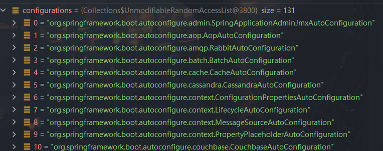
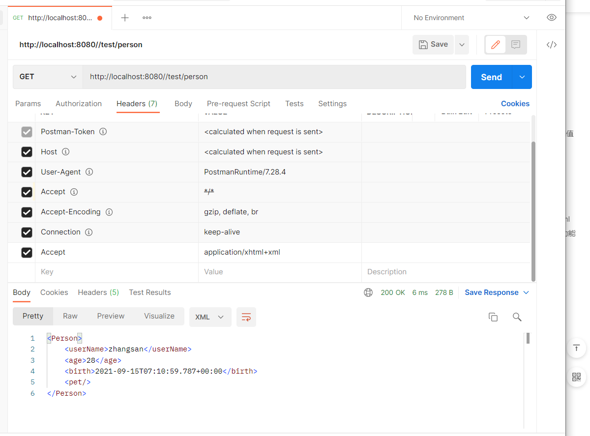
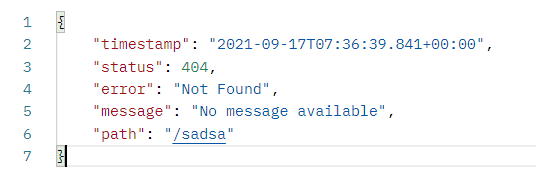
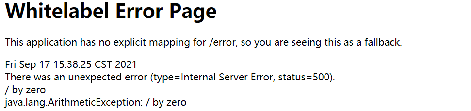
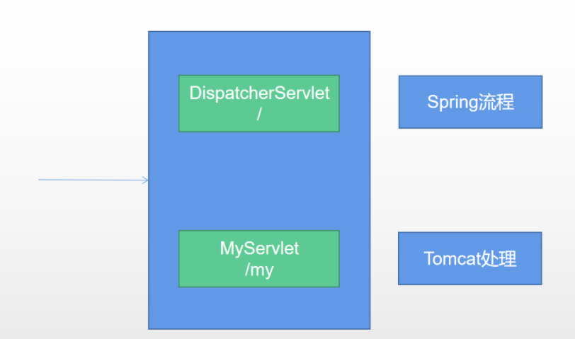
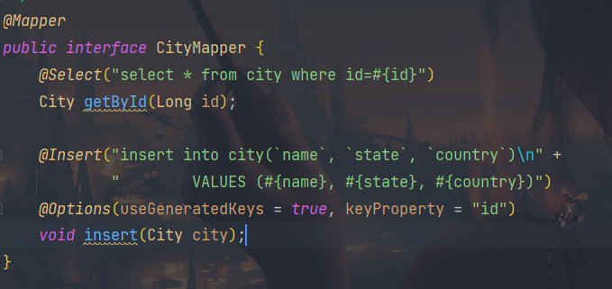

[TOC]


# spring与springboot背景

此笔记使用的是SpringBoot2.5.4


# 微服务

- 微服务是一种架构风格
- 一个应用拆分为一组小型服务
- 每个服务运行在自己的进程内，也就是可独立部署和升级
- 服务之间使用轻量级HTTP交互
- 服务围绕业务功能拆分
- 可以由全自动部署机制独立部署
- 去中心化，服务自治。服务可以使用不同的语言、不同的存储技术


# 基础入门


## 1.HelloWorld

+ 导入依赖

  ```xml
  <parent>
      <groupId>org.springframework.boot</groupId>
      <artifactId>spring-boot-starter-parent</artifactId>
      <version>2.5.4</version>
  </parent>
  
  <dependencies>
      <dependency>
          <groupId>org.springframework.boot</groupId>
          <artifactId>spring-boot-starter-web</artifactId>
      </dependency>
      <dependency>
          <groupId>org.springframework.boot</groupId>
          <artifactId>spring-boot-configuration-processor</artifactId>
          <optional>true</optional>
      </dependency>
  
  </dependencies>
  
  
  <build>
      <plugins>
          <plugin>
              <groupId>org.springframework.boot</groupId>
              <artifactId>spring-boot-maven-plugin</artifactId>
              <configuration>
                      <excludes>
                          <exclude>
                              <groupId>org.springframework.boot</groupId>
                              <artifactId>spring-boot-configuration-processor</artifactId>
                          </exclude>
                      </excludes>
                  </configuration>
          </plugin>
      </plugins>
  </build>
  ```


+ 主程序

  ```java
  /**
   * -@SpringBootApplication 告诉SpringBoot这是一个SpringBoot应用
   * 主程序类
   *
   * @author Kou
   * @date: 2021/9/5 10:53
   */
  @SpringBootApplication
  public class MainApplication {
      public static void main(String[] args) {
          SpringApplication.run(MainApplication.class, args);
      }
  }
  ```

  

+ 编写业务

  ```java
  /**
   * -@RestController:相当于@ResponseBody@RequestMapping
   *
   * @author Kou
   * @date: 2021/9/5 10:56
   */
  @RestController
  public class HelloController {
  
      @RequestMapping("/hello")
      public String handle01() {
          return "Hello,SpringBoot!";
      }
  }
  ```


+ 测试

  直接运行main方法


+ 简化配置

  application.properties

  ```properties
  #相当于更改了Tomcat的端口号
  server.port=8888
  ```


+ 简化部署

  ```xml
  <build>
      <plugins>
          <plugin>
              <groupId>org.springframework.boot</groupId>
              <artifactId>spring-boot-maven-plugin</artifactId>
          </plugin>
      </plugins>
  </build>
  ```

  把项目打成jar包，直接在目标服务器执行即可

  

+ 注意点

  + 取消掉cmd的快速编辑模式

  


## 2.依赖管理特性

+ 父项目做依赖管理

  ```xml
  依赖管理
  <parent>
      <groupId>org.springframework.boot</groupId>
      <artifactId>spring-boot-starter-parent</artifactId>
      <version>2.5.4</version>
  </parent>
  
  他的父项目
  <parent>
    <groupId>org.springframework.boot</groupId>
    <artifactId>spring-boot-dependencies</artifactId>
    <version>2.5.4</version>
  </parent>
  
  几乎声明了所有开发中常用的依赖的版本号，自动版本仲裁机制
  ```

+ 无需关注版本号，自动版本仲裁

  1. 引入依赖默认都不需要写版本号
  2. 引入非版本仲裁的jar，要写版本号

+ 可以修改默认的版本号

  ```xml
  1、查看spring-boot-dependencies里面规定当前依赖的版本 用的 key。
  2、在当前项目里面重写配置
  <properties>
      <mysql.version>5.1.43</mysql.version>
  </properties>
  ```

+ starter场景启动器

  ```xml
  1.spring-boot-starter-*   *就是某种场景
  2.只要引入starter，这个场景的所有常规需要的依赖全部会自动引入
  3.SpringBoot支持的所有场景
  https://docs.spring.io/spring-boot/docs/current/reference/html/using.html#using.build-systems.starters
  4.见到的 *-spring-boot-starter 是第三方提供的场景启动器
  5.所有场景启动器最底层的依赖
  <dependency>
    <groupId>org.springframework.boot</groupId>
    <artifactId>spring-boot-starter</artifactId>
    <version>2.5.4</version>
    <scope>compile</scope>
  </dependency>
  ```

  


## 3.自动配置特性

- 自动配好Tomcat

- - 引入Tomcat依赖。
  - 配置Tomcat

```xml
<dependency>
    <groupId>org.springframework.boot</groupId>
    <artifactId>spring-boot-starter-tomcat</artifactId>
    <version>2.5.4</version>
    <scope>compile</scope>
</dependency>
```

- 自动配好SpringMVC

- - 引入SpringMVC全套组件
  - 自动配好SpringMVC常用组件（功能）

- 自动配好Web常见功能，如：字符编码问题

- - SpringBoot帮我们配置好了所有web开发的常见场景

- 默认的包结构

- - ==主程序所在包及其下面的所有子包==里面的组件都会被默认扫描进来
  - 无需以前的包扫描配置

- - 想要改变扫描路径，@SpringBootApplication(scanBasePackages=**"com.kou"**)

- - - 或者@ComponentScan 指定扫描路径

```java
@SpringBootApplication
等同于
@SpringBootConfiguration
@EnableAutoConfiguration
@ComponentScan("com.kou.boot")
```

- 各种配置拥有默认值

- - 默认配置最终都是映射到某个类上，如：MultipartProperties
  - 配置文件的值最终会绑定每个类上，这个类会在容器中创建对象

- 按需加载所有自动配置项

- - 非常多的starter
  - 引入了哪些场景这个场景的自动配置才会开启

- - SpringBoot所有的自动配置功能都在 spring-boot-autoconfigure 包里面


## 4.容器功能

### 4.1 组件添加


#### 4.1.1.@Configuration

+ 基本使用

+ **Full模式与Lite模式**

  + 示例

  + 最佳实战

    + ==配置类组件之间无依赖关系用Lite模式加速容器启动过程，减少判断==

      Lite模式的`@Bean`方法**不能声明Bean之间的依赖关系**。因此，这样的`@Bean`方法**不应该调用其他@Bean方法**。每个这样的方法实际上**只是一个特定Bean引用的工厂方法(factory-method)**，没有任何特殊的运行时语义。

    + ==配置类组件之间有依赖关系，方法会被调用得到之前单实例组件，用Full模式==

  ```java
  /**
   * -@Configuration告诉SpringBoot这是一个配置类
   * 1.容器中的组件默认是单实例的
   * 2.配置类本身也是一个组件
   * 3.proxyBeanMethods:代理bean的方法
   * Full(proxyBeanMethods = true)【保证每个@Bean方法被调用多少次返回的组件都是单实例的】
   * Lite(proxyBeanMethods = false)【每个@Bean方法被调用多少次返回的组件都是新创建的】
   * 组件依赖
   * 全模式与轻量级模式
   *
   * @author Kou
   * @date: 2021/9/5 15:55
   */
  @Configuration(proxyBeanMethods = true)
  public class MyConfig {
  
      /**
       * Bean注解
       * 给容器中添加组件。以方法名作为组件的id。
       * 外部无论对配置类的这个组件注册方法调用多少次,获取的都是之前注册容器中的单实例对象
       *
       * @return 返回类型就是组件类型。返回的值，就是组件在容器中的实例。
       */
      @Bean
      public User user01() {
          User zhangsan = new User("张三", 18);
          zhangsan.setPet(pet01());
          return zhangsan;
      }
  
      @Bean("jerry")
      public Pet pet01() {
          return new Pet("jerry");
      }
  }
  
  
  
  ---------------------------------------
  /**
   * -@SpringBootApplication 告诉SpringBoot这是一个SpringBoot应用
   * 主程序类
   *
   * @author Kou
   * @date: 2021/9/5 10:53
   */
  @SpringBootApplication
  public class MainApplication {
      public static void main(String[] args) {
          //1.返回IOC容器
          ConfigurableApplicationContext run = SpringApplication.run(MainApplication.class, args);
  
          //2.查看容器内的组件
          String[] beanDefinitionNames = run.getBeanDefinitionNames();
          for (String name : beanDefinitionNames) {
              System.out.println(name);
          }
  
          MyConfig bean = run.getBean(MyConfig.class);
          System.out.println(bean);
  
          /*
          @Configuration(proxyBeanMethods = true)代理对象调用方法,SpringBoot总会检查这个组件是否在容器内
          保持组件单实例
          */
          User user = bean.user01();
          User user1 = bean.user01();
          System.out.println(user == user1);
  
  
          User user01 = run.getBean("user01", User.class);
          Pet jerry = run.getBean("jerry", Pet.class);
  
          System.out.println("用户的宠物:" + (user01.getPet() == jerry));
      }
  }
  ```


#### 4.1.2.@Import

```java
/** 
* 4、@Import({User.class, DBHelper.class})
 *     给容器中自动创建出这两个类型的组件、默认组件的名字就是全类名
 *
 *
 *
 */

@Import({User.class, DBHelper.class})
@Configuration(proxyBeanMethods = false) //告诉SpringBoot这是一个配置类 == 配置文件
public class MyConfig {
}
```

@Import 高级用法： https://www.bilibili.com/video/BV1gW411W7wy?p=8


#### 4.1.3.@Conditional

条件装配：满足Conditional指定的条件，则进行组件注入

```java
=====================测试条件装配==========================
@Configuration(proxyBeanMethods = false) //告诉SpringBoot这是一个配置类 == 配置文件
    
//@ConditionalOnBean(name = "tom")
@ConditionalOnMissingBean(name = "tom")
    
public class MyConfig {


    /**
     * Full:外部无论对配置类中的这个组件注册方法调用多少次获取的都是之前注册容器中的单实例对象
     * @return
     */

    @Bean //给容器中添加组件。以方法名作为组件的id。返回类型就是组件类型。返回的值，就是组件在容器中的实例
    public User user01(){
        User zhangsan = new User("zhangsan", 18);
        //user组件依赖了Pet组件
        zhangsan.setPet(tomcatPet());
        return zhangsan;
    }

    @Bean("tom22")
    public Pet tomcatPet(){
        return new Pet("tomcat");
    }
}

public static void main(String[] args) {
    //1、返回我们IOC容器
    ConfigurableApplicationContext run = SpringApplication.run(MainApplication.class, args);

    //2、查看容器里面的组件
    String[] names = run.getBeanDefinitionNames();
    for (String name : names) {
        System.out.println(name);
    }

    boolean tom = run.containsBean("tom");
    System.out.println("容器中Tom组件："+tom);

    boolean user01 = run.containsBean("user01");
    System.out.println("容器中user01组件："+user01);

    boolean tom22 = run.containsBean("tom22");
    System.out.println("容器中tom22组件："+tom22);


}
```


#### 4.1.4.@ImportResource

标在一个配置类上

```java
@ImportResource(locations = "classpath:beans.xml")
```


#### 5.@ConfigurationProperties

配置绑定

##### @Component + @ConfigurationProperties

```properties
mycar.brand=BYD
mycar.price=100000
```


```java
/**
 * 只有在容器中的组件，才会拥有SpringBoot提供的强大功能
 */
@Component
@ConfigurationProperties(prefix = "mycar")
public class Car {

    private String brand;
    private Integer price;

}
```


##### @EnableConfigurationProperties + @ConfigurationProperties

```java
@EnableConfigurationProperties(Car.class)
//1、开启Car配置绑定功能
//2、把这个Car这个组件自动注册到容器中
public class MyConfig {
}
@ConfigurationProperties(prefix = "mycar")
public class Car {
```


## 5.自动配置原理入门（源码分析）

### 5.1引导加载自动配置类

```java
//@SpringBootApplication
@SpringBootConfiguration
@EnableAutoConfiguration
@ComponentScan(excludeFilters = { @Filter(type = FilterType.CUSTOM, classes = TypeExcludeFilter.class),
      @Filter(type = FilterType.CUSTOM, classes = AutoConfigurationExcludeFilter.class) })
public @interface SpringBootApplication 
    
    
```


### 5.2@SpringBootConfiguration

本质是一个`@Configuration`，代表当前是一个配置类


### 5.3@ComponentScan

指定扫描哪些


### ==5.4@EnableAutoConfiguration==

```java
@AutoConfigurationPackage
@Import(AutoConfigurationImportSelector.class)
public @interface EnableAutoConfiguration
```


#### 1.@AutoConfigurationPackage

自动配置包？

**指定了默认的包规则**

```java
@Import(AutoConfigurationPackages.Registrar.class) //给容器中导入一个组件
public @interface AutoConfigurationPackage
    
//利用Registrar给容器中导入一系列组件
    
//将指定的一个包下的所有组件导入进来  main程序所在包
```


#### 2、@Import(AutoConfigurationImportSelector.class)

```java
1.利用 getAutoConfigurationEntry(annotationMetadata);给容器中批量导入一些组件
2.调用List<String> configurations = getCandidateConfigurations(annotationMetadata, attributes)获取到所有需要导入到容器的配置类
3.利用工厂加载 Map<String, List<String>> loadSpringFactories(ClassLoader classLosader)；得到所有组件
4.从META-INF/spring.factories来加载一个文件
    默认扫描我们当前系统里面所有META-INF/spring.factories位置的文件
    spring-boot-autoconfigure-2.5.4.jar包里面也有META-INF/spring.factories
```





```properties
spring-boot-autoconfigure-2.5.4.jar包里面也有META-INF/spring.factories
文件里面写死了,springboot一启动就要给容器中加载的所有配置
# Auto Configure
org.springframework.boot.autoconfigure.EnableAutoConfiguration=\
org.springframework.boot.autoconfigure.admin.SpringApplicationAdminJmxAutoConfiguration,\
org.springframework.boot.autoconfigure.aop.AopAutoConfiguration,\
org.springframework.boot.autoconfigure.amqp.RabbitAutoConfiguration,\
org.springframework.boot.autoconfigure.batch.BatchAutoConfiguration,\
org.springframework.boot.autoconfigure.cache.CacheAutoConfiguration,\
org.springframework.boot.autoconfigure.cassandra.CassandraAutoConfiguration,\
org.springframework.boot.autoconfigure.context.ConfigurationPropertiesAutoConfiguration,\
org.springframework.boot.autoconfigure.context.LifecycleAutoConfiguration,\
org.springframework.boot.autoconfigure.context.MessageSourceAutoConfiguration,\
org.springframework.boot.autoconfigure.context.PropertyPlaceholderAutoConfiguration,\
org.springframework.boot.autoconfigure.couchbase.CouchbaseAutoConfiguration,\
org.springframework.boot.autoconfigure.dao.PersistenceExceptionTranslationAutoConfiguration,\
org.springframework.boot.autoconfigure.data.cassandra.CassandraDataAutoConfiguration,\
org.springframework.boot.autoconfigure.data.cassandra.CassandraReactiveDataAutoConfiguration,\
org.springframework.boot.autoconfigure.data.cassandra.CassandraReactiveRepositoriesAutoConfiguration,\
org.springframework.boot.autoconfigure.data.cassandra.CassandraRepositoriesAutoConfiguration,\
org.springframework.boot.autoconfigure.data.couchbase.CouchbaseDataAutoConfiguration,\
org.springframework.boot.autoconfigure.data.couchbase.CouchbaseReactiveDataAutoConfiguration,\
org.springframework.boot.autoconfigure.data.couchbase.CouchbaseReactiveRepositoriesAutoConfiguration,\
org.springframework.boot.autoconfigure.data.couchbase.CouchbaseRepositoriesAutoConfiguration,\
org.springframework.boot.autoconfigure.data.elasticsearch.ElasticsearchDataAutoConfiguration,\
org.springframework.boot.autoconfigure.data.elasticsearch.ElasticsearchRepositoriesAutoConfiguration,\
org.springframework.boot.autoconfigure.data.elasticsearch.ReactiveElasticsearchRepositoriesAutoConfiguration,\
org.springframework.boot.autoconfigure.data.elasticsearch.ReactiveElasticsearchRestClientAutoConfiguration,\
org.springframework.boot.autoconfigure.data.jdbc.JdbcRepositoriesAutoConfiguration,\
org.springframework.boot.autoconfigure.data.jpa.JpaRepositoriesAutoConfiguration,\
org.springframework.boot.autoconfigure.data.ldap.LdapRepositoriesAutoConfiguration,\
org.springframework.boot.autoconfigure.data.mongo.MongoDataAutoConfiguration,\
org.springframework.boot.autoconfigure.data.mongo.MongoReactiveDataAutoConfiguration,\
org.springframework.boot.autoconfigure.data.mongo.MongoReactiveRepositoriesAutoConfiguration,\
org.springframework.boot.autoconfigure.data.mongo.MongoRepositoriesAutoConfiguration,\
org.springframework.boot.autoconfigure.data.neo4j.Neo4jDataAutoConfiguration,\
org.springframework.boot.autoconfigure.data.neo4j.Neo4jReactiveDataAutoConfiguration,\
org.springframework.boot.autoconfigure.data.neo4j.Neo4jReactiveRepositoriesAutoConfiguration,\
org.springframework.boot.autoconfigure.data.neo4j.Neo4jRepositoriesAutoConfiguration,\
org.springframework.boot.autoconfigure.data.r2dbc.R2dbcDataAutoConfiguration,\
org.springframework.boot.autoconfigure.data.r2dbc.R2dbcRepositoriesAutoConfiguration,\
org.springframework.boot.autoconfigure.data.redis.RedisAutoConfiguration,\
org.springframework.boot.autoconfigure.data.redis.RedisReactiveAutoConfiguration,\
org.springframework.boot.autoconfigure.data.redis.RedisRepositoriesAutoConfiguration,\
org.springframework.boot.autoconfigure.data.rest.RepositoryRestMvcAutoConfiguration,\
org.springframework.boot.autoconfigure.data.web.SpringDataWebAutoConfiguration,\
org.springframework.boot.autoconfigure.elasticsearch.ElasticsearchRestClientAutoConfiguration,\
org.springframework.boot.autoconfigure.flyway.FlywayAutoConfiguration,\
org.springframework.boot.autoconfigure.freemarker.FreeMarkerAutoConfiguration,\
org.springframework.boot.autoconfigure.groovy.template.GroovyTemplateAutoConfiguration,\
org.springframework.boot.autoconfigure.gson.GsonAutoConfiguration,\
org.springframework.boot.autoconfigure.h2.H2ConsoleAutoConfiguration,\
org.springframework.boot.autoconfigure.hateoas.HypermediaAutoConfiguration,\
org.springframework.boot.autoconfigure.hazelcast.HazelcastAutoConfiguration,\
org.springframework.boot.autoconfigure.hazelcast.HazelcastJpaDependencyAutoConfiguration,\
org.springframework.boot.autoconfigure.http.HttpMessageConvertersAutoConfiguration,\
org.springframework.boot.autoconfigure.http.codec.CodecsAutoConfiguration,\
org.springframework.boot.autoconfigure.influx.InfluxDbAutoConfiguration,\
org.springframework.boot.autoconfigure.info.ProjectInfoAutoConfiguration,\
org.springframework.boot.autoconfigure.integration.IntegrationAutoConfiguration,\
org.springframework.boot.autoconfigure.jackson.JacksonAutoConfiguration,\
org.springframework.boot.autoconfigure.jdbc.DataSourceAutoConfiguration,\
org.springframework.boot.autoconfigure.jdbc.JdbcTemplateAutoConfiguration,\
org.springframework.boot.autoconfigure.jdbc.JndiDataSourceAutoConfiguration,\
org.springframework.boot.autoconfigure.jdbc.XADataSourceAutoConfiguration,\
org.springframework.boot.autoconfigure.jdbc.DataSourceTransactionManagerAutoConfiguration,\
org.springframework.boot.autoconfigure.jms.JmsAutoConfiguration,\
org.springframework.boot.autoconfigure.jmx.JmxAutoConfiguration,\
org.springframework.boot.autoconfigure.jms.JndiConnectionFactoryAutoConfiguration,\
org.springframework.boot.autoconfigure.jms.activemq.ActiveMQAutoConfiguration,\
org.springframework.boot.autoconfigure.jms.artemis.ArtemisAutoConfiguration,\
org.springframework.boot.autoconfigure.jersey.JerseyAutoConfiguration,\
org.springframework.boot.autoconfigure.jooq.JooqAutoConfiguration,\
org.springframework.boot.autoconfigure.jsonb.JsonbAutoConfiguration,\
org.springframework.boot.autoconfigure.kafka.KafkaAutoConfiguration,\
org.springframework.boot.autoconfigure.availability.ApplicationAvailabilityAutoConfiguration,\
org.springframework.boot.autoconfigure.ldap.embedded.EmbeddedLdapAutoConfiguration,\
org.springframework.boot.autoconfigure.ldap.LdapAutoConfiguration,\
org.springframework.boot.autoconfigure.liquibase.LiquibaseAutoConfiguration,\
org.springframework.boot.autoconfigure.mail.MailSenderAutoConfiguration,\
org.springframework.boot.autoconfigure.mail.MailSenderValidatorAutoConfiguration,\
org.springframework.boot.autoconfigure.mongo.embedded.EmbeddedMongoAutoConfiguration,\
org.springframework.boot.autoconfigure.mongo.MongoAutoConfiguration,\
org.springframework.boot.autoconfigure.mongo.MongoReactiveAutoConfiguration,\
org.springframework.boot.autoconfigure.mustache.MustacheAutoConfiguration,\
org.springframework.boot.autoconfigure.neo4j.Neo4jAutoConfiguration,\
org.springframework.boot.autoconfigure.netty.NettyAutoConfiguration,\
org.springframework.boot.autoconfigure.orm.jpa.HibernateJpaAutoConfiguration,\
org.springframework.boot.autoconfigure.quartz.QuartzAutoConfiguration,\
org.springframework.boot.autoconfigure.r2dbc.R2dbcAutoConfiguration,\
org.springframework.boot.autoconfigure.r2dbc.R2dbcTransactionManagerAutoConfiguration,\
org.springframework.boot.autoconfigure.rsocket.RSocketMessagingAutoConfiguration,\
org.springframework.boot.autoconfigure.rsocket.RSocketRequesterAutoConfiguration,\
org.springframework.boot.autoconfigure.rsocket.RSocketServerAutoConfiguration,\
org.springframework.boot.autoconfigure.rsocket.RSocketStrategiesAutoConfiguration,\
org.springframework.boot.autoconfigure.security.servlet.SecurityAutoConfiguration,\
org.springframework.boot.autoconfigure.security.servlet.UserDetailsServiceAutoConfiguration,\
org.springframework.boot.autoconfigure.security.servlet.SecurityFilterAutoConfiguration,\
org.springframework.boot.autoconfigure.security.reactive.ReactiveSecurityAutoConfiguration,\
org.springframework.boot.autoconfigure.security.reactive.ReactiveUserDetailsServiceAutoConfiguration,\
org.springframework.boot.autoconfigure.security.rsocket.RSocketSecurityAutoConfiguration,\
org.springframework.boot.autoconfigure.security.saml2.Saml2RelyingPartyAutoConfiguration,\
org.springframework.boot.autoconfigure.sendgrid.SendGridAutoConfiguration,\
org.springframework.boot.autoconfigure.session.SessionAutoConfiguration,\
org.springframework.boot.autoconfigure.security.oauth2.client.servlet.OAuth2ClientAutoConfiguration,\
org.springframework.boot.autoconfigure.security.oauth2.client.reactive.ReactiveOAuth2ClientAutoConfiguration,\
org.springframework.boot.autoconfigure.security.oauth2.resource.servlet.OAuth2ResourceServerAutoConfiguration,\
org.springframework.boot.autoconfigure.security.oauth2.resource.reactive.ReactiveOAuth2ResourceServerAutoConfiguration,\
org.springframework.boot.autoconfigure.solr.SolrAutoConfiguration,\
org.springframework.boot.autoconfigure.sql.init.SqlInitializationAutoConfiguration,\
org.springframework.boot.autoconfigure.task.TaskExecutionAutoConfiguration,\
org.springframework.boot.autoconfigure.task.TaskSchedulingAutoConfiguration,\
org.springframework.boot.autoconfigure.thymeleaf.ThymeleafAutoConfiguration,\
org.springframework.boot.autoconfigure.transaction.TransactionAutoConfiguration,\
org.springframework.boot.autoconfigure.transaction.jta.JtaAutoConfiguration,\
org.springframework.boot.autoconfigure.validation.ValidationAutoConfiguration,\
org.springframework.boot.autoconfigure.web.client.RestTemplateAutoConfiguration,\
org.springframework.boot.autoconfigure.web.embedded.EmbeddedWebServerFactoryCustomizerAutoConfiguration,\
org.springframework.boot.autoconfigure.web.reactive.HttpHandlerAutoConfiguration,\
org.springframework.boot.autoconfigure.web.reactive.ReactiveWebServerFactoryAutoConfiguration,\
org.springframework.boot.autoconfigure.web.reactive.WebFluxAutoConfiguration,\
org.springframework.boot.autoconfigure.web.reactive.error.ErrorWebFluxAutoConfiguration,\
org.springframework.boot.autoconfigure.web.reactive.function.client.ClientHttpConnectorAutoConfiguration,\
org.springframework.boot.autoconfigure.web.reactive.function.client.WebClientAutoConfiguration,\
org.springframework.boot.autoconfigure.web.servlet.DispatcherServletAutoConfiguration,\
org.springframework.boot.autoconfigure.web.servlet.ServletWebServerFactoryAutoConfiguration,\
org.springframework.boot.autoconfigure.web.servlet.error.ErrorMvcAutoConfiguration,\
org.springframework.boot.autoconfigure.web.servlet.HttpEncodingAutoConfiguration,\
org.springframework.boot.autoconfigure.web.servlet.MultipartAutoConfiguration,\
org.springframework.boot.autoconfigure.web.servlet.WebMvcAutoConfiguration,\
org.springframework.boot.autoconfigure.websocket.reactive.WebSocketReactiveAutoConfiguration,\
org.springframework.boot.autoconfigure.websocket.servlet.WebSocketServletAutoConfiguration,\
org.springframework.boot.autoconfigure.websocket.servlet.WebSocketMessagingAutoConfiguration,\
org.springframework.boot.autoconfigure.webservices.WebServicesAutoConfiguration,\
org.springframework.boot.autoconfigure.webservices.client.WebServiceTemplateAutoConfiguration


```


### 5.5按需开启自动配置项

```properties
虽然131个场景的所有配置，启动的时候默认全部加载。
按照条件装配规则（@Conditional）,最终会按需配置
```


### 5.6修改默认配置

```java
@Bean
@ConditionalOnBean(MultipartResolver.class)  //容器中有这个类型组件
@ConditionalOnMissingBean(name = DispatcherServlet.MULTIPART_RESOLVER_BEAN_NAME) //容器中没有这个名字 multipartResolver 的组件
public MultipartResolver multipartResolver(MultipartResolver resolver) {
    //给@Bean标注的方法传入了对象参数，这个参数的值就会从容器中找。
    //SpringMVC multipartResolver。防止有些用户配置的文件上传解析器不符合规范
    // Detect if the user has created a MultipartResolver but named it incorrectly
    return resolver;
}
给容器中加入了文件上传解析器；
```


SpringBoot默认会在底层配好所有的组件，但是如果用户配置了会以用户的优先

```java
@Bean
	@ConditionalOnMissingBean
	public CharacterEncodingFilter characterEncodingFilter() {
    }
```


总结：

+ SpringBoot先加载所有的自动配置类    xxxxxAutoConfiguration
+ 每个自动配置类按照条件进行生效，默认都会绑定配置文件指定的值，xxxxProperties里面拿。xxxxProperties和配置文件进行了绑定
+ 生效的配置类就会给容器中装配很多的组件
+ 只要容器中有这些组件相当于这些功能就有了
+ 只要用户有自己配置的就以用户的优先
+ 定制化配置
  + 用户直接@Bean替换底层的组件
  + 用户去看这个组件是获取的配置文件什么值就去修改

**xxxxxAutoConfiguration ---> 组件  --->** **xxxxProperties里面拿值  ----> application.properties**


### 最佳实践

+ 引入场景依赖

+ 查看自动配置了哪些（选做）

  + 自己分析，引入场景对应的自动配置一般都生效了

  + ```properties
    配置文件中   debug=true        开启自动配置报告
    ```

+ 是否需要修改

  + 参照文档修改配置项
  + 自定义加入或者替换组件
  + ........
  + 自定义加入或者替换组件
    + @Bean/@Componet
  + 自定义器XXXXCustomizer
  + .........


#### Spring Initailizr（项目初始化向导）


# 核心功能


## 1.配置文件


### 文件类型


#### 1.1、properties

同以前的properties用法


#### 1.2、yaml

YAML 是 "YAML Ain't Markup Language"（YAML 不是一种标记语言）的递归缩写。在开发的这种语言时，YAML 的意思其实是："Yet Another Markup Language"（仍是一种标记语言）。 


非常适合用来做以数据为中心的配置文件


##### 基本语法

- key: value；kv之间有空格
- 大小写敏感

- 使用缩进表示层级关系
- 缩进不允许使用tab，只允许空格

- 缩进的空格数不重要，只要相同层级的元素左对齐即可
- '#'表示注释

- 字符串无需加引号，如果要加，''与""表示字符串内容 会被 转义/不转义


##### 数据类型

- 字面量：单个的、不可再分的值。date、boolean、string、number、null

  ```yaml
  k: v
  ```

- 对象：键值对的集合。map、hash、set、object 

  ```yaml
  行内写法：  k: {k1:v1,k2:v2,k3:v3}
  #或
  k: 
    k1: v1
    k2: v2
    k3: v3
  ```

- 数组：一组按次序排列的值。array、list、queue

  ```yaml
  行内写法：  k: [v1,v2,v3]
  #或者
  k:
   - v1
   - v2
   - v3
  ```


##### 示例

```java
@Component
@ConfigurationProperties(prefix = "person")
public class Person {
    private String userName;
    private Boolean boss;
    private Date birth;
    private Integer age;
    private Pet pet;
    private String[] interests;
    private List<String> animal;
    private Map<String, Object> score;
    private Set<Double> salarys;
    private Map<String, List<Pet>> allPets;
    
    
    
public class Pet {
    private String name;
    private Double weight;
```

```yaml
person:
  #单引号会将\n作为字符串输出,双引号会将\n作为换行输出
  #双引号不会转义,单引号会转义
  userName: 'zhangsan \n lisi'
  boss: true
  birth: 2021/9/7
  age: 18
  #  interests: [篮球,足球]
  interests:
    - 篮球
    - 足球
  animal: [ 阿猫,阿狗 ]
  score: { english:80,math:90 }
  salarys: [ 9999.98,9999.99 ]
  pet:
    name: 阿狗
    weight: 99.99

  allPets:
    sick:
      - { name: 阿狗,weight: 99.99 }
      - name: 阿猫
        weight: 88.88
      - name: 阿虫
        weight: 77.77
    health:
      - { name: 阿花,weight: 199.99 }
      - { name: 阿明,weight: 199.99 }
```


#### 配置提示

自定义的类和配置文件绑定一般没有提示。

```xml
        <dependency>
            <groupId>org.springframework.boot</groupId>
            <artifactId>spring-boot-configuration-processor</artifactId>
            <optional>true</optional>
        </dependency>


 <build>
        <plugins>
            <plugin>
                <groupId>org.springframework.boot</groupId>
                <artifactId>spring-boot-maven-plugin</artifactId>
                <configuration>
                    <excludes>
                        <exclude>
                            <groupId>org.springframework.boot</groupId>
                            <artifactId>spring-boot-configuration-processor</artifactId>
                        </exclude>
                    </excludes>
                </configuration>
            </plugin>
        </plugins>
    </build>
```


### 配置多个yml文件

SpringBoot，在application.yml 引入其它配置文件。

具体实现
新建了两个配置文件（注意格式）


分别配置属性值

在application.yml 引入配置


## 2.Web开发


### 1.SpringMVC自动配置概览

Spring Boot provides auto-configuration for Spring MVC that **works well with most applications.(大多场景我们都无需自定义配置)**

The auto-configuration adds the following features on top of Spring’s defaults:

- Inclusion of `ContentNegotiatingViewResolver` and `BeanNameViewResolver` beans.

- - 内容协商视图解析器和BeanName视图解析器

- Support for serving static resources, including support for WebJars (covered [later in this document](https://docs.spring.io/spring-boot/docs/current/reference/html/spring-boot-features.html#boot-features-spring-mvc-static-content))).

- - 静态资源（包括webjars）

- Automatic registration of `Converter`, `GenericConverter`, and `Formatter` beans.

- - 自动注册 `Converter，GenericConverter，Formatter `

- Support for `HttpMessageConverters` (covered [later in this document](https://docs.spring.io/spring-boot/docs/current/reference/html/spring-boot-features.html#boot-features-spring-mvc-message-converters)).

- - 支持 `HttpMessageConverters` （后来我们配合内容协商理解原理）

- Automatic registration of `MessageCodesResolver` (covered [later in this document](https://docs.spring.io/spring-boot/docs/current/reference/html/spring-boot-features.html#boot-features-spring-message-codes)).

- - 自动注册 `MessageCodesResolver` （国际化用）

- Static `index.html` support.

- - 静态index.html 页支持

- Custom `Favicon` support (covered [later in this document](https://docs.spring.io/spring-boot/docs/current/reference/html/spring-boot-features.html#boot-features-spring-mvc-favicon)).

- - 自定义 `Favicon`  

- Automatic use of a `ConfigurableWebBindingInitializer` bean (covered [later in this document](https://docs.spring.io/spring-boot/docs/current/reference/html/spring-boot-features.html#boot-features-spring-mvc-web-binding-initializer)).

- - 自动使用 `ConfigurableWebBindingInitializer` ，（DataBinder负责将请求数据绑定到JavaBean上）

> If you want to keep those Spring Boot MVC customizations and make more [MVC customizations](https://docs.spring.io/spring/docs/5.2.9.RELEASE/spring-framework-reference/web.html#mvc) (interceptors, formatters, view controllers, and other features), you can add your own `@Configuration` class of type `WebMvcConfigurer` but **without** `@EnableWebMvc`.

> **不用@EnableWebMvc注解。使用** `**@Configuration**` **+** `WebMvcConfigurer` **自定义规则**


> If you want to provide custom instances of `RequestMappingHandlerMapping`, `RequestMappingHandlerAdapter`, or `ExceptionHandlerExceptionResolver`, and still keep the Spring Boot MVC customizations, you can declare a bean of type `WebMvcRegistrations` and use it to provide custom instances of those components.

> **声明** `**WebMvcRegistrations**` **改变默认底层组件**


> If you want to take complete control of Spring MVC, you can add your own `@Configuration` annotated with `@EnableWebMvc`, or alternatively add your own `@Configuration`-annotated `DelegatingWebMvcConfiguration` as described in the Javadoc of `@EnableWebMvc`.

> **使用** `**@EnableWebMvc+@Configuration+DelegatingWebMvcConfiguration 全面接管SpringMVC**`


### 2.简单功能分析


**代码：boot-05-web-01**


#### 2.1 静态资源访问

##### 1.静态资源目录

只要静态资源放在类路径下： `/static` (or `/public` or `/resources` or `/META-INF/resources`

访问 ： 当前项目根路径/ + 静态资源名 


原理： 静态映射/**。

请求进来，先去找Controller看能不能处理。不能处理的所有请求又都交给静态资源处理器。静态资源也找不到则响应404页面


##### 2.静态资源访问前缀

默认无前缀。

配置之后：

```yaml
spring:
  mvc:
    static-path-pattern: /res/**
```

当前项目 + static-path + 静态资源名 = 静态资源文件夹下找


##### 3.改变静态资源路径

```yaml
spring:
  web:
    resources:
      static-locations: classpath:/haha/
```


##### 4.webjar

自动映射 /[webjars](http://localhost:8080/webjars/jquery/3.5.1/jquery.js)/**

https://www.webjars.org/

```xml
        <dependency>
            <groupId>org.webjars</groupId>
            <artifactId>jquery</artifactId>
            <version>3.5.1</version>
        </dependency>
```

访问地址：[http://localhost:8080/webjars/**jquery/3.5.1/jquery.js**](http://localhost:8080/webjars/jquery/3.5.1/jquery.js)   后面地址要按照依赖里面的包路径


#### 2.2 欢迎页支持

+ 静态资源路径下index.html

  + 可以配置静态资源路径
  + 但是不可以配置静态资源的访问前缀，否则导致index.html不能被默认访问

  ```yaml
  spring:
  #  mvc:
  #    static-path-pattern: /res/**   这个会导致welcome page功能失效
  
    resources:
      static-locations: [classpath:/haha/]
  ```

  

+ controller能处理/index

  + 


#### 2.3 自定义Favicon

favicon.ico 放在静态资源目录下即可。

YAML

复制代码

```yaml
spring:
#  mvc:
#    static-path-pattern: /res/**   这个会导致 Favicon 功能失效
```


#### 2.4 静态资源配置原理（源码分析）

+ SpringBoot启动默认加载  xxxAutoConfiguration类（自动配置类）

+ SpringMVC功能的自动配置类WebMvcAutoConfiguration，生效

  ```java
  @Configuration(proxyBeanMethods = false)
  @ConditionalOnWebApplication(type = Type.SERVLET)
  @ConditionalOnClass({ Servlet.class, DispatcherServlet.class, WebMvcConfigurer.class })
  @ConditionalOnMissingBean(WebMvcConfigurationSupport.class)
  @AutoConfigureOrder(Ordered.HIGHEST_PRECEDENCE + 10)
  @AutoConfigureAfter({ DispatcherServletAutoConfiguration.class, TaskExecutionAutoConfiguration.class,
  		ValidationAutoConfiguration.class })
  public class WebMvcAutoConfiguration
  ```

+ 给容器中配了什么

  ```java
  @Configuration(proxyBeanMethods = false)
  @Import(EnableWebMvcConfiguration.class)
  @EnableConfigurationProperties({ WebMvcProperties.class,
        org.springframework.boot.autoconfigure.web.ResourceProperties.class, WebProperties.class })
  @Order(0)
  public static class WebMvcAutoConfigurationAdapter implements WebMvcConfigurer, ServletContextAware
  ```

+ 配置文件的相关的属性和xxxx进行了绑定`WebMvcProperties.class`  `WebProperties.class`

  + ```java
    //WebMvcProperties.class==spring.mvc
    //ResourceProperties.class==spring.resources
    //WebProperties.class==spring.web
    ```


##### 1.配置类只有一个有参构造器

```java
//有参构造器所有参数的值都会从容器中找
//ResourceProperties resourceProperties：获取和spring.resources绑定的所有的值的对象
//WebMvcProperties mvcProperties：获取和spring.mvc绑定的所有的值的对象
//ListableBeanFactory beanFactory  Spring的beanFactory
//HttpMessageConverters：找到所有的HttpMessageConverter
//ResourceHandlerRegistrationCustomizer 找到 资源处理器的自定义器。=========
//DispatcherServletPath  
//ServletRegistrationBean   给应用注册Servlet、Filter....
public WebMvcAutoConfigurationAdapter(
      org.springframework.boot.autoconfigure.web.ResourceProperties resourceProperties,
      WebProperties webProperties, WebMvcProperties mvcProperties, ListableBeanFactory beanFactory,
      ObjectProvider<HttpMessageConverters> messageConvertersProvider,
      ObjectProvider<ResourceHandlerRegistrationCustomizer> resourceHandlerRegistrationCustomizerProvider,
      ObjectProvider<DispatcherServletPath> dispatcherServletPath,
      ObjectProvider<ServletRegistrationBean<?>> servletRegistrations) {
   this.resourceProperties = resourceProperties.hasBeenCustomized() ? resourceProperties
         : webProperties.getResources();
   this.mvcProperties = mvcProperties;
   this.beanFactory = beanFactory;
   this.messageConvertersProvider = messageConvertersProvider;
   this.resourceHandlerRegistrationCustomizer = resourceHandlerRegistrationCustomizerProvider.getIfAvailable();
   this.dispatcherServletPath = dispatcherServletPath;
   this.servletRegistrations = servletRegistrations;
   this.mvcProperties.checkConfiguration();
}
```


##### 2.资源处理的默认规则

```java
public void addResourceHandlers(ResourceHandlerRegistry registry) {
   if (!this.resourceProperties.isAddMappings()) {
      logger.debug("Default resource handling disabled");
      return;
   }
    //webjars的规则
   addResourceHandler(registry, "/webjars/**", "classpath:/META-INF/resources/webjars/");
   addResourceHandler(registry, this.mvcProperties.getStaticPathPattern(), (registration) -> {
      registration.addResourceLocations(this.resourceProperties.getStaticLocations());
      if (this.servletContext != null) {
         ServletContextResource resource = new ServletContextResource(this.servletContext, SERVLE
         registration.addResourceLocations(resource);
      }
   });
          
private void addResourceHandler(ResourceHandlerRegistry registry, String pattern, String... locations) {
	addResourceHandler(registry, pattern, (registration) -> registration.addResourceLocations(locations));
}
          
private void addResourceHandler(ResourceHandlerRegistry registry, String pattern,
		Consumer<ResourceHandlerRegistration> customizer) {
	if (registry.hasMappingForPattern(pattern)) {
		return;
	}
	ResourceHandlerRegistration registration = registry.addResourceHandler(pattern);
	customizer.accept(registration);
	registration.setCachePeriod(getSeconds(this.resourceProperties.getCache().getPeriod()));
	registration.setCacheControl(this.resourceProperties.getCache().getCachecontrol().toHttpCacheControl());
	registration.setUseLastModified(this.resourceProperties.getCache().isUseLastModified());
	customizeResourceHandlerRegistration(registration);
}
```


```yaml
spring:
  resources:
    add-mappings: false   禁用所有静态资源规则
```


```java
//静态资源的默认位置
public static class Resources {
	private static final String[] CLASSPATH_RESOURCE_LOCATIONS = { "classpath:/META-INF/resources/",
			"classpath:/resources/", "classpath:/static/", "classpath:/public/" };
	/**
	 * Locations of static resources. Defaults to classpath:[/META-INF/resources/,
	 * /resources/, /static/, /public/].
	 */
	private String[] staticLocations = CLASSPATH_RESOURCE_LOCATIONS;
```


##### 3.欢迎页的处理规则

```java
//HandlerMapping：处理器映射，保存了每一个Handler能处理哪些请求
    
@Bean
public WelcomePageHandlerMapping welcomePageHandlerMapping(ApplicationContext applicationContext,
      FormattingConversionService mvcConversionService, ResourceUrlProvider mvcResourceUrlProvider) {
   WelcomePageHandlerMapping welcomePageHandlerMapping = new WelcomePageHandlerMapping(
         new TemplateAvailabilityProviders(applicationContext), applicationContext, getWelcomePage(),
         this.mvcProperties.getStaticPathPattern());
   welcomePageHandlerMapping.setInterceptors(getInterceptors(mvcConversionService, mvcResourceUrlProvider));
   welcomePageHandlerMapping.setCorsConfigurations(getCorsConfigurations());
   return welcomePageHandlerMapping;
}


WelcomePageHandlerMapping(TemplateAvailabilityProviders templateAvailabilityProviders,
		ApplicationContext applicationContext, Resource welcomePage, String staticPathPattern) {
	if (welcomePage != null && "/**".equals(staticPathPattern)) {
        //要用欢迎页功能，不能有前缀，必须是/**
		logger.info("Adding welcome page: " + welcomePage);
		setRootViewName("forward:index.html");
	}
	else if (welcomeTemplateExists(templateAvailabilityProviders, applicationContext)) {
        //调用Controller   /index
		logger.info("Adding welcome page template: index");
		setRootViewName("index");
	}
}
```


### 3.请求参数处理（源码分析）

#### 0.请求映射

##### 1.rest使用与原理

- @xxxMapping；
- Rest风格支持（*使用**HTTP**请求方式动词来表示对资源的操作*）

- - *以前：**/getUser*  *获取用户*    */deleteUser* *删除用户*   */editUser*  *修改用户*      */saveUser* *保存用户*
  - *现在： /user*    *GET-**获取用户*    *DELETE-**删除用户*     *PUT-**修改用户*      *POST-**保存用户*
  - 核心Filter；HiddenHttpMethodFilter

- - - - 用法： 表单method=post，隐藏域 _method=put

      - ==SpringBoot中手动开启==配置

      - ```yaml
        spring:
          mvc:
            hiddenmethod:
              filter:
                enabled: true   #开启页面表单的Rest功能
        ```

- - - 扩展：如何把_method 这个名字换成我们自己喜欢的。

- ```java
      @RequestMapping(value = "/user",method = RequestMethod.GET)
      public String getUser(){
          return "GET-张三";
      }
  
      @RequestMapping(value = "/user",method = RequestMethod.POST)
      public String saveUser(){
          return "POST-张三";
      }
  
  
      @RequestMapping(value = "/user",method = RequestMethod.PUT)
      public String putUser(){
          return "PUT-张三";
      }
  
      @RequestMapping(value = "/user",method = RequestMethod.DELETE)
      public String deleteUser(){
          return "DELETE-张三";
      }
  
  
  //@ConditionalOnProperty(prefix = "spring.mvc.hiddenmethod.filter", name = "enabled", 需要手动开启
  	@Bean
  	@ConditionalOnMissingBean(HiddenHttpMethodFilter.class)
  	@ConditionalOnProperty(prefix = "spring.mvc.hiddenmethod.filter", name = "enabled", matchIfMissing = false)
  	public OrderedHiddenHttpMethodFilter hiddenHttpMethodFilter() {
  		return new OrderedHiddenHttpMethodFilter();
  	}
  
  
  //自定义filter
  //扩展点:如何把_method换成我们自己喜欢的
      @Bean
      public HiddenHttpMethodFilter hiddenHttpMethodFilter(){
          HiddenHttpMethodFilter methodFilter = new HiddenHttpMethodFilter();
          methodFilter.setMethodParam("_m");
          return methodFilter;
      }
  ```


###### Rest原理（基于表单提交要使用Rest时）

- 表单提交会带上**_method=PUT**
- **请求过来被**HiddenHttpMethodFilter拦截

- - 请求是否正常，并且是POST

- - - 获取到**_method**的值。
    - 兼容以下请求；**PUT**.**DELETE**.**PATCH**

- - - **原生request（post），包装模式requesWrapper重写了getMethod方法，返回的是传入的值。**
    - **过滤器链放行的时候用wrapper。以后的方法调用getMethod是调用** **requesWrapper的。**


**Rest使用客户端工具，**

- 如PostMan直接发送Put、delete等方式请求，无需Filter。


##### 2.请求映射原理（源码分析）


SpringMVC功能都从org.springframework.web.servlet.DispatcherServlet    doDispatch（）方法开始

```java
protected void doDispatch(HttpServletRequest request, HttpServletResponse response) throws Exception {
   HttpServletRequest processedRequest = request;
   HandlerExecutionChain mappedHandler = null;
   boolean multipartRequestParsed = false;
   WebAsyncManager asyncManager = WebAsyncUtils.getAsyncManager(request);
   try {
      ModelAndView mv = null;
      Exception dispatchException = null;
      try {
         processedRequest = checkMultipart(request);
         multipartRequestParsed = (processedRequest != request);
         // Determine handler for the current request.
          //找到当前请求使用哪个handler处理器（controller的方法）处理
         mappedHandler = getHandler(processedRequest);
          
          
         //HandlerMapping：处理器映射。/xxx->>xxxx
```


**RequestMappingHandlerMapping**：保存了所有@RequestMapping 和handler的映射规则。


所有的请求映射都在HandlerMapping中

+ SpringBoot自动配置欢迎页的 WelcomePageHandlerMapping。访问/能访问到index.html首页
+ SpringBoot自动配置了默认 的 RequestMappingHandlerMapping
+ 请求进来，挨个尝试所有的HandlerMapping看是否有请求信息
  + 如果有，就找到这个请求对应的handler
  + 如果没有，就循环遍历到下一个HandlerMapping
+ 我们需要一些自定义的映射处理，我们也可以自己给容器中放HandlerMapping。自定义HandlerMapping


#### 1.普通参数与基本注解

##### 1  注解

@PathVariable、@RequestHeader、@ModelAttribute、@RequestParam、@MatrixVariable、@CookieValue、@RequestBody、@RequestAttribute

```java
/**
 * @author KouChaoJie
 * @date: 2021/9/8 16:01
 */
@RestController
public class ParameterTestController {

    /**
     * -@PathVariable测试
     * 从路径中动态拿到参数值
     * <p>
     * -@RequestHeader测试
     * 获取请求头的信息
     * -@RequestParam测试
     * 获取请求参数的值
     *
     * @param id        路径中的id值
     * @param name      路径中的name值
     * @param pv        保存了路径中所有参数的map,类型必须是String,String
     * @param userAgent 获取请求头中User-Agent的值
     * @param rh        获取所有请求头的信息
     * @param age       请求参数中age的值
     * @param inters    请求参数中inters的值,有多个值用List保存
     * @param rp        map保存了所有请求参数的值
     * @return 一个map
     */
    @GetMapping("/car/{id}/owner/{name}")
    public Map<String, Object> getCar(@PathVariable("id") Integer id,
                                      @PathVariable("name") String name,
                                      @PathVariable Map<String, String> pv,
                                      @RequestHeader("User-Agent") String userAgent,
                                      @RequestHeader Map<String, String> rh,
                                      @RequestParam("age") String age,
                                      @RequestParam("inters") List<String> inters,
                                      @RequestParam Map<String, String> rp) {
        Map<String, Object> map = new HashMap<>();
//        map.put("id", id);
//        map.put("name", name);
//        map.put("pv", pv);
//        map.put("userAgent", userAgent);
//        map.put("rh", rh);
        map.put("age", age);
        map.put("inters", inters);
        map.put("rp", rp);

        return map;
    }

    /**
     * 测试表单提交@RequestBody
     *
     * @param content 表单提交中发送的请求体数据
     * @return 一个map
     */
    @PostMapping("/save")
    public Map<String, Object> postMethod(@RequestBody String content) {
        Map<String, Object> map = new HashMap<>();

        map.put("content", content);

        return map;
    }
}
```

@RequestAttribute

```java
/**
 * @author KouChaoJie
 * @date: 2021/9/8 16:44
 */
@Controller
public class RequestController {

    @GetMapping("/goto")
    public String gotoPage(HttpServletRequest request) {
        request.setAttribute("msg", "成功了...");
        request.setAttribute("code", 200);
        return "forward:/success";
    }

    /**
     * 测试获取请求域中的属性值
     * 使用注解@RequestAttribute或者HttpServletRequest对象都可以获取请求域的值
     *
     * @return 一个map
     */
    @ResponseBody
    @GetMapping("/success")
    public Map<String, Object> success(@RequestAttribute("msg") String msg,
                                       @RequestAttribute("code") Integer code,
                                       HttpServletRequest request) {
        Map<String, Object> map = new HashMap<>();

        Object msg1 = request.getAttribute("msg");

        map.put("msg", msg);
        map.put("msg1", msg1);
        map.put("code", code);

        return map;
    }
}
```


@MatrixVariable矩阵变量

`/cars/sell;low=34;brand=byd,audi,yd`

```html
/boss/1/2<br/>
分号前面时是真正的访问路径,分号后是矩阵变量.多个变量又以分号区分
/boss/1;age=20/2;age=18<br/>
```

```java
/**
 * 第一种写法
 * 使用配置类实现WebMvcConfigurer
 * 重写configurePathMatch方法
 * 
 *
 * @author KouChaoJie
 * @date: 2021/9/8 13:20
 */
@Configuration(proxyBeanMethods = false)
public class WebConfig implements WebMvcConfigurer {
    /**
     * 重写路径映射规则
     */
    @Override
    public void configurePathMatch(PathMatchConfigurer configurer) {
        UrlPathHelper urlPathHelper=new UrlPathHelper();
        //设置为不移除路径中分号后的内容,矩阵变量才能生效
        urlPathHelper.setRemoveSemicolonContent(false);
        configurer.setUrlPathHelper(urlPathHelper);
    }
}
```

```java
/**
 * 第二种写法
 * 直接注册一个WebMvcConfigurer组件
 * 实现configurePathMatch
 *
 * @author KouChaoJie
 * @date: 2021/9/8 13:20
 */
@Configuration(proxyBeanMethods = false)
public class WebConfig {
    @Bean
    public WebMvcConfigurer webMvcConfigurer() {
        return new WebMvcConfigurer() {
            @Override
            public void configurePathMatch(PathMatchConfigurer configurer) {
                UrlPathHelper urlPathHelper = new UrlPathHelper();
                //设置为不移除路径中分号后的内容,矩阵变量才能生效
                urlPathHelper.setRemoveSemicolonContent(false);
                configurer.setUrlPathHelper(urlPathHelper);
            }
        };
    }
```

```java
/**
 * 测试矩阵变量
 * /cars/sell;low=34;brand=byd,audi,yd
 * SpringBoot默认禁用矩阵变量,需要手动开启
 * 原理:对于路径的处理。使用UrlPathHelper进行解析
 * UrlPathHelper里有一个removeSemicolonContent（移除分号内容）支持矩阵变量的
 * <p>
 * 矩阵变量的路径必须写成路径变量的表示法
 *
 * @return 一个map
 */
@GetMapping("/cars/{path}")
public Map<String, Object> carsSell(@MatrixVariable("low") Integer low,
                                    @MatrixVariable("brand") List<String> brand,
                                    @PathVariable("path") String path) {
    Map<String, Object> map = new HashMap<>();
    map.put("low", low);
    map.put("brand", brand);
    //真正的路径不带矩阵变量的值
    map.put("path", path);
    return map;
}
```

多重路径下的矩阵变量

```java
/**
 * /boss/1;age=20/2;age=18
 *
 * @return map
 */
@GetMapping("/boss/{bossId}/{empId}")
public Map<String, Object> boss(@MatrixVariable(value = "age", pathVar = "bossId") Integer bossAge,
                                @MatrixVariable(value = "age", pathVar = "empId") Integer empAge,
                                @PathVariable String bossId,
                                @PathVariable String empId) {
    Map<String, Object> map = new HashMap<>();
    map.put("bossAge", bossAge);
    map.put("empAge", empAge);
    return map;
}
```


##### 2 Servlet API

WebRequest、ServletRequest、MultipartRequest、 HttpSession、javax.servlet.http.PushBuilder、Principal、InputStream、Reader、HttpMethod、Locale、TimeZone、ZoneId

**ServletRequestMethodArgumentResolver  以上的部分参数**

```java
@Override
public boolean supportsParameter(MethodParameter parameter) {
    Class<?> paramType = parameter.getParameterType();
    return (WebRequest.class.isAssignableFrom(paramType) ||
            ServletRequest.class.isAssignableFrom(paramType) ||
            MultipartRequest.class.isAssignableFrom(paramType) ||
            HttpSession.class.isAssignableFrom(paramType) ||
            (pushBuilder != null && pushBuilder.isAssignableFrom(paramType)) ||
            Principal.class.isAssignableFrom(paramType) ||
            InputStream.class.isAssignableFrom(paramType) ||
            Reader.class.isAssignableFrom(paramType) ||
            HttpMethod.class == paramType ||
            Locale.class == paramType ||
            TimeZone.class == paramType ||
            ZoneId.class == paramType);
}
```


##### 3 复杂参数

**Map**、**Model（map、model里面的数据会被放在request的请求域  request.setAttribute）、**Errors/BindingResult、**RedirectAttributes（ 重定向携带数据）**、**ServletResponse（response）**、SessionStatus、UriComponentsBuilder、ServletUriComponentsBuilder

```java
//Map<String,Object> map,  Model model, HttpServletRequest request 都是可以给request域中放数据，
request.getAttribute();
```

**Map、Model类型的参数**，会返回 mavContainer.getModel（）；---> BindingAwareModelMap 是Model 也是Map

**mavContainer**.getModel(); 获取到值的


##### 4 自定义对象参数

```java
/**
<form action="/saveuser" method="post">
    姓名： <input name="userName" value="zhangsan"/> <br/>
    年龄： <input name="age" value="18"/> <br/>
    生日： <input name="birth" value="2021/9/10"/> <br/>
    宠物姓名：<input name="pet.name" value="阿猫"/><br/>
    宠物年龄：<input name="pet.age" value="5"/>
    <input type="submit" value="保存"/>
</form>
 */
@Data
public class Person {
    
    private String userName;
    private Integer age;
    private Date birth;
    private Pet pet;
    
}

@Data
public class Pet {

    private String name;
    private String age;

}

result
```

```java
/**
 * 数据绑定：页面提交的请求数据(GET\POST)都可以和对象属性进行绑定
 * @param person
 * @return
 */
@PostMapping("saveuser")
public Person saveUser(Person person) {
    return person;
}
```


#### 2.POJO封装过程


#### 3.参数处理原理

- HandlerMapping中找到能处理请求的Handler（Controller.method()）
- 为当前Handler 找一个适配器 HandlerAdapter； **RequestMappingHandlerAdapter**

- 适配器执行目标方法并确定方法参数的每一个值


##### 1.HandlerAdapter


0---支持方法上标注@RequestMapping的处理器

1 - 支持函数式编程的

xxxxxx


##### 2.执行目标方法

```java
// Actually invoke the handler.
//DispatcherServlet-----doDispatch
mv = ha.handle(processedRequest, response, mappedHandler.getHandler());
```

```java

mav = invokeHandlerMethod(request, response, handlerMethod); //执行目标方法


//ServletInvocableHandlerMethod
Object returnValue = invokeForRequest(webRequest, mavContainer, providedArgs);
//获取方法的参数值
Object[] args = getMethodArgumentValues(request, mavContainer, providedArgs);
```


##### 3.参数解析器-HandlerMethodArgumentResolver

确定将要执行的目标方法的每一个参数的值是什么

SpringMVC目标方法能写多少种参数类型。取决于参数解析器。


+ 判断当前解析器支持解析这种参数？
+ 支持就调用解析方法resolveArgument


##### 4.返回值处理器

确定将要执行的目标方法的返回值是什么

SpringMVC目标方法能写多少种返回值类型。取决于返回值处理器。


##### 5.如何确定目标方法每一个参数的值

```java
//============InvocableHandlerMethod==========================
protected Object[] getMethodArgumentValues(NativeWebRequest request, @Nullable ModelAndViewContainer mavContainer,
      Object... providedArgs) throws Exception {
   MethodParameter[] parameters = getMethodParameters();
   if (ObjectUtils.isEmpty(parameters)) {
      return EMPTY_ARGS;
   }
   Object[] args = new Object[parameters.length];
   for (int i = 0; i < parameters.length; i++) {
      MethodParameter parameter = parameters[i];
      parameter.initParameterNameDiscovery(this.parameterNameDiscoverer);
      args[i] = findProvidedArgument(parameter, providedArgs);
      if (args[i] != null) {
         continue;
      }
      if (!this.resolvers.supportsParameter(parameter)) {
         throw new IllegalStateException(formatArgumentError(parameter, "No suitable resolver"));
      }
      try {
         args[i] = this.resolvers.resolveArgument(parameter, mavContainer, request, this.dataBinderFactory);
      }
      catch (Exception ex) {
         // Leave stack trace for later, exception may actually be resolved and handled...
         if (logger.isDebugEnabled()) {
            String exMsg = ex.getMessage();
            if (exMsg != null && !exMsg.contains(parameter.getExecutable().toGenericString())) {
               logger.debug(formatArgumentError(parameter, exMsg));
            }
         }
         throw ex;
      }
   }
   return args;
}

```


###### 5.1 挨个判断所有参数解析器哪个支持解析这个参数

```java
private HandlerMethodArgumentResolver getArgumentResolver(MethodParameter parameter) {
   HandlerMethodArgumentResolver result = this.argumentResolverCache.get(parameter);
   if (result == null) {
      for (HandlerMethodArgumentResolver resolver : this.argumentResolvers) {
         if (resolver.supportsParameter(parameter)) {
            result = resolver;
            this.argumentResolverCache.put(parameter, result);
            break;
         }
      }
   }
   return result;
}
```


###### 5.2 解析这个参数的值

```java
调用各自 HandlerMethodArgumentResolver 的 resolveArgument 方法即可
```


###### 5.3 自定义封装参数 封装POJO

**ServletModelAttributeMethodProcessor  这个参数处理器支持**

**是否为简单类型。**

```java
public static boolean isSimpleValueType(Class<?> type) {
		return (Void.class != type && void.class != type &&
				(ClassUtils.isPrimitiveOrWrapper(type) ||
				Enum.class.isAssignableFrom(type) ||
				CharSequence.class.isAssignableFrom(type) ||
				Number.class.isAssignableFrom(type) ||
				Date.class.isAssignableFrom(type) ||
				Temporal.class.isAssignableFrom(type) ||
				URI.class == type ||
				URL.class == type ||
				Locale.class == type ||
				Class.class == type));
	}
```

```java
@Override
	@Nullable
	public final Object resolveArgument(MethodParameter parameter, @Nullable ModelAndViewContainer mavContainer,
			NativeWebRequest webRequest, @Nullable WebDataBinderFactory binderFactory) throws Exception {

		Assert.state(mavContainer != null, "ModelAttributeMethodProcessor requires ModelAndViewContainer");
		Assert.state(binderFactory != null, "ModelAttributeMethodProcessor requires WebDataBinderFactory");

		String name = ModelFactory.getNameForParameter(parameter);
		ModelAttribute ann = parameter.getParameterAnnotation(ModelAttribute.class);
		if (ann != null) {
			mavContainer.setBinding(name, ann.binding());
		}

		Object attribute = null;
		BindingResult bindingResult = null;

		if (mavContainer.containsAttribute(name)) {
			attribute = mavContainer.getModel().get(name);
		}
		else {
			// Create attribute instance
			try {
				attribute = createAttribute(name, parameter, binderFactory, webRequest);
			}
			catch (BindException ex) {
				if (isBindExceptionRequired(parameter)) {
					// No BindingResult parameter -> fail with BindException
					throw ex;
				}
				// Otherwise, expose null/empty value and associated BindingResult
				if (parameter.getParameterType() == Optional.class) {
					attribute = Optional.empty();
				}
				bindingResult = ex.getBindingResult();
			}
		}

		if (bindingResult == null) {
			// Bean property binding and validation;
			// skipped in case of binding failure on construction.
			WebDataBinder binder = binderFactory.createBinder(webRequest, attribute, name);
			if (binder.getTarget() != null) {
				if (!mavContainer.isBindingDisabled(name)) {
					bindRequestParameters(binder, webRequest);
				}
				validateIfApplicable(binder, parameter);
				if (binder.getBindingResult().hasErrors() && isBindExceptionRequired(binder, parameter)) {
					throw new BindException(binder.getBindingResult());
				}
			}
			// Value type adaptation, also covering java.util.Optional
			if (!parameter.getParameterType().isInstance(attribute)) {
				attribute = binder.convertIfNecessary(binder.getTarget(), parameter.getParameterType(), parameter);
			}
			bindingResult = binder.getBindingResult();
		}

		// Add resolved attribute and BindingResult at the end of the model
		Map<String, Object> bindingResultModel = bindingResult.getModel();
		mavContainer.removeAttributes(bindingResultModel);
		mavContainer.addAllAttributes(bindingResultModel);

		return attribute;
	}
```

**WebDataBinder binder = binderFactory.createBinder(webRequest, attribute, name);**

**WebDataBinder :web数据绑定器，将请求参数的值绑定到指定的JavaBean里面**

**WebDataBinder 利用它里面的 Converters 将请求数据转成指定的数据类型。再次封装到JavaBean中**


**GenericConversionService：在设置每一个值的时候，找它里面的所有converter那个可以将这个数据类型（request带来参数的字符串）转换到指定的类型（JavaBean -- Integer）**

**byte -- > file**


+ 自定义Convertor

```java
@Bean
public WebMvcConfigurer webMvcConfigurer() {
    return new WebMvcConfigurer() {
  
        @Override
        public void addFormatters(FormatterRegistry registry) {
            registry.addConverter(new Converter<String, Pet>() {
                @Override
                public Pet convert(String source) {
                    //阿猫,3
                    if (!StringUtils.isEmpty(source)) {
                        Pet pet = new Pet();
                        String[] split = source.split(",");
                        pet.setName(split[0]);
                        pet.setAge(split[1]);
                        return pet;
                    }
                    return null;
                }
            });
        }
    };
}
```


### 4.响应数据与内容协商（源码分析）


#### 1.响应JSON

##### 1.1 jackson.jar+@ResponseBody

```xml
<dependency>
    <groupId>org.springframework.boot</groupId>
    <artifactId>spring-boot-starter-web</artifactId>
</dependency>
web场景自动引入了json场景
<dependency>
    <groupId>org.springframework.boot</groupId>
    <artifactId>spring-boot-starter-json</artifactId>
    <version>2.3.4.RELEASE</version>
    <scope>compile</scope>
</dependency>
```


给前端自动返回json数据


###### 1.返回值解析器


```java
@Override
public void handleReturnValue(@Nullable Object returnValue, MethodParameter returnType,
      ModelAndViewContainer mavContainer, NativeWebRequest webRequest) throws Exception {
   HandlerMethodReturnValueHandler handler = selectHandler(returnValue, returnType);
   if (handler == null) {
      throw new IllegalArgumentException("Unknown return value type: " + returnType.getParameterType().getName());
   }
   handler.handleReturnValue(returnValue, returnType, mavContainer, webRequest);
}
```


###### 2.返回值解析器原理


1. 返回值处理器判断是否支持这种类型返回值 supportsReturnType
2. 返回值处理器调用 handleReturnValue 进行处理

3. RequestResponseBodyMethodProcessor 可以处理返回值标了@ResponseBody 注解的。

- - 1. 利用 MessageConverters 进行处理 将数据写为json

- - - 1. 内容协商（浏览器默认会以请求头的方式告诉服务器他能接受什么样的内容类型）
    - 2. 服务器最终根据自己自身的能力，决定服务器能生产出什么样内容类型的数据，

- - - 3. SpringMVC会挨个遍历所有容器底层的 HttpMessageConverter ，看谁能处理？

- - - - 1. 得到MappingJackson2HttpMessageConverter可以将对象写为json
      - 2. 利用MappingJackson2HttpMessageConverter将对象转为json再写出去。


##### 1.2 SpringMVC到底支持哪些返回值

```java
ModelAndView
Model
View
ResponseEntity
ResponseBodyEmitter
StreamingResponseBody
HttpEntity
HttpHeaders
Callable
DeferredResult
ListenableFuture
CompletionStage
WebAsyncTask
有@ModelAttribute
@ResponseBody---->RequestResponseBodyMethodProcessor

```


##### 1.3 HTTPMessageConverter原理

 HTTPMessageConverter：是否支持此Class类型的对象，转为MediaType类型的数据。

例子：Person对象转为JSON。或者JSON转为Person。


+ 默认的MessageConverter


0 - 只支持Byte类型的

1 - String

2 - String

3 - Resource

4 - ResourceRegion

5 - DOMSource.**class ** SAXSource.**class**) \ StAXSource.**class **StreamSource.**class **Source.**class**

**6 -** MultiValueMap

7 - **true** 

**8 - true**

9 - 支持注解方式xml处理的。


最终 MappingJackson2HttpMessageConverter  把对象转为JSON（利用底层的jackson的objectMapper转换的）


#### 2.内容协商

根据客户端接收能力不同，返回不同媒体类型的数据。

##### 1.引入xml依赖

```xml
 <dependency>
            <groupId>com.fasterxml.jackson.dataformat</groupId>
            <artifactId>jackson-dataformat-xml</artifactId>
</dependency>
```


##### 2.postman测试

只需要改变请求头中Accept字段。Http协议中规定的，告诉服务器本客户端可以接收的数据类型。




##### 3、开启浏览器参数方式内容协商功能

为了方便内容协商，开启基于请求参数的内容协商功能。

```yaml
spring:
    contentnegotiation:
      favor-parameter: true  #开启请求参数内容协商模式
```

发请求： http://localhost:8080/test/person?format=json

[http://localhost:8080/test/person?format=](http://localhost:8080/test/person?format=json)xml

确定客户端接收什么样的内容类型；

1、Parameter策略优先确定是要返回json数据（获取请求头中的format的值）

2、最终进行内容协商返回给客户端json即可。


##### 4.内容协商原理

+ 判断当前响应头中是否已经有确定的媒体类型，MediaType

+ 获取客户端支持接收的内容类型。（获取客户端Accepte请求头字段内容）

  - **【application/xml】**

  - - **contentNegotiationManager 内容协商管理器 默认使用基于请求头的策略**
    - 

  - - **HeaderContentNegotiationStrategy  确定客户端可以接收的内容类型** 
    - 

+ 遍历循环所有当前系统的 **MessageConverter**，看谁支持操作这个对象（Person）

+ 找到支持操作Person的converter，把converter支持的媒体类型统计出来。

+ 客户端需要【application/xml】。服务端能力【10种、json、xml】

  - 

+ 进行内容协商的最佳匹配媒体类型

+ 用 支持 将对象转为 最佳匹配媒体类型 的converter。调用它进行转化 。

  


##### 5、自定义 MessageConverter

```java
/**
 * 1.浏览器发请求直接返回xml [application/xml]  jacksonXmlConverter
 * 2.如果是ajax请求 返回 json [application/json] jacksonJsonConverter
 * 3.如果app发请求,返回自定义协议数据 [application/x-kou]  xxxxConverter
 *
 * 步骤:
 * 1.添加自定义的MessageConverter进系统底层
 * 2.系统底层就会统计出所有MessageConverter能操作哪些类型
 * 3.客户端内容协商[kou--->kou]
 */
```

**实现多协议数据兼容。json、xml、k-kou**

**0、**@ResponseBody 响应数据出去 调用 **RequestResponseBodyMethodProcessor** 处理

1、Processor 处理方法返回值。通过 **MessageConverter** 处理

2、所有 **MessageConverter** 合起来可以支持各种媒体类型数据的操作（读、写）

3、内容协商找到最终的 **messageConverter**；

SpringMVC的什么功能。一个入口给容器中添加一个  WebMvcConfigurer

请求头的内容协商

```java
/**
 * 自定义的converter
 *
 * @author KouChaoJie
 * @date: 2021/9/15 15:52
 */
public class KouMessageConverter implements HttpMessageConverter<Person> {
    @Override
    public List<MediaType> getSupportedMediaTypes(Class<?> clazz) {
        return HttpMessageConverter.super.getSupportedMediaTypes(clazz);
    }

    @Override
    public boolean canRead(Class<?> clazz, MediaType mediaType) {
        return false;
    }

    @Override
    public boolean canWrite(Class<?> clazz, MediaType mediaType) {
        return clazz.isAssignableFrom(Person.class);
    }

    /**
     * 服务器要统计所有MessageConverter都能写出哪些内容类型
     *
     * @return application[k-kou]
     */
    @Override
    public List<MediaType> getSupportedMediaTypes() {
        return MediaType.parseMediaTypes("application/k-kou");
    }

    @Override
    public Person read(Class<? extends Person> clazz, HttpInputMessage inputMessage) throws IOException, HttpMessageNotReadableException {
        return null;
    }

    @Override
    public void write(Person person, MediaType contentType, HttpOutputMessage outputMessage) throws IOException, HttpMessageNotWritableException {
        //自定义协议数据的写出
        String data = person.getUserName() + ";" + person.getAge() + ";" + person.getBirth();

        //写出去
        OutputStream body = outputMessage.getBody();

        body.write(data.getBytes());
    }
}


@Bean
    public WebMvcConfigurer webMvcConfigurer(){
        return new WebMvcConfigurer() {

            @Override
            public void extendMessageConverters(List<HttpMessageConverter<?>> converters) {
				converters.add(new KouMessageConverter());
            }
        }
    }
```


参数内容协商

```java
/**
 * 配置内容协商选项
 * 自定义内容协商策略
 */
@Bean
    public WebMvcConfigurer webMvcConfigurer() {
        return new WebMvcConfigurer() {
@Override
public void configureContentNegotiation(ContentNegotiationConfigurer configurer) {
    //Map<String, MediaType> mediaTypes
    Map<String, MediaType> mediaTypes = new HashMap<>();
    mediaTypes.put("json", MediaType.APPLICATION_JSON);
    mediaTypes.put("xml", MediaType.APPLICATION_XML);
    mediaTypes.put("kou", MediaType.parseMediaType("application/k-kou"));
    //指定支持解析哪些参数对象的哪些媒体类型
    ParameterContentNegotiationStrategy parameterStrategy = new ParameterContentNegotiationStrategy(mediaTypes);
    configurer.strategies(Collections.singletonList(parameterStrategy));
}
    }
}
```


自定义内容协商管理器后，默认请求头的内容协商就失效了，要再添加一个基于请求头的管理器

```java
/**
 * 配置内容协商选项
 * 自定义内容协商策略
 */
@Bean
    public WebMvcConfigurer webMvcConfigurer(){
        return new WebMvcConfigurer() {
@Override
public void configureContentNegotiation(ContentNegotiationConfigurer configurer) {
    //Map<String, MediaType> mediaTypes
    Map<String, MediaType> mediaTypes = new HashMap<>();
    mediaTypes.put("json", MediaType.APPLICATION_JSON);
    mediaTypes.put("xml", MediaType.APPLICATION_XML);
    mediaTypes.put("kou", MediaType.parseMediaType("application/k-kou"));
    //指定支持解析哪些参数对象的哪些媒体类型
    ParameterContentNegotiationStrategy parameterStrategy = new ParameterContentNegotiationStrategy(mediaTypes);
    
    HeaderContentNegotiationStrategy headerStrategy = new HeaderContentNegotiationStrategy();
    
    configurer.strategies(Arrays.asList(parameterStrategy, headerStrategy));
}
        }
    }
```


**有可能我们添加的自定义的功能会覆盖默认很多功能，导致一些默认的功能失效。**


### 5.视图解析与模板引擎

视图解析：**SpringBoot默认不支持 JSP，需要引入第三方模板引擎技术实现页面渲染。**

#### 1.视图解析


##### 1.视图解析原理流程

1. 目标方法处理的过程中，所有数据都会被放在ModelAndViewContaniner里面，包括数据和视图地址。
2. 方法的参数是一个自定义类型对象（从请求参数中确定的），把他重新放在ModelAndViewContainer。
3. 任何目标方法执行完成以后都会返回ModelAndView对象。
4. processDispatchResult处理派发结果（页面如何响应）
   + **render**(**mv**, request, response); 进行页面渲染逻辑
     + 根据方法的String返回值得到View对象【定义了页面的渲染逻辑】
       + 所有的视图解析器尝试是否能根据当前返回值得到View对象
       + 得到了(返回值:redirect:/main.html)------>Thymeleaf new RedirectView()
       + ContentNegotiationViewResolver 里面包含了下面所有的视图解析器，内部还是利用下面所有视图解析器得到视图对象。
       + view.render(mv.getModelInternal(), request, response);   视图对象调用自定义的render进行页面渲染工作

+ - - + RedirectView 如何渲染【重定向到一个页面】

    - + 获取目标url地址**

- - - + response.sendRedirect(encodedURL);

**视图解析：**

- - **返回值以 forward: 开始： new InternalResourceView(forwardUrl); **-->  转发request.getRequestDispatcher(path).forward(request, response);
  - **返回值以** **redirect: 开始：** **new RedirectView() --》 render就是重定向** 

- - **返回值是普通字符串： new ThymeleafView（）--->** 


#### 2.模板引擎-Thymeleaf

##### 1.thymelea简介

Thymeleaf is a modern server-side Java template engine for both web and standalone environments, capable of processing HTML, XML, JavaScript, CSS and even plain text.

**现代化、服务端Java模板引擎**

##### 2.基本语法

1. 表达式

| 表达式名字 | 语法   | 用途                               |
| ---------- | ------ | ---------------------------------- |
| 变量取值   | ${...} | 获取请求域、session域、对象等值    |
| 选择变量   | *{...} | 获取上下文对象值                   |
| 消息       | #{...} | 获取国际化等值                     |
| 链接       | @{...} | 生成链接                           |
| 片段表达式 | ~{...} | jsp:include 作用，引入公共页面片段 |


2. 字面量

   文本值: **'one text'** **,** **'Another one!'** **,…**数字: **0** **,** **34** **,** **3.0** **,** **12.3** **,…**布尔值: **true** **,** **false**

   空值: **null**

   变量： one，two，.... 变量不能有空格


3. 文本操作

   字符串拼接: **+**

   变量替换: **|The name is ${name}|** 


4. 数学运算

   运算符: + , - , * , / , %


5. 布尔运算

   运算符:  **and** **,** **or**

   一元运算: **!** **,** **not** 

   

6. 比较运算

   比较: **>** **,** **<** **,** **>=** **,** **<=** **(** **gt** **,** **lt** **,** **ge** **,** **le** **)**等式: **==** **,** **!=** **(** **eq** **,** **ne** **)** 


7. 条件运算

   If-then: **(if) ? (then)**

   If-then-else: **(if) ? (then) : (else)**

   Default: (value) **?: (defaultvalue)** 


8. 特殊操作

   无操作： _


##### 3.设置属性值 th:attr

设置单个值

```html
<form action="subscribe.html" th:attr="action=@{/subscribe}">
  <fieldset>
    <input type="text" name="email" />
    <input type="submit" value="Subscribe!" th:attr="value=#{subscribe.submit}"/>
  </fieldset>
</form>
```


设置多个值

```html

```


以上两个的代替写法 th:xxxx

```html
<input type="submit" value="Subscribe!" th:value="#{subscribe.submit}"/>
<form action="subscribe.html" th:action="@{/subscribe}">
```

所有h5兼容的标签写法

https://www.thymeleaf.org/doc/tutorials/3.0/usingthymeleaf.html#setting-value-to-specific-attributes


##### 4、迭代

```html
<tr th:each="prod : ${prods}">
        <td th:text="${prod.name}">Onions</td>
        <td th:text="${prod.price}">2.41</td>
        <td th:text="${prod.inStock}? #{true} : #{false}">yes</td>
</tr>
```


```html
<tr th:each="prod,iterStat : ${prods}" th:class="${iterStat.odd}? 'odd'">
  <td th:text="${prod.name}">Onions</td>
  <td th:text="${prod.price}">2.41</td>
  <td th:text="${prod.inStock}? #{true} : #{false}">yes</td>
</tr>
```


##### 5、条件运算

```html
<a href="comments.html"
th:href="@{/product/comments(prodId=${prod.id})}"
th:if="${not #lists.isEmpty(prod.comments)}">view</a>
```


```html
<div th:switch="${user.role}">
  <p th:case="'admin'">User is an administrator</p>
  <p th:case="#{roles.manager}">User is a manager</p>
  <p th:case="*">User is some other thing</p>
</div>
```


##### 6、属性优先级


#### 3.Thymeleaf使用

+ 引入场景

  ```xml
  <dependency>
      <groupId>org.springframework.boot</groupId>
      <artifactId>spring-boot-starter-thymeleaf</artifactId>
  </dependency>
  ```

+ Thymeleaf会自动配置好

  ```java
  public static final String DEFAULT_PREFIX = "classpath:/templates/";
  
  public static final String DEFAULT_SUFFIX = ".html";  //xxx.html
  ```

+ 在HTML页面要加上名称空间

  ```html
  <html lang="en" xmlns:th="http://www.thymeleaf.org">
  ```

+ 页面开发

  ```html
  <!DOCTYPE html>
  <html lang="en" xmlns:th="http://www.thymeleaf.org">
  <head>
      <meta charset="UTF-8">
      <title>Title</title>
  </head>
  <body>
  
  <h1 th:text="${msg}">哈哈</h1>
  <h2>
      <a href="http://www.cucn.edu.cn/" th:href="${link}">南京传媒学院</a><br/>
      <a href="http://www.cucn.edu.cn/" th:href="@{link}">南京传媒学院2</a>
  </h2>
  
  </body>
  </html>
  ```


#### 4.构建后台管理系统

**代码：boot-05-web-admin**

##### 1.项目创建

看代码 略


##### 2.静态资源处理

看代码 略


##### 3.路径构建

看代码 略


##### 4.模板抽取

看代码 略


##### 5.页面跳转

看代码 略


##### 6.数据渲染

看代码 略


### 6.拦截器

#### 1.HandlerInterceptor接口

```java
/**
 * 登录检查拦截器
 * 拦截器如何工作?
 * 1.配置好拦截器要拦截哪些请求
 * 2.把这些配置放在容器中
 * <p>
 * 拦截器使用:
 * 1.编写一个拦截器实现HandlerInterceptor接口
 * 2.拦截器注册到容器中（实现WebMvcConfigurer方法）
 * 3.指定拦截规则【如果拦截所有,静态资源也会被拦截】
 *
 * @author KouChaoJie
 * @date: 2021/9/16 21:34
 */
@Slf4j
public class LoginInterceptor implements HandlerInterceptor {
    /**
     * 目标方法执行前拦截
     * 登录检查逻辑
     *
     * @param handler
     * @return
     */
    @Override
    public boolean preHandle(HttpServletRequest request, HttpServletResponse response, Object handler) throws Exception {
        String requestUri = request.getRequestURI();
        log.info("拦截的请求路径是{}", requestUri);


        HttpSession session = request.getSession();
        Object loginUser = session.getAttribute("loginUser");

        if (loginUser != null) {
            //用户登陆了,放行
            return true;
        } else {
            //未登录,拦截住,请求转发到登录页
            request.setAttribute("msg", "请先登录");
            request.getRequestDispatcher("/").forward(request, response);
        }

        return false;
    }

    /**
     * 目标方法执行完成后拦截
     *
     * @param handler
     * @param modelAndView
     */
    @Override
    public void postHandle(HttpServletRequest request, HttpServletResponse response, Object handler, ModelAndView modelAndView) throws Exception {
        log.info("postHandle执行{}", modelAndView);
    }

    /**
     * 页面渲染完成后
     *
     * @param handler
     * @param ex
     */
    @Override
    public void afterCompletion(HttpServletRequest request, HttpServletResponse response, Object handler, Exception ex) throws Exception {
        log.info("afterCompletion执行异常", ex);
    }
}
```


#### 2.配置拦截器

```java
/**
 * Admin配置类
 * 定制SpringMVC的一些功能
 *
 * @author KouChaoJie
 * @date: 2021/9/16 21:40
 */
@Configuration
public class AdminWebConfig implements WebMvcConfigurer {

    /**
     * 添加拦截器
     * 设置拦截器逻辑
     *
     * @param registry 拦截器注册中心
     */
    @Override
    public void addInterceptors(InterceptorRegistry registry) {
        //添加登录检查拦截器,设置拦截路径
        registry.addInterceptor(new LoginInterceptor())
                //这种情况下静态资源也会拦截
                .addPathPatterns("/**")
                .excludePathPatterns("/", "/login", "/css/**", "/fonts/**", "/images/**", "/js/**");
    }
}
```


#### 3.拦截器原理

1. 根据当前请求找到可以处理请求的handler，以及handler的所有拦截器

2. 先来顺序执行所有拦截器的preHandle方法
   + 如果当前拦截器prehandle返回为true，则执行下一个拦截器的preHandle
   + 如果当前拦截器返回为false。直接倒序执行所有已经执行了的拦截器的  afterCompletion；
3. 如果任何一个拦截器返回false，直接跳出，不执行目标方法。
4. 所有拦截器返回true，执行目标方法
5. **倒序执行所有拦截器的postHandle方法。**
6. **前面的步骤有任何异常都会直接倒序触发** afterCompletion
7. 页面成功渲染完成以后，也会倒序触发 afterCompletion


### 7.文件上传

#### 1.页面表单

```html
<form method="post" action="/upload" enctype="multipart/form-data">
    <input type="file" name="file"><br>
    <input type="submit" value="提交">
</form>
```


#### 2.文件上传代码

```java
/**
 * 处理文件上传请求
 * MultipartFile自动封装上传过来的文件
 *
 * @return 上传成功, 返回main页面
 */
@PostMapping("/upload")
public String upload(@RequestParam String email,
                     @RequestParam("userName") String username,
                     //@RequestPart接收文件上传注解
                     @RequestPart("headerImg") MultipartFile headerImg,
                     @RequestPart("photos") MultipartFile[] photos) throws IOException {
    log.info("上传的信息:email={},username={},headerImg={},photos={}",
            email, username, headerImg.getSize(), photos.length);
    if (!headerImg.isEmpty()) {
        //保存到文件服务器,oss服务器
        String originalFilename = headerImg.getOriginalFilename();
        headerImg.transferTo(new File("C:\\Users\\Kou\\Desktop\\1\\" + originalFilename));
    }
    if (photos.length > 0) {
        for (MultipartFile photo : photos) {
            if (!photo.isEmpty()) {
                String originalFilename = photo.getOriginalFilename();
                photo.transferTo(new File("C:\\Users\\Kou\\Desktop\\1\\" + originalFilename));
            }
        }
    }
    return "main";
}
```


```yaml
spring:
  #修改文件上传设置
  servlet:
    multipart:
      #单个文件的最大大小
      max-file-size: 10MB
      #整体上传文件大小
      max-request-size: 100MB
```


#### 3.自动配置原理

文件上传自动配置类 MultipartAutoConfiguration

+ 自动配置好了StandardServletMultipartResolver【文件上传解析器】

+ 原理步骤

  + **1请求进来使用文件上传解析器判断（**isMultipart**）并封装（**resolveMultipart，**返回**MultipartHttpServletRequest**）文件上传请求**
  + **参数解析器来解析请求中的文件内容封装成MultipartFile**
  + **将request中文件信息封装为一个Map；**MultiValueMap<String, MultipartFile>

  **FileCopyUtils**。实现文件流的拷贝


### 8.异常处理

#### 1.默认规则

- 默认情况下，Spring Boot提供`/error`处理所有错误的映射
- 对于机器客户端，它将生成JSON响应，其中包含错误，HTTP状态和异常消息的详细信息。对于浏览器客户端，响应一个“ whitelabel”错误视图，以HTML格式呈现相同的数据







- 要对其进行自定义，添加`View解析为`error`
  `
- 要完全替换默认行为，可以实现 `ErrorController `并注册该类型的Bean定义，或添加`ErrorAttributes类型的组件`以使用现有机制但替换其内容。

- error/下的4xx，5xx页面会被自动解析； 


#### 2.==定制错误处理逻辑==

- **自定义错误页**

- - error/404.html   error/5xx.html；有精确的错误状态码页面就匹配精确，没有就找 4xx.html；如果都没有就触发白页

+ **@ControllerAdvice+@ExceptionHandler**处理全局异常；底层是ExceptionHandlerExceptionResolver支持的

  ```java
  /**
   * 处理整个Web Controller的异常
   *
   * @author KouChaoJie
   * @date: 2021/9/17 21:32
   */
  @Slf4j
  @ControllerAdvice
  public class GlobalExceptionHandler {
      /**
       * 处理数学运算异常和空指针异常的处理器
       *
       * @return login
       */
      @ExceptionHandler({ArithmeticException.class, NullPointerException.class})
      public String handleArithmeticException(Exception e) {
          log.info("异常是:{}", e);
          //视图地址
          return "login";
      }
  }
  ```

+ **@ResponseStatus+自定义异常**

  ```java
  @ResponseStatus(value = HttpStatus.FORBIDDEN, reason = "用户数量太多")
  public class UserTooManyException extends RuntimeException {
      public UserTooManyException() {
      }
      public UserTooManyException(String message) {
          super(message);
      }
  }
  ```

  

  

+ 自定义实现**HandlerExceptionResolver**处理异常;可以作为默认的全局异常处理规则

+ response.sendError(HttpServletResponse.**SC_BAD_REQUEST**, ex.getMessage()); 

+ - 

+ **ErrorViewResolver**  实现自定义处理异常；

- + response.sendError 。error请求就会转给controller

- + 你的异常没有任何人能处理。tomcat底层 response.sendError。error请求就会转给controller

- + **basicErrorController 要去的页面地址是** **ErrorViewResolver**  ；


#### 3.异常处理自动配置原理

+ ErrorMvcAutoConfiguration自动配置异常处理规则

  + 容器中的组件：类型：DefaultErrorAttributes-->id：errorAttributes

    + ```java
      public class DefaultErrorAttributes implements ErrorAttributes, HandlerExceptionResolver, Ordered {
      ```

- - + **DefaultErrorAttributes**：定义错误页面中可以包含哪些数据。

- 容器中的组件：类型：BasicErrorController---->id：basicErrorController（json+白页 适配响应）

  + 处理默认`/error`的请求

    

  + 容器中有组件View->id：error；（响应默认错误页）

    

    

  + 容器中组件：**BeanNameViewResolver**视图解析器：按照返回的视图名作为组件的id去容器中找view对象

如果想要返回页面，就会找error视图。（默认是一个白页）

- - **容器中的组件：**类型：**DefaultErrorViewResolver -> id：**conventionErrorViewResolver

- - - 如果发生错误，会以HTTP的状态码 作为视图页地址（viewName），找到真正的页面
    - error/404、5xx.html


写出去json


错误页


#### 4.异常处理步骤流程

源码实在看不下去了。累了。

- - 


### 9.Web原生组件注入（Servlet,Filter,Listener）

#### 1.使用Servlet API

```java
//指定原生Servlet组件都放在哪  在主程序中标
@ServletComponentScan(basePackages = "com.kou.admin.servlet")

//表明这个servlet处理的地址。效果：直接响应，没有经过Spring的拦截器？
@WebServlet(urlPatterns = "/my")
extends HttpServlet 

@WebFilter(urlPatterns = {"/css/*","/images/*"})
extends HttpServlet
    
@WebListener
implements ServletContextListener

```

推荐使用这种方式


DispatchServlet 如何注册进来

- 容器中自动配置了  DispatcherServlet  属性绑定到 WebMvcProperties；对应的配置文件配置项是 **spring.mvc。**
- **通过** **ServletRegistrationBean**<DispatcherServlet> 把 DispatcherServlet  配置进来。

- 默认映射的是 / 路径。





#### 2.使用RegistrationBean

```java
package com.kou.admin.servlet;

import org.springframework.boot.web.servlet.FilterRegistrationBean;
import org.springframework.boot.web.servlet.ServletListenerRegistrationBean;
import org.springframework.boot.web.servlet.ServletRegistrationBean;
import org.springframework.context.annotation.Bean;
import org.springframework.context.annotation.Configuration;

import java.util.Arrays;

/**
 * @author KouChaoJie
 * @date: 2021/9/18 13:45
 */
@Configuration
public class MyRegistConfig {
    @Bean
    public ServletRegistrationBean myServlet() {
        MyServlet myServlet = new MyServlet();

        return new ServletRegistrationBean(myServlet, "/my", "/my02");
    }

    @Bean
    public FilterRegistrationBean myFilter() {
        MyFilter myFilter = new MyFilter();
        FilterRegistrationBean filterRegistrationBean = new FilterRegistrationBean(myFilter);
        filterRegistrationBean.setUrlPatterns(Arrays.asList("/my", "/css"));
        return filterRegistrationBean;
    }

    @Bean
    public ServletListenerRegistrationBean myListener(){
        MyServletContextListener myServletContextListener = new MyServletContextListener();
        return new ServletListenerRegistrationBean(myServletContextListener);
    }
}
```


### 10.嵌入式Web容器


源码以后再看


### 11.定制化原理

**场景starter** **- xxxxAutoConfiguration - 导入xxx组件 - 绑定xxxProperties --** **绑定配置文件项** 


- 修改配置文件；
- **xxxxxCustomizer；**

- **编写自定义的配置类   xxxConfiguration；+** **@Bean替换、增加容器中默认组件；视图解析器** 
- **Web应用 编写一个配置类实现** **WebMvcConfigurer 即可定制化web功能；+ @Bean给容器中再扩展一些组件**

```java
@Configuration
public class AdminWebConfig implements WebMvcConfigurer
```

- @EnableWebMvc + WebMvcConfigurer —— @Bean  

  可以全面接管SpringMVC，所有规则全部自己重新配置； 实现定制和扩展功能


---------------------------


## 3.数据访问

### 1.SQL

#### 1.数据源的自动配置

##### 1.JDBC场景

```xml
<dependency>
    <groupId>org.springframework.boot</groupId>
    <artifactId>spring-boot-starter-data-jdbc</artifactId>
</dependency>
```


数据库驱动？

为什么导入JDBC场景，官方不导入驱动？官方不知道我们接下要操作什么数据库。

数据库版本和驱动版本对应


##### 2.分析自动配置


+ 修改配置项

+ ```yaml
  spring:
  datasource:
    url: jdbc:mysql://localhost:3306/shop?serverTimezone=GMT%2B8&useSSL=false&useUnicode=true&characterEncoding=utf8
    username: root
    password: 1234
    driver-class-name: com.mysql.cj.jdbc.Driver
  ```


+ 测试

  ```java
  @Slf4j
  @SpringBootTest
  class Boot05WebAdminApplicationTests {
      @Autowired
      JdbcTemplate jdbcTemplate;
      @Test
      void contextLoads() {
          Long aLong = jdbcTemplate.queryForObject("select count(*) from account", Long.class);
          log.info("记录总数:{}",aLong);
      }
  }
  ```


#### 2.使用Druid数据源

```java
<!--druid -->
<dependency>
    <groupId>com.alibaba</groupId>
    <artifactId>druid</artifactId>
    <version>1.2.6</version>
</dependency>
```

StatViewServlet的用途包括：

提供监控信息展示的html页面

提供监控信息的JSON API

用于统计监控信息；如SQL监控、URI监控

+ starter启动

  ```xml
  <dependency>
      <groupId>com.alibaba</groupId>
      <artifactId>druid-spring-boot-starter</artifactId>
      <version>1.1.17</version>
  </dependency>
  ```

```yaml
spring:
  datasource:
    url: jdbc:mysql://localhost:3306/db_account
    username: root
    password: 123456
    driver-class-name: com.mysql.jdbc.Driver

    druid:
      aop-patterns: com.atguigu.admin.*  #监控SpringBean
      filters: stat,wall     # 底层开启功能，stat（sql监控），wall（防火墙）

      stat-view-servlet:   # 配置监控页功能
        enabled: true
        login-username: admin
        login-password: admin
        resetEnable: false

      web-stat-filter:  # 监控web
        enabled: true
        urlPattern: /*
        exclusions: '*.js,*.gif,*.jpg,*.png,*.css,*.ico,/druid/*'


      filter:
        stat:    # 对上面filters里面的stat的详细配置
          slow-sql-millis: 1000
          logSlowSql: true
          enabled: true
        wall:
          enabled: true
          config:
            drop-table-allow: false
```


#### 3.整合MyBatis

#### 1.配置模式

```xml
<!--mybatis-->
<dependency>
    <groupId>org.mybatis.spring.boot</groupId>
    <artifactId>mybatis-spring-boot-starter</artifactId>
    <version>2.2.0</version>
</dependency>
```


+ 全局配置文件
+ 自动配置好了
+ SqlSession：自动配置了 **SqlSessionTemplate 组合了SqlSession**

- @Import(**AutoConfiguredMapperScannerRegistrar**.**class**）；
- Mapper： 只要我们写的操作MyBatis的接口标了 **@Mapper 就会被自动扫描进来**


+ 指定配置文件

```yaml
#配置mybatis规则
mybatis:
  #config-location: classpath:mybatis/mybatis-config.xml
  mapper-locations: classpath:mybatis/mapper/*.xml
  configuration:
  map-underscore-to-camel-case: true
   可以不写全局配置文件，所有全局配置文件的配置都放在configuration配置项中即可
   
   
  
Mapper接口---->XML文件
@Mapper
public interface AccountMapper {
    Account getAccount(Long id);
}
<?xml version="1.0" encoding="UTF-8" ?>
<!DOCTYPE mapper
        PUBLIC "-//mybatis.org//DTD Mapper 3.0//EN"
        "http://mybatis.org/dtd/mybatis-3-mapper.dtd">
<mapper namespace="com.kou.admin.mapper.AccountMapper">
    <!--通过id查询-->
    <select id="getAccount" resultType="com.kou.admin.entity.Account">
        SELECT *
        FROM account
        WHERE id = #{id}
    </select>
</mapper>
```


- 导入mybatis官方starter
- 编写mapper接口。标@Mapper注解

- 编写sql映射文件并绑定mapper接口
- 在application.yaml中指定Mapper配置文件的位置，以及指定全局配置文件的信息 （建议；**配置在mybatis.configuration**）


#### 2.注解模式

```java
@Mapper
public interface CityMapper {

    @Select("select * from city where id=#{id}")
    public City getById(Long id);

}
```


#### 3.混合模式

```java
/**
 * @author KouChaoJie
 * @date: 2021/9/19 10:47
 */
@Mapper
public interface CityMapper {
    @Select("select * from city where id=#{id}")
    City getById(Long id);


    void insert(City city);
}
```





最佳实战:

+ 引入mybatis-stater
+ 配置application.yml，指定mapper-location位置即可
+ 编写mapper接口，并标注mapper注解
+ 简单方式直接注解方式
+ 复杂方法编写mapper.xml进行绑定映射


#### 4.整合MyBatis-Plus完成CRUD

https://baomidou.com/guide/quick-start.html#%E5%BC%80%E5%A7%8B%E4%BD%BF%E7%94%A8

MyBatis-Plus（简称 MP）是一个 MyBatis 的增强工具，在 MyBatis 的基础上只做增强不做改变，为简化开发、提高效率而生。
mybatis plus 官网
建议安装 MybatisX 插件 


```xml
<!--mybatis-plus-->
<dependency>
    <groupId>com.baomidou</groupId>
    <artifactId>mybatis-plus-boot-starter</artifactId>
    <version>3.4.3.3</version>
</dependency>
```

- MybatisPlusAutoConfiguration 配置类，MybatisPlusProperties 配置项绑定。**mybatis-plus：xxx 就是对**mybatis-plus的定制
- **SqlSessionFactory 自动配置好。底层是容器中默认的数据源**

- **mapperLocations 自动配置好的。有默认值。**classpath*:/mapper/**/\*.xml；任意包的类路径下的所有mapper文件夹下任意路径下的所有xml都是sql映射文件。  建议以后sql映射文件，放在 类路径下的mapper下*
- **容器中也自动配置好了** **SqlSessionTemplate**

- **@Mapper 标注的接口也会被自动扫描；建议直接** @MapperScan(**"com.kouadmin.mapper"**) 批量扫描就行


MP优点：

+ 只需要mapper继承BaseMapper就可以拥有CRUD能力


```java
/**
 * @author KouChaoJie
 * @date: 2021/9/15 23:19
 */
@Data
@AllArgsConstructor
@NoArgsConstructor
//@TableName可以指定对应的是数据库中的哪个表
public class User {
    /**
     * 所有属性都应该在数据库中有
     * -@TableField 代表该字段在表中不存在
     */
    @TableField(exist = false)
    private String userName;
    @TableField(exist = false)
    private String password;

    /**
     * 以下是数据库字段
     */
    private Long id;
    private String name;
    private Integer age;
    private String email;
}


/**
 * @author KouChaoJie
 * @date: 2021/9/19 11:43
 */
@Mapper
public interface UserMapper extends BaseMapper<User> {

}

@Test
void testUserMapper() {
    User user = userMapper.selectById(1L);
    log.info("用户信息:{}", user);
}
```


##### CRUD

```java
@Service
public class UserServiceImpl extends ServiceImpl<UserMapper,User> implements UserService {


}

public interface UserService extends IService<User> {

}
```


```java
@GetMapping("/dynamic_table")
public String dynamicTable(@RequestParam(value = "pn", defaultValue = "1") Integer pn, Model model) {
    //从数据库中查出user表所有信息进行展示
    List<User> userList = userService.list();
    //model.addAttribute("users", userList);
    //分页查询
    Page<User> userPage = new Page<>(pn, 2);
    //分页查询的结果
    Page<User> page = userService.page(userPage, null);
    model.addAttribute("page", page);
    return "table/dynamic_table";
}
```

```java
@Configuration
public class MyBatisConfig {
    /**
     * 新的分页插件,一缓和二缓遵循mybatis的规则,
     * 需要设置 MybatisConfiguration#useDeprecatedExecutor = false
     * 避免缓存出现问题(该属性会在旧插件移除后一同移除)
     */
    @Bean
    public MybatisPlusInterceptor mybatisPlusInterceptor() {
        MybatisPlusInterceptor interceptor = new MybatisPlusInterceptor();
        PaginationInnerInterceptor paginationInnerInterceptor = new PaginationInnerInterceptor(DbType.MYSQL);
        interceptor.addInnerInterceptor(paginationInnerInterceptor);
        return interceptor;
    }
}
```


### 2.NoSQL

#### 1.Redis自动配置

```xml
<dependency>
    <groupId>org.springframework.boot</groupId>
    <artifactId>spring-boot-starter-data-redis</artifactId>
</dependency>
```

- RedisAutoConfiguration 自动配置类。RedisProperties 属性类 --> **spring.redis.xxx是对redis的配置**
- 连接工厂是准备好的。**Lettuce**ConnectionConfiguration、**Jedis**ConnectionConfiguration

- **自动注入了RedisTemplate**<**Object**, **Object**> ： xxxTemplate；
- **自动注入了StringRedisTemplate；k：v都是String**

- **key：value**
- **底层只要我们使用** **StringRedisTemplate、****RedisTemplate就可以操作redis**

```yaml
spring:
  redis:
    #redis服务器地址
    host: 106.54.177.36
    #连接端口号
    port: 6379
    password: hPn_vqR84
    #切换成jedis
    client-type: jedis
```

```xml
<!--导入jedis-->
<dependency>
    <groupId>redis.clients</groupId>
    <artifactId>jedis</artifactId>
</dependency>
```

```java
@Test
void testRedis() {
    //设置值到redis
    redisTemplate.opsForValue().set("kou", "k");
    //从redis获取值
    System.out.println(redisTemplate.opsForValue().get("kou"));
}
```


+ redis统计每个uri访问次数

  + 配置拦截器

  ```java
  /**
   * @author KouChaoJie
   * @date: 2021/9/19 16:16
   */
  @Component
  public class RedisUrlCountInterceptor implements HandlerInterceptor {
      @Autowired
      StringRedisTemplate redisTemplate;
      @Override
      public boolean preHandle(HttpServletRequest request, HttpServletResponse response, Object handler) throws Exception {
          String requestURI = request.getRequestURI();
          //默认每次访问当前uri就会计数+1
          redisTemplate.opsForValue().increment(requestURI);
          return true;
      }
  }
  ```

```java
/**
 * Admin配置类
 * 定制SpringMVC的一些功能
 *
 * @author KouChaoJie
 * @date: 2021/9/16 21:40
 */
@Configuration
public class AdminWebConfig implements WebMvcConfigurer {
    /**
     * Filter,Interceptor用哪个好
     * filter是servlet定义的原生组件。好处:脱离spring也能使用
     * Interceptor是spring定义的接口。可以使用spring的自动装配等功能
     */
    @Autowired
    RedisUrlCountInterceptor redisUrlCountInterceptor;
    /**
     * 添加拦截器
     * 设置拦截器逻辑
     *
     * @param registry 拦截器注册中心
     */
    @Override
    public void addInterceptors(InterceptorRegistry registry) {

        registry.addInterceptor(redisUrlCountInterceptor)
                .addPathPatterns("/**")
                .excludePathPatterns("/", "/login", "/css/**", "/fonts/**", "/images/**", "/js/**");
    }
}
```


## 4.单元测试

### 1.JUnit5

**Spring Boot 2.2.0 版本开始引入 JUnit 5 作为单元测试默认库**

作为最新版本的JUnit框架，JUnit5与之前版本的Junit框架有很大的不同。由三个不同子项目的几个不同模块组成。

**JUnit 5 = JUnit Platform + JUnit Jupiter + JUnit Vintage**

**JUnit Platform**: Junit Platform是在JVM上启动测试框架的基础，不仅支持Junit自制的测试引擎，其他测试引擎也都可以接入。

**JUnit Jupiter**: JUnit Jupiter提供了JUnit5的新的编程模型，是JUnit5新特性的核心。内部 包含了一个**测试引擎**，用于在Junit Platform上运行。

**JUnit Vintage**: 由于JUint已经发展多年，为了照顾老的项目，JUnit Vintage提供了兼容JUnit4.x,Junit3.x的测试引擎。


注意：

**SpringBoot 2.4 以上版本移除了默认对** **Vintage 的依赖。如果需要兼容junit4需要自行引入（不能使用junit4的功能 @Test****）**

**JUnit 5’s Vintage Engine Removed from** `spring-boot-starter-test,如果需要继续兼容junit4需要自行引入vintage`

```xml
<dependency>
    <groupId>org.junit.vintage</groupId>
    <artifactId>junit-vintage-engine</artifactId>
    <scope>test</scope>
    <exclusions>
        <exclusion>
            <groupId>org.hamcrest</groupId>
            <artifactId>hamcrest-core</artifactId>
        </exclusion>
    </exclusions>
</dependency>
```


SpringBoot整合Junit以后。

- 编写测试方法：@Test标注（注意需要使用junit5版本的注解）
- Junit类具有Spring的功能，@Autowired、比如 @Transactional 标注测试方法，测试完成后自动回滚


### 2.常用注解

JUnit5的注解与JUnit4的注解有所变化

https://junit.org/junit5/docs/current/user-guide/#writing-tests-annotations

- **@Test :**表示方法是测试方法。但是与JUnit4的@Test不同，他的职责非常单一不能声明任何属性，拓展的测试将会由Jupiter提供额外测试
- **@ParameterizedTest :**表示方法是参数化测试，下方会有详细介绍

- **@RepeatedTest :**表示方法可重复执行，下方会有详细介绍
- **@DisplayName :**为测试类或者测试方法设置展示名称

- **@BeforeEach :**表示在每个单元测试之前执行
- **@AfterEach :**表示在每个单元测试之后执行

- **@BeforeAll :**表示在所有单元测试之前执行
- **@AfterAll :**表示在所有单元测试之后执行

- **@Tag :**表示单元测试类别，类似于JUnit4中的@Categories
- **@Disabled :**表示测试类或测试方法不执行，类似于JUnit4中的@Ignore

- **@Timeout :**表示测试方法运行如果超过了指定时间将会返回错误
- **@ExtendWith :**为测试类或测试方法提供扩展类引用


### 3.断言（Assertion）

断言（assertions）是测试方法中的核心部分，用来对测试需要满足的条件进行验证。**这些断言方法都是 org.junit.jupiter.api.Assertions 的静态方法**。JUnit 5 内置的断言可以分成如下几个类别：

**检查业务逻辑返回的数据是否合理。**

**所有的测试运行结束以后，会有一个详细的测试报告；**


#### 1.简单断言

用来对单个值进行简单的验证。如：

| 方法            | 说明                                 |
| --------------- | ------------------------------------ |
| assertEquals    | 判断两个对象或两个原始类型是否相等   |
| assertNotEquals | 判断两个对象或两个原始类型是否不相等 |
| assertSame      | 判断两个对象引用是否指向同一个对象   |
| assertNotSame   | 判断两个对象引用是否指向不同的对象   |
| assertTrue      | 判断给定的布尔值是否为 true          |
| assertFalse     | 判断给定的布尔值是否为 false         |
| assertNull      | 判断给定的对象引用是否为 null        |
| assertNotNull   | 判断给定的对象引用是否不为 null      |

```java
@Test
@DisplayName("simple assertion")
public void simple() {
     assertEquals(3, 1 + 2, "simple math");
     assertNotEquals(3, 1 + 1);

     assertNotSame(new Object(), new Object());
     Object obj = new Object();
     assertSame(obj, obj);

     assertFalse(1 > 2);
     assertTrue(1 < 2);

     assertNull(null);
     assertNotNull(new Object());
}
```


#### 2.数组断言

通过 assertArrayEquals 方法来判断两个对象或原始类型的数组是否相等

```java
@Test
@DisplayName("array assertion")
public void array() {
 assertArrayEquals(new int[]{1, 2}, new int[] {1, 2});
}
```


#### 3.组合断言

assertAll 方法接受多个 org.junit.jupiter.api.Executable 函数式接口的实例作为要验证的断言，可以通过 lambda 表达式很容易的提供这些断言

```java
@Test
@DisplayName("assert all")
public void all() {
 assertAll("Math",
    () -> assertEquals(2, 1 + 1),
    () -> assertTrue(1 > 0)
 );
}
```


#### 4.异常断言

在JUnit4时期，想要测试方法的异常情况时，需要用**@Rule**注解的ExpectedException变量还是比较麻烦的。而JUnit5提供了一种新的断言方式**Assertions.assertThrows()** ,配合函数式编程就可以进行使用。

```java
@Test
@DisplayName("异常测试")
public void exceptionTest() {
    ArithmeticException exception = Assertions.assertThrows(
           //扔出断言异常
            ArithmeticException.class, () -> System.out.println(1 % 0));

}
```


#### 5.超时断言

Junit5还提供了**Assertions.assertTimeout()** 为测试方法设置了超时时间

```java
@Test
@DisplayName("超时测试")
public void timeoutTest() {
    //如果测试方法时间超过1s将会异常
    Assertions.assertTimeout(Duration.ofMillis(1000), () -> Thread.sleep(500));
}
```


#### 6.快速失败

通过 fail 方法直接使得测试失败

```java
@Test
@DisplayName("fail")
public void shouldFail() {
 fail("This should fail");
}
```


### 4.前置条件（assumptions）

JUnit 5 中的前置条件（**assumptions【假设】**）类似于断言，不同之处在于**不满足的断言会使得测试方法失败**，而不满足的**前置条件只会使得测试方法的执行终止**。前置条件可以看成是测试方法执行的前提，当该前提不满足时，就没有继续执行的必要。

```java
@DisplayName("前置条件")
public class AssumptionsTest {
 private final String environment = "DEV";
 
 @Test
 @DisplayName("simple")
 public void simpleAssume() {
    assumeTrue(Objects.equals(this.environment, "DEV"));
    assumeFalse(() -> Objects.equals(this.environment, "PROD"));
 }
 
 @Test
 @DisplayName("assume then do")
 public void assumeThenDo() {
    assumingThat(
       Objects.equals(this.environment, "DEV"),
       () -> System.out.println("In DEV")
    );
 }
}
```

assumeTrue 和 assumFalse 确保给定的条件为 true 或 false，不满足条件会使得测试执行终止。assumingThat 的参数是表示条件的布尔值和对应的 Executable 接口的实现对象。只有条件满足时，Executable 对象才会被执行；当条件不满足时，测试执行并不会终止。


### 5.嵌套测试

JUnit 5 可以通过 Java 中的内部类和@Nested 注解实现嵌套测试，从而可以更好的把相关的测试方法组织在一起。在内部类中可以使用@BeforeEach 和@AfterEach 注解，而且嵌套的层次没有限制。

```java
@DisplayName("A stack")
class TestingAStackDemo {

    Stack<Object> stack;

    @Test
    @DisplayName("is instantiated with new Stack()")
    void isInstantiatedWithNew() {
        new Stack<>();
    }

    @Nested
    @DisplayName("when new")
    class WhenNew {

        @BeforeEach
        void createNewStack() {
            stack = new Stack<>();
        }

        @Test
        @DisplayName("is empty")
        void isEmpty() {
            assertTrue(stack.isEmpty());
        }

        @Test
        @DisplayName("throws EmptyStackException when popped")
        void throwsExceptionWhenPopped() {
            assertThrows(EmptyStackException.class, stack::pop);
        }

        @Test
        @DisplayName("throws EmptyStackException when peeked")
        void throwsExceptionWhenPeeked() {
            assertThrows(EmptyStackException.class, stack::peek);
        }

        @Nested
        @DisplayName("after pushing an element")
        class AfterPushing {

            String anElement = "an element";

            @BeforeEach
            void pushAnElement() {
                stack.push(anElement);
            }

            @Test
            @DisplayName("it is no longer empty")
            void isNotEmpty() {
                assertFalse(stack.isEmpty());
            }

            @Test
            @DisplayName("returns the element when popped and is empty")
            void returnElementWhenPopped() {
                assertEquals(anElement, stack.pop());
                assertTrue(stack.isEmpty());
            }

            @Test
            @DisplayName("returns the element when peeked but remains not empty")
            void returnElementWhenPeeked() {
                assertEquals(anElement, stack.peek());
                assertFalse(stack.isEmpty());
            }
        }
    }
}
```


### 6.参数化测试

参数化测试是JUnit5很重要的一个新特性，它使得用不同的参数多次运行测试成为了可能，也为我们的单元测试带来许多便利。


利用**@ValueSource**等注解，指定入参，我们将可以使用不同的参数进行多次单元测试，而不需要每新增一个参数就新增一个单元测试，省去了很多冗余代码。


**@ValueSource**: 为参数化测试指定入参来源，支持八大基础类以及String类型,Class类型

**@NullSource**: 表示为参数化测试提供一个null的入参

**@EnumSource**: 表示为参数化测试提供一个枚举入参

**@CsvFileSource**：表示读取指定CSV文件内容作为参数化测试入参

**@MethodSource**：表示读取指定方法的返回值作为参数化测试入参(注意方法返回需要是一个流)

```java
@ParameterizedTest
@ValueSource(strings = {"one", "two", "three"})
@DisplayName("参数化测试1")
public void parameterizedTest1(String string) {
    System.out.println(string);
    Assertions.assertTrue(StringUtils.isNotBlank(string));
}


@ParameterizedTest
@MethodSource("method")    //指定方法名
@DisplayName("方法来源参数")
public void testWithExplicitLocalMethodSource(String name) {
    System.out.println(name);
    Assertions.assertNotNull(name);
}

static Stream<String> method() {
    return Stream.of("apple", "banana");
}
```


## 5.指标监控


未来每一个微服务在云上部署以后，我们都需要对其进行监控、追踪、审计、控制等。SpringBoot就抽取了Actuator场景，使得我们每个微服务快速引用即可获得生产级别的应用监控、审计等功能。

- 引入场景

  ```xml
          <dependency>
              <groupId>org.springframework.boot</groupId>
              <artifactId>spring-boot-starter-actuator</artifactId>
          </dependency>
  ```

  

- 访问 http://localhost:8080/actuator/**

- 暴露所有监控信息为HTTP

```yaml
management:
  endpoints:
    enabled-by-default: true #暴露所有端点信息
    web:
      exposure:
        include: '*'  #以web方式暴露
```


- 测试

http://localhost:8080/actuator/beans

http://localhost:8080/actuator/configprops

http://localhost:8080/actuator/metrics

http://localhost:8080/actuator/metrics/jvm.gc.pause

[http://localhost:8080/actuator/](http://localhost:8080/actuator/metrics)endpointName/detailPath
。。。。。。


### 1.Actuator Endpoint

#### 1.最常使用的端点

| ID                 | 描述                                                         |
| ------------------ | ------------------------------------------------------------ |
| `auditevents`      | 暴露当前应用程序的审核事件信息。需要一个`AuditEventRepository组件`。 |
| `beans`            | 显示应用程序中所有Spring Bean的完整列表。                    |
| `caches`           | 暴露可用的缓存。                                             |
| `conditions`       | 显示自动配置的所有条件信息，包括匹配或不匹配的原因。         |
| `configprops`      | 显示所有`@ConfigurationProperties`。                         |
| `env`              | 暴露Spring的属性`ConfigurableEnvironment`                    |
| `flyway`           | 显示已应用的所有Flyway数据库迁移。 需要一个或多个`Flyway`组件。 |
| `health`           | 显示应用程序运行状况信息。                                   |
| `httptrace`        | 显示HTTP跟踪信息（默认情况下，最近100个HTTP请求-响应）。需要一个`HttpTraceRepository`组件。 |
| `info`             | 显示应用程序信息。                                           |
| `integrationgraph` | 显示Spring `integrationgraph` 。需要依赖`spring-integration-core`。 |
| `loggers`          | 显示和修改应用程序中日志的配置。                             |
| `liquibase`        | 显示已应用的所有Liquibase数据库迁移。需要一个或多个`Liquibase`组件。 |
| `metrics`          | 显示当前应用程序的“指标”信息。                               |
| `mappings`         | 显示所有`@RequestMapping`路径列表。                          |
| `scheduledtasks`   | 显示应用程序中的计划任务。                                   |
| `sessions`         | 允许从Spring Session支持的会话存储中检索和删除用户会话。需要使用Spring Session的基于Servlet的Web应用程序。 |
| `shutdown`         | 使应用程序正常关闭。默认禁用。                               |
| `startup`          | 显示由`ApplicationStartup`收集的启动步骤数据。需要使用`SpringApplication`进行配置`BufferingApplicationStartup`。 |
| `threaddump`       | 执行线程转储。                                               |


如果您的应用程序是Web应用程序（Spring MVC，Spring WebFlux或Jersey），则可以使用以下附加端点：

| ID           | 描述                                                         |
| ------------ | ------------------------------------------------------------ |
| `heapdump`   | 返回`hprof`堆转储文件。                                      |
| `jolokia`    | 通过HTTP暴露JMX bean（需要引入Jolokia，不适用于WebFlux）。需要引入依赖`jolokia-core`。 |
| `logfile`    | 返回日志文件的内容（如果已设置`logging.file.name`或`logging.file.path`属性）。支持使用HTTP`Range`标头来检索部分日志文件的内容。 |
| `prometheus` | 以Prometheus服务器可以抓取的格式公开指标。需要依赖`micrometer-registry-prometheus`。 |

最常用的Endpoint

- **Health：健康状况**
- **Metrics：运行时指标**

- **Loggers：日志记录**


#### 2.Health Endpoint

健康检查端点，我们一般用于在云平台，平台会定时的检查应用的健康状况，我们就需要Health Endpoint可以为平台返回当前应用的一系列组件健康状况的集合。

重要的几点：

- health endpoint返回的结果，应该是一系列健康检查后的一个**汇总报告**
- 很多的健康检查默认已经自动配置好了，比如：数据库、redis等

- 可以很容易的添加自定义的健康检查机制

```yaml
endpoint:
  health:
    show-details: always
```


#### 3.Metrics Endpoint

提供详细的、层级的、空间指标信息，这些信息可以被pull（主动推送）或者push（被动获取）方式得到；

- 通过Metrics对接多种监控系统
- 简化核心Metrics开发

- 添加自定义Metrics或者扩展已有Metrics


#### 4.管理Endpoints

##### 1.开启与禁用Endpoints

- 默认所有的Endpoint除过shutdown都是开启的。
- 需要开启或者禁用某个Endpoint。配置模式为  **management.endpoint.**<endpointName>**.enabled = true**

```yaml
management:
  endpoint:
    beans:
      enabled: true
```


- 或者禁用所有的Endpoint然后手动开启指定的Endpoint

```yaml
management:
  endpoints:
    enabled-by-default: false
  endpoint:
    beans:
      enabled: true
    health:
      enabled: true
```


.................................................

定制Endpoint，Boot Admin Server以后再看


## 6.原理解析

### 1.Profile功能

为了方便多环境适配，springboot简化了profile功能。

#### 1.application-profile功能

- 默认配置文件  application.yaml；任何时候都会加载
- 指定环境配置文件  application-{env}.yaml

- 激活指定环境

- - 配置文件激活
  - 命令行激活：java -jar xxx.jar --**spring.profiles.active=prod  --person.name=haha**

- - - **修改配置文件的任意值，命令行优先**

- 默认配置与环境配置同时生效
- 同名配置项，profile配置优先

+ 默认配置文件永远生效


#### 2.@profile条件装配功能

```java
@Configuration(proxyBeanMethods = false)
@Profile("production")
public class ProductionConfiguration {

    // ...

}


@Component
@Profile("test")
@ConfigurationProperties("person")
public class Worker implements Person {
    private String name;
    private Integer age;
}
```


#### 3.profile分组

```properties
spring.profiles.group.production[0]=proddb
spring.profiles.group.production[1]=prodmq

#激活
spring.profiles.active=production
```


### 2.外部化配置

https://docs.spring.io/spring-boot/docs/current/reference/html/spring-boot-features.html#boot-features-external-config


1. Default properties (specified by setting `SpringApplication.setDefaultProperties`).
2. `@PropertySource` annotations on your `@Configuration` classes. Please note that such property sources are not added to the `Environment` until the application context is being refreshed. This is too late to configure certain properties such as `logging.*` and `spring.main.*` which are read before refresh begins.

1. **Config data (such as** `**application.properties**` **files)**
2. A `RandomValuePropertySource` that has properties only in `random.*`.

1. OS environment variables.
2. Java System properties (`System.getProperties()`).

1. JNDI attributes from `java:comp/env`.
2. `ServletContext` init parameters.

1. `ServletConfig` init parameters.
2. Properties from `SPRING_APPLICATION_JSON` (inline JSON embedded in an environment variable or system property).

1. Command line arguments.
2. `properties` attribute on your tests. Available on `@SpringBootTest` and the [test annotations for testing a particular slice of your application](https://docs.spring.io/spring-boot/docs/current/reference/html/spring-boot-features.html#boot-features-testing-spring-boot-applications-testing-autoconfigured-tests).

1. `@TestPropertySource` annotations on your tests.
2. [Devtools global settings properties](https://docs.spring.io/spring-boot/docs/current/reference/html/using-spring-boot.html#using-boot-devtools-globalsettings) in the `$HOME/.config/spring-boot` directory when devtools is active.


#### 1.外部配置源

常用：**Java属性文件**、**YAML文件**、**环境变量**、**命令行参数**；


#### 2.配置文件查找位置

(1) classpath 根路径

(2) classpath 根路径下config目录

(3) jar包当前目录

(4) jar包当前目录的config目录

(5) /config子目录的直接子目录

#### 3.配置文件加载顺序：

1. 　当前jar包内部的application.properties和application.yml
2. 　当前jar包内部的application-{profile}.properties 和 application-{profile}.yml

3. 　引用的外部jar包的application.properties和application.yml

4. 　引用的外部jar包的application-{profile}.properties 和 application-{profile}.yml


#### 4.指定环境优先，外部优先，后面的可以覆盖前面的同名配置项


### 3.自定义starter


### 4.SpringBoot原理


#### 1.SpringBoot启动过程

