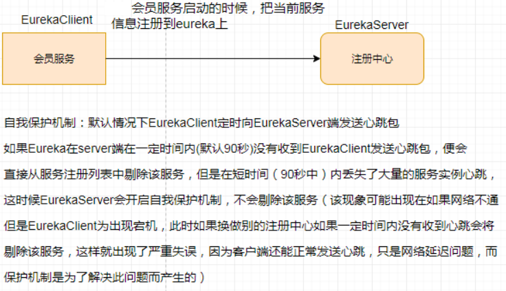
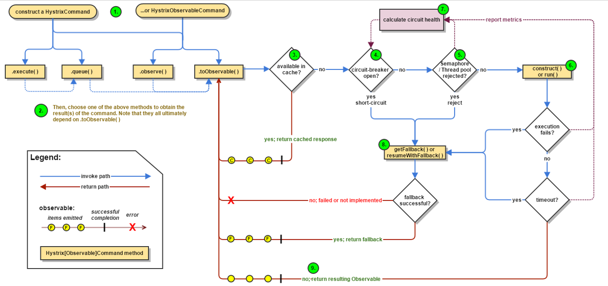
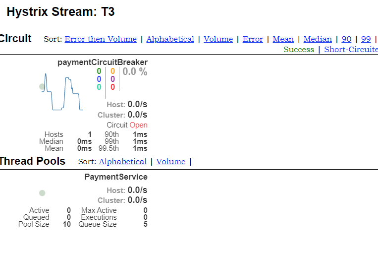
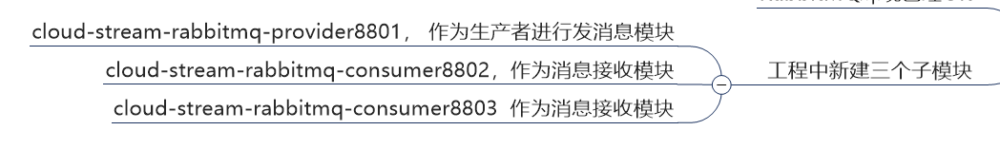

[TOC]


# 1.微服务架构理论入门

## 1.1 微服务架构概述

微服务架构是一种架构模式，它提倡将单一应用程序划分为一组小的服务，服务之间互相协调，互相配合，为用户提供最终价值，每个服务运行在其独立的进程中，服务与服务之间采用轻量级的通信机制互相协作。每个服务都围绕着具体业务进行构建，并且能够被独立的部署到生产环境，类生产环境等。另外，应当尽量避免统一的，集中式的服务管理机制，对具体的一个服务而言，应根据业务上下文，选择合适语言工具对其进行构建。


## 1.2 SpringCloud简介

+ 是什么？

  SpringCloud=分布式微服务架构的一站式解决方案，是多种微服务架构落地技术的集合体，俗称微服务全家桶。

+ 技术栈

  

  


+ 技术选型：https://start.spring.io/actuator/info

  


# 2.微服务架构编码构建

## 2.1 以 订单-支付模块微服务  为例


+ **微服务模块**
  + 建module
  + 改pom
  + 写yml
  + 主启动
  + 业务类

postman模拟post测试


## 2.2 使用Devtools进行热部署

```xml
<dependency>
    <groupId>org.springframework.boot</groupId>
    <artifactId>spring-boot-devtools</artifactId>
    <scope>runtime</scope>
    <optional>true</optional>
</dependency>
```


## 2.3 RestTemplate

RestTemplate提供了多种便捷访问远程Http服务的方法， 是一种简单便捷的访问restful服务模板类，是Spring提供的用于访问Rest服务的客户端模板工具集


## 2.4 工程重构

将重复代码抽取出来放在新建的commons模块里

clean install  在其他模块的pom文件里添加commons


# 3.Eureka服务注册与发现

## 3.1 Eureka基础知识：服务治理，注册，发现

+ Spring Cloud 封装了 Netflix 公司开发的 Eureka 模块来实现服务治理

```markdown
	在传统的rpc远程调用框架中，管理每个服务与服务之间依赖关系比较复杂，管理比较复杂，所以需要使用服务治理，管理服务于服务之间依赖关系，可以实现服务调用、负载均衡、容错等，实现服务发现与注册。
```


+ Eureka采用了CS的设计架构，Eureka Server 作为服务注册功能的服务器，它是服务注册中心。而系统中的其他微服务，使用 Eureka的客户端连接到 Eureka Server并维持心跳连接。这样系统的维护人员就可以通过 Eureka Server 来监控系统中各个微服务是否正常运行。
  在服务注册与发现中，有一个注册中心。当服务器启动的时候，会把当前自己服务器的信息 比如 服务地址通讯地址等以别名方式注册到注册中心上。另一方（消费者|服务提供者），以该别名的方式去注册中心上获取到实际的服务通讯地址，然后再实现本地RPC调用RPC远程调用框架核心设计思想：在于注册中心，因为使用注册中心管理每个服务与服务之间的一个依赖关系(服务治理概念)。在任何rpc远程框架中，都会有一个注册中心(存放服务地址相关信息(接口地址))

  


+ Eureka包含两个组件：Eureka Server和Eureka Client

  **Eureka Server提供服务注册服务**
  各个微服务节点通过配置启动后，会在EurekaServer中进行注册，这样EurekaServer中的服务注册表中将会存储所有可用服务节点的信息，服务节点的信息可以在界面中直观看到。

  **EurekaClient通过注册中心进行访问**
  是一个Java客户端，用于简化Eureka Server的交互，客户端同时也具备一个内置的、使用轮询(round-robin)负载算法的负载均衡器。在应用启动后，将会向Eureka Server发送心跳(默认周期为30秒)。如果Eureka Server在多个心跳周期内没有接收到某个节点的心跳，EurekaServer将会从服务注册表中把这个服务节点移除（默认90秒）


## 3.2 单机Eureka构建步骤

### 3.2.1 Eureka服务端安装

+ 构建模块cloud-eureka-server7001

+ 改pom.xml

  ```xml
  <dependencies>
      <!--eureka-server-->
      <dependency>
          <groupId>org.springframework.cloud</groupId>
          <artifactId>spring-cloud-starter-netflix-eureka-server</artifactId>
      </dependency>
      <!-- 引入自己定义的api通用包，可以使用Payment支付Entity -->
      <dependency>
          <groupId>com.kou.springcloud</groupId>
          <artifactId>cloud-api-commons</artifactId>
          <version>${project.version}</version>
      </dependency>
      <!--boot web actuator-->
      <dependency>
          <groupId>org.springframework.boot</groupId>
          <artifactId>spring-boot-starter-web</artifactId>
      </dependency>
      <dependency>
          <groupId>org.springframework.boot</groupId>
          <artifactId>spring-boot-starter-actuator</artifactId>
      </dependency>
      <!--一般通用配置-->
      <dependency>
          <groupId>org.springframework.boot</groupId>
          <artifactId>spring-boot-devtools</artifactId>
          <scope>runtime</scope>
          <optional>true</optional>
      </dependency>
      <dependency>
          <groupId>org.projectlombok</groupId>
          <artifactId>lombok</artifactId>
      </dependency>
      <dependency>
          <groupId>org.springframework.boot</groupId>
          <artifactId>spring-boot-starter-test</artifactId>
          <scope>test</scope>
      </dependency>
      <dependency>
          <groupId>junit</groupId>
          <artifactId>junit</artifactId>
      </dependency>
  </dependencies>
  ```

+ 写yml

  ```yaml
  server:
    port: 7001
  
  eureka:
    instance:
      #eureka服务端的实例名称
      hostname: localhost
    client:
      #false表示不向注册中心注册自己。
      register-with-eureka: false
      #false表示自己端就是注册中心，我的职责就是维护服务实例，并不需要去检索服务
      fetch-registry: false
      service-url:
        #设置与Eureka Server交互的地址查询服务和注册服务都需要依赖这个地址。
        defaultZone: http://${eureka.instance.hostname}:${server.port}/eureka/
  ```

+ 主启动

  ```java
  /**
   * @author KouChaoJie
   * @since: 2021/10/26 14:42
   */
  @SpringBootApplication
  @EnableEurekaServer
  public class EurekaMain7001
  {
      public static void main(String[] args)
      {
          SpringApplication.run(EurekaMain7001.class,args);
      }
  }
  ```

+ 测试访问

  http://localhost:7001/

  


### 3.2.2 将EurekaClient端payment8001注册进EurekaServer成为服务提供者

+ pom添加依赖

  ```xml
  <!--eureka-client-->
  <dependency>
      <groupId>org.springframework.cloud</groupId>
      <artifactId>spring-cloud-starter-netflix-eureka-client</artifactId>
  </dependency>
  ```

+ yml配置文件添加

  ```yaml
  eureka:
    client:
      #表示是否将自己注册进EurekaServer默认为true。
      register-with-eureka: true
      #是否从EurekaServer抓取已有的注册信息，默认为true。单节点无所谓，集群必须设置为true才能配合ribbon使用负载均衡
      fetchRegistry: true
      service-url:
        defaultZone: http://localhost:7001/eureka
  ```

+ 主启动类添加注解

  `@EnableEurekaClient`

+ 其他注意点

  yml配置里的服务名称

  就是Eureka里微服务注册名


### 3.2.3 EurekaClient端cloud-consumer-order80注册进EurekaServer成为服务消费者

同上


## 3.3 集群Eureka构建步骤

### 3.3.1Eureka集群原理说明


+ 问题：微服务RPC远程服务调用最核心的是什么 
  高可用，试想你的注册中心只有一个only one， 它出故障了那就呵呵(￣▽￣)"了，会导致整个为服务环境不可用，所以

　　解决办法：搭建Eureka注册中心集群 ，实现负载均衡+故障容错

**互相注册，相互守望**


### 3.3.2 EurekaServer集群环境构建步骤

参考7001构建7002模块


+ 修改映射配置

  

+ 修改yml配置文件

  + 7001

    ```yaml
    server:
      port: 7001
    
    
    eureka:
      instance:
        hostname: eureka7001.com #eureka服务端的实例名称
      client:
        register-with-eureka: false     #false表示不向注册中心注册自己。
        fetch-registry: false     #false表示自己端就是注册中心，我的职责就是维护服务实例，并不需要去检索服务
        service-url:
          defaultZone: http://eureka7002.com:7002/eureka/
    ```

    

  + 7002

    ```yaml
    server:
      port: 7002
    
    
    eureka:
      instance:
        hostname: eureka7002.com #eureka服务端的实例名称
      client:
        register-with-eureka: false     #false表示不向注册中心注册自己。
        fetch-registry: false     #false表示自己端就是注册中心，我的职责就是维护服务实例，并不需要去检索服务
        service-url:
          defaultZone: http://eureka7001.com:7001/eureka/
    ```

  

+ 订单支付两微服务注册进Eureka集群

  ```yaml
  # 集群版
  defaultZone: http://eureka7001.com:7001/eureka,http://eureka7002.com:7002/eureka
  ```


+ **支付服务模块8001集群环境构建**

  + 参考8001新建8002

  + pom,yml,业务类

  + 修改8001  8002的controller

    

    从配置文件读取端口号

  + Eureka中发生的变化

    

    同一个服务由两个微服务端口提供


+ ==**负载均衡**==

  

  订单服务访问地址不能写死
  + **==使用@LoadBalanced注解赋予RestTemplate负载均衡的能力==**

  + RestTemplate配置类中方法上添加注解

  + 再次从消费者端访问测试

    

    

    负载均衡效果达到，8001/8002端口交替出现

    Ribbon和Eureka整合后Consumer可以直接调用服务而不用再关心地址和端口号，且该服务还有负载功能了。


## 3.4 actuator微服务信息完善

+ 服务名称修改

  

  当前含有主机名称

+ 配置文件里添加

  

+ 修改之后

  


+ **访问信息有IP信息提示**

  + 更改yml配置

    


## 3.5 服务发现Discovery

对于注册进eureka里面的微服务，可以通过服务发现来获得该服务的信息

+ 主启动类注解

  

+ controller可以调用DiscoveryClient


## 3.6 Eureka自我保护

一句话：某时刻某一个微服务不可用了，Eureka不会立刻清理，依旧会对该微服务的信息进行保存。属于CAP里面的AP分支。

为什么会产生Eureka自我保护机制？
为了防止EurekaClient可以正常运行，但是 与 EurekaServer网络不通情况下，EurekaServer不会立刻将EurekaClient服务剔除。

如果在Eureka Server的首页看到以下这段提示，则说明Eureka进入了保护模式：




**在自我保护模式中，Eureka Server会保护服务注册表中的信息，不再注销任何服务实例。**
它的设计哲学就是宁可保留错误的服务注册信息，也不盲目注销任何可能健康的服务实例。一句话讲解：好死不如赖活着

综上，自我保护模式是一种应对网络异常的安全保护措施。它的架构哲学是宁可同时保留所有微服务（健康的微服务和不健康的微服务都会保留）也不盲目注销任何健康的微服务。使用自我保护模式，可以让Eureka集群更加的健壮、稳定。


+ 关闭自我保护机制

  


## Eureka已停更


# 4.Zookeeper服务注册与发现


# 5.Consul服务注册与发现

Consul 是一套开源的分布式服务发现和配置管理系统，由 HashiCorp 公司用 Go 语言开发。

提供了微服务系统中的服务治理、配置中心、控制总线等功能。这些功能中的每一个都可以根据需要单独使用，也可以一起使用以构建全方位的服务网格，总之Consul提供了一种完整的服务网格解决方案。

它具有很多优点。包括： 基于 raft 协议，比较简洁； 支持健康检查, 同时支持 HTTP 和 DNS 协议 支持跨数据中心的 WAN 集群 提供图形界面 跨平台，支持 Linux、Mac、Windows。

https://www.consul.io/downloads.html

支持服务发现，健康检测，KV存储，多数据中心，可视化Web界面

consul agent -dev

通过以下地址可以访问Consul的首页：http://localhost:8500


## 5.1 服务提供者

cloud-providerconsul-payment8006


## 5.2 服务消费者

cloud-consumerconsul-order80


## 5.3 三个注册中心异同


AP架构
当网络分区出现后，为了保证可用性，系统B可以返回旧值，保证系统的可用性。
结论：违背了一致性C的要求，只满足可用性和分区容错，即AP


CP架构
当网络分区出现后，为了保证一致性，就必须拒接请求，否则无法保证一致性
结论：违背了可用性A的要求，只满足一致性和分区容错，即CP


# 6.Ribbon负载均衡服务调用

Spring Cloud Ribbon是基于Netflix Ribbon实现的一套客户端       负载均衡的工具。

简单的说，Ribbon是Netflix发布的开源项目，主要功能是提供客户端的软件负载均衡算法和服务调用。Ribbon客户端组件提供一系列完善的配置项如连接超时，重试等。简单的说，就是在配置文件中列出Load Balancer（简称LB）后面所有的机器，Ribbon会自动的帮助你基于某种规则（如简单轮询，随机连接等）去连接这些机器。我们很容易使用Ribbon实现自定义的负载均衡算法。

https://github.com/Netflix/ribbon/wiki/Getting-Started

+ LB负载均衡(Load Balance)是什么
  简单的说就是将用户的请求平摊的分配到多个服务上，从而达到系统的HA（高可用）。
  常见的负载均衡有软件Nginx，LVS，硬件 F5等。
+ Ribbon本地负载均衡客户端 VS Nginx服务端负载均衡区别

  + Nginx是服务器负载均衡，客户端所有请求都会交给nginx，然后由nginx实现转发请求。即负载均衡是由服务端实现的。 

  + Ribbon本地负载均衡，在调用微服务接口时候，会在注册中心上获取注册信息服务列表之后缓存到JVM本地，从而在本地实现RPC远程服务调用技术。
  + 负载均衡+RestTemplate调用


## 6.1 Ribbon负载均衡演示

+ 架构说明


Ribbon在工作时分成两步
第一步先选择 EurekaServer ,它优先选择在同一个区域内负载较少的server.
第二步再根据用户指定的策略，在从server取到的服务注册列表中选择一个地址。
其中Ribbon提供了多种策略：比如轮询、随机和根据响应时间加权。

总结：Ribbon其实就是一个软负载均衡的客户端组件，
他可以和其他所需请求的客户端结合使用，和eureka结合只是其中的一个实例。

spring-cloud-starter-netflix-eureka-client自带了spring-cloud-starter-ribbon引用，


+ RestTemplate调用

  forobject返回对象为响应体中数据转化成的对象，基本上可以理解为Json

  getForEntity返回对象为ResponseEntity对象，包含了响应中的一些重要信息，比如响应头、响应状态码、响应体等


## 6.2 核心组件IRule

+ IRule：根据特定算法中从服务列表中选取一个要访问的服务

  

  

+ 替换规则算法

  修改消费者

  ==注意此配置不能放到@ComponentScan扫描的包下==

  

  启动类加注解`@RibbonClient(name = "CLOUD-PAYMENT-SERVICE", configuration = MySelfRule.class)`


## 6.3 Ribbon负载均衡算法

公式：

==负载均衡算法：rest接口第几次请求数 % 服务器集群总数量 = 实际调用服务器位置下标== ，每次服务重启动后rest接口计数从1开始。

`List<ServiceInstance> instances = discoveryClient.getInstances("CLOUD-PAYMENT-SERVICE");`

如：   List [0] instances = 127.0.0.1:8002
　　　List [1] instances = 127.0.0.1:8001

8001+ 8002 组合成为集群，它们共计2台机器，集群总数为2， 按照轮询算法原理：

当总请求数为1时： 1 % 2 =1 对应下标位置为1 ，则获得服务地址为127.0.0.1:8001
当总请求数位2时： 2 % 2 =0 对应下标位置为0 ，则获得服务地址为127.0.0.1:8002
当总请求数位3时： 3 % 2 =1 对应下标位置为1 ，则获得服务地址为127.0.0.1:8001
当总请求数位4时： 4 % 2 =0 对应下标位置为0 ，则获得服务地址为127.0.0.1:8002
如此类推......


# 7.OpenFeign服务接口调用

https://cloud.spring.io/spring-cloud-static/Hoxton.SR1/reference/htmlsingle/#spring-cloud-openfeign

Feign是一个声明式WebService客户端。使用Feign能让编写Web Service客户端更加简单。
它的使用方法是定义一个服务接口然后在上面添加注解。

Feign也支持可拔插式的编码器和解码器。Spring Cloud对Feign进行了封装，使其支持了Spring MVC标准注解和HttpMessageConverters。Feign可以与Eureka和Ribbon组合使用以支持负载均衡。

+ Feign能干什么
  Feign旨在使编写Java Http客户端变得更容易。
  前面在使用Ribbon+RestTemplate时，利用RestTemplate对http请求的封装处理，形成了一套模版化的调用方法。但是在实际开发中，由于对服务依赖的调用可能不止一处，往往一个接口会被多处调用，所以通常都会针对每个微服务自行封装一些客户端类来包装这些依赖服务的调用。所以，Feign在此基础上做了进一步封装，由他来帮助我们定义和实现依赖服务接口的定义。在Feign的实现下，我们只需创建一个接口并使用注解的方式来配置它(以前是Dao接口上面标注Mapper注解,现在是一个微服务接口上面标注一个Feign注解即可)，即可完成对服务提供方的接口绑定，简化了使用Spring cloud Ribbon时，自动封装服务调用客户端的开发量。

+ Feign集成了Ribbon
  利用Ribbon维护了Payment的服务列表信息，并且通过轮询实现了客户端的负载均衡。而与Ribbon不同的是，通过feign只需要定义服务绑定接口且以声明式的方法，优雅而简单的实现了服务调用


## 7.1 OpenFeign服务调用

+ 接口+注解：微服务调用接口+`@FeignClient`

+ 新建cloud-consumer-feign-order80模块

  Feign是在消费端使用的


+ 启动集群进行测试

  Feign自带负载均衡配置项

+ 


## 7.2 OpenFeign超时控制

**OpenFeign客户端默认等待1秒钟，超过后报错** 

  默认Feign客户端只等待一秒钟，但是服务端处理需要超过1秒钟，导致Feign客户端不想等待了，直接返回报错。
为了避免这样的情况，有时候我们需要设置Feign客户端的超时控制。

yml文件中开启配置。


## 7.3 OpenFeign日志打印功能

Feign 提供了日志打印功能，我们可以通过配置来调整日志级别，从而了解 Feign 中 Http 请求的细节。
**说白了就是对Feign接口的调用情况进行监控和输出**

NONE：默认的，不显示任何日志；

BASIC：仅记录请求方法、URL、响应状态码及执行时间；

HEADERS：除了 BASIC 中定义的信息之外，还有请求和响应的头信息；

FULL：除了 HEADERS 中定义的信息之外，还有请求和响应的正文及元数据。


+ 配置日志Bean

  

+ yml配置

  


# 8.Hystrix断路器

## 8.1 概述

+ 分布式系统面临的问题

  分布式系统面临的问题
  复杂分布式体系结构中的应用程序有数十个依赖关系，每个依赖关系在某些时候将不可避免地失败。

  

Hystrix是一个用于处理分布式系统的延迟和容错的开源库，在分布式系统里，许多依赖不可避免的会调用失败，比如超时、异常等，Hystrix能够保证在一个依赖出问题的情况下，**不会导致整体服务失败，避免级联故障，以提高分布式系统的弹性。**

“断路器”本身是一种开关装置，当某个服务单元发生故障之后，通过断路器的故障监控（类似熔断保险丝），向调用方**返回一个符合预期的、可处理的备选响应（FallBack**），**而不是长时间的等待或者抛出调用方无法处理的异常，这样就保证了服务调用方的线程不会被长时间、不必要地占用**，从而避免了故障在分布式系统中的蔓延，乃至雪崩。


**Hystrix已停更**

https://github.com/Netflix/Hystrix/wiki/How-To-Use

https://github.com/Netflix/Hystrix


## 8.2 Hystrix重要概念

### 8.2.1 服务降级

==fallback==

服务器忙，请稍后再试，不让客户端等待并立刻返回一个友好提示，fallback

+ 哪些情况会出现降级？

  + 程序运行异常
  + 超时
  + 服务熔断触发服务降级
  + 线程池/信号量打满也会导致服务降级

  

### 8.2.2 服务熔断

类比**保险丝**达到最大服务访问后，直接拒绝访问，拉闸限电，然后调用服务降级的方法并返回友好提示。

服务的降级-->进而熔断-->恢复调用链路

### 8.2.3 服务限流

秒杀高并发等操作，严禁一窝蜂的过来拥挤，大家排队，一秒钟N个，有序进行。


## 8.3 Hystrix案例

+ 构建

  构建**cloud-provider-hystrix-payment8001**

  依赖引入

```xml
<!--hystrix-->
<dependency>
    <groupId>org.springframework.cloud</groupId>
    <artifactId>spring-cloud-starter-netflix-hystrix</artifactId>
</dependency>
```

+ 访问测试
+ 以上述为根基平台，从正确->错误->降级熔断->恢复


### 8.3.1 高并发测试

使用Jmeter进行压力测试


20000个并发

发现两个请求都在转圈圈

+ 为什么会被卡死？

  tomcat的默认的工作线程数被打满 了，没有多余的线程来分解压力和处理。 

上面还是服务提供者8001自己测试，假如此时外部的消费者80也来访问，那消费者只能干等，最终导致消费端80不满意，服务端8001直接被拖死。


+ 消费者端80加入

  消费端80微服务再去访问正常的Ok微服务8001地址

  要么转圈圈等待

  要么消费端报超时错误

+ 原因

  + 8001同一层次的其它接口服务被困死，因为tomcat线程池里面的工作线程已经被挤占完毕
  + 80此时调用8001，客户端访问响应缓慢，转圈圈

+ 正因为有上述故障或不佳表现，才有我们的降级/容错/限流等技术诞生

+ 解决要求

  


### 8.3.2 服务降级

+ **服务端降级配置**

  `@HystrixCommand`

+ 8001先从自身找问题

  设置自身调用超时时间的峰值，峰值内可以正常运行，
  超过了需要有兜底的方法处理，作服务降级fallback

+ 

  一旦调用服务方法失败并抛出了错误信息后，会自动调用@HystrixCommand标注好的，fallbackMethod调用类中的指定方法

  

  响应3秒内为正常

  启动类加上`@EnableCircuitBreaker`

+ 测试

  


+ **客户端服务降级**

  80订单微服务，也可以更好的保护自己，自己也依样画葫芦进行客户端降级保护

  热部署方式对java代码的改动明显，
  **但对@HystrixCommand内属性的修改建议重启微服务**

+ yml配置

  

+ 启动类加注解

  `@EnableHystrix`

+ 业务类

  


+ **目前的问题**

  每个业务方法对应一个兜底的方法，代码膨胀

  统一和自定义的分开


+ **全局服务降级**

  @DefaultProperties(defaultFallback = "")

    1：1 每个方法配置一个服务降级方法，技术上可以，实际上傻X

    1：N 除了个别重要核心业务有专属，其它普通的可以通过@DefaultProperties(defaultFallback = "")  统一跳转到统一处理结果页面

    通用的和独享的各自分开，避免了代码膨胀，合理减少了代码量

  + 业务类注解`@DefaultProperties(defaultFallback = "paymentGlobalFallbackMethod")`

  + 


+ **通配服务降级FeignFallBack**

  此接口的服务调用服务降级由这个类包圆

  

  

  + 8001宕机测试

    


### 8.3.3 服务熔断

先拉闸，后返回提示

+ 熔断机制概述
  熔断机制是应对雪崩效应的一种微服务链路保护机制。当扇出链路的某个微服务出错不可用或者响应时间太长时，
  会进行服务的降级，进而熔断该节点微服务的调用，快速返回错误的响应信息。
  当检测到该节点微服务调用响应正常后，恢复调用链路。

+ 在Spring Cloud框架里，熔断机制通过Hystrix实现。Hystrix会监控微服务间调用的状况，
  当失败的调用到一定阈值，缺省是5秒内20次调用失败，就会启动熔断机制。熔断机制的注解是`@HystrixCommand`。


```java
//======服务熔断
@HystrixCommand(fallbackMethod = "paymentCircuitBreaker_fallback",commandProperties = {
        //是否开启断路器
        @HystrixProperty(name = "circuitBreaker.enabled",value = "true"),
        //请求次数
        @HystrixProperty(name = "circuitBreaker.requestVolumeThreshold",value = "10"),
        //时间窗口期
        @HystrixProperty(name = "circuitBreaker.sleepWindowInMilliseconds",value = "10000"),
        //失败率跳闸
        @HystrixProperty(name = "circuitBreaker.errorThresholdPercentage",value = "60"),
})
public String paymentCircuitBreaker(@PathVariable("id") Integer id)
{
    if(id < 0)
    {
        throw new RuntimeException("******id 不能负数");
    }
    String serialNumber = IdUtil.simpleUUID();
    return Thread.currentThread().getName()+"\t"+"调用成功，流水号: " + serialNumber;
}
public String paymentCircuitBreaker_fallback(@PathVariable("id") Integer id)
{
    return "id 不能负数，请稍后再试，/(ㄒoㄒ)/~~   id: " +id;
}
```

+ 测试

  多次错误，就算是正确的访问地址也不能进行，再次输入正确值，多次确认正确后恢复正常

  服务的降级-->进而熔断-->恢复调用链路


+ **熔断总结**

  

  

  

  

  

  涉及到断路器的三个重要参数：快照时间窗、请求总数阀值、错误百分比阀值。
  1：快照时间窗：断路器确定是否打开需要统计一些请求和错误数据，而统计的时间范围就是快照时间窗，默认为最近的10秒。

  2：请求总数阀值：在快照时间窗内，必须满足请求总数阀值才有资格熔断。默认为20，意味着在10秒内，如果该hystrix命令的调用次数不足20次，即使所有的请求都超时或其他原因失败，断路器都不会打开。


**断路器打开后**

1：再有请求调用的时候，将不会调用主逻辑，而是直接调用降级fallback。通过断路器，实现了自动地发现错误并将降级逻辑切换为主逻辑，减少响应延迟的效果。

2：原来的主逻辑要如何恢复呢？
对于这一问题，hystrix也为我们实现了自动恢复功能。
当断路器打开，对主逻辑进行熔断之后，hystrix会启动一个休眠时间窗，在这个时间窗内，降级逻辑是临时的成为主逻辑，
当休眠时间窗到期，断路器将进入半开状态，释放一次请求到原来的主逻辑上，如果此次请求正常返回，那么断路器将继续闭合，
主逻辑恢复，如果这次请求依然有问题，断路器继续进入打开状态，休眠时间窗重新计时。

```java
//========================All
@HystrixCommand(fallbackMethod = "str_fallbackMethod",
        groupKey = "strGroupCommand",
        commandKey = "strCommand",
        threadPoolKey = "strThreadPool",

        commandProperties = {
                // 设置隔离策略，THREAD 表示线程池 SEMAPHORE：信号池隔离
                @HystrixProperty(name = "execution.isolation.strategy", value = "THREAD"),
                // 当隔离策略选择信号池隔离的时候，用来设置信号池的大小（最大并发数）
                @HystrixProperty(name = "execution.isolation.semaphore.maxConcurrentRequests", value = "10"),
                // 配置命令执行的超时时间
                @HystrixProperty(name = "execution.isolation.thread.timeoutinMilliseconds", value = "10"),
                // 是否启用超时时间
                @HystrixProperty(name = "execution.timeout.enabled", value = "true"),
                // 执行超时的时候是否中断
                @HystrixProperty(name = "execution.isolation.thread.interruptOnTimeout", value = "true"),
                // 执行被取消的时候是否中断
                @HystrixProperty(name = "execution.isolation.thread.interruptOnCancel", value = "true"),
                // 允许回调方法执行的最大并发数
                @HystrixProperty(name = "fallback.isolation.semaphore.maxConcurrentRequests", value = "10"),
                // 服务降级是否启用，是否执行回调函数
                @HystrixProperty(name = "fallback.enabled", value = "true"),
                // 是否启用断路器
                @HystrixProperty(name = "circuitBreaker.enabled", value = "true"),
                // 该属性用来设置在滚动时间窗中，断路器熔断的最小请求数。例如，默认该值为 20 的时候，
                // 如果滚动时间窗（默认10秒）内仅收到了19个请求， 即使这19个请求都失败了，断路器也不会打开。
                @HystrixProperty(name = "circuitBreaker.requestVolumeThreshold", value = "20"),
                // 该属性用来设置在滚动时间窗中，表示在滚动时间窗中，在请求数量超过
                // circuitBreaker.requestVolumeThreshold 的情况下，如果错误请求数的百分比超过50,
                // 就把断路器设置为 "打开" 状态，否则就设置为 "关闭" 状态。
                @HystrixProperty(name = "circuitBreaker.errorThresholdPercentage", value = "50"),
                // 该属性用来设置当断路器打开之后的休眠时间窗。 休眠时间窗结束之后，
                // 会将断路器置为 "半开" 状态，尝试熔断的请求命令，如果依然失败就将断路器继续设置为 "打开" 状态，
                // 如果成功就设置为 "关闭" 状态。
                @HystrixProperty(name = "circuitBreaker.sleepWindowinMilliseconds", value = "5000"),
                // 断路器强制打开
                @HystrixProperty(name = "circuitBreaker.forceOpen", value = "false"),
                // 断路器强制关闭
                @HystrixProperty(name = "circuitBreaker.forceClosed", value = "false"),
                // 滚动时间窗设置，该时间用于断路器判断健康度时需要收集信息的持续时间
                @HystrixProperty(name = "metrics.rollingStats.timeinMilliseconds", value = "10000"),
                // 该属性用来设置滚动时间窗统计指标信息时划分"桶"的数量，断路器在收集指标信息的时候会根据
                // 设置的时间窗长度拆分成多个 "桶" 来累计各度量值，每个"桶"记录了一段时间内的采集指标。
                // 比如 10 秒内拆分成 10 个"桶"收集这样，所以 timeinMilliseconds 必须能被 numBuckets 整除。否则会抛异常
                @HystrixProperty(name = "metrics.rollingStats.numBuckets", value = "10"),
                // 该属性用来设置对命令执行的延迟是否使用百分位数来跟踪和计算。如果设置为 false, 那么所有的概要统计都将返回 -1。
                @HystrixProperty(name = "metrics.rollingPercentile.enabled", value = "false"),
                // 该属性用来设置百分位统计的滚动窗口的持续时间，单位为毫秒。
                @HystrixProperty(name = "metrics.rollingPercentile.timeInMilliseconds", value = "60000"),
                // 该属性用来设置百分位统计滚动窗口中使用 “ 桶 ”的数量。
                @HystrixProperty(name = "metrics.rollingPercentile.numBuckets", value = "60000"),
                // 该属性用来设置在执行过程中每个 “桶” 中保留的最大执行次数。如果在滚动时间窗内发生超过该设定值的执行次数，
                // 就从最初的位置开始重写。例如，将该值设置为100, 滚动窗口为10秒，若在10秒内一个 “桶 ”中发生了500次执行，
                // 那么该 “桶” 中只保留 最后的100次执行的统计。另外，增加该值的大小将会增加内存量的消耗，并增加排序百分位数所需的计算时间。
                @HystrixProperty(name = "metrics.rollingPercentile.bucketSize", value = "100"),
                // 该属性用来设置采集影响断路器状态的健康快照（请求的成功、 错误百分比）的间隔等待时间。
                @HystrixProperty(name = "metrics.healthSnapshot.intervalinMilliseconds", value = "500"),
                // 是否开启请求缓存
                @HystrixProperty(name = "requestCache.enabled", value = "true"),
                // HystrixCommand的执行和事件是否打印日志到 HystrixRequestLog 中
                @HystrixProperty(name = "requestLog.enabled", value = "true"),
        },
        threadPoolProperties = {
                // 该参数用来设置执行命令线程池的核心线程数，该值也就是命令执行的最大并发量
                @HystrixProperty(name = "coreSize", value = "10"),
                // 该参数用来设置线程池的最大队列大小。当设置为 -1 时，线程池将使用 SynchronousQueue 实现的队列，
                // 否则将使用 LinkedBlockingQueue 实现的队列。
                @HystrixProperty(name = "maxQueueSize", value = "-1"),
                // 该参数用来为队列设置拒绝阈值。 通过该参数， 即使队列没有达到最大值也能拒绝请求。
                // 该参数主要是对 LinkedBlockingQueue 队列的补充,因为 LinkedBlockingQueue
                // 队列不能动态修改它的对象大小，而通过该属性就可以调整拒绝请求的队列大小了。
                @HystrixProperty(name = "queueSizeRejectionThreshold", value = "5"),
        }
)
public String strConsumer() {
    return "hello 2020";
}
public String str_fallbackMethod()
{
    return "*****fall back str_fallbackMethod";
}

```


### 8.3.4 服务限流

后面高级篇讲解alibaba的Sentinel说明


### 8.3.5 Hystrix工作流程

https://github.com/Netflix/Hystrix/wiki/How-it-Works




tips：如果我们没有为命令实现降级逻辑或者在降级处理逻辑中抛出了异常， Hystrix 依然会返回一个 Observable 对象， 但是它不会发射任何结果数据， 而是通过 onError 方法通知命令立即中断请求，并通过onError()方法将引起命令失败的异常发送给调用者。


## 8.4 服务监控HystrixDashboard

​	除了隔离依赖服务的调用以外，Hystrix还提供了**准实时的调用监控**（Hystrix Dashboard），Hystrix会持续地记录所有通过Hystrix发起的请求的执行信息，并以统计报表和图形的形式展示给用户，包括每秒执行多少请求多少成功，多少失败等。Netflix通过hystrix-metrics-event-stream项目实现了对以上指标的监控。Spring Cloud也提供了Hystrix Dashboard的整合，对监控内容转化成可视化界面。

```xml
<dependency>
    <groupId>org.springframework.cloud</groupId>
    <artifactId>spring-cloud-starter-netflix-hystrix-dashboard</artifactId>
</dependency>
<dependency>
    <groupId>org.springframework.boot</groupId>
    <artifactId>spring-boot-starter-actuator</artifactId>
</dependency>
```

**新建cloud-consumer-hystrix-dashboard9001**

主启动类添加注解`@@EnableHystrixDashboard`

访问http://localhost:9001/hystrix 图形化监控界面


+ 被监控服务启动类添加配置

  ```java
  /**
   * 此配置是为了服务监控而配置，与服务容错本身无关，springcloud升级后的坑
   * ServletRegistrationBean因为springboot的默认路径不是"/hystrix.stream"，
   * 只要在自己的项目里配置上下面的servlet就可以了
   */
  @Bean
  public ServletRegistrationBean getServlet() {
      HystrixMetricsStreamServlet streamServlet = new HystrixMetricsStreamServlet();
      ServletRegistrationBean registrationBean = new ServletRegistrationBean(streamServlet);
      registrationBean.setLoadOnStartup(1);
      registrationBean.addUrlMappings("/hystrix.stream");
      registrationBean.setName("HystrixMetricsStreamServlet");
      return registrationBean;
  }
  ```

+ 填写监控地址

  http://localhost:8001/hystrix.stream

  

  先访问正确地址，再访问错误地址，再正确地址，会发现图示断路器都是慢慢放开的。

  


# 9.zuul路由网关


# 10.Gateway新一代网关

**SpringCloudAlibaba**

https://cloud.spring.io/spring-cloud-static/spring-cloud-gateway/2.2.1.RELEASE/reference/html/


## 10.1 概述简介

+ 是什么？

  Cloud全家桶中有个很重要的组件就是网关，在1.x版本中都是采用的Zuul网关；
  但在2.x版本中，zuul的升级一直跳票，SpringCloud最后自己研发了一个网关替代Zuul，
  那就是SpringCloud Gateway一句话：gateway是原zuul1.x版的替代

  

  Gateway是在Spring生态系统之上构建的API网关服务，基于Spring 5，Spring Boot 2和 Project Reactor等技术。
  Gateway旨在提供一种简单而有效的方式来对API进行路由，以及提供一些强大的过滤器功能， 例如：熔断、限流、重试等

  使用的Webflux中的reactor-netty响应式编程组件，底层使用了Netty通讯框架。

  

  + 微服务架构中网关在哪？

    

  Spring Cloud Gateway 具有如下特性：

  + 基于Spring Framework 5, Project Reactor 和 Spring Boot 2.0 进行构建；
    动态路由：能够匹配任何请求属性；
    可以对路由指定 Predicate（断言）和 Filter（过滤器）；
    集成Hystrix的断路器功能；
    集成 Spring Cloud 服务发现功能；
    易于编写的 Predicate（断言）和 Filter（过滤器）；
    请求限流功能；
    支持路径重写


## 10.2 三大核心概念

Gateway是基于==异步非阻塞模型==开发的。

+ **路由**

  路由是构建网关的基本模块，它由ID，目标URI，一系列的断言和过滤器组成，如果断言为true则匹配该路由

+ **断言**

  开发人员可以匹配HTTP请求中的所有内容(例如请求头或请求参数)，如果请求与断言相匹配则进行路由

+ **filter**

  指的是Spring框架中GatewayFilter的实例，使用过滤器，可以在请求被路由前或者之后对请求进行修改。

+ web请求，通过一些匹配条件，定位到真正的服务节点。并在这个转发过程的前后，进行一些精细化控制。
  predicate就是我们的匹配条件；
  而filter，就可以理解为一个无所不能的拦截器。有了这两个元素，再加上目标uri，就可以实现一个具体的路由了


**工作流程**

客户端向 Spring Cloud Gateway 发出请求。然后在 Gateway Handler Mapping 中找到与请求相匹配的路由，将其发送到 Gateway Web Handler。

Handler 再通过指定的过滤器链来将请求发送到我们实际的服务执行业务逻辑，然后返回。
过滤器之间用虚线分开是因为过滤器可能会在发送代理请求之前（“pre”）或之后（“post”）执行业务逻辑。

Filter在“pre”类型的过滤器可以做参数校验、权限校验、流量监控、日志输出、协议转换等，
在“post”类型的过滤器中可以做响应内容、响应头的修改，日志的输出，流量监控等有着非常重要的作用。


+ **核心逻辑**

  ==路由转发+执行过滤器链==


## 10.3 入门配置

**cloud-gateway-gateway9527**

```xml
<!--gateway-->
<dependency>
    <groupId>org.springframework.cloud</groupId>
    <artifactId>spring-cloud-starter-gateway</artifactId>
</dependency>
```


+ **网关如何做路由映射**

  访问cloud-provider-payment8001

  目前不想暴露8001端口，希望在8001外面套一层9527

  **==gateway网关不要引入webjar包==**

  + YML配置新增网关配置

    

+ 测试

  

  http://localhost:9527/payment/get/31


+ **网关路由配置的两种方式**

  + 在yml中配置，见上

  + 代码中注入RouteLocator的Bean

    ```java
    @Configuration
    public class GatewayConfig {
        @Bean
        public RouteLocator customRouteLocator(RouteLocatorBuilder routeLocatorBuilder) {
            RouteLocatorBuilder.Builder routes = routeLocatorBuilder.routes();
            //http://news.baidu.com/guonei
            routes.route("path_route_kou",
                    r -> r.path(
                    "/guonei").uri("http://news.baidu.com/guonei")
            ).build();
            return routes.build();
        }
    }
    ```


## 10.4 通过微服务名实现动态路由

默认情况下Gateway会根据注册中心注册的服务列表，以注册中心上微服务名为路径创建动态路由进行转发，从而实现动态路由的功能。


**需要注意的是uri的协议为lb，表示启用Gateway的负载均衡功能。**

**lb://serviceName是spring cloud gateway在微服务中自动为我们创建的负载均衡uri**


## 10.5 Predicate的使用


https://www.bilibili.com/video/BV18E411x7eT?p=72&spm_id_from=pageDriver

说白了，Predicate就是为了实现一组匹配规则，让请求过来找到对应的Route进行处理。


## 10.6 Filter的使用

路由过滤器可用于修改进入的HTTP请求和返回的HTTP响应，路由过滤器只能指定路由进行使用。

Spring Cloud Gateway 内置了多种路由过滤器，他们都由GatewayFilter的工厂类来产生。


https://cloud.spring.io/spring-cloud-static/spring-cloud-gateway/2.2.1.RELEASE/reference/html/#the-addrequestparameter-gatewayfilter-factory


+ **自定义过滤器**

  自定义全局GlobalFilter

  **implements GlobalFilter,Ordered**

  ```java
  @Component
  @Slf4j
  public class MyLogGateWayFilter implements GlobalFilter, Ordered {
      @Override
      public Mono<Void> filter(ServerWebExchange exchange, GatewayFilterChain chain) {
          log.info("************come in MyLogGateWayFilter:" + new Date());
          String uname = exchange.getRequest().getQueryParams().getFirst("uname");
          if (uname == null) {
              log.info("***********用户名为null,非法用户");
              exchange.getResponse().setStatusCode(HttpStatus.NOT_ACCEPTABLE);
              return exchange.getResponse().setComplete();
          }
          return chain.filter(exchange);
      }
      @Override
      public int getOrder() {
          //过滤器优先级
          return 0;
      }
  }
  ```

  


# 11.SpringCloud Config分布式配置中心

## 11.1概述

微服务意味着要将单体应用中的业务拆分成一个个子服务，每个服务的粒度相对较小，因此系统中会出现大量的服务。**由于每个服务都需要必要的配置信息才能运行，所以一套集中式的、动态的配置管理设施是必不可少的。**

SpringCloud提供了ConfigServer来解决这个问题，我们每一个微服务自己带着一个application.yml，上百个配置文件的管理......


是什么？

SpringCloud Config为微服务架构中的微服务提供集中化的外部配置支持，配置服务器为各个不同微服务应用的所有环境提供了一个中心化的外部配置。


怎么玩？

SpringCloud Config分为**服务端和客户端**两部分。

服务端也称为分布式配置中心，它是一个独立的微服务应用，用来连接配置服务器并为客户端提供获取配置信息，加密/解密信息等访问接口

客户端则是通过指定的配置中心来管理应用资源，以及与业务相关的配置内容，并在启动的时候从配置中心获取和加载配置信息配置服务器默认采用git来存储配置信息，这样就有助于对环境配置进行版本管理，并且可以通过git客户端工具来方便的管理和访问配置内容。


https://cloud.spring.io/spring-cloud-static/spring-cloud-config/2.2.1.RELEASE/reference/html/


## 11.2Config服务端配置与测试

### 11.2.1 整合GitHub


### 11.2.2 服务端配置

**cloud-config-center-3344**

```xml
<dependency>
    <groupId>org.springframework.cloud</groupId>
    <artifactId>spring-cloud-config-server</artifactId>
</dependency>
```

+ 主启动注解`@EnableConfigServer`

+ YML

  ```yaml
  server:
    port: 3344
  
  spring:
    application:
      name:  cloud-config-center #注册进Eureka服务器的微服务名
    cloud:
      config:
        server:
          git:
            uri: https://github.com/Kou1688/springcloud-config.git #GitHub上面的git仓库名字
            ####搜索目录
            search-paths:
              - springcloud-config
        ####读取分支
        label: master
  
  #服务注册到eureka地址
  eureka:
    client:
      service-url:
        defaultZone: http://localhost:7001/eureka
  ```

+ 在hosts文件下增加映射`127.0.0.1  config-3344.com`
+ 


### 11.3 客户端的配置

**cloud-config-client-3355**

```xml
<dependency>
    <groupId>org.springframework.cloud</groupId>
    <artifactId>spring-cloud-config</artifactId>
</dependency>
```


+ **bootstrap.yml**

  applicaiton.yml是用户级的资源配置项
  bootstrap.yml是系统级的，优先级更加高

```YML
server:
  port: 3355

spring:
  application:
    name: config-client
  cloud:
    #Config客户端配置
    config:
      label: master #分支名称
      name: config #配置文件名称
      profile: dev #读取后缀名称   上述3个综合：master分支上config-dev.yml的配置文件被读取http://config-3344.com:3344/master/config-dev.yml
      uri: http://localhost:3344 #配置中心地址k

#服务注册到eureka地址
eureka:
  client:
    service-url:
      defaultZone: http://localhost:7001/eureka
```


+ **分布式配置的动态刷新问题**

  


## 11.4 Config客户端之动态刷新

**手动版动态刷新：**

+ POM引入actuator监控
+ 修改YML，暴露监控端口
+ @RefreshScope业务类Controller修改
+ 需要运维人员发送Post请求刷新3355
  + curl -X POST "http://localhost:3355/actuator/refresh"
+ http://localhost:3355/configInfo   成功自动刷新，避免了服务重启


# 12.SpringCloud Bus消息总线

## 12.1 概述

上一章的加深和理解

分布式自动刷新配置功能，Spring Cloud Bus配合Spring Cloud Config使用可以实现配置的动态刷新

Spring Cloud Bus 配合 Spring Cloud Config 使用可以实现配置的动态刷新。


Spring Cloud Bus是用来将分布式系统的节点与轻量级消息系统链接起来的框架，
它整合了Java的事件处理机制和消息中间件的功能。
Spring Cloud Bus目前支持RabbitMQ和Kafka。

+ 能干吗？

  Spring Cloud Bus能管理和传播分布式系统间的消息，就像一个分布式执行器，可用于广播状态更改、事件推送等，也可以当作微服务间的通信通道。

  

+ 什么是总线？

  在微服务架构的系统中，通常会使用**轻量级的消息代理**来构建一个**共用的消息主题**，并让系统中所有微服务实例都连接上来。由于**该主题中产生的消息会被所有实例监听和消费，所以称它为消息总线**。在总线上的各个实例，都可以方便地广播一些需要让其他连接在该主题上的实例都知道的消息。

+ 基本原理

  ConfigClient实例都监听MQ中同一个topic(默认是springCloudBus)。当一个服务刷新数据的时候，它会把这个信息放入到Topic中，这样其它监听同一Topic的服务就能得到通知，然后去更新自身的配置。


## 12.2 RabbitMQ环境配置

略


## 12.3 SpringCloud Bus动态刷新全局广播

首先需要RabbitMQ


新建**cloud-config-client-3366**

pom，yml，主启动，业务类


+ 设计思想

  利用消息总线触发一个服务端ConfigServer的/bus/refresh端点，而刷新所有客户端的配置

  


+ 给cloud-config-center-3344配置中心**服务端**添加消息总线支持

  ```xml
  <!--添加消息总线RabbitMQ支持-->
  <dependency>
      <groupId>org.springframework.cloud</groupId>
      <artifactId>spring-cloud-starter-bus-amqp</artifactId>
  </dependency>
  <dependency>
      <groupId>org.springframework.boot</groupId>
      <artifactId>spring-boot-starter-actuator</artifactId>
  </dependency>
  ```

  ```yaml
  ##rabbitmq相关配置,暴露bus刷新配置的端点
  management:
    endpoints: #暴露bus刷新配置的端点
      web:
        exposure:
          include: 'bus-refresh'
  ```

+ 给客户端做消息总线支持


+ 修改Github的配置文件增加版本号

+ 测试`curl -X POST "http://localhost:3344/actuator/bus-refresh"`

  刷新发现全部更新

  一次修改，广播通知，处处生效


## 12.4 SpringCloud Bus动态刷新定点通知

不想全部通知，只想定点通知（只通知3355，不通知3366）

指定具体某一个实例生效而不是全部 

公式：`http://localhost:配置中心的端口号/actuator/bus-refresh/{destination}`

/bus/refresh请求不再发送到具体的服务实例上，而是发给config server并通过destination参数类指定需要更新配置的服务或实例

`curl -X POST "http://localhost:3344/actuator/bus-refresh/config-client:3355"`


# 13.SpringCloud Stream消息驱动

## 13.1 概述

什么是SpringCloudStream？
官方定义 Spring Cloud Stream 是一个构建消息驱动微服务的框架。

应用程序通过 inputs 或者 outputs 来与 Spring Cloud Stream中binder对象交互。
通过我们配置来binding(绑定) ，而 Spring Cloud Stream 的 binder对象负责与消息中间件交互。
所以，我们只需要搞清楚如何与 Spring Cloud Stream 交互就可以方便使用消息驱动的方式。

通过使用Spring Integration来连接消息代理中间件以实现消息事件驱动。
Spring Cloud Stream 为一些供应商的消息中间件产品提供了个性化的自动化配置实现，引用了发布-订阅、消费组、分区的三个核心概念。

目前仅支持RabbitMQ、Kafka。


+ 解决的痛点？

  mq?

  activemq,rabbitmq,rocketmq,kafka?

  一个系统里有可能会有两种mq？

  + 切换
  + 维护
  + 开发

  有没有一种新的技术，不用再关注mq，只需一种适配绑定方式，自动的给我们再各种mq内切换

+ 一句话总结

  屏蔽底层消息中间件的差异,降低切换成本，统一消息的编程模型


https://spring.io/projects/spring-cloud-stream#overview

https://m.wang1314.com/doc/webapp/topic/20971999.html


+ **设计思想**

  生产者/消费者之间靠消息媒介传递信息内容

  


+ stream凭什么可以统一底层差异？

  在没有绑定器这个概念的情况下，我们的SpringBoot应用要直接与消息中间件进行信息交互的时候，
  由于各消息中间件构建的初衷不同，它们的实现细节上会有较大的差异性
  通过定义绑定器作为中间层，完美地实现了应用程序与消息中间件细节之间的隔离。
  通过向应用程序暴露统一的Channel通道，使得应用程序不需要再考虑各种不同的消息中间件实现。

  通过定义绑定器Binder作为中间层，实现了应用程序与消息中间件细节之间的隔离。

+ **Binder**

  在没有绑定器这个概念的情况下，我们的SpringBoot应用要直接与消息中间件进行信息交互的时候，由于各消息中间件构建的初衷不同，它们的实现细节上会有较大的差异性，通过定义绑定器作为中间层，完美地实现了应用程序与消息中间件细节之间的隔离。Stream对消息中间件的进一步封装，可以做到代码层面对中间件的无感知，甚至于动态的切换中间件(rabbitmq切换为kafka)，使得微服务开发的高度解耦，服务可以关注更多自己的业务流程。

  

  

**通过定义绑定器Binder作为中间层，实现了应用程序与消息中间件细节之间的隔离。**

Binder可以生成Binding，Binding用来绑定消息容器的生产者和消费者，它有两种类型，INPUT和OUTPUT，INPUT对应于消费者，OUTPUT对应于生产者

**Stream中的消息通信方式遵循了发布-订阅模式**


## 13.2 案例说明

RabbitMQ环境已经OK




## 13.3 消息驱动之生产者

+ pom,yml

  ```yaml
  server:
    port: 8801
  
  spring:
    application:
      name: cloud-stream-provider
    cloud:
        stream:
          binders: # 在此处配置要绑定的rabbitmq的服务信息；
            defaultRabbit: # 表示定义的名称，用于于binding整合
              type: rabbit # 消息组件类型
              environment: # 设置rabbitmq的相关的环境配置
                spring:
                  rabbitmq:
                    host: localhost
                    port: 5672
                    username: guest
                    password: guest
          bindings: # 服务的整合处理
            output: # 这个名字是一个通道的名称
              destination: studyExchange # 表示要使用的Exchange名称定义
              content-type: application/json # 设置消息类型，本次为json，文本则设置“text/plain”
              binder: defaultRabbit # 设置要绑定的消息服务的具体设置
  
  eureka:
    client: # 客户端进行Eureka注册的配置
      service-url:
        defaultZone: http://localhost:7001/eureka
    instance:
      lease-renewal-interval-in-seconds: 2 # 设置心跳的时间间隔（默认是30秒）
      lease-expiration-duration-in-seconds: 5 # 如果现在超过了5秒的间隔（默认是90秒）
      instance-id: send-8801.com  # 在信息列表时显示主机名称
      prefer-ip-address: true     # 访问的路径变为IP地址
  ```


## 13.4 消息驱动之消费者

8802


## 13.5 分组消费与持久化

目前是8802/8803同时都收到了，存在重复消费问题

比如在如下场景中，订单系统我们做集群部署，都会从RabbitMQ中获取订单信息，
那如果一个订单同时被两个服务获取到，那么就会造成数据错误，我们得避免这种情况。
这时我们就可以使用Stream中的消息分组来解决


注意在Stream中处于同一个group中的多个消费者是竞争关系，就能够保证消息只会被其中一个应用消费一次。
不同组是可以全面消费的(重复消费)，
同一组内会发生竞争关系，只有其中一个可以消费。


+ **group解决重复消费**

  故障现象：重复消费

  导致原因：默认分组group是不同的，组流水号不一样，被认为不同组，可以消费。

+ 自定义配置分组，自定义配置分为同一个组，解决重复消费问题


+ **分组**

  微服务应用放置于同一个group中，就能够保证消息只会被其中一个应用消费一次。
  不同的组是可以消费的，同一个组内会发生竞争关系，只有其中一个可以消费。

  分成相同组后，轮询消费

  


# 14.SpringCloud Sleuth分布式请求链路跟踪

