[TOC]


# idea使用技巧

## 快捷键篇

ctrl+alt+o:快速删除不用的import语句

ctrl+e：打开最近打开的项目

alt+insert：添加万物

ctrl+alt+insert：在目录结构中添加文件

ctrl+alt+l：整理代码格式

double shift：全局搜索

ctrl+f：查找

ctrl+r：查找与替换

ctrl+f4：关闭当前文件

alt+→切换窗口

alt+enter：自动生成变量

alt+1：将光标切换到工程目录/打开关闭工程目录

shift+home/end：选中当前行

ctrl+o：插入重写的方法

ctrl+alt+t: 将所选代码使用选定的结构包起来

ctrl+shift+/：多行注释块

ctrl+shift+alt：多行操作

ctrl+f12：查看类结构

ctrl+h：查看继承树


## Debug篇


## 使用idea连接数据库

1. 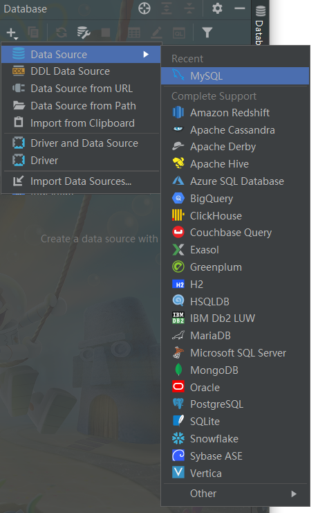

   

2. 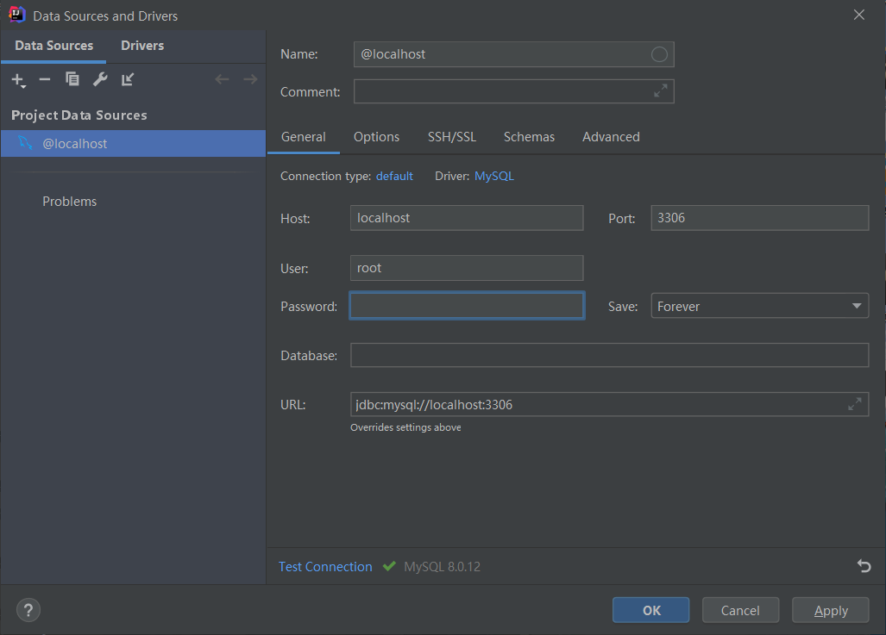


3. 

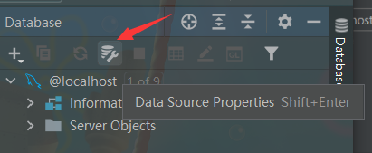


4. 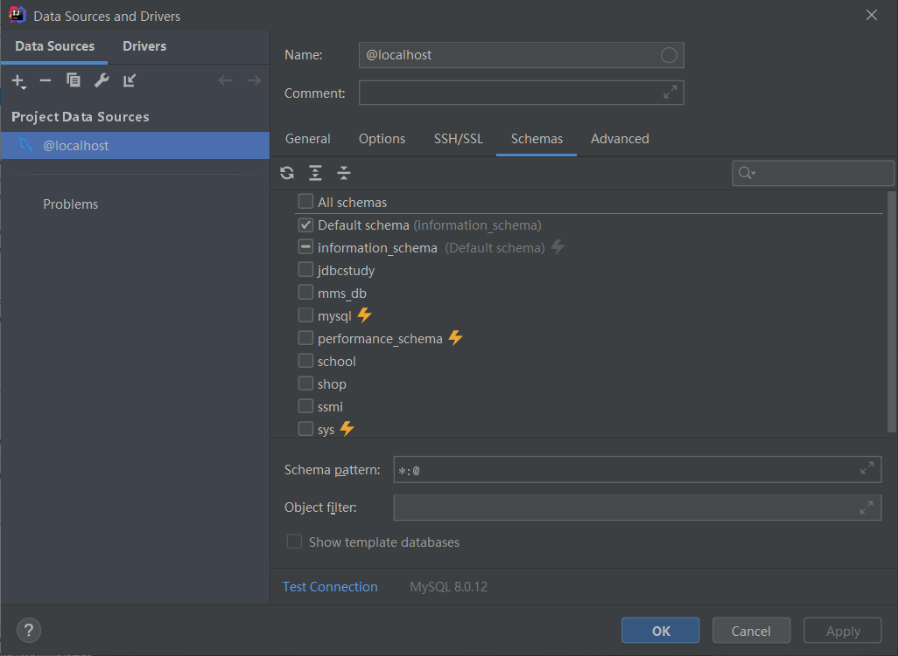

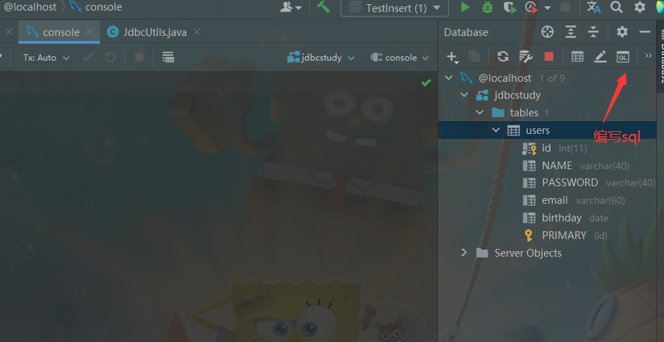


## 使用idea导入一个Maven项目

使用版本：IntelliJ IDEA 2020.2.4

1. [File]→[New]→[Project from Existing Sources…]

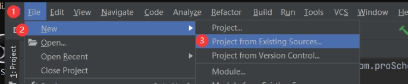 

2. 找到需要导入的Maven项目的文件夹

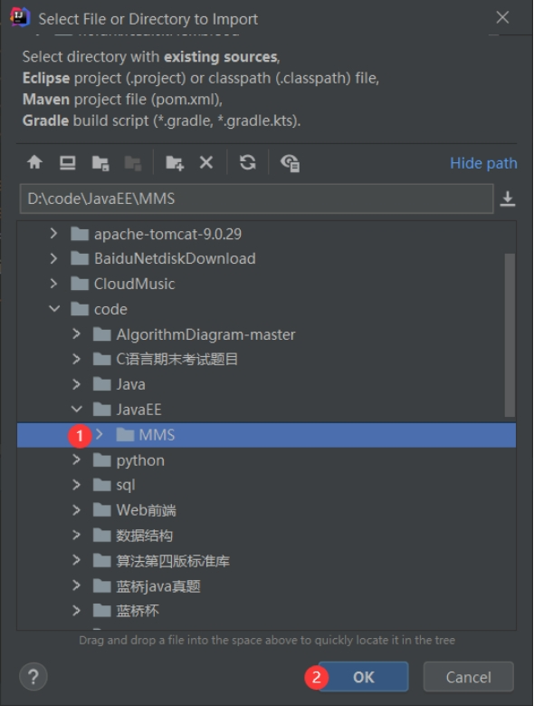 

 

3. 选择external model，然后选中Maven，导入Maven格式的项目。

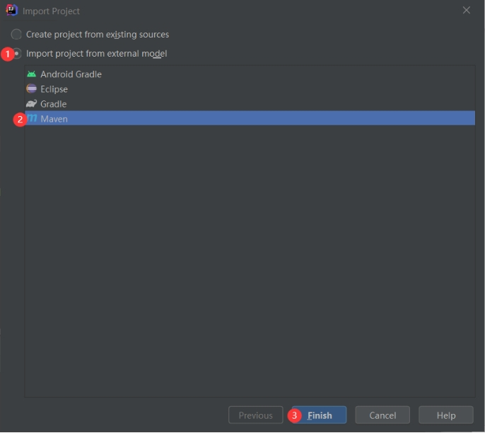 


4. ctrl+alt+s打开settings，搜索maven，检查idea的maven仓库地址是否已经设置为自己的地址

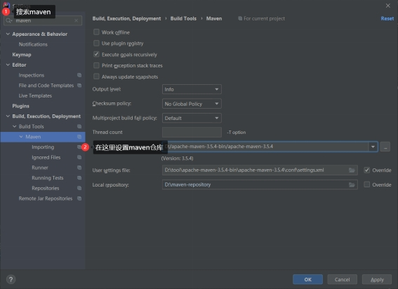 


5. ctrl+alt+shift+s调出Project Structure窗口 配置Artifacts和Facets。Facets添加web支持和Spring框架支持等，Atrifacts在web工程下点击加号会自动生成当前项目对应的war 和 war exploded，使用war exploded。explode是展开，不压缩的意思，开发的时候使用这种模式，便于修改了文件的效果立刻显现出来。

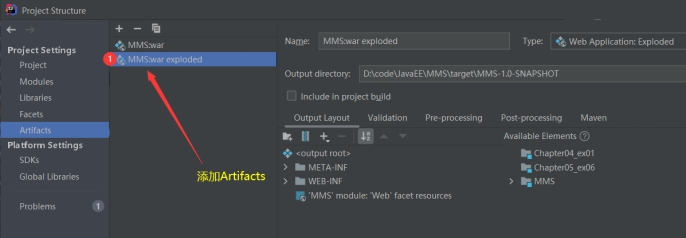 

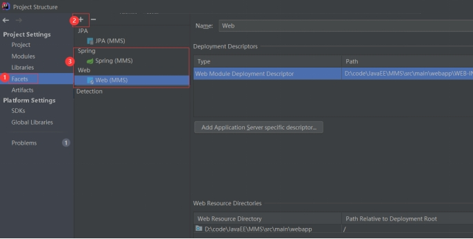 


6. 选中项目右击，Maven→Reload project更新Maven依赖

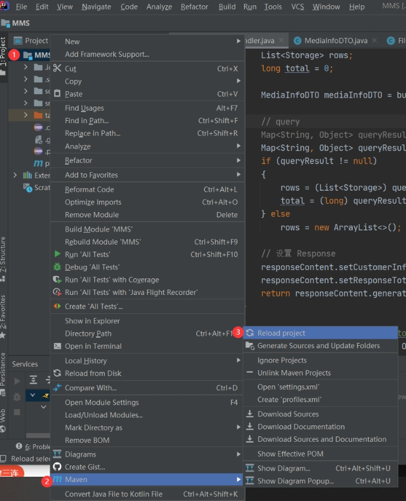 

 

7. 配置Tomcat，工具栏点击run→Edit Configurations

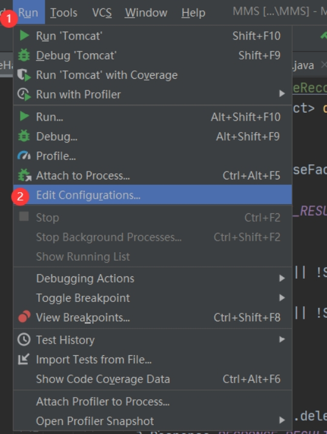 


8. 点击“+”号，添加Tomcat Server

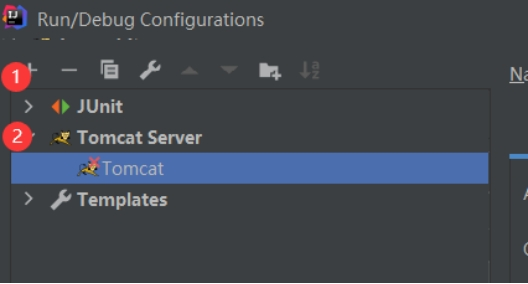 

 

9. 配置Tomcat

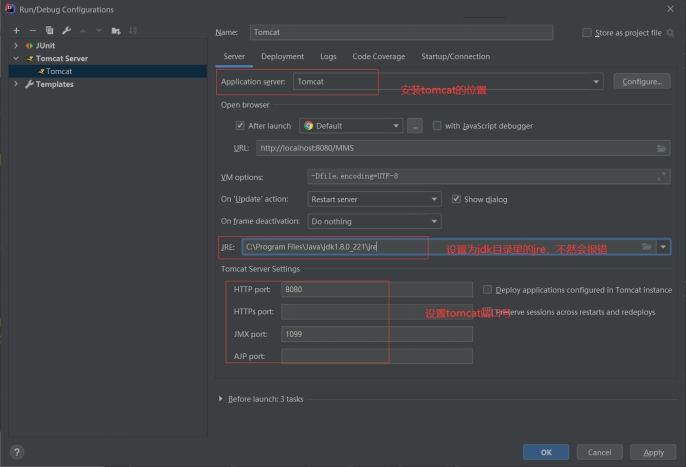 

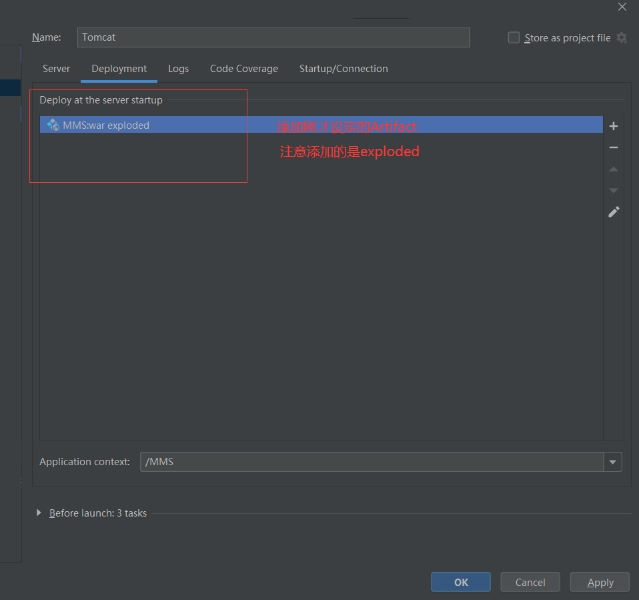 

Application context:虚拟路径映射，localhost后跟的映射地址

war模式：将WEB工程以包的形式上传到服务器 ；
war exploded模式：将WEB工程以当前文件夹的位置关系上传到服务器；

10. shift+F10运行项目


## 配置maven仓库

　　除了现有的属性配置，还需要添加一个配置archetypeCatalog的value为internal，


## 报错篇

### artifact

Cannot build artifact 'servlet-01:war exploded' because it is included into a circular dependency (artifact 'servlet-01:war exploded', artifact 'servlet-01:war exploded')

在.idea文件夹将重复的war文件删除


### tomcat乱码问题

将配置文件logging.properties里utf-8全部改为gbk即可解决


### jstl标签500错误

rg.apache.jasper.JasperException: 无法在web.xml或使用此应用程序部署的jar文件中解析绝对uri：[http://java.sun.com/jsp/jstl/core]

tomcat服务器里缺少standard与jstl-api的jar包，需要手动添加


### SQL dialect is not configured.

idea中SQL语句经常提示SQL Dialect is Not Configured，主要是我们没有配置数据库

在File---->Setting--->Languages & Frameworks--->SQL Dialects中，选择对应的数据库，如MySQL，之后点击保存即可。


### SpringJUnit4ClassRunner requires JUnit 4.12 or higher.

```java
@RunWith(SpringJUnit4ClassRunner.class)
```

Spring单元测试 Junit版本必须是4.13以上
