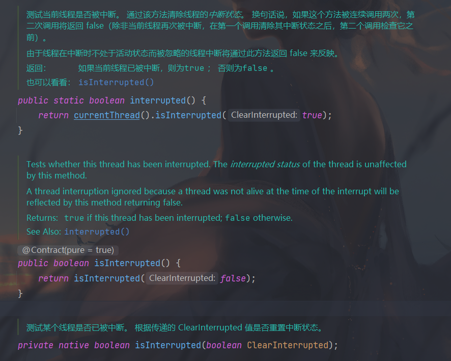

# 1.Java并发编程基础

## 1.3 线程通知与等待

+ 当线程调用共享对象的wait()时，当前线程只会释放当前共享对象的锁，当前线程持有的其他共享对象的监视器锁并不会被释放。
+ 当一个线程调用共享对象的wait（）方法被阻塞挂起后，如果其他线程中断了该线程，则该线程会抛出InterruptedException异常并返回。

## 1.6 让出CPU执行权的yield方法

+ sleep与yield方法的区别在于当线程调用sleep方法时调用线程会被阻塞挂起指定的时间，在这期间线程调度器不会去调度该线程。而调用yield方法时，线程只是让出自己剩余的时间片，并没有被阻塞挂起，而是处于就绪状态，线程调度器下一次调度时就有可能调度到当前线程执行。

## 1.7 线程中断

- interrupt()，在一个线程中调用另一个线程的interrupt()方法，即会向那个线程发出信号——线程中断状态已被设置。至于那个线程何去何从，由具体的代码实现决定。
- isInterrupted()，用来判断当前线程的中断状态(true or false)。
- interrupted()是个Thread的static方法，并且会重置线程的中断状态。

