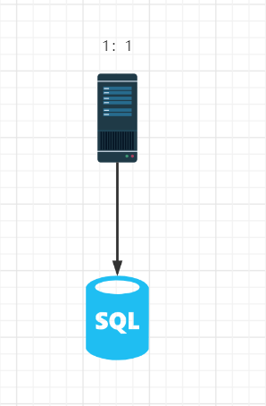
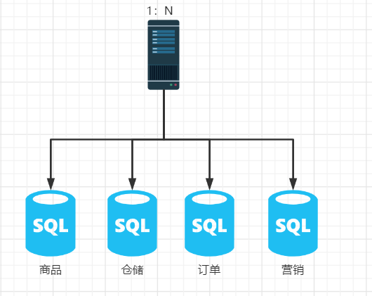
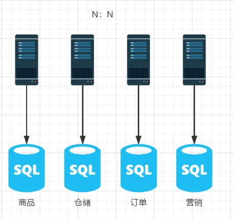

# 分布式事务的由来

我们知道事务的ACID原则，原子性、一致性、隔离性、持久性。在平日我们通常把事务概括一个操作集合要么全部执行成功，要么全部失败。

在我们原始开发单体应用时，一个应用一般都是单机单库形式，这时事务的操作不会出现什么问题。

但随着系统的复杂性提高，数据量激增后，就会有分库的情况，这时候应用程序可能还是一个，但数据库会变成N个。

随着技术的发展，微服务架构的出现，整个系统发生了根本性的变化。应用程序也开始拆分，一个大型单体应用被拆分成一个一个微服务应用，每个微服务及其数据库还会部署在不同的机器上。

这个时候就会牵扯到多数据源多中心的跨库统一调度，当买家下订单时，会牵扯到商品 、仓储、订单、营销四个数据库的调用。虽然这四个数据库在物理上是分开的，但当下单这个操作集合进行时，四个数据库在逻辑上又是一个整体。此时，这就是我们说的分布式事务的由来。

单体应用被拆分成微服务之后，原先的四个模块被拆分成四个独立的应用，分别使用四个数据源，业务操作调用四个服务来完成。这个时候每个服务的数据一致性只能由服务的本机来保证，这个时候服务各自为战，**全局事务的数据一致性问题**没有办法保证。

总结：一次业务操作需要跨多个数据源或需要跨多个系统进行远程调用，就会产生分布式事务问题。