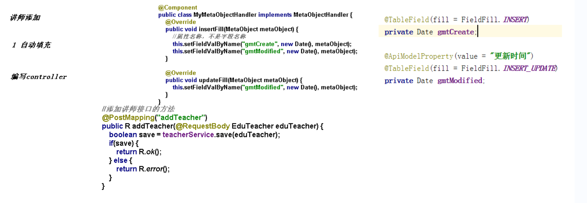
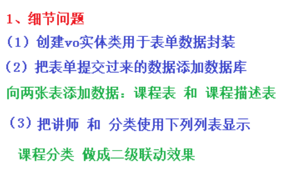
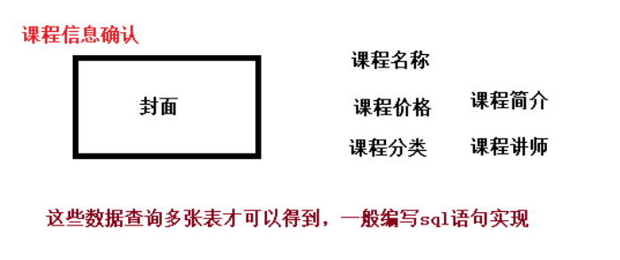
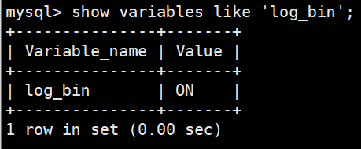
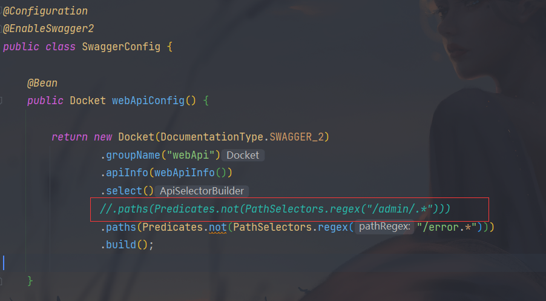

[TOC]


# 项目功能模块

项目模式为B2C模式

springboot版本：2.2.1

+ 系统后台模块（管理员使用）
  + 讲师管理模块
  + 课程分类管理模块
  + 课程管理模块
    + 视频
  + 统计分析模块
  + 订单管理
  + banner管理
  + 权限管理
+ 系统前台（普通用户使用）
  + 首页数据显示
  + 讲师列表和详情
  + 课程列表和课程详情
    + 视频在线播放
  + 登录和注册功能
  + 微信扫描登录
  + 微信扫描支付


# 项目技术点介绍

项目采用	前后端分离开发

后端技术：

+ SpringBoot
+ SpringCloud
+ MyBatisPlus
+ Spring Security
+ Redis
+ Maven
+ EasyExcel
+ jwt
+ OAuth2

前端技术：

+ VUE
+ Element-UI
+ axios
+ node.js

其他技术：

+ 阿里云oss
+ 阿里云视频点播服务
+ 阿里云短信服务
+ 微信支付和登录
+ docker
+ Git
+ Jenkins


## MyBatisPlus

是一个MyBatis的增强工具，简化开发。

+ 导包
+ 写配置

+ 测试

+ Mapper直接继承BaseMapper即可


MP sql日志：

```properties
#mybatis日志
mybatis-plus.configuration.log-impl=org.apache.ibatis.logging.stdout.StdOutImpl
```


### 1.CRUD操作

#### 1.插入

```java
@SpringBootTest
public class Mpdemo1010ApplicationTests {
    @Autowired
    private UserMapper userMapper;

    /**
     * 查询user表中的所有数据
     */
    @Test
    public void findAll() {
        List<User> users = userMapper.selectList(null);
        System.out.println(users);
    }

    /**
     * 添加操作
     * 不需要设置id主键值
     * mp自动生成id值  19位id值
     */
    @Test
    public void addUser() {
        User user = new User();
        user.setName("lucy");
        user.setAge(20);
        user.setEmail("lucy.com");
        int insert = userMapper.insert(user);
        System.out.println("insert:" + insert);
    }

}
```


#### 2.主键策略

https://www.cnblogs.com/haoxinyue/p/5208136.html

1. 自增策略

   自动增长 

   在实体类主键对应字段上标上注解TableId

   ```java
   @TableId(type = IdType.AUTO)
   private Long id;
   ```

   

   

2. uuid

   

3. redis原子操作生成id

   

4. ==mp自带策略**snowflake算法**（本项目用的策略）==


#### 3.修改操作

```java
/**
 * 修改操作
 */
@Test
public void updateUser(){
    User user = new User();
    user.setId(2L);
    user.setAge(120);
    int updateById = userMapper.updateById(user);
    System.out.println(updateById);
}
```


#### 4.自动填充

实现过程

+ 在实体类里面进行自动填充属性添加注解


+ 创建类，实现接口MetaObjectHandler

  ```java
  /**
   * @author KouChaoJie
   * @date: 2021/9/22 16:51
   */
  @Component
  public class MyMetaObjectHandler implements MetaObjectHandler {
      /**
       * insertFill
       * 使用mp实现添加方法，这个方法执行
       *
       * @param metaObject 元数据
       */
      @Override
      public void insertFill(MetaObject metaObject) {
          this.setFieldValByName("createTime", new Date(), metaObject);
          this.setFieldValByName("updateTime", new Date(), metaObject);
      }
  
      /**
       * updateFill
       * 使用mp实现修改方法，这个方法执行
       *
       * @param metaObject 元数据
       */
      @Override
      public void updateFill(MetaObject metaObject) {
          this.setFieldValByName("updateTime", new Date(), metaObject);
      }
  }
  ```


#### 5.乐观锁

解决某些问题

主要解决丢失更新。

如果不考虑事务隔离性，会产生读问题

脏读	不可重复读	幻读

写问题：丢失更新问题

**主要适用场景：**当要更新一条记录的时候，希望这条记录没有被别人更新，也就是说实现线程安全的数据更新

多个人同时修改同一条记录，最后提交的把之前提交数据覆盖。


解决方案：悲观锁（串行操作），**乐观锁**

**乐观锁实现方式：**版本号

- 取出记录时，获取当前version
- 更新时，带上这个version
- 执行更新时， set version = newVersion where version = oldVersion
- 如果version不对，就更新失败


+ 乐观锁的具体实现

  + 数据库中添加version字段

  + 对应实体类添加版本号属性

  + 对应属性添加@Version 注解

  + 配置类配置乐观锁插件

    ```java
    /**
     * 乐观锁插件
     *
     * @return 拦截器
     */
    @Bean
    public MybatisPlusInterceptor mybatisPlusInterceptor() {
        MybatisPlusInterceptor interceptor = new MybatisPlusInterceptor();
        interceptor.addInnerInterceptor(new OptimisticLockerInnerInterceptor());
        return interceptor;
    }
    ```

  + 使用自动填充来给version一个默认值

    


​	

+ 测试

  ```java
  /**
   * 测试乐观锁修改
   */
  @Test
  public void updateUser1() {
      //根据id查询数据
      User user = userMapper.selectById(1440610924718231553L);
      //进行修改
      user.setAge(120);
      userMapper.updateById(user);
  }
  ```

**特别说明:**

+ 支持的数据类型只有 int,Integer,long,Long,Date,Timestamp,LocalDateTime

+ 整数类型下 `newVersion = oldVersion + 1`

+ `newVersion` 会回写到 `entity` 中

+ 仅支持 `updateById(id)` 与 `update(entity, wrapper)` 方法

+ 在 `update(entity, wrapper)` 方法下, `wrapper` 不能复用!!!


#### 6.查询

。。。。


#### 7.分页

+ 配置分页插件

```java
 // 最新版
@Bean
public MybatisPlusInterceptor mybatisPlusInterceptor() {
    MybatisPlusInterceptor interceptor = new MybatisPlusInterceptor();
    interceptor.addInnerInterceptor(new PaginationInnerInterceptor(DbType.H2));
    return interceptor;
}

```

+ 编写分页代码

  直接new page对象，传入两个参数

  ```java
  /**
   * 分页查询
   */
  @Test
  public void testPage() {
      //创建Page对象
      //传入两个参数:当前页  每页显示记录数
      Page<User> userPage = new Page<>(1, 3);
      //调用mp分页查询的方法
      //调用mp分页查询过程中，底层封装把分页所有数据封装到page对象里面
      userMapper.selectPage(userPage, null);
      //通过page对象获取分页数据
      //当前页
      System.out.println(userPage.getCurrent());
      //每页数据的list集合
      System.out.println(userPage.getRecords());
      //每页显示记录数
      System.out.println(userPage.getSize());
      //总记录数
      System.out.println(userPage.getTotal());
      //总页数
      System.out.println(userPage.getPages());
      //是否有下一页
      System.out.println(userPage.hasNext());
      //是否有上一页
      System.out.println(userPage.hasPrevious());
  }
  ```


#### 8.删除

##### 1.物理删除

略


##### 2.逻辑删除

将对应数据中代表是否被删除字段状态修改为“被删除状态”，之后在数据库中仍旧能看到此条数据记录。

+ 在数据库中添加deleted字段，对应实体类添加属性

  

+ 默认0为不删除，1为删除

+ 数据库加默认值或者使用自动填充方式

+ 配置类配置插件（**新版本mp不需要配置**）

  ```java
  @Bean
  public ISqlInjector sqlInjector() {
      return new LogicSqlInjector();
  }
  ```

  ```properties
  mybatis-plus.global-config.db-config.logic-delete-value=1
  mybatis-plus.global-config.db-config.logic-not-delete-value=0
  ```

+ 删除操作后，deleted字段值改变，但数据依然存在

  

+ 配置逻辑删除后，mp查询已经自动配置上where deleted=0
+ 如果想查被逻辑删除的数据，可以写xml文件，自己写语句


#### 9.性能分析

性能分析拦截器，用于输出每条 SQL 语句及其执行时间

SQL 性能执行分析,开发环境使用，超过指定时间，停止运行。有助于发现问题

参数：maxTime： SQL 执行最大时长，超过自动停止运行，有助于发现问题。

参数：format： SQL是否格式化，默认false。


+ 配置插件

  ```java
  /**
   * SQL 执行性能分析插件
   * 开发环境使用，线上不推荐。 maxTime 指的是 sql 最大执行时长
   */
  @Bean
  @Profile({"dev","test"})// 设置 dev test 环境开启
  public PerformanceInterceptor performanceInterceptor() {
      PerformanceInterceptor performanceInterceptor = new PerformanceInterceptor();
      performanceInterceptor.setMaxTime(100);//ms，超过此处设置的ms则sql不执行
      performanceInterceptor.setFormat(true);
      return performanceInterceptor;
  }
  ```

  


### 2.MyBatis-Plus条件构造器


使用**QueryWrapper**构建条件

Wrapper ： 条件构造抽象类，最顶端父类

  AbstractWrapper ： 用于查询条件封装，生成 sql 的 where 条件

​    QueryWrapper ： Entity 对象封装操作类，不是用lambda语法

​    UpdateWrapper ： Update 条件封装，用于Entity对象更新操作

  AbstractLambdaWrapper ： Lambda 语法使用 Wrapper统一处理解析 lambda 获取 column。

​    LambdaQueryWrapper ：看名称也能明白就是用于Lambda语法使用的查询Wrapper

​    LambdaUpdateWrapper ： Lambda 更新封装Wrapper


```java
/**
 * mp实现复杂查询操作
 */
@Test
public void testSelectQuery() {
    //创建对象
    QueryWrapper<User> wrapper = new QueryWrapper<>();
    //通过QueryWrapper设置条件
    //ge,gt,le,lt 大于 大于等于 小于 小于等于
    //查询大于30岁的user
    //字段名   条件数值
    //wrapper.ge("age", 30);
    
    //eq,ne  等于 不等于
   //wrapper.ne("name", "lilei");
    
    //between 范围
    //wrapper.between("age",20,35);
    
    //like 模糊查询
    //wrapper.like("name","东");
    
    //orderBy 排序
    //wrapper.orderByDesc("id");
    
    //last 拼接sql语句
    //wrapper.last("limit 1");
    //指定要查询的列
    wrapper.select("id","name");
    
    List<User> users = userMapper.selectList(wrapper);
    System.out.println(users);
}
```


# 环境搭建

## 1.前后端分离开发概念

**开发文档**


## 2.数据库设计

**讲师管理模块**

以下规约只针对本模块，更全面的文档参考==《阿里巴巴Java开发手册》==：五、MySQL数据库

1、库名与应用名称尽量一致


2、表名、字段名必须使用小写字母或数字，禁止出现数字开头，


3、表名不使用复数名词


4、表的命名最好是加上“业务名称_表的作用”。如，edu_teacher


5、**表必备三字段：id, gmt_create, gmt_modified**

说明：

其中 id 必为主键，类型为 bigint unsigned、单表时自增、步长为 1。

（如果使用分库分表集群部署，则id类型为verchar，非自增，业务中使用分布式id生成器）

gmt_create, gmt_modified 的类型均为 datetime 类型，前者现在时表示主动创建，后者过去分词表示被 动更新。

 

6、单表行数超过 500 万行或者单表容量超过 2GB，才推荐进行分库分表。 说明：如果预计三年后的数据量根本达不到这个级别，请不要在创建表时就分库分表。 


7、表达是与否概念的字段，必须使用 is_xxx 的方式命名，数据类型是 unsigned tinyint （1 表示是，0 表示否）。 

说明：任何字段如果为非负数，必须是 unsigned。 

注意：POJO 类中的任何布尔类型的变量，都不要加 is 前缀。数据库表示是与否的值，使用 tinyint 类型，坚持 is_xxx 的 命名方式是为了明确其取值含义与取值范围。 

正例：表达逻辑删除的字段名 is_deleted，1 表示删除，0 表示未删除。 


8、小数类型为 decimal，禁止使用 float 和 double。 说明：float 和 double 在存储的时候，存在精度损失的问题，很可能在值的比较时，得到不 正确的结果。如果存储的数据范围超过 decimal 的范围，建议将数据拆成整数和小数分开存储。


9、如果存储的字符串长度几乎相等，使用 char 定长字符串类型。 


10、varchar 是可变长字符串，不预先分配存储空间，长度不要超过 5000，如果存储长度大于此值，定义字段类型为 text，独立出来一张表，用主键来对应，避免影响其它字段索 引效率。


11、唯一索引名为 uk_字段名；普通索引名则为 idx_字段名。

说明：uk_ 即 unique key；idx_ 即 index 的简称


12、不得使用外键与级联，一切外键概念必须在应用层解决。外键与级联更新适用于单机低并发，不适合分布式、高并发集群；级联更新是强阻塞，存在数据库更新风暴的风险；外键影响数据库的插入速度。 


## 3.搭建项目工程

### 1.创建项目结构

+ 创建父工程  pom类型，管理依赖版本和放公共依赖       springboot工程
  + 子模块一																		maven工程
    + 子子模块一															 maven工程
    + 子子模块二
  + 子模块二
  + 子模块三
  + ........


添加

```xml
<packaging>pom</packaging>

<properties>
        <java.version>1.8</java.version>
        <guli.version>0.0.1-SNAPSHOT</guli.version>
        <mybatis-plus.version>3.0.5</mybatis-plus.version>
        <velocity.version>2.0</velocity.version>
        <swagger.version>2.7.0</swagger.version>
        <aliyun.oss.version>2.8.3</aliyun.oss.version>
        <jodatime.version>2.10.1</jodatime.version>
        <poi.version>3.17</poi.version>
        <commons-fileupload.version>1.3.1</commons-fileupload.version>
        <commons-io.version>2.6</commons-io.version>
        <httpclient.version>4.5.1</httpclient.version>
        <jwt.version>0.7.0</jwt.version>
        <aliyun-java-sdk-core.version>4.3.3</aliyun-java-sdk-core.version>
        <aliyun-sdk-oss.version>3.1.0</aliyun-sdk-oss.version>
        <aliyun-java-sdk-vod.version>2.15.2</aliyun-java-sdk-vod.version>
        <aliyun-java-vod-upload.version>1.4.11</aliyun-java-vod-upload.version>
        <aliyun-sdk-vod-upload.version>1.4.11</aliyun-sdk-vod-upload.version>
        <fastjson.version>1.2.28</fastjson.version>
        <gson.version>2.8.2</gson.version>
        <json.version>20170516</json.version>
        <commons-dbutils.version>1.7</commons-dbutils.version>
        <canal.client.version>1.1.0</canal.client.version>
        <docker.image.prefix>zx</docker.image.prefix>
        <cloud-alibaba.version>0.2.2.RELEASE</cloud-alibaba.version>
    </properties>

    <dependencyManagement>
        <dependencies>
            <!--Spring Cloud-->
            <dependency>
                <groupId>org.springframework.cloud</groupId>
                <artifactId>spring-cloud-dependencies</artifactId>
                <version>Hoxton.RELEASE</version>
                <type>pom</type>
                <scope>import</scope>
            </dependency>

            <dependency>
                <groupId>org.springframework.cloud</groupId>
                <artifactId>spring-cloud-alibaba-dependencies</artifactId>
                <version>${cloud-alibaba.version}</version>
                <type>pom</type>
                <scope>import</scope>
            </dependency>
            <!--mybatis-plus 持久层-->
            <dependency>
                <groupId>com.baomidou</groupId>
                <artifactId>mybatis-plus-boot-starter</artifactId>
                <version>${mybatis-plus.version}</version>
            </dependency>

            <!-- velocity 模板引擎, Mybatis Plus 代码生成器需要 -->
            <dependency>
                <groupId>org.apache.velocity</groupId>
                <artifactId>velocity-engine-core</artifactId>
                <version>${velocity.version}</version>
            </dependency>

            <!--swagger-->
            <dependency>
                <groupId>io.springfox</groupId>
                <artifactId>springfox-swagger2</artifactId>
                <version>${swagger.version}</version>
            </dependency>
            <!--swagger ui-->
            <dependency>
                <groupId>io.springfox</groupId>
                <artifactId>springfox-swagger-ui</artifactId>
                <version>${swagger.version}</version>
            </dependency>

            <!--aliyunOSS-->
            <dependency>
                <groupId>com.aliyun.oss</groupId>
                <artifactId>aliyun-sdk-oss</artifactId>
                <version>${aliyun.oss.version}</version>
            </dependency>

            <!--日期时间工具-->
            <dependency>
                <groupId>joda-time</groupId>
                <artifactId>joda-time</artifactId>
                <version>${jodatime.version}</version>
            </dependency>

            <!--xls-->
            <dependency>
                <groupId>org.apache.poi</groupId>
                <artifactId>poi</artifactId>
                <version>${poi.version}</version>
            </dependency>
            <!--xlsx-->
            <dependency>
                <groupId>org.apache.poi</groupId>
                <artifactId>poi-ooxml</artifactId>
                <version>${poi.version}</version>
            </dependency>

            <!--文件上传-->
            <dependency>
                <groupId>commons-fileupload</groupId>
                <artifactId>commons-fileupload</artifactId>
                <version>${commons-fileupload.version}</version>
            </dependency>

            <!--commons-io-->
            <dependency>
                <groupId>commons-io</groupId>
                <artifactId>commons-io</artifactId>
                <version>${commons-io.version}</version>
            </dependency>

            <!--httpclient-->
            <dependency>
                <groupId>org.apache.httpcomponents</groupId>
                <artifactId>httpclient</artifactId>
                <version>${httpclient.version}</version>
            </dependency>

            <dependency>
                <groupId>com.google.code.gson</groupId>
                <artifactId>gson</artifactId>
                <version>${gson.version}</version>
            </dependency>

            <!-- JWT -->
            <dependency>
                <groupId>io.jsonwebtoken</groupId>
                <artifactId>jjwt</artifactId>
                <version>${jwt.version}</version>
            </dependency>

            <!--aliyun-->
            <dependency>
                <groupId>com.aliyun</groupId>
                <artifactId>aliyun-java-sdk-core</artifactId>
                <version>${aliyun-java-sdk-core.version}</version>
            </dependency>
            <dependency>
                <groupId>com.aliyun.oss</groupId>
                <artifactId>aliyun-sdk-oss</artifactId>
                <version>${aliyun-sdk-oss.version}</version>
            </dependency>
            <dependency>
                <groupId>com.aliyun</groupId>
                <artifactId>aliyun-java-sdk-vod</artifactId>
                <version>${aliyun-java-sdk-vod.version}</version>
            </dependency>
            <dependency>
                <groupId>com.aliyun</groupId>
                <artifactId>aliyun-java-vod-upload</artifactId>
                <version>${aliyun-java-vod-upload.version}</version>
            </dependency>
            <dependency>
                <groupId>com.aliyun</groupId>
                <artifactId>aliyun-sdk-vod-upload</artifactId>
                <version>${aliyun-sdk-vod-upload.version}</version>
            </dependency>
            <dependency>
                <groupId>com.alibaba</groupId>
                <artifactId>fastjson</artifactId>
                <version>${fastjson.version}</version>
            </dependency>
            <dependency>
                <groupId>org.json</groupId>
                <artifactId>json</artifactId>
                <version>${json.version}</version>
            </dependency>

            <dependency>
                <groupId>commons-dbutils</groupId>
                <artifactId>commons-dbutils</artifactId>
                <version>${commons-dbutils.version}</version>
            </dependency>

            <dependency>
                <groupId>com.alibaba.otter</groupId>
                <artifactId>canal.client</artifactId>
                <version>${canal.client.version}</version>
            </dependency>
        </dependencies>
    </dependencyManagement>
```

做好依赖管理


删除src目录


+ 创建子模块

  

+ 创建子子模块

  


# 后台模块

## 1.开发后台讲师管理模块

### 1.基础配置

+ 写配置文件

  ```properties
  # 服务端口
  server.port=8001
  # 服务名
  spring.application.name=service-edu
  
  # 环境设置：dev、test、prod
  spring.profiles.active=dev
  
  # mysql数据库连接
  spring.datasource.driver-class-name=com.mysql.cj.jdbc.Driver
  spring.datasource.url=jdbc:mysql://localhost:3306/guli?serverTimezone=GMT%2B8
  spring.datasource.username=root
  spring.datasource.password=root
  
  #mybatis日志
  mybatis-plus.configuration.log-impl=org.apache.ibatis.logging.stdout.StdOutImpl
  ```

  

+ 编写controller，service，mapper

  **使用mp提供的代码生成器，生成相关代码**

  放在test中，因为不需要打包

  ```java
  import com.baomidou.mybatisplus.annotation.DbType;
  import com.baomidou.mybatisplus.annotation.IdType;
  import com.baomidou.mybatisplus.generator.AutoGenerator;
  import com.baomidou.mybatisplus.generator.config.DataSourceConfig;
  import com.baomidou.mybatisplus.generator.config.GlobalConfig;
  import com.baomidou.mybatisplus.generator.config.PackageConfig;
  import com.baomidou.mybatisplus.generator.config.StrategyConfig;
  import com.baomidou.mybatisplus.generator.config.rules.DateType;
  import com.baomidou.mybatisplus.generator.config.rules.NamingStrategy;
  import org.junit.Test;
  
  /**
   * @author Kou
   * @since 2018/12/13
   */
  public class CodeGenerator {
  
      @Test
      public void run() {
  
          // 1、创建代码生成器
          AutoGenerator mpg = new AutoGenerator();
  
          // 2、全局配置
          GlobalConfig gc = new GlobalConfig();
          String projectPath = System.getProperty("user.dir");
          gc.setOutputDir(projectPath + "/src/main/java");
          gc.setAuthor("testjava");
          gc.setOpen(false); //生成后是否打开资源管理器
          gc.setFileOverride(false); //重新生成时文件是否覆盖
          gc.setServiceName("%sService");	//去掉Service接口的首字母I
          gc.setIdType(IdType.ID_WORKER); //主键策略
          gc.setDateType(DateType.ONLY_DATE);//定义生成的实体类中日期类型
          gc.setSwagger2(true);//开启Swagger2模式
  
          mpg.setGlobalConfig(gc);
  
          // 3、数据源配置
          DataSourceConfig dsc = new DataSourceConfig();
          dsc.setUrl("jdbc:mysql://localhost:3306/guli");
          dsc.setDriverName("com.mysql.jdbc.Driver");
          dsc.setUsername("root");
          dsc.setPassword("root");
          dsc.setDbType(DbType.MYSQL);
          mpg.setDataSource(dsc);
  
          // 4、包配置
          PackageConfig pc = new PackageConfig();
          pc.setModuleName("edu"); //模块名
          pc.setParent("com.example.demo");
          pc.setController("controller");
          pc.setEntity("entity");
          pc.setService("service");
          pc.setMapper("mapper");
          mpg.setPackageInfo(pc);
  
          // 5、策略配置
          StrategyConfig strategy = new StrategyConfig();
          strategy.setInclude("edu_teacher");
          strategy.setNaming(NamingStrategy.underline_to_camel);//数据库表映射到实体的命名策略
          strategy.setTablePrefix(pc.getModuleName() + "_"); //生成实体时去掉表前缀
  
          strategy.setColumnNaming(NamingStrategy.underline_to_camel);//数据库表字段映射到实体的命名策略
          strategy.setEntityLombokModel(true); // lombok 模型 @Accessors(chain = true) setter链式操作
  
          strategy.setRestControllerStyle(true); //restful api风格控制器
          strategy.setControllerMappingHyphenStyle(true); //url中驼峰转连字符
  
          mpg.setStrategy(strategy);
  
  
          // 6、执行
          mpg.execute();
      }
  }
  ```

  

+ 测试查询所有讲师数据

  ```java
  @RestController
  @RequestMapping("/eduservice/edu-teacher")
  public class EduTeacherController {
      @Autowired
      private EduTeacherService eduTeacherService;
      /**
       * 查询讲师表中所有数据
       * rest风格url操作
       *
       * @return 所有讲师信息
       */
      @GetMapping("findAll")
      public List<EduTeacher> findAllTeacher() {
          //调用service方法实现查询所有讲师数据
          return eduTeacherService.list(null);
      }
  }
  ```


### 2.创建springboot启动类

在service_edu模块中配置springboot启动类

```java
/**
 * @author KouChaoJie
 * @since: 2021/9/24 15:56
 */
@SpringBootApplication
public class EduApplication {
    public static void main(String[] args) {
        SpringApplication.run(EduApplication.class, args);
    }
}
```


### 3.统一返回的json时间格式

```properties
#返回json的全局时间格式
spring.jackson.date-format=yyyy-MM-dd HH:mm:ss
spring.jackson.time-zone=GMT+8
```


### 4.讲师的逻辑删除

+ 配置逻辑删除插件

  ```java
  /**
  * 逻辑删除插件
  */
  @Bean
  public ISqlInjector sqlInjector() {
      return new LogicSqlInjector();
  }
  ```

  

+ 字段添加注解

  ```java
  @TableLogic
  private Boolean isDeleted;
  ```


+ 编写cotroller方法

  略


### 5.跨域配置

#### 1.什么是跨域

浏览器从一个域名的网页去请求另一个域名的资源时，域名、端口、协议任一不同，都是跨域 。前后端分离开发中，需要考虑ajax跨域的问题。

这里我们可以从服务端解决这个问题

#### 2.配置

在Controller类上添加注解

```java
@CrossOrigin //跨域
```


### 6.Swagger2介绍

前后端分离开发模式中，api文档是最好的沟通方式。

Swagger 是一个规范和完整的框架，用于生成、描述、调用和可视化 RESTful 风格的 Web 服务。

+ 及时性 (接口变更后，能够及时准确地通知相关前后端开发人员)

+ 规范性 (并且保证接口的规范性，如接口的地址，请求方式，参数及响应格式和错误信息)

+ 一致性 (接口信息一致，不会出现因开发人员拿到的文档版本不一致，而出现分歧)

+ 可测性 (直接在接口文档上进行测试，以方便理解业务)


1. 生成在线接口文档
2. 方便接口测试


### 7.配置Swagger2

创建一个公共模块common，整合swagger，为了所有模块都能使用

引入依赖

再创建一个子模块service_base

配置类

```java
@Configuration
@EnableSwagger2
public class SwaggerConfig {
    @Bean
    public Docket webApiConfig(){
        return new Docket(DocumentationType.SWAGGER_2)
                .groupName("webApi")
                .apiInfo(webApiInfo())
                .select()
                .paths(Predicates.not(PathSelectors.regex("/admin/.*")))
                .paths(Predicates.not(PathSelectors.regex("/error.*")))
                .build();
    }
    private ApiInfo webApiInfo(){
        return new ApiInfoBuilder()
                .title("网站-课程中心API文档")
                .description("本文档描述了课程中心微服务接口定义")
                .version("1.0")
                .contact(new Contact("Helen", "http://atguigu.com", "55317332@qq.com"))
                .build();
    }
}
```


+ 具体使用

  在service中引用

  ```xml
  <dependency>
      <groupId>com.cucn</groupId>
      <artifactId>service_base</artifactId>
      <version>0.0.1-SNAPSHOT</version>
  </dependency>
  ```

+ **在service-edu启动类上添加注解，进行测试**

  ```java
  @ComponentScan(basePackages = {"com.cucn"})
  ```


+ 访问**swagger**

  http://localhost:8001/swagger-ui.html

  就可以测试项目了


+ 定义接口说明和参数说明

  定义在类上：@Api

  定义在方法上：@ApiOperation

  定义在参数上：@ApiParam

  ```java
  @Api(description="讲师管理")
  @RestController
  @RequestMapping("/admin/edu/teacher")
  public class TeacherAdminController {
  
  	@Autowired
  	private TeacherService teacherService;
  
  	@ApiOperation(value = "所有讲师列表")
  	@GetMapping
  	public List<Teacher> list(){
  		return teacherService.list(null);
  	}
  
  	@ApiOperation(value = "根据ID删除讲师")
  	@DeleteMapping("{id}")
  	public boolean removeById(
  			@ApiParam(name = "id", value = "讲师ID", required = true)
  			@PathVariable String id){
  		return teacherService.removeById(id);
  	}
  }
  ```

  

### 8.统一返回数据格式

```json
{
  "success": 布尔, //响应是否成功
  "code": 数字, //响应码
  "message": 字符串, //返回消息
  "data": HashMap //返回数据，放在键值对中
}
```

+ 在common模块里创建子模块common_utils

  

+ 创建interface，定义数据返回的状态码

  成功20000，失败20001

  ```java
  public interface ResultCode {
      Integer SUCCESS = 20000;
      Integer ERROR = 20001;
  }
  ```

+ 定义返回数据格式

  ```java
  /**
   * 统一返回数据结果类
   *
   * @author KouChaoJie
   * @since: 2021/9/24 17:39
   */
  @Data
  public class Result {
      @ApiModelProperty(value = "是否成功")
      private Boolean success;
  
      @ApiModelProperty(value = "返回码")
      private Integer code;
  
      @ApiModelProperty(value = "返回消息")
      private String message;
  
      @ApiModelProperty(value = "返回数据")
      private Map<String, Object> data = new HashMap<>();
  
      /**
       * 构造方法私有化
       */
      private Result() {
      }
  
      /**
       * 成功静态方法
       *
       * @return 成功的Result结果
       */
      public static Result ok() {
          Result result = new Result();
          result.setSuccess(true);
          result.setCode(ResultCode.SUCCESS);
          result.setMessage("成功");
          return result;
      }
  
      /**
       * 成功静态方法
       *
       * @return 失败的Result结果
       */
      public static Result error() {
          Result result = new Result();
          result.setSuccess(false);
          result.setCode(ResultCode.ERROR);
          result.setMessage("失败");
          return result;
      }
  
      public Result success(Boolean success){
          this.setSuccess(success);
          return this;
      }
  
      public Result message(String message){
          this.setMessage(message);
          return this;
      }
  
      public Result code(Integer code){
          this.setCode(code);
          return this;
      }
  
      public Result data(String key, Object value){
          this.data.put(key, value);
          return this;
      }
  
      public Result data(Map<String, Object> map){
          this.setData(map);
          return this;
      }
  }
  ```


+ 使用统一结果返回

  + service里引入commonutils

  + 将接口返回值全部设置成Result

    ```java
    @GetMapping("/findAll")
    public Result findAllTeacher() {
        //调用service方法实现查询所有讲师数据
        List<EduTeacher> eduTeachers = eduTeacherService.list(null);
        return Result.ok().data("items", eduTeachers);
    }
    ```


### 9.分页与条件查询接口开发

+ 配置分页插件

  ```java
  /**
   * 分页插件
   */
  @Bean
  public PaginationInterceptor paginationInterceptor() {
      return new PaginationInterceptor();
  }
  ```


+ 编写controller

  ```java
  /**
   * 分页查询讲师的方法
   *
   * @param current 当前页
   * @param limit   每页记录数
   * @return 分页Result信息
   */
  @ApiOperation(value = "分页查询讲师")
  @GetMapping("/pageTeacher/{current}/{limit}")
  public Result pageListTeacher(@PathVariable Long current, @PathVariable Long limit) {
      //创建page对象
      Page<EduTeacher> teacherPage = new Page<>(current, limit);
      //调用方法实现分页
      //调用方法时，底层封装，把分页所有数据都封装到了Page对象中
      eduTeacherService.page(teacherPage, null);
      //总记录数
      long total = teacherPage.getTotal();
      //每页数据集合
      List<EduTeacher> records = teacherPage.getRecords();
      return Result.ok().data("total", total).data("rows", records);
  }
  ```


#### 1.多条件组合查询带分页


+ 把条件值传递到接口里（VO）

  把条件值封装到对象里面，把对象传递到接口里面

  根据条件值进行判断，拼接条件

  

  

  ```java
  /**
   * 条件查询带分页方法
   *
   * @param current      当前页
   * @param limit        每页记录数
   * @param teacherQuery teacher查询条件对象
   * @return 分页Result信息
   */
  @PostMapping("/pageTeacherCondition/{current}/{limit}")
  public Result pageTeacherCondition(@PathVariable Long current,
                                     @PathVariable Long limit,
                                     @RequestBody(required = false) TeacherQuery teacher
      Page<EduTeacher> teacherPage = new Page<>();
      //构造条件
      QueryWrapper<EduTeacher> wrapper = new QueryWrapper<>();
      //多条件组合查询
      String name = teacherQuery.getName();
      Integer level = teacherQuery.getLevel();
      String begin = teacherQuery.getBegin();
      String end = teacherQuery.getEnd();
      //判断条件值是否为空，如果不为空拼接条件
      if (!StringUtils.isEmpty(name)) {
          wrapper.like("name", name);
      }
      if (!StringUtils.isEmpty(level)) {
          wrapper.like("level", level);
      }
      if (!StringUtils.isEmpty(begin)) {
          wrapper.ge("gmt_create", begin);
      }
      if (!StringUtils.isEmpty(end)) {
          wrapper.le("gmt_create", end);
      }
      eduTeacherService.page(teacherPage, wrapper);
      //总记录数
      long total = teacherPage.getTotal();
      //每页数据集合
      List<EduTeacher> records = teacherPage.getRecords();
      return Result.ok().data("total", total).data("rows", records);
  }
  ```


### 10.添加讲师

+ 做自动填充

  放在service_base模块中

  


### 11.修改讲师功能

+ 根据讲师id进行查询


+ 讲师修改


### 12.统一异常处理

我们想让异常结果也显示为统一的返回结果对象，并且统一处理系统的异常信息，那么需要统一异常处理


+ 在service-base中创建统一异常处理类GlobalExceptionHandler.java：

  ```java
  /**
   * 统一异常处理类
   *
   * @author KouChaoJie
   * @since: 2021/9/24 23:49
   */
  @ControllerAdvice
  public class GlobalExceptionHandler {
      /**
       * 指定出现什么异常执行
       * -@ResponseBody 为了返回数据
       *
       * @param e 异常
       * @return Result
       */
      @ExceptionHandler(Exception.class)
      @ResponseBody
      public Result error(Exception e) {
          e.printStackTrace();
          return Result.error().message("执行了全局异常处理");
      }
  }
  ```


+ **处理特定异常**

  略

+ **自定义异常处理**

  + 创建自定义异常类继承RuntimeException

  + 写异常属性

    ```java
    @EqualsAndHashCode(callSuper = true)
    @Data
    @AllArgsConstructor
    @NoArgsConstructor
    public class GuliException extends RuntimeException {
        /**
         * 状态码
         */
        private Integer code;
        /**
         * 异常信息
         */
        private String msg;
    }
    ```

  + 放在service_base中

  + 在统一异常类中添加规则

  + 执行自定义异常

    手动抛出

    


### 13.统一日志处理

+ 配置日志级别

  日志记录器（Logger）的行为是分等级的。如下表所示：

  分为：OFF、FATAL、**ERROR、WARN、INFO、DEBUG**、ALL

  默认情况下，spring boot从控制台打印出来的日志级别只有INFO及以上级别，可以配置日志级别

  ```properties
  #设置日志级别
  logging.level.root=WARN
  ```

  这种方式只能将日志打在控制台上


+ 把日志不仅输出到控制台，也可以输出到文件中，使用日志工具

  LogBack工具

  + 删除application.properties日志配置
  + resources 中创建 logback-spring.xml 


+ 如果程序运行出现异常，把异常信息输出到文件中

  在统一异常处理类上加上@Slf4j

  在处理异常方法中log.error   log.warn


### 14.添加讲师实现头像上传功能

+ 使用阿里云oss对象存储   来存储头像

+ 首先创建一个bucket

  


+ java代码操作阿里云oss，上传文件到阿里云oss操作

  + 准备工作：创建操作阿里云oss许可证（阿里云给的id和密钥）
  + 查看阿里云官方api进行操作

+ 后端集成oss

  + 创建service_oss模块

  + 引入相关依赖

  + 写配置文件

    ```properties
    #服务端口
    server.port=8002
    #服务名
    spring.application.name=service-oss
    #环境设置：dev、test、prod
    spring.profiles.active=dev
    #阿里云 OSS
    #不同的服务器，地址不同
    aliyun.oss.file.endpoint=oss-cn-shanghai.aliyuncs.com
    aliyun.oss.file.keyid=1111
    aliyun.oss.file.keysecret=2222
    #bucket可以在控制台创建，也可以使用java代码创建
    aliyun.oss.file.bucketname=1
    ```

  + 遇到问题

    

    启动的时候，找数据库配置，但是此模块不需要操作数据库，只是上传oss

    解决方式：1. 添加数据库配置

    ​					2.在启动类添加属性`exclude = DataSourceAutoConfiguration.class`，不去加载数据库


+ 创建常量类，读取配置文件内容

+ 创建controller调用service

  ```java
  /**
   * 上传头像的方法
   *
   * @return Result
   */
  @PostMapping
  public Result uploadOssFile(MultipartFile file) {
      //获取上传的文件 MultipartFile
      //获取上传到oss的地址
      String url = ossService.uploadFileAvatar(file);
      return Result.ok().data("url", url);
  }
  ```

  ```java
  /**
   * @author KouChaoJie
   * @since: 2021/9/28 15:07
   */
  @Service
  public class OssServiceImpl implements OssService {
      @Override
      public String uploadFileAvatar(MultipartFile file) {
          // yourEndpoint填写Bucket所在地域对应的Endpoint。
          String endpoint = ConstantPropertiesUtils.END_POINT;
          // 阿里云账号AccessKey拥有所有API的访问权限
          String accessKeyId = ConstantPropertiesUtils.ACCESS_KEY_ID;
          String accessKeySecret = ConstantPropertiesUtils.ACCESS_KEY_SECRET;
          String bucketName = ConstantPropertiesUtils.BUCKET_NAME;
          try {
              // 创建OSSClient实例。
              OSS ossClient = new OSSClientBuilder().build(endpoint, accessKeyId, accessKeySecret);
              //获取上传文件输入流
              InputStream inputStream = file.getInputStream();
              //获取文件名称
              String fileName = file.getOriginalFilename();
              // 调用oss方法实现上传
              //第一个参数 Bucket名称 
              //第二个参数 上传到oss文件路径和文件名称
              //第三个参数 上传文件输入流
              ossClient.putObject(bucketName, fileName, inputStream);
              // 关闭OSSClient。
              ossClient.shutdown();
              //返回上传后的文件路径返回
              //https://edu-kou1010.oss-cn-shanghai.aliyuncs.com/01.jpg
              return "https://" + bucketName + "." + endpoint + "/" + fileName;
          } catch (IOException e) {
              e.printStackTrace();
              return null;
          }
      }
  }
  ```


+ 问题：

  + 多次上传相同文件，会造成最后一次上传把之前的上传文件覆盖掉了

+ 解决：

  + 在文件名称添加随机唯一值，让每个文件名称不同

    

  + 或者把文件分类存储

    + 根据日期进行分类


+ nginx 反向代理服务器


## 2.课程分类管理模块

课程名称：java基础课程开发     分类：后端开发

课程名称：vue高级开发课程 	 分类：前端开发


二级分类：

后端开发：java,c++......

前端开发：vue,js........


当parentId等于0时，表示此课程为一级分类


### 1.技术点：使用EasyExcel进行写操作

EasyExcel是阿里巴巴开源的一个excel处理框架，**以使用简单、节省内存著称**。EasyExcel能大大减少占用内存的主要原因是在解析Excel时没有将文件数据一次性全部加载到内存中，而是从磁盘上一行行读取数据，逐个解析。


+ 引入依赖

  ```xml
  <dependencies>
      <!-- https://mvnrepository.com/artifact/com.alibaba/easyexcel -->
      <dependency>
          <groupId>com.alibaba</groupId>
          <artifactId>easyexcel</artifactId>
          <version>2.1.1</version>
      </dependency>
  </dependencies>
  ```

  还需要poi的依赖

+ 创建一个实体类，和excel中数据对应上

  ```java
  @Data
  public class DemoData {
      /**
       * 设置excel表头名称
       */
      @ExcelProperty("学生编号")
      private Integer sno;
  
      @ExcelProperty("学生姓名")
      private String sname;
  }
  ```


### 2.技术点：使用EasyExcel进行读操作

+ 创建和excel对应的实体类，标记对应列关系

  

+ 创建一个监听进行excel文件读取

  ```java
  public class ExcelListener extends AnalysisEventListener<DemoData> {
      /**
       * 一行一行读取excel内容
       */
      @Override
      public void invoke(DemoData demoData, AnalysisContext analysisContext) {
          System.out.println("********" + demoData);
      }
      /**
       * 读取表头的内容
       */
      @Override
      public void invokeHeadMap(Map<Integer, String> headMap, AnalysisContext context) {
          System.out.println("表头:" + headMap);
      }
      /**
       * 读取完成之后
       */
      @Override
      public void doAfterAllAnalysed(AnalysisContext analysisContext) {
      }
  }
  ```

+ 最终方法的调用

  


### 3.添加课程分类

+ 引入easyexcel依赖
+ 使用代码生成器把课程分类代码生成
+ 创建一个实体类和excel对应关系
+ 给监听器传入对应service对象，方便进行数据库操作


### 4.课程分类显示接口

+ 针对返回数据创建对应的实体类，两个实体类，一级和二级分类

+ 在两个实体类之间表示关系（一个一级分类有多个二级分类）

  

+ 编写具体封装代码


## 3.课程管理模块


### 1.课程发布流程


### 2.课程相关表关系

+ edu_course：课程表，存储课程基本信息
+ edu_course_description：课程的简介表，存储课程简介信息
+ edu_chapter：课程章节表，存储课程章节信息
+ edu_video：课程小节表，存储章节里的小节信息和视频信息
+ ed_subject：课程分类表
+ edu_teacher：讲师表


### 3.添加课程基本信息

+ 使用代码生成器生成课程相关的代码

  

+ 创建vo类封装表单提交的数据

+ 编写controller实现部分

+ 课程和描述是一对一关系，添加之后，id值应该是一样的

  

  描述id策略改为input


### 4.创建课程大纲列表

+ 创建两个实体类，章节和小节，在章节实体类使用list表示小节
+ 和课程分类基本一致


### 5.课程大纲列表上一步修改课程基本信息

+ 根据课程id查询课程基本信息接口


+ 修改课程信息接口


### 6.章节后端接口开发

课程章节   添加，修改，删除

+ 点击添加章节按钮，弹出添加框，输入章节信息，点击保存添加
+ 开发章节接口，添加，修改，删除
+ 删除章节
  + 如果章节没有小节，可以直接删
  + 如果有小节
    + 删除章节时，把章节里所有小节都删除
    + 如果有小节，不让其删除
+ 小节基本同理


### 7.课程信息确认




### 8.最终发布课程

+ 修改课程的status，normal表示已经发布


### 9.课程列表的显示

+ 条件查询带分页，和讲师基本一致


### 10.课程的删除

+ 课程里有课程描述，章节，小节，视频
  + 删除课程把视频，小节，章节，描述，课程本身都删除


### 11.阿里云的视频点播服务

API：阿里云提供固定的地址，只需要调用这个固定的地址，向地址传递参数，实现功能。

SDK：sdk对api方式进行封装，更方便使用。调用阿里云提供类或者接口里面的方法实现视频功能。


+ 在service中创建子模块vod，引入相关依赖

+ 根据视频id获取视频播放地址

  

+ 获取视频播放凭证

  

+ 上传视频到阿里云视频点播服务


### 12.添加小节上传视频

+ 引入依赖
+ 创建application配置文件
+ 创建启动类
+ 创建controller service


### 13.删除阿里云视频


### 14.微服务

+ 微服务是架构风格
+ 有多个服务，多个服务是独立运行，每个服务占用独立进程
+ 


### 15.SpringCloud

+ 并不是一种技术，是很多技术的集合，一系列框架的集合
+ 里面有很多框架，使用springcloud里面这些框架实现微服务操作
+ 使用springcloud需要依赖技术springboot


### 16.Nacos


访问nacos

http://localhost:8848/nacos


**把service-edu在Nacos中进行注册**

+ 在模块中引入相关依赖

  ```xml
  <!--服务注册-->
  <dependency>
      <groupId>org.springframework.cloud</groupId>
      <artifactId>spring-cloud-starter-alibaba-nacos-discovery</artifactId>
  </dependency>
  ```

+ 在要注册的服务的配置文件中application进行配置，配置Nacos地址

  ```properties
  # nacos服务地址
  spring.cloud.nacos.discovery.server-addr=127.0.0.1:8848
  ```

+ 添加客户端Nacos注解

  `@EnableDiscoveryClient`

+ Nacos中注册成功


### 17.删除小节删除视频

+ Feign是Netflix开发的声明式、模板化的HTTP客户端， Feign可以帮助我们更快捷、优雅地调用HTTP API。

+ 前提条件：互相调用的服务在nacos注册

+ 引入依赖

  ```xml
  <dependency>
      <groupId>org.springframework.cloud</groupId>
      <artifactId>spring-cloud-starter-openfeign</artifactId>
  </dependency>
  ```

+ 在调用端写代码

+ 在调用端启动类添加注解`@EnableFeignClients`

+ 在调用端创建interface， 使用注解指定调用服务名称，定义调用的方法路径

  ```java
  @Component
  @FeignClient("service-vod")
  public interface VodClient {
  
      /**
       * 定义调用的方法路径
       *
       * @param id 删除视频对应id
       * @return Result统一结果
       */
      @DeleteMapping("/eduvod/video/removeAlyVideo/{id}")
      Result removeAlyVideo(@PathVariable("id") String id);
  }
  ```

+ 实现代码删除小节删除阿里云视频


### 18.删除课程删除视频

一个课程有很多章节，一个章节有很多小节，每个小节有视频

删除课程的时候，删除的视频有多个。

+ 在service-vod创建接口，删除多个视频

+ ```java
  //videoIdList值进行转换
  String join = StringUtils.join(videoIdList.toArray(), ",");
  ```

+ 在service-edu调用service-vod接口实现删除多个视频的功能


+ 问题：上面代码运行出现错误

  RequestParam java.util.List<?>. Not declared?

  泛型问题


### 19.SpringCloud调用接口流程


### 20.SpringCloud熔断器

Hystrix 是一个供分布式系统使用，提供延迟和容错功能，保证复杂的分布系统在面临不可避免的失败时，仍能有其弹性。

比如系统中有很多服务，当某些服务不稳定的时候，使用这些服务的用户线程将会阻塞，如果没有隔离机制，系统随时就有可能会挂掉，从而带来很大的风险。SpringCloud使用Hystrix组件提供断路器、资源隔离与自我修复功能


+ 添加熔断器相关依赖

  ```xml
  <dependency>
      <groupId>org.springframework.cloud</groupId>
      <artifactId>spring-cloud-starter-netflix-ribbon</artifactId>
  </dependency>
  <!--hystrix依赖，主要是用  @HystrixCommand -->
  <dependency>
      <groupId>org.springframework.cloud</groupId>
      <artifactId>spring-cloud-starter-netflix-hystrix</artifactId>
  </dependency>
  ```

+ 在调用端配置文件中开启熔断器

  ```properties
  #开启熔断机制
  feign.hystrix.enabled=true
  ```

+ 在创建interface后还需要创建对应实现类，在实现类实现方法，出错了输出内容

+ 在interface上面添加注解和属性

  调用的服务名称，失败后执行的熔断器实现类

  ```java
  @FeignClient(name = "service-vod", fallback = VodFileDegradeFeignClient.class)
  ```


## 4.统计分析模块

+ 统计在线教育项目中，每一天有多少注册人数
+ 把统计出的注册人数，使用图表形式显示出来


### 1.准备工作

+ 创建表统计数据statistics_daily

+ 查询用户表得到需要数据

  统计某一天的注册人数

  ```sql
  -- 查询某天有多少注册人数
  -- DATE获取时间格式里面日期部分
  SELECT COUNT(*)
  FROM ucenter_member uc
  where DATE (uc.gmt_create) = '2021-10-10'
  ```

+ 最终实现过程

  + 把从用户表查询出来的注册人数存储到统计分析数据表里	
  + 图表显示数据
    + 把统计分析表里数据，使用图表显示出来
  + service_ucenter中创建接口，查询某一天注册人数
  + service_sta调用service-ucenter接口得到注册人数，添加到统计表中
  + 在添加到统计表时，先将相同日期记录删除，再进行添加


+ 生成统计数据前端整合
  + 在页面添加统计分析的路由
  + 创建两个页面
  + 在api创建js文件，定义接口方法
  + 在生成统计数据页面中调用方法


### 2.添加定时任务

在固定时间自动执行程序

+ 给启动类添加`@EnableScheduling`注解

+ 创建任务类，在这个类里面使用表达式设置什么时候去执行

  + cron表达式（七子表达式）：设置执行规则

    

  + https://cron.qqe2.com/

  + 每天凌晨一点去执行

    ```java
    @Component
    public class ScheduledTask {
        @Autowired
        private StatisticsDailyService staService;
        /**
         * 在每天凌晨一点,执行方法把前一天数据查询进行添加
         */
        @Scheduled(cron = "0 0 1 * * ? ")
        public void task() {
            staService.registerCount(DateUtil.formatDate(DateUtil.addDays(new Date(), -1)));
        }
    }
    ```


### 3.图表显示

项目整合echarts

+ 下载echarts依赖

  `npm install --save echarts@4.1.0`


+ 接口部分

  ```java
  //图表显示,返回两部分数据,日期json数组,数量json数组
  ```

+ 前端整合


## 5.canal数据同步工具

+ 应用场景

  把远程库内容同步到本地库中


### 1.准备工作

Linux  -->Windows

安装mysql

创建数据库和数据库表（两个系统都要，名称和表结构要一样）

Linux安装canal数据同步工具


+ 修改linux系统mysql中的一些配置

  + 开启binlog功能

    查看是否开启

    


### 2.安装cannal

压缩包上传解压

我的安装位置:`usr/local/canal`

修改配置文件

```
vi conf/example/instance.properties
```

```properties
#需要改成自己的数据库信息
canal.instance.master.address=192.168.44.132:3306

#需要改成自己的数据库用户名与密码

canal.instance.dbUsername=canal
canal.instance.dbPassword=canal

#需要改成同步的数据库表规则，例如只是同步一下表
#canal.instance.filter.regex=.*\\..*
canal.instance.filter.regex=guli_ucenter.ucenter_member
```


启动canal

bin目录中./startup.sh

关闭 stop.sh


### 3.代码编写

+ 创建模块
+ 引入依赖
+ 创建配置文件


启动一直不成功，是个问题


## 6.服务网关SpringCloud GateWay

+ 什么是网关

  在客户端和服务端中间的一面墙，可一起到作用有很多：比如请求转发，负载均衡，权限控制

  


### 1.具体使用

+ 引入依赖

  ```xml
  <dependencies>
      <dependency>
          <groupId>com.cucn</groupId>
          <artifactId>common_utils</artifactId>
          <version>0.0.1-SNAPSHOT</version>
      </dependency>
  
      <dependency>
          <groupId>org.springframework.cloud</groupId>
          <artifactId>spring-cloud-starter-alibaba-nacos-discovery</artifactId>
      </dependency>
  
      <dependency>
          <groupId>org.springframework.cloud</groupId>
          <artifactId>spring-cloud-starter-gateway</artifactId>
      </dependency>
  
      <!--gson-->
      <dependency>
          <groupId>com.google.code.gson</groupId>
          <artifactId>gson</artifactId>
      </dependency>
  
      <!--服务调用-->
      <dependency>
          <groupId>org.springframework.cloud</groupId>
          <artifactId>spring-cloud-starter-openfeign</artifactId>
      </dependency>
  </dependencies>
  ```

+ 编写启动类


+ 配置文件配置相关规则

  ```properties
  # 服务端口
  server.port=8222
  # 服务名
  spring.application.name=service-gateway
  
  # nacos服务地址
  spring.cloud.nacos.discovery.server-addr=127.0.0.1:8848
  
  #使用服务发现路由
  spring.cloud.gateway.discovery.locator.enabled=true
  #服务路由名小写
  #spring.cloud.gateway.discovery.locator.lower-case-service-id=true
  
  #设置路由id
  spring.cloud.gateway.routes[0].id=service-acl
  #设置路由的uri
  spring.cloud.gateway.routes[0].uri=lb://service-acl
  #设置路由断言,代理servicerId为auth-service的/auth/路径
  spring.cloud.gateway.routes[0].predicates= Path=/*/acl/**
  
  #配置service-edu服务
  spring.cloud.gateway.routes[1].id=service-edu
  spring.cloud.gateway.routes[1].uri=lb://service-edu
  spring.cloud.gateway.routes[1].predicates= Path=/eduservice/**
  
  #配置service-ucenter服务
  spring.cloud.gateway.routes[2].id=service-ucenter
  spring.cloud.gateway.routes[2].uri=lb://service-ucenter
  spring.cloud.gateway.routes[2].predicates= Path=/ucenterservice/**
  
  #配置service-ucenter服务
  spring.cloud.gateway.routes[3].id=service-cms
  spring.cloud.gateway.routes[3].uri=lb://service-cms
  spring.cloud.gateway.routes[3].predicates= Path=/cmsservice/**
  
  spring.cloud.gateway.routes[4].id=service-msm
  spring.cloud.gateway.routes[4].uri=lb://service-msm
  spring.cloud.gateway.routes[4].predicates= Path=/edumsm/**
  
  spring.cloud.gateway.routes[5].id=service-order
  spring.cloud.gateway.routes[5].uri=lb://service-order
  spring.cloud.gateway.routes[5].predicates= Path=/orderservice/**
  
  spring.cloud.gateway.routes[6].id=service-order
  spring.cloud.gateway.routes[6].uri=lb://service-order
  spring.cloud.gateway.routes[6].predicates= Path=/orderservice/**
  
  spring.cloud.gateway.routes[7].id=service-oss
  spring.cloud.gateway.routes[7].uri=lb://service-oss
  spring.cloud.gateway.routes[7].predicates= Path=/eduoss/**
  
  spring.cloud.gateway.routes[8].id=service-statistic
  spring.cloud.gateway.routes[8].uri=lb://service-statistic
  spring.cloud.gateway.routes[8].predicates= Path=/staservice/**
  
  spring.cloud.gateway.routes[9].id=service-vod
  spring.cloud.gateway.routes[9].uri=lb://service-vod
  spring.cloud.gateway.routes[9].predicates= Path=/eduvod/**
  
  spring.cloud.gateway.routes[10].id=service-edu
  spring.cloud.gateway.routes[10].uri=lb://service-edu
  spring.cloud.gateway.routes[10].predicates= Path=/eduuser/**
  ```


### 2.负载均衡


+ 关于网关跨域，在配置文件内配置，去掉cross注解，前端更改baseapi为8222


## 7.权限管理

### 1.需求分析

**不同角色的用户登录后台管理系统拥有不同的菜单权限与功能权限，权限管理包含三个功能模块：菜单管理、角色管理和用户管理**


+ 菜单管理
  + 菜单列表
  + 菜单添加，修改
  + 菜单删除功能
+ 角色管理
  + 增删改查
  + 为角色分配菜单
+ 用户管理
  + 增删改查
  + 为用户分配角色


### 2.表结构和关系


菜单

角色表

角色与菜单关系表

用户表

用户与角色关系表


### 3.整合权限管理模块

+ 创建模块service_acl

+ 引入依赖

  ```xml
  <dependencies>
      <dependency>
          <groupId>com.atguigu</groupId>
          <artifactId>spring_security</artifactId>
          <version>0.0.1-SNAPSHOT</version>
      </dependency>
      <dependency>
          <groupId>com.alibaba</groupId>
          <artifactId>fastjson</artifactId>
      </dependency>
  </dependencies>
  ```

+ 查询所有菜单，把菜单表所有数据查询出来，构建树形结构，和之前分类列表相似，递归方式

  ```java
  /**
   * 获取所有菜单
   *
   * @return 所有菜单的集合
   */
  @Override
  public List<Permission> queryAllMenuCucn() {
      //1.查询菜单表里的所有数据
      QueryWrapper<Permission> wrapper = new QueryWrapper<>();
      wrapper.orderByDesc("id");
      List<Permission> permissionList = baseMapper.selectList(wrapper);
  
      //把查询所有菜单list集合按照要求进行封装
      List<Permission> resultList = buildPermission(permissionList);
  
      return null;
  }
  
  /**
   * 将菜单集合进行封装
   *
   * @param permissionList 菜单集合
   * @return 封装完成的菜单集合
   */
  public static List<Permission> buildPermission(List<Permission> permissionList) {
      //创建list用于最终封装
      List<Permission> finalNode = new ArrayList<>();
  
      //把所有菜单的list集合遍历,得到顶层菜单 pid=0,设置level是1
      for (Permission permissionNode : permissionList) {
          //得到顶层菜单pid=0
          if ("0".equals(permissionNode.getPid())) {
              permissionNode.setLevel(1);
  
              //根据顶层菜单向下查询子菜单,封装到finalNode
              finalNode.add(selectChildren(permissionNode, permissionList));
          }
      }
  
      return null;
  }
  
  /**
   * 根据顶层菜单查询子菜单
   *
   * @param permissionNode 一级菜单对象
   * @param permissionList 所有菜单集合
   * @return 子菜单
   */
  private static Permission selectChildren(Permission permissionNode, List<Permission> permissionList) {
      //1.因为要向一级菜单放二级菜单,二级放三级,.....将对象初始化
      permissionNode.setChildren(new ArrayList<Permission>());
  
      //2.遍历所有菜单list集合进行判断比较,比较id与pid的值
      for (Permission it : permissionList) {
          //判断父菜单id与当前菜单pid是否一样
          if (permissionNode.getId().equals(it.getPid())) {
              //将父菜单level+1设置进当前菜单
              int level = permissionNode.getLevel() + 1;
              it.setLevel(level);
  
              //如果children为空,进行初始化
              if (permissionNode.getChildren() == null) {
                  permissionNode.setChildren(new ArrayList<Permission>());
              }
  
              //把查询出的子菜单放到父菜单里面
              permissionNode.getChildren().add(selectChildren(it, permissionList));
          }
      }
  
      return permissionNode;
  }
  ```


小问题：swagger配置要改



在Security里config包里的类要修改为不拦截请求，不然会报`getWriter() has already been called for this response`


+ 递归删除菜单

  

  要删除id=11菜单，把11值和11菜单里面子菜单所有id都获取到

  ```java
  /**
   * 递归删除菜单
   *
   * @param id 菜单id
   */
  @Override
  public void removeChildByIdCucn(String id) {
      //1.创建一个list集合,用于封装所有删除菜单id值
      List<String> idList = new ArrayList<>();
      //2.向idList集合设置删除菜单id
      this.selectPermissionChildById(id, idList);
      //把当前id封装
      idList.add(id);
      baseMapper.deleteBatchIds(idList);
  }
  /**
   * 根据当前菜单id,查询菜单里面子菜单id,封装到list集合
   *
   * @param id 初始菜单id
   */
  private void selectPermissionChildById(String id, List<String> idList) {
      //查询菜单里面子菜单id
      QueryWrapper<Permission> wrapper = new QueryWrapper<>();
      wrapper.eq("pid", id);
      wrapper.select("id");
      List<Permission> childIdList = baseMapper.selectList(wrapper);
      //把childIdList里面菜单id值获取出来,封装到idList里面,做递归查询
      childIdList.forEach(item -> {
          //封装到idList
          idList.add(item.getId());
          //递归查询
          this.selectPermissionChildById(item.getId(), idList);
      });
  }
  ```


+ 给角色分配权限

  等于给菜单角色关系表acl_role_permission加数据


#### Spring Security权限框架

Spring Security要包含两部分内容：用户认证和用户授权

+ 用户认证

  用户登录时，输入用户名密码，查询数据库，输入用户名密码是否正确，如果正确，认证成功

+ 用户授权

  登录了系统，登录用户可能是不同的角色，比如现在登录的用户是管理员，管理员操作所有功能，如果是普通用户，功能相应减少


**Spring Security其实就是用filter，对请求的路径进行过滤。**

（1）如果是基于Session，那么Spring-security会对cookie里的sessionid进行解析，找到服务器存储的sesion信息，然后判断当前用户是否符合请求的要求。

（2）如果是token，则是解析出token，然后将当前请求加入到Spring-security管理的权限信息中去

如果系统的模块众多，每个模块都需要就行授权与认证，所以我们选择基于token的形式进行授权与认证，用户根据用户名密码认证成功，然后获取当前用户角色的一系列权限值，并以用户名为key，权限列表为value的形式存入redis缓存中，根据用户名相关信息生成token返回，浏览器将token记录到cookie中，每次调用api接口都默认将token携带到header请求头中，Spring-security解析header头获取token信息，解析token获取当前用户名，根据用户名就可以从redis中获取权限列表，这样Spring-security就能够判断当前请求是否有权限访问


+ 整合

  

前端整合


## 8.Nacos配置中心

**a）Data ID 的完整规则格式如下**

**${prefix}-${spring.profile.active}.${file-extension}**

**- prefix** 默认为所属工程配置spring.application.name 的值（即：nacos-provider），也可以通过配置项 spring.cloud.nacos.config.prefix来配置。

**- spring.profiles.active=dev** 即为当前环境对应的 profile。 注意：当 spring.profiles.active 为空时，对应的连接符 - 也将不存在，dataId 的拼接格式变成 ${prefix}.${file-extension}

**- file-exetension** 为配置内容的数据格式，可以通过配置项 spring.cloud.nacos.config.file-extension 来配置。目前只支持 properties 和 yaml 类型。


# 后台前端模块

使用VScode开发


## 1.相关前端技术点

### 1.ES6基本语法

看为知笔记


### 2.Vue

Vue (读音 /vjuː/，类似于 view) 是一套用于构建用户界面的渐进式框架。

Vue 的核心库只关注视图层，不仅易于上手，还便于与第三方库或既有项目整合。另一方面，当与现代化的工具链以及各种支持类库结合使用时，Vue 也完全能够为复杂的单页应用提供驱动。


+ vue入门

  vue：构建页面前端框架

  看为知笔记


### 3.axios

使用axios经常和vue一起使用进行ajax操作


### 4.element-ui


### 5.Node.js

简单的说 Node.js 就是运行在服务端的 JavaScript。

Node.js是一个事件驱动I/O服务端JavaScript环境，基于Google的V8引擎。


### 6.NPM

+ 在后端开发中，使用过maven，maven构建项目，管理jar依赖，联网下载依赖
+ npm类似于maven，用在前端中，管理前端js依赖，联网下载js依赖，比如jquery

+ 安装node时会顺带安装到了npm
+ npm -v


+ 项目初始化操作

  npm init -y

  项目初始化后生成文件

  

+ 下载js依赖

  npm install 依赖名称

  


### 7.babel转码器


### 8.模块化

+ 开发后端接口时候，开发controller，service，mapper，controller->service->mapper

  后端中，类与类之间的调用称为后端模块化操作

+ 前端模块化，在前端中，js和js之间调用称为前端模块化操作


### 9.webpack
Webpack 是一个前端资源加载/打包工具。它将根据模块的依赖关系进行静态分析，然后将这些模块按照指定的规则生成对应的静态资源。
Webpack 可以将多种静态资源 js、css、less 转换成一个静态文件，减少了页面的请求。 


### 10.搭建前端项目环境

前端框架入口：index.html     main.js

+ 前端页面环境使用框架（模板）

+ 主要基于两种技术实现出来

  vue-admin-template=**vue+element-ui**

+ 框架目录

  + build：构建或编译相关文件

  + config：一些基础配置文件

  + src：
    + api：定义调用方法
    + assets：静态资源
    + components：组件
    + icons：相关图标
    + router：路由
    + store：相关脚本文件
    + style：相关样式文件
    + utils：相关工具类
    + views：项目具体页面


怎么改？：定义请求的方式，写路由，在views写页面进行调用


## 2.讲师管理前端开发

### 临时改造本地登录功能

登录端口改成 http://localhost:8001

修改配置文件请求地址 config/dev.env.js    http://localhost:8001

进行登录调用两个方法，login登录操作方法，和info登录之后获取用户信息的方法。所以，创建接口两个方法实现登录

+ login返回token值
+ info返回roles name avator

```java
@RestController
@RequestMapping("/eduservice/user")
public class EduLoginController {

    /**
     * login
     *
     * @return token
     */
    @PostMapping("/login")
    public Result login() {
        return Result.ok().data("token", "admin");
    }

    /**
     * loginInfo信息
     *
     * @return roles name avator
     */
    @GetMapping("/info")
    public Result info() {
        return Result.ok().data("roles", "[admin]").data("name", "admin").data("avatar", "https://wpimg.wallstcn.com/f778738c-e4f8-4870-b634-56703b4acafe.gif");
    }
}
```


### 解决跨域问题

跨域：通过一个地址去访问另外一个地址，这个过程中如果有三个地方任何一个不一样，就会产生跨域问题

三个地方：访问协议，ip地址，端口号


当前：

本地接口：localhost:8001

默认不能访问


+ 解决方式
  + 在后端接口controller加注解`@CrossOrigin`
  + 使用网关解决


### 前端框架开发过程

+ 第一步添加路由

+ 点击某个路由，显示路由页面内容

  

+ 在api文件夹创建js文件，定义接口地址和参数

+ 创建vue页面引入js文件，调用方法实现功能
+ 最后使用element-ui显示数据内容


### 1.讲师列表（分页条件查询）

+ 添加路由

  

+ 创建路由对应的页面

  

+ 在api文件夹中创建teacher.js定义访问接口的地址

  

+ 在讲师列表页面list.vue页面调用定义的接口方法，得到接口返回数据


+ 把请求接口获取数据在页面进行显示

  使用element-ui实现


+ 分页实现

  


+ 条件查询带分页

  


### 2.讲师添加

+ 点击添加讲师
+ 进入表单页面，输入讲师信息
+ 在表单页面点击保存，提交接口，添加数据库


+ api中定义接口地址


### 3.讲师删除功能

+ 在每条记录后添加删除按钮
+ 在按钮绑定事件
+ 在绑定事件的方法传递删除讲师的id值
+ 在api文件夹teacher.js定义删除接口的地址
+ 调用方法实现删除


### 4.讲师修改功能

+ 在每条记录后面添加上一个修改按钮

+ 点击修改，进入表单页面，进行数据回显

+ 通过路由跳转进入数据回显页面，在路由index页面添加隐藏路由

+ 在表单页面中实现数据回显

  + 在teacher.js里定义根据id查询的接口

  + 页面中调用这个接口实现数据的回显

  + 调用根据id查询的方法

    + 因为添加和修改都使用save页面

      区别添加还是修改，只有修改时候查询数据回显

      判断路径里有没有id值，有就是修改

+ 最终修改实现

  + 在api的teacher.js定义修改接口
  + 判断是添加还是修改，有id值就是修改


### 5.路由切换问题解决

遇到问题

+ 第一次点击修改，进行数据回显
+ 第二次再去点击添加讲师，进入表单页面，但是页面还是显示修改的回显数据，应该是表单空白页


解决：

+ 添加时先清空数据

+ 无法解决的原因：

  多次路由跳转到同一个页面，在页面中created方法只会执行第一次，后面在进行跳转时不会执行

+ 用vue的监听执行


### 6.讲师上传头像前端整合

+ 在添加讲师页面，创建上传组件，实现上传

  使用element-ui

  导入模块

  修改值

  写成功与关闭方法


## 3.课程分类前端开发

### 1.添加课程分类路由

看为知笔记


### 2.课程分类显示

参考tree模块整合前端

创建接口，把分了按照要求的格式返回


## 4.课程管理前端开发

### 1.添加课程信息前端

+ 添加课程管理路由

+ 编写表单页面实现接口调用

+ 添加之后，返回课程id

  


+ 课程分类多级联动的实现

  


+ 在一级分类的<el-select>组件中注册change事件
+ 在一级分类里遍历取出二级分类进行赋值
+ 添加课程封面功能


# 前台模块

## 1.首页数据显示

### 1.banner接口

+ 新建模块service_cms

+ 编写配置文件

  ```properties
  # 服务端口
  server.port=8004
  # 服务名
  spring.application.name=service-cms
  
  # mysql数据库连接
  spring.datasource.driver-class-name=com.mysql.cj.jdbc.Driver
  spring.datasource.url=jdbc:mysql://localhost:3306/guli?serverTimezone=GMT%2B8
  spring.datasource.username=root
  spring.datasource.password=root
  
  #返回json的全局时间格式
  spring.jackson.date-format=yyyy-MM-dd HH:mm:ss
  spring.jackson.time-zone=GMT+8
  
  #配置mapper xml文件的路径
  mybatis-plus.mapper-locations=classpath:com/atguigu/cmsservice/mapper/xml/*.xml
  
  #mybatis日志
  mybatis-plus.configuration.log-impl=org.apache.ibatis.logging.stdout.StdOutImpl
  ```

  + 创建数据库表，使用代码生成器生成相关代码 crm_banner

+ 后台banner增删改查接口，前端代码就不写了。

+ 前台后端代码只需写查询代码


### 2.热门课程与名师接口

```java
/**
 * 查询前8条热门课程,查询前4条名师
 */
@GetMapping("/index")
public Result index() {
    QueryWrapper<EduCourse> wrapper = new QueryWrapper<>();
    wrapper.orderByDesc("id");
    wrapper.last("limit 8");
    List<EduCourse> eduList = courseService.list(wrapper);
    QueryWrapper<EduTeacher> wrapperTeacher = new QueryWrapper<>();
    wrapper.orderByDesc("id");
    wrapper.last("limit 4");
    List<EduTeacher> teacherList = teacherService.list(wrapperTeacher);
    return Result.ok().data("eduList", eduList).data("teacherList", teacherList);
}
```


### 3.首页数据显示添加Redis缓存

支持多种数据结构：string（字符串）；list（列表）；hash（哈希），set（集合）；zset(有序集合)

把经常进行查询，不经常修改的数据，不是特别重要的数据，放到redis作为缓存

+ 创建redis配置类 写入common模块

  + 引入springboot整合redis相关依赖

  + 创建redis缓存配置类，配置插件

    ```java
    /**
     * Redis配置类
     * <p>
     * 注解:
     * 开启缓存
     * 配置类
     *
     * @author KouChaoJie
     * @since: 2021/10/9 15:01
     */
    @EnableCaching
    @Configuration
    public class RedisConfig extends CachingConfigurerSupport {
    
        @Bean
        public RedisTemplate<String, Object> redisTemplate(RedisConnectionFactory factory) {
            RedisTemplate<String, Object> template = new RedisTemplate<>();
            RedisSerializer<String> redisSerializer = new StringRedisSerializer();
            Jackson2JsonRedisSerializer jackson2JsonRedisSerializer = new Jackson2JsonRedisSerializer(Object.class);
            ObjectMapper om = new ObjectMapper();
            om.setVisibility(PropertyAccessor.ALL, JsonAutoDetect.Visibility.ANY);
            om.enableDefaultTyping(ObjectMapper.DefaultTyping.NON_FINAL);
            jackson2JsonRedisSerializer.setObjectMapper(om);
            template.setConnectionFactory(factory);
            //key序列化方式
            template.setKeySerializer(redisSerializer);
            //value序列化
            template.setValueSerializer(jackson2JsonRedisSerializer);
            //value hashmap序列化
            template.setHashValueSerializer(jackson2JsonRedisSerializer);
            return template;
        }
    
        @Bean
        public CacheManager cacheManager(RedisConnectionFactory factory) {
            RedisSerializer<String> redisSerializer = new StringRedisSerializer();
            Jackson2JsonRedisSerializer jackson2JsonRedisSerializer = new Jackson2JsonRedisSerializer(Object.class);
            //解决查询缓存转换异常的问题
            ObjectMapper om = new ObjectMapper();
            om.setVisibility(PropertyAccessor.ALL, JsonAutoDetect.Visibility.ANY);
            om.enableDefaultTyping(ObjectMapper.DefaultTyping.NON_FINAL);
            jackson2JsonRedisSerializer.setObjectMapper(om);
            // 配置序列化（解决乱码的问题）,过期时间600秒
            RedisCacheConfiguration config = RedisCacheConfiguration.defaultCacheConfig()
                    .entryTtl(Duration.ofSeconds(600))
                    .serializeKeysWith(RedisSerializationContext.SerializationPair.fromSerializer(redisSerializer))
                    .serializeValuesWith(RedisSerializationContext.SerializationPair.fromSerializer(jackson2JsonRedisSerializer))
                    .disableCachingNullValues();
            RedisCacheManager cacheManager = RedisCacheManager.builder(factory)
                    .cacheDefaults(config)
                    .build();
            return cacheManager;
        }
    }
    ```

+ SpringBoot缓存注解

+ 在查询所有banner的方法上面添加缓存注解

  + 缓存@Cacheable

    根据方法对其返回结果进行缓存，下次请求时，如果缓存存在，则直接读取缓存数据返回；

    如果缓存不存在，则执行方法，并把返回的结果存入缓存中。一般用在查询方法上。

  + 缓存@CachePut

    使用该注解标志的方法，每次都会执行，并将结果存入指定的缓存中。其他方法可以直接从响应的缓存中读取缓存数据，而不需要再去查询数据库。一般用在新增方法上。

  + 缓存@CacheEvict

    使用该注解标志的方法，会清空指定的缓存。一般用在更新或者删除方法上。

+ 在service_cms配置文件中配置redis地址


### 4.用户登录

#### 1.单点登录

一个项目中有很多个模块，每个模块独立运行，在任何一个模块中登录后，在其他模块中都不需要登录

+ **单点登录三种常见方式**

  + **session广播机制实现**

  + **使用cookie+redis实现**

    在项目任何一个模块登录，登录之后，把数据放到两个地方

    + redis

      key：生成唯一随机值

      value：用户数据

    + cookie

      把redis里生成的key值放到cookie里

    访问项目中其他模块，发送请求带着cookie进行发送，获取cookie值，拿着cookie

    + 把cookie获取值，到redis进行查询，根据key进行查询，如果查出数据就是登录

  + **使用token实现**

    token是什么？按照一定规则生成字符串，字符串可以包含用户信息。（自包含令牌）

    基于微服务开发，选择token的形式相对较多

    在项目某个模块进行登录，登录之后，按照规则生成字符串，把登录之后用户包含到生成字符串里面，把字符串返回

    + 可以把字符串通过cookie返回
    + 把字符串通过地址栏返回

    再去访问项目其他模块，每次访问在地址栏带着生成字符串，在访问模块里面获取地址栏字符串，根据字符串获取用户信息。如果获取到，就是登录

  

  

+ token规则是怎么样的。不一定。一般采用官方规则 JWT，给我们规定好了规则，使用jwt规则可以生成字符串，包含用户信息

  JWT生成字符串包含三部分：

  + jwt头信息
  + 有效载荷，包含主体信息（用户信息）
  + 签名哈希，防伪标志


#### 2.使用JWT

+ 在common引入依赖，复制jwt工具类

  ```java
  public class JwtUtils {
  
      /**
       * 设置token过期时间
       */
      public static final long EXPIRE = 1000 * 60 * 60 * 24;
      /**
       * 密钥
       */
      public static final String APP_SECRET = "ukc8BDbRigUDaY6pZFfWus2jZWLPHO";
  
      /**
       * 生成token字符串的方法
       *
       * @param id       用户id
       * @param nickname 用户昵称
       * @return token
       */
      public static String getJwtToken(String id, String nickname) {
  
          String jwtToken = Jwts.builder()
                  //设置jwt头信息
                  .setHeaderParam("typ", "JWT")
                  .setHeaderParam("alg", "HS256")
  
                  .setSubject("guli-user")
                  //设置token字符串过期时间
                  .setIssuedAt(new Date())
                  .setExpiration(new Date(System.currentTimeMillis() + EXPIRE))
  
                  //设置token的主体部分
                  .claim("id", id)
                  .claim("nickname", nickname)
  
                  //签名哈希
                  .signWith(SignatureAlgorithm.HS256, APP_SECRET)
                  .compact();
  
          return jwtToken;
      }
  
      /**
       * 判断token是否存在与有效
       *
       * @param jwtToken 生成的token
       * @return token是否有效
       */
      public static boolean checkToken(String jwtToken) {
          if (StringUtils.isEmpty(jwtToken)) {
              return false;
          }
          try {
              Jwts.parser().setSigningKey(APP_SECRET).parseClaimsJws(jwtToken);
          } catch (Exception e) {
              e.printStackTrace();
              return false;
          }
          return true;
      }
  
      /**
       * 判断token是否存在与有效
       *
       * @return token是否有效
       */
      public static boolean checkToken(HttpServletRequest request) {
          try {
              String jwtToken = request.getHeader("token");
              if (StringUtils.isEmpty(jwtToken)) {
                  return false;
              }
              Jwts.parser().setSigningKey(APP_SECRET).parseClaimsJws(jwtToken);
          } catch (Exception e) {
              e.printStackTrace();
              return false;
          }
          return true;
      }
  
      /**
       * 根据token获取会员id
       *
       * @return 用户id
       */
      public static String getMemberIdByJwtToken(HttpServletRequest request) {
          String jwtToken = request.getHeader("token");
          if (StringUtils.isEmpty(jwtToken)) {
              return "";
          }
          Jws<Claims> claimsJws = Jwts.parser().setSigningKey(APP_SECRET).parseClaimsJws(jwtToken);
          Claims claims = claimsJws.getBody();
          return (String) claims.get("id");
      }
  }
  ```

```java
/**
 * 根据token获取用户信息,用于前端显示
 *
 * @param request request对象,用于传到header的token
 */
@GetMapping("/getMemberInfo")
public Result getMemberInfo(HttpServletRequest request) {
    //调取jwt工具类的方法,根据request对象获取头信息,返回用户id
    String memberId = JwtUtils.getMemberIdByJwtToken(request);
    //查询数据库根据用户id获取用户信息
    UcenterMember member = memberService.getById(memberId);
    return Result.ok().data("userInfo", member);
}
```


#### 3.腾讯云短信服务

整合腾讯云短信服务，注册时候发送手机验证码

+ 在service创建子模块service_msm

+ 创建包结构，controller，service，配置文件，启动类

+ 导入依赖

  ```xml
  <dependency>
      <groupId>com.tencentcloudapi</groupId>
      <artifactId>tencentcloud-sdk-java</artifactId>
      <version>3.1.270</version>
  </dependency>
  ```

+ 根据腾讯云模板来编写发送代码

+ 使用redis解决验证码有效时间

  ```java
  /**
   * 发送短信的方法
   *
   * @param phone 手机号
   */
  @GetMapping("/send/{phone}")
  public Result sendMsm(@PathVariable String phone) {
      //从redis里获取验证码,如果获取到直接返回
      String code = redisTemplate.opsForValue().get(phone);
      if (!StringUtils.isEmpty(code)) {
          return Result.ok();
      }
      //如果redis获取不到,进行腾讯云发送
      //生成4位随机值,传递给腾讯云进行发送
      code = RandomUtil.getFourBitRandom();
      Map<String, Object> param = new HashMap<>();
      param.put("code", code);
      //调用service发送短信的方法
      boolean isSend = msmService.send(param, phone);
      if (isSend) {
          //发送成功,把发送成功的验证码放到redis里
          //设置有效时间
          redisTemplate.opsForValue().set(phone, code,5, TimeUnit.MINUTES);
          return Result.ok();
      } else {
          return Result.error().message("验证码发送失败!");
      }
  }
  ```


#### 4.登录功能

+ 创建子模块service_ucenter
+ 

+ ```java
  /**
   * 用户登录方法
   *
   * @param member 登录用户信息
   * @return token
   */
  @Override
  public String login(UcenterMember member) {
      //获取登录用户的手机号,密码
      String mobile = member.getMobile();
      String password = member.getPassword();
      //手机号密码非空判断
      if (StringUtils.isEmpty(mobile) || StringUtils.isEmpty(password)) {
          throw new GuliException(20001, "手机号或密码错误!");
      }
      //判断手机号正确与否
      QueryWrapper<UcenterMember> wrapper = new QueryWrapper<>();
      wrapper.eq("mobile", mobile);
      UcenterMember mobileMember = baseMapper.selectOne(wrapper);
      //判断查出的对象是否为空
      if (mobileMember == null) {
          throw new GuliException(20001, "该手机号不存在!");
      }
      //判断密码
      if (!password.equals(mobileMember.getPassword())) {
          throw new GuliException(20001, "密码错误!");
      }
      //判断用户是否被禁用
      if (mobileMember.getIsDisabled()) {
          throw new GuliException(20001, "用户被禁用!");
      }
      //登录成功
      //生成token,使用jwt工具类
      return JwtUtils.getJwtToken(mobileMember.getId(), mobileMember.getNickname());
  }
  ```

```java
/**
 * 根据token获取用户信息,用于前端显示
 *
 * @param request request对象,用于传到header的token
 */
@GetMapping("/getMemberInfo")
public Result getMemberInfo(HttpServletRequest request) {
    //调取jwt工具类的方法,根据request对象获取头信息,返回用户id
    String memberId = JwtUtils.getMemberIdByJwtToken(request);
    //查询数据库根据用户id获取用户信息
    UcenterMember member = memberService.getById(memberId);
    return Result.ok().data("userInfo", member);
}
```

##### ==**登录实现流程**==：

+ 调用接口登录返回token字符串
+ 把返回的token字符串放到cookie中
+ 创建拦截器
  + 判断cookie里是否有token字符串
  + 如果有，把token字符串放到header（请求头）里去
+ 根据token值，调用接口，根据token获取用户信息，为了首页面显示，把调用接口返回用户信息放到cookie里
+ 在首页显示用户信息，从第四步cookie获取用户信息


#### 5.用户注册

+ 创建实体类，封装注册数据，包括验证码属性

  ```java
  /**
   * @author KouChaoJie
   * @since: 2021/10/10 13:39
   */
  @Data
  @ApiModel(value="注册对象", description="注册对象")
  public class RegisterVO {
  
      @ApiModelProperty(value = "昵称")
      private String nickname;
  
      @ApiModelProperty(value = "手机号")
      private String mobile;
  
      @ApiModelProperty(value = "密码")
      private String password;
  
      @ApiModelProperty(value = "验证码")
      private String code;
  }
  ```

+ ```java
  /**
   * 用户注册方法
   *
   * @param registerVO 注册信息传输对象
   */
  @Override
  public void register(RegisterVO registerVO) {
      //获取注册数据
      //验证码
      String code = registerVO.getCode();
      //手机号
      String mobile = registerVO.getMobile();
      //昵称
      String nickname = registerVO.getNickname();
      //密码
      String password = registerVO.getPassword();
      //判断
      if (StringUtils.isEmpty(mobile)
              || StringUtils.isEmpty(password)
              || StringUtils.isEmpty(code)
              || StringUtils.isEmpty(nickname)) {
          throw new GuliException(20001, "注册失败!");
      }
      //判断验证码
      //获取redis里的验证码
      String redisCode = redisTemplate.opsForValue().get(mobile);
      if (!code.equals(redisCode)) {
          throw new GuliException(20001, "验证码错误!");
      }
      //判断手机号是否重复
      QueryWrapper<UcenterMember> wrapper = new QueryWrapper<>();
      wrapper.eq("mobile", mobile);
      Integer count = baseMapper.selectCount(wrapper);
      if (count > 0) {
          throw new GuliException(20001, "手机号已被注册!");
      }
      //数据添加到数据库中
      UcenterMember member = new UcenterMember();
      member.setMobile(mobile);
      member.setPassword(MD5.encrypt(password));
      member.setNickname(nickname);
      member.setIsDisabled(false);
      //默认头像
      member.setAvatar("https://edu-kou1010.oss-cn-shanghai.aliyuncs.com/2021/09/28/f012a76086bb42409d3b0f12d758a684file.png");
      baseMapper.insert(member);
  }
  ```


+ 根据token获取用户信息，用于单点登录，前端显示

```java
/**
 * 根据token获取用户信息,用于前端显示
 *
 * @param request request对象,用于传到header的token
 */
@GetMapping("/getMemberInfo")
public Result getMemberInfo(HttpServletRequest request) {
    //调取jwt工具类的方法,根据request对象获取头信息,返回用户id
    String memberId = JwtUtils.getMemberIdByJwtToken(request);
    //查询数据库根据用户id获取用户信息
    UcenterMember member = memberService.getById(memberId);
    return Result.ok().data("userInfo", member);
}
```


+ 整合前端


#### 6.微信扫码登录

##### 1.OAuth2

OAuth2是针对特定问题一种解决方案

主要可以解决两个问题

+ 开放系统间的授权
+ 分布式访问问题


##### 2.微信登录

时序图


+ 在service-ucenter模块配置文件 微信id 密钥 域名地址

+ 创建类读取配置文件内容

+ 生成微信扫描二维码

  直接请求微信给提供的固定地址，向地址后面拼接一些参数

  https://open.weixin.qq.com/connect/qrconnect?appid=APPID&redirect_uri=REDIRECT_URI&response_type=code&scope=SCOPE&state=STATE#wechat_redirect

  

```java
/**
 * 生成微信登录扫描的二维码
 *
 * @return 重定向微信请求地址
 */
@GetMapping("/login")
public String getWxCode() {
    //固定地址,后面需要拼接参数
    // 微信开放平台授权baseUrl,%s相当于占位符
    String baseUrl = "https://open.weixin.qq.com/connect/qrconnect" +
            "?appid=%s" +
            "&redirect_uri=%s" +
            "&response_type=code" +
            "&scope=snsapi_login" +
            "&state=%s" +
            "#wechat_redirect";
    //对redirect进行urlEncode编码
    String redirectUrl = ConstantWxUtils.WX_OPEN_REDIRECT_URL;
    try {
        redirectUrl = URLEncoder.encode(redirectUrl, "UTF-8");
    } catch (UnsupportedEncodingException e) {
        e.printStackTrace();
    }
    //补充占位符
    String url = String.format(
            baseUrl,
            ConstantWxUtils.WX_OPEN_APP_ID,
            redirectUrl,
            "cucn"
    );
    //重定向到请求微信地址
    return "redirect:" + url;
}
```


扫描生成的二维码后地址变成`http://localhost:8160/api/ucenter/wx/callback?code=0311I0000PiQzM1nHk300AXtRM01I00T&state=cucn`

扫描后会调用配置中域名地址


实际开发中不需要改端口号

+ 需要技术点 httpclient模拟浏览器效果，json转换工具 gson

+ 扫描后，执行本地callback方法，在callback中获取两个值code，state，在跳转时候传递过来

```java
/**
 * 获取扫描用户信息,添加数据
 *
 * @param code  类似验证码,随机唯一值
 * @param state 原样传递的一个值
 */
```

+ 拿到code值，请求微信提供的固定的地址，获取到有两个值

  ```java
  //2.拿着code请求微信给的固定地址,得到两个值access_token和openid
  //向认证服务器发送请求换取access_token
  String baseAccessTokenUrl = "https://api.weixin.qq.com/sns/oauth2/access_token" +
          "?appid=%s" +
          "&secret=%s" +
          "&code=%s" +
          "&grant_type=authorization_code";
  //拼接三个参数:id 密钥 code值
  String accessTokenUrl = String.format(
          baseAccessTokenUrl,
          ConstantWxUtils.WX_OPEN_APP_ID,
          ConstantWxUtils.WX_OPEN_APP_SECRET,
          code);
  //请求这个拼接好的地址,得到返回两个值access_token和openid
  //使用httpclient发送请求,得到返回结果
  String accessTokenInfo = HttpClientUtils.get(accessTokenUrl);
  ```

  + access_token

    微信访问凭证

  + openid

    微信唯一标识

    如下：

    `accessTokenInfo:{"access_token":"****************************************aTcfCRQUS4OMN-NzceniSNHZ68Os91umTIFEMz3oa28cp-o3wHHSKgkAbv8y0","expires_in":7200,"refresh_token":"49__rUai18DgUkvnifBKXbx6HQdyovZnMfaOi7LYHvatb8VAeeT-flx6Yb****z06H0VeaMQUmOm60","openid":"*****************DZ5klz3k8","scope":"snsapi_login","unionid":"o*****************zFzaZKjX2yns"}`

    ```java
    //从accessTokenInfo取出access_token和openid
    //因为json字符串,把accessTokenInfo转换成map集合,根据map里面key获取对应值
    //使用gson转换accessTokenInfo
    Gson gson = new Gson();
    HashMap mapAccessToken = gson.fromJson(accessTokenInfo, HashMap.class);
    String accessToken = String.valueOf(mapAccessToken.get("access_token"));
    String openid = String.valueOf(mapAccessToken.get("openid"));
    ```

+ 拿到access_token和openid，再去请求微信提供的固定地址，最终获取到微信扫码用户的信息，比如微信用户名，头像等。

  ```java
  //3.拿着得到access_token和openid,再去请求微信提供的固定的地址,获取到扫码用户的信息
  //访问微信的资源服务器，获取用户信息
  String baseUserInfoUrl = "https://api.weixin.qq.com/sns/userinfo" +
          "?access_token=%s" +
          "&openid=%s";
  //拼接参数
  String userInfoUrl = String.format(
          baseUserInfoUrl,
          accessToken,
          openid
  );
  //使用httpclient发送请求,得到返回的用户信息
  String userInfo = HttpClientUtils.get(userInfoUrl);
  ```

  `userInfo:{"openid":"*******************",`

  `"nickname":"Kou",`

  `"sex":1,`

  `"language":"zh_CN"`

  `,"city":"Xuzhou",`

  `"province":"Jiangsu",`

  `"country":"CN",`

  `"headimgurl":"https:\/\/thirdwx.qlogo.cn\/mmopen\/vi_32\/Q0j4TwGTfTKaOTc2Lx04iad2icmkazYBzsib13Gytw2Sh39s7oUBBu4wyLNazvpe4s12LSLUrES5ibdwMtib3VE7j0A\/132",`

  `"privilege":[],"unionid":"*********KjX2yns"}`

  ```java
  //获取返回userInfo字符串扫码用户信息
  HashMap userInfoMap = gson.fromJson(userInfo, HashMap.class);
  //头像
  String nickname = String.valueOf(userInfoMap.get("nickname"));
  //昵称
  String headImgUrl = String.valueOf(userInfoMap.get("headimgurl"));
  ```

+ 把扫码用户信息添加到数据库中

+ 回到首页面

+ 扫码后在首页面要显示微信信息，比如昵称或者头像

  之前登录显示是从cookie中做的显示

  但如果把扫码信息也放到cookie里会有问题，无法做到跨域

  + 最终方案：

    根据微信信息使用jwt，生成token字符串，把token字符串通过路径传递到首页面

    ```java
    //根据jwt根据member对象生成token字符串
    String jwtToken = JwtUtils.getJwtToken(member.getId(), member.getNickname());
    //返回首页面,通过路径传递token字符串
    return "redirect:http://localhost:3000?token=" + jwtToken;
    ```

+ 通过token字符串来进行用户信息回显

  + 前端获取首页路径token字符串

  + 把获取的token值，放到cookie里

    + 因为有前端拦截器，判断cookie是否有token，如果有，把cookie里面token获取出来，放到header里面

  + 调用后端接口，根据token值获取用户信息

    把获取出来的用户信息放到cookie里去


## 2.讲师分页列表与详情

+ 编写后端分页查询接口
+ 因为没有用elementui，所以要返回分页里的所有数据
+ 前端整合


讲师详情

+ 前端修改讲师列表页面超链接，改成讲师id
+ 编写讲师详情接口
+ 前端整合


## 3.课程列表与详情

+ 课程列表
  + 条件查询带分页功能 实现后端接口
  + 创建vo对象，封装条件数据
  + 编写controller，service
+ 课程列表前端整合
  + 在api中创建js文件，引入接口地址
    + 查询课程分类的方法
    + 查询所有分类的方法
  + 在页面中进行调用
  + 显示所有一级分类，点击某个一级分类，在下面显示对应的二级分类


+ 前台课程详情页
  + 编写sql语句，根据课程id查询课程信息
    + 课程基本信息
    + 课程分类
    + 课程描述
    + 所属讲师
  + 根据课程id查询章节和小节
  + 创建VO类封装课程信息
  + 前端整合


## 4.整合阿里云视频播放

+ 创建接口，根据视频id获取播放凭证

  ```java
  /**
   * 根据视频id获取视频凭证
   *
   * @param id 视频id
   */
  @GetMapping("/getPlayAuth/{id}")
  public Result getPlayAuth(@PathVariable String id) {
      try {
          //创建初始化对象
          DefaultAcsClient client =
                  InitVodClient.initVodClient(ConstantVodUtils.ACCESS_KEY_ID, ConstantVodUtils.ACCESS_KEY_SECRET);
          //创建获取凭证request和response对象
          GetVideoPlayAuthRequest request = new GetVideoPlayAuthRequest();
          //向request设置视频id
          request.setVideoId(id);
          //调用方法得到凭证
          GetVideoPlayAuthResponse response = client.getAcsResponse(request);
          String playAuth = response.getPlayAuth();
          return Result.ok().data("playAuth", playAuth);
      } catch (Exception e) {
          throw new GuliException(20001, "获取凭证失败");
      }
  }
  ```

+ 点击某一小节，打开新的页面，在新页面中播放视频
+ 前端修改超链接地址
+ 在page创建文件夹和文件，使用动态路由方式做到
+ **功能展示：**https://player.alicdn.com/aliplayer/presentation/index.html


## 5.课程评论功能

数据库为：edu_comment

大概样式：


具体实现过程

+ 创建课程评论表

+ 创建接口，创建两个方法

  + 分页查询课程评论的方法

  + 添加评论

    需要添加的数据

    + 课程评论内容，输入内容，提交到接口
    + 课程id
    + 讲师id，进入课程详情页面根据课程id都可以查询出来
    + 用户id
    + 用户头像
    + 用户昵称
      + 从header里获取token字符串（从request获取）
      + 根据token字符串获取用户id（使用jwt获取）
      + 根据用户id查询用户表，把需要的数据获取出来

  + 远程调用

    edu--->ucenter

    添加评论     获取用户信息


## 6.课程微信支付

### 1.支付功能准备工作

**需求分析**

+ 如果课程是免费的不需要支付，直接播放视频即可，在课程大纲列表可以直接观看。

  详情页应该显示立即观看

  

+ 如果课程是收费的，需要进行购买支付

  

  + 详情页应该显示立即购买，课程大纲列表也不能点击播放

  + 点击立即购买，生成一个课程的订单，跳转到对应订单页面

  + 点击去支付，会跳转到支付页面，生成对应的微信支付扫描的二维码

  + 回到课程详情页，页面显示立即观看，课程大纲列表也可以点击播放

  


**创建模块**

service_order

**相关数据库**

t_order订单表

t_Pay_Log支付日志记录表

点击立即购买，生成一个订单，向订单表添加一条记录

点击去支付，生成支付二维码

使用微信扫描二维码，进行支付

支付之后，向支付日志表添加支付记录


**使用代码生成器生成相关模块代码**


### 2.生成订单

做课程支付需要编写的接口有哪些

+ 生成订单的接口

  远程调用**nacos**

  service-order生成订单需要课程信息

  ```java
  /**
   * 根据课程id查询课程信息
   *
   * @param id 课程id
   * @return 获取到的用于远程调用课程信息对象
   */
  @PostMapping("/getCourseInfoOrder/{id}")
  public CourseWebVoOrder getCourseInfoOrder(@PathVariable String id) {
      CourseWebVO courseInfo = courseService.getBaseCourseInfo(id);
      CourseWebVoOrder courseWebVoOrder = new CourseWebVoOrder();
      BeanUtils.copyProperties(courseInfo, courseWebVoOrder);
      return courseWebVoOrder;
  }
  ```

   |

   调用

   |

  service-edu写接口根据课程id返回课程信息        service-ucenter根据用户id，查询用户信息

  ```java
  /**
   * 根据用户id获取到用户信息
   *
   * @param id 用户id
   * @return 获取到的用于远程调用用户对象
   */
  @PostMapping("/getUserInfoOrder/{id}")
  public UcenterMemberOrder getUserInfoOrder(@PathVariable String id) {
      UcenterMember member = memberService.getById(id);
      UcenterMemberOrder memberOrder = new UcenterMemberOrder();
      BeanUtils.copyProperties(member, memberOrder);
      return memberOrder;
  }
  ```

  查询用户信息返回一个对象，方便order模块调用，在common里创建一个公共对象，方便两个模块使用。

  课程同上

  创建两个interface指定调用服务名称和调用接口地址

  + 生成订单方法

    ```java
    /**
     * 生成订单的方法
     *
     * @param courseId 课程id
     * @param memberId 根据token值逆推的用户id
     * @return 订单号
     */
    @Override
    public String createOrders(String courseId, String memberId) {
        //通过远程调用根据用户id获取到用户信息
        UcenterMemberOrder userInfoOrder = ucenterClient.getUserInfoOrder(memberId);
        //通过远程调用根据课程id获取课程信息
        CourseWebVoOrder courseInfoOrder = eduClient.getCourseInfoOrder(courseId);
        //将对应信息添加到数据库
        Order order = new Order();
        //订单号
        order.setOrderNo(OrderNoUtil.getOrderNo());
        //课程id
        order.setCourseId(courseId);
        //课程标题
        order.setCourseTitle(courseInfoOrder.getTitle());
        //课程封面
        order.setCourseCover(courseInfoOrder.getCover());
        //讲师名称
        order.setTeacherName(courseInfoOrder.getTeacherName());
        //课程价格
        order.setTotalFee(courseInfoOrder.getPrice());
        //用户id
        order.setMemberId(memberId);
        //用户手机号,昵称
        order.setMobile(userInfoOrder.getMobile());
        order.setNickname(userInfoOrder.getNickname());
        //支付状态 0.未支付1.已支付
        order.setStatus(0);
        //支付类型 1.微信2.支付宝
        order.setPayType(1);
        baseMapper.insert(order);
        //返回订单号
        return order.getOrderNo();
    }
    ```

+ 根据订单id查询订单的信息

  ```java
  /**
   * 根据订单id查询订单信息
   *
   * @param orderId 订单号
   * @return 订单信息
   */
  @GetMapping("/getOrderInfo/{orderId}")
  public Result getOrderInfo(@PathVariable String orderId) {
      QueryWrapper<Order> wrapper = new QueryWrapper<>();
      wrapper.eq("order_no", orderId);
      Order order = orderService.getOne(wrapper);
      return Result.ok().data("item", order);
  }
  ```


+ 生成订单页面前端整合

  + 复制订单和支付页面需要css文件

  + 点击立即购买，生成订单，绑定事件，编写方法调用接口

    在页面进行调用

    在课程详情页面立即购买按钮，绑定事件，调用方法

  + 创建订单显示页面，显示生成的订单的信息

    动态路由跳转

    

    

+ 生成微信支付的二维码 

  + 准备工作

    + 微信支付id。商户号，商户key

  + 微信支付二维码接口

  + 引入微信支付相关依赖

  + 编写业务代码

    ```java
    /**
     * 生成微信支付二维码
     *
     * @param orderNo 订单号
     * @return map包含二维码地址与其他信息
     */
    @Override
    public Map<String, Object> createNative(String orderNo) {
        try {
            //1.根据订单号查询订单信息
            QueryWrapper<Order> wrapper = new QueryWrapper<>();
            wrapper.eq("order_no", orderNo);
            Order order = orderService.getOne(wrapper);
            //2.使用map设置生成二维码需要的参数
            Map<String, String> map = new HashMap<>();
            map.put("appid", ConstantWxUtils.WX_OPEN_APP_ID);
            //商户号
            map.put("mch_id", ConstantWxUtils.WX_OPEN_APP_PARTNER);
            //生成一个随机字符串,使得每个二维码信息都不一样
            map.put("nonce_str", WXPayUtil.generateNonceStr());
            //一般写生成的二维码中显示什么名字
            map.put("body", order.getCourseTitle());
            //订单号
            map.put("out_trade_no", orderNo);
            //订单价格
            map.put("total_fee", order.getTotalFee().multiply(new BigDecimal("100")).longValue() + "");
            //项目域名
            map.put("spbill_create_ip", "127.0.0.1");
            //回调地址
            map.put("notify_url", ConstantWxUtils.WX_OPEN_NOTIFYURL);
            //生成二维码的支付类型
            map.put("trade_type", "NATIVE");
            //3.发送httpclient请求,传递参数xml格式,微信支付提供的固定的地址
            HttpClient client = new HttpClient("https://api.mch.weixin.qq.com/pay/unifiedorder");
            //设置xml格式参数
            client.setXmlParam(WXPayUtil.generateSignedXml(map, ConstantWxUtils.WX_OPEN_PARTNERKEY));
            client.setHttps(true);
            //执行发送
            client.post();
            //4.得到发送请求返回结果
            //返回的内容是使用xml格式返回的
            String xml = client.getContent();
            //把xml格式转换成map
            Map<String, String> resultMap = WXPayUtil.xmlToMap(xml);
            //最终返回数据的封装
            Map<String, Object> m = new HashMap<>();
            //订单id
            m.put("out_trade_no", orderNo);
            //课程id
            m.put("course_id", order.getCourseId());
            //订单价格
            m.put("total_fee", order.getTotalFee());
            //返回二维码操作状态码
            m.put("result_code", resultMap.get("result_code"));
            //二维码地址
            m.put("code_url", resultMap.get("code_url"));
            return m;
        } catch (Exception e) {
            throw new GuliException(20001, "生成二维码失败");
        }
    }
    ```

  

+ 查询订单支付状态

  ```java
  /**
   * 根据订单号查询支付状态
   *
   * @param orderNo 订单号
   * @return map
   */
  @Override
  public Map<String, String> queryPayStatus(String orderNo) {
      try {
          //1、封装参数
          Map<String, String> m = new HashMap<>();
          m.put("appid", ConstantWxUtils.WX_OPEN_APP_ID);
          m.put("mch_id", ConstantWxUtils.WX_OPEN_APP_PARTNER);
          //订单号
          m.put("out_trade_no", orderNo);
          //生成一个随机字符串,使得每个二维码信息都不一样
          m.put("nonce_str", WXPayUtil.generateNonceStr());
          //2.发送httpclient请求
          HttpClient client = new HttpClient("https://api.mch.weixin.qq.com/pay/orderquery");
          client.setXmlParam(WXPayUtil.generateSignedXml(m, ConstantWxUtils.WX_OPEN_PARTNERKEY));
          client.setHttps(true);
          client.post();
          //3.得到请求返回的内容
          String xml = client.getContent();
          //返回
          return WXPayUtil.xmlToMap(xml);
      } catch (Exception e) {
          e.printStackTrace();
          return null;
      }
  }
  
  
  /**
   * 向支付表添加记录,并更新订单状态
   *
   * @param map 订单支付状态map
   */
  @Override
  public void updateOrderStatus(Map<String, String> map) {
      //从map中获取订单号
      String orderNo = map.get("out_trade_no");
      //根据订单号查询订单信息
      QueryWrapper<Order> wrapper = new QueryWrapper<>();
      wrapper.eq("order_no", orderNo);
      Order order = orderService.getOne(wrapper);
      //更新订单表中的订单状态
      if (order.getStatus() != 1) {
          //1代表已支付
          order.setStatus(1);
          orderService.updateById(order);
      } else {
          return;
      }
      //向支付表中添加支付记录
      PayLog payLog = new PayLog();
      payLog.setOrderNo(orderNo);
      //支付完成时间
      payLog.setPayTime(new Date());
      //支付类型
      payLog.setPayType(1);
      //总金额(分)
      payLog.setTotalFee(order.getTotalFee());
      //支付状态
      payLog.setTradeState(map.get("trade_state"));
      //订单流水号
      payLog.setTransactionId(map.get("transaction_id"));
      //其他属性
      payLog.setAttr(JSONObject.toJSONString(map));
      baseMapper.insert(payLog);
  }
  ```


+ 前端整合


+ 支付之后回到详情页面过程
  1. 每隔三秒查一次订单的状态
  2. 查询支付状态时候，如果支付没有完成，等待
  3. 查询支付状态是已经支付状态，清除定时器
  4. 如果支付，接口
     + 更新订单状态
     + 向支付记录表添加一条记录


### 3.课程详情页显示效果完善

+ 如果课程是免费课程，按钮显示立即观看
+ 如果课程是已经购买过，按钮显示立即观看
+ 如果课程没有购买，或者不是免费课程，按钮显示立即购买


+ 如何判断课程已经支付
  + 根据课程id和用户id，去查询订单表，查询这个订单状态
  
  + 如果状态值是1，表示已经支付，如果不是1，没有支付
  
    ```java
    /**
     * 根据课程id和用户id查询订单表中订单状态
     *
     * @param courseId 课程id
     * @param memberId 用户id
     * @return 已经支付true未支付false
     */
    @GetMapping("/isBuyCourse/{courseId}/{memberId}")
    public boolean isBuyCourse(@PathVariable String courseId, @PathVariable String memberId) {
        QueryWrapper<Order> wrapper = new QueryWrapper<>();
        wrapper.eq("course_id", courseId);
        wrapper.eq("member_id", memberId);
        //支付状态,1已经支付
        wrapper.eq("status", 1);
        return orderService.count(wrapper) > 0;
    }
    ```


+ 因为在课程详情页面要显示立即观看或者立即购买

  需要修改课程详情查询的接口

  + 添加返回值，返回当前显示详情的课程是否已经被购买过了

+ 在前端课程详情页进行判断时，由于必须进入页面就立即判断，所有不能写异步调用，应该写在created中


# 前台前端模块

## 搭建项目前台系统环境

### 1.使用NUXT框架搭建前台环境

服务端渲染技术


### 2.整合项目页面

+ 安装banner组件

  `npm install vue-awesome-swiper@3.1.3`

+ 配置banner插件
+ 复制项目静态资源 assets目录中
+ 整合布局与首页代码
+ 整合固定路由
+ 整合动态路由
