[TOC]


# 1.项目介绍

## 1.1 概述

开发分为三部分：

1. 分布式基础（全栈开发）
   + SpringBoot+SpringCloud+Docker作为后端基础环境
   + Vue+ElementUI
2. 分布式高级（微服务架构）
   + 完成商城业务逻辑，打通微服务开发技术栈
   + SpringCloud Alibaba
3. 高可用集群（架构能力提升）
   + K8s集群（一主两从）
   + 打通DevOps
   + 可视化持续集成部署


### 1.1.2 项目背景

此项目采用的是B2C模式（Business to Consumer）的电商平台，即供应商直接将商品卖给客户。商对客，商业零售，直接面向消费者销售产品和服务，销售自营商品给客户。


### 1.1.3 项目技术

+ 前后端分离开发，后台管理系统基于VUE
+ SpringCloud最新解决方案
+ 应用监控，限流，网关，熔断，降级等分布式方案
+ 涉及到分布式事务，分布式锁
+ 涉及到高并发场景
+ 压力测试与系统优化
+ 集群技术
+ CI/CD使用


# 2.分布式基础概念

## 2.1 微服务

微服务架构风格，就像是把一个单独的应用程序开发为一套小服务，每个小服务运行在自己的进程中，并使用轻量级机制通信，通常是HTTP API。这些服务围绕业务能力来构建，并通过完全自动化部署机制来独立部署。这些服务使用不同的编程语言书写，以及不同数据存储技术，并保持最低限度的集中式管理。
==简而言之:拒绝大型单体应用，基于业务边界进行服务微化拆分,各个服务独立部署运行。==


《深入理解Java虚拟机》P24

> 在微服务架构的视角下，应用拆分后，单个微服务很可能就不再需要面对数十、数百GB乃至TB的内存，有了高可用的服务集群，也无需追求单个服务要7x24小时不间断运行，它们可以随时中断和更新。


## 2.2 集群&分布式&节点

集群是个物理形态，分布式是个工作状态。

只要是一堆机器，就可以叫集群，他们是不是一起协作着干活，这个谁也不知道。

```markdown
《分布式系统原理与范型》定义：
“分布式系统是若干独立计算机的集合，这些计算机对于用户来说就像单个相关系统”
分布式系统（distributed system）是建立在网络之上的软件系统。
```

分布式是指将不同的业务分布在不同的地方。

集群指的是将几台服务器集中在一起，实现同一业务。

例如，**京东是一个分布式系统，众多业务运行在不同的机器，**所有业务构成一个大型的**业务集群**。每一个小的业务，比如用户系统，访问压力大的时候一台服务器是不够的，我们就应该将用户系统部署到多台服务器，也就是每一个业务系统也可以做集群化。

==分布式中的每一个节点，都可以做集群，而集群并不一定就是分布式的。==

节点：集群中的一个服务器。


## 2.3 远程调用

在分布式系统中，各个服务可能处于不同主机，但是服务之间不可避免的需要互相调用，我们称为远程调用。
SpringCloud中使用HTTP+JSON的方式完成远程调用

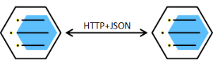

## 2.4 负载均衡

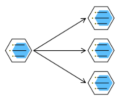

分布式系统中，A服务需要调用B服务，B服务在多台机器中都存在，A调用任意一个服务器均可完成功能。
为了使每一个服务器都不要太忙或者太闲,我们可以负载均衡的调用每一个服务器，提升网站的健壮性。

**常见的负裁均衡算法:**
轮询:为第一一个请求选择健康池中的第一个后端服务器， 然后按顺序往后依次选择，直到最后一个，然后循环。
最小连接:优先选择连接数最少，也就是压力最小的后端服务器，在会话较长的情况下可以考虑采取这种方式。
散列:根据请求源的IP 的散列(hash) 来选择要转发的服务器。这种方式可以一定程度上保证特定用户能连接到相同的服务器。如果你的应用需要处理状态而要求用户能连接到和之前相同的服务器，可以考虑采取这种方式。


## 2.5 服务注册/发现&注册中心

A服务调用B服务，A服务并不知道B服务当前在哪几台服务器有，哪些正常的，哪些服务已经下线。解决这个问题可以引入注册中心。


如果某些服务下线，我们其他人可以实时的感知到其他服务的状态，从而避免调用不可用的服务。


## 2.6 配置中心

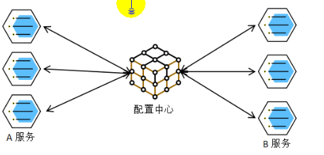

每一个服务:最终都有大量的配置,并且每个服务都可能部署在多台机器.上。我们经常需要变更配置，我们可以让每个服务在配置中心获取自己的配置。
**配置中心用来集中管理微服务的配置信息**。


## 2.7 服务熔断&服务降级

在微服务架构中，微服务之间通过网络进行通信，存在相互依赖，当其中一个服务不可用时，有可能会造成雪崩效应，要防止这样的情况，必须要有容错机制来保护服务。

+ **服务熔断**
  设置服务的超时，当被调用的服务经常失败到达某个阈值，我们可以开启断路保护机制，后来的请求不再去调用这个服务。本地直接返回默认的数据。
+ **服务降级**
  在运维期间，当系统处于高峰期，系统资源紧张，我们可以让非核心业务降级运行。降级:某些服务不处理,或者简单处理[抛异常、返回NULL、调用Mock数据、调用Fallback处理逻辑。


## 2.8 API网关

在微服务架构中，API Gateway作为整体架构的重要组件，它抽象了微服务中部需要的公共功能，同时提供了客户端负载均衡，服务自动熔断，灰度发布，统-认证，限流流控，日志统计等丰富的功能，帮助我们解决很多API管理难题。


# 3.架构分析

## 3.1 微服务架构图

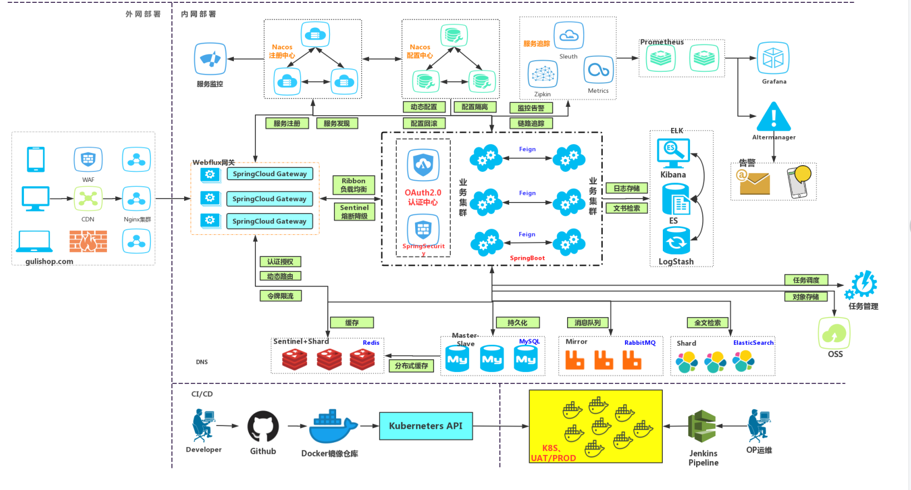


## 3.2 微服务划分图

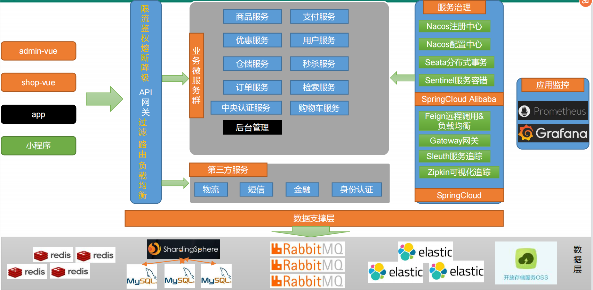


# 4.环境搭建

## 4.1 安装虚拟机


## 4.2 安装Docker

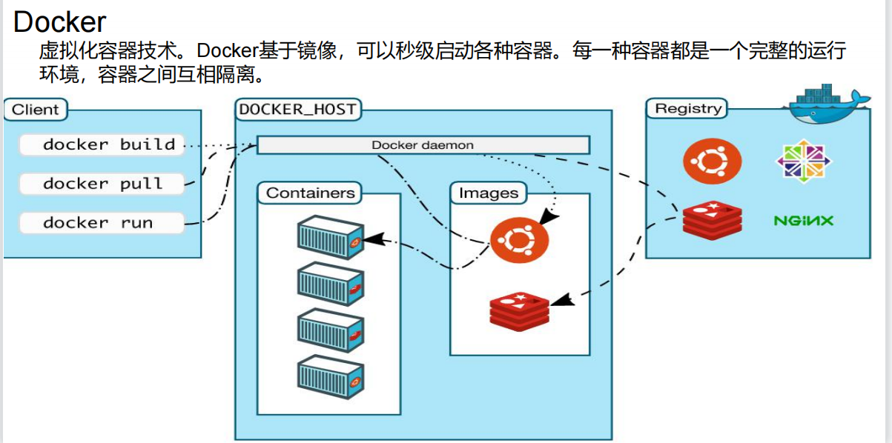

安装过程跟着官网走


+ 配置阿里云镜像加速

  ```bash
  sudo mkdir -p /etc/docker
  sudo tee /etc/docker/daemon.json <<-'EOF'
  {
    "registry-mirrors": ["https://t3o5y425.mirror.aliyuncs.com"]
  }
  EOF
  sudo systemctl daemon-reload
  sudo systemctl restart docker
  ```

  

## 4.3 Docker安装mysql

```bash
docker pull mysql:8.0
```


```bash
docker run -p 3306:3306 --name mysql -v /mydata/mysql/log:/var/log/mysql -v /mydata/mysql/data:/var/lib/mysql -v /mydata/mysql/conf:/etc/mysql -e MYSQL_ROOT_PASSWORD=root -d mysql:8.0 
参数说明-p 3306:3306：将容器的 3306 端口映射到主机的 3306 端口 
-v /mydata/mysql/conf:/etc/mysql：将配置文件夹挂载到主机 
-v /mydata/mysql/log:/var/log/mysql：将日志文件夹挂载到主机 
-v /mydata/mysql/data:/var/lib/mysql/：将配置文件夹挂载到主机 
-e MYSQL_ROOT_PASSWORD=root：初始化 root 用户的密码
```

-v 目录挂载


配置mysql

```bash
vi /mydata/mysql/conf/my.cnf
[client]
default-character-set=utf8 

[mysql]
default-character-set=utf8 

[mysqld]
init_connect='SET collation_connection = utf8_unicode_ci'
init_connect='SET NAMES utf8'
character-set-server=utf8
collation-server=utf8_unicode_ci
skip-character-set-client-handshake
skip-name-resolve
```


## 4.4 Docker安装Redis

`docker pull redis`


+ 创建实例并启动

  ```bash
  mkdir -p /mydata/redis/conf 
  touch /mydata/redis/conf/redis.conf 
  docker run -p 6379:6379 --name redis -v /mydata/redis/data:/data -v /mydata/redis/conf/redis.conf:/etc/redis/redis.conf -d redis redis-server /etc/redis/redis.conf
  ```

+ 持久化，密码设置，直接在配置文件更改

  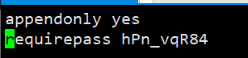


## 4.5 配置Git

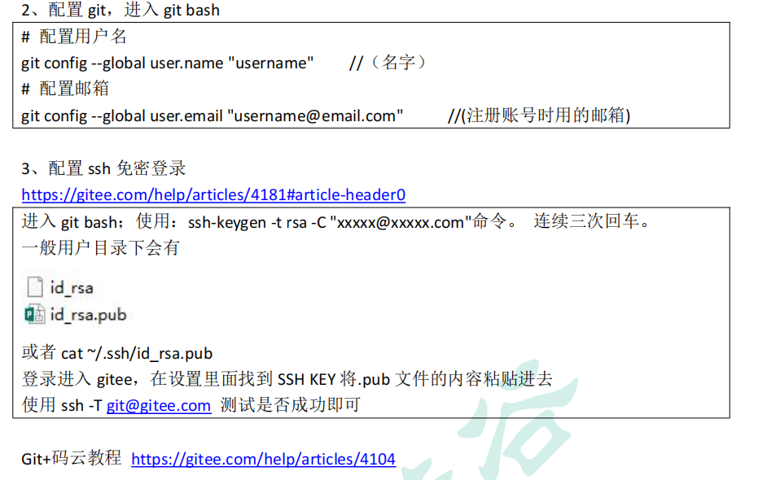


## 4.6 项目环境构建&提交到git

### 4.6.1 创建项目微服务

**==版本选择：SpringBoot2.1.8.RELEASE,Cloud:Greenwich.SR3,Alibaba:2.1.0.RELEASE==**

商品服务，仓储服务，订单服务，优惠券服务，用户服务

+ 共同点：
  + web，openfegin
  + 每一个服务，包名`com.cucn.ingmall.服务名(product/order/ware/coupon/member)`
  + 模块名`ingmall-服务名(product/order/ware/coupon/member)`

+ 配置.gitignore


## 4.7 数据库初始化

所有数据库，**==不建立外键==**

分别创建五个数据库

+ oms：订单系统
  + oms_order	订单
  + oms_order_item	订单项信息
  + oms_order_operate_history	订单操作历史记录
  + oms_order_return_apply	订单退货申请
  + oms_order_return_reason	退货原因
  + oms_order_setting	订单配置信息
  + oms_payment_info	支付信息表
  + oms_refund_info	退款信息
+ pms：商品系统
  + pms_brand：商品品牌表
  + pms_category：商品分类表
  + pms_category_brand_relation：品牌与分类关联表（品牌与分类是多对多关系）
  + pms_attr：商品属性表
  + pms_attr_group：属性分组表
  + pms_attr_attrgroup_relation：属性&属性分组关联表
  + pms_product_attr_value：SPU属性值表
  + pms_spu_info：SPU信息表
  + pms_sku_info：sku信息表
  + pms_sku_images：sku图片表
  + pms_sku_sale_attr_value：sku销售属性&值表
  + pms_comment_replay：商品评价回复关系表
  + pms_spu_comment：商品评价
  + pms_spu_images：spu图片（图集）
  + pms_spu_info_desc：spu信息介绍（介绍大图）
+ sms：营销系统
  + sms_coupon：优惠券信息
  + sms_coupon_history：优惠券领取历史记录
  + sms_coupon_spu_category_relation：优惠券分类关联
  + sms_coupon_spu_relation：优惠券与产品关联
  + sms_home_adv：首页轮播广告
  + sms_home_subject：首页专题表【jd首页下面很多专题，每个专题链接新的页面，展示专题商品信息】
  + sms_home_subject_spu：专题商品
  + sms_member_price：商品会员价格
  + sms_seckill_promotion：秒杀活动
  + sms_seckill_session：秒杀活动场次
  + sms_seckill_sku_notice：秒杀商品通知订阅
  + sms_seckill_sku_relation：秒杀活动商品关联
  + sms_sku_full_reduction：商品满减信息
  + sms_sku_ladder：商品阶梯价格
  + sms_spu_bounds：商品spu积分设置
+ ums：用户系统
  + ums_growth_change_history	成长值变化历史记录
  + ums_integration_change_history	积分变化历史记录
  + ums_member	会员
  + ums_member_collect_spu	会员收藏的商品
  + ums_member_collect_subject	会员收藏的专题活动
  + ums_member_level	会员等级
  + ums_member_login_log	会员登录记录
  + ums_member_receive_address	会员收货地址
  + ums_member_statistics_info	会员统计信息
+ wms：库存系统

  + wms_purchase	采购单
  + wms_purchase_detail	采购需求
  + wms_ware_info	仓库信息
  + wms_ware_order_task	库存工作单
  + wms_ware_order_task_detail	库存工作单（采购单）
  + wms_ware_sku	商品库存


# 5.快速开发

## 5.1 使用人人开源搭建后台管理系统


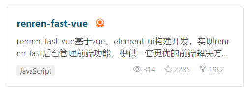

+ 使用人人开源项目，快速搭建后台脚手架

+ 修改代码调整为需要的业务逻辑

+ 创建各个微服务以及数据库
+ 创建数据库ingmall_admin为后台管理数据库


**前端使用reren-fast-vue**

==此处应注意node-sass与sassloader与node版本对应关系！！！！！！==


## 5.2 使用人人开源renren-generator快速开发搭建逆向工程

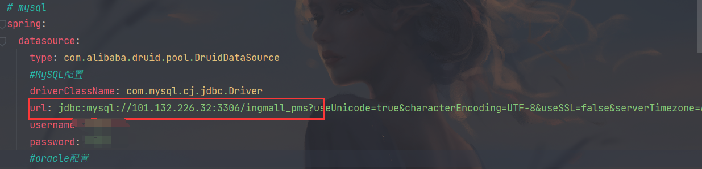

需要生成哪个数据库的逆向工程就连接哪个数据库


在配置文件中配置相关信息

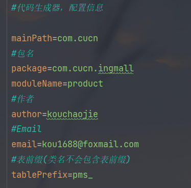


+ 运行后，打开页面`localhost:80`，生成代码

  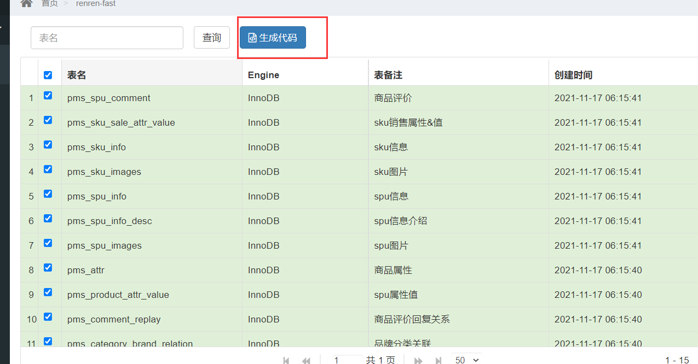

  

  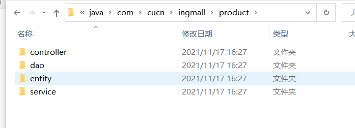

  自动生成基本代码


+ 生成后的代码需要导入相关依赖
+ **创建common模块，存放项目的公共依赖，工具类**

+ 修改逆向工程模板，将不需要的注解注释掉


## 5.3 配置&测试微服务基本CRUD功能

+ **整合MP**

  **数据库驱动8.0可以兼容5.7**

+ 配置数据源

  导入数据库的驱动

  在yml里配置数据源相关信息

+ 配置mybatis-plus

  + 使用`@MapperScan扫描注解扫描mapper接口位置`

  + 告诉mp，xml文件位置，在yml文件配置

  + 配置mp的主键自增策略

    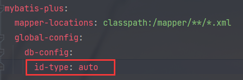


## 5.4 逆向生成所有微服务基本crud代码

构建出项目结构大纲


# 6.分布式组件-SpringCloud

## 6.1 SpringCloud Alibaba简介

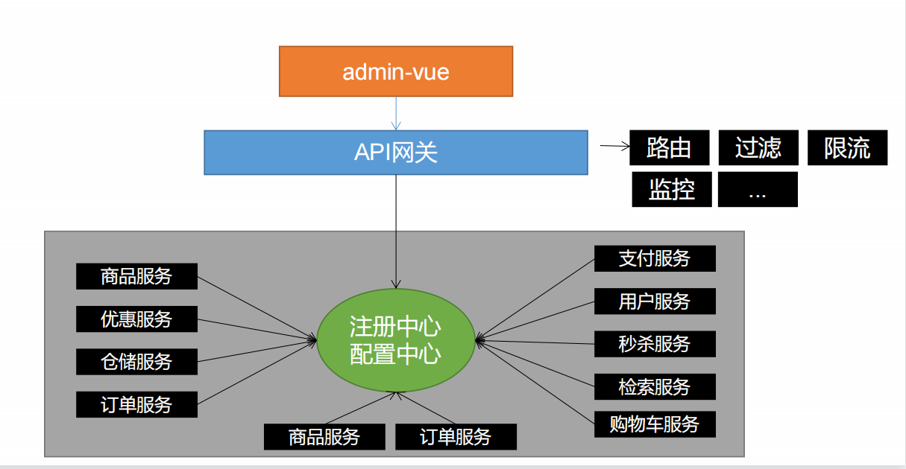


**结合** **SpringCloud Alibaba** **我们最终的技术搭配方案：** 

**SpringCloud Alibaba - Nacos****：注册中心（服务发现/注册）

**SpringCloud Alibaba - Nacos****：配置中心（动态配置管理）

**SpringCloud - Ribbon**：负载均衡

**SpringCloud - Feign**：声明式 **HTTP** **客户端（调用远程服务）** 

**SpringCloud Alibaba - Sentinel**：服务容错（限流、降级、熔断）

**SpringCloud - Gateway**：API **网关（****webflux** **编程模式）** 

**SpringCloud - Sleuth****：调用链监控** 

**SpringCloud Alibaba - Seata**：原Fescar，即分布式事务解决方案


## 6.2 Nacos注册中心

+ 导入依赖

```xml
<!--Nacos服务注册发现-->
<!--服务注册/发现-->
<dependency>
    <groupId>com.alibaba.cloud</groupId>
    <artifactId>spring-cloud-starter-alibaba-nacos-discovery</artifactId>
</dependency>
```


+ 在配置文件中配置Nacos注册中心的地址

  ```yaml
  # nacos
  cloud:
    nacos:
      discovery:
        server-addr: 127.0.0.1:8848
  ```

+ 在启动类上标上注解`EnableDiscoveryClient`

+ 每个微服务都需要有自己的application name，这样才能知道注册中心注册了哪些服务


## 6.3 OpenFeign测试远程调用

+ 引入OpenFeign

+ 编写一个接口，告诉SpringCloud这个接口需要调用远程服务

+ 接口标上注解`FeignClient("调用的服务名称")`

+ 方法直接复制远程请求的方法签名

  方法签名中的请求地址需要复制全部的

+ 开启远程调用功能

  + 启动类标上注解`EnableFeignClients("Feign包的全类名")`


## 6.4 Nacos配置中心

```xml
<dependency>
    <groupId>com.alibaba.cloud</groupId>
    <artifactId>spring-cloud-starter-alibaba-nacos-config</artifactId>
</dependency>
```

+ 创建bootstrap.properties配置文件，该文件会优先于application加载
  + 配置相应的nacos地址和服务名称
+ 在之前配置文件一更改，模块也要重新启动。现在将配置交给配置中心
  + 配置中心添加数据集，默认名为 服务名+properties
+ 在业务类标上注解`@RefreshScope`动态刷新配置
+ 至此`Value`配置就可以动态的刷新

+ 如果配置中心和当前应用配置文件中都配置了相同的项，优先使用配置中心的配置 


### 6.4.1 Nacos配置中心-命名空间与配置分组

+ **命名空间**

  用于进行租户粒度的配置隔离。不同的命名空间下，可以存在相同的 **Group** 或 **Data ID** 的 

  配置。**Namespace** 的常用场景之一是不同环境的配置的区分隔离，例如开发测试环境和生 

  产环境的资源（如配置、服务）隔离等。

  + 读取指定命名空间的配置

    在bootstrap.properties里配置

    ```properties
    spring.cloud.nacos.config.namespace=命名空间ID
    ```

    每一个微服务之间互相隔离配置，每一个微服务都创建一个自己的命名空间

+ **配置集**

  所有配置的集合

+ **配置集ID**

  类似文件名

  Data ID：类似文件名

+ **配置分组**

  默认所有配置集都属于DEFAULT_GROUP:

  spring.cloud.nacos.config.goup=组名


每个微服务创建自己的命名空间，使用配置分组区分环境，dev，test，prod


### 6.4.2 Naocs配置中心-加载多配置集

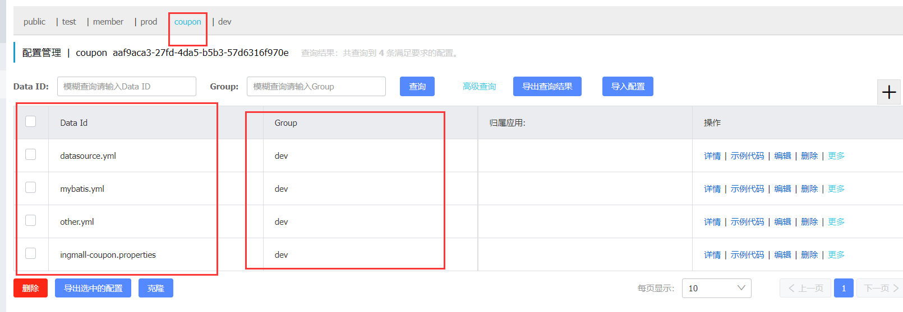

```properties
spring.application.name=ingmall-coupon
spring.cloud.nacos.config.server-addr=127.0.0.1:8848
spring.cloud.nacos.config.namespace=命名空间ID

spring.cloud.nacos.config.ext-config[0].data-id=datasource.yml   配置文件名
spring.cloud.nacos.config.ext-config[0].group=dev  分组
spring.cloud.nacos.config.ext-config[0].refresh=true  是否动态刷新

spring.cloud.nacos.config.ext-config[1].data-id=mybatis.yml
spring.cloud.nacos.config.ext-config[1].group=dev
spring.cloud.nacos.config.ext-config[1].refresh=true

spring.cloud.nacos.config.ext-config[2].data-id=other.yml
spring.cloud.nacos.config.ext-config[2].group=dev
spring.cloud.nacos.config.ext-config[2].refresh=true
```

+ 注意：默认会读取默认分组的：`服务名.properties` 配置文件，如果没有，会读取本地配置文件

  配置文件加上`spring.cloud.nacos.config.group=dev`

  指定加载哪个分组的默认配置文件

+ **总结**

  微服务任何配置信息，任何配置文件都可以放在配置中心

  只需在`bootstrap.properties`说明加载配置文件的规则即可

  `@Value` `@ConfigurationProperties`等等获取值。

  获取配置优先从配置中心获取


## 6.5 Gateway网关

### 6.5.1 核心概念&原理

网关作为流量的入口，常用功能包括路由转发、权限校验、限流控制等。

网关提供 API 全托管服务，丰富的 API 管理功能，辅助企业管理大规模的 API，以降低管理 

成本和安全风险，包括协议适配、协议转发、安全策略、防刷、流量、监控日志等功能。 

Spring Cloud Gateway 旨在提供一种简单而有效的方式来对 API 进行路由，并为他们提供切 

面，例如：安全性，监控/指标 和弹性等。

Spring Cloud Gateway 特点: 

+ 基于 Spring5，支持响应式编程和 SpringBoot2.0 

+ 支持使用任何请求属性进行路由匹配 

+ 特定于路由的断言和过滤器 

+ 集成 Hystrix 进行断路保护 

+ 集成服务发现功能 

+ 易于编写 Predicates 和 Filters 

+ 支持请求速率限制 

+ 支持路径重写


### 6.5.2 创建&测试

+ 开启服务注册/发现
+ 配置nacos的注册中心地址，服务名称


# 7.前端基础


# 8.商品服务-API

## 8.1 三级分类

数据表：**商品三级分类**：**pms_category**

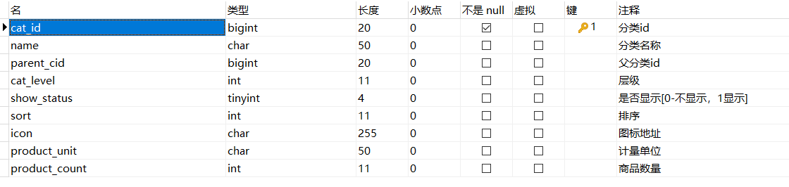

 

### 8.1.1 查询-递归树形结构数据获取

商品分类以三级分类形式展现

后端以Stream流的方式过滤筛选

```java
public List<CategoryEntity> listWithTree() {
    //1.查出所有分类
    List<CategoryEntity> entities = baseMapper.selectList(null);
    //2.组装成父子的树形结构
    //2.1找出所有的一级分类
    //过滤得到一级分类
    List<CategoryEntity> level1Menus = entities.stream().filter(categoryEntity ->
                    categoryEntity.getParentCid() == 0)
            //设置子分类
            .map((menu) -> {
                menu.setChildren(getChildrens(menu, entities));
                return menu;
            })
            //对菜单进行排序
            .sorted((menu1, menu2) -> {
                return (menu1.getSort() == null ? 0 : menu1.getSort()) - (menu2.getSort() == null ? 0 : menu2.getSort());
            })
            //返回集合
            .collect(Collectors.toList());
    return level1Menus;
}
```

然后递归查找子分类

```java
/**
 * 找到当前菜单的子菜单
 *
 * @param root 当前菜单
 * @param all  所有菜单
 * @return 当前菜单的子菜单
 */
private List<CategoryEntity> getChildrens(CategoryEntity root, List<CategoryEntity> all) {
    return all.stream().filter(categoryEntity ->
                    categoryEntity.getParentCid().equals(root.getCatId()))
            .map((categoryEntity) -> {
                //1.找到子菜单
                categoryEntity.setChildren(getChildrens(categoryEntity, all));
                return categoryEntity;
            })
            //排序
            .sorted((menu1, menu2) -> {
                return (menu1.getSort() == null ? 0 : menu1.getSort()) - (menu2.getSort() == null ? 0 : menu2.getSort());
            })
            .collect(Collectors.toList());
}
```


+ 前端使用ElementUI的树形控件进行展示

  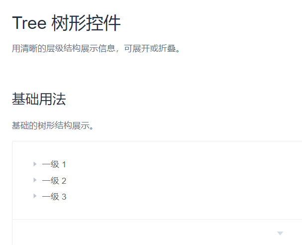


### 8.1.2 配置网关路由与路径重写

+ renren-fast引入注册中心，先引入common依赖
+ 启动类添加`EnableDiscoveryClient`

+ 网关配置路由规则

  后台管理的base_api路径带上/api/

  所有前端项目带/api/前缀的全部路由到renren-fast

  

+ 需要再进行路由重写

  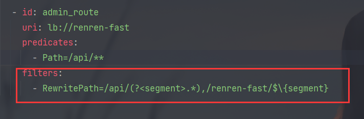

+ 后面具体的路由配置应该放在模糊配置前


### 8.1.3 网关统一配置跨域

指的是浏览器不能执行其他网站的脚本。它是由浏览器的同源策略造成的，是 **浏览器对**javascript**施加的安全限制**。

**同源策略**：是指协议，域名，端口都要相同，其中有一个不同都会产生跨域

```java
/**
 * 解决跨域问题
 *
 * @author KouChaoJie
 * @since: 2021/11/22 20:03
 */
@Configuration
public class IngMallCorsConfiguration {
    @Bean
    public CorsWebFilter corsWebFilter() {
        UrlBasedCorsConfigurationSource source = new UrlBasedCorsConfigurationSource();
        CorsConfiguration corsConfiguration = new CorsConfiguration();
        //1.配置跨域
        //允许哪些请求头进行跨域
        corsConfiguration.addAllowedHeader("*");
        //允许哪些请求方式进行跨域
        corsConfiguration.addAllowedMethod("*");
        //允许哪些请求来源进行跨域
        corsConfiguration.addAllowedOrigin("*");
        //是否允许携带cookie跨域
        corsConfiguration.setAllowCredentials(true);
        source.registerCorsConfiguration("/**", corsConfiguration);
        return new CorsWebFilter(source);
    }
}
```


### 8.1.4 删除-页面效果

+ 添加`:expand-on-click-node="false"`使菜单只有点击箭头时才能展开合并。

+ 优化删除按钮显示效果

  + 只有该菜单没有子菜单时才显示删除按钮
  + v-if判断

  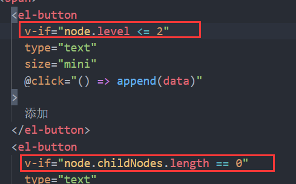


### 8.1.5 逻辑删除

+ 检查当前删除的菜单，是否被别的地方引用

+ 逻辑删除步骤

  + 配置全局逻辑删除规则

    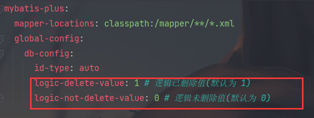

  + 实体类字段加上逻辑删除注解，修改显示规则

    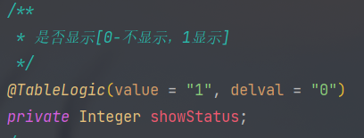

    


### 8.1.6 删除效果细化

前端部分，不做过多解释

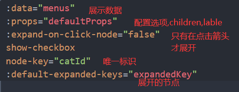

default-expanded-keys：默认展开的节点的 key 的数组

show-checkbox： 节点是否可被选择


### 8.1.7 新增-新增效果完成

+ 点击添加，出现对话框，输入菜单名字，点击确定，添加完成。

+ 使用element-ui的对话框组件完成

+ 添加对话框中需要有输入信息

+ 还需要获取在哪个分类添加的，获取id

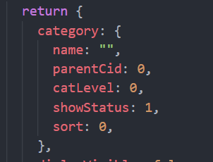

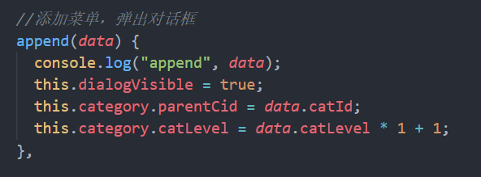

+ 发送post请求到后端save方法

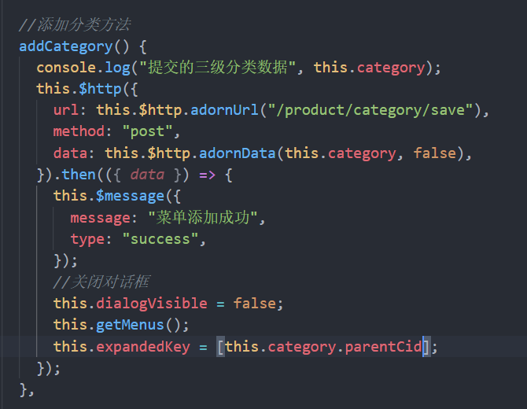


### 8.1.8 修改-基本修改效果

+ 每一个菜单后添加一个修改按钮
+ 点击弹出对话框
+ 对话框回显数据
+ 修改信息，点击确定，完成修改


+ 添加修改共用一个对话框，给对话框一个方法，判断是添加还是修改

  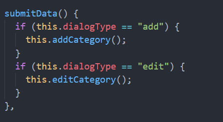

+ 在修改回显时需要实时回显最新的数据，所以回显的时候使用get请求去查询

  后端：

  ```java
  /**
   * 查询某一节点信息
   *
   * @param catId 分类的id
   */
  @RequestMapping("/info/{catId}")
  public R info(@PathVariable("catId") Long catId) {
      CategoryEntity category = categoryService.getById(catId);
      return R.ok().put("data", category);
  }
  ```

  

  前端:

  + 注意回显的数据
  + 注意要修改的数据只有四个
  + 并且在添加的方法上还要重置默认值，防止添加出现回显数据

  ```javascript
      //修改分类,弹出对话框
      edit(data) {
        console.log("要修改的数据", data);
        this.dialogType = "edit";
        this.title = "修改分类";
        this.dialogVisible = true;
        //发送请求获取当前节点最新数据
        this.$http({
          url: this.$http.adornUrl(`/product/category/info/${data.catId}`),
          method: "get",
        }).then(({ data }) => {
          //请求成功
          console.log("要回显的数据", data);
          this.category.name = data.data.name;
          this.category.catId = data.data.catId;
          this.category.icon = data.data.icon;
          this.category.productUnit = data.data.productUnit;
          this.category.parentCid = data.data.parentCid;
          this.category.catLevel = data.data.catLevel;
          this.category.sort = data.data.sort;
          this.category.showStatus = data.data.showStatus;
        });
      },
  
      //修改分类的方法
      editCategory() {
        var { catId, name, icon, productUnit } = this.category;
  
        this.$http({
          url: this.$http.adornUrl("/product/category/update"),
          method: "post",
          data: this.$http.adornData({ catId, name, icon, productUnit }, false),
        }).then(({ data }) => {
          this.$message({
            message: "分类修改成功",
            type: "success",
          });
          //关闭对话框
          this.dialogVisible = false;
          this.getMenus();
          this.expandedKey = [this.category.parentCid];
        });
      },
  ```

  


### 8.1.9 数据库连接的坑

今天开发过程中，在查询数据库时异常慢，报错`com.mysql.cj.exceptions.ConnectionIsClosedException: No operations allowed after connection closed.`

需要配置数据源的最大生命时长`max-lifetime`

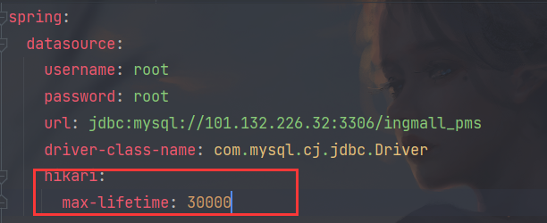


### 8.1.10  修改-拖拽效果

+ 通过Element-ui的可拖拽节点实现
+ 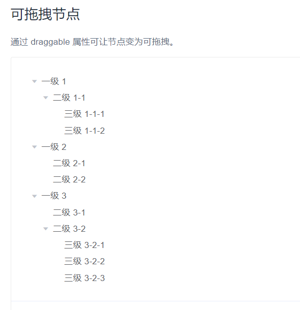

+ 拖拽时需要判断是否可以拖拽到指定位置`allow-drop`属性

  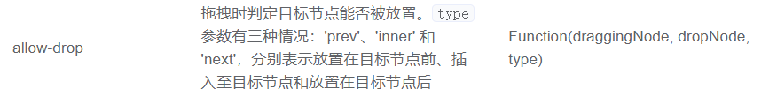

+ 当前节点的总层数+拖拽到指定位置的父节点的总层数不能大于3

  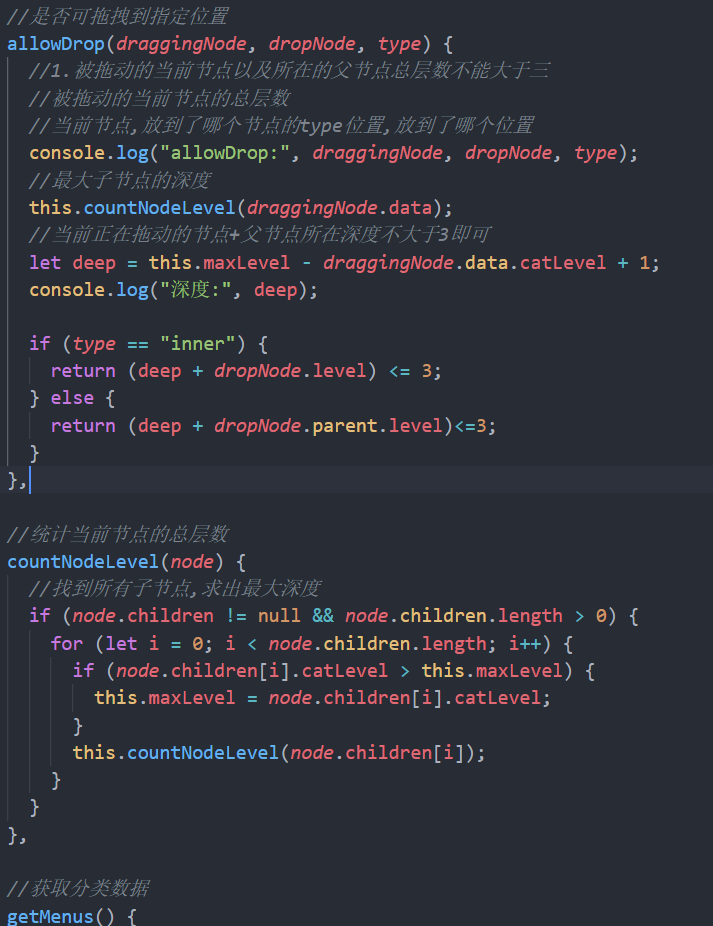


+ 当拖拽成功后要更新节点的数据

+ 需要监听拖拽事件

  

```js
    //拖拽成功后事件
    handleDrop(draggingNode, dropNode, dropType, ev) {
      console.log("handleDrop: ", draggingNode, dropNode, dropType);
      //当前节点最新的父节点id
      let pCid = 0;
      let siblings = null;
      if (dropType == "before" || dropType == "after") {
        pCid =
          dropNode.parent.data.catId == undefined
            ? 0
            : dropNode.parent.data.catId;
        siblings = dropNode.parent.childNodes;
      } else {
        pCid = dropNode.data.catId;
        siblings = dropNode.childNodes;
      }

      //当前拖拽节点的最新顺序
      for (let i = 0; i < siblings.length; i++) {
        if (siblings[i].data.catId == draggingNode.data.catId) {
          //如果遍历的是当前正在拖拽的节点
          let catLevel = draggingNode.level;
          if (siblings[i].level != draggingNode.level) {
            //当前节点层级发生变化
            catLevel = siblings[i].level;
            //修改子节点的层级
            this.updateChildNodeLevel(siblings[i]);
          }
          this.updateNodes.push({
            catId: siblings[i].data.catId,
            sort: i,
            parentCid: pCid,
            catLevel: catLevel,
          });
        } else {
          this.updateNodes.push({ catId: siblings[i].data.catId, sort: i });
        }
      }

      //当前拖拽节点的最新层级

      console.log("updateNodes:", this.updateNodes);
    },

    updateChildNodeLevel(node) {
      if (node.childNodes.length > 0) {
        for (let i = 0; i < node.childNodes.length; i++) {
          var cNode = node.childNodes[i].data;
          this.updateNodes.push({
            catId: cNode.catId,
            catLevel: node.childNodes[i].level,
          });
          this.updateChildNodeLevel(node.childNodes[i]);
        }
      }
    },
```


### 8.1.11 修改-拖拽功能完成

+ 后端需要有批量修改分类的接口

  ```java
  /**
   * 拖拽效果完成后,批量修改分类节点的排序
   *
   * @param category 需要修改排序的分类
   * @return 统一结果返回
   */
  @PostMapping("/update/sort")
  public R updateSort(@RequestBody CategoryEntity[] category) {
      categoryService.updateBatchById(Arrays.asList(category));
      return R.ok();
  }
  ```

+ 然后前端发送请求到后端

+ 每次拖拽完成`updateNodes: [],maxLevel: 0, //最大深度`需要退回默认值

+ 完成批量拖拽效果

  + 添加开启拖拽功能按钮
  + 如果每次拖拽都会查询数据库，造成性能浪费，添加保存按钮，完成操作后保存才去连接数据库
  + 如果没有开启拖拽，保存按钮不显示


### 8.1.12 删除-批量删除

+ element-ui  tree

  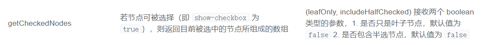

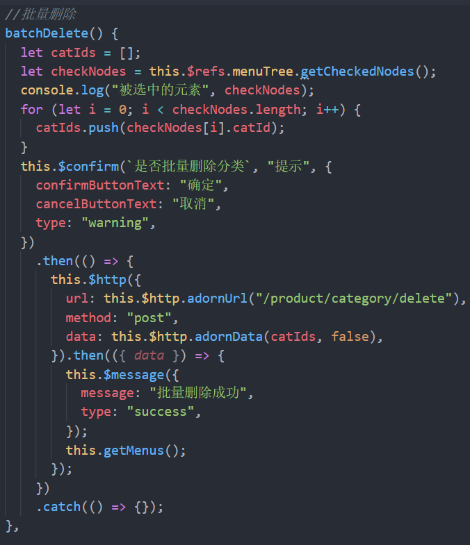


## 8.2 品牌管理-使用逆向工程的前后端代码

**==数据库表对应：pms_brand==**

之前逆向生成的代码里有基本的前端代码，可以拿来直接用

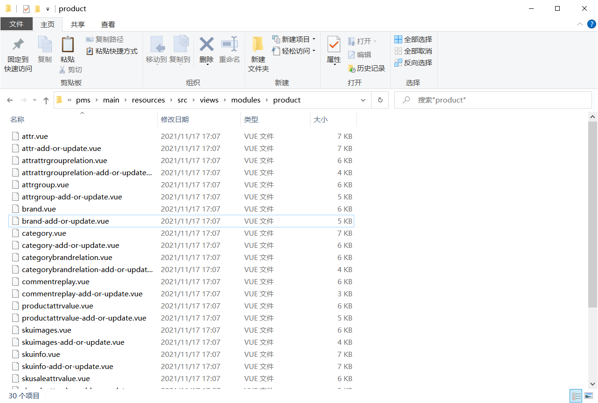


### 8.2.1 效果优化和快速显示开关

+ 显示开关绑定方法

+ 获取整行数据，传递给方法

+ 发送请求时，数据库状态用的是tiny_int，需要判断，直接使用`:active-value="1" :inactive-value="0"`来绑定属性为数字

  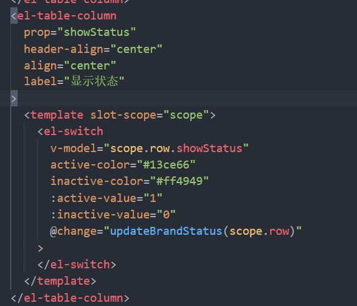

  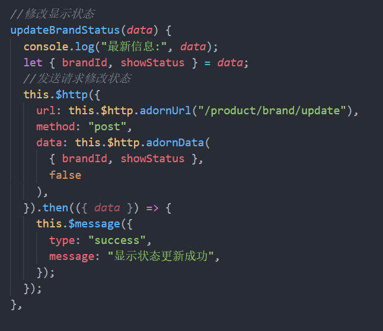


### 8.2.2 OSS对象存储的使用

对象存储服务（Object Storage Service，OSS）是一种海量、安全、低成本、高可靠的云存储 服务，适合存放任意类型的文件。容量和处理能力弹性扩展，多种存储类型供选择，全面优化存储成本。

| 中文      | 英文      | 说明                                                         |
| :-------- | :-------- | :----------------------------------------------------------- |
| 存储空间  | Bucket    | 存储空间是您用于存储对象（Object）的容器，所有的对象都必须隶属于某个存储空间。 |
| 对象/文件 | Object    | 对象是 OSS 存储数据的基本单元，也被称为OSS的文件。对象由元信息（Object Meta）、用户数据（Data）和文件名（Key）组成。对象由存储空间内部唯一的Key来标识。 |
| 地域      | Region    | 地域表示 OSS 的数据中心所在物理位置。您可以根据费用、请求来源等综合选择数据存储的地域。详情请查看[OSS已经开通的Region](https://help.aliyun.com/document_detail/31837.htm#concept-zt4-cvy-5db)。 |
| 访问域名  | Endpoint  | Endpoint 表示OSS对外服务的访问域名。OSS以HTTP RESTful API的形式对外提供服务，当访问不同地域的时候，需要不同的域名。通过内网和外网访问同一个地域所需要的域名也是不同的。具体的内容请参见[各个Region对应的Endpoint](https://help.aliyun.com/document_detail/31837.htm#concept-zt4-cvy-5db)。 |
| 访问密钥  | AccessKey | AccessKey，简称 AK，指的是访问身份验证中用到的AccessKeyId 和AccessKeySecret。OSS通过使用AccessKeyId 和AccessKeySecret对称加密的方法来验证某个请求的发送者身份。AccessKeyId用于标识用户，AccessKeySecret是用户用于加密签名字符串和OSS用来验证签名字符串的密钥，其中AccessKeySecret 必须保密。 |

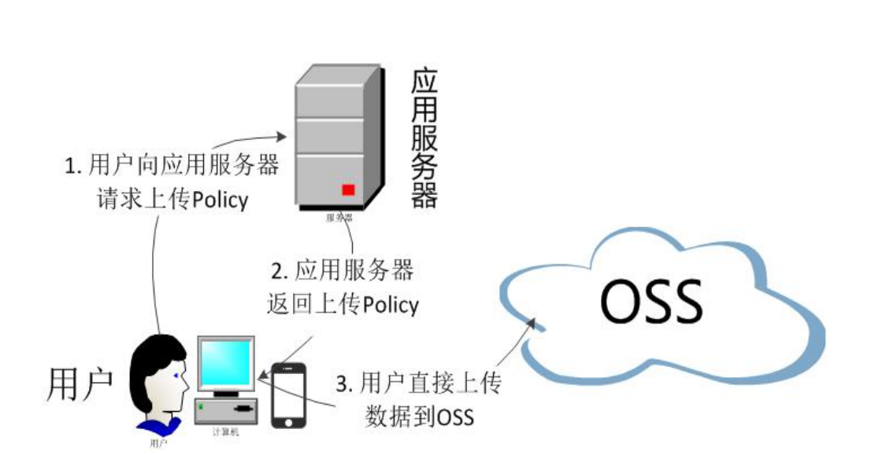


```xml
<!--阿里云oss-->
<dependency>
    <groupId>com.alibaba.cloud</groupId>
    <artifactId>spring-cloud-starter-alicloud-oss</artifactId>
</dependency>
```


+ 在配置文件配置对应的accessKey,endpoint

  ```properties
  // application.properties
  spring.cloud.alicloud.access-key=******
  spring.cloud.alicloud.secret-key=***********
  spring.cloud.alicloud.oss.endpoint=**********
  ```

+ 这里我在nacos配置中心中配置

+ 测试

  ```java
  @Test
  public void testUpload() throws FileNotFoundException {
      // 填写本地文件的完整路径。如果未指定本地路径，则默认从示例程序所属项目对应本地路径中上传文件流。
      InputStream inputStream = new FileInputStream("C:\\Users\\Kou\\Desktop\\毕业设计论文\\毕业设计微服务架构图.png");
      // 依次填写Bucket名称（例如examplebucket）和Object完整路径（例如exampledir/exampleobject.txt）。Object完整路径中不能包含Bucket名称。
      ossClient.putObject("ingmall", "毕业设计微服务架构图.png", inputStream);
      // 关闭OSSClient。
      ossClient.shutdown();
      System.out.println("上传完成");
  }
  ```

+ 流程总结
  + 引入oss-starter
  + 配置key，endpoint相关信息
  + 使用ossclient进行相关操作


### 8.2.3 OSS获取服务端签名

**创建新微服务模块整合第三方功能：ingmall-third-party**

+ 将oss整合进网关

+ 查看阿里云官方sdk获取服务端签名

  ```java
  /**
   * 获取阿里云oss服务端签名
   *
   * @return map
   */
  @RequestMapping("/oss/policy")
  public Map<String, String> policy() {
      // host的格式为 bucketname.endpoint
      //https://ingmall.oss-cn-shanghai.aliyuncs.com/hahha.png
      String host = "https://" + bucket + "." + endpoint;
      // 用户上传文件时指定的前缀。
      String dir = new SimpleDateFormat("yyyy-MM-dd").format(new Date());
      Map<String, String> respMap = null;
      try {
          long expireTime = 30;
          long expireEndTime = System.currentTimeMillis() + expireTime * 1000;
          Date expiration = new Date(expireEndTime);
          // PostObject请求最大可支持的文件大小为5 GB，即CONTENT_LENGTH_RANGE为5*1024*1024*1024。
          PolicyConditions policyConds = new PolicyConditions();
          policyConds.addConditionItem(PolicyConditions.COND_CONTENT_LENGTH_RANGE, 0, 1048576000);
          policyConds.addConditionItem(MatchMode.StartWith, PolicyConditions.COND_KEY, dir);
          String postPolicy = ossClient.generatePostPolicy(expiration, policyConds);
          byte[] binaryData = postPolicy.getBytes("utf-8");
          String encodedPolicy = BinaryUtil.toBase64String(binaryData);
          String postSignature = ossClient.calculatePostSignature(postPolicy);
          respMap = new LinkedHashMap<>();
          respMap.put("accessid", accessId);
          respMap.put("policy", encodedPolicy);
          respMap.put("signature", postSignature);
          respMap.put("dir", dir);
          respMap.put("host", host);
          respMap.put("expire", String.valueOf(expireEndTime / 1000));
          // respMap.put("expire", formatISO8601Date(expiration));
      } catch (Exception e) {
          // Assert.fail(e.getMessage());
          System.out.println(e.getMessage());
      } finally {
          ossClient.shutdown();
      }
      return respMap;
  }
  ```


+ 需要给oss配置跨域规则

  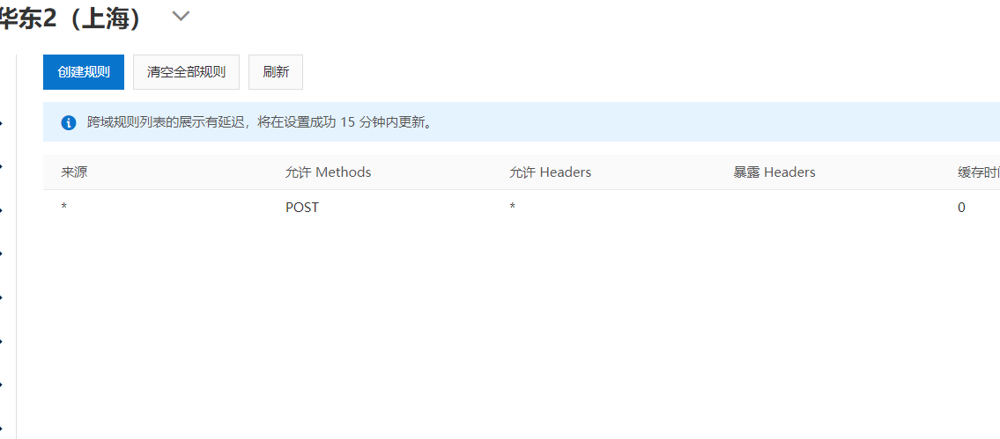


### 8.2.4 OSS前后端联调测试上传

elementui upload组件

+ 外网访问域名

  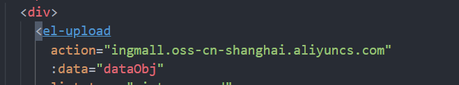


### 8.2.5 表单校验-自定义校验器

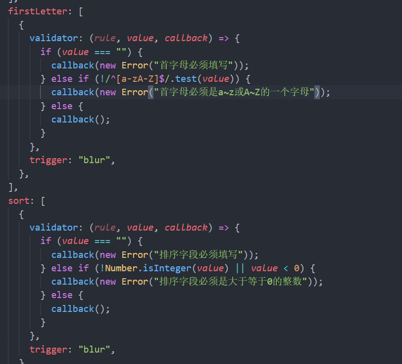

+ 前端保证发给后端的数据是正确的
+ 但是前端校验可以被篡改，非常危险，所以后端也需要校验


### 8.2.6 JSR303数据后端校验

+ 使用JSR303进行后端层面的校验
+ 给Bean加上校验注解
  + `@Email` `@NotNull`等等等
  + `javax.validation.constraints`
  + 添加校验注解，并添加自己的消息提示
  + 开启校验功能，`@Valid`标注到指定Bean位置(Controller方法的形参)
  + 在校验的Bean后面紧跟一个BindingResult，就可以获取到校验的结果
  + 可以在字段的校验注解上自定义提示信息
  + 所有自定义的校验可以使用`@Pattern`


### 8.2.7 统一异常处理

在这里定义下项目错误码标准

系统错误码：

+ 错误码和错误信息定义类
  + 错误码定义规则5位数字
  + 前两位表示业务场景，最后三位表示错误码。例如：10001。10：通用   001：系统未知异常
  + 维护错误码后需要维护错误描述，将他们定义为枚举形式
  + 错误码列表
    + 10 通用
    + 11 商品
    + 12 订单
    + 13 购物车
    + 14 物流

+ 定义一个枚举类，封装所有状态码

  ```java
  /*
   * @author KouChaoJie
   * @since: 2021/11/26 16:51
   */
  public enum BizCodeEnume {
      /**
       * 系统未知异常状态码
       */
      UNKNOW_EXCEPTION(10000, "系统未知异常"),
      /**
       * 参数校验异常状态码
       */
      VAILD_EXCEPTION(10001, "参数格式校验失败");
  
      private int code;
      private String msg;
  
      BizCodeEnume(int code, String msg) {
          this.code = code;
          this.msg = msg;
      }
  
      public int getCode() {
          return code;
      }
  
      public String getMsg() {
          return msg;
      }
  }
  ```

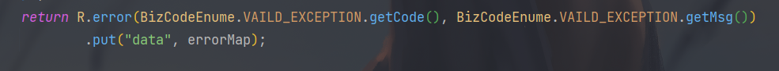


`@ControllerAdvice`

集中处理所有异常

```java
/**
 * 统一异常处理
 *
 * @author KouChaoJie
 * @since: 2021/11/26 16:30
 */
@Slf4j
@RestControllerAdvice
@ControllerAdvice(basePackages = "com.cucn.ingmall.product.controller")
public class IngmallExceptionControllerAdvice {
    /**
     * 处理数据校验异常
     *
     * @param e 数据校验异常类
     * @return 统一结果返回
     */
    @ExceptionHandler(value = MethodArgumentNotValidException.class)
    public R handleVaildException(MethodArgumentNotValidException e) {
        log.error("数据校验出现问题:{},异常类型:{}", e.getMessage(), e.getClass());
        BindingResult bindingResult = e.getBindingResult();
        Map<String, String> errorMap = new HashMap<>();
        bindingResult.getFieldErrors().forEach(fieldError -> {
            errorMap.put(fieldError.getField(), fieldError.getDefaultMessage());
        });
        return R.error(BizCodeEnume.VAILD_EXCEPTION.getCode(), BizCodeEnume.VAILD_EXCEPTION.getMsg())
        .put("data", errorMap);
    }
}
```


### 8.2.8 JSR303分组校验

+ 给校验注解标注什么情况需要进行校验

  `@NotBlank(message = "品牌名不能为空", groups = {AddGroup.class, UpdateGroup.class})`

+ 在Controller方法参数标上注解`@Validated({UpdateGroup.class})` 可以指定该参数参与哪个分组的校验

+ 默认没有指定分组的校验注解，在分组校验情况下不生效。


### 8.2.9 JSR303自定义校验注解

+ 编写一个自定义的校验注解

  ```java
  @Documented
  @Constraint(validatedBy = {})
  @Target({METHOD, FIELD, ANNOTATION_TYPE, CONSTRUCTOR, PARAMETER, TYPE_USE})
  @Retention(RUNTIME)
  public @interface ListValue {
      String message() default "{com.cucn.common.valid.ListValue.message}";
      Class<?>[] groups() default {};
      Class<? extends Payload>[] payload() default {};
      int[] values() default {};
  }
  ```

+ 编写一个自定义的校验器

  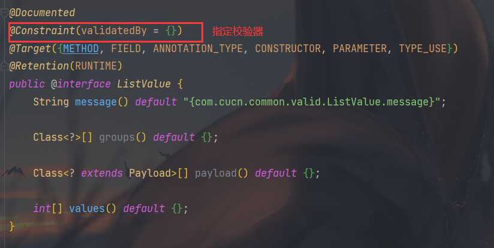

  ```java
  /**
   * ListValue注解的校验器
   * 类型参数：
   * <A> – 实现处理的注解类型 - @ListValue
   * <T> – 实现支持的目标类型 - Integer
   *
   * @author KouChaoJie
   * @since: 2021/11/29 10:16
   */
  public class ListValueConstraintValidator implements ConstraintValidator<ListValue, Integer> {
      private Set<Integer> vals = new HashSet<>();
      /**
       * 初始化方法
       * 获取ListValue的详细信息
       */
      @Override
      public void initialize(ListValue constraintAnnotation) {
          int[] values = constraintAnnotation.values();
          if (values.length <= 0) {
              return;
          }
          for (int value : values) {
              vals.add(value);
          }
      }
      /**
       * 判断是否校验成功
       *
       * @param value 需要校验的值
       */
      @Override
      public boolean isValid(Integer value, ConstraintValidatorContext context) {
          return vals.contains(value);
      }
  }
  ```

+ 关联自定义的校验器和自定义的校验注解

  **可以指定多个不同的校验器，适配不同类型的校验**

  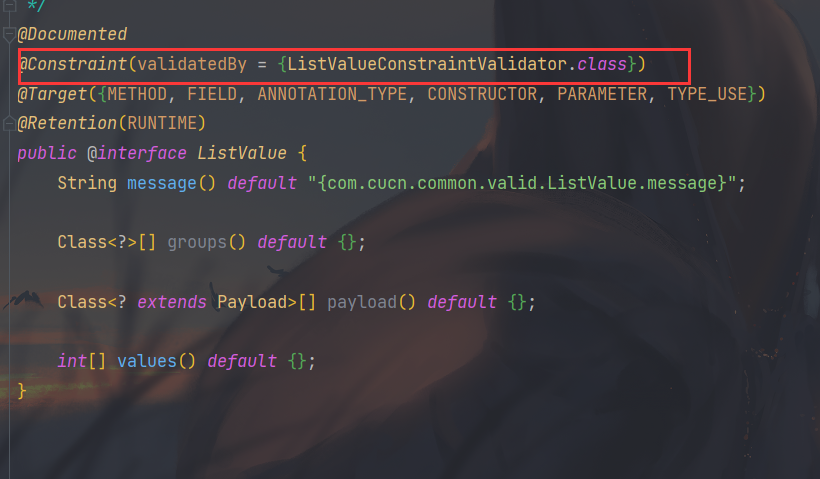


#### 遇到的坑

在只修改状态时，后端参数校验仍然校验了全部属性，原因是因为所有修改共用一个方法，所以修改状态应该单独用一个方法，校验重新建立一个分组。

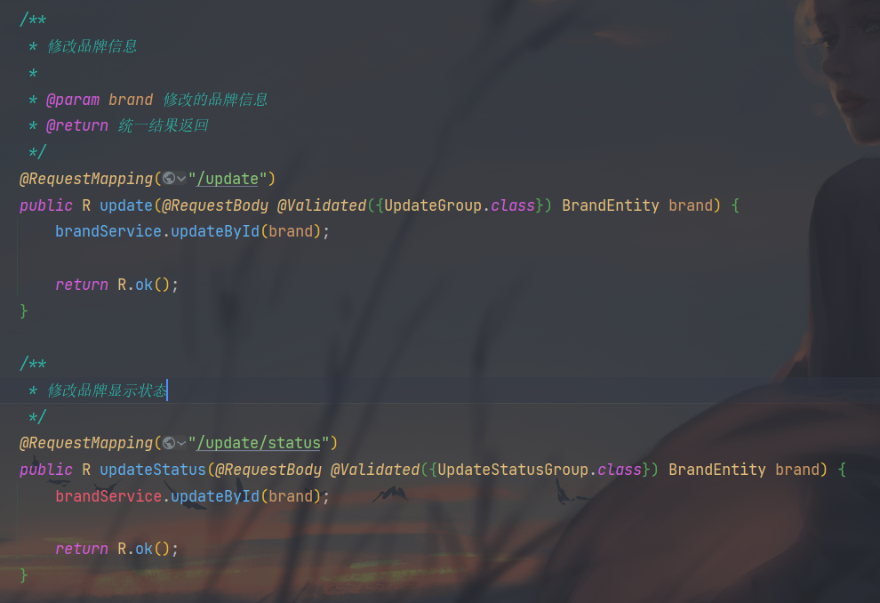


### 8.2.10 品牌分类关联与级联更新

+ 目前的品牌分页是错的，原因是需要引入mp的分页插件


​	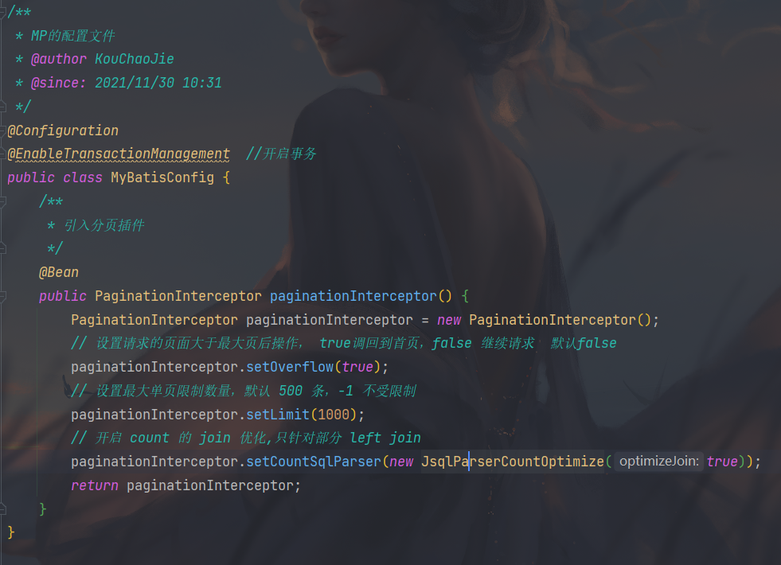


+ 每个品牌都需要有自己的分类，一个品牌也可以有多个分类，一个分类会有多个品牌，是一个多对多的关系。接下来对品牌分类进行关联。

+ 接口文档要求：

  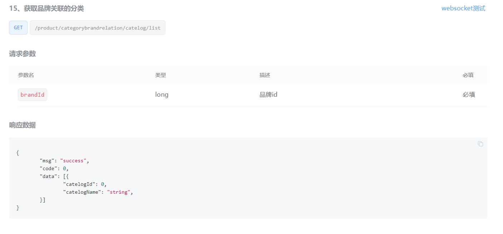

  ```java
  /**
   * 获取当前品牌关联的所有分类列表
   *
   * @param brandId 品牌id
   * @return 统一结果返回
   */
  @GetMapping("/catelog/list")
  public R catelogList(@RequestParam Long brandId) {
      List<CategoryBrandRelationEntity> data = categoryBrandRelationService.list(
              new QueryWrapper<CategoryBrandRelationEntity>()
                      .eq("brand_id", brandId));
      return R.ok().put("data", data);
  }
  ```

+ 新增品牌与分类关联关系接口文档：

  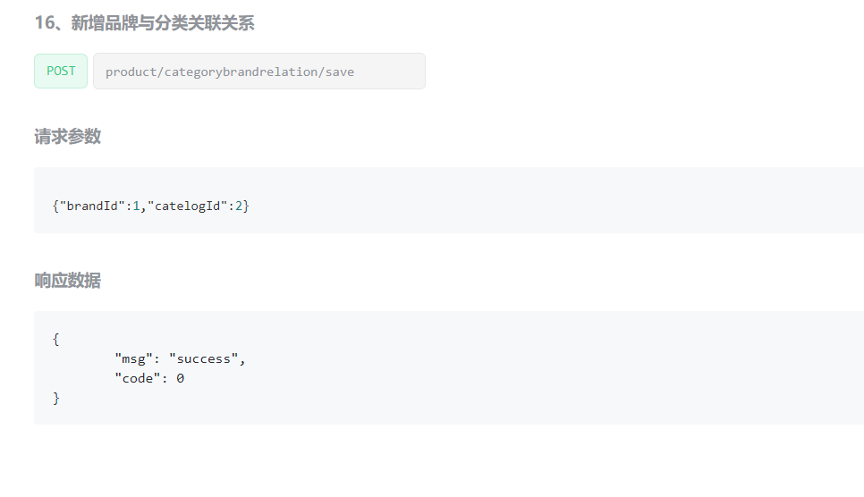
  + 要根据品牌id与分类id查询出详细信息

    ```java
    /**
     * 新增品牌与分类关联关系
     *
     * @param categoryBrandRelation 前端传来的关联关系:brandId,catelogId
     */
    @Override
    public void saveDetail(CategoryBrandRelationEntity categoryBrandRelation) {
        Long brandId = categoryBrandRelation.getBrandId();
        Long catelogId = categoryBrandRelation.getCatelogId();
        //根据品牌id和分类id查询出name
        categoryBrandRelation.setBrandName(brandDao.selectById(brandId).getName());
        categoryBrandRelation.setCatelogName(categoryDao.selectById(catelogId).getName());
        this.save(categoryBrandRelation);
    }
    ```


+ **==数据同步问题==**

  + 当品牌表与分类表发生变动时，那么关联表内容也应该要变动

  + 在品牌与分类修改方法，也要修改关联表的数据

  + 以更新分类为例

    ```java
    /**
     * 修改细节（关联表连带修改）
     *
     * @param category 修改的分类信息
     */
    @Override
    @Transactional
    public void updateCascade(CategoryEntity category) {
        this.updateById(category);
        if (!StringUtils.isEmpty(category.getName())) {
            //同步关联表信息
            categoryBrandRelationService.updateCategory(category.getCatId(), category.getName());
        }
        //KouTODO:2021/11/30 13:34 Kou 更新关联其他表
    }
    ```


## 8.3 属性分组

### 8.3.1 SPU&SKU&规格参数&销售属性

**SPU**：Standard Product Unit（标准化产品单元）

是商品信息聚合的最小单位，是一组可复用、易检索的标准化信息的集合，该集合**描述了一** **个产品的特性。**


**SKU**：Stock Keeping Unit（库存量单位）

即库存进出计量的基本单元，可以是以件，盒，托盘等为单位。SKU 这是对于大型连锁超市 DC（配送中心）物流管理的一个必要的方法。现在已经被引申为产品统一编号的简称，每 种产品均对应有唯一的 SKU 号


每个分类下的商品共享规格参数，与销售属性。只是有些商品不一定要用这个分类下全部的 属性； 

+ 属性是以三级分类组织起来的 

+ 规格参数中有些是可以提供检索的 

+ 规格参数也是基本属性，他们具有自己的分组 

+ 属性的分组也是以三级分类组织起来的 

+ 属性名确定的，但是值是每一个商品不同来决定的


决定SKU的属性叫做销售属性，切换销售属性的时候规则参数是基本不变的


+ **以京东iphone13为例**

  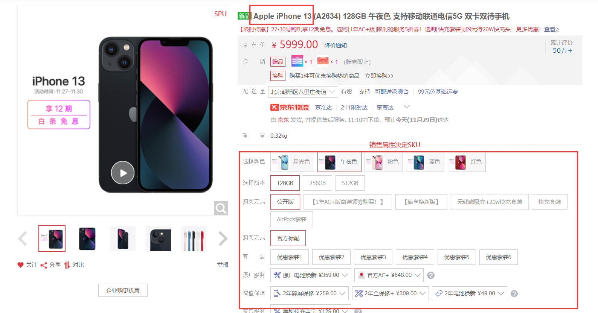

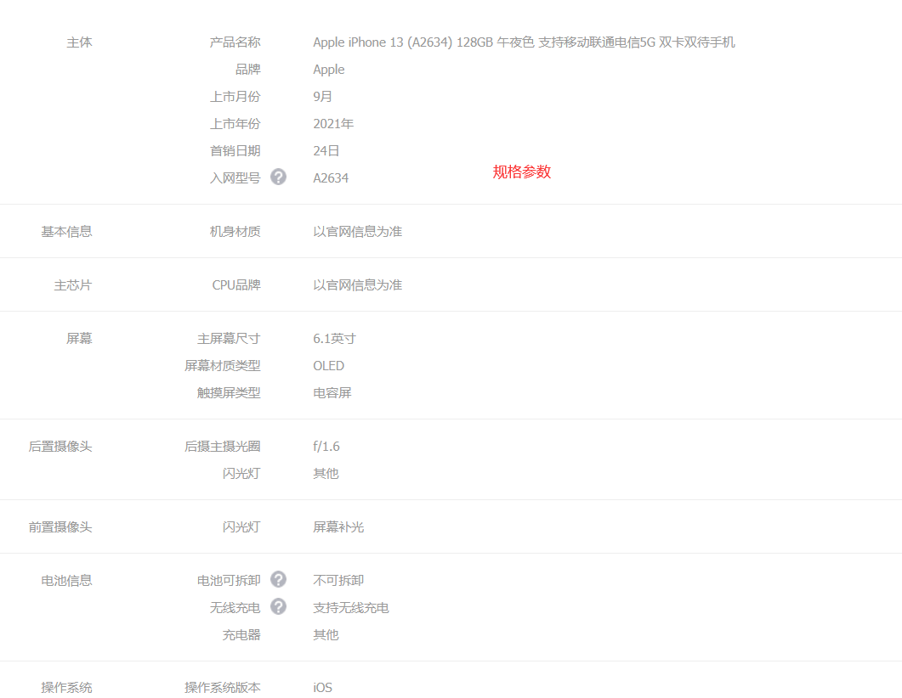

一个大类里的规格参数的key应该是一样的，而对应的value不同


+ 同一个SPU旗下的不同SKU产品共享商品介绍，规格与包装
+ 规格参数的基本属性（key）都是以三级分类组织起来的，比如手机下的key应该是一样的，而对应的value不同
+ 部分规格参数的属性应该提供检索
+ 规格参数属性以分组为单位
+ 属性的分组也是以三级分类组织起来的 

+ 属性名确定的，但是值是每一个商品不同来决定的


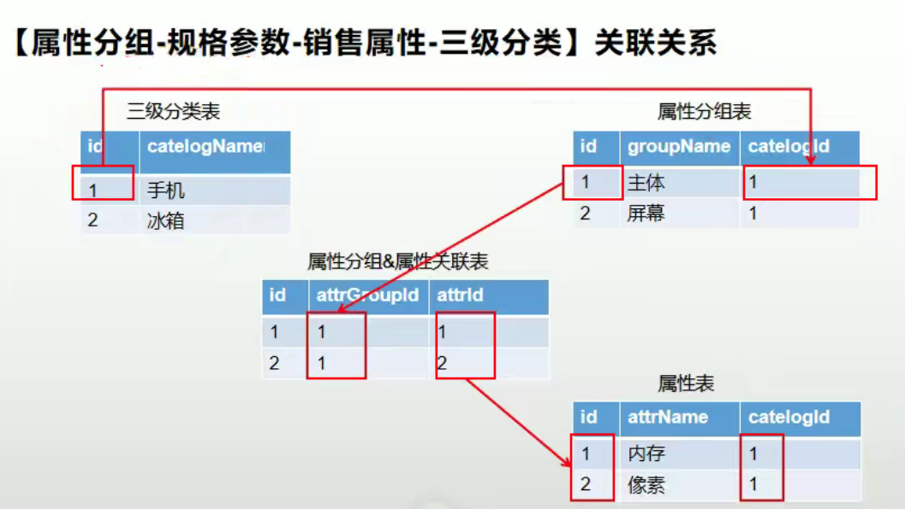

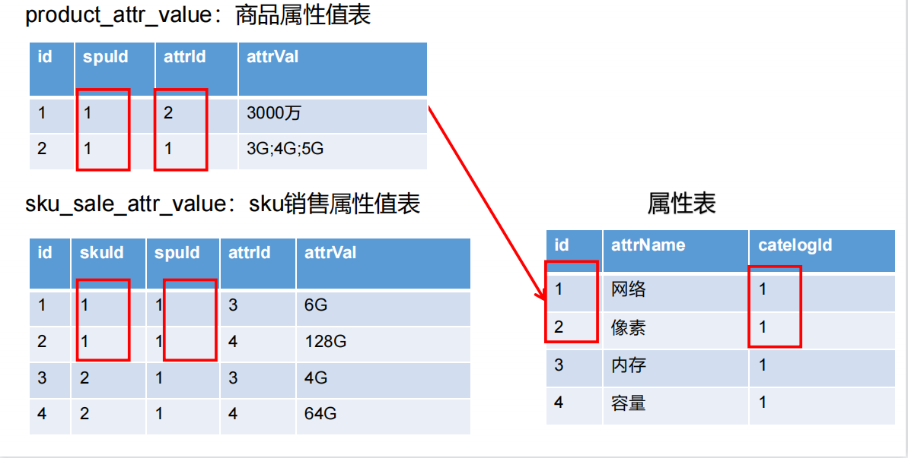


### 8.3.2 前端组件抽取&父子组件交互

效果：

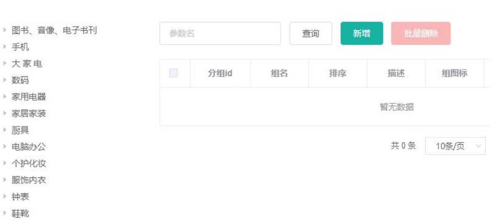


+ 抽取三级分类列表 ，导入到属性分组页。

  

  

  

+ 当点击某个分类时，表格需要显示对应的属性分组

  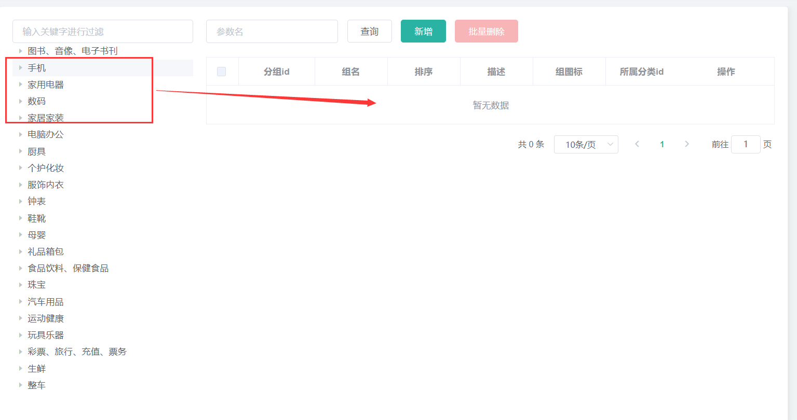

接口文档：**https://easydoc.xyz/#/s/78237135**


+ **==父子组件传递数据==**

  + 子组件给父组件传递数据，使用事件机制

    子组件给父组件发送一个事件，携带上数据。

    **Tree的事件**

    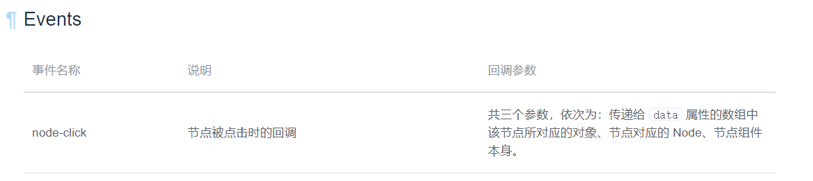

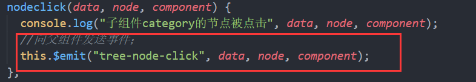


### 8.3.3 获取分类属性分组

+ 编写后端接口

  文档：

  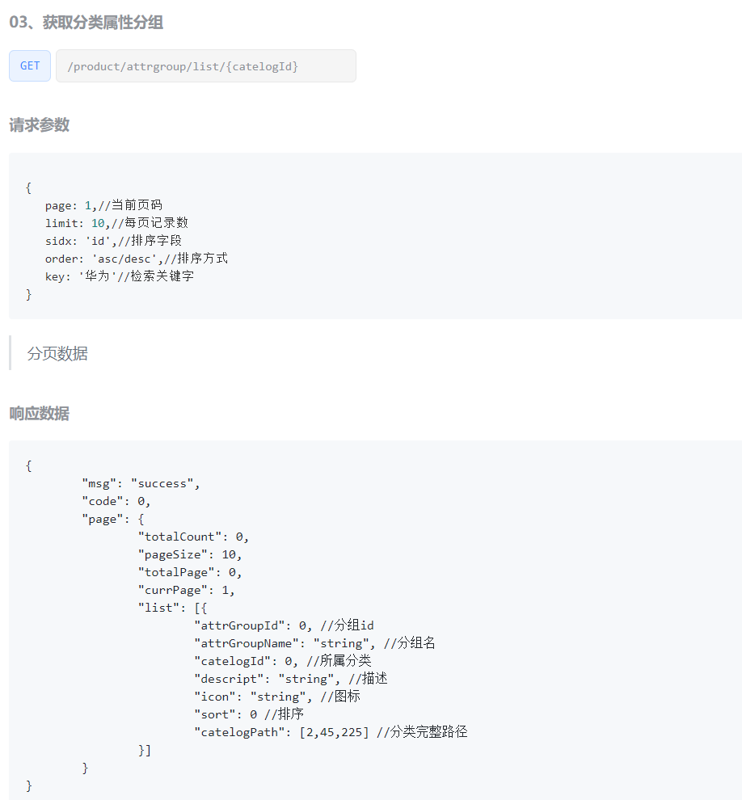

  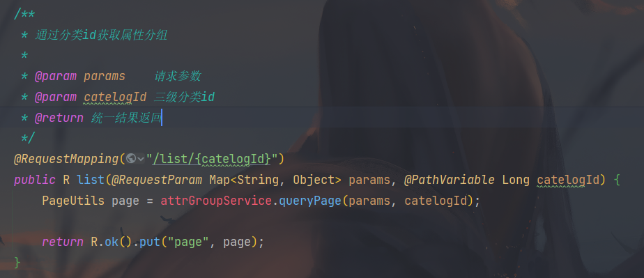

  ```java
  /**
   * 通过分类id获取属性分组
   * 需要区分刚进入页面不带id查询全部与点击分类带id查询特定的分类
   *
   * @param params    请求参数
   * @param catelogId 三级分类id
   * @return 统一结果返回
   */
  @Override
  public PageUtils queryPage(Map<String, Object> params, Long catelogId) {
      String key = (String) params.get("key");
      //模糊查询的条件值
      //select * from pms_attr_group where catelog_id=catelogId and **** or ****
      QueryWrapper<AttrGroupEntity> wrapper = new QueryWrapper<>();
      //点击分类,查询具体数据
      if (!StringUtils.isEmpty(key)) {
          wrapper.and((obj) -> {
              obj.eq("attr_group_id", key).or().like("attr_group_name", key);
          });
      }
      //没有点击具体分类,查询全部数据
      if (catelogId == 0) {
          IPage<AttrGroupEntity> page = this.page(
                  new Query<AttrGroupEntity>().getPage(params),
                  wrapper);
          return new PageUtils(page);
      } else {
          //如果分类id不等于0,则查询具体分类的属性分组
          wrapper.eq("catelog_id", catelogId);
          IPage<AttrGroupEntity> page = this.page(new Query<AttrGroupEntity>().getPage(params), wrapper);
          return new PageUtils(page);
      }
  }
  ```


### 8.3.4 分组新增&级联选择器

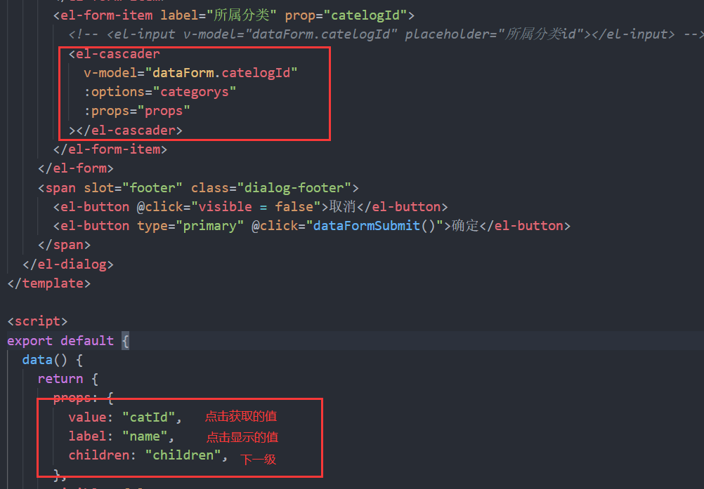


+ 目前第三级分类后没有分类，但仍然会显示第四级的效果

  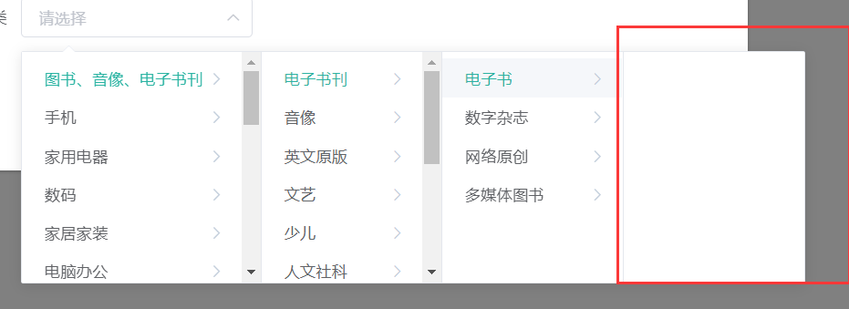

  使用注解`@JsonInclude(value = JsonInclude.Include.NON_EMPTY)`

  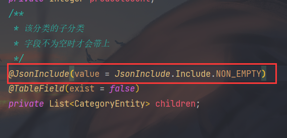

  告诉springmvc只有这个字段不为空时才带上

+ 取分类id时，只取第三级分类的id

  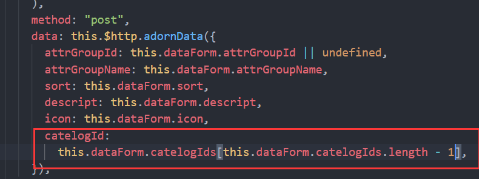


### 8.3.5 分组修改&级联选择器回显&获取属性分组详情

+ 在修改时，目前无法回显三级分类路径

  原因是后端info方法没有查询完整的路径，只保存了第三级分类

+ 添加完整路径字段

  完善方法

+ 后端info最终返回的数据格式应该是

  ```json
  {
  	"code": 0,
  	"msg": "success",
  	"attrGroup": {
  		"attrGroupId": 1,
  		"attrGroupName": "主体",
  		"sort": 0,
  		"descript": null,
  		"icon": null,
  		"catelogId": 225,
  		"catelogPath": [
  			2,
  			34,
  			225
  		] //完整分类路径
  	}
  }
  ```

  后端查询完整路径

  ```java
  /**
   * 根据第三级分类id查询出完整分类路径
   * [父/子/孙]
   *
   * @param catelogId 第三级分类id
   * @return 完整分类路径
   */
  @Override
  public Long[] findCatelogPath(Long catelogId) {
      List<Long> paths = new ArrayList<>();
      List<Long> parentPath = findParentPath(catelogId, paths);
      //逆序转换,得到正确数据
      Collections.reverse(parentPath);
      return parentPath.toArray(new Long[3]);
  }
  /**
   * 查找catelogId对应的父分类的id
   *
   * @param catelogId 分类id
   * @param paths     收集数据的容器
   * @return 完整分类路径
   */
  private List<Long> findParentPath(Long catelogId, List<Long> paths) {
      //收集当前节点id
      paths.add(catelogId);
      CategoryEntity category = this.getById(catelogId);
      //如果还有父分类,递归查找
      if (category.getParentCid() != 0) {
          findParentPath(category.getParentCid(), paths);
      }
      return paths;
  }
  ```


​	单元测试

​	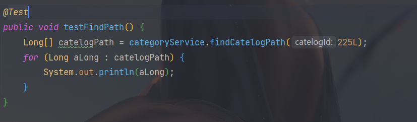

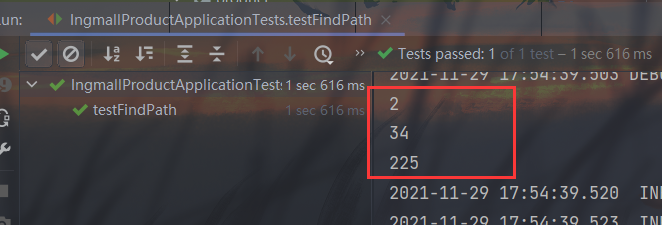


+ 现在前端就能正确回显三级分类

  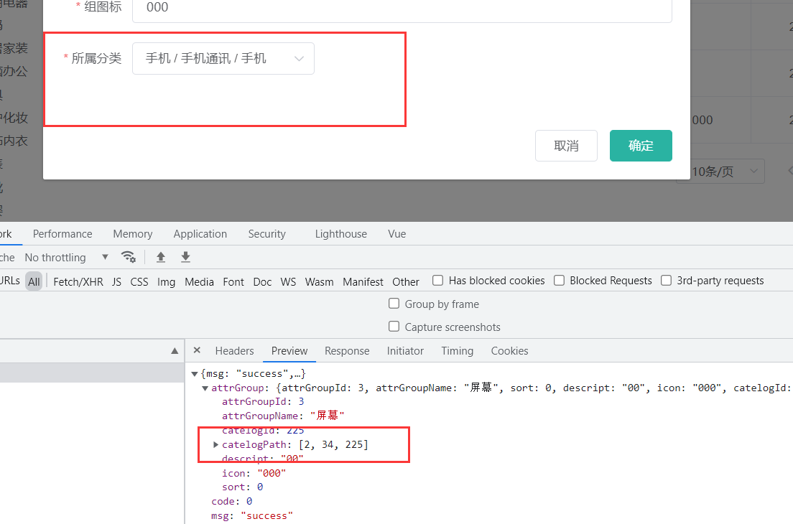

+ 让分类框变成可搜索的

  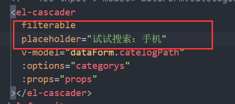


## 8.4 平台属性

### 8.4.1 规格参数新增与VO

#### **Object** **划分** 

+ **PO(persistant object)** **持久对象** 

  PO 就是对应数据库中某个表中的一条记录，多个记录可以用 PO 的集合。 PO 中应该不包 含任何对数据库的操作。 

+ **DO**（Domain Object）领域对象

  就是从现实世界中抽象出来的有形或无形的业务实体。 

+ **TO(Transfer Object)** **，数据传输对象** 

  不同的应用程序之间传输的对象 

+ **4.DTO**（Data Transfer Object）数据传输对象

  这个概念来源于 J2EE 的设计模式，原来的目的是为了 EJB 的分布式应用提供粗粒度的 数据实体，以减少分布式调用的次数，从而提高分布式调用的性能和降低网络负载，但在这 里，泛指用于展示层与服务层之间的数据传输对象。 

+ **5.VO(value object)** **值对象** 

  通常用于业务层之间的数据传递，和 PO 一样也是仅仅包含数据而已。但应是抽象出 的业务对象 , 可以和表对应 , 也可以不 , 这根据业务的需要 。用 new 关键字创建，由 GC 回收的。

   View object：视图对象； 

  **接受页面传递来的数据，封装对象 **

  **将业务处理完成的对象，封装成页面要用的数据** 

+ **6.BO(business object)** **业务对象** 

  从业务模型的角度看 , 见 UML 元件领域模型中的领域对象。封装业务逻辑的 java 对 象 , 通过调用 DAO 方法 , 结合 PO,VO 进行业务操作。business object: 业务对象 主要作 用是把业务逻辑封装为一个对象。这个对象可以包括一个或多个其它的对象。 比如一个简历，有教育经历、工作经历、社会关系等等。 我们可以把教育经历对应一个 PO ，工作经历对应一个 PO ，社会关系对应一个 PO 。 建立一个对应简历的 BO 对象处理简历，每个 BO 包含这些 PO 。 这样处理业务逻辑时，我们就可以针对 BO 去处理。

+ **7.POJO(plain ordinary java object)** **简单无规则** **java** **对象** 

  传统意义的 java 对象。就是说在一些 Object/Relation Mapping 工具中，能够做到维护 数据库表记录的 persisent object 完全是一个符合 Java Bean 规范的纯 Java 对象，没有增 加别的属性和方法。我的理解就是最基本的 java Bean ，只有属性字段及 setter 和 getter 方法！。POJO 是 DO/DTO/BO/VO 的统称。 

+ **8.DAO(data access object)** **数据访问对象** 

  是一个 sun 的一个标准 j2ee 设计模式， 这个模式中有个接口就是 DAO ，它负持久 层的操作。为业务层提供接口。此对象用于访问数据库。通常和 PO 结合使用， DAO 中包 含了各种数据库的操作方法。通过它的方法 , 结合 PO 对数据库进行相关的操作。夹在业 务逻辑与数据库资源中间。配合 VO, 提供数据库的 CRUD 操作.


#### 新增规格参数（商品属性）

+ 接口文档

  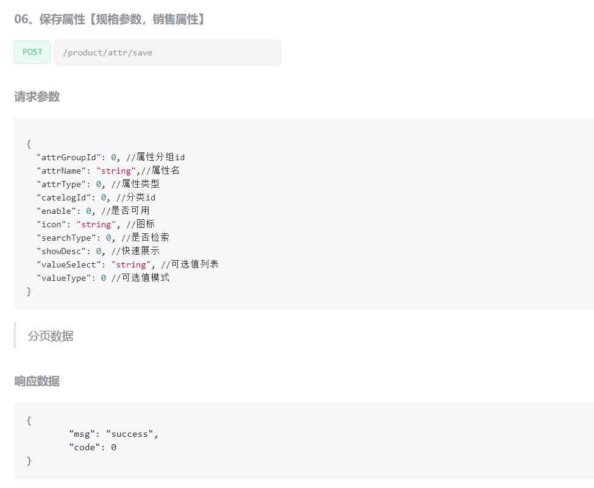

```java
/**
 * 新增商品属性
 * 首先保存属性的基本信息,然后保存关联表的信息
 *
 * @param attr 商品属性VO类
 */
@Override
@Transactional
public void saveAttr(AttrVO attr) {
    //保存基本数据
    AttrEntity attrEntity = new AttrEntity();
    BeanUtils.copyProperties(attr, attrEntity);
    this.save(attrEntity);
    //保存关联关系
    AttrAttrgroupRelationEntity relation = new AttrAttrgroupRelationEntity();
    relation.setAttrId(attrEntity.getAttrId());
    relation.setAttrGroupId(attr.getAttrGroupId());
    relationDao.insert(relation);
}
```


### 8.4.2 规格参数列表

+ 条件查询带分页，与获取分类属性分组类似

+ 接口文档：

  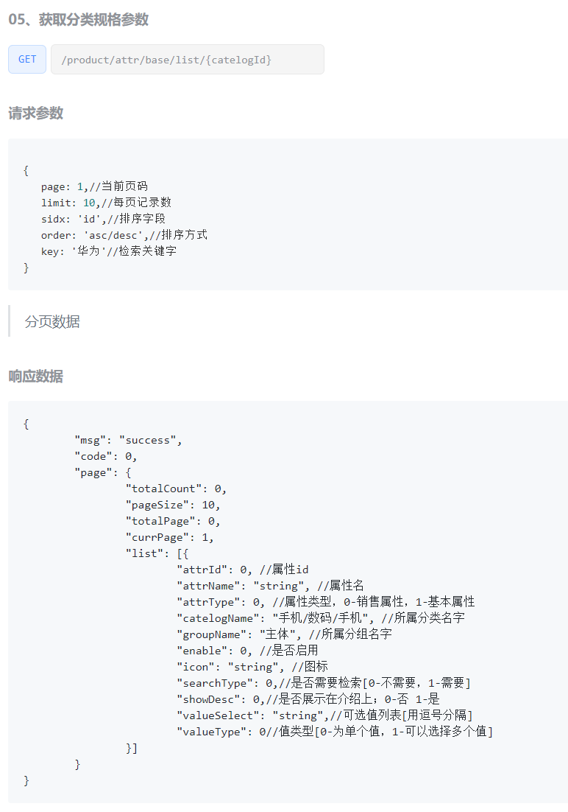

+ ==注意！连表查询可能会生成不可估量的中间表数据，慎用join==

+ ```java
  /**
   * 通过分类id查询规格参数列表
   * 需要区分刚进入页面不带id查询全部与点击分类带id查询特定的分类
   *
   * @param params    请求参数
   * @param catelogId 分类id
   * @return 分页数据
   */
  @Override
  public PageUtils queryBaseAttrPage(Map<String, Object> params, Long catelogId) {
      //得到条件查询的数据
      String key = (String) params.get("key");
      QueryWrapper<AttrEntity> wrapper = new QueryWrapper<>();
      //select ** from ** where catelog_id=catelogId and attr_id=key or attr_name=key
      //是否带分类查询
      if (catelogId != 0) {
          wrapper.eq("catelog_id", catelogId);
      }
  
      //如果有条件查询
      if (!StringUtils.isEmpty(key)) {
          wrapper.and((obj) -> {
              obj.like("attr_name", key).or().eq("attr_id", key);
          });
      }
  
      IPage<AttrEntity> page = this.page(new Query<AttrEntity>().getPage(params), wrapper);
  
      PageUtils pageUtils = new PageUtils(page);
  
      //获取分页记录列表
      List<AttrEntity> records = page.getRecords();
      List<AttrResponseVO> responseVOS = records.stream().map((attrEntity) -> {
                  AttrResponseVO attrResponseVO = new AttrResponseVO();
                  BeanUtils.copyProperties(attrEntity, attrResponseVO);
  
                  //获取属性分组名与分类名
                  AttrAttrgroupRelationEntity attrAttrgroupRelation =
                          relationDao.selectOne(new QueryWrapper<AttrAttrgroupRelationEntity>()
                                  .eq("attr_id", attrResponseVO.getAttrId()));
                  if (attrAttrgroupRelation != null) {
                      AttrGroupEntity attrGroupEntity = attrGroupDao.selectById(attrAttrgroupRelation.getAttrGroupId());
                      attrResponseVO.setGroupName(attrGroupEntity.getAttrGroupName());
                  }
  
                  CategoryEntity categoryEntity = categoryDao.selectById(attrResponseVO.getCatelogId());
                  if (categoryEntity != null) {
                      attrResponseVO.setCatelogName(categoryEntity.getName());
                  }
  
                  return attrResponseVO;
              }
      ).collect(Collectors.toList());
  
      //结果集需要返回最新的结果集
      pageUtils.setList(responseVOS);
  
      return pageUtils;
  }
  ```


### 8.4.3 规格参数的修改

+ **查询属性详情**

  目前修改回显无法返回三级分类路径，需要完善

  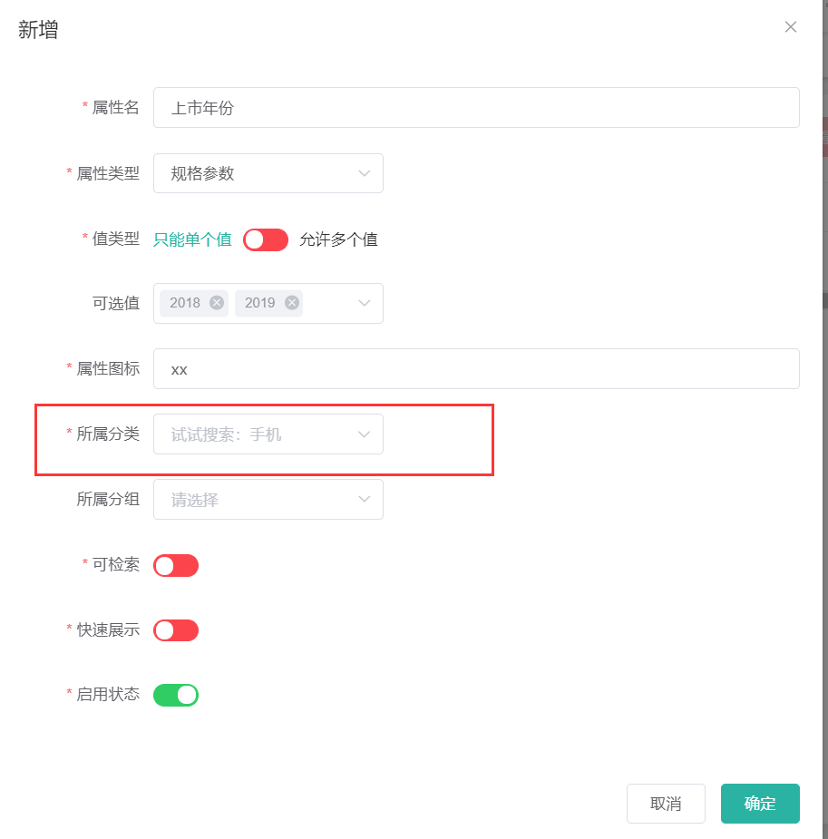

+ 接口文档

  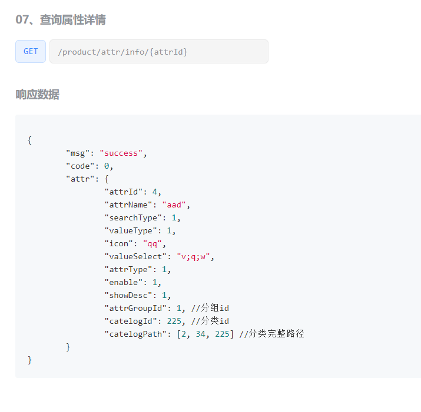

+ 分别往属性响应对象中设置多余的值（分组信息，分类信息）

+ ```java
  /**
   * 查询属性详情
   *
   * @param attrId 属性id
   * @return 统一结果返回-商品属性（规格参数）响应VO类（带三级分类路径）
   */
  @Override
  public AttrResponseVO getAttrInfo(Long attrId) {
      AttrResponseVO responseVO = new AttrResponseVO();
      //查出基础信息
      AttrEntity attrEntity = this.getById(attrId);
      BeanUtils.copyProperties(attrEntity, responseVO);
  
      //设置属性分组的信息(分组id与分组名)
      AttrAttrgroupRelationEntity relationEntity = relationDao.selectOne(
              new QueryWrapper<AttrAttrgroupRelationEntity>()
                      .eq("attr_id", attrId));
      if (relationEntity != null) {
          Long attrGroupId = relationEntity.getAttrGroupId();
          responseVO.setAttrGroupId(attrGroupId);
          AttrGroupEntity attrGroupEntity = attrGroupDao.selectById(attrGroupId);
          if (attrGroupEntity != null) {
              responseVO.setGroupName(attrGroupEntity.getAttrGroupName());
          }
      }
  
      //设置分类信息(分类id与完整分类路径)
      Long catelogId = attrEntity.getCatelogId();
      Long[] catelogPath = categoryService.findCatelogPath(catelogId);
      responseVO.setCatelogPath(catelogPath);
  
      CategoryEntity categoryEntity = categoryDao.selectById(catelogId);
      if (categoryEntity != null) {
          responseVO.setCatelogName(categoryEntity.getName());
      }
  
      return responseVO;
  }
  ```


+ 回显成功

  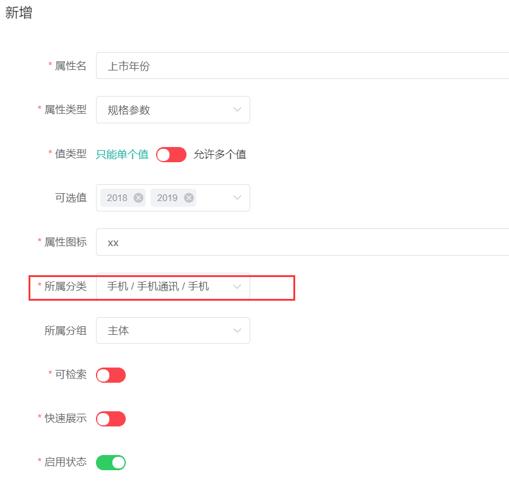

+ 回显成功后，完善修改，接口文档

  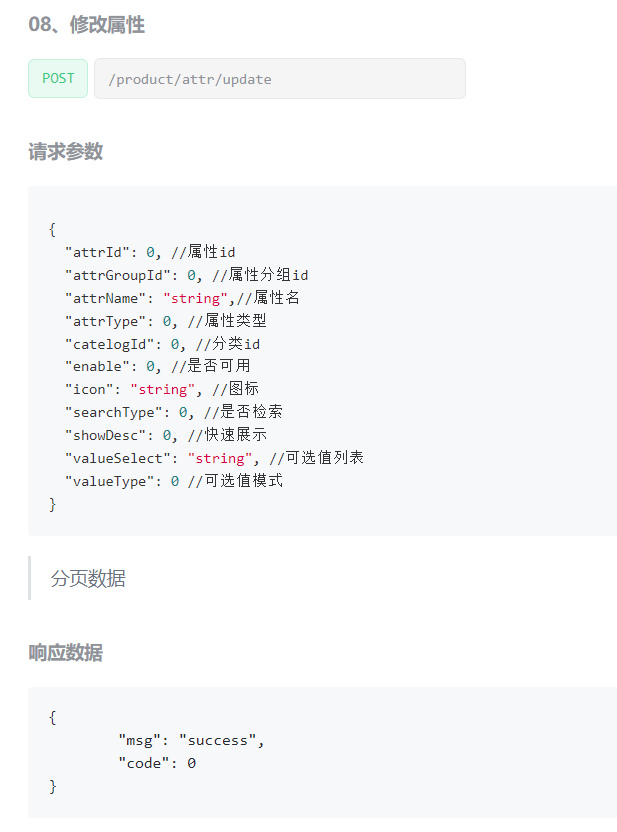

+ 如果某个属性新增时就没有分组，那么我们在修改方法就需要将关联新增

  ```java
  /**
   * 修改商品属性(规格参数)
   *
   * @param attr 修改的商品属性信息
   */
  @Override
  @Transactional
  public void updateAttr(AttrVO attr) {
      //修改基本信息
      AttrEntity attrEntity = new AttrEntity();
      BeanUtils.copyProperties(attr, attrEntity);
      this.updateById(attrEntity);
  
      //修改属性与属性分组关联表信息(属性id与属性分组id)
      AttrAttrgroupRelationEntity attrgroupRelationEntity = new AttrAttrgroupRelationEntity();
      attrgroupRelationEntity.setAttrId(attr.getAttrId());
      attrgroupRelationEntity.setAttrGroupId(attr.getAttrGroupId());
  
      //如果关联表中没有属性记录,则新增
      Integer count = relationDao.selectCount(new QueryWrapper<AttrAttrgroupRelationEntity>()
              .eq("attr_id", attr.getAttrId()));
      if (count > 0) {
          relationDao.update(attrgroupRelationEntity,
                  new UpdateWrapper<AttrAttrgroupRelationEntity>()
                          .eq("attr_id", attr.getAttrId()));
      } else {
          relationDao.insert(attrgroupRelationEntity);
      }
  }
  ```


### 8.4.4 销售属性维护

+ 接口文档

  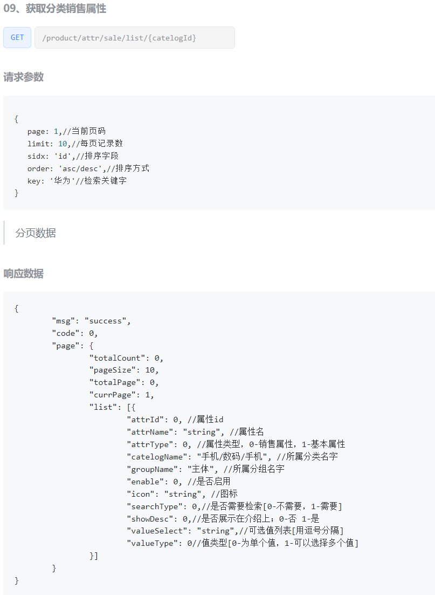

+ 前端做了一个判断是基本属性还是销售属性

  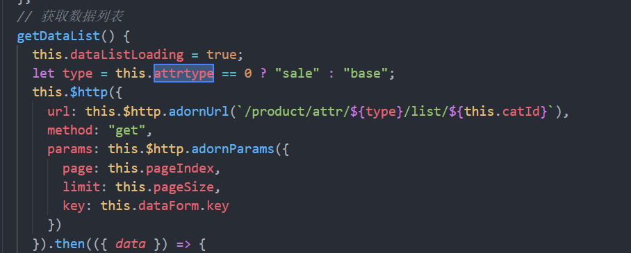

+ 后端使用一个三元运算拼接条件

  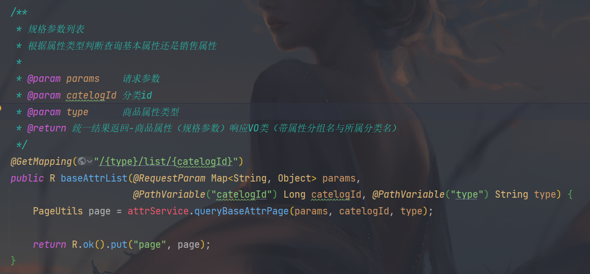

  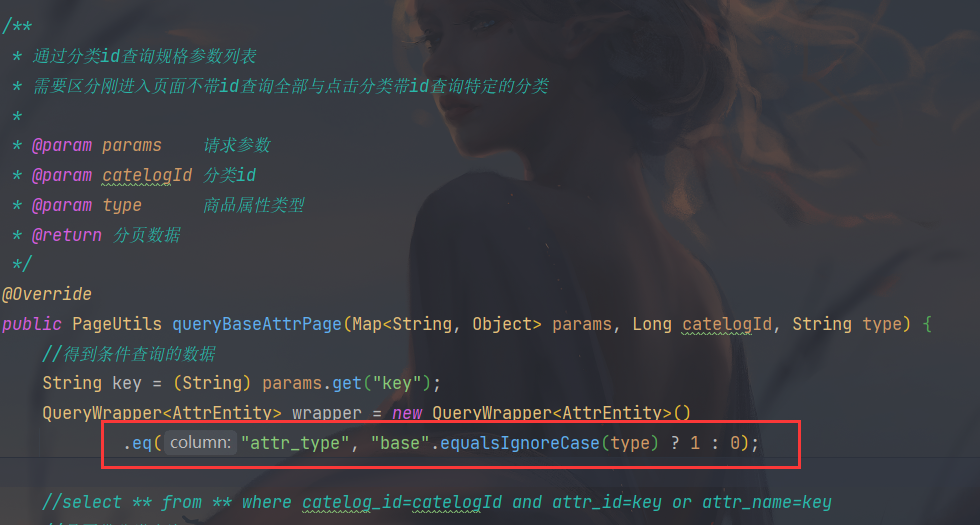


+ **销售属性是没有分组的**，所以在查询，新增，修改里设置分组时需要判断查询是基本属性还是销售属性

  封装一个常量类，枚举属性类型ProductConstant.java

  ```java
  /**
   * 商品属性类型枚举
   */
  public enum AttrEnum {
      /**
       * 商品属性类型-基本属性
       */
      ATTR_TYPE_BASE(1, "base"),
      /**
       * 商品属性类型-销售属性
       */
      ATTR_TYPE_SALE(0, "sale");
  
      private int code;
      private String msg;
  
      AttrEnum(int code, String msg) {
          this.code = code;
          this.msg = msg;
      }
  
      public int getCode() {
          return code;
      }
  
      public String getMsg() {
          return msg;
      }
  }
  ```


### 8.4.5 查询分组关联属性&删除关联

+ 编写分组与属性关联的功能

  + 每一个属性分组都可以关联非常多的规格参数

  + 在属性分组点击关联，列出当前分组所关联的所有属性

  + **获取属性分组的关联的所有属性**

    + 接口文档

      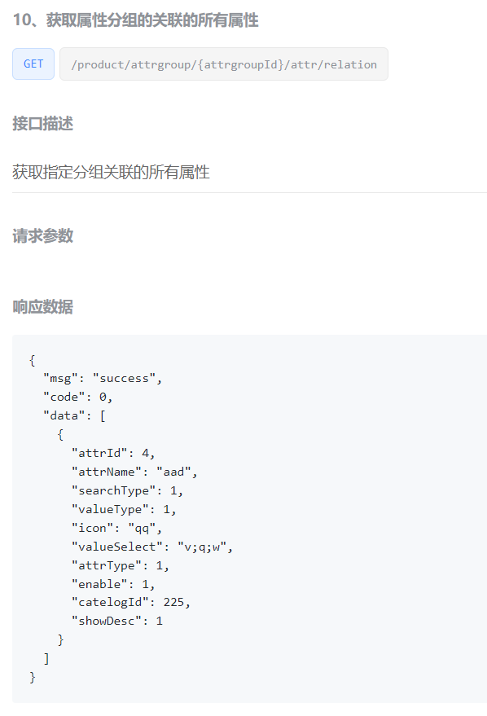

    + 通过关联表查出所有对应属性id，然后通过属性id查出所有的属性信息

      ```java
      /**
       * 根据分组id查找关联的所有基本属性（规格参数）
       *
       * @param attrgroupId 属性分组id
       * @return attrgroupId对应的所有关联的属性的信息
       */
      @Override
      public List<AttrEntity> getRelationAttr(Long attrgroupId) {
          //查出属性分组对应关联信息
          List<AttrAttrgroupRelationEntity> entities = relationDao.selectList(new QueryWrapper<AttrAttrgroupRelationEntity>().eq("attr_group_id", attrgroupId));
      
          //用关联信息查出所有属性信息
          List<Long> attrIds = entities.stream().map((attr) -> {
              //查出所有属性id
              return attr.getAttrId();
          }).collect(Collectors.toList());
      
          //通过属性id查出所有属性信息
          List<AttrEntity> attrList = this.listByIds(attrIds);
      
          return attrList;
      }
      ```

      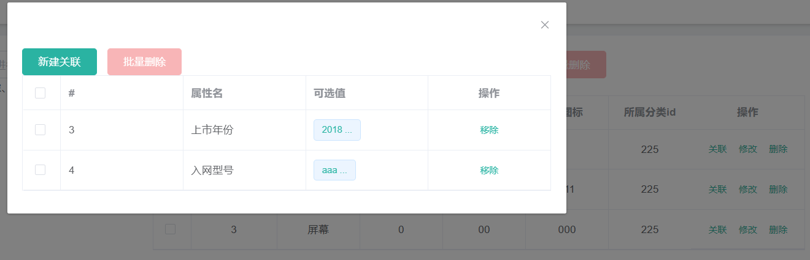


+ 删除属性与分组的关联关系

  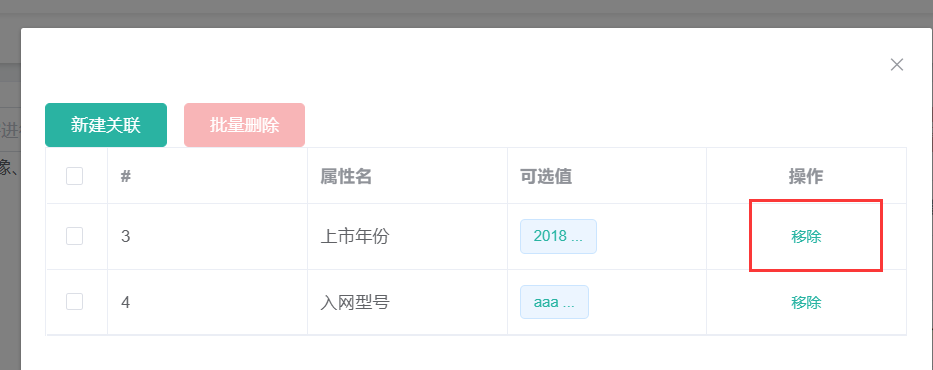		

  + 接口文档

    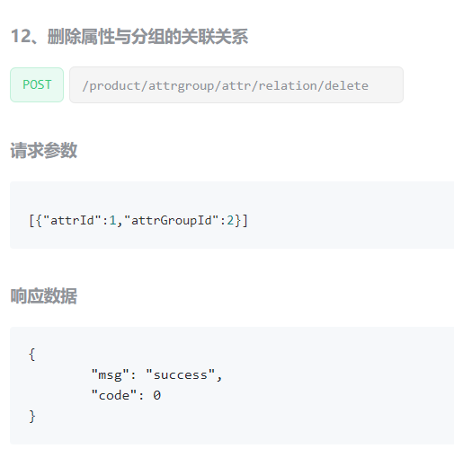

  + 如果前端进行批量删除，那么会有很多次删除请求，为了性能优化，后端也进行批量删除，自己写sql语句

    ```xml
    <!--批量删除属性与分组的关联关系-->
    <delete id="deleteBatchRelation">
        DELETE
        FROM `pms_attr_attrgroup_relation`
        WHERE
        <foreach collection="entities" item="item" separator=" OR ">
            (attr_id = #{item.attrId} and attr_group_id = #{item.attrGroupId})
        </foreach>
    </delete>
    ```

  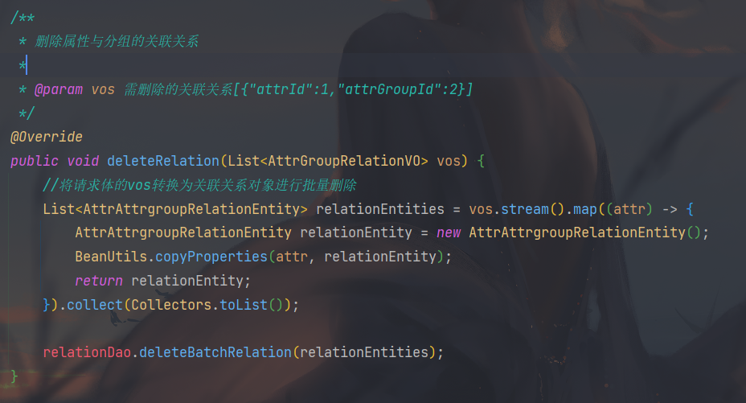


### 8.4.6 查询分组未关联的属性

+ 当点击新建关联时，弹框，应当显示对应分组可以关联的属性，并且可以条件查询

  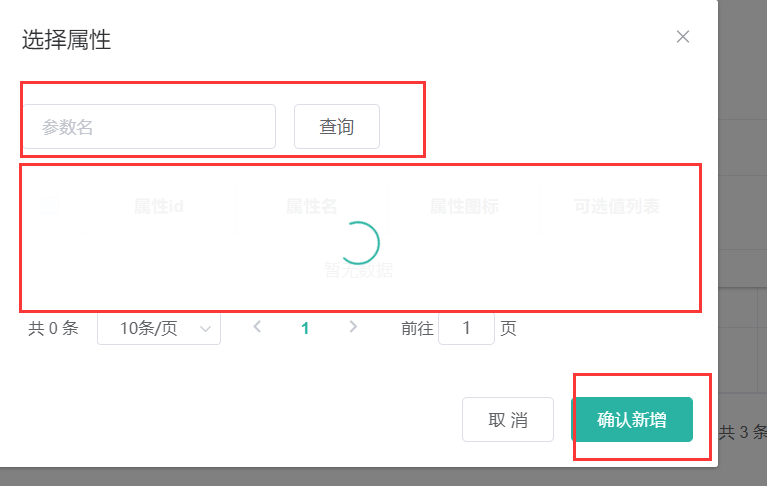

+ 重点在于怎么查询属性分组可以关联的属性

  + 可以关联的属性一定是对应分组所属的三级分类下的属性

  + 并且没有被本分类下其他分组关联和没有被自己关联的属性

  + **获取属性分组没有关联的其他属性**

    接口文档

    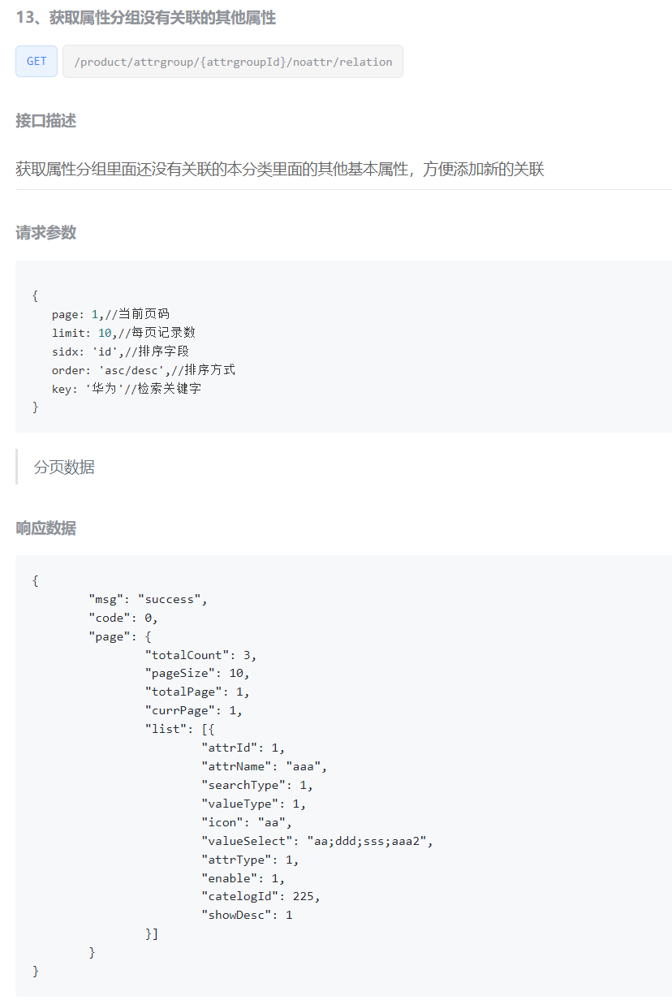

```java
    /**
     * 获取属性分组没有关联的其他属性
     * 可以关联的属性一定是对应分组所属的三级分类下的属性
     * 并且没有被本分类下其他分组关联的属性
     *
     * @param params      请求参数
     * @param attrgroupId 属性分组id
     * @return attrgroupId对应在对应分类下的没有关联的属性
     */
    @Override
    public PageUtils getNoRelationAttr(Map<String, Object> params, Long attrgroupId) {
        //1.当前分组只能关联自己所属分类里的所有属性
        //先查出分组所属的分类
        AttrGroupEntity attrGroupEntity = this.getById(attrgroupId);
        Long catelogId = attrGroupEntity.getCatelogId();

        //2.当前分组只能关联别的分组没有引用的属性
        //2.1找到当前分类下的其他分组
        List<AttrGroupEntity> groupEntityList = this.baseMapper.selectList(
                new QueryWrapper<AttrGroupEntity>()
                        .eq("catelog_id", catelogId)
        );
        List<Long> groupIdList = groupEntityList
                .stream()
                .map((group) -> group.getAttrGroupId())
                .collect(Collectors.toList());

        //2.2其他分组关联的属性
        List<AttrAttrgroupRelationEntity> relationEntities = relationDao.selectList(
                new QueryWrapper<AttrAttrgroupRelationEntity>().in("attr_group_id", groupIdList)
        );
        List<Long> attrIdList = relationEntities
                .stream()
                .map((relation) -> relation.getAttrId())
                .collect(Collectors.toList());

        //2.3从当前分类的所属属性中排除掉其他分组关联的属性
        //只查基本属性（规格参数），排除掉销售属性
        QueryWrapper<AttrEntity> wrapper = new QueryWrapper<AttrEntity>()
                .eq("catelog_id", catelogId).eq("attr_type", ProductConstant.AttrEnum.ATTR_TYPE_BASE.getCode());
        //如果其他分类关联的属性不为空再拼装notIn
        if (!attrIdList.isEmpty()) {
            wrapper.notIn("attr_id", attrIdList);
        }

        //如果有条件查询
        String key = (String) params.get("key");
        if (!StringUtils.isEmpty(key)) {
            wrapper.and((w) -> {
                w.eq("attr_id", key).or().like("attr_name", key);
            });
        }
        IPage<AttrEntity> page = attrService.page(new Query<AttrEntity>().getPage(params), wrapper);
        PageUtils pageUtils = new PageUtils(page);

        return pageUtils;
    }
```


### 8.4.7 新增分组与属性关联

+ 新建关联后点击确认新增

+ 接口文档

  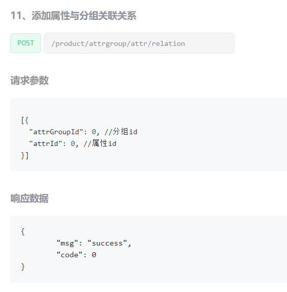

+ ```java
  /**
   * 添加属性与属性分组关联关系(批量添加)
   *
   * @param vos 属性与属性分组的关联VO对象集合
   */
  @Override
  public void saveBatch(List<AttrGroupRelationVO> vos) {
      List<AttrAttrgroupRelationEntity> relationEntityList = vos.stream().map((relationVO) -> {
          AttrAttrgroupRelationEntity attrAttrgroupRelationEntity = new AttrAttrgroupRelationEntity();
          BeanUtils.copyProperties(relationVO, attrAttrgroupRelationEntity);
          return attrAttrgroupRelationEntity;
      }).collect(Collectors.toList());
      this.saveBatch(relationEntityList);
  }
  ```


#### 遇到的坑

当新增属性时与查询规格参数列表时，要判断属性分组不为空


## 8.5 商品维护-发布商品

+ 发布商品要经历四个步骤

  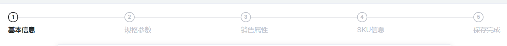

  + 录入商品基本信息

    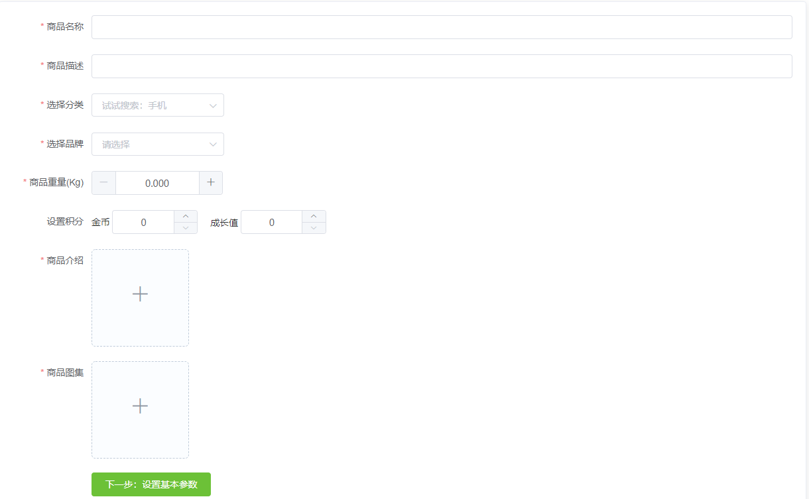

    + 商品图集指

      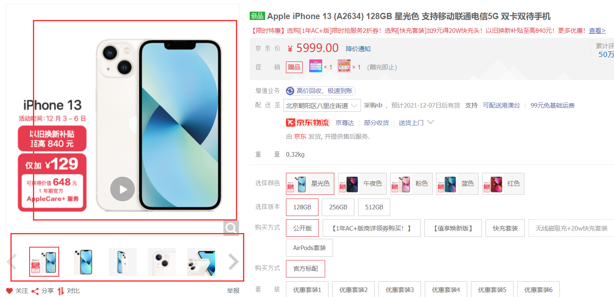

    + 商品介绍为详情里的大图

  + 录入商品的规格参数

  + 录入商品的规格参数

  + 录入销售属性

  + 录入SKU信息

    

    

    


### 8.5.1 调试会员等级相关接口

目前进入发布商品页面会有一个请求错误


完善该接口


+ 该请求属于**用户服务**模块

+ 先将用户服务的配置转移到nacos

+ 网关配置路由关系

+ 将前端页面导入工程

+ 接口文档

  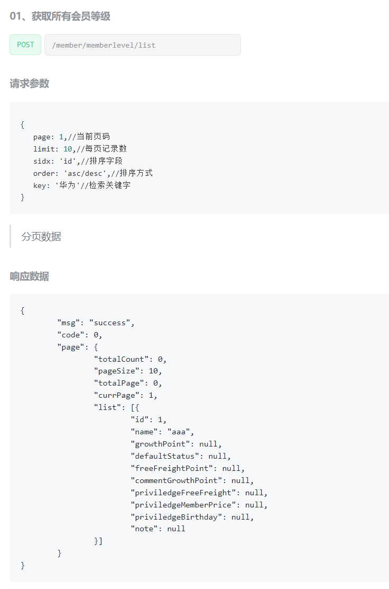


### 8.5.2 获取分类关联的品牌

+ 当发布商品时，选择分类后，选择品牌下拉框就应该查询对应的分类下的品牌，完善该接口

  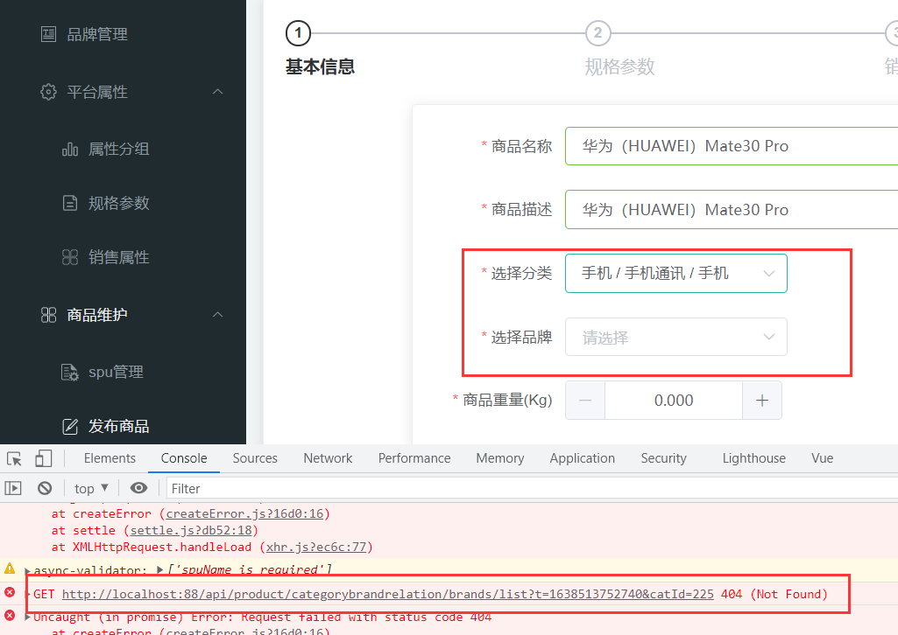

+ 接口文档

  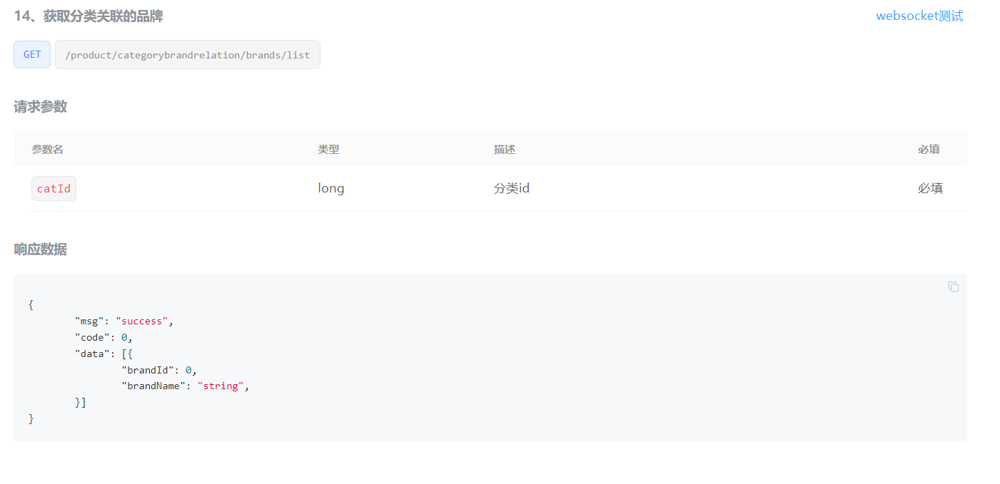

+ 之后所有查询要查实体类，然后在controller层进行vo转换
  + ==controller处理请求，接收和校验数据==
  + ==service接受controller传来的数据，进行业务处理==
  + ==controller接收service处理完的数据，封装成页面指定的vo==

```java
/**
 * 获取分类关联的品牌
 * 1.controller处理请求，接收和校验数据
 * 2.service接受controller传来的数据，进行业务处理
 * 3.controller接收service处理完的数据，封装成页面指定的vo
 *
 * @param catId 分类id
 * @return 统一结果返回-分类关联的品牌集合
 */
@GetMapping("/brands/list")
public R categoryRelationBrandList(@RequestParam(value = "catId", required = true) Long catId) {
    //根据分类id查询关联的品牌
    List<BrandEntity> data = categoryBrandRelationService.getBrandsByCatId(catId);
    List<BrandVO> collect = data.stream().map((item) -> {
        BrandVO brandVO = new BrandVO();
        brandVO.setBrandId(item.getBrandId());
        brandVO.setBrandName(item.getName());
        return brandVO;
    }).collect(Collectors.toList());

    return R.ok().put("data", collect);
}
```

```java
/**
 * 根据品牌id获取分类关联的品牌
 *
 * @param catId 分类id
 * @return 分类关联的品牌集合
 */
@Override
public List<BrandEntity> getBrandsByCatId(Long catId) {
    //查出指定分类下的关联关系
    List<CategoryBrandRelationEntity> relationEntities = baseMapper.selectList(
            new QueryWrapper<CategoryBrandRelationEntity>().eq("catelog_id", catId)
    );
    //提取出分类下的品牌id
    List<Long> brandIds = relationEntities.stream().map((item) -> {
        return item.getBrandId();
    }).collect(Collectors.toList());
    //根据品牌id集合查询品牌
    List<BrandEntity> brandEntityList = brandService.listByIds(brandIds);

    return brandEntityList;
}
```


### 8.5.3 获取分类下所有分组以及属性

发布商品第二步需要获取商品对应分类下的所有属性分组及其对应的属性

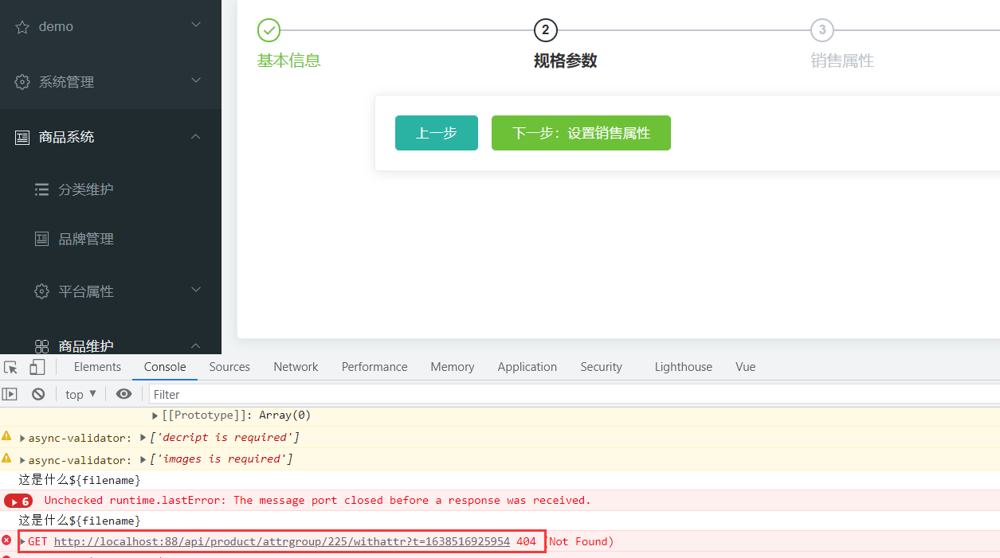

+ 接口文档

  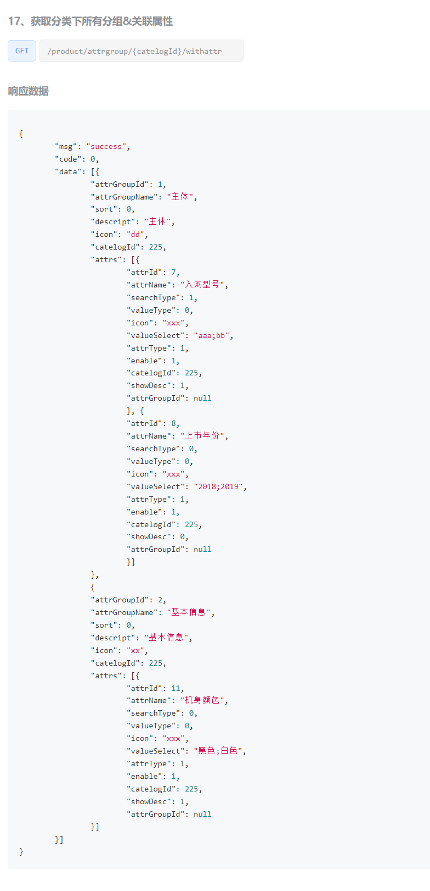

+ ```markdown
  1.查出当前分类下的所有属性分组
  2.查出每个属性分组下的所有属性
  ```

+ 需要编写一个VO

+ ```java
  /**
   * 根据分类id查出所有分组&关联属性
   *
   * @param catelogId 分类id
   * @return 分类下所有分组&关联属性集合
   */
  @Override
  public List<AttrGroupWithAttrsVO> getAttrGroupWithAttrsByCatelogId(Long catelogId) {
      //查询分组信息
      List<AttrGroupEntity> groupList = this.list(
              new QueryWrapper<AttrGroupEntity>().eq("catelog_id", catelogId)
      );
      List<AttrGroupWithAttrsVO> attrGroupWithAttrsVOS = groupList
              .stream()
              .map((item) -> {
                  AttrGroupWithAttrsVO groupWithAttrsVO = new AttrGroupWithAttrsVO();
                  BeanUtils.copyProperties(item, groupWithAttrsVO);
                  //根据分组id查找关联的所有基本属性
                  List<AttrEntity> attrs = attrService.getRelationAttr(item.getAttrGroupId());
                  groupWithAttrsVO.setAttrs(attrs);
                  return groupWithAttrsVO;
              })
              .collect(Collectors.toList());
  
      return attrGroupWithAttrsVOS;
  }
  ```

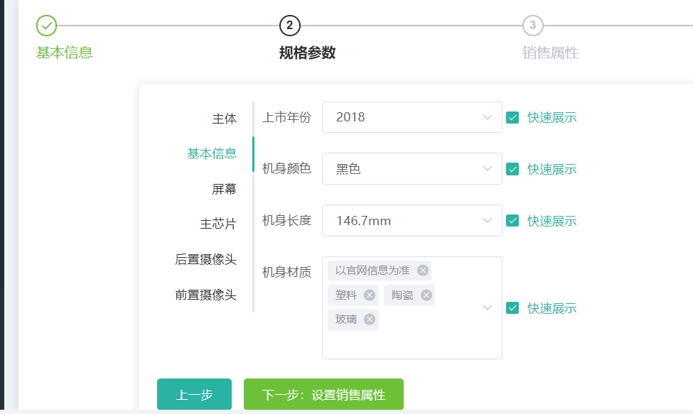

#### 遇到的坑

属性分组下有可能没有属性，前端页面在获取查询出的数据时会遍历属性进行展示，需要在前端加上非空判断

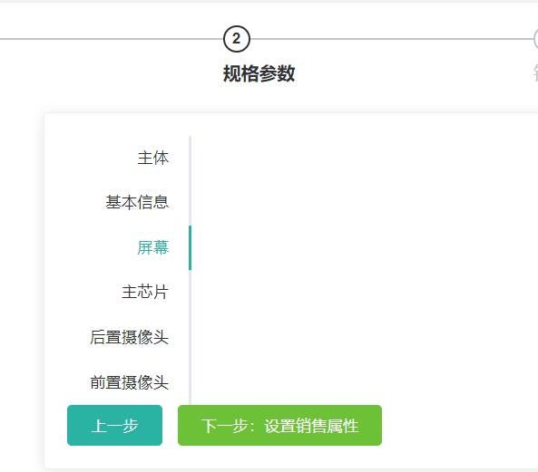

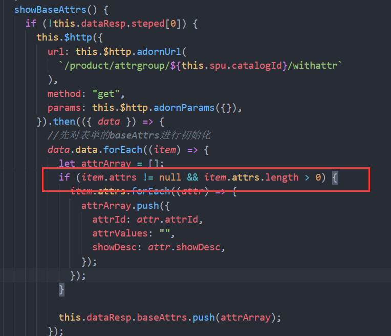


### 8.5.4 商品新增VO抽取

新增商品会保存非常多的数据

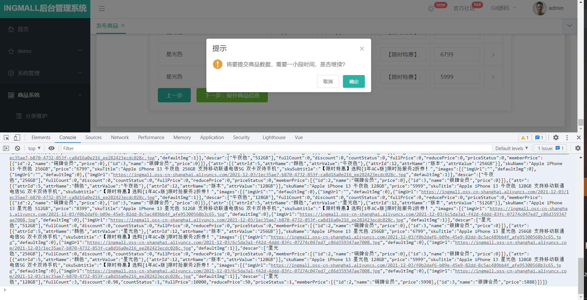

```json
{
	"spuName": "Apple iPhone 13",
	"spuDescription": "Apple iPhone 13",
	"catalogId": 225,
	"brandId": 11,
	"weight": 0.32,
	"publishStatus": 0,
	"decript": ["https://ingmall.oss-cn-shanghai.aliyuncs.com/2021-12-03/956ba9e2-adea-4972-82eb-d6cab979d299_85c43cbe4acb2b03.jpg", "https://ingmall.oss-cn-shanghai.aliyuncs.com/2021-12-03/25dc7968-d722-48b6-81b6-b2a3fe27aede_840becb199034f03.jpg"],
	"images": ["https://ingmall.oss-cn-shanghai.aliyuncs.com/2021-12-03/f0b2daf6-b09e-45e9-82dd-8c5ac489bb4f_afe95300568b3c65.jpg", "https://ingmall.oss-cn-shanghai.aliyuncs.com/2021-12-03/6c5da3a1-f42d-4ddd-83fc-07274c047ed7_c86d359347ae7008.jpg", "https://ingmall.oss-cn-shanghai.aliyuncs.com/2021-12-03/1ec35ae7-b870-4732-853f-ca8d16a0e216_ee282423ecdc028c.jpg"],
	"bounds": {
		"buyBounds": 500,
		"growBounds": 500
	},
	"baseAttrs": [{
		"attrId": 4,
		"attrValues": "A2634",
		"showDesc": 0
	}, {
		"attrId": 3,
		"attrValues": "2021",
		"showDesc": 1
	}, {
		"attrId": 8,
		"attrValues": "146.7mm",
		"showDesc": 1
	}, {
		"attrId": 9,
		"attrValues": "以官网信息为准",
		"showDesc": 1
	}, {
		"attrId": 10,
		"attrValues": "以官网信息为准",
		"showDesc": 1
	}, {
		"attrId": 11,
		"attrValues": "A15",
		"showDesc": 1
	}],
	"skus": [{
		"attr": [{
			"attrId": 5,
			"attrName": "颜色",
			"attrValue": "红色"
		}, {
			"attrId": 12,
			"attrName": "版本",
			"attrValue": "512GB"
		}],
		"skuName": "Apple iPhone 13 红色 512GB",
		"price": "8399",
		"skuTitle": "Apple iPhone 13 (A2634) 512GB 红色 支持移动联通电信5G 双卡双待手机",
		"skuSubtitle": "【限时特惠】选购[1年AC+版]限时抢服务2折券！",
		"images": [{
			"imgUrl": "",
			"defaultImg": 0
		}, {
			"imgUrl": "",
			"defaultImg": 0
		}, {
			"imgUrl": "https://ingmall.oss-cn-shanghai.aliyuncs.com/2021-12-03/1ec35ae7-b870-4732-853f-ca8d16a0e216_ee282423ecdc028c.jpg",
			"defaultImg": 1
		}],
	}]
}
```


+ 新增商品的接口文档

  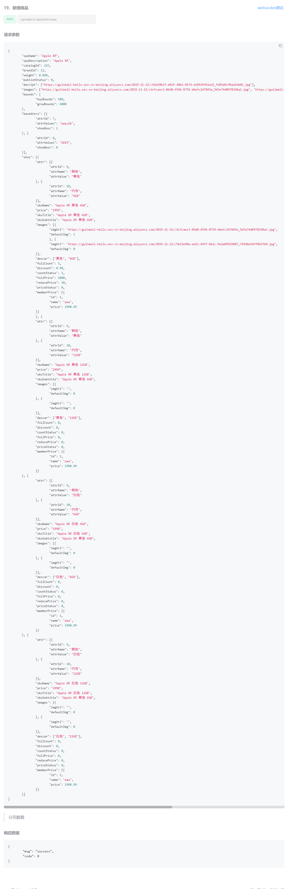


+ 使用json在线转换工具自动生成java实体类

  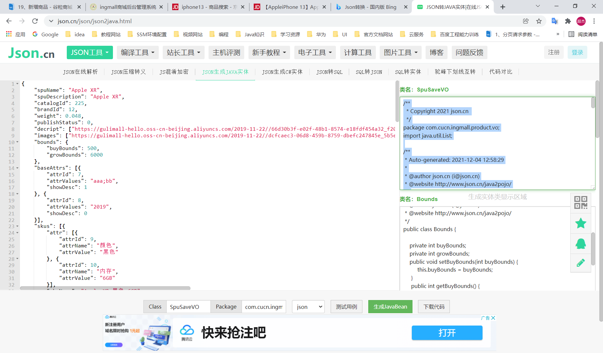

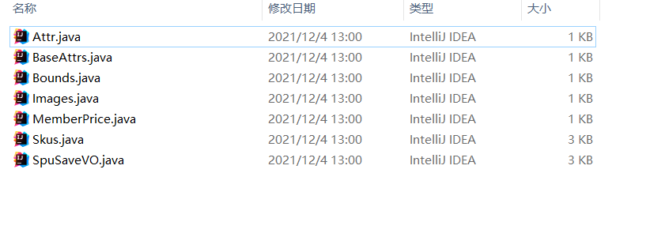


### 8.5.5 商品新增业务流程分析

商品新增需要保存非常多的数据

需要操作的数据表如下

```java
//1.保存SPU基本信息 pms_spu_info
//2.保存spu的描述图片 pms_spu_info_desc
//3.保存spu的图片集 pms_spu_images
//4.保存spu的规格参数 pms_product_attr_value
//5.保存spu的积分信息 sms_spu_bounds 商品积分
//6.保存当前spu对应的所有sku信息:
//5.1 sku的基本信息 pms_sku_info
//5.2 sku的图片信息 pms_sku_images
//5.3 sku的销售属性信息 pms_sku_sale_attr_value
//5.4 sku的优惠与满减等信息 跨库 ingmall_sms sms_sku_ladder(商品阶梯价格(打折))
//sms_sku_full_reduction 商品满减表
//sms_member_price 商品会员价格
```


### 8.5.6 保存spu基本信息

```java
/**
 * 新增商品
 *
 * @param spuSaveVO 新增商品的信息
 */
@Override
public void saveSpuInfo(SpuSaveVO spuSaveVO) {

    //1.保存SPU基本信息 pms_spu_info
    SpuInfoEntity spuInfoEntity = new SpuInfoEntity();
    BeanUtils.copyProperties(spuSaveVO, spuInfoEntity);
    this.saveBaseSpuInfo(spuInfoEntity);

    //2.保存spu的描述图片 pms_spu_info_desc
    List<String> decript = spuSaveVO.getDecript();
    SpuInfoDescEntity spuInfoDescEntity = new SpuInfoDescEntity();
    spuInfoDescEntity.setSpuId(spuInfoEntity.getId());
    spuInfoDescEntity.setDecript(String.join(",", decript));
    spuInfoDescService.save(spuInfoDescEntity);

    //3.保存spu的图片集 pms_spu_images
    List<String> spuImages = spuSaveVO.getImages();
    spuImagesService.saveSpuImages(spuInfoEntity.getId(), spuImages);

    //4.保存spu的规格参数 pms_product_attr_value
    List<BaseAttrs> baseAttrs = spuSaveVO.getBaseAttrs();
    List<ProductAttrValueEntity> productAttrValueList = baseAttrs.stream().map(baseAttr -> {
        ProductAttrValueEntity productAttrValueEntity = new ProductAttrValueEntity();
        productAttrValueEntity.setAttrId(baseAttr.getAttrId());
        productAttrValueEntity.setSpuId(spuInfoEntity.getId());
        productAttrValueEntity.setAttrName(attrService.getById(productAttrValueEntity.getAttrId()).getAttrName());
        productAttrValueEntity.setAttrValue(baseAttr.getAttrValues());
        productAttrValueEntity.setQuickShow(baseAttr.getShowDesc());
        return productAttrValueEntity;
    }).collect(Collectors.toList());
    productAttrValueService.saveProductAttr(productAttrValueList);

    //5.保存spu的积分信息 sms_spu_bounds 商品积分

    //6.保存当前spu对应的所有sku信息:
    //5.1 sku的基本信息 pms_sku_info
    //5.2 sku的图片信息 pms_sku_images
    //5.3 sku的销售属性信息 pms_sku_sale_attr_value
    //5.4 sku的优惠与满减等信息 跨库 ingmall_sms sms_sku_ladder(商品阶梯价格(打折))
    //sms_sku_full_reduction 商品满减表
    //sms_member_price 商品会员价格
}
```

#### 配置Mp自动填充字段

+ 在实体类中自动填充属性添加注解

  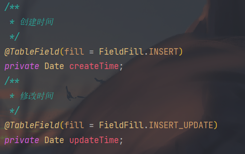

+ ```java
  /**
   * MP自动填充配置
   *
   * @author KouChaoJie
   * @since: 2021/12/4 21:23
   */
  @Component
  public class MyMetaObjectHandler implements MetaObjectHandler {
      /**
       * 插入元对象字段填充（用于插入时对公共字段的填充）
       *
       * @param metaObject 元对象
       */
      @Override
      public void insertFill(MetaObject metaObject) {
          this.setFieldValByName("createTime", new Date(), metaObject);
          this.setFieldValByName("updateTime", new Date(), metaObject);
      }
  
      /**
       * 更新元对象字段填充（用于更新时对公共字段的填充）
       *
       * @param metaObject 元对象
       */
      @Override
      public void updateFill(MetaObject metaObject) {
          this.setFieldValByName("updateTime", new Date(), metaObject);
      }
  }
  ```


### 8.5.7 保存sku的基本信息

```java
//6.1 sku的基本信息 pms_sku_info
List<Skus> skus = spuSaveVO.getSkus();
skus.forEach(item -> {
    //获取sku图集
    List<Images> images = item.getImages();
    //获取sku图集里的默认图片
    String defaultImg = "";
    for (Images image : images) {
        if (image.getDefaultImg() == 1) {
            defaultImg = image.getImgUrl();
        }
    }

    SkuInfoEntity skuInfoEntity = new SkuInfoEntity();
    //private String skuName;
    //private BigDecimal price;
    //private String skuTitle;
    // private String skuSubtitle;
    BeanUtils.copyProperties(item, skuInfoEntity);
    skuInfoEntity.setSpuId(spuInfoEntity.getId());
    skuInfoEntity.setBrandId(spuInfoEntity.getBrandId());
    skuInfoEntity.setCatalogId(spuInfoEntity.getCatalogId());
    skuInfoEntity.setSaleCount(0L);
    skuInfoEntity.setSkuDefaultImg(defaultImg);
    skuInfoService.saveSkuInfo(skuInfoEntity);

    Long skuId = skuInfoEntity.getSkuId();

    //6.2 sku的图片信息 pms_sku_images
    List<SkuImagesEntity> skuImagesList = images.stream().map(img -> {
        SkuImagesEntity skuImagesEntity = new SkuImagesEntity();
        skuImagesEntity.setSkuId(skuId);
        skuImagesEntity.setImgUrl(img.getImgUrl());
        skuImagesEntity.setDefaultImg(img.getDefaultImg());

        return skuImagesEntity;
    }).collect(Collectors.toList());
    skuImagesService.saveBatch(skuImagesList);

    //6.3 sku的销售属性信息 pms_sku_sale_attr_value
    List<Attr> attrList = item.getAttr();
    List<SkuSaleAttrValueEntity> skuSaleAttrValueList = attrList.stream().map(attr -> {
        SkuSaleAttrValueEntity attrValueEntity = new SkuSaleAttrValueEntity();
        BeanUtils.copyProperties(attr, attrValueEntity);
        attrValueEntity.setSkuId(skuInfoEntity.getSkuId());
        return attrValueEntity;
    }).collect(Collectors.toList());
    skuSaleAttrValueService.saveBatch(skuSaleAttrValueList);
```


### 8.5.8 调用远程服务保存优惠等信息

+ 不同服务之间调用数据，抽取**TO**对象

  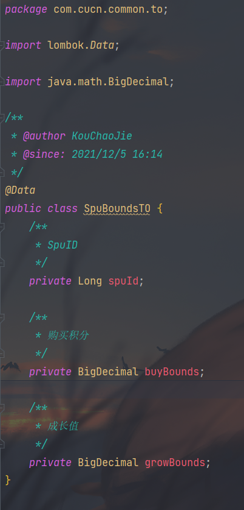

+ 商品服务调用优惠服务保存spu的积分信息

  ```java
  //5.保存spu的积分信息 跨库 sms_spu_bounds 商品积分
  Bounds bounds = spuSaveVO.getBounds();
  SpuBoundsTO spuBoundsTO = new SpuBoundsTO();
  BeanUtils.copyProperties(bounds, spuBoundsTO);
  spuBoundsTO.setSpuId(spuInfoEntity.getId());
  couponFeignService.saveSpuBounds(spuBoundsTO);
  ```

  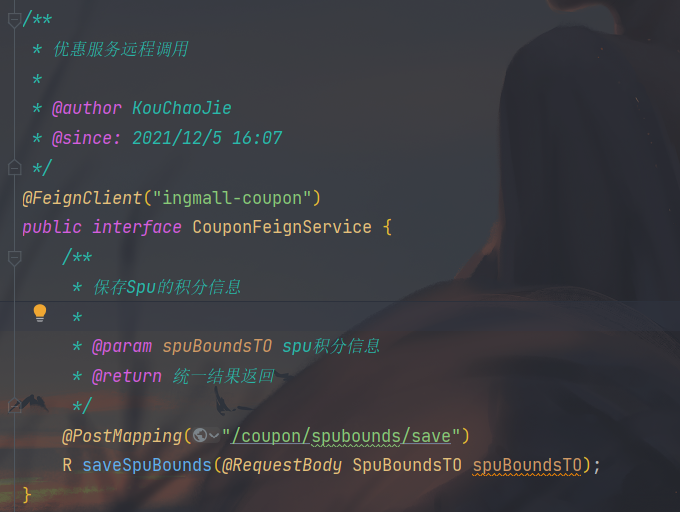

  + @RequestBody将这个对象转为json。     

    找到gulimall-coupon服务，给/coupon/spubounds/save发送请求。     

     将上一步转的json放在请求体位置，发送请求；     

    对方服务收到请求。请求体里有json数据。    

     (@RequestBody SpuBoundsEntity spuBounds)；将请求体的json转为SpuBoundsEntity；

    只要json数据模型是兼容的。双方服务无需使用同一个to


+ 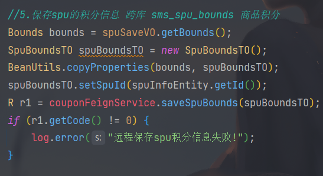

  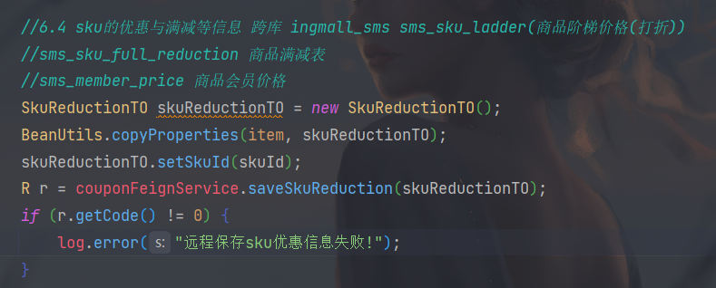

```java
/**
 * 保存Sku的优惠信息
 *
 * @param skuReductionTO sku优惠信息对象
 */
@Override
public void saveSkuReduction(SkuReductionTO skuReductionTO) {
    //6.4 sku的优惠与满减等信息 跨库
    // ingmall_sms sms_sku_ladder(商品阶梯价格(打折))
    SkuLadderEntity skuLadderEntity = new SkuLadderEntity();
    BeanUtils.copyProperties(skuReductionTO, skuLadderEntity);
    skuLadderEntity.setAddOther(skuReductionTO.getCountStatus());
    skuLadderService.save(skuLadderEntity);

    //sms_sku_full_reduction 商品满减表
    SkuFullReductionEntity skuFullReductionEntity = new SkuFullReductionEntity();
    BeanUtils.copyProperties(skuReductionTO, skuFullReductionEntity);
    skuFullReductionEntity.setAddOther(skuReductionTO.getPriceStatus());
    this.save(skuFullReductionEntity);

    //sms_member_price 商品会员价格
    List<MemberPrice> memberPrice = skuReductionTO.getMemberPrice();
    List<MemberPriceEntity> memberPriceList = memberPrice.stream().map(item -> {
        MemberPriceEntity memberPriceEntity = new MemberPriceEntity();
        memberPriceEntity.setSkuId(skuReductionTO.getSkuId());
        memberPriceEntity.setMemberLevelName(item.getName());
        memberPriceEntity.setId(item.getId());
        memberPriceEntity.setMemberPrice(item.getPrice());
        memberPriceEntity.setAddOther(1);

        return memberPriceEntity;
    }).collect(Collectors.toList());
    memberPriceService.saveBatch(memberPriceList);
}
```


### 8.5.8 解决商品新增的BUG

+ 在保存spu的描述图片时，由于spu介绍表主键不是自增，mp默认当成自增，所以导致没有插入主键值

  ```sql
  INSERT INTO pms_spu_info_desc ( decript ) VALUES (**********)
  ```

  修改主键的策略，改成输入主键

  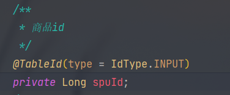

+ 在保存sku图集时，有的sku并没有选中图片但依然被保存进了sku_images，应该是没有图片的不存数据库

  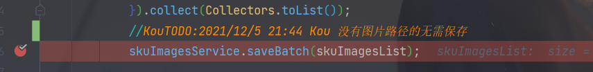

+ 在保存一些满减信息时，有些商品没有满减活动，就不保存。


+ 用过滤解决

+ 在过滤时，BigDecimal类型值需要使用compareTo来比较

  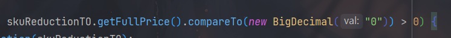


## 8.6 商品维护-商品管理

### 8.6.1 SPU检索

+ 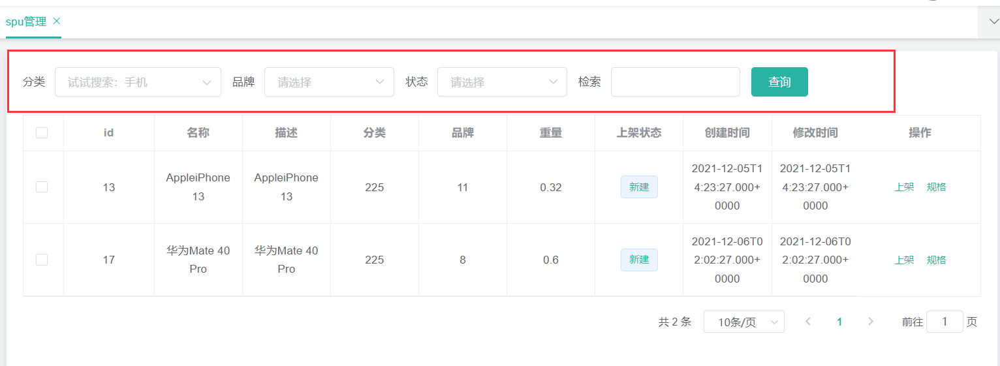

+ 接口文档

  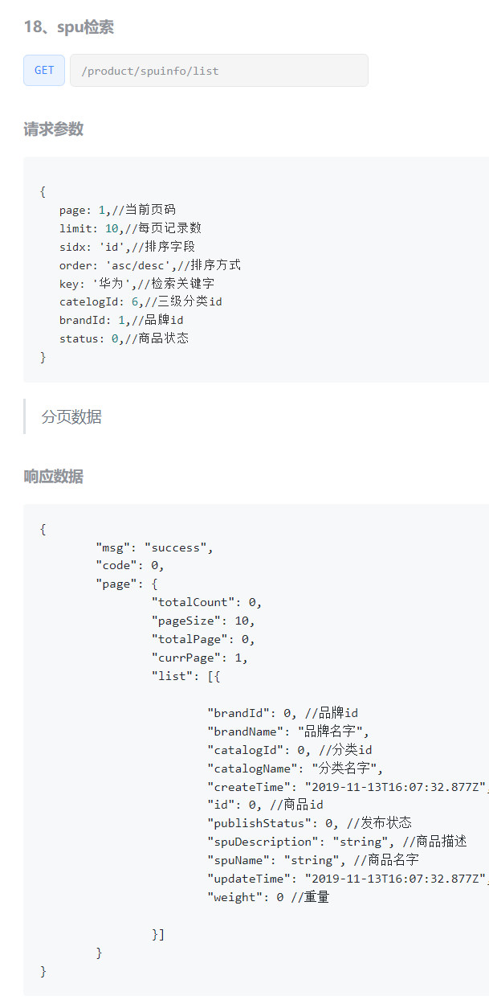

  **注意这里请求参数只能做强转，如果使用String.valueOf那么拼接的参数也是String类型，会出问题**

```java
/**
 * SPU条件检索
 *
 * @param params 请求参数
 * @return 查询出的分页数据
 */
@Override
public PageUtils queryPageByCondition(Map<String, Object> params) {
    QueryWrapper<SpuInfoEntity> wrapper = new QueryWrapper<>();
    /**
     * key: '华为',//检索关键字
     *    catelogId: 6,//三级分类id
     *    brandId: 1,//品牌id
     *    status: 0,//商品状态
     */
    String key = (String)(params.get("key"));
    if (StringUtils.isNotEmpty(key)) {
        wrapper.and(w -> {
            w.eq("id", key).or().like("spu_name", key);
        });
    }

    String catelogId = (String)(params.get("catelogId"));
    if (StringUtils.isNotEmpty(catelogId) && !"0".equalsIgnoreCase(catelogId)) {
        wrapper.eq("catalog_id", catelogId);
    }

    String brandId = (String)(params.get("brandId"));
    if (StringUtils.isNotEmpty(brandId) && !"0".equalsIgnoreCase(brandId)) {
        wrapper.eq("brand_id", brandId);
    }

    String status = (String)(params.get("status"));
    if (StringUtils.isNotEmpty(status)) {
        wrapper.eq("publish_status", status);
    }

    IPage<SpuInfoEntity> page = this.page(
            new Query<SpuInfoEntity>().getPage(params),
            wrapper
    );

    return new PageUtils(page);
}
```


#### 统一时间配置


### 8.6.2 SKU检索

+ 接口文档

  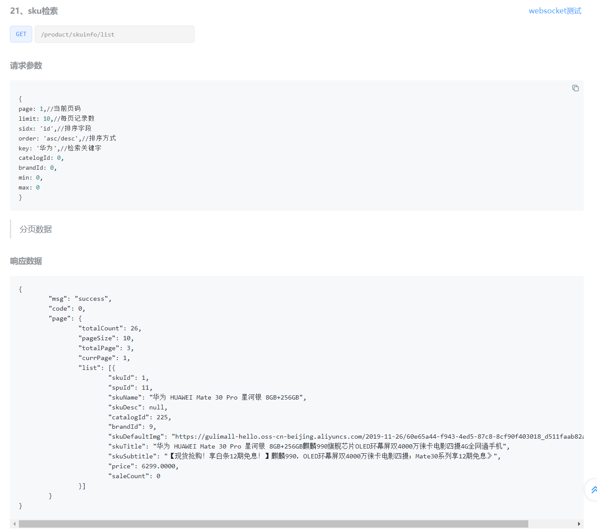

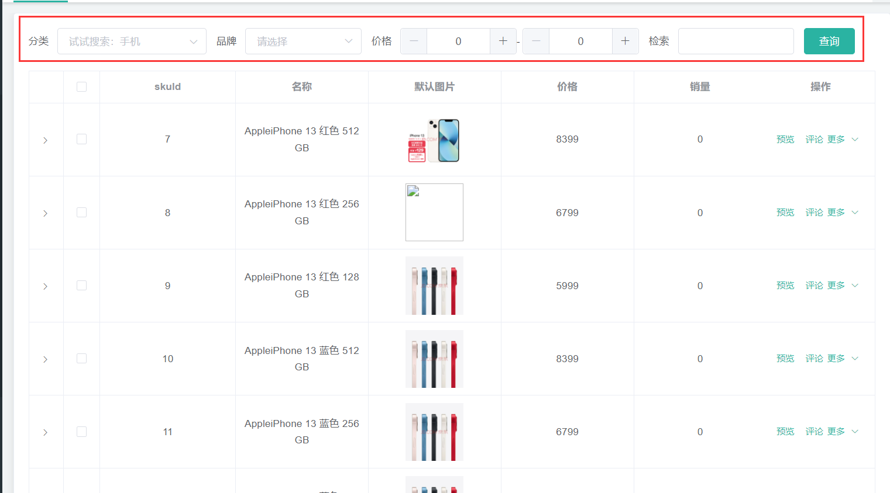


### 8.6.3 SPU规格维护

+ spu的规格参数后期可能需要修改

  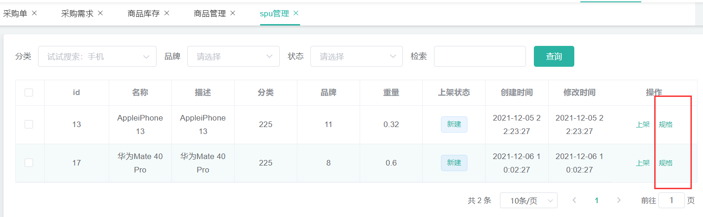

+ 点击规格，修改需要回显，首先获取spu规格

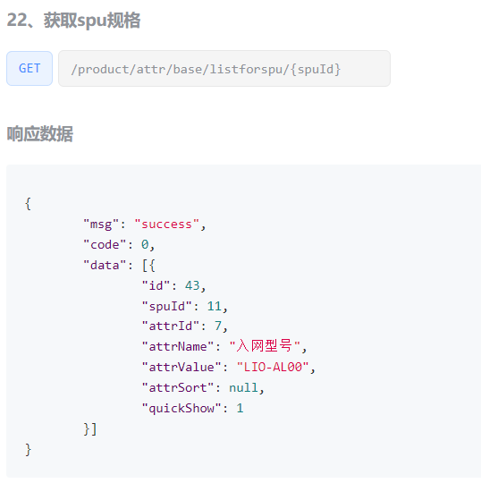

+ 点击规格，回显商品的相关参数

  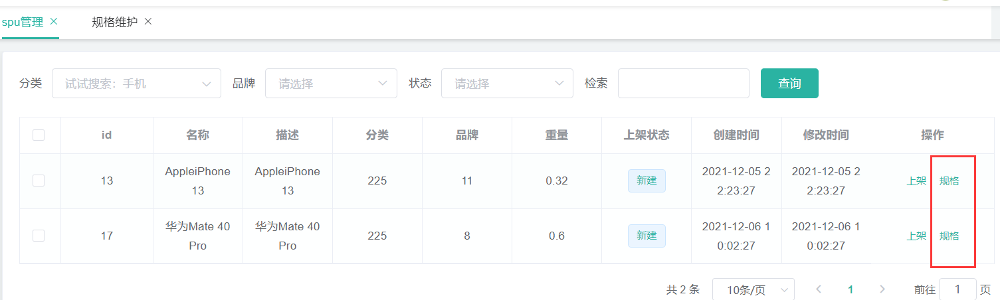

  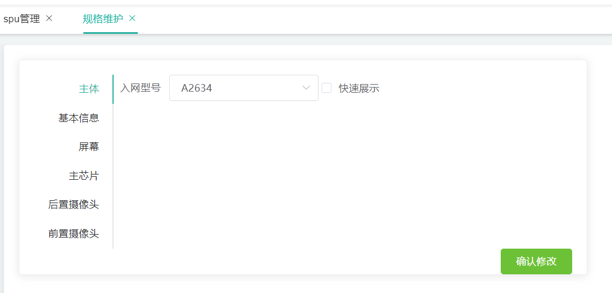

+ 修改参数后，点击确认修改，修改商品的参数

  

  因为页面提交的是全量数据，所以可以先删除再添加

```java
/**
 * 修改商品规格
 *
 * @param spuId            spuId
 * @param attrUpdateValues 修改的规格参数集合
 */
@Override
@Transactional
public void updateSpuAttr(Long spuId, List<ProductAttrValueEntity> attrUpdateValues) {
    //删除spu的属性
    this.remove(new QueryWrapper<ProductAttrValueEntity>().eq("spu_id", spuId));
    //给属性添上spuId
    attrUpdateValues.forEach(item -> {
        item.setSpuId(spuId);
    });
    //批量保存
    this.saveBatch(attrUpdateValues);
}
```


# 9.仓储服务-API

## 9.1 仓库管理

### 9.1.1 整合ware服务&获取仓库列表

+ 网关添加路由规则

+ 添加注解将ware注册进nacos

+ 条件查询仓库列表

+ 接口文档

  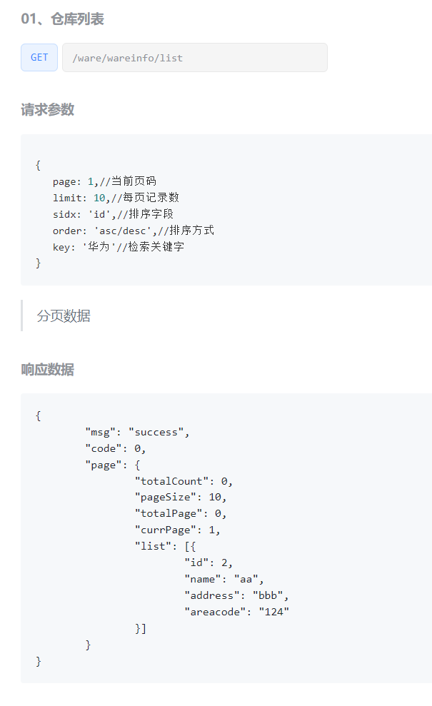

```java
/**
 * 条件查询仓库列表
 *
 * @param params 请求参数
 * @return 分页仓库数据
 */
@Override
public PageUtils queryPageCondition(Map<String, Object> params) {
    QueryWrapper<WareInfoEntity> wrapper = new QueryWrapper<>();
    String key = (String) params.get("key");
    //可以根据id，地址，名称，编码进行条件查询
    if (StringUtils.isNotEmpty(key)) {
        wrapper.eq("id", key)
                .or().like("name", key)
                .or().like("address", key)
                .or().like("areacode", key);
    }
    IPage<WareInfoEntity> page = this.page(
            new Query<WareInfoEntity>().getPage(params),
            wrapper
    );

    return new PageUtils(page);
}
```


### 9.1.2 查询库存&创建采购需求

+ 查询库存接口文档

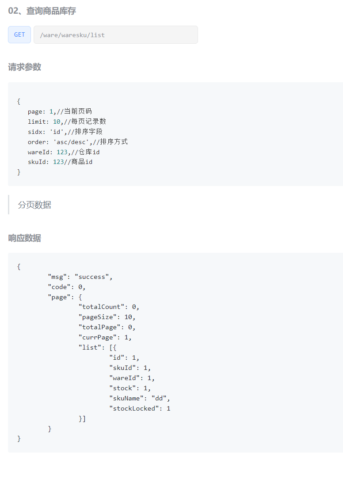

+ 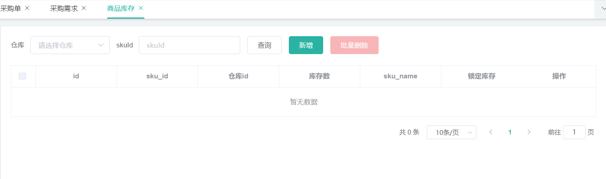

+ 商品的库存不应该是我们人为添加上去，应该由采购人员添加采购需求，然后生成采购单，采购完成后，自动添加库存。

  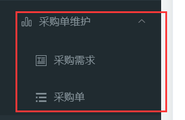

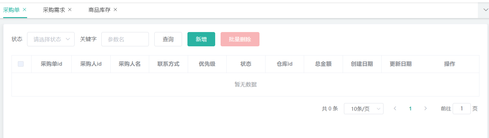

+ 采购需求，可以由人为创建，或者系统发出低库存预警，自动去创建采购需求

  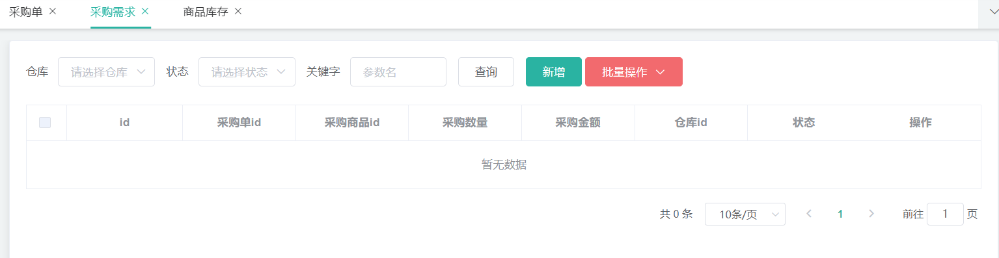

+ 一个仓库可能会有非常多的采购需求，而采购单应该将这些需求合并之后生成

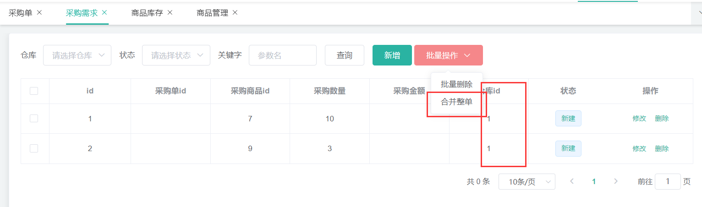

+ 首先编写条件查询

  ```java
  @Override
  public PageUtils queryPage(Map<String, Object> params) {
      /**
       * key: '华为',//检索关键字
       *    status: 0,//状态
       *    wareId: 1,//仓库id
       */
      QueryWrapper<PurchaseDetailEntity> wrapper = new QueryWrapper<>();
  
      String key = (String) params.get("key");
      if (StringUtils.isNotEmpty(key)) {
          wrapper.and(w -> {
              w.eq("sku_id", key).or().eq("purchase_id", key);
          });
      }
  
      String status = (String) params.get("status");
      if (StringUtils.isNotEmpty(status)) {
          wrapper.eq("status", status);
      }
  
      String wareId = (String) params.get("wareId");
      if (StringUtils.isNotEmpty(wareId)) {
          wrapper.eq("ware_id", wareId);
      }
  
      IPage<PurchaseDetailEntity> page = this.page(
              new Query<PurchaseDetailEntity>().getPage(params),
              wrapper
      );
  
      return new PageUtils(page);
  }
  ```


### 9.1.3 合并采购需求

+ 采购流程

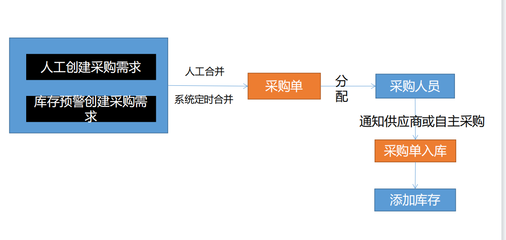

+ 合并采购单页面需要查询出采购单

  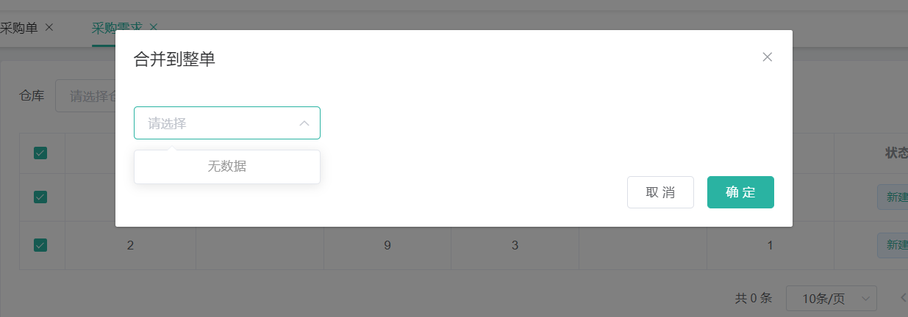

+ 查询出的采购单必须是新建的采购单，不能是被分配或被领取或以完成或有异常的采购单

  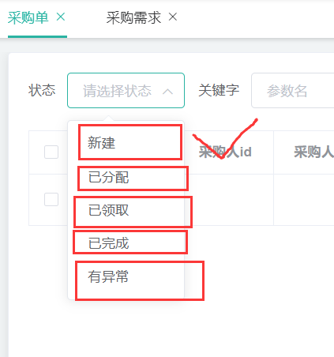

+ 查询未领取的采购单，接口文档

  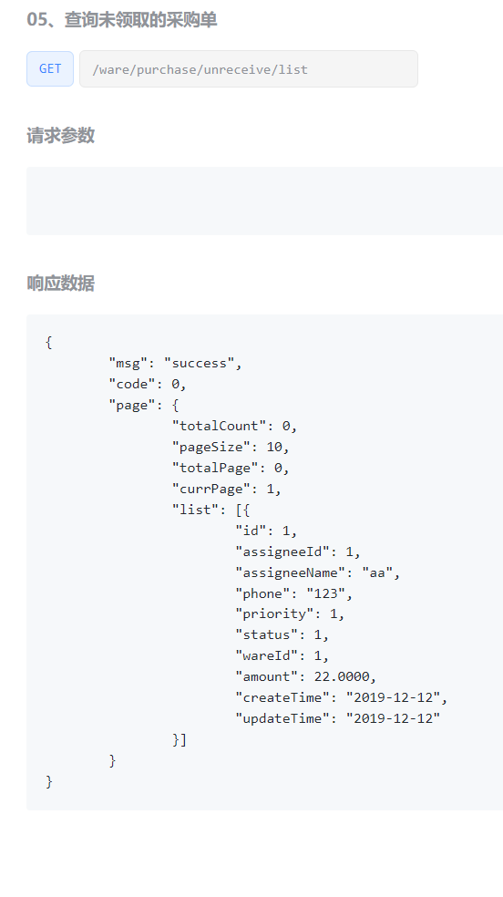

  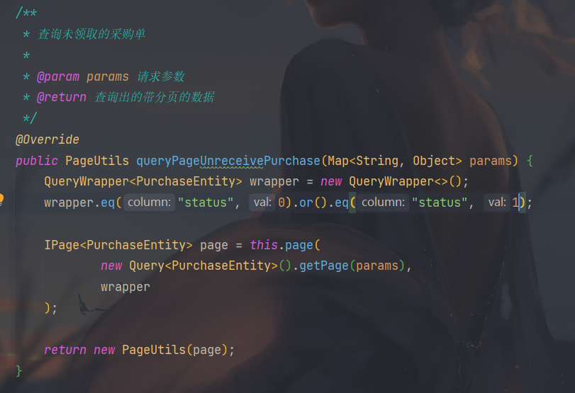

+ 合并采购需求

+ 接口文档

  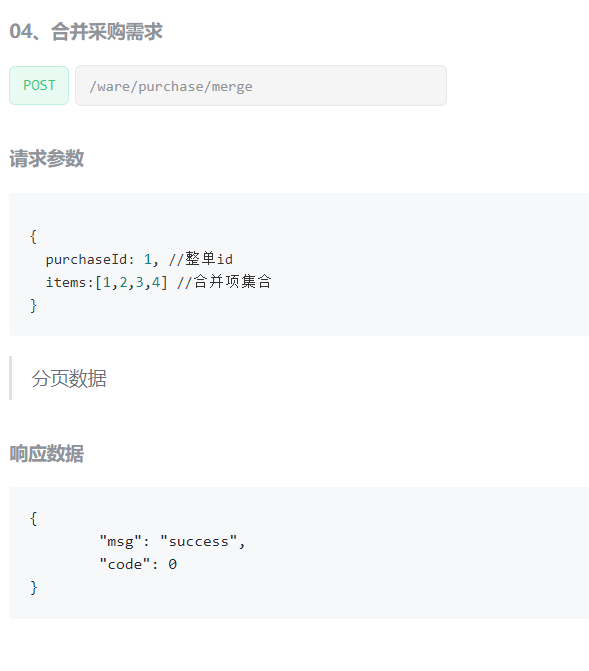

+ 注意，当合并时没有选中采购单时，系统会自动创建一个采购单，这时传给后端数据里没有采购单id

+ ```java
  /**
   * 采购需求合并到采购单
   *
   * @param purchaseMergeVO 合并采购需求VO对象
   */
  @Override
  @Transactional
  public void mergePurchase(PurchaseMergeVO purchaseMergeVO) {
      Long purchaseId = purchaseMergeVO.getPurchaseId();
      //如果采购单为空,必须新建一个采购单之后进行合并
      if (purchaseId == null) {
          PurchaseEntity purchaseEntity = new PurchaseEntity();
          purchaseEntity.setStatus(WareConstant.PurchaseStatusEnum.CREATED.getCode());
          this.save(purchaseEntity);
          purchaseId = purchaseEntity.getId();
      }
      //采购需求的id
      List<Long> items = purchaseMergeVO.getItems();
  
      Long finalPurchaseId = purchaseId;
      List<PurchaseDetailEntity> purchaseDetailList = items.stream().map(detailId -> {
          PurchaseDetailEntity purchaseDetailEntity = new PurchaseDetailEntity();
          purchaseDetailEntity.setPurchaseId(finalPurchaseId);
          purchaseDetailEntity.setStatus(WareConstant.PurchaseDetailStatusEnum.ASSIGNED.getCode());
          purchaseDetailEntity.setId(detailId);
          return purchaseDetailEntity;
      }).collect(Collectors.toList());
      purchaseDetailService.updateBatchById(purchaseDetailList);
  }
  ```


### 9.1.4 领取采购单

+ 领取采购单应该是采购人员单独使用一个app或页面进行采购，不属于后台管理系统，这里我使用postman模拟采购

  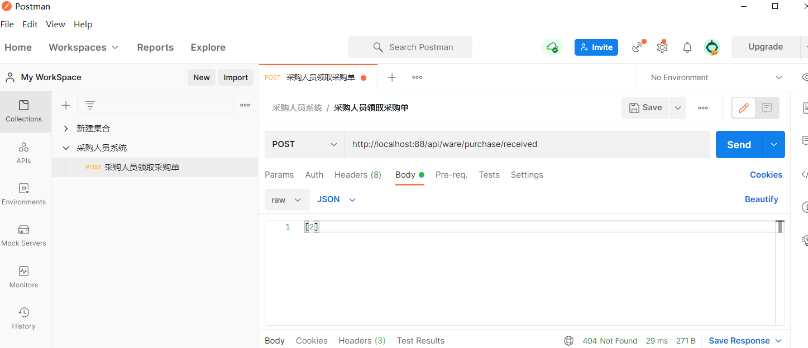

+ 领取采购单，接口文档

  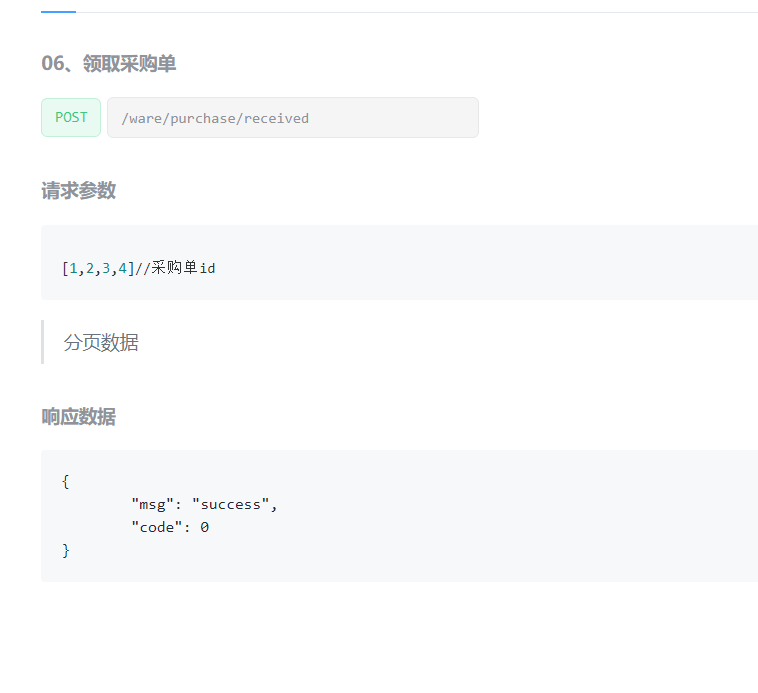

+ 采购人员领取采购单之后，采购单状态应该是变成已领取。同时，采购单下的采购需求状态应该变为正在采购。

+ 需要确认采购单是新建或者是已分配状态

+ ```java
  /**
   * 采购人员领取采购单
   *
   * @param purchaseIds 采购单id集合
   */
  @Override
  @Transactional
  public void received(List<Long> purchaseIds) {
      //1.确认采购单是新建或者是已分配状态
      List<PurchaseEntity> purchaseList = purchaseIds.stream()
              .map(ids -> this.getById(ids))
              .filter(item -> item.getStatus() == WareConstant.PurchaseStatusEnum.CREATED.getCode() ||
                      item.getStatus() == WareConstant.PurchaseStatusEnum.ASSIGNED.getCode())
              .peek(item -> item.setStatus(WareConstant.PurchaseStatusEnum.RECEIVE.getCode()))
              .collect(Collectors.toList());
      //2.改变采购单状态
      this.updateBatchById(purchaseList);
  
      //3.改变采购需求状态
      purchaseList.forEach(item -> {
          purchaseDetailService.updateListDetailByPurchaseId(item.getId());
      });
  }
  ```

+ ```java
  /**
   * 根据采购单的id修改采购需求的状态
   *
   * @param id 采购单id
   */
  @Override
  public void updateListDetailByPurchaseId(Long id) {
      UpdateWrapper<PurchaseDetailEntity> updateWrapper = new UpdateWrapper<>();
      updateWrapper.set("status", WareConstant.PurchaseDetailStatusEnum.BUYING.getCode());
      updateWrapper.eq("purchase_id", id);
      this.update(updateWrapper);
  }
  ```


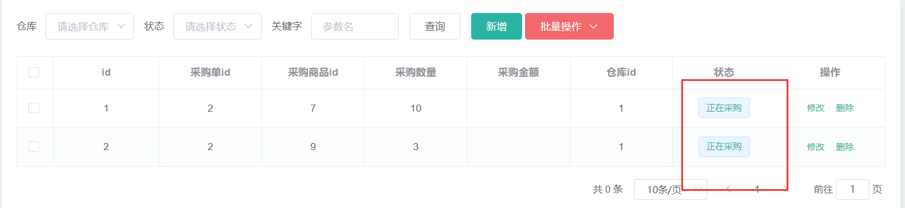


### 9.1.5 完成采购

+ 当采购人员完成采购之后，点击完成采购单，那么该采购单下的采购需求的所有商品以及数量会更新到库存中

+ ```markdown
  1.改变采购单状态
  采购单的状态要根据采购项的状态走，如果采购项全部采购完成，采购单也完成，如果采购项有一个采购失败，那么采购单将就是状态异常
  2.改变采购项的状态
  3.将成功采购的进行入库
  ```

+ 接口文档

  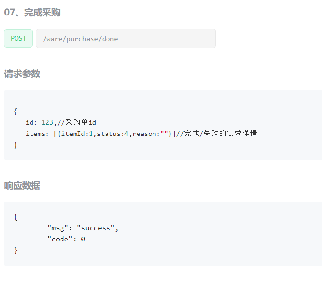

```java
/**
 * 采购人员完成采购单
 *
 * @param doneVO 完成采购单vo对象
 */
@Override
@Transactional
public void done(PurchaseDoneVO doneVO) {
    //2.改变采购需求的状态
    List<PurchaseItemDoneVO> items = doneVO.getItems();

    boolean flag = true;
    List<PurchaseDetailEntity> itemList = new ArrayList<>();
    for (PurchaseItemDoneVO item : items) {
        PurchaseDetailEntity purchaseDetailEntity = new PurchaseDetailEntity();
        purchaseDetailEntity.setId(item.getItemId());
        if (item.getStatus() == WareConstant.PurchaseDetailStatusEnum.HASERR.getCode()) {
            flag = false;
            purchaseDetailEntity.setStatus(item.getStatus());
        } else {
            purchaseDetailEntity.setStatus(WareConstant.PurchaseDetailStatusEnum.FINISH.getCode());
            //3.将成功采购的进行入库
            PurchaseDetailEntity purchaseDetail = purchaseDetailService.getById(item.getItemId());
            //商品id,仓库id,入库商品数量
            wareSkuService.addStock(purchaseDetail.getSkuId(), purchaseDetail.getWareId(), purchaseDetail.getSkuNum());
        }
        itemList.add(purchaseDetailEntity);
    }
    purchaseDetailService.updateBatchById(itemList);

    //1.改变采购单状态
    //采购单的状态要根据采购项的状态走
    Long purchaseId = doneVO.getId();
    PurchaseEntity purchaseEntity = new PurchaseEntity();
    purchaseEntity.setId(purchaseId);
    purchaseEntity.setStatus(flag ? WareConstant.PurchaseStatusEnum.FINISH.getCode() : WareConstant.PurchaseStatusEnum.HASERR.getCode());
    this.updateById(purchaseEntity);
}
```

```java
/**
 * 将采购人员采购的商品入库
 *
 * @param skuId  skuId
 * @param wareId 仓库id
 * @param skuNum sku的数量
 */
@Override
public void addStock(Long skuId, Long wareId, Integer skuNum) {
    //判断是更新还是新增操作
    List<WareSkuEntity> skuEntityList = wareSkuDao.selectList(new QueryWrapper<WareSkuEntity>().eq("sku_id", skuId).eq("ware_id", wareId));
    if (skuEntityList == null || skuEntityList.size() == 0) {
        WareSkuEntity wareSkuEntity = new WareSkuEntity();
        wareSkuEntity.setSkuId(skuId);
        wareSkuEntity.setWareId(wareId);
        wareSkuEntity.setStock(skuNum);
        wareSkuEntity.setStockLocked(0);
        //远程查询,如果失败整个事务不需要回滚
        //KouTODO:2021/12/7 11:25 Kou 还有什么办法出异常之后不回滚？
        try {
            R r = productFeignService.info(skuId);
            Map<String, Object> skuInfo = (Map<String, Object>) r.get("skuInfo");
            if (r.getCode() == 0) {
                wareSkuEntity.setSkuName((String) skuInfo.get("skuName"));
            }
        } catch (Exception ignored) {

        }
        wareSkuDao.insert(wareSkuEntity);
    } else {
        wareSkuDao.addStock(skuId, wareId, skuNum);
    }
}
```


# 10.分布式基础篇总结

基础篇完成了整个商城系统后台管理的大部分功能开发

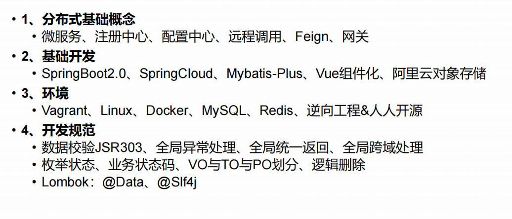

