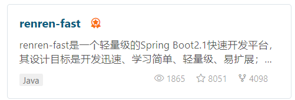
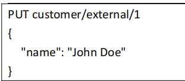
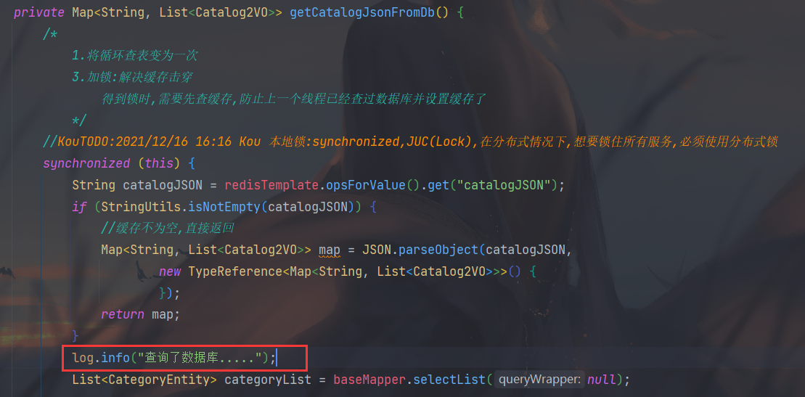
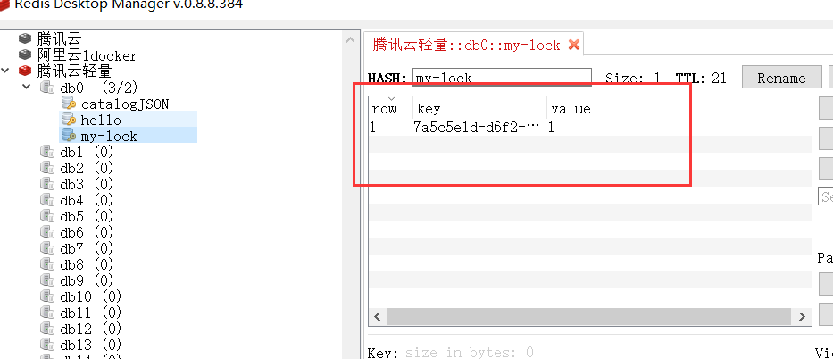

[TOC]


# 1.项目介绍

## 1.1 概述

开发分为三部分：

1. 分布式基础（全栈开发）
   + SpringBoot+SpringCloud+Docker作为后端基础环境
   + Vue+ElementUI
2. 分布式高级（微服务架构）
   + 完成商城业务逻辑，打通微服务开发技术栈
   + SpringCloud Alibaba
3. 高可用集群（架构能力提升）
   + K8s集群（一主两从）
   + 打通DevOps
   + 可视化持续集成部署


### 1.1.2 项目背景

此项目采用的是B2C模式（Business to Consumer）的电商平台，即供应商直接将商品卖给客户。商对客，商业零售，直接面向消费者销售产品和服务，销售自营商品给客户。


### 1.1.3 项目技术

+ 前后端分离开发，后台管理系统基于VUE
+ SpringCloud最新解决方案
+ 应用监控，限流，网关，熔断，降级等分布式方案
+ 涉及到分布式事务，分布式锁
+ 涉及到高并发场景
+ 压力测试与系统优化
+ 集群技术
+ CI/CD使用


# 2.分布式基础概念

## 2.1 微服务

微服务架构风格，就像是把一个单独的应用程序开发为一套小服务，每个小服务运行在自己的进程中，并使用轻量级机制通信，通常是HTTP API。这些服务围绕业务能力来构建，并通过完全自动化部署机制来独立部署。这些服务使用不同的编程语言书写，以及不同数据存储技术，并保持最低限度的集中式管理。
==简而言之:拒绝大型单体应用，基于业务边界进行服务微化拆分,各个服务独立部署运行。==


《深入理解Java虚拟机》P24

> 在微服务架构的视角下，应用拆分后，单个微服务很可能就不再需要面对数十、数百GB乃至TB的内存，有了高可用的服务集群，也无需追求单个服务要7x24小时不间断运行，它们可以随时中断和更新。


## 2.2 集群&分布式&节点

集群是个物理形态，分布式是个工作状态。

只要是一堆机器，就可以叫集群，他们是不是一起协作着干活，这个谁也不知道。

```markdown
《分布式系统原理与范型》定义：
“分布式系统是若干独立计算机的集合，这些计算机对于用户来说就像单个相关系统”
分布式系统（distributed system）是建立在网络之上的软件系统。
```

分布式是指将不同的业务分布在不同的地方。

集群指的是将几台服务器集中在一起，实现同一业务。

例如，**京东是一个分布式系统，众多业务运行在不同的机器，**所有业务构成一个大型的**业务集群**。每一个小的业务，比如用户系统，访问压力大的时候一台服务器是不够的，我们就应该将用户系统部署到多台服务器，也就是每一个业务系统也可以做集群化。

==分布式中的每一个节点，都可以做集群，而集群并不一定就是分布式的。==

节点：集群中的一个服务器。


## 2.3 远程调用

在分布式系统中，各个服务可能处于不同主机，但是服务之间不可避免的需要互相调用，我们称为远程调用。
SpringCloud中使用HTTP+JSON的方式完成远程调用


## 2.4 负载均衡


分布式系统中，A服务需要调用B服务，B服务在多台机器中都存在，A调用任意一个服务器均可完成功能。
为了使每一个服务器都不要太忙或者太闲,我们可以负载均衡的调用每一个服务器，提升网站的健壮性。

**常见的负裁均衡算法:**
轮询:为第一一个请求选择健康池中的第一个后端服务器， 然后按顺序往后依次选择，直到最后一个，然后循环。
最小连接:优先选择连接数最少，也就是压力最小的后端服务器，在会话较长的情况下可以考虑采取这种方式。
散列:根据请求源的IP 的散列(hash) 来选择要转发的服务器。这种方式可以一定程度上保证特定用户能连接到相同的服务器。如果你的应用需要处理状态而要求用户能连接到和之前相同的服务器，可以考虑采取这种方式。


## 2.5 服务注册/发现&注册中心

A服务调用B服务，A服务并不知道B服务当前在哪几台服务器有，哪些正常的，哪些服务已经下线。解决这个问题可以引入注册中心。


如果某些服务下线，我们其他人可以实时的感知到其他服务的状态，从而避免调用不可用的服务。


## 2.6 配置中心


每一个服务:最终都有大量的配置,并且每个服务都可能部署在多台机器.上。我们经常需要变更配置，我们可以让每个服务在配置中心获取自己的配置。
**配置中心用来集中管理微服务的配置信息**。


## 2.7 服务熔断&服务降级

在微服务架构中，微服务之间通过网络进行通信，存在相互依赖，当其中一个服务不可用时，有可能会造成雪崩效应，要防止这样的情况，必须要有容错机制来保护服务。

+ **服务熔断**
  设置服务的超时，当被调用的服务经常失败到达某个阈值，我们可以开启断路保护机制，后来的请求不再去调用这个服务。本地直接返回默认的数据。
+ **服务降级**
  在运维期间，当系统处于高峰期，系统资源紧张，我们可以让非核心业务降级运行。降级:某些服务不处理,或者简单处理[抛异常、返回NULL、调用Mock数据、调用Fallback处理逻辑。


## 2.8 API网关

在微服务架构中，API Gateway作为整体架构的重要组件，它抽象了微服务中部需要的公共功能，同时提供了客户端负载均衡，服务自动熔断，灰度发布，统-认证，限流流控，日志统计等丰富的功能，帮助我们解决很多API管理难题。


# 3.架构分析

## 3.1 微服务架构图


## 3.2 微服务划分图


# 4.环境搭建

## 4.1 安装虚拟机


## 4.2 安装Docker


安装过程跟着官网走


+ 配置阿里云镜像加速

  ```bash
  sudo mkdir -p /etc/docker
  sudo tee /etc/docker/daemon.json <<-'EOF'
  {
    "registry-mirrors": ["https://t3o5y425.mirror.aliyuncs.com"]
  }
  EOF
  sudo systemctl daemon-reload
  sudo systemctl restart docker
  ```

  

## 4.3 Docker安装mysql

```bash
docker pull mysql:8.0
```


```bash
docker run -p 3306:3306 --name mysql -v /mydata/mysql/log:/var/log/mysql -v /mydata/mysql/data:/var/lib/mysql -v /mydata/mysql/conf:/etc/mysql -e MYSQL_ROOT_PASSWORD=root -d mysql:8.0 
参数说明-p 3306:3306：将容器的 3306 端口映射到主机的 3306 端口 
-v /mydata/mysql/conf:/etc/mysql：将配置文件夹挂载到主机 
-v /mydata/mysql/log:/var/log/mysql：将日志文件夹挂载到主机 
-v /mydata/mysql/data:/var/lib/mysql/：将配置文件夹挂载到主机 
-e MYSQL_ROOT_PASSWORD=root：初始化 root 用户的密码
```

-v 目录挂载


配置mysql

```bash
vi /mydata/mysql/conf/my.cnf
[client]
default-character-set=utf8 

[mysql]
default-character-set=utf8 

[mysqld]
init_connect='SET collation_connection = utf8_unicode_ci'
init_connect='SET NAMES utf8'
character-set-server=utf8
collation-server=utf8_unicode_ci
skip-character-set-client-handshake
skip-name-resolve
```


## 4.4 Docker安装Redis

`docker pull redis`


+ 创建实例并启动

  ```bash
  mkdir -p /mydata/redis/conf 
  touch /mydata/redis/conf/redis.conf 
  docker run -p 6379:6379 --name redis -v /mydata/redis/data:/data -v /mydata/redis/conf/redis.conf:/etc/redis/redis.conf -d redis redis-server /etc/redis/redis.conf
  ```

+ 持久化，密码设置，直接在配置文件更改

  


## 4.5 配置Git


## 4.6 项目环境构建&提交到git

### 4.6.1 创建项目微服务

**==版本选择：SpringBoot2.1.8.RELEASE,Cloud:Greenwich.SR3,Alibaba:2.1.0.RELEASE==**

商品服务，仓储服务，订单服务，优惠券服务，用户服务

+ 共同点：
  + web，openfegin
  + 每一个服务，包名`com.cucn.ingmall.服务名(product/order/ware/coupon/member)`
  + 模块名`ingmall-服务名(product/order/ware/coupon/member)`

+ 配置.gitignore


## 4.7 数据库初始化

所有数据库，**==不建立外键==**

分别创建五个数据库

+ oms：订单系统
  + oms_order	订单
  + oms_order_item	订单项信息
  + oms_order_operate_history	订单操作历史记录
  + oms_order_return_apply	订单退货申请
  + oms_order_return_reason	退货原因
  + oms_order_setting	订单配置信息
  + oms_payment_info	支付信息表
  + oms_refund_info	退款信息
+ pms：商品系统
  + pms_brand：**商品品牌表**
  + pms_category：商品分类表
  + pms_category_brand_relation：**品牌与分类关联表（品牌与分类是多对多关系）**
  + pms_attr：**商品属性表**
  + pms_attr_group：**属性分组表**
  + pms_attr_attrgroup_relation：**属性&属性分组关联表**
  + pms_product_attr_value：**SPU属性值表**
  + pms_spu_info：**SPU信息表**
  + pms_sku_info：**sku信息表**
  + pms_sku_images：**sku图片表**
  + pms_sku_sale_attr_value：**sku销售属性&值表**
  + pms_comment_replay：商品评价回复关系表
  + pms_spu_comment：商品评价
  + pms_spu_images：**spu图片（图集）**
  + pms_spu_info_desc：**spu信息介绍（介绍大图）**
+ sms：营销系统
  + sms_coupon：优惠券信息
  + sms_coupon_history：优惠券领取历史记录
  + sms_coupon_spu_category_relation：优惠券分类关联
  + sms_coupon_spu_relation：优惠券与产品关联
  + sms_home_adv：首页轮播广告
  + sms_home_subject：首页专题表【jd首页下面很多专题，每个专题链接新的页面，展示专题商品信息】
  + sms_home_subject_spu：专题商品
  + sms_member_price：商品会员价格
  + sms_seckill_promotion：秒杀活动
  + sms_seckill_session：秒杀活动场次
  + sms_seckill_sku_notice：秒杀商品通知订阅
  + sms_seckill_sku_relation：秒杀活动商品关联
  + sms_sku_full_reduction：商品满减信息
  + sms_sku_ladder：商品阶梯价格
  + sms_spu_bounds：商品spu积分设置
+ ums：用户系统
  + ums_growth_change_history	成长值变化历史记录
  + ums_integration_change_history	积分变化历史记录
  + ums_member	**会员**
  + ums_member_collect_spu	会员收藏的商品
  + ums_member_collect_subject	会员收藏的专题活动
  + ums_member_level	**会员等级**
  + ums_member_login_log	会员登录记录
  + ums_member_receive_address	会员收货地址
  + ums_member_statistics_info	会员统计信息
+ wms：库存系统

  + wms_purchase	**采购单**
  + wms_purchase_detail	**采购需求**
  + wms_ware_info	**仓库信息**
  + wms_ware_order_task	库存工作单
  + wms_ware_order_task_detail	库存工作单（采购单）
  + wms_ware_sku	**商品库存**


# 5.快速开发

## 5.1 使用人人开源搭建后台管理系统




+ 使用人人开源项目，快速搭建后台脚手架

+ 修改代码调整为需要的业务逻辑

+ 创建各个微服务以及数据库
+ 创建数据库ingmall_admin为后台管理数据库


**前端使用reren-fast-vue**

==此处应注意node-sass与sassloader与node版本对应关系！！！！！！==


## 5.2 使用人人开源renren-generator快速开发搭建逆向工程


需要生成哪个数据库的逆向工程就连接哪个数据库


在配置文件中配置相关信息


+ 运行后，打开页面`localhost:80`，生成代码

  

  

  

  自动生成基本代码


+ 生成后的代码需要导入相关依赖
+ **创建common模块，存放项目的公共依赖，工具类**

+ 修改逆向工程模板，将不需要的注解注释掉


## 5.3 配置&测试微服务基本CRUD功能

+ **整合MP**

  **数据库驱动8.0可以兼容5.7**

+ 配置数据源

  导入数据库的驱动

  在yml里配置数据源相关信息

+ 配置mybatis-plus

  + 使用`@MapperScan扫描注解扫描mapper接口位置`

  + 告诉mp，xml文件位置，在yml文件配置

  + 配置mp的主键自增策略

    


## 5.4 逆向生成所有微服务基本crud代码

构建出项目结构大纲


# 6.分布式组件-SpringCloud

## 6.1 SpringCloud Alibaba简介


**结合** **SpringCloud Alibaba** **我们最终的技术搭配方案：** 

**SpringCloud Alibaba - Nacos****：注册中心（服务发现/注册）

**SpringCloud Alibaba - Nacos****：配置中心（动态配置管理）

**SpringCloud - Ribbon**：负载均衡

**SpringCloud - Feign**：声明式 **HTTP** **客户端（调用远程服务）** 

**SpringCloud Alibaba - Sentinel**：服务容错（限流、降级、熔断）

**SpringCloud - Gateway**：API **网关（****webflux** **编程模式）** 

**SpringCloud - Sleuth****：调用链监控** 

**SpringCloud Alibaba - Seata**：原Fescar，即分布式事务解决方案


## 6.2 Nacos注册中心

+ 导入依赖

```xml
<!--Nacos服务注册发现-->
<!--服务注册/发现-->
<dependency>
    <groupId>com.alibaba.cloud</groupId>
    <artifactId>spring-cloud-starter-alibaba-nacos-discovery</artifactId>
</dependency>
```


+ 在配置文件中配置Nacos注册中心的地址

  ```yaml
  # nacos
  cloud:
    nacos:
      discovery:
        server-addr: 127.0.0.1:8848
  ```

+ 在启动类上标上注解`EnableDiscoveryClient`

+ 每个微服务都需要有自己的application name，这样才能知道注册中心注册了哪些服务


## 6.3 OpenFeign测试远程调用

+ 引入OpenFeign

+ 编写一个接口，告诉SpringCloud这个接口需要调用远程服务

+ 接口标上注解`FeignClient("调用的服务名称")`

+ 方法直接复制远程请求的方法签名

  方法签名中的请求地址需要复制全部的

+ 开启远程调用功能

  + 启动类标上注解`EnableFeignClients("Feign包的全类名")`


## 6.4 Nacos配置中心

```xml
<dependency>    <groupId>com.alibaba.cloud</groupId>    <artifactId>spring-cloud-starter-alibaba-nacos-config</artifactId></dependency>
```

+ 创建bootstrap.properties配置文件，该文件会优先于application加载
  + 配置相应的nacos地址和服务名称
+ 在之前配置文件一更改，模块也要重新启动。现在将配置交给配置中心
  + 配置中心添加数据集，默认名为 服务名+properties
+ 在业务类标上注解`@RefreshScope`动态刷新配置
+ 至此`Value`配置就可以动态的刷新

+ 如果配置中心和当前应用配置文件中都配置了相同的项，优先使用配置中心的配置 


### 6.4.1 Nacos配置中心-命名空间与配置分组

+ **命名空间**

  用于进行租户粒度的配置隔离。不同的命名空间下，可以存在相同的 **Group** 或 **Data ID** 的 

  配置。**Namespace** 的常用场景之一是不同环境的配置的区分隔离，例如开发测试环境和生 

  产环境的资源（如配置、服务）隔离等。

  + 读取指定命名空间的配置

    在bootstrap.properties里配置

    ```properties
    spring.cloud.nacos.config.namespace=命名空间ID
    ```

    每一个微服务之间互相隔离配置，每一个微服务都创建一个自己的命名空间

+ **配置集**

  所有配置的集合

+ **配置集ID**

  类似文件名

  Data ID：类似文件名

+ **配置分组**

  默认所有配置集都属于DEFAULT_GROUP:

  spring.cloud.nacos.config.goup=组名


每个微服务创建自己的命名空间，使用配置分组区分环境，dev，test，prod


### 6.4.2 Naocs配置中心-加载多配置集


```properties
spring.application.name=ingmall-couponspring.cloud.nacos.config.server-addr=127.0.0.1:8848spring.cloud.nacos.config.namespace=命名空间IDspring.cloud.nacos.config.ext-config[0].data-id=datasource.yml   配置文件名spring.cloud.nacos.config.ext-config[0].group=dev  分组spring.cloud.nacos.config.ext-config[0].refresh=true  是否动态刷新spring.cloud.nacos.config.ext-config[1].data-id=mybatis.ymlspring.cloud.nacos.config.ext-config[1].group=devspring.cloud.nacos.config.ext-config[1].refresh=truespring.cloud.nacos.config.ext-config[2].data-id=other.ymlspring.cloud.nacos.config.ext-config[2].group=devspring.cloud.nacos.config.ext-config[2].refresh=true
```

+ 注意：默认会读取默认分组的：`服务名.properties` 配置文件，如果没有，会读取本地配置文件

  配置文件加上`spring.cloud.nacos.config.group=dev`

  指定加载哪个分组的默认配置文件

+ **总结**

  微服务任何配置信息，任何配置文件都可以放在配置中心

  只需在`bootstrap.properties`说明加载配置文件的规则即可

  `@Value` `@ConfigurationProperties`等等获取值。

  获取配置优先从配置中心获取


## 6.5 Gateway网关

### 6.5.1 核心概念&原理

网关作为流量的入口，常用功能包括路由转发、权限校验、限流控制等。

网关提供 API 全托管服务，丰富的 API 管理功能，辅助企业管理大规模的 API，以降低管理 

成本和安全风险，包括协议适配、协议转发、安全策略、防刷、流量、监控日志等功能。 

Spring Cloud Gateway 旨在提供一种简单而有效的方式来对 API 进行路由，并为他们提供切 

面，例如：安全性，监控/指标 和弹性等。

Spring Cloud Gateway 特点: 

+ 基于 Spring5，支持响应式编程和 SpringBoot2.0 

+ 支持使用任何请求属性进行路由匹配 

+ 特定于路由的断言和过滤器 

+ 集成 Hystrix 进行断路保护 

+ 集成服务发现功能 

+ 易于编写 Predicates 和 Filters 

+ 支持请求速率限制 

+ 支持路径重写


### 6.5.2 创建&测试

+ 开启服务注册/发现
+ 配置nacos的注册中心地址，服务名称


# 7.前端基础


# 8.商品服务-API

## 8.1 三级分类

数据表：**商品三级分类**：**pms_category**


 

### 8.1.1 查询-递归树形结构数据获取

商品分类以三级分类形式展现

后端以Stream流的方式过滤筛选

```java
    /**
     * 查出所有分类以及子分类,以树形结构组装起来
     *
     * @return 以树形结构包装的所有分类
     */
    @Override
    public List<CategoryEntity> listWithTree() {
        //1.查出所有分类
        List<CategoryEntity> entities = baseMapper.selectList(null);

        //2.组装成父子的树形结构
        //2.1找出所有的一级分类
        //过滤得到一级分类
        List<CategoryEntity> level1Menus = entities.stream().filter(categoryEntity ->
                        categoryEntity.getParentCid() == 0)
                //设置子分类
                .map((menu) -> {
                    menu.setChildren(getChildrens(menu, entities));
                    return menu;
                })
                //对菜单进行排序
                .sorted((menu1, menu2) -> {
                    return (menu1.getSort() == null ? 0 : menu1.getSort()) - (menu2.getSort() == null ? 0 : menu2.getSort());
                })
                //返回集合
                .collect(Collectors.toList());

        return level1Menus;
    }
```

然后递归查找子分类

```java
/**
     * 找到当前菜单的子菜单
     *
     * @param root 当前菜单
     * @param all  所有菜单
     * @return 当前菜单的子菜单
     */
private List<CategoryEntity> getChildrens(CategoryEntity root, List<CategoryEntity> all) {
    return all.stream().filter(categoryEntity ->
                               categoryEntity.getParentCid().equals(root.getCatId()))
        .map((categoryEntity) -> {
            //1.找到子菜单
            categoryEntity.setChildren(getChildrens(categoryEntity, all));
            return categoryEntity;
        })
        //排序
        .sorted((menu1, menu2) -> {
            return (menu1.getSort() == null ? 0 : menu1.getSort()) - (menu2.getSort() == null ? 0 : menu2.getSort());
        })
        .collect(Collectors.toList());
}
```


+ 前端使用ElementUI的树形控件进行展示

  


### 8.1.2 配置网关路由与路径重写

+ renren-fast引入注册中心，先引入common依赖

+ 启动类添加`EnableDiscoveryClient`

+ 网关配置路由规则

  后台管理的base_api路径带上/api/

  所有前端项目带/api/前缀的全部路由到renren-fast

  

+ 需要再进行路由重写

  

+ 后面具体的路由配置应该放在模糊配置前


### 8.1.3 网关统一配置跨域

指的是浏览器不能执行其他网站的脚本。它是由浏览器的同源策略造成的，是 **浏览器对**javascript**施加的安全限制**。

**同源策略**：是指协议，域名，端口都要相同，其中有一个不同都会产生跨域

```java
/** * 解决跨域问题 * * @author KouChaoJie * @since: 2021/11/22 20:03 */@Configurationpublic class IngMallCorsConfiguration {    @Bean    public CorsWebFilter corsWebFilter() {        UrlBasedCorsConfigurationSource source = new UrlBasedCorsConfigurationSource();        CorsConfiguration corsConfiguration = new CorsConfiguration();        //1.配置跨域        //允许哪些请求头进行跨域        corsConfiguration.addAllowedHeader("*");        //允许哪些请求方式进行跨域        corsConfiguration.addAllowedMethod("*");        //允许哪些请求来源进行跨域        corsConfiguration.addAllowedOrigin("*");        //是否允许携带cookie跨域        corsConfiguration.setAllowCredentials(true);        source.registerCorsConfiguration("/**", corsConfiguration);        return new CorsWebFilter(source);    }}
```


### 8.1.4 删除-页面效果

+ 添加`:expand-on-click-node="false"`使菜单只有点击箭头时才能展开合并。

+ 优化删除按钮显示效果

  + 只有该菜单没有子菜单时才显示删除按钮
  + v-if判断

  


### 8.1.5 逻辑删除

+ 检查当前删除的菜单，是否被别的地方引用

+ 逻辑删除步骤

  + 配置全局逻辑删除规则

    

  + 实体类字段加上逻辑删除注解，修改显示规则

    

    


### 8.1.6 删除效果细化

前端部分，不做过多解释


default-expanded-keys：默认展开的节点的 key 的数组

show-checkbox： 节点是否可被选择


### 8.1.7 新增-新增效果完成

+ 点击添加，出现对话框，输入菜单名字，点击确定，添加完成。

+ 使用element-ui的对话框组件完成

+ 添加对话框中需要有输入信息

+ 还需要获取在哪个分类添加的，获取id


+ 发送post请求到后端save方法


### 8.1.8 修改-基本修改效果

+ 每一个菜单后添加一个修改按钮
+ 点击弹出对话框
+ 对话框回显数据
+ 修改信息，点击确定，完成修改


+ 添加修改共用一个对话框，给对话框一个方法，判断是添加还是修改

  

+ 在修改回显时需要实时回显最新的数据，所以回显的时候使用get请求去查询

  后端：

  ```java
  /** * 查询某一节点信息 * * @param catId 分类的id */@RequestMapping("/info/{catId}")public R info(@PathVariable("catId") Long catId) {    CategoryEntity category = categoryService.getById(catId);    return R.ok().put("data", category);}
  ```

  

  前端:

  + 注意回显的数据
  + 注意要修改的数据只有四个
  + 并且在添加的方法上还要重置默认值，防止添加出现回显数据

  ```javascript
      //修改分类,弹出对话框    edit(data) {      console.log("要修改的数据", data);      this.dialogType = "edit";      this.title = "修改分类";      this.dialogVisible = true;      //发送请求获取当前节点最新数据      this.$http({        url: this.$http.adornUrl(`/product/category/info/${data.catId}`),        method: "get",      }).then(({ data }) => {        //请求成功        console.log("要回显的数据", data);        this.category.name = data.data.name;        this.category.catId = data.data.catId;        this.category.icon = data.data.icon;        this.category.productUnit = data.data.productUnit;        this.category.parentCid = data.data.parentCid;        this.category.catLevel = data.data.catLevel;        this.category.sort = data.data.sort;        this.category.showStatus = data.data.showStatus;      });    },    //修改分类的方法    editCategory() {      var { catId, name, icon, productUnit } = this.category;      this.$http({        url: this.$http.adornUrl("/product/category/update"),        method: "post",        data: this.$http.adornData({ catId, name, icon, productUnit }, false),      }).then(({ data }) => {        this.$message({          message: "分类修改成功",          type: "success",        });        //关闭对话框        this.dialogVisible = false;        this.getMenus();        this.expandedKey = [this.category.parentCid];      });    },
  ```

  


### 8.1.9 数据库连接的坑

今天开发过程中，在查询数据库时异常慢，报错`com.mysql.cj.exceptions.ConnectionIsClosedException: No operations allowed after connection closed.`

需要配置数据源的最大生命时长`max-lifetime`


### 8.1.10  修改-拖拽效果

+ 通过Element-ui的可拖拽节点实现

+ 

+ 拖拽时需要判断是否可以拖拽到指定位置`allow-drop`属性

  

+ 当前节点的总层数+拖拽到指定位置的父节点的总层数不能大于3

  


+ 当拖拽成功后要更新节点的数据

+ 需要监听拖拽事件

  

```js
    //拖拽成功后事件    handleDrop(draggingNode, dropNode, dropType, ev) {      console.log("handleDrop: ", draggingNode, dropNode, dropType);      //当前节点最新的父节点id      let pCid = 0;      let siblings = null;      if (dropType == "before" || dropType == "after") {        pCid =          dropNode.parent.data.catId == undefined            ? 0            : dropNode.parent.data.catId;        siblings = dropNode.parent.childNodes;      } else {        pCid = dropNode.data.catId;        siblings = dropNode.childNodes;      }      //当前拖拽节点的最新顺序      for (let i = 0; i < siblings.length; i++) {        if (siblings[i].data.catId == draggingNode.data.catId) {          //如果遍历的是当前正在拖拽的节点          let catLevel = draggingNode.level;          if (siblings[i].level != draggingNode.level) {            //当前节点层级发生变化            catLevel = siblings[i].level;            //修改子节点的层级            this.updateChildNodeLevel(siblings[i]);          }          this.updateNodes.push({            catId: siblings[i].data.catId,            sort: i,            parentCid: pCid,            catLevel: catLevel,          });        } else {          this.updateNodes.push({ catId: siblings[i].data.catId, sort: i });        }      }      //当前拖拽节点的最新层级      console.log("updateNodes:", this.updateNodes);    },    updateChildNodeLevel(node) {      if (node.childNodes.length > 0) {        for (let i = 0; i < node.childNodes.length; i++) {          var cNode = node.childNodes[i].data;          this.updateNodes.push({            catId: cNode.catId,            catLevel: node.childNodes[i].level,          });          this.updateChildNodeLevel(node.childNodes[i]);        }      }    },
```


### 8.1.11 修改-拖拽功能完成

+ 后端需要有批量修改分类的接口

  ```java
  /** * 拖拽效果完成后,批量修改分类节点的排序 * * @param category 需要修改排序的分类 * @return 统一结果返回 */@PostMapping("/update/sort")public R updateSort(@RequestBody CategoryEntity[] category) {    categoryService.updateBatchById(Arrays.asList(category));    return R.ok();}
  ```

+ 然后前端发送请求到后端

+ 每次拖拽完成`updateNodes: [],maxLevel: 0, //最大深度`需要退回默认值

+ 完成批量拖拽效果

  + 添加开启拖拽功能按钮
  + 如果每次拖拽都会查询数据库，造成性能浪费，添加保存按钮，完成操作后保存才去连接数据库
  + 如果没有开启拖拽，保存按钮不显示


### 8.1.12 删除-批量删除

+ element-ui  tree

  


## 8.2 品牌管理-使用逆向工程的前后端代码

**==数据库表对应：pms_brand==**

之前逆向生成的代码里有基本的前端代码，可以拿来直接用


### 8.2.1 效果优化和快速显示开关

+ 显示开关绑定方法

+ 获取整行数据，传递给方法

+ 发送请求时，数据库状态用的是tiny_int，需要判断，直接使用`:active-value="1" :inactive-value="0"`来绑定属性为数字

  

  


### 8.2.2 OSS对象存储的使用

对象存储服务（Object Storage Service，OSS）是一种海量、安全、低成本、高可靠的云存储 服务，适合存放任意类型的文件。容量和处理能力弹性扩展，多种存储类型供选择，全面优化存储成本。

| 中文      | 英文      | 说明                                                         |
| :-------- | :-------- | :----------------------------------------------------------- |
| 存储空间  | Bucket    | 存储空间是您用于存储对象（Object）的容器，所有的对象都必须隶属于某个存储空间。 |
| 对象/文件 | Object    | 对象是 OSS 存储数据的基本单元，也被称为OSS的文件。对象由元信息（Object Meta）、用户数据（Data）和文件名（Key）组成。对象由存储空间内部唯一的Key来标识。 |
| 地域      | Region    | 地域表示 OSS 的数据中心所在物理位置。您可以根据费用、请求来源等综合选择数据存储的地域。详情请查看[OSS已经开通的Region](https://help.aliyun.com/document_detail/31837.htm#concept-zt4-cvy-5db)。 |
| 访问域名  | Endpoint  | Endpoint 表示OSS对外服务的访问域名。OSS以HTTP RESTful API的形式对外提供服务，当访问不同地域的时候，需要不同的域名。通过内网和外网访问同一个地域所需要的域名也是不同的。具体的内容请参见[各个Region对应的Endpoint](https://help.aliyun.com/document_detail/31837.htm#concept-zt4-cvy-5db)。 |
| 访问密钥  | AccessKey | AccessKey，简称 AK，指的是访问身份验证中用到的AccessKeyId 和AccessKeySecret。OSS通过使用AccessKeyId 和AccessKeySecret对称加密的方法来验证某个请求的发送者身份。AccessKeyId用于标识用户，AccessKeySecret是用户用于加密签名字符串和OSS用来验证签名字符串的密钥，其中AccessKeySecret 必须保密。 |


```xml
<!--阿里云oss--><dependency>    <groupId>com.alibaba.cloud</groupId>    <artifactId>spring-cloud-starter-alicloud-oss</artifactId></dependency>
```


+ 在配置文件配置对应的accessKey,endpoint

  ```properties
  // application.propertiesspring.cloud.alicloud.access-key=******spring.cloud.alicloud.secret-key=***********spring.cloud.alicloud.oss.endpoint=**********
  ```

+ 这里我在nacos配置中心中配置

+ 测试

  ```java
  @Testpublic void testUpload() throws FileNotFoundException {    // 填写本地文件的完整路径。如果未指定本地路径，则默认从示例程序所属项目对应本地路径中上传文件流。    InputStream inputStream = new FileInputStream("C:\\Users\\Kou\\Desktop\\毕业设计论文\\毕业设计微服务架构图.png");    // 依次填写Bucket名称（例如examplebucket）和Object完整路径（例如exampledir/exampleobject.txt）。Object完整路径中不能包含Bucket名称。    ossClient.putObject("ingmall", "毕业设计微服务架构图.png", inputStream);    // 关闭OSSClient。    ossClient.shutdown();    System.out.println("上传完成");}
  ```

+ 流程总结

  + 引入oss-starter
  + 配置key，endpoint相关信息
  + 使用ossclient进行相关操作


### 8.2.3 OSS获取服务端签名

**创建新微服务模块整合第三方功能：ingmall-third-party**

+ 将oss整合进网关

+ 查看阿里云官方sdk获取服务端签名

  ```java
  /** * 获取阿里云oss服务端签名 * * @return map */@RequestMapping("/oss/policy")public Map<String, String> policy() {    // host的格式为 bucketname.endpoint    //https://ingmall.oss-cn-shanghai.aliyuncs.com/hahha.png    String host = "https://" + bucket + "." + endpoint;    // 用户上传文件时指定的前缀。    String dir = new SimpleDateFormat("yyyy-MM-dd").format(new Date());    Map<String, String> respMap = null;    try {        long expireTime = 30;        long expireEndTime = System.currentTimeMillis() + expireTime * 1000;        Date expiration = new Date(expireEndTime);        // PostObject请求最大可支持的文件大小为5 GB，即CONTENT_LENGTH_RANGE为5*1024*1024*1024。        PolicyConditions policyConds = new PolicyConditions();        policyConds.addConditionItem(PolicyConditions.COND_CONTENT_LENGTH_RANGE, 0, 1048576000);        policyConds.addConditionItem(MatchMode.StartWith, PolicyConditions.COND_KEY, dir);        String postPolicy = ossClient.generatePostPolicy(expiration, policyConds);        byte[] binaryData = postPolicy.getBytes("utf-8");        String encodedPolicy = BinaryUtil.toBase64String(binaryData);        String postSignature = ossClient.calculatePostSignature(postPolicy);        respMap = new LinkedHashMap<>();        respMap.put("accessid", accessId);        respMap.put("policy", encodedPolicy);        respMap.put("signature", postSignature);        respMap.put("dir", dir);        respMap.put("host", host);        respMap.put("expire", String.valueOf(expireEndTime / 1000));        // respMap.put("expire", formatISO8601Date(expiration));    } catch (Exception e) {        // Assert.fail(e.getMessage());        System.out.println(e.getMessage());    } finally {        ossClient.shutdown();    }    return respMap;}
  ```


+ 需要给oss配置跨域规则

  


### 8.2.4 OSS前后端联调测试上传

elementui upload组件

+ 外网访问域名

  


### 8.2.5 表单校验-自定义校验器


+ 前端保证发给后端的数据是正确的
+ 但是前端校验可以被篡改，非常危险，所以后端也需要校验


### 8.2.6 JSR303数据后端校验

+ 使用JSR303进行后端层面的校验
+ 给Bean加上校验注解
  + `@Email` `@NotNull`等等等
  + `javax.validation.constraints`
  + 添加校验注解，并添加自己的消息提示
  + 开启校验功能，`@Valid`标注到指定Bean位置(Controller方法的形参)
  + 在校验的Bean后面紧跟一个BindingResult，就可以获取到校验的结果
  + 可以在字段的校验注解上自定义提示信息
  + 所有自定义的校验可以使用`@Pattern`


### 8.2.7 统一异常处理

在这里定义下项目错误码标准

系统错误码：

+ 错误码和错误信息定义类

  + 错误码定义规则5位数字
  + 前两位表示业务场景，最后三位表示错误码。例如：10001。10：通用   001：系统未知异常
  + 维护错误码后需要维护错误描述，将他们定义为枚举形式
  + 错误码列表
    + 10 通用
    + 11 商品
    + 12 订单
    + 13 购物车
    + 14 物流

+ 定义一个枚举类，封装所有状态码

  ```java
  /* * @author KouChaoJie * @since: 2021/11/26 16:51 */public enum BizCodeEnume {    /**     * 系统未知异常状态码     */    UNKNOW_EXCEPTION(10000, "系统未知异常"),    /**     * 参数校验异常状态码     */    VAILD_EXCEPTION(10001, "参数格式校验失败");    private int code;    private String msg;    BizCodeEnume(int code, String msg) {        this.code = code;        this.msg = msg;    }    public int getCode() {        return code;    }    public String getMsg() {        return msg;    }}
  ```


`@ControllerAdvice`

集中处理所有异常

```java
/** * 统一异常处理 * * @author KouChaoJie * @since: 2021/11/26 16:30 */@Slf4j@RestControllerAdvice@ControllerAdvice(basePackages = "com.cucn.ingmall.product.controller")public class IngmallExceptionControllerAdvice {    /**     * 处理数据校验异常     *     * @param e 数据校验异常类     * @return 统一结果返回     */    @ExceptionHandler(value = MethodArgumentNotValidException.class)    public R handleVaildException(MethodArgumentNotValidException e) {        log.error("数据校验出现问题:{},异常类型:{}", e.getMessage(), e.getClass());        BindingResult bindingResult = e.getBindingResult();        Map<String, String> errorMap = new HashMap<>();        bindingResult.getFieldErrors().forEach(fieldError -> {            errorMap.put(fieldError.getField(), fieldError.getDefaultMessage());        });        return R.error(BizCodeEnume.VAILD_EXCEPTION.getCode(), BizCodeEnume.VAILD_EXCEPTION.getMsg())        .put("data", errorMap);    }}
```


### 8.2.8 JSR303分组校验

+ 给校验注解标注什么情况需要进行校验

  `@NotBlank(message = "品牌名不能为空", groups = {AddGroup.class, UpdateGroup.class})`

+ 在Controller方法参数标上注解`@Validated({UpdateGroup.class})` 可以指定该参数参与哪个分组的校验

+ 默认没有指定分组的校验注解，在分组校验情况下不生效。


### 8.2.9 JSR303自定义校验注解

+ 编写一个自定义的校验注解

  ```java
  @Documented@Constraint(validatedBy = {})@Target({METHOD, FIELD, ANNOTATION_TYPE, CONSTRUCTOR, PARAMETER, TYPE_USE})@Retention(RUNTIME)public @interface ListValue {    String message() default "{com.cucn.common.valid.ListValue.message}";    Class<?>[] groups() default {};    Class<? extends Payload>[] payload() default {};    int[] values() default {};}
  ```

+ 编写一个自定义的校验器

  

  ```java
  /** * ListValue注解的校验器 * 类型参数： * <A> – 实现处理的注解类型 - @ListValue * <T> – 实现支持的目标类型 - Integer * * @author KouChaoJie * @since: 2021/11/29 10:16 */public class ListValueConstraintValidator implements ConstraintValidator<ListValue, Integer> {    private Set<Integer> vals = new HashSet<>();    /**     * 初始化方法     * 获取ListValue的详细信息     */    @Override    public void initialize(ListValue constraintAnnotation) {        int[] values = constraintAnnotation.values();        if (values.length <= 0) {            return;        }        for (int value : values) {            vals.add(value);        }    }    /**     * 判断是否校验成功     *     * @param value 需要校验的值     */    @Override    public boolean isValid(Integer value, ConstraintValidatorContext context) {        return vals.contains(value);    }}
  ```

+ 关联自定义的校验器和自定义的校验注解

  **可以指定多个不同的校验器，适配不同类型的校验**

  


#### 遇到的坑

在只修改状态时，后端参数校验仍然校验了全部属性，原因是因为所有修改共用一个方法，所以修改状态应该单独用一个方法，校验重新建立一个分组。


### 8.2.10 品牌分类关联与级联更新

+ 目前的品牌分页是错的，原因是需要引入mp的分页插件


​	


+ 每个品牌都需要有自己的分类，一个品牌也可以有多个分类，一个分类会有多个品牌，是一个多对多的关系。接下来对品牌分类进行关联。

+ 接口文档要求：

  

  ```java
  /** * 获取当前品牌关联的所有分类列表 * * @param brandId 品牌id * @return 统一结果返回 */@GetMapping("/catelog/list")public R catelogList(@RequestParam Long brandId) {    List<CategoryBrandRelationEntity> data = categoryBrandRelationService.list(            new QueryWrapper<CategoryBrandRelationEntity>()                    .eq("brand_id", brandId));    return R.ok().put("data", data);}
  ```

+ 新增品牌与分类关联关系接口文档：

  

  + 要根据品牌id与分类id查询出详细信息

    ```java
    /**
     * 新增品牌与分类关联关系
     *
     * @param categoryBrandRelation 前端传来的关联关系:brandId,catelogId
     */
    @Override
    public void saveDetail(CategoryBrandRelationEntity categoryBrandRelation) {
        Long brandId = categoryBrandRelation.getBrandId();
        Long catelogId = categoryBrandRelation.getCatelogId();
        //根据品牌id和分类id查询出name
        categoryBrandRelation.setBrandName(brandDao.selectById(brandId).getName());
        categoryBrandRelation.setCatelogName(categoryDao.selectById(catelogId).getName());
        this.save(categoryBrandRelation);
    }
    ```


+ **==数据同步问题==**

  + 当品牌表与分类表发生变动时，那么关联表内容也应该要变动

  + 在品牌与分类修改方法，也要修改关联表的数据

  + 以更新分类为例

    ```java
    /** * 修改细节（关联表连带修改） * * @param category 修改的分类信息 */@Override@Transactionalpublic void updateCascade(CategoryEntity category) {    this.updateById(category);    if (!StringUtils.isEmpty(category.getName())) {        //同步关联表信息        categoryBrandRelationService.updateCategory(category.getCatId(), category.getName());    }    //KouTODO:2021/11/30 13:34 Kou 更新关联其他表}
    ```


## 8.3 属性分组

### 8.3.1 SPU&SKU&规格参数&销售属性

**SPU**：Standard Product Unit（标准化产品单元）

是商品信息聚合的最小单位，是一组可复用、易检索的标准化信息的集合，该集合**描述了一** **个产品的特性。**


**SKU**：Stock Keeping Unit（库存量单位）

即库存进出计量的基本单元，可以是以件，盒，托盘等为单位。SKU 这是对于大型连锁超市 DC（配送中心）物流管理的一个必要的方法。现在已经被引申为产品统一编号的简称，每 种产品均对应有唯一的 SKU 号


每个分类下的商品共享规格参数，与销售属性。只是有些商品不一定要用这个分类下全部的 属性； 

+ 属性是以三级分类组织起来的 

+ 规格参数中有些是可以提供检索的 

+ 规格参数也是基本属性，他们具有自己的分组 

+ 属性的分组也是以三级分类组织起来的 

+ 属性名确定的，但是值是每一个商品不同来决定的


决定SKU的属性叫做销售属性，切换销售属性的时候规则参数是基本不变的


+ **以京东iphone13为例**

  


一个大类里的规格参数的key应该是一样的，而对应的value不同


+ 同一个SPU旗下的不同SKU产品共享商品介绍，规格与包装
+ 规格参数的基本属性（key）都是以三级分类组织起来的，比如手机下的key应该是一样的，而对应的value不同
+ 部分规格参数的属性应该提供检索
+ 规格参数属性以分组为单位
+ 属性的分组也是以三级分类组织起来的 

+ 属性名确定的，但是值是每一个商品不同来决定的


### 8.3.2 前端组件抽取&父子组件交互

效果：


+ 抽取三级分类列表 ，导入到属性分组页。

  

  

  

+ 当点击某个分类时，表格需要显示对应的属性分组

  

接口文档：**https://easydoc.xyz/#/s/78237135**


+ **==父子组件传递数据==**

  + 子组件给父组件传递数据，使用事件机制

    子组件给父组件发送一个事件，携带上数据。

    **Tree的事件**

    


### 8.3.3 获取分类属性分组

+ 编写后端接口

  文档：

  

  

  ```java
  /** * 通过分类id获取属性分组 * 需要区分刚进入页面不带id查询全部与点击分类带id查询特定的分类 * * @param params    请求参数 * @param catelogId 三级分类id * @return 统一结果返回 */@Overridepublic PageUtils queryPage(Map<String, Object> params, Long catelogId) {    String key = (String) params.get("key");    //模糊查询的条件值    //select * from pms_attr_group where catelog_id=catelogId and **** or ****    QueryWrapper<AttrGroupEntity> wrapper = new QueryWrapper<>();    //点击分类,查询具体数据    if (!StringUtils.isEmpty(key)) {        wrapper.and((obj) -> {            obj.eq("attr_group_id", key).or().like("attr_group_name", key);        });    }    //没有点击具体分类,查询全部数据    if (catelogId == 0) {        IPage<AttrGroupEntity> page = this.page(                new Query<AttrGroupEntity>().getPage(params),                wrapper);        return new PageUtils(page);    } else {        //如果分类id不等于0,则查询具体分类的属性分组        wrapper.eq("catelog_id", catelogId);        IPage<AttrGroupEntity> page = this.page(new Query<AttrGroupEntity>().getPage(params), wrapper);        return new PageUtils(page);    }}
  ```


### 8.3.4 分组新增&级联选择器


+ 目前第三级分类后没有分类，但仍然会显示第四级的效果

  

  使用注解`@JsonInclude(value = JsonInclude.Include.NON_EMPTY)`

  

  告诉springmvc只有这个字段不为空时才带上

+ 取分类id时，只取第三级分类的id

  


### 8.3.5 分组修改&级联选择器回显&获取属性分组详情

+ 在修改时，目前无法回显三级分类路径

  原因是后端info方法没有查询完整的路径，只保存了第三级分类

+ 添加完整路径字段

  完善方法

+ 后端info最终返回的数据格式应该是

  ```json
  {	"code": 0,	"msg": "success",	"attrGroup": {		"attrGroupId": 1,		"attrGroupName": "主体",		"sort": 0,		"descript": null,		"icon": null,		"catelogId": 225,		"catelogPath": [			2,			34,			225		] //完整分类路径	}}
  ```

  后端查询完整路径

  ```java
  /** * 根据第三级分类id查询出完整分类路径 * [父/子/孙] * * @param catelogId 第三级分类id * @return 完整分类路径 */@Overridepublic Long[] findCatelogPath(Long catelogId) {    List<Long> paths = new ArrayList<>();    List<Long> parentPath = findParentPath(catelogId, paths);    //逆序转换,得到正确数据    Collections.reverse(parentPath);    return parentPath.toArray(new Long[3]);}/** * 查找catelogId对应的父分类的id * * @param catelogId 分类id * @param paths     收集数据的容器 * @return 完整分类路径 */private List<Long> findParentPath(Long catelogId, List<Long> paths) {    //收集当前节点id    paths.add(catelogId);    CategoryEntity category = this.getById(catelogId);    //如果还有父分类,递归查找    if (category.getParentCid() != 0) {        findParentPath(category.getParentCid(), paths);    }    return paths;}
  ```


​	单元测试

​	


+ 现在前端就能正确回显三级分类

  

+ 让分类框变成可搜索的

  


## 8.4 平台属性

### 8.4.1 规格参数新增与VO

#### **Object** **划分** 

+ **PO(persistant object)** **持久对象** 

  PO 就是对应数据库中某个表中的一条记录，多个记录可以用 PO 的集合。 PO 中应该不包 含任何对数据库的操作。 

+ **DO**（Domain Object）领域对象

  就是从现实世界中抽象出来的有形或无形的业务实体。 

+ **TO(Transfer Object)** **，数据传输对象** 

  不同的应用程序之间传输的对象 

+ **4.DTO**（Data Transfer Object）数据传输对象

  这个概念来源于 J2EE 的设计模式，原来的目的是为了 EJB 的分布式应用提供粗粒度的 数据实体，以减少分布式调用的次数，从而提高分布式调用的性能和降低网络负载，但在这 里，泛指用于展示层与服务层之间的数据传输对象。 

+ **5.VO(value object)** **值对象** 

  通常用于业务层之间的数据传递，和 PO 一样也是仅仅包含数据而已。但应是抽象出 的业务对象 , 可以和表对应 , 也可以不 , 这根据业务的需要 。用 new 关键字创建，由 GC 回收的。

   View object：视图对象； 

  **接受页面传递来的数据，封装对象 **

  **将业务处理完成的对象，封装成页面要用的数据** 

+ **6.BO(business object)** **业务对象** 

  从业务模型的角度看 , 见 UML 元件领域模型中的领域对象。封装业务逻辑的 java 对 象 , 通过调用 DAO 方法 , 结合 PO,VO 进行业务操作。business object: 业务对象 主要作 用是把业务逻辑封装为一个对象。这个对象可以包括一个或多个其它的对象。 比如一个简历，有教育经历、工作经历、社会关系等等。 我们可以把教育经历对应一个 PO ，工作经历对应一个 PO ，社会关系对应一个 PO 。 建立一个对应简历的 BO 对象处理简历，每个 BO 包含这些 PO 。 这样处理业务逻辑时，我们就可以针对 BO 去处理。

+ **7.POJO(plain ordinary java object)** **简单无规则** **java** **对象** 

  传统意义的 java 对象。就是说在一些 Object/Relation Mapping 工具中，能够做到维护 数据库表记录的 persisent object 完全是一个符合 Java Bean 规范的纯 Java 对象，没有增 加别的属性和方法。我的理解就是最基本的 java Bean ，只有属性字段及 setter 和 getter 方法！。POJO 是 DO/DTO/BO/VO 的统称。 

+ **8.DAO(data access object)** **数据访问对象** 

  是一个 sun 的一个标准 j2ee 设计模式， 这个模式中有个接口就是 DAO ，它负持久 层的操作。为业务层提供接口。此对象用于访问数据库。通常和 PO 结合使用， DAO 中包 含了各种数据库的操作方法。通过它的方法 , 结合 PO 对数据库进行相关的操作。夹在业 务逻辑与数据库资源中间。配合 VO, 提供数据库的 CRUD 操作.


#### 新增规格参数（商品属性）

+ 接口文档

  

```java
/** * 新增商品属性 * 首先保存属性的基本信息,然后保存关联表的信息 * * @param attr 商品属性VO类 */@Override@Transactionalpublic void saveAttr(AttrVO attr) {    //保存基本数据    AttrEntity attrEntity = new AttrEntity();    BeanUtils.copyProperties(attr, attrEntity);    this.save(attrEntity);    //保存关联关系    AttrAttrgroupRelationEntity relation = new AttrAttrgroupRelationEntity();    relation.setAttrId(attrEntity.getAttrId());    relation.setAttrGroupId(attr.getAttrGroupId());    relationDao.insert(relation);}
```


### 8.4.2 规格参数列表

+ 条件查询带分页，与获取分类属性分组类似

+ 接口文档：

  

+ ==注意！连表查询可能会生成不可估量的中间表数据，慎用join==

+ ```java
  /** * 通过分类id查询规格参数列表 * 需要区分刚进入页面不带id查询全部与点击分类带id查询特定的分类 * * @param params    请求参数 * @param catelogId 分类id * @return 分页数据 */@Overridepublic PageUtils queryBaseAttrPage(Map<String, Object> params, Long catelogId) {    //得到条件查询的数据    String key = (String) params.get("key");    QueryWrapper<AttrEntity> wrapper = new QueryWrapper<>();    //select ** from ** where catelog_id=catelogId and attr_id=key or attr_name=key    //是否带分类查询    if (catelogId != 0) {        wrapper.eq("catelog_id", catelogId);    }    //如果有条件查询    if (!StringUtils.isEmpty(key)) {        wrapper.and((obj) -> {            obj.like("attr_name", key).or().eq("attr_id", key);        });    }    IPage<AttrEntity> page = this.page(new Query<AttrEntity>().getPage(params), wrapper);    PageUtils pageUtils = new PageUtils(page);    //获取分页记录列表    List<AttrEntity> records = page.getRecords();    List<AttrResponseVO> responseVOS = records.stream().map((attrEntity) -> {                AttrResponseVO attrResponseVO = new AttrResponseVO();                BeanUtils.copyProperties(attrEntity, attrResponseVO);                //获取属性分组名与分类名                AttrAttrgroupRelationEntity attrAttrgroupRelation =                        relationDao.selectOne(new QueryWrapper<AttrAttrgroupRelationEntity>()                                .eq("attr_id", attrResponseVO.getAttrId()));                if (attrAttrgroupRelation != null) {                    AttrGroupEntity attrGroupEntity = attrGroupDao.selectById(attrAttrgroupRelation.getAttrGroupId());                    attrResponseVO.setGroupName(attrGroupEntity.getAttrGroupName());                }                CategoryEntity categoryEntity = categoryDao.selectById(attrResponseVO.getCatelogId());                if (categoryEntity != null) {                    attrResponseVO.setCatelogName(categoryEntity.getName());                }                return attrResponseVO;            }    ).collect(Collectors.toList());    //结果集需要返回最新的结果集    pageUtils.setList(responseVOS);    return pageUtils;}
  ```


### 8.4.3 规格参数的修改

+ **查询属性详情**

  目前修改回显无法返回三级分类路径，需要完善

  

+ 接口文档

  

+ 分别往属性响应对象中设置多余的值（分组信息，分类信息）

+ ```java
  /** * 查询属性详情 * * @param attrId 属性id * @return 统一结果返回-商品属性（规格参数）响应VO类（带三级分类路径） */@Overridepublic AttrResponseVO getAttrInfo(Long attrId) {    AttrResponseVO responseVO = new AttrResponseVO();    //查出基础信息    AttrEntity attrEntity = this.getById(attrId);    BeanUtils.copyProperties(attrEntity, responseVO);    //设置属性分组的信息(分组id与分组名)    AttrAttrgroupRelationEntity relationEntity = relationDao.selectOne(            new QueryWrapper<AttrAttrgroupRelationEntity>()                    .eq("attr_id", attrId));    if (relationEntity != null) {        Long attrGroupId = relationEntity.getAttrGroupId();        responseVO.setAttrGroupId(attrGroupId);        AttrGroupEntity attrGroupEntity = attrGroupDao.selectById(attrGroupId);        if (attrGroupEntity != null) {            responseVO.setGroupName(attrGroupEntity.getAttrGroupName());        }    }    //设置分类信息(分类id与完整分类路径)    Long catelogId = attrEntity.getCatelogId();    Long[] catelogPath = categoryService.findCatelogPath(catelogId);    responseVO.setCatelogPath(catelogPath);    CategoryEntity categoryEntity = categoryDao.selectById(catelogId);    if (categoryEntity != null) {        responseVO.setCatelogName(categoryEntity.getName());    }    return responseVO;}
  ```


+ 回显成功

  

+ 回显成功后，完善修改，接口文档

  

+ 如果某个属性新增时就没有分组，那么我们在修改方法就需要将关联新增

  ```java
  /** * 修改商品属性(规格参数) * * @param attr 修改的商品属性信息 */@Override@Transactionalpublic void updateAttr(AttrVO attr) {    //修改基本信息    AttrEntity attrEntity = new AttrEntity();    BeanUtils.copyProperties(attr, attrEntity);    this.updateById(attrEntity);    //修改属性与属性分组关联表信息(属性id与属性分组id)    AttrAttrgroupRelationEntity attrgroupRelationEntity = new AttrAttrgroupRelationEntity();    attrgroupRelationEntity.setAttrId(attr.getAttrId());    attrgroupRelationEntity.setAttrGroupId(attr.getAttrGroupId());    //如果关联表中没有属性记录,则新增    Integer count = relationDao.selectCount(new QueryWrapper<AttrAttrgroupRelationEntity>()            .eq("attr_id", attr.getAttrId()));    if (count > 0) {        relationDao.update(attrgroupRelationEntity,                new UpdateWrapper<AttrAttrgroupRelationEntity>()                        .eq("attr_id", attr.getAttrId()));    } else {        relationDao.insert(attrgroupRelationEntity);    }}
  ```


### 8.4.4 销售属性维护

+ 接口文档

  

+ 前端做了一个判断是基本属性还是销售属性

  

+ 后端使用一个三元运算拼接条件

  

  


+ **销售属性是没有分组的**，所以在查询，新增，修改里设置分组时需要判断查询是基本属性还是销售属性

  封装一个常量类，枚举属性类型ProductConstant.java

  ```java
  /** * 商品属性类型枚举 */public enum AttrEnum {    /**     * 商品属性类型-基本属性     */    ATTR_TYPE_BASE(1, "base"),    /**     * 商品属性类型-销售属性     */    ATTR_TYPE_SALE(0, "sale");    private int code;    private String msg;    AttrEnum(int code, String msg) {        this.code = code;        this.msg = msg;    }    public int getCode() {        return code;    }    public String getMsg() {        return msg;    }}
  ```


### 8.4.5 查询分组关联属性&删除关联

+ 编写分组与属性关联的功能

  + 每一个属性分组都可以关联非常多的规格参数

  + 在属性分组点击关联，列出当前分组所关联的所有属性

  + **获取属性分组的关联的所有属性**

    + 接口文档

      

    + 通过关联表查出所有对应属性id，然后通过属性id查出所有的属性信息

      ```java
      /** * 根据分组id查找关联的所有基本属性（规格参数） * * @param attrgroupId 属性分组id * @return attrgroupId对应的所有关联的属性的信息 */@Overridepublic List<AttrEntity> getRelationAttr(Long attrgroupId) {    //查出属性分组对应关联信息    List<AttrAttrgroupRelationEntity> entities = relationDao.selectList(new QueryWrapper<AttrAttrgroupRelationEntity>().eq("attr_group_id", attrgroupId));    //用关联信息查出所有属性信息    List<Long> attrIds = entities.stream().map((attr) -> {        //查出所有属性id        return attr.getAttrId();    }).collect(Collectors.toList());    //通过属性id查出所有属性信息    List<AttrEntity> attrList = this.listByIds(attrIds);    return attrList;}
      ```

      


+ 删除属性与分组的关联关系

  		

  + 接口文档

    

  + 如果前端进行批量删除，那么会有很多次删除请求，为了性能优化，后端也进行批量删除，自己写sql语句

    ```xml
    <!--批量删除属性与分组的关联关系--><delete id="deleteBatchRelation">    DELETE    FROM `pms_attr_attrgroup_relation`    WHERE    <foreach collection="entities" item="item" separator=" OR ">        (attr_id = #{item.attrId} and attr_group_id = #{item.attrGroupId})    </foreach></delete>
    ```

  


### 8.4.6 查询分组未关联的属性

+ 当点击新建关联时，弹框，应当显示对应分组可以关联的属性，并且可以条件查询

  

+ 重点在于怎么查询属性分组可以关联的属性

  + 可以关联的属性一定是对应分组所属的三级分类下的属性

  + 并且没有被本分类下其他分组关联和没有被自己关联的属性

  + **获取属性分组没有关联的其他属性**

    接口文档

    

```java
    /**     * 获取属性分组没有关联的其他属性     * 可以关联的属性一定是对应分组所属的三级分类下的属性     * 并且没有被本分类下其他分组关联的属性     *     * @param params      请求参数     * @param attrgroupId 属性分组id     * @return attrgroupId对应在对应分类下的没有关联的属性     */    @Override    public PageUtils getNoRelationAttr(Map<String, Object> params, Long attrgroupId) {        //1.当前分组只能关联自己所属分类里的所有属性        //先查出分组所属的分类        AttrGroupEntity attrGroupEntity = this.getById(attrgroupId);        Long catelogId = attrGroupEntity.getCatelogId();        //2.当前分组只能关联别的分组没有引用的属性        //2.1找到当前分类下的其他分组        List<AttrGroupEntity> groupEntityList = this.baseMapper.selectList(                new QueryWrapper<AttrGroupEntity>()                        .eq("catelog_id", catelogId)        );        List<Long> groupIdList = groupEntityList                .stream()                .map((group) -> group.getAttrGroupId())                .collect(Collectors.toList());        //2.2其他分组关联的属性        List<AttrAttrgroupRelationEntity> relationEntities = relationDao.selectList(                new QueryWrapper<AttrAttrgroupRelationEntity>().in("attr_group_id", groupIdList)        );        List<Long> attrIdList = relationEntities                .stream()                .map((relation) -> relation.getAttrId())                .collect(Collectors.toList());        //2.3从当前分类的所属属性中排除掉其他分组关联的属性        //只查基本属性（规格参数），排除掉销售属性        QueryWrapper<AttrEntity> wrapper = new QueryWrapper<AttrEntity>()                .eq("catelog_id", catelogId).eq("attr_type", ProductConstant.AttrEnum.ATTR_TYPE_BASE.getCode());        //如果其他分类关联的属性不为空再拼装notIn        if (!attrIdList.isEmpty()) {            wrapper.notIn("attr_id", attrIdList);        }        //如果有条件查询        String key = (String) params.get("key");        if (!StringUtils.isEmpty(key)) {            wrapper.and((w) -> {                w.eq("attr_id", key).or().like("attr_name", key);            });        }        IPage<AttrEntity> page = attrService.page(new Query<AttrEntity>().getPage(params), wrapper);        PageUtils pageUtils = new PageUtils(page);        return pageUtils;    }
```


### 8.4.7 新增分组与属性关联

+ 新建关联后点击确认新增

+ 接口文档

  

+ ```java
  /**
       * 添加属性与属性分组关联关系(批量添加)
       *
       * @param vos 属性与属性分组的关联VO对象集合
       */
  @Override
  public void saveBatch(List<AttrGroupRelationVO> vos) {
      List<AttrAttrgroupRelationEntity> relationEntityList = vos.stream().map((relationVO) -> {
          AttrAttrgroupRelationEntity attrAttrgroupRelationEntity = new AttrAttrgroupRelationEntity();
          BeanUtils.copyProperties(relationVO, attrAttrgroupRelationEntity);
          return attrAttrgroupRelationEntity;
      }).collect(Collectors.toList());
  
      this.saveBatch(relationEntityList);
  }
  ```


#### 遇到的坑

当新增属性时与查询规格参数列表时，要判断属性分组不为空


## 8.5 商品维护-发布商品

+ 发布商品要经历四个步骤

  

  + 录入商品基本信息

    

    + 商品图集指

      

    + 商品介绍为详情里的大图

  + 录入商品的规格参数

  + 录入商品的规格参数

  + 录入销售属性

  + 录入SKU信息

    

    

    


### 8.5.1 调试会员等级相关接口

目前进入发布商品页面会有一个请求错误


完善该接口


+ 该请求属于**用户服务**模块

+ 先将用户服务的配置转移到nacos

+ 网关配置路由关系

+ 将前端页面导入工程

+ 接口文档

  


### 8.5.2 获取分类关联的品牌

+ 当发布商品时，选择分类后，选择品牌下拉框就应该查询对应的分类下的品牌，完善该接口

  

+ 接口文档

  

+ 之后所有查询要查实体类，然后在controller层进行vo转换

  + ==controller处理请求，接收和校验数据==
  + ==service接受controller传来的数据，进行业务处理==
  + ==controller接收service处理完的数据，封装成页面指定的vo==

```java
    /**
     * 根据品牌id获取分类关联的品牌
     *
     * @param catId 分类id
     * @return 分类关联的品牌集合
     */
    @Override
    public List<BrandEntity> getBrandsByCatId(Long catId) {
        //查出指定分类下的关联关系
        List<CategoryBrandRelationEntity> relationEntities = baseMapper.selectList(
                new QueryWrapper<CategoryBrandRelationEntity>().eq("catelog_id", catId)
        );
        //提取出分类下的品牌id
        List<Long> brandIds = relationEntities.stream().map((item) -> {
            return item.getBrandId();
        }).collect(Collectors.toList());
        //根据品牌id集合查询品牌
        List<BrandEntity> brandEntityList = brandService.listByIds(brandIds);

        return brandEntityList;
    }
```


### 8.5.3 获取分类下所有分组以及属性

发布商品第二步需要获取商品对应分类下的所有属性分组及其对应的属性


+ 接口文档

  

+ ```markdown
  1.查出当前分类下的所有属性分组2.查出每个属性分组下的所有属性
  ```

+ 需要编写一个VO

+ ```java
  /**
       * 根据分类id查出所有分组&关联属性
       *
       * @param catelogId 分类id
       * @return 分类下所有分组&关联属性集合
       */
  @Override
  public List<AttrGroupWithAttrsVO> getAttrGroupWithAttrsByCatelogId(Long catelogId) {
      //查询分组信息
      List<AttrGroupEntity> groupList = this.list(
          new QueryWrapper<AttrGroupEntity>().eq("catelog_id", catelogId)
      );
      List<AttrGroupWithAttrsVO> attrGroupWithAttrsVOS = groupList
          .stream()
          .map((item) -> {
              AttrGroupWithAttrsVO groupWithAttrsVO = new AttrGroupWithAttrsVO();
              BeanUtils.copyProperties(item, groupWithAttrsVO);
              //根据分组id查找关联的所有基本属性
              List<AttrEntity> attrs = attrService.getRelationAttr(item.getAttrGroupId());
              groupWithAttrsVO.setAttrs(attrs);
              return groupWithAttrsVO;
          })
          .collect(Collectors.toList());
  
      return attrGroupWithAttrsVOS;
  }
  ```


#### 遇到的坑

属性分组下有可能没有属性，前端页面在获取查询出的数据时会遍历属性进行展示，需要在前端加上非空判断


### 8.5.4 商品新增VO抽取

新增商品会保存非常多的数据


```json
{
	"spuName": "Apple iPhone 13",
	"spuDescription": "Apple iPhone 13",
	"catalogId": 225,
	"brandId": 11,
	"weight": 0.32,
	"publishStatus": 0,
	"decript": ["https://ingmall.oss-cn-shanghai.aliyuncs.com/2021-12-03/956ba9e2-adea-4972-82eb-d6cab979d299_85c43cbe4acb2b03.jpg", "https://ingmall.oss-cn-shanghai.aliyuncs.com/2021-12-03/25dc7968-d722-48b6-81b6-b2a3fe27aede_840becb199034f03.jpg"],
	"images": ["https://ingmall.oss-cn-shanghai.aliyuncs.com/2021-12-03/f0b2daf6-b09e-45e9-82dd-8c5ac489bb4f_afe95300568b3c65.jpg", "https://ingmall.oss-cn-shanghai.aliyuncs.com/2021-12-03/6c5da3a1-f42d-4ddd-83fc-07274c047ed7_c86d359347ae7008.jpg", "https://ingmall.oss-cn-shanghai.aliyuncs.com/2021-12-03/1ec35ae7-b870-4732-853f-ca8d16a0e216_ee282423ecdc028c.jpg"],
	"bounds": {
		"buyBounds": 500,
		"growBounds": 500
	},
	"baseAttrs": [{
		"attrId": 4,
		"attrValues": "A2634",
		"showDesc": 0
	}, {
		"attrId": 3,
		"attrValues": "2021",
		"showDesc": 1
	}, {
		"attrId": 8,
		"attrValues": "146.7mm",
		"showDesc": 1
	}, {
		"attrId": 9,
		"attrValues": "以官网信息为准",
		"showDesc": 1
	}, {
		"attrId": 10,
		"attrValues": "以官网信息为准",
		"showDesc": 1
	}, {
		"attrId": 11,
		"attrValues": "A15",
		"showDesc": 1
	}],
	"skus": [{
		"attr": [{
			"attrId": 5,
			"attrName": "颜色",
			"attrValue": "红色"
		}, {
			"attrId": 12,
			"attrName": "版本",
			"attrValue": "512GB"
		}],
		"skuName": "Apple iPhone 13 红色 512GB",
		"price": "8399",
		"skuTitle": "Apple iPhone 13 (A2634) 512GB 红色 支持移动联通电信5G 双卡双待手机",
		"skuSubtitle": "【限时特惠】选购[1年AC+版]限时抢服务2折券！",
		"images": [{
			"imgUrl": "",
			"defaultImg": 0
		}, {
			"imgUrl": "",
			"defaultImg": 0
		}, {
			"imgUrl": "https://ingmall.oss-cn-shanghai.aliyuncs.com/2021-12-03/1ec35ae7-b870-4732-853f-ca8d16a0e216_ee282423ecdc028c.jpg",
			"defaultImg": 1
		}],
	}]
}
```


+ 新增商品的接口文档

  


+ 使用json在线转换工具自动生成java实体类

  


### 8.5.5 商品新增业务流程分析

商品新增需要保存非常多的数据

需要操作的数据表如下

```java
//1.保存SPU基本信息 pms_spu_info//2.保存spu的描述图片 pms_spu_info_desc//3.保存spu的图片集 pms_spu_images//4.保存spu的规格参数 pms_product_attr_value//5.保存spu的积分信息 sms_spu_bounds 商品积分//6.保存当前spu对应的所有sku信息://5.1 sku的基本信息 pms_sku_info//5.2 sku的图片信息 pms_sku_images//5.3 sku的销售属性信息 pms_sku_sale_attr_value//5.4 sku的优惠与满减等信息 跨库 ingmall_sms sms_sku_ladder(商品阶梯价格(打折))//sms_sku_full_reduction 商品满减表//sms_member_price 商品会员价格
```


### 8.5.6 保存spu基本信息

```java
/** 
* 新增商品 *
* @param spuSaveVO 新增商品的信息 
*/
@Overridepublic void saveSpuInfo(SpuSaveVO spuSaveVO) {    
    //1.保存SPU基本信息 pms_spu_info    
    SpuInfoEntity spuInfoEntity = new SpuInfoEntity();    BeanUtils.copyProperties(spuSaveVO, spuInfoEntity);    this.saveBaseSpuInfo(spuInfoEntity);    //2.保存spu的描述图片 pms_spu_info_desc    List<String> decript = spuSaveVO.getDecript();    SpuInfoDescEntity spuInfoDescEntity = new SpuInfoDescEntity();    spuInfoDescEntity.setSpuId(spuInfoEntity.getId());    spuInfoDescEntity.setDecript(String.join(",", decript));    spuInfoDescService.save(spuInfoDescEntity);    //3.保存spu的图片集 pms_spu_images    List<String> spuImages = spuSaveVO.getImages();    spuImagesService.saveSpuImages(spuInfoEntity.getId(), spuImages);    //4.保存spu的规格参数 pms_product_attr_value    List<BaseAttrs> baseAttrs = spuSaveVO.getBaseAttrs();    List<ProductAttrValueEntity> productAttrValueList = baseAttrs.stream().map(baseAttr -> {        ProductAttrValueEntity productAttrValueEntity = new ProductAttrValueEntity();        productAttrValueEntity.setAttrId(baseAttr.getAttrId());        productAttrValueEntity.setSpuId(spuInfoEntity.getId());        productAttrValueEntity.setAttrName(attrService.getById(productAttrValueEntity.getAttrId()).getAttrName());        productAttrValueEntity.setAttrValue(baseAttr.getAttrValues());        productAttrValueEntity.setQuickShow(baseAttr.getShowDesc());        return productAttrValueEntity;    }).collect(Collectors.toList());    productAttrValueService.saveProductAttr(productAttrValueList);    //5.保存spu的积分信息 sms_spu_bounds 商品积分    //6.保存当前spu对应的所有sku信息:    //5.1 sku的基本信息 pms_sku_info    //5.2 sku的图片信息 pms_sku_images    //5.3 sku的销售属性信息 pms_sku_sale_attr_value    //5.4 sku的优惠与满减等信息 跨库 ingmall_sms sms_sku_ladder(商品阶梯价格(打折))    //sms_sku_full_reduction 商品满减表    //sms_member_price 商品会员价格}
```

#### 配置Mp自动填充字段

+ 在实体类中自动填充属性添加注解

  

+ ```java
  /** * MP自动填充配置 * * @author KouChaoJie * @since: 2021/12/4 21:23 */@Componentpublic class MyMetaObjectHandler implements MetaObjectHandler {    /**     * 插入元对象字段填充（用于插入时对公共字段的填充）     *     * @param metaObject 元对象     */    @Override    public void insertFill(MetaObject metaObject) {        this.setFieldValByName("createTime", new Date(), metaObject);        this.setFieldValByName("updateTime", new Date(), metaObject);    }    /**     * 更新元对象字段填充（用于更新时对公共字段的填充）     *     * @param metaObject 元对象     */    @Override    public void updateFill(MetaObject metaObject) {        this.setFieldValByName("updateTime", new Date(), metaObject);    }}
  ```


### 8.5.7 保存sku的基本信息

```java
//6.1 sku的基本信息 pms_sku_infoList<Skus> skus = spuSaveVO.getSkus();skus.forEach(item -> {    //获取sku图集    List<Images> images = item.getImages();    //获取sku图集里的默认图片    String defaultImg = "";    for (Images image : images) {        if (image.getDefaultImg() == 1) {            defaultImg = image.getImgUrl();        }    }    SkuInfoEntity skuInfoEntity = new SkuInfoEntity();    //private String skuName;    //private BigDecimal price;    //private String skuTitle;    // private String skuSubtitle;    BeanUtils.copyProperties(item, skuInfoEntity);    skuInfoEntity.setSpuId(spuInfoEntity.getId());    skuInfoEntity.setBrandId(spuInfoEntity.getBrandId());    skuInfoEntity.setCatalogId(spuInfoEntity.getCatalogId());    skuInfoEntity.setSaleCount(0L);    skuInfoEntity.setSkuDefaultImg(defaultImg);    skuInfoService.saveSkuInfo(skuInfoEntity);    Long skuId = skuInfoEntity.getSkuId();    //6.2 sku的图片信息 pms_sku_images    List<SkuImagesEntity> skuImagesList = images.stream().map(img -> {        SkuImagesEntity skuImagesEntity = new SkuImagesEntity();        skuImagesEntity.setSkuId(skuId);        skuImagesEntity.setImgUrl(img.getImgUrl());        skuImagesEntity.setDefaultImg(img.getDefaultImg());        return skuImagesEntity;    }).collect(Collectors.toList());    skuImagesService.saveBatch(skuImagesList);    //6.3 sku的销售属性信息 pms_sku_sale_attr_value    List<Attr> attrList = item.getAttr();    List<SkuSaleAttrValueEntity> skuSaleAttrValueList = attrList.stream().map(attr -> {        SkuSaleAttrValueEntity attrValueEntity = new SkuSaleAttrValueEntity();        BeanUtils.copyProperties(attr, attrValueEntity);        attrValueEntity.setSkuId(skuInfoEntity.getSkuId());        return attrValueEntity;    }).collect(Collectors.toList());    skuSaleAttrValueService.saveBatch(skuSaleAttrValueList);
```


### 8.5.8 调用远程服务保存优惠等信息

+ 不同服务之间调用数据，抽取**TO**对象

  

+ 商品服务调用优惠服务保存spu的积分信息

  ```java
  //5.保存spu的积分信息 跨库 sms_spu_bounds 商品积分Bounds bounds = spuSaveVO.getBounds();SpuBoundsTO spuBoundsTO = new SpuBoundsTO();BeanUtils.copyProperties(bounds, spuBoundsTO);spuBoundsTO.setSpuId(spuInfoEntity.getId());couponFeignService.saveSpuBounds(spuBoundsTO);
  ```

  

  + @RequestBody将这个对象转为json。     

    找到gulimall-coupon服务，给/coupon/spubounds/save发送请求。     

     将上一步转的json放在请求体位置，发送请求；     

    对方服务收到请求。请求体里有json数据。    

     (@RequestBody SpuBoundsEntity spuBounds)；将请求体的json转为SpuBoundsEntity；

    只要json数据模型是兼容的。双方服务无需使用同一个to


+ 

  

```java
/** * 保存Sku的优惠信息 * * @param skuReductionTO sku优惠信息对象 */@Overridepublic void saveSkuReduction(SkuReductionTO skuReductionTO) {    //6.4 sku的优惠与满减等信息 跨库    // ingmall_sms sms_sku_ladder(商品阶梯价格(打折))    SkuLadderEntity skuLadderEntity = new SkuLadderEntity();    BeanUtils.copyProperties(skuReductionTO, skuLadderEntity);    skuLadderEntity.setAddOther(skuReductionTO.getCountStatus());    skuLadderService.save(skuLadderEntity);    //sms_sku_full_reduction 商品满减表    SkuFullReductionEntity skuFullReductionEntity = new SkuFullReductionEntity();    BeanUtils.copyProperties(skuReductionTO, skuFullReductionEntity);    skuFullReductionEntity.setAddOther(skuReductionTO.getPriceStatus());    this.save(skuFullReductionEntity);    //sms_member_price 商品会员价格    List<MemberPrice> memberPrice = skuReductionTO.getMemberPrice();    List<MemberPriceEntity> memberPriceList = memberPrice.stream().map(item -> {        MemberPriceEntity memberPriceEntity = new MemberPriceEntity();        memberPriceEntity.setSkuId(skuReductionTO.getSkuId());        memberPriceEntity.setMemberLevelName(item.getName());        memberPriceEntity.setId(item.getId());        memberPriceEntity.setMemberPrice(item.getPrice());        memberPriceEntity.setAddOther(1);        return memberPriceEntity;    }).collect(Collectors.toList());    memberPriceService.saveBatch(memberPriceList);}
```


### 8.5.8 解决商品新增的BUG

+ 在保存spu的描述图片时，由于spu介绍表主键不是自增，mp默认当成自增，所以导致没有插入主键值

  ```sql
  INSERT INTO pms_spu_info_desc ( decript ) VALUES (**********)
  ```

  修改主键的策略，改成输入主键

  

+ 在保存sku图集时，有的sku并没有选中图片但依然被保存进了sku_images，应该是没有图片的不存数据库

  

+ 在保存一些满减信息时，有些商品没有满减活动，就不保存。


+ 用过滤解决

+ 在过滤时，BigDecimal类型值需要使用compareTo来比较

  


## 8.6 商品维护-商品管理

### 8.6.1 SPU检索

+ 

+ 接口文档

  

  **注意这里请求参数只能做强转，如果使用String.valueOf那么拼接的参数也是String类型，会出问题**

```java
/** * SPU条件检索 * * @param params 请求参数 * @return 查询出的分页数据 */@Overridepublic PageUtils queryPageByCondition(Map<String, Object> params) {    QueryWrapper<SpuInfoEntity> wrapper = new QueryWrapper<>();    /**     * key: '华为',//检索关键字     *    catelogId: 6,//三级分类id     *    brandId: 1,//品牌id     *    status: 0,//商品状态     */    String key = (String)(params.get("key"));    if (StringUtils.isNotEmpty(key)) {        wrapper.and(w -> {            w.eq("id", key).or().like("spu_name", key);        });    }    String catelogId = (String)(params.get("catelogId"));    if (StringUtils.isNotEmpty(catelogId) && !"0".equalsIgnoreCase(catelogId)) {        wrapper.eq("catalog_id", catelogId);    }    String brandId = (String)(params.get("brandId"));    if (StringUtils.isNotEmpty(brandId) && !"0".equalsIgnoreCase(brandId)) {        wrapper.eq("brand_id", brandId);    }    String status = (String)(params.get("status"));    if (StringUtils.isNotEmpty(status)) {        wrapper.eq("publish_status", status);    }    IPage<SpuInfoEntity> page = this.page(            new Query<SpuInfoEntity>().getPage(params),            wrapper    );    return new PageUtils(page);}
```


#### 统一时间配置


### 8.6.2 SKU检索

+ 接口文档

  


### 8.6.3 SPU规格维护

+ spu的规格参数后期可能需要修改

  

+ 点击规格，修改需要回显，首先获取spu规格


+ 点击规格，回显商品的相关参数

  

  

+ 修改参数后，点击确认修改，修改商品的参数

  

  因为页面提交的是全量数据，所以可以先删除再添加

```java
/** * 修改商品规格 * * @param spuId            spuId * @param attrUpdateValues 修改的规格参数集合 */@Override@Transactionalpublic void updateSpuAttr(Long spuId, List<ProductAttrValueEntity> attrUpdateValues) {    //删除spu的属性    this.remove(new QueryWrapper<ProductAttrValueEntity>().eq("spu_id", spuId));    //给属性添上spuId    attrUpdateValues.forEach(item -> {        item.setSpuId(spuId);    });    //批量保存    this.saveBatch(attrUpdateValues);}
```


# 9.仓储服务-API

## 9.1 仓库管理

### 9.1.1 整合ware服务&获取仓库列表

+ 网关添加路由规则

+ 添加注解将ware注册进nacos

+ 条件查询仓库列表

+ 接口文档

  

```java
/** * 条件查询仓库列表 * * @param params 请求参数 * @return 分页仓库数据 */@Overridepublic PageUtils queryPageCondition(Map<String, Object> params) {    QueryWrapper<WareInfoEntity> wrapper = new QueryWrapper<>();    String key = (String) params.get("key");    //可以根据id，地址，名称，编码进行条件查询    if (StringUtils.isNotEmpty(key)) {        wrapper.eq("id", key)                .or().like("name", key)                .or().like("address", key)                .or().like("areacode", key);    }    IPage<WareInfoEntity> page = this.page(            new Query<WareInfoEntity>().getPage(params),            wrapper    );    return new PageUtils(page);}
```


### 9.1.2 查询库存&创建采购需求

+ 查询库存接口文档


+ 

+ 商品的库存不应该是我们人为添加上去，应该由采购人员添加采购需求，然后生成采购单，采购完成后，自动添加库存。

  


+ 采购需求，可以由人为创建，或者系统发出低库存预警，自动去创建采购需求

  

+ 一个仓库可能会有非常多的采购需求，而采购单应该将这些需求合并之后生成


+ 首先编写条件查询

  ```java
  @Overridepublic PageUtils queryPage(Map<String, Object> params) {    /**     * key: '华为',//检索关键字     *    status: 0,//状态     *    wareId: 1,//仓库id     */    QueryWrapper<PurchaseDetailEntity> wrapper = new QueryWrapper<>();    String key = (String) params.get("key");    if (StringUtils.isNotEmpty(key)) {        wrapper.and(w -> {            w.eq("sku_id", key).or().eq("purchase_id", key);        });    }    String status = (String) params.get("status");    if (StringUtils.isNotEmpty(status)) {        wrapper.eq("status", status);    }    String wareId = (String) params.get("wareId");    if (StringUtils.isNotEmpty(wareId)) {        wrapper.eq("ware_id", wareId);    }    IPage<PurchaseDetailEntity> page = this.page(            new Query<PurchaseDetailEntity>().getPage(params),            wrapper    );    return new PageUtils(page);}
  ```


### 9.1.3 合并采购需求

+ 采购流程


+ 合并采购单页面需要查询出采购单

  

+ 查询出的采购单必须是新建的采购单，不能是被分配或被领取或以完成或有异常的采购单

  

+ 查询未领取的采购单，接口文档

  

  

+ 合并采购需求

+ 接口文档

  

+ 注意，当合并时没有选中采购单时，系统会自动创建一个采购单，这时传给后端数据里没有采购单id

+ ```java
  /** * 采购需求合并到采购单 * * @param purchaseMergeVO 合并采购需求VO对象 */@Override@Transactionalpublic void mergePurchase(PurchaseMergeVO purchaseMergeVO) {    Long purchaseId = purchaseMergeVO.getPurchaseId();    //如果采购单为空,必须新建一个采购单之后进行合并    if (purchaseId == null) {        PurchaseEntity purchaseEntity = new PurchaseEntity();        purchaseEntity.setStatus(WareConstant.PurchaseStatusEnum.CREATED.getCode());        this.save(purchaseEntity);        purchaseId = purchaseEntity.getId();    }    //采购需求的id    List<Long> items = purchaseMergeVO.getItems();    Long finalPurchaseId = purchaseId;    List<PurchaseDetailEntity> purchaseDetailList = items.stream().map(detailId -> {        PurchaseDetailEntity purchaseDetailEntity = new PurchaseDetailEntity();        purchaseDetailEntity.setPurchaseId(finalPurchaseId);        purchaseDetailEntity.setStatus(WareConstant.PurchaseDetailStatusEnum.ASSIGNED.getCode());        purchaseDetailEntity.setId(detailId);        return purchaseDetailEntity;    }).collect(Collectors.toList());    purchaseDetailService.updateBatchById(purchaseDetailList);}
  ```


### 9.1.4 领取采购单

+ 领取采购单应该是采购人员单独使用一个app或页面进行采购，不属于后台管理系统，这里我使用postman模拟采购

  

+ 领取采购单，接口文档

  

+ 采购人员领取采购单之后，采购单状态应该是变成已领取。同时，采购单下的采购需求状态应该变为正在采购。

+ 需要确认采购单是新建或者是已分配状态

+ ```java
  /** * 采购人员领取采购单 * * @param purchaseIds 采购单id集合 */@Override@Transactionalpublic void received(List<Long> purchaseIds) {    //1.确认采购单是新建或者是已分配状态    List<PurchaseEntity> purchaseList = purchaseIds.stream()            .map(ids -> this.getById(ids))            .filter(item -> item.getStatus() == WareConstant.PurchaseStatusEnum.CREATED.getCode() ||                    item.getStatus() == WareConstant.PurchaseStatusEnum.ASSIGNED.getCode())            .peek(item -> item.setStatus(WareConstant.PurchaseStatusEnum.RECEIVE.getCode()))            .collect(Collectors.toList());    //2.改变采购单状态    this.updateBatchById(purchaseList);    //3.改变采购需求状态    purchaseList.forEach(item -> {        purchaseDetailService.updateListDetailByPurchaseId(item.getId());    });}
  ```

+ ```java
  /** * 根据采购单的id修改采购需求的状态 * * @param id 采购单id */@Overridepublic void updateListDetailByPurchaseId(Long id) {    UpdateWrapper<PurchaseDetailEntity> updateWrapper = new UpdateWrapper<>();    updateWrapper.set("status", WareConstant.PurchaseDetailStatusEnum.BUYING.getCode());    updateWrapper.eq("purchase_id", id);    this.update(updateWrapper);}
  ```


### 9.1.5 完成采购

+ 当采购人员完成采购之后，点击完成采购单，那么该采购单下的采购需求的所有商品以及数量会更新到库存中

+ ```markdown
  1.改变采购单状态采购单的状态要根据采购项的状态走，如果采购项全部采购完成，采购单也完成，如果采购项有一个采购失败，那么采购单将就是状态异常
  2.改变采购项的状态
  3.将成功采购的进行入库
  ```
  
+ 接口文档

  

```java
    /**
     * 采购人员完成采购单
     *
     * @param doneVO 完成采购单vo对象
     */
    @Override
    @Transactional
    public void done(PurchaseDoneVO doneVO) {
        //2.改变采购需求的状态
        List<PurchaseItemDoneVO> items = doneVO.getItems();

        boolean flag = true;
        List<PurchaseDetailEntity> itemList = new ArrayList<>();
        for (PurchaseItemDoneVO item : items) {
            PurchaseDetailEntity purchaseDetailEntity = new PurchaseDetailEntity();
            purchaseDetailEntity.setId(item.getItemId());
            if (item.getStatus() == WareConstant.PurchaseDetailStatusEnum.HASERR.getCode()) {
                flag = false;
                purchaseDetailEntity.setStatus(item.getStatus());
            } else {
                purchaseDetailEntity.setStatus(WareConstant.PurchaseDetailStatusEnum.FINISH.getCode());
                //3.将成功采购的进行入库
                PurchaseDetailEntity purchaseDetail = purchaseDetailService.getById(item.getItemId());
                //商品id,仓库id,入库商品数量
                wareSkuService.addStock(purchaseDetail.getSkuId(), purchaseDetail.getWareId(), purchaseDetail.getSkuNum());
            }
            itemList.add(purchaseDetailEntity);
        }
        purchaseDetailService.updateBatchById(itemList);

        //1.改变采购单状态
        //采购单的状态要根据采购项的状态走
        Long purchaseId = doneVO.getId();
        PurchaseEntity purchaseEntity = new PurchaseEntity();
        purchaseEntity.setId(purchaseId);
        purchaseEntity.setStatus(flag ? WareConstant.PurchaseStatusEnum.FINISH.getCode() : WareConstant.PurchaseStatusEnum.HASERR.getCode());
        this.updateById(purchaseEntity);
    }
```

```java
/** * 将采购人员采购的商品入库 * * @param skuId  skuId * @param wareId 仓库id * @param skuNum sku的数量 */@Overridepublic void addStock(Long skuId, Long wareId, Integer skuNum) {    //判断是更新还是新增操作    List<WareSkuEntity> skuEntityList = wareSkuDao.selectList(new QueryWrapper<WareSkuEntity>().eq("sku_id", skuId).eq("ware_id", wareId));    if (skuEntityList == null || skuEntityList.size() == 0) {        WareSkuEntity wareSkuEntity = new WareSkuEntity();        wareSkuEntity.setSkuId(skuId);        wareSkuEntity.setWareId(wareId);        wareSkuEntity.setStock(skuNum);        wareSkuEntity.setStockLocked(0);        //远程查询,如果失败整个事务不需要回滚        //KouTODO:2021/12/7 11:25 Kou 还有什么办法出异常之后不回滚？        try {            R r = productFeignService.info(skuId);            Map<String, Object> skuInfo = (Map<String, Object>) r.get("skuInfo");            if (r.getCode() == 0) {                wareSkuEntity.setSkuName((String) skuInfo.get("skuName"));            }        } catch (Exception ignored) {        }        wareSkuDao.insert(wareSkuEntity);    } else {        wareSkuDao.addStock(skuId, wareId, skuNum);    }}
```


# 10.分布式基础篇总结

基础篇完成了整个商城系统后台管理的大部分功能开发


# 11.全文检索-ElasticSearch

## 11.1 简介

官网：https://www.elastic.co/cn/elasticsearch/

+ 是什么？

  > Elasticsearch 是一个分布式的免费开源搜索和分析引擎，适用于包括文本、数字、地理空间、结构化和非结构化数据等在内的所有类型的数据。Elasticsearch 在 Apache Lucene 的基础上开发而成，由 Elasticsearch N.V.（即现在的 Elastic）于 2010 年首次发布。Elasticsearch 以其简单的 REST 风格 API、分布式特性、速度和可扩展性而闻名，是 Elastic Stack 的核心组件；Elastic Stack 是一套适用于数据采集、扩充、存储、分析和可视化的免费开源工具。人们通常将 Elastic Stack 称为 ELK Stack（代指 Elasticsearch、Logstash 和 Kibana），目前 Elastic Stack 包括一系列丰富的轻量型数据采集代理，这些代理统称为 Beats，可用来向 Elasticsearch 发送数据。

全文搜索属于最常见的需求，开源的 Elasticsearch 是目前全文搜索引擎的首选。

+ ElasticSearch适用于海量数据检索，如果在海量数据检索仍然用mysql的话，那么mysql必然承受不住检索压力。
+ 用途有哪些？
  + Elasticsearch 在速度和可扩展性方面都表现出色，而且还能够索引多种类型的内容，这意味着其可用于多种用例：
    - 应用程序搜索
    - 网站搜索
    - 企业搜索
    - **日志处理和分析**
    - 基础设施指标和容器监测
    - 应用程序性能监测
    - 地理空间数据分析和可视化
    - 安全分析
    - 业务分析

Elastic 的底层是开源库 Lucene。但是，你没法直接用 Lucene，必须自己写代码去调用它的 接口。Elastic 是 Lucene 的封装，提供了 REST API 的操作接口，开箱即用。 REST API：天然的跨平台。 

官方文档：https://www.elastic.co/guide/en/elasticsearch/reference/current/index.html 

官方中文：https://www.elastic.co/guide/cn/elasticsearch/guide/current/foreword_id.html 

社区中文： 

https://es.xiaoleilu.com/index.html 

http://doc.codingdict.com/elasticsearch/0/ 


### 11.1.1 基本概念

+ **Index（索引）**

  >  可以将索引视为文档的优化集合，每个文档都是字段的集合，这些字段是包含您的数据的键值对。默认情况下，Elasticsearch 索引每个字段中的所有数据，每个索引字段都有一个专用的、优化的数据结构。
  >
  >  Elasticsearch 索引指相互关联的文档集合。Elasticsearch 会以 JSON 文档的形式存储数据。每个文档都会在一组*键*（字段或属性的名称）和它们对应的值（字符串、数字、布尔值、日期、*数值*组、地理位置或其他类型的数据）之间建立联系。

  索引在动词相当于MySQL中的insert，在名词上相当于DataBase。

+ **Type（类型）**

  在Index中，可以定义一个或多个类型。每一种类型的数据放在一起，类似于Table。

+ **Document（文档）**

  保存在某个索引（Index）下，某种类型（Type）的一个数据（Document），文档是 JSON 格式的，Document 就像是 MySQL 中的某个 Table 里面的内容； 

+ 图解

  

  

+ **倒排索引**

  Elasticsearch 使用的是一种名为倒排索引的数据结构，这一结构的设计可以允许十分快速地进行全文本搜索。倒排索引会列出在所有文档中出现的每个特有词汇，并且可以找到包含每个词汇的全部文档。

  Elasticsearch会将保存的数据进行分词处理，假如我们保存如下记录：

  1. 分布式微服务
  2. 微服务架构
  3. 分布式架构
  4. 分布式与微服务架构
  5. 分布式架构负载均衡

  分词结果如下：

  | 词       | 记录       |
  | -------- | ---------- |
  | 分布式   | 1，3，4，5 |
  | 微服务   | 1，2，4    |
  | 架构     | 2，3，4，5 |
  | 与       | 4          |
  | 负载均衡 | 5          |

  假如我们这时检索分布式微服务架构，这时就命中了三个词，Elasticsearch就会将有这些词的记录全部查出，再对记录进行相关性得分评价，发现4号记录命中三个词得分最高，Elasticsearch就会将数据由得分从高到低检索出来。


### 11.1.2 Docker部署Elasticsearch

`docker pull elasticsearch:7.4.2`  存储和检索数据 

`docker pull kibana:7.4.2 ` 可视化检索数据 

```bash
mkdir -p /mydata/elasticsearch/configmkdir -p /mydata/elasticsearch/dataecho "http.host: 0.0.0.0">>/mydata/elasticsearch/config/elasticsearch.yml chmod -R 777 /mydata/elasticsearch/
//9200端口是应用向elasticsearch发送请求用的端口，9300是elasticsearch集群间通信使用的端口
docker run --name elasticsearch -p 9200:9200 -p 9300:9300 -e "discovery.type=single-node" -e ES_JAVA_OPTS="-Xms64m -Xmx512m" -v /mydata/elasticsearch/config/elasticsearch.yml:/usr/share/elasticsearch/config/elasticsearch.yml -v /mydata/elasticsearch/data:/usr/share/elasticsearch/data -v /mydata/elasticsearch/plugins:/usr/share/elasticsearch/plugins -d elasticsearch:7.4.2
//安装kibana
//5601 kibana操作端口
docker run --name kibana -e ELASTICSEARCH_HOSTS=http://虚拟机ip地址:9200 -p 5601:5601 -d kibana:7.4.2
```


## 11.2 入门

### 11.2.1 _cat

因为对ES的所有操作ES都封装成了restAPI，所以可以用postman直接对es发送请求进行模拟。

GET  ip/_cat/nodes：查看所有节点 

GET  ip/_cat/health：查看 es 健康状况 

GET  ip/_cat/master：查看主节点 

GET  ip/_cat/indices：查看所有索引 


### 11.2.2 put&post新增数据

保存一个数据，保存在哪个索引的哪个类型下，指定用哪个唯一标识 。

PUT 索引/类型/唯一标识；在 customer 索引下的 external 类型下保存 1 号数据：

PUT`customer/external/1`

```json
{ "name": "John Doe" }
```

返回的数据


```markdown
PUT 和 POST 都可以。POST 新增，如果不指定 id，会自动生成 id。指定 id 就会修改这个数据，并新增版本号 PUT 可以新增可以修改。PUT 必须指定 id；由于 PUT 需要指定 id，我们一般都用来做修改 操作，不指定 id 会报错。新增：不带id，带id但之前没保存 修改：带id，并且有数据
```


### 11.2.3 查询文档


```json
{      "_index": "customer", //在哪个索引      "_type": "external", //在哪个类型      "_id": "1", //记录 id      "_version": 2, //版本号      "_seq_no": 1, //并发控制字段，每次更新就会+1，用来做乐观锁      "_primary_term": 1, //同上，主分片重新分配，如重启，就会变化      "found": true,      "_source": { //真正的内容          "name": "John Doe"      } }
```

+ 更新携带 `?if_seq_no=0&if_primary_term=1`
  + 
  + 


### 11.2.4 更新文档




+ 不同：POST 操作会对比源文档数据，如果相同不会有什么操作，文档 version 不增加 

  PUT 操作总会将数据重新保存并增加 version 版本； 

  带_update 对比元数据如果一样就不进行任何操作。 

  看场景； 

  **对于大并发更新，不带 update；** 

  **对于大并发查询偶尔更新，带 update；对比更新，重新计算分配规则。**


### 11.2.5 删除数据&bulk批量操作导入样本测试数据

+ `DELETE customer/external/1`

+ `DELETE customer`


+ 批量API

  ```json
  POST 索引/类型/_bulk {"index":{"_id":"1"}} {"name": "John Doe" } {"index":{"_id":"2"}} {"name": "Jane Doe" } 语法格式： { action: { metadata }}\n { request body }\n { action: { metadata }}\n { request body }\n 复杂实例： POST /_bulk { "delete": { "_index": "website", "_type": "blog", "_id": "123" }} { "create": { "_index": "website", "_type": "blog", "_id": "123" }}{ "title": "My first blog post" } { "index": { "_index": "website", "_type": "blog" }} { "title": "My second blog post" } { "update": { "_index": "website", "_type": "blog", "_id": "123", "_retry_on_conflict" : 3} } { "doc" : {"title" : "My updated blog post"} }
  ```

  

+ **使用kibana测试**

  


+ **样本测试数据**

  https://gitee.com/xlh_blog/common_content/blob/master/es%E6%B5%8B%E8%AF%95%E6%95%B0%E6%8D%AE.json

  


## 11.3 进阶

### 11.3.1 两种查询方式

ES 支持两种基本方式检索 : 

+ 一个是通过使用 REST request URI 发送搜索参数（uri+检索参数） 

  默认情况下，`hits`响应的部分包括与搜索条件匹配的前 10 个文档：

  

  - `took` – Elasticsearch 运行查询需要多长时间，以毫秒为单位
  - `timed_out` – 搜索请求是否超时
  - `_shards` – 搜索了多少个分片以及成功、失败或跳过了多少分片的细目。
  - `max_score` – 找到的最相关文档的分数
  - `hits.total.value` - 找到了多少匹配的文件
  - `hits.sort` - 文档的排序位置（当不按相关性分数排序时）
  - `hits._score`- 文档的相关性分数（使用时不适用`match_all`）

+ 另一个是通过使用 REST request body 来发送它们（uri+请求体）

  `GET bank/_search`

```json
curl -X GET "localhost:9200/bank/_search?pretty" -H 'Content-Type: application/json' -d'{  "query": { "match_all": {} },  "sort": [    { "account_number": "asc" }  ]}
```


### 11.3.2 QueryDSL基本使用&match

**Elasticsearch** 提供了一个可以执行查询的 **Json** 风格的 **DSL**（**domain-specific language** 领域特 定语言）。这个被称为 Query DSL。

```json
{     QUERY_NAME:     {         ARGUMENT: VALUE, ARGUMENT: VALUE,...     }}        如果是针对某个字段，那么它的结构如下：     { QUERY_NAME:         {         	FIELD_NAME:         	{                 ARGUMENT: VALUE,                 ARGUMENT: VALUE,... 			} 		} 	}
```


示例：

```json
GET bank/_search{  "query": {    "match_all": {}  },  "sort": [    {      "balance": {        "order": "desc"      }    }  ],  "from": 2,  "size": 5,  "_source": ["balance","firstname"]}
```


+ **match匹配全文检索**

  


+ **match_phrase短语匹配**

  将需要匹配的值当成整个单词（不分词）进行检索

  


+ **multi_match多字段匹配**

  查询mill，只要在address，email或者city中三者任意包含都可以

  也可以进行分词检索

  ```json
  GET bank/_search{  "query": {    "multi_match": {      "query": "mill",      "fields": ["address","email","city"]    }  }}
  ```

  


### 11.3.3 bool复合查询

bool 用来做复合查询： 

复合语句可以合并任何其它查询语句，包括复合语句，了解这一点是很重要的。这就意味着，复合语句之间可以互相嵌套，可以表达非常复杂的逻辑。

+ 示例

  must必须满足，must_not必须不满足，should应该满足，不满足也行

  ```json
  GET bank/_search
  {
    "query": 
      {
      "bool": 
        {
        "must": 
          [
          {"match": {
            "gender": "F"
          }},
          {
            "match": {
              "address": "mill"
            }
          }
        ],
        "must_not": [
          {"match": {
            "age": "38"
          }}
        ],
            "should": [
                {"match": {
                    "lastname": "Wallace"
                }}
            ]
      }
    }
  }
  ```

  


### 11.3.4 filter结果过滤

```json
GET bank/_search
{
  "query": {
    "bool": {
      "must": [
        {"range": {  //区间
          "age": {
            "gte": 18,
            "lte": 30
          }
        }}
      ]
    }
  }
}
```

```json
GET bank/_search{  "query": {    "bool": {      "filter": {        "range": {          "age": {            "gte": 18,            "lte": 30          }        }      }    }  }}
```

**filter不会贡献相关性得分**


### 11.3.5 term查询

精确检索可以用term

```json
GET bank/_search{  "query": {    "term": {      "age": "28"    }  }}
```

分词模糊检索就不行


match匹配的字段也可以加上`.keyword`进行**不分词精确查找**


match_phrase是短语**不分词模糊查找**


**之后查询非文本字段都使用term查询，文本字段用match匹配**


### 11.3.6 Aggregation聚合分析

> 聚合提供了从数据中分组和提取数据的能力。最简单的聚合方法大致等于 **SQL GROUP** **BY** 和 **SQL** 聚合函数。在 **Elasticsearch** 中，您有执行搜索返回 **hits**（命中结果），并且同时返 回聚合结果，把一个响应中的所有 **hits**（命中结果）分隔开的能力。这是非常强大且有效的， 您可以执行查询和多个聚合，并且在一次使用中得到各自的（任何一个的）返回结果，使用 一次简洁和简化的 **API** 来避免网络往返。


+ 基本语法

  ```json
  ##搜索 address 中包含 mill的所有人的年龄分布以及平均年龄GET bank/_search{  "query": {    "match": {      "address": "mill"    }  },  "aggs": {   //聚合    "ageAgg": {  //聚合名      "terms": {  //统计age的所有分布情况        "field": "age",	//计算哪个字段        "size": 10      }    },    "ageAvg":{      "avg": {	//计算平均值        "field": "age"      }    },	"balaceAvg":{      "avg": {        "field": "balance"      }    }        }}
  ```

  

+ 也可以不要具体数据，只显示聚合结果

  

+ 复杂示例

  ```json
  ##查出所有年龄分布，并且这些年龄段中M的平均薪资和F 的平均薪资以及这个年龄段的总体平均薪资GET bank/_search{  "query": {    "match_all": {}  },  "aggs": {    "ageAgg": {      "terms": {        "field": "age"      },      "aggs": {        "genderAgg":{          "terms": {            "field": "gender.keyword"          },          "aggs": {            "banlance": {              "avg": {                "field": "balance"              }            }          }        },        "bal":{          "avg": {            "field": "balance"          }        }      }    }  }}
  ```

  


### 11.3.7 映射

> Mapping is the process of defining how a document, and the fields it contains, are stored and indexed. 
>
> 映射是定义文档及其包含的字段如何存储和索引的过程

**6.0之后版本最好不要再指定类型**

使用 mapping 来定义： 

+ 哪些字符串属性应该被看做全文本属性（full text fields）。 

+ 哪些属性包含数字，日期或者地理位置。 

+ 文档中的所有属性是否都能被索引（_all 配置）。 

+ 日期的格式。 

+ 自定义映射规则来执行动态添加属性。


自动猜测的映射类型


+ 在存储数据之前指定每个属性的映射类型

  ```json
  PUT /my-index{  "mappings": {    "properties": {      "age":    { "type": "integer" },        "email":  { "type": "keyword"  },       "name":   { "type": "text"  }         }  }}
  ```

+ **添加新的字段映射**

  ```json
  PUT /my-index/_mapping{  "properties": {    "employee-id": {      "type": "keyword",      "index": false  //该属性不被索引    }  }}
  ```

+ **修改映射**

  > Except for supported [mapping parameters](https://www.elastic.co/guide/en/elasticsearch/reference/7.5/mapping-params.html), you can’t change the mapping or field type of an existing field. Changing an existing field could invalidate data that’s already indexed.
  >
  > 除了支持的[映射参数之外](https://www.elastic.co/guide/en/elasticsearch/reference/7.5/mapping-params.html)，您无法更改现有字段的映射或字段类型。更改现有字段可能会使已编入索引的数据无效。
  >
  > 如果您需要更改字段映射，创建具有正确映射一个新的索引和[重新索引](https://www.elastic.co/guide/en/elasticsearch/reference/7.5/docs-reindex.html)数据。

+ **数据迁移**

  先创建索引，指定映射关系，再进行数据迁移

  ```json
  PUT /newbank{  "mappings": {    "properties": {      "account_number": {        "type": "long"      },      "address": {        "type": "text"      },      "age": {        "type": "integer"      },      "balance": {        "type": "long"      },      "city": {        "type": "keyword"      },      "email": {        "type": "keyword"      },      "employer": {        "type": "keyword"      },      "firstname": {        "type": "text"      },      "gender": {        "type": "keyword"      },      "lastname": {        "type": "text",        "fields": {          "keyword": {            "type": "keyword",            "ignore_above": 256          }        }      },      "state": {        "type": "keyword"      }    }  }}
  ```

  

  ```json
  POST _reindex [固定写法] {     "source": {         "index": "twitter"     },    "dest": {         "index": "new_twitter"     } }将旧索引的 type 下的数据进行迁移 POST _reindex {    "source": {        "index": "twitter",         "type": "tweet"     },    "dest": {         "index": "tweets"     } }
  ```

  


## 11.4 分词

将一大段话分成一个个的单词进行相关性得分匹配

Elasticsearch默认分词器不支持中文。

+ 安装ik分词器

  https://github.com/medcl/elasticsearch-analysis-ik/releases

  需要安装对应版本

  安装到挂载文件夹中的plugins解压，重启容器即可

+ 测试分词

  

  


### 11.4.1 创建自定义词库

分词器有时并不能准确的识别每一个词，比如一些网络用语。这时就需要扩展词库。


+ 配置自定义词库

  + 将最新词库放到nginx中，让分词器给nginx发送请求，让nginx返回最新词库

  + docker run -p 80:80 --name nginx -d nginx:1.10

  + docker container cp nginx:/etc/nginx .    将容器的配置文件拷贝到当前目录

  + 移除nginx容器

  + 将拷贝出的文件改名conf，移动到新创建的nginx目录

    

  + 再次启动

    ```bash
    docker run -p 80:80 --name nginx -v /mydata/nginx/html:/usr/share/nginx/html -v/mydata/nginx/logs:/var/log/nginx -v /mydata/nginx/conf:/etc/nginx -d nginx:1.10
    ```

  + 确定nginx可以访问后，在挂载的html文件夹下再创建一个文件夹es

  + 在es中创建一个txt文件，在里面写下你想创建的分词

  + 配置ik分词器的远程词库

    + 进入到ik文件夹下的config，编辑IKAnalyzer.cfg.xml

      

  

  + 重启ElasticSearch

  + 这时，我们配置的词库成功被识别

    


## 11.5 SpringBoot整合high-level-client

+ Elasticsearch-Rest-Client：官方 RestClient，封装了 ES 操作，API 层次分明，上手简单 

+ 通过9200端口访问

+ 创建新模块search

+ 导入依赖（高版本请去官网找）

  ```xml
  <elasticsearch.version>7.4.2</elasticsearch.version>
  <dependency>    
      <groupId>org.elasticsearch.client</groupId>    
      <artifactId>elasticsearch-rest-high-level-client</artifactId>    
      <version>7.4.2</version>
  </dependency>
  ```

+ 配置Elasticsearch配置类

  ```java
  RestHighLevelClient client = new RestHighLevelClient(        RestClient.builder(                new HttpHost("localhost", 9200, "http")));
  ```

+ 测试

  


### 11.5.1 测试保存

增加配置

```java
/*** 通用配置项*/private static final RequestOptions COMMON_OPTIONS;static {    RequestOptions.Builder builder = RequestOptions.DEFAULT.toBuilder();    builder.addHeader("Authorization", "Bearer " + TOKEN);     builder.setHttpAsyncResponseConsumerFactory(                   new HttpAsyncResponseConsumerFactory            .HeapBufferedResponseConsumerFactory(30 * 1024 * 1024 * 1024));    COMMON_OPTIONS = builder.build();}
```


+ 可以通过同步或异步的方式解决

  

```java
/** * 测试存储数据 */@Testpublic void indexData() throws IOException {    //索引api    IndexRequest indexRequest = new IndexRequest("users");    //设置id    indexRequest.id("1");      indexRequest.source("userName", "zhangsan", "age", "18", "gender", "男");    User user = new User();    //需要转成json数据    String jsonString = JSON.toJSONString(user);    //要保存的内容  和内容类型    indexRequest.source(jsonString, XContentType.JSON);    //执行操作  保存与更新二合一    IndexResponse index = client.index(indexRequest, IngmallElasticSearchConfig.COMMON_OPTIONS);    //提取有用的响应数据    System.out.println(index);}
```

+ 添加成功

  


### 11.5.2 测试复杂检索

```java
@Testpublic void searchData() throws IOException {    //1.创建检索请求    SearchRequest searchRequest = new SearchRequest();    //从哪个索引检索    searchRequest.indices("bank");    //检索条件    SearchSourceBuilder builder = new SearchSourceBuilder();    //构造检索条件    builder.query(QueryBuilders.matchQuery("address", "mill"));    //name:聚合的名字    //按照年龄值分布聚合    TermsAggregationBuilder ageAgg = AggregationBuilders.terms("ageAgg").field("age").size(10);    //计算评均薪资    AvgAggregationBuilder balanceAvg = AggregationBuilders.avg("balanceAvg").field("balance");    builder.aggregation(ageAgg);    builder.aggregation(balanceAvg);    System.out.println("检索条件" + builder.toString());    searchRequest.source(builder);    //2.执行检索    SearchResponse searchResponse = client.search(searchRequest, RequestOptions.DEFAULT);    //3.分析结果    System.out.println(searchResponse.toString());    //获取所有查到的数据    SearchHits hits = searchResponse.getHits();    SearchHit[] searchHits = hits.getHits();    for (SearchHit hit : searchHits) {        //获取最终数据        String sourceAsString = hit.getSourceAsString();        //转成JavaBean        Account account = JSON.parseObject(sourceAsString, Account.class);        System.out.println("account" + account.toString());    }    //获取聚合信息    Aggregations aggregations = searchResponse.getAggregations();    List<Aggregation> aggregationList = aggregations.asList();    for (Aggregation aggregation : aggregationList) {        //聚合名字        System.out.println("当前聚合" + aggregation.getName());    }    //获取指定聚合    Terms aggAgg = aggregations.get("aggAgg");    for (Terms.Bucket bucket : aggAgg.getBuckets()) {        //获取聚合的值        System.out.println("年龄" + bucket.getKeyAsString());        bucket.getDocCount();    }    Avg balanceAvg1 = aggregations.get("balanceAvg");    }
```


# 12.商城业务

## 12.1 商品上架

### 12.1.1 sku在es中存储模型分析

Elasticsearch承担整个商城的检索功能和日志的分析检索功能

+ es中应该保存哪些文档信息？

  ```json
  1. 方便检索{    "skuId":1,    "spuId":11,    "skuTitle":华为,    "price":4000,    "saleCount":99,    "attrs":[        {尺寸:xx},        {cpu:麒麟9000},        {屏幕:xx}    ]}冗余字段：spuId，每个sku都对应这一个spu，空间换时间。2.sku索引{    skuId:1    spuId:11}attr索引{    spuId:11,    "attrs":[        {尺寸:xx},        {cpu:麒麟9000},        {屏幕:xx}    ]}由spuid去检索对应的属性。要分析出这些 spu 的所有关联属性attr叠加计算检索时，会生成海量数据搜索小米：粮食，手机，电器假设搜出10000个数据，对应4000个spu，首先会检索出4000个spu对应的所有可能属性spuId[4000个spuId]，long类型数据 4000*8byte=32kb，一个请求的数据量如果一万并发请求就是320M，百万并发就是32GB数据。空间与时间二者不可兼得进行宽表设计，不能去考虑数据库范式PUT ingmall_product
  {
    "mappings": {
      "properties": {
        "attrs": {
          "type": "nested",
          "properties": {
            "attrId": {
              "type": "long"
            },
            "attrName": {
              "type": "keyword"
            },
            "attrValue": {
              "type": "keyword"
            }
          }
        },
        "brandId": {
          "type": "long"
        },
        "brandImg": {
          "type": "keyword"
        },
        "brandName": {
          "type": "keyword"
        },
        "catalogId": {
          "type": "long"
        },
        "catalogName": {
          "type": "keyword"
        },
        "hasStock": {
          "type": "boolean"
        },
        "hotScore": {
          "type": "long"
        },
        "saleCount": {
          "type": "long"
        },
        "skuId": {
          "type": "long"
        },
        "skuImg": {
          "type": "keyword"
        },
        "skuPrice": {
          "type": "keyword"
        },
        "skuTitle": {
          "type": "text",
          "analyzer": "ik_smart"
        },
        "spuId": {
          "type": "keyword"
        }
      }
    }
  }
  ```
  
  **下列情况需要加nested**


### 12.1.2 构造基本数据

+ 商品上架接口文档

  

+ 构造基本数据SkuEsModel（sku在ElasticSearch中保存的数据）

  ```java
  /** * sku在ElasticSearch中保存的数据 * * @author KouChaoJie * @since: 2021/12/10 11:01 */@Datapublic class SkuEsModel {    /**     * skuId     */    private Long skuId;    /**     * spuId     */    private Long spuId;    /**     * sku标题     */    private String skuTitle;    /**     * sku价格     */    private BigDecimal skuPrice;    /**     * sku图片     */    private String skuImg;    /**     * sku销量     */    private Long saleCount;    /**     * 是否有库存     */    private Boolean hasStock;    /**     * 热度得分     */    private Long hotScore;    /**     * 品牌id     */    private Long brandId;    /**     * 分类id     */    private Long catalogId;    /**     * 品牌名称     */    private String brandName;    /**     * 品牌logo图     */    private String brandImg;    /**     * 分类名称     */    private String catalogName;    /**     * 商品的属性     */    private List<Attrs> attrs;    @Data    public static class Attrs {        /**         * 属性id         */        private Long attrId;        /**         * 属性名称         */        private String attrName;        /**         * 属性值         */        private String attrValue;    }}
  ```


### 12.1.3 构造sku检索属性

```java
    /**
     * 商品上架
     *
     * @param spuId spuId
     */
    @Override
    public void up(Long spuId) {
        //查出当前spuId对应的所有sku信息,品牌名称
        List<SkuInfoEntity> skuInfoList = skuInfoService.list(new QueryWrapper<SkuInfoEntity>().eq("spu_id", spuId));
        //获取spu对应的品牌信息
        BrandEntity spuBrandInfo = this.getSpuBrandInfo(spuId);
        //获取spu对应的分类信息
        SpuInfoEntity spuInfo = this.getById(spuId);
        CategoryEntity spuCategoryInfo = categoryService.getById(spuInfo.getCatalogId());

        //查出当前sku所有可以被检索的属性
        List<ProductAttrValueEntity> productAttrValueList = productAttrValueService.getBySpuId(spuId);
        List<Long> attrIdList = productAttrValueList.stream().map(item -> {
            return item.getAttrId();
        }).collect(Collectors.toList());
        //查出所有可被检索的属性id
        List<Long> searchAttrIdList = attrService.selectSearchAttrIds(attrIdList);

        Set<Long> attrIds = new HashSet<>(searchAttrIdList);
        //最终封装的属性信息
        //过滤出可以被检索的属性
        List<SkuEsModel.Attrs> finalAttrs = productAttrValueList.stream().filter(item -> {
            return attrIds.contains(item.getAttrId());
        }).map(item -> {
            SkuEsModel.Attrs attr = new SkuEsModel.Attrs();
            BeanUtils.copyProperties(item, attr);
            return attr;
        }).collect(Collectors.toList());

        //获取所有spu对应的skuId
        List<Long> skuIds = skuInfoList.stream().map(SkuInfoEntity::getSkuId).collect(Collectors.toList());

        //发送远程调用,查询是否有库存,有可能会失败,catch
        Map<Long, Boolean> hasStockMap = null;
        try {
            R r = wareFeignService.getSkusHasStock(skuIds);
            //转成map
            TypeReference<List<SkuHasStockVO>> typeReference = new TypeReference<List<SkuHasStockVO>>() {
            };
            hasStockMap = r.getData(typeReference).stream().collect(Collectors.toMap(SkuHasStockVO::getSkuId, SkuHasStockVO::getHasStock));
        } catch (Exception e) {
            log.error("库存服务查询异常:{}", e);
        }

        Map<Long, Boolean> finalHasStockMap = hasStockMap;
        List<SkuEsModel> upProducts = skuInfoList.stream().map(item -> {
            //组装需要的数据
            SkuEsModel esModel = new SkuEsModel();
            BeanUtils.copyProperties(item, esModel);
            //skuPrice,skuImg,hasStock,hotScore,brandName,brandImg,catalogName,attrs{attrId,attrName,attrValue}
            esModel.setSkuPrice(item.getPrice());
            esModel.setSkuImg(item.getSkuDefaultImg());

            //设置库存信息
            if (finalHasStockMap == null) {
                esModel.setHasStock(true);
            } else {
                esModel.setHasStock(finalHasStockMap.get(item.getSkuId()));
            }

            //热度评分.0
            esModel.setHotScore(0L);

            //品牌信息,分类信息
            esModel.setBrandName(spuBrandInfo.getName());
            esModel.setBrandImg(spuBrandInfo.getLogo());
            esModel.setCatalogName(spuCategoryInfo.getName());

            //sku属性
            esModel.setAttrs(finalAttrs);

            return esModel;
        }).collect(Collectors.toList());

        //KouTODO:2021/12/10 14:22 Kou 将数据发送给ElasticSearch进行保存(发送给ingmall-search)
        R r = searchFeignService.productStatusUp(upProducts);
        if (r.getCode() == 0) {
            //远程调用成功
            //修改当前spu的状态
            this.baseMapper.updateSpuStatus(spuId, ProductConstant.SpuPublishStatusEnum.SPU_UP.getCode());
        } else {
            //远程调用失败
            //KouTODO:2021/12/13 11:38 Kou 重复调用问题?接口幂等性;重试机制

            //Feign的调用流程？
            /*
            1.构造请求数据，将对象转为json
            2.发送请求进行执行(执行成功会解码响应数据)
            3.
             */
        }
    }
```

```sql
<select id="selectSearchAttrIds" resultType="java.lang.Long">
SELECT `attr_id`    
FROM pms_attr    
WHERE `attr_id` IN    
<foreach collection="attrIdList" item="item" separator="," open="(" close=")">        
#{item}    
</foreach>    
AND `search_type`=1
</select>
```


### 12.1.4 远程查询库存&泛型结果封装

+ 库存服务去判断sku是否有库存

  ```java
  /** * 判断sku是否有库存 * * @param skuIds skuId集合 * @return sku库存vo对象集合 */@Overridepublic List<SkuHasStockVO> getSkusHasStock(List<Long> skuIds) {    List<SkuHasStockVO> skuHasStockVOS = skuIds.stream().map(skuId -> {        SkuHasStockVO vo = new SkuHasStockVO();        //查询是否有库存        Integer stockCount = baseMapper.getSkuStock(skuId);        vo.setSkuId(skuId);        vo.setHasStock(stockCount > 0);        return vo;    }).collect(Collectors.toList());    return skuHasStockVOS;}
  ```

  ```sql
  <select id="getSkuStock" resultType="java.lang.Integer">    SELECT SUM(`stock` - `stock_locked`)    FROM `wms_ware_sku`    WHERE sku_id = #{skuId}</select>
  ```

+ 然后商品服务远程调用

+ 在远程调用时，发现需要从R获取到data的内容，然后再转换类型，比较复杂，可以封装泛型结果，或者之间返回想要的结果

  


+ 远程调用可能会失败，需要try catch一下

  


### 12.1.5 远程上架业务

+ 将封装好的上架的商品数据传递给es中保存

  ```java
  //KouTODO:2021/12/10 14:22 Kou 将数据发送给ElasticSearch进行保存(发送给ingmall-search)R r = searchFeignService.productStatusUp(upProducts);if (r.getCode() == 0) {    //远程调用成功    //修改当前spu的状态    this.baseMapper.updateSpuStatus(spuId, ProductConstant.SpuPublishStatusEnum.SPU_UP.getCode());} else {    //远程调用失败    //KouTODO:2021/12/13 11:38 Kou 重复调用问题?接口幂等性;重试机制}
  ```

  ```java
  /** * 上架商品保存到Es中 * * @param skuEsModels 要上架的商品数据 */@Overridepublic boolean productStatusUp(List<SkuEsModel> skuEsModels) throws IOException {    //数据存到Es中    //给es建立索引product,建立好映射关系    //批量保存 BulkRequest bulkRequest, RequestOptions options    BulkRequest bulkRequest = new BulkRequest();    for (SkuEsModel skuEsModel : skuEsModels) {        IndexRequest indexRequest = new IndexRequest(EsConstant.PRODUCT_INDEX);        indexRequest.id(skuEsModel.getSkuId().toString());        String s = JSON.toJSONString(skuEsModel);        indexRequest.source(s);        bulkRequest.add(indexRequest);    }    BulkResponse bulk = restHighLevelClient.bulk(bulkRequest, IngmallElasticSearchConfig.COMMON_OPTIONS);    //是否出错    boolean hasFailures = bulk.hasFailures();    List<String> collect = Arrays.stream(bulk.getItems()).map(item -> {        return item.getId();    }).collect(Collectors.toList());    log.error("商品上架错误:{}", collect);    return hasFailures;}
  ```


#### 遇到的天坑

+ es保存时判断要是`return !hasFailures`

+ 在封装泛型结果返回时，因为返回结果继承的是HashMap，会导致泛型结果类的泛型数据拿不到。需要使用`TypeReference<T>`

  类解决。！！！！！

  在map里所有数据只能存键值对，写的泛型的数据拿不到

  


## 12.2 首页

项目微服务部署架构


### 12.2.1 整合thymeleaf渲染首页

+ 关闭thymeleaf缓存
+ 静态资源都放在static文件夹下
+ 页面放在模板文件夹下
+ springboot访问项目时默认会找index
+ 关于页面跳转，前后端部分里的controller写在web里


### 12.2.2 整合dev-tools渲染一级分类数据

+ 首先，/  /index.html都应该去跳转到首页。

+ 进入首页后，分类应该先显示一级分类，当用户鼠标放上去时，才去查询二级-->三级

+ ```java
  /** * 首页跳转逻辑及渲染一级分类 * * @param model model * @return 跳转逻辑-首页 */@GetMapping(value = {"/", "/index.html"})public String indexPage(Model model) {    //KouTODO:2021/12/14 10:26 Kou 查出所有一级分类    List<CategoryEntity> categoryList = categoryService.selectLevelOneCategory();    model.addAttribute("categorys", categoryList);    return "index";}
  ```


### 12.2.3 渲染二级三级分类数据

```java
/** * 首页渲染二级分类的VO类 * * @author KouChaoJie * @since: 2021/12/14 11:09 */@Data@AllArgsConstructor@NoArgsConstructorpublic class Catalog2VO {    /**     * 对应的一级父分类Id     */    private String catalog1Id;    /**     * 分类id     */    private String id;    /**     * 分类名称     */    private String name;    /**     * 对应的三级子分类     */    private List<Catalog3VO> catalog3List;    /**     * 首页渲染三级分类的VO类     */    @Data    @AllArgsConstructor    @NoArgsConstructor    public static class Catalog3VO {        /**         * 对应的二级父分类Id         */        private String catalog2Id;        /**         * 分类id         */        private String id;        /**         * 分类名称         */        private String name;    }}
```

```java
/** * 将渲染后的二级三级分类数据以json形式传给前端 * "1":[Catalog2VO] * * @return 二三级分类的map格式数据 */@GetMapping("index/catalog.json")@ResponseBodypublic Map<String, List<Catalog2VO>> getCatalogJson() {    Map<String, List<Catalog2VO>> map = categoryService.getCatalogJson();    return map;}
```

```java
/** * 查询二级三级分类 * "一级分类id":[Catalog2VO] * * @return "一级分类id":[List<Catalog2VO>] */@Overridepublic Map<String, List<Catalog2VO>> getCatalogJson() {    //先查出所有一级分类    List<CategoryEntity> levelOneCategory = this.selectLevelOneCategory();    //封装一级分类    Map<String, List<Catalog2VO>> map = levelOneCategory.stream().collect(Collectors.toMap(            k -> k.getCatId().toString(),            v -> {                //查询所有二级分类                List<CategoryEntity> categoryTwoList = this.baseMapper.selectLevelTwoCategory(v.getCatId());                List<Catalog2VO> catalog2VOList = null;                //封装VO数据                if (categoryTwoList != null) {                    catalog2VOList = categoryTwoList.stream().map(l2 -> {                        Catalog2VO catalog2VO = new Catalog2VO(l2.getParentCid().toString(), l2.getCatId().toString(), l2.getName(), null);                        //封装三级分类                        List<CategoryEntity> categoryThreeList = this.baseMapper.selectLevelThreeCategory(l2.getCatId());                        List<Catalog2VO.Catalog3VO> catalog3List = categoryThreeList.stream().map(l3 -> {                            Catalog2VO.Catalog3VO catalog3VO = new Catalog2VO.Catalog3VO(l3.getParentCid().toString(), l3.getCatId().toString(), l3.getName());                            return catalog3VO;                        }).collect(Collectors.toList());                        catalog2VO.setCatalog3List(catalog3List);                        return catalog2VO;                    }).collect(Collectors.toList());                }                return catalog2VOList;            }    ));    return map;}
```


## 12.3 nginx

### 12.3.1 反向代理


+ **搭建域名访问环境**

  修改系统host文件 域名映射到服务器  `42.192.75.109 ingmall.com`

  


### 12.3.2 使用frp与nginx搭建内网穿透

场景：我的服务器使用的是云服务器，开发环境是本地，现在想要以域名方式（或者服务器ip地址）直接访问我本地的微服务，由于本地机没有公网ip，所以需要使用内网穿透让云服务器能直接访问我的内网资源。

首先下载frp，GitHub：https://github.com/fatedier/frp

+ 将下载的压缩包解压


+ 进入该文件夹，编辑里面的frps.ini文件，填入以下信息

  ```bash
  [common]#服务端需要开启的端口(与客户端绑定的进行通信的端口)bind_port = 7000#服务端需要开启的端口（访问客户端web服务自定义的端口号，即Http监听的端口）vhost_http_port=8081#授权令牌，需要客户端的auth_token保持一致auth_token=koutype=http#想要映射的域名（通过哪个域名或ip访问）custom_domains=****.comauth_token=kou
  ```

+ 保存后，修改frps的权限，运行

  `chmod 777 frps`

  

  

+ 接下来配置windows下的frp

  ```bash
  [common][common]# 云服务器公网ipserver_addr = xxx.xxx.xxx.xxx#客户端需要开启的端口（与服务器绑定的进行通信的端口）server_port = 7000auth_token = websong[web6]type = http# 要穿透访问客户端机的10000端口local_port = 10000custom_domains =****.com
  ```

+ cmd窗口打开frp文件夹，运行frpc.exe

  

+ 至此浏览器输入`****.com:8081`就可以访问到本地服务的10000端口

  

+ 接下来配置nginx实现80端口访问

+ 编辑nginx的配置文件

  ```bash
  server {    listen       80;    server_name  ****.com;    #charset koi8-r;    #access_log  /var/log/nginx/log/host.access.log  main;    location / {    # 云服务器的内网ip        proxy_pass  http://10.0.12.8:8081;        #nginx在代理给网关的时候，默认会丢掉例如Host等的信息        #因此需要如下设置：        proxy_set_header Host $host;        proxy_set_header X-Real-IP $remote_addr;        proxy_set_header X-Forwarded-For $proxy_add_x_forwarded_for;        proxy_set_header REMOTE-HOST $remote_addr;    }
  ```

+ 重启nginx

+ 在这里我没有可用的域名，所以我直接使用ip访问

+ 


至此，内网穿透搭建成功。


### 12.3.3 nginx负载均衡给网关

+ 最终，我们想要nginx转发反向代理给（多个）网关，由网关从 **Nacos** 注册中心中 发现其他的微服务群并负载均衡的转发；因此我们需要修改 nginx 的根配置文件 `nginx.conf`，将`upstream`映射到我们的网关服务：

  ```bash
  upstream kedamall{	server 10.0.12.8:8081; }
  ```

+ 接下来，我们修改 nginx 的 server 块配置文件 `kedamall.conf`，将以/开头的请求转发至我们配好的gulimall的upstream,由于nginx的转发会丢失host头，所以我们添加头信息

  ```bash
  location / {        proxy_pass http://***.com;        proxy_set_header Host $host;        proxy_set_header X-Real-IP $remote_addr;        proxy_set_header X-Forwarded-For $proxy_add_x_forwarded_for;        proxy_set_header REMOTE-HOST $remote_addr;}
  ```

+ 最后，我们配置网关服务，将域名为**.xxx.com转发至商品服务

  

于是，在我们项目中，无论请求接口还是请求页面，基准路径都只写`****.com`，由 nginx 直接代理给网关，最后由网关判断：

- 如果`/api/**`，则转交给对应的服务器
- 如果是满足域名（Host），则转交给对应的服务


+ windows下的frp配置

  ```shell
  [common]
  # 云服务器公网ip
  server_addr = 42.192.75.109
  
  #客户端需要开启的端口（与服务器绑定的进行通信的端口）
  server_port = 7000
  auth_token = kou
  
  
  [web6]
  type = http
  local_port = 88
  custom_domains =ingmall.koukoucoding.xn--fiqs8s
  
  [web7]
  type = http
  local_port = 88
  custom_domains =search.koukoucoding.xn--fiqs8s
  
  [web8]
  type = http
  local_port = 88
  custom_domains =item.koukoucoding.xn--fiqs8s
  
  [web9]
  type = http
  local_port = 88
  custom_domains =auth.koukoucoding.xn--fiqs8s
  
  [web10]
  type = http
  local_port = 88
  custom_domains =cart.koukoucoding.xn--fiqs8s
  
  [web11]
  type = http
  local_port = 88
  custom_domains =order.koukoucoding.xn--fiqs8s
  
  [web12]
  type = http
  local_port = 88
  custom_domains =member.koukoucoding.xn--fiqs8s
  
  [web13]
  type = http
  local_port = 88
  custom_domains =seckill.koukoucoding.xn--fiqs8s
  
  [ssh]
  type = tcp
  local_ip = 127.0.0.1
  local_port = 22
  remote_port = 6000
  
  ```


## 12.4 检索服务

### 12.4.1 搭建页面环境

 给搜索页做一个动静分离。

多个页面nginx改动：

配置网关


**调整页面跳转**


### 12.4.2 检索查询参数模型分析抽取

商品检索三个入口：

1. 选择分类进入商品检索

   

2. 输入检索关键字展示检索页

   

3. 选择筛选条件进入

   


检索时前端需要向后端传递检索请求参数

```java
/**
 * 封装页面所有可能传递的检索参数
 *
 * @author KouChaoJie
 * @since: 2021/12/28 15:48
 */
@Data
public class SearchRequestParamVO {
    /**
     * 检索框匹配关键字（全文检索）
     */
    private String keyword;
    /**
     * sort=saleCount_asc/desc 销量排序
     * sort=skuPrice_asc/desc 商品价格排序
     * sort=hotScore_asc/desc 商品热度排序
     */
    private String sort;
    /**
     * 是否有货
     * hasStock=0/1
     */
    private Integer hasStock;
    /**
     * 商品价格区间
     * skuPrice=1_500/_500/500_
     */
    private String skuPrice;
    /**
     * 按照品牌查询,可多选
     * brandId=1
     */
    private List<Long> brandId;
    /**
     * 按照商品属性进行筛选
     * attrs=6g;8g
     */
    private List<String> attrs;
    /**
     * 分页查询时的页码
     */
    private Integer pageNum;
}
```

检索条件&排序条件 

+ 全文检索：skuTitle 

+ 排序：saleCount、hotScore、skuPrice 

+ 过滤：hasStock、skuPrice 区间、brandId、catalogId、attrs 

+ 聚合：attrs 

+ 完整的 url 参数 

  **keyword**=小米&**sort**=saleCount_desc/asc&**hasStock**=0/1&**skuPrice**=400_1900&**brandId**=1&**catalogId**=1&**attrs**=1_3G:4G:5G&**attrs**=2_骁龙 845&**attrs**=4_高清屏


### 12.4.3 检索返回结果模型分析抽取

检索完成后，后端应向前端传递检索出的数据，抽取数据模型


在检索后显示以上数据时，要显示已检索出的结果相关联的品牌、价格、属性。。。

```java
/**
 * 检索完成后返回的数据模型
 *
 * @author KouChaoJie
 * @since: 2021/12/28 16:32
 */
@Data
public class SearchResponseDTO {
    /**
     * 商品信息
     */
    private List<SkuEsModel> products;

    /**
     * 以下是分页信息
     * 当前页码
     */
    private Integer pageNum;
    /**
     * 总记录数
     */
    private Long total;
    /**
     * 总页码
     */
    private Integer totalPages;

    /**
     * 当前查询结果所涉及的所有品牌信息
     */
    private List<BrandVO> brands;

    /**
     * 当前查询结果所涉及的所有商品的属性
     */
    private List<AttrVO> attrs;

    /**
     * 当前查询结果所涉及的所有分类信息
     */
    private List<CatalogVO> catalogs;

    //以上是返回给页面的信息

    @Data
    public static class BrandVO {
        /**
         * 品牌id
         */
        private Long brandId;
        /**
         * 品牌名称
         */
        private String brandName;
        /**
         * 品牌logo图
         */
        private String brandImg;
    }

    @Data
    public static class AttrVO {
        /**
         * 属性id
         */
        private Long attrId;
        /**
         * 属性名称
         */
        private String attrName;
        /**
         * 属性值
         */
        private List<String> attrValue;
    }

    @Data
    public static class CatalogVO {
        /**
         * 分类id
         */
        private Long catalogId;
        /**
         * 分类名称
         */
        private String catalogName;
    }
}
```


### 12.4.4 检索DSL测试-查询部分

```json
{
  "query": {
    "bool": {
      "must": [
        {
          "match": {
            "skuTitle": "华为"
          }
        }
      ],
      "filter": [
        {
          "term": {
            "catalogId": "225"
          }
        },
        {
          "terms": {
            "brandId": [
              "8",
              "9"
            ]
          }
        },
        {
          "nested": {
            "path": "attrs",
            "query": {
              "bool": {
                "must": [
                  {
                    "term": {
                      "attrs.attrId": {
                        "value": "10"
                      }
                    }
                  },
                  {
                    "terms": {
                      "attrs.attrValue": [
                        "以官网信息为准",
                        "麒麟9000"
                      ]
                    }
                  }
                ]
              }
            }
          }
        },
        {
          "term": {
            "hasStock": {
              "value": "false"
            }
          }
        },
        {
          "range": {
            "skuPrice": {
              "gte": 0,
              "lte": 6999
            }
          }
        }
      ]
    }
  },
  "sort": [
    {
      "skuPrice": {
        "order": "desc"
      }
    }
  ],
  "from": 0,
  "size": 5,
  "highlight": {
    "fields": {
      "skuTitle": {}
    },
    "pre_tags": "<b style='color:red'>",
    "post_tags": "</b>"
  },
  "aggs": {
    "brand_agg": {
      "terms": {
        "field": "brandId",
        "size": 10
      },
      "aggs": {
        "brand_name_agg": {
          "terms": {
            "field": "brandName",
            "size": 10
          }
        },
        "brand_img_agg":{
          "terms": {
            "field": "brandImg",
            "size": 10
          }
        }
      }
    },
    "catalog_agg":{
      "terms": {
        "field": "catalogId",
        "size": 10
      },
      "aggs": {
        "catalog_name_agg": {
          "terms": {
            "field": "catalogName",
            "size": 10
          }
        }
      }
    },
    "attr_agg":{
      "nested": {
        "path": "attrs"
      },
      "aggs": {
        "attr_id_agg": {
          "terms": {
            "field": "attrs.attrId",
            "size": 10
          },
          "aggs": {
            "attr_name_agg": {
              "terms": {
                "field": "attrs.attrName",
                "size": 10
              }
            },
            "attr_value_agg":{
              "terms": {
                "field": "attrs.attrValue",
                "size": 10
              }
            }
          }
        }
      }
    }
  }
}
```

模糊匹配，过滤（按照属性，分类，品牌，价格区间，库存，排序，页码，高亮），聚合分析


### 12.4.5 检索DSL测试-聚合分析

```json
GET ingmall_product/_search
{
  "query": {
    "match_all": {
      
    }
  },
  "aggs": {
    "brand_agg": {
      "terms": {
        "field": "brandId",
        "size": 10
      },
      "aggs": {
        "brand_name_agg": {
          "terms": {
            "field": "brandName",
            "size": 10
          }
        },
        "brand_img_agg":{
          "terms": {
            "field": "brandImg",
            "size": 10
          }
        }
      }
    },
    "catalog_agg":{
      "terms": {
        "field": "catalogId",
        "size": 10
      },
      "aggs": {
        "catalog_name_agg": {
          "terms": {
            "field": "catalogName",
            "size": 10
          }
        }
      }
    },
    "attr_agg":{
      "nested": {
        "path": "attrs"
      },
      "aggs": {
        "attr_id_agg": {
          "terms": {
            "field": "attrs.attrId",
            "size": 10
          },
          "aggs": {
            "attr_name_agg": {
              "terms": {
                "field": "attrs.attrName",
                "size": 10
              }
            },
            "attr_value_agg":{
              "terms": {
                "field": "attrs.attrValue",
                "size": 10
              }
            }
          }
        }
      }
    }
  }
}
```

品牌id，名称，属性id，名称，值


### 12.4.6动态构建查询dsl语句---SearchRequest构建-----检索

按照页面提交的数据格式分析出dsl构建请求

```java
/**
 * 构造检索请求
 * 模糊匹配，过滤（按照属性，分类，品牌，价格区间，库存，排序，页码，高亮），聚合分析
 *
 * @return 检索请求体
 */
private SearchRequest buildSearchRequest(SearchRequestParamVO searchParam) {
    //构建dsl语句
    SearchSourceBuilder builder = new SearchSourceBuilder();

    /*
    1.关键字模糊匹配，过滤(属性，分类，品牌，价格区间，库存)
     */
    BoolQueryBuilder boolQuery = QueryBuilders.boolQuery();
    //1.1 must
    if (StringUtils.isNotEmpty(searchParam.getKeyword())) {
        boolQuery.must(QueryBuilders.matchQuery(EsConstant.SKU_TITLE, searchParam.getKeyword()));
    }

    //1.2 filter
    //分类id
    if (searchParam.getCatalog3Id() != null) {
        boolQuery.filter(QueryBuilders.termQuery(EsConstant.CATALOG_ID, searchParam.getCatalog3Id()));
    }
    //品牌id
    if (searchParam.getBrandId() != null && searchParam.getBrandId().size() > 0) {
        boolQuery.filter(QueryBuilders.termsQuery(EsConstant.BRAND_ID, searchParam.getBrandId()));
    }
    //属性id 与 属性值
    if (searchParam.getAttrs() != null && searchParam.getAttrs().size() > 0) {
        //遍历attrs集合,分析出属性的id与值  attrs=1_6g:8g  分割字符串
        for (String attr : searchParam.getAttrs()) {
            //嵌入式处理
            BoolQueryBuilder nestBollQuery = QueryBuilders.boolQuery();
            String[] attrArr = attr.split("_");
            String attrId = attrArr[0];
            String[] attrValueArr = attrArr[1].split(":");
            nestBollQuery.must(QueryBuilders.termQuery(EsConstant.ATTRS_ATTRID, attrId));
            nestBollQuery.must(QueryBuilders.termsQuery(EsConstant.ATTRS_ATTRVALUE, attrValueArr));
            //每一个都必须生成一个nested
            NestedQueryBuilder nestedQuery = QueryBuilders.nestedQuery(EsConstant.ATTRS, nestBollQuery, ScoreMode.None);
            boolQuery.filter(nestedQuery);
        }
    }
    //库存
    if (searchParam.getHasStock() != null) {
        boolQuery.filter(QueryBuilders.termQuery(EsConstant.HAS_STOCK, searchParam.getHasStock() == 1));
    }
    //价格区间
    if (StringUtils.isNotEmpty(searchParam.getSkuPrice())) {
        String[] pricesArr = searchParam.getSkuPrice().split("_");
        RangeQueryBuilder rangeQuery = QueryBuilders.rangeQuery(EsConstant.SKU_PRICE);
        //价格区间,可能为空串
        if (pricesArr.length == 2) {
            rangeQuery.gte(pricesArr[0]).lte(pricesArr[1]);
        } else if (pricesArr.length == 1) {
            rangeQuery.gte(pricesArr[0]);
        }
        boolQuery.filter(rangeQuery);
    }

    builder.query(boolQuery);
```


### 12.4.6 动态构建查询dsl语句---SearchRequest构建-----排序、分页、高亮

```java
/*
2.排序，页码，高亮
 */
//2.1 排序  sort=saleCount_asc/desc 销量排序
if (StringUtils.isNotEmpty(searchParam.getSort())) {
    String[] sortArr = searchParam.getSort().split("_");
    SortOrder order = EsConstant.ASC.equalsIgnoreCase(sortArr[1]) ? SortOrder.ASC : SortOrder.DESC;
    builder.sort(sortArr[0], order);
}
//2.2 分页
//from=(pageNum-1)*size
builder.from((searchParam.getPageNum() - 1) * EsConstant.PAGE_SIZE);
builder.size(EsConstant.PAGE_SIZE);

//2.3高亮
if (StringUtils.isNotEmpty(searchParam.getKeyword())) {
    HighlightBuilder highlightBuilder = new HighlightBuilder();
    highlightBuilder.field(EsConstant.SKU_TITLE);
    highlightBuilder.preTags("<b style='color:red'>").postTags("</b>");
    builder.highlighter(highlightBuilder);
}
```

+ 测试

  如果不带数据访问页面构建的语句:

  

  带数据之后：

  

  ```json
  {
    "from": 0,
    "size": 2,
    "query": {
      "bool": {
        "must": [
          {
            "match": {
              "skuTitle": {
                "query": "华为",
                "operator": "OR",
                "prefix_length": 0,
                "max_expansions": 50,
                "fuzzy_transpositions": true,
                "lenient": false,
                "zero_terms_query": "NONE",
                "auto_generate_synonyms_phrase_query": true,
                "boost": 1
              }
            }
          }
        ],
        "filter": [
          {
            "term": {
              "catalogId": {
                "value": 225,
                "boost": 1
              }
            }
          },
          {
            "terms": {
              "brandId": [
                8
              ],
              "boost": 1
            }
          },
          {
            "nested": {
              "query": {
                "bool": {
                  "must": [
                    {
                      "term": {
                        "attrs.attrId": {
                          "value": "11",
                          "boost": 1
                        }
                      }
                    },
                    {
                      "terms": {
                        "attrs.attrValue": [
                          "麒麟9000"
                        ],
                        "boost": 1
                      }
                    }
                  ],
                  "adjust_pure_negative": true,
                  "boost": 1
                }
              },
              "path": "attrs",
              "ignore_unmapped": false,
              "score_mode": "none",
              "boost": 1
            }
          }
        ],
        "adjust_pure_negative": true,
        "boost": 1
      }
    },
    "highlight": {
      "pre_tags": [
        "<b style='color:red'>"
      ],
      "post_tags": [
        "</b>"
      ],
      "fields": {
        "skuTitle": {}
      }
    }
  }
  ```


### 12.4.7 动态构建查询dsl语句---SearchRequest构建-----聚合分析

```java
/*
聚合分析
 */
//品牌聚合
TermsAggregationBuilder brandAgg = AggregationBuilders.terms("brand_agg");
brandAgg.field(EsConstant.BRAND_ID).size(50);
//品牌子聚合
brandAgg.subAggregation(AggregationBuilders.terms("brand_name_agg").field(EsConstant.BRAND_NAME).size(1));
brandAgg.subAggregation(AggregationBuilders.terms("brand_img_agg").field(EsConstant.BRAND_IMG).size(1));
builder.aggregation(brandAgg);

//分类聚合
TermsAggregationBuilder catalogAgg = AggregationBuilders.terms("catalog_agg");
catalogAgg.field(EsConstant.CATALOG_ID).size(20);
//分类子聚合
catalogAgg.subAggregation(AggregationBuilders.terms("catalog_name_agg").field(EsConstant.CATALOG_NAME).size(1));
builder.aggregation(catalogAgg);

//属性聚合
NestedAggregationBuilder attrAgg = AggregationBuilders.nested("attr_agg", EsConstant.ATTRS);
//子聚合
TermsAggregationBuilder attrIdAgg = AggregationBuilders.terms("attr_id_agg").field(EsConstant.ATTRS_ATTRID);
//孙聚合
attrIdAgg.subAggregation(AggregationBuilders.terms("attr_name_agg").field(EsConstant.ATTRS_ATTRNAME).size(1));
attrIdAgg.subAggregation(AggregationBuilders.terms("attr_value_agg").field(EsConstant.ATTRS_ATTRVALUE).size(50));
attrAgg.subAggregation(attrIdAgg);

builder.aggregation(attrAgg);
```


### 12.4.8 SearchResponse分析&封装

边debug边敲，比对着SearchResponse的结果敲

```java
/**
 * 封装响应数据
 *
 * @param searchResponse     es检索响应数据
 * @param searchRequestParam 检索请求的参数
 * @return es检索返参
 */
private SearchResponseDTO buildSearchReqsponse(SearchResponse searchResponse, SearchRequestParamVO searchRequestParam) {
    //构建返参
    SearchResponseDTO searchResponseDTO = new SearchResponseDTO();

    //命中hit
    SearchHits hits = searchResponse.getHits();

    //查询获取
    //1.封装所有商品
    List<SkuEsModel> productList = new ArrayList<>();
    if (ObjectUtil.isNotEmpty(hits) && hits.getHits().length > 0) {
        for (SearchHit searchHit : hits.getHits()) {
            String sourceAsString = searchHit.getSourceAsString();
            SkuEsModel skuEsModel = JSON.parseObject(sourceAsString, SkuEsModel.class);
            //关键字高亮
            if (StringUtils.isNotEmpty(searchRequestParam.getKeyword())) {
                HighlightField skuTitle = searchHit.getHighlightFields().get("skuTitle");
                String string = skuTitle.getFragments()[0].string();
                skuEsModel.setSkuTitle(string);
            }
            
            productList.add(skuEsModel);
        }
    }
    searchResponseDTO.setProducts(productList);

    //聚合获取
    Aggregations aggregations = searchResponse.getAggregations();
    List<SearchResponseDTO.AttrVO> resultAttrList = new ArrayList<>();
    //2.所有商品涉及到的所有属性信息
    ParsedNested attrAgg = aggregations.get("attr_agg");
    //获取属性id子聚合
    ParsedLongTerms attrIdAgg = attrAgg.getAggregations().get("attr_id_agg");
    for (Terms.Bucket bucket : attrIdAgg.getBuckets()) {
        SearchResponseDTO.AttrVO attrVO = new SearchResponseDTO.AttrVO();
        Long attrId = bucket.getKeyAsNumber().longValue();
        attrVO.setAttrId(attrId);

        //获取属性名子聚合
        ParsedStringTerms attrNameAgg = bucket.getAggregations().get("attr_name_agg");
        String attrName = attrNameAgg.getBuckets().get(0).getKeyAsString();
        attrVO.setAttrName(attrName);

        ParsedStringTerms attrValueAgg = bucket.getAggregations().get("attr_value_agg");
        List<String> attrValue = attrValueAgg.getBuckets().stream().map(attrValueBucket -> attrValueBucket.getKeyAsString()).collect(Collectors.toList());
        attrVO.setAttrValue(attrValue);

        resultAttrList.add(attrVO);
    }
    searchResponseDTO.setAttrs(resultAttrList);

    //3.所有商品涉及的品牌信息
    List<SearchResponseDTO.BrandVO> resultBrandList = new ArrayList<>();
    //获取品牌聚合
    ParsedLongTerms brandAgg = aggregations.get("brand_agg");
    for (Terms.Bucket bucket : brandAgg.getBuckets()) {
        SearchResponseDTO.BrandVO brandVO = new SearchResponseDTO.BrandVO();
        Long brandId = bucket.getKeyAsNumber().longValue();
        brandVO.setBrandId(brandId);

        //获取品牌图片的聚合
        ParsedStringTerms brandImgAgg = bucket.getAggregations().get("brand_img_agg");
        String brandImg = brandImgAgg.getBuckets().get(0).getKeyAsString();
        brandVO.setBrandImg(brandImg);

        //品牌名字
        ParsedStringTerms brandNameAgg = bucket.getAggregations().get("brand_name_agg");
        String brandName = brandNameAgg.getBuckets().get(0).getKeyAsString();
        brandVO.setBrandImg(brandName);

        resultBrandList.add(brandVO);
    }
    searchResponseDTO.setBrands(resultBrandList);

    //4.当前商品涉及到的所有分类信息
    List<SearchResponseDTO.CatalogVO> resultCatalogList = new ArrayList<>();
    //拿到分类聚合
    ParsedLongTerms catalogAgg = aggregations.get("catalog_agg");
    for (Terms.Bucket bucket : catalogAgg.getBuckets()) {
        SearchResponseDTO.CatalogVO catalogVO = new SearchResponseDTO.CatalogVO();
        //获取buket下的key
        String catalogId = bucket.getKeyAsString();
        catalogVO.setCatalogId(Long.parseLong(catalogId));

        //获取子聚合
        ParsedStringTerms catalogNameAgg = bucket.getAggregations().get("catalog_name_agg");
        String catalogName = catalogNameAgg.getBuckets().get(0).getKeyAsString();
        catalogVO.setCatalogName(catalogName);

        resultCatalogList.add(catalogVO);
    }
    searchResponseDTO.setCatalogs(resultCatalogList);

    //5.分页信息-当前页码-总记录数-总页码
    //总记录数
    long total = hits.getTotalHits().value;
    searchResponseDTO.setTotal(total);
    //总页码--计算
    int totalPages = (total % EsConstant.PAGE_SIZE == 0 ? (int) total / EsConstant.PAGE_SIZE : (int) total / EsConstant.PAGE_SIZE + 1);
    searchResponseDTO.setTotalPages((int) totalPages);
    //当前页码
    searchResponseDTO.setPageNum(searchRequestParam.getPageNum());

    return searchResponseDTO;
}
```


### 12.4.9 验证结果封装正确性

debug验证

+ **关键字高亮解决**

  


### 12.4.10 页面基本数据渲染&页面筛选条件渲染

thymleaf渲染。略


### 12.4.11 页面分页数据渲染

前端部分略


### 12.4.12 页面排序功能

前端略


### 12.4.13 面包屑导航

构造数据


 只导航筛选属性，其他的不导航。


+ 取消掉面包屑导航后，要取消掉对应的查询条件，将请求地址的url替换掉（将取消的条件置空）

+ 需要拿到查询的url字符串，可以引入原生的httpservlet

  

  

+ 在拼接字符串时，需要转换中文编码，空格也需要特殊处理

  浏览器对空格的编码和java不同

  

  

+ 需要先判断属性检索值是否为空

  

```java
//构建面包屑导航
//attrs=11_麒麟9000
if (!CollectionUtils.isEmpty(searchRequestParam.getAttrs())) {
    List<SearchResponseDTO.NavVO> navVOList = searchRequestParam.getAttrs().stream().map(item -> {
        SearchResponseDTO.NavVO navVO = new SearchResponseDTO.NavVO();
        //分割属性字符串
        String[] attrArr = item.split("_");
        navVO.setNavValue(attrArr[1]);
        //远程调用商品服务根据属性id查询属性名称
        R r = productFeignService.attrInfo(Long.valueOf(attrArr[0]));
        if (r.getCode() == 0) {
            AttrResponseVO attr = r.getData("attr", new TypeReference<AttrResponseVO>() {
            });
            navVO.setNavName(attr.getAttrName());
        } else {
            //如果调用失败那就使用属性的id当名字封装
            navVO.setNavName(attrArr[0]);
        }
        //拿到所有的查询条件、去掉当前的条件,需要转换中文编码
        String encode = null;
        try {
            encode = URLEncoder.encode(item, "UTF-8");
            encode = encode.replace("+", "%20");
        } catch (UnsupportedEncodingException e) {
            e.printStackTrace();
        }
        String queryString = searchRequestParam.getQueryString().replace("&attrs=" + encode, "");
        //拼新url串
        navVO.setLink("http://search.koukoucoding.xn--fiqs8s/list.html?" + queryString);
        return navVO;
    }).collect(Collectors.toList());
    searchResponseDTO.setNav(navVOList);
}
```

当x掉一个属性后，url被替换

操作都是在对面包屑导航的地址操作,所以和正常检索的属性叠加无关


### 12.4.14 条件筛选联动

如京东，当选中一个筛选条件时，下面的筛选条件就不会显示该属性行


+ 以品牌为例

  ```java
  //品牌分类也上面包屑导航
  if (!CollectionUtils.isEmpty(searchRequestParam.getBrandId()) || !CollectionUtils.isEmpty(searchRequestParam.getBrandId())) {
      SearchResponseDTO.NavVO navVO = new SearchResponseDTO.NavVO();
      //获取属性处理过的面包屑或默认面包屑
      List<SearchResponseDTO.NavVO> navVOList = searchResponseDTO.getNav();
  
      //远程调用查询分类信息
      navVO.setNavName("品牌");
      R r = productFeignService.brandInfos(searchRequestParam.getBrandId());
      if (r.getCode() == 0) {
          List<BrandVO> brandList = r.getData("brand", new TypeReference<List<BrandVO>>() {
          });
          StringBuffer brandStringBuffer = new StringBuffer();
          String queryString = null;
          for (BrandVO brandVO : brandList) {
              brandStringBuffer.append(brandVO.getBrandName()).append(";");
              //编码、替换
              queryString = replaceQueryString(searchRequestParam, String.valueOf(brandVO.getBrandId()), "brandId");
  
          }
          navVO.setLink("http://search.koukoucoding.xn--fiqs8s/list.html?" + queryString);
          navVO.setNavValue(brandStringBuffer.toString());
      }
      navVOList.add(navVO);
  }
  ```

做属性时建一个新字段，添加上每次查询的属性id，方便条件筛选


## 12.5 异步

我们以后在业务代码里面，三种启动线程的方式都不用。【将所有的多线程异步任务都交给线程池执行】


线程池可以控制资源。达到资源控制效果，整个系统的性能是稳定的。


### 12.5.1 线程池详解

给线程池直接提交任务。

+ 创建线程池，`Exectors工具类创建`，`new ThreadPoolExecutor()`
+ 七大参数
  + corePoolSize：线程池核心线程个数
  + maximunPoolSize：线程池最大线程数量
  + keepAliveTime：存活时间。如果当前线程池中的线程数量比核心线程数量多，并且是闲置状态，则这些闲置的线程能存活的最大时间。（会释放空闲的线程，只要线程空闲大于指定的存活时间（最大大小-核心大小））
  + workQueue：用于保存等待执行的任务的阻塞队列。如果任务很多，就会将目前多的任务放在队列里面，只要有线程空闲，就会去队列里面取出新的任务继续执行。
  + threadFactory：线程的创建工厂
  + RejectExecutionHandler：饱和策略。如果队列满了，按照我们指定的拒绝策略拒绝执行任务。


+ core满了，就将再进来的任务放在阻塞队列中。空闲的core就会自己去阻塞队列获取任务执行。

+ 阻塞队列满了，就直接开新线程执行，最大只能开到 max 指定的数量 
+ max 都执行好了。Max-core 数量空闲的线程会在 keepAliveTime 指定的时间后自动销毁。最终保持到 core 大小
+ 如果线程数开到了 max 的数量，还有新任务进来，就会使用 reject 指定的拒绝策略进行处理
+ 所有的线程创建都是由指定的 factory 创建的。


**一个线程池** **core 7； max 20 ，queue：50，100 并发进来怎么分配的**

7个会立即执行，50个会进入队列，再开13个进行执行。剩下的30个使用拒绝策略。

如果不想抛弃还要执行，可以使用 `CallerRunPolicy`


+ **常见四种线程池** 

  


线程池可以降低资源的消耗，提高响应速度，提高线程的可管理性

通过线程池性能稳定，也可以获取执行结果，并捕获异常。但是，在业务复杂情况下，一个异步调用可能会依赖另一个异步调用的执行结果。


### 12.5.2 异步编排——CompleableFuture

**业务场景**

查询商品详情页的逻辑比较复杂，有些数据还需要远程调用，必然需要花费更多时间。


假如商品详情页的每个查询，需要如下标注的时间才能完成 

那么，用户需要 5.5s 后才能看到商品详情页的内容。很显然是不能接受的。 

如果有多个线程同时完成这 6 步操作，也许只需要 1.5s 即可完成响应


`Future`可以获取到异步结果


+ **创建启动异步任务**


+ **完成回调与异常感知**


+ **handle最终处理**

  

+ **线程串行化**

  


+ **两任务组合-都要完成**

  ```java
  //两个都完成
  CompletableFuture<Integer> future01 = CompletableFuture.supplyAsync(() -> {
      System.out.println("任务1:" + Thread.currentThread().getId());
      int i = 10 / 2;
      System.out.println("任务1结束:" + i);
      return i;
  }, executor);
  
  CompletableFuture<String> future02 = CompletableFuture.supplyAsync(() -> {
      System.out.println("任务2:" + Thread.currentThread().getId());
      System.out.println("任务2:" + "结束");
      return "Hello";
  }, executor);
  
  //不能感知到前两步结果
  future01.runAfterBothAsync(future02, () -> {
      System.out.println("任务3开始");
  }, executor);
  
  //可以感知到前两步结果
  future01.thenAcceptBothAsync(future02, (f1, f2) -> {
      System.out.println("任务三开始:" + f1 + "===" + f2);
  }, executor);
  
  //可以感知到前两步结果,并且有返回值
  CompletableFuture<String> future = future01.thenCombineAsync(future02, (f1, f2) -> {
      return f1 + ":" + f2 + "->haha";
  }, executor);
  System.out.println("main-----end-----=====" + future.get());
  ```


+ **两任务组合-一个完成**

  当两个任务中，任意一个 future 任务完成的时候，执行任务。 

  applyToEither：两个任务有一个执行完成，获取它的返回值，处理任务并有新的返回值。 

  acceptEither：两个任务有一个执行完成，获取它的返回值，处理任务，没有新的返回值。 

  runAfterEither：两个任务有一个执行完成，不需要获取 future 的结果，处理任务，也没有返回值。


+ **多任务组合**

  allOf：等待所有任务完成 

  anyOf：只要有一个任务完成


## 12.6 商品详情

### 12.6.1 环境搭建

根据京东来看，在进入商品详情页后，url大致样式，后面跟的是skuId


Nginx，frp记得改动。动静分离。gateway


### 12.6.2 模型抽取

商品详情要获取如下信息：


抽取模型如下：

```java
/**
 * 商品详情页的详细信息VO
 *
 * @author KouChaoJie
 * @since: 2022/1/5 13:02
 */
@Data
public class SkuItemVO {
    /**
     * sku基本信息获取 pms_sku_info
     */
    private SkuInfoEntity info;
    /**
     * 2.sku的图片信息 pms_sku_images
     */
    private List<SkuImagesEntity> images;
    /**
     * sku的所属的spu下的所有销售属性组合信息
     */
    List<SkuItemSaleAttrVO> saleAttr;
    /**
     * spu介绍 pms_spu_info_desc
     */
    private SpuInfoDescEntity desp;

    /**
     * 获取spu的规格参数信息
     */
    List<SpuItemAttrGroupVO> groupAttrs;

    /**
     * sku的销售属性
     */
    @Data
    public static class SkuItemSaleAttrVO {
        /**
         * 属性id
         */
        private Long attrId;
        /**
         * 属性名
         */
        private String attrName;
        /**
         * 属性值
         */
        private List<String> attrValues;
    }

    /**
     * spu的属性分组信息
     */
    @Data
    public static class SpuItemAttrGroupVO {
        /**
         * 属性分组名称
         */
        private String groupName;
        /**
         * 当前属性分组所对应的属性
         */
        private List<SpuBaseAttrVO> attrs;
    }

    /**
     * spu的属性信息
     */
    @Data
    public static class SpuBaseAttrVO {
        /**
         * 属性名字
         */
        private String attrName;
        /**
         * 属性值
         */
        private String attrValue;
    }
}
```


### 12.6.3 规格参数

商品详情查询的基本查询：


+ 规格参数的获取

  ```java
  //查出当前spu对应的所有属性的分组信息以及当前分组下的所有属性对应的值
  //1.当前spu有多少对应的属性分组  分组名  和每个分组下的所有属性名以及属性值
  ```

  

```sql
select pav.`spu_id`,
       ag.`attr_group_id`,
       ag.`attr_group_name`,
       aar.`attr_id`,
       a.`attr_name`,
       pav.`attr_value`
from `pms_attr_group` ag
         left join `pms_attr_attrgroup_relation` aar on ag.`attr_group_id` = aar.`attr_group_id`
         left join `pms_attr` a on aar.`attr_id` = a.`attr_id`
         left join `pms_product_attr_value` pav on a.`attr_id` = pav.`attr_id`
where ag.`catelog_id` = 225
  and pav.`spu_id` = 13;
```

联表查询sql解决。


### 12.6.4 销售属性组合


### 12.6.5 渲染页面

前端不想讲


### 12.6.6 销售属性渲染


假设颜色有3中A  B  C  版本有2中，那么组合起来应该有2*3=6种，需要查出每个属性在哪个组合起来的sku里有这个属性，分析每一种属性值所涉及的sku有多少种。

+ 改造一下根据spuid查出所有sku销售属性组合信息的sql语句

  

+ 

+ 接下来由前端渲染


### 12.6.7 异步编排优化

优化以下商品详情的查询逻辑

1  2顺序没有关系，而3 4 5的查询必须依赖1的结果才能查询


+ 添加一个线程池

  配置类配置

  

  创建配置属性类，标注注解，标注配置文件配置属性前缀，指明是一个配置属性类

  

  在配置文件里配置属性

  

  更改配置文件，从配置属性获取值

  

```java
/**
 * 根据skuId查询sku的详细信息到商品详情页
 * 并使用异步编排进行优化查询逻辑
 *
 * @param skuId skuId
 * @return sku详细信息
 */
@Override
public SkuItemVO item(Long skuId) throws ExecutionException, InterruptedException {
    SkuItemVO skuItemVO = new SkuItemVO();

    //1.sku基本信息获取 pms_sku_info
    CompletableFuture<SkuInfoEntity> skuInfoEntityCompletableFuture = CompletableFuture.supplyAsync(() -> {
        SkuInfoEntity skuInfoEntity = skuInfoDao.selectById(skuId);
        skuItemVO.setInfo(skuInfoEntity);
        return skuInfoEntity;
    }, threadPoolExecutor);

    //3.sku的所属的spu下的所有销售属性组合信息
    CompletableFuture<Void> saleAttrsFuture = skuInfoEntityCompletableFuture.thenAcceptAsync(res -> {
        List<SkuItemSaleAttrVO> saleAttr = skuSaleAttrValueService.getSaleAttrsBySpuId(res.getSpuId());
        skuItemVO.setSaleAttr(saleAttr);
    }, threadPoolExecutor);

    //4.spu介绍 pms_spu_info_desc
    CompletableFuture<Void> spuInfoDescFuture = skuInfoEntityCompletableFuture.thenAcceptAsync(res -> {
        SpuInfoDescEntity spuInfoDesc = spuInfoDescService.getById(res.getSpuId());
        skuItemVO.setDesp(spuInfoDesc);
    }, threadPoolExecutor);

    //5.获取spu的规格参数信息
    CompletableFuture<Void> attrGroupWithAttrsFuture = skuInfoEntityCompletableFuture.thenAcceptAsync(res -> {
        List<SpuItemAttrGroupVO> groupAttrs = attrGroupService.getAttrGroupWithAttrsBySpuId(res.getSpuId(), res.getCatalogId());
        skuItemVO.setGroupAttrs(groupAttrs);
    }, threadPoolExecutor);

    //2.sku的图片信息 pms_sku_images
    CompletableFuture<Void> skuImagesFuture = CompletableFuture.runAsync(() -> {
        List<SkuImagesEntity> skuImagesList = skuImagesService.getImagesBySkuId(skuId);
        skuItemVO.setImages(skuImagesList);
    }, threadPoolExecutor);

    //等待全部完成
    CompletableFuture<Void> allOf = CompletableFuture.allOf(saleAttrsFuture, spuInfoDescFuture, attrGroupWithAttrsFuture, skuImagesFuture);
    allOf.get();

    return skuItemVO;
}
```

核心20个线程任务执行完成后都在等待，新任务来就能直接执行，就不需要创建线程了


## 12.7 认证服务

像一些支付，加入购物车这种业务需要用户登录，登录需要认证，认证服务就是处理登录、注册等功能。


### 12.7.1 验证码倒计时

将注册页的验证码换成手机验证码功能,，当点击发送验证码时，应该有一个倒计时60s，当倒计时结束时，用户才能再次点击发送验证码。

倒计时功能前端实现，不在赘述。


在以后，我们可能会写非常多如下的controller方法


这些controller只有跳转页面的操作，每个页面跳转都要写一个空方法，可以将这些跳转页面的操作放在SpringMVC的视图控制器里，在配置类里配置。


### 12.7.2 整合手机短信验证码功能

根据腾讯云短信sdk文档编写即可

**注意腾讯云验证码只能接收0-6位纯数字!!!!**


在前端代码里会暴露我们的请求地址，可能会引起恶意攻击，并且如果刷新页面，倒计时会重置，也会造成严重后果。所以验证码必须在严格意义上的60s重新发送。并且验证码要有有效时间，不能永久生效，需要校验。

给验证码加上时间，然后每次判断redis里的缓存时间-当前系统时间是否为60s内。


### 12.7.3 注册页环境

抽取注册页提交信息VO，并添加后端校验


+ 直接return转发目标页面是获取不到model里的数据，所以要换一种传递数据方式

  

  ```java
  重定向携带数据，利用session原理。将数据放在session中。
  只要跳到下一个页面取出这个数据以后，session里面的数据就会删掉
  分布式下session会出现问题
  ```

+ 还需要检测手机号和用户名是否重复，验证码校验是否正确，发给远程服务进行检测。

+ 校验验证码的逻辑

  


### 12.7.4 异常机制

在用户注册时，需要检查用户信息是否唯一，使用异常机制，如果不唯一，将异常抛出去，远程服务才能感知异常。


### 12.7.5 MD5&盐值

```
//密码页面传过来是明文,数据库要进行加密存储
```


md5加密永远不会变，引申出一种彩虹表，暴力破解md5。所以要使用盐值加密，加一个随机值，默认是$1$+8位字符

只要盐值一样，不管加密多少次密文也都是一样。

使用spring里的工具类进行加密，还能根据原密码与密文判断是否匹配。`BCryptPasswordEncoder`


### 12.7.5 注册完成


### 12.7.6 帐号密码登录

使用注册好的用户名/手机号/邮箱+密码登录商城，登录成功后跳转到首页。页面提交帐号密码，后台进行匹配。


### 12.7.7 OAuth2.0

社交登录，QQ？微信？微博？


**OAuth**：OAuth（开放授权）是一个开放标准，允许用户授权第三方网站访问他们存储在另外的服务提供者上的信息，而不需要将用户名和密码提供给第三方网站或分享他们数据的所有内容。 

 **OAuth2.0**：对于用户相关的 OpenAPI（例如获取用户信息，动态同步，照片，日志，分 享等），为了保护用户数据的安全和隐私，第三方网站访问用户数据前都需要显式的向用户征求授权


### 12.7.8 Gitee登录测试

使用Gitee来做社交登录

官方文档：https://gitee.com/api/v5/oauth_doc#/list-item-1

Gitee流程：


+ 填写自己创建的应用的id与回调地址

+ 当用户点击社交登录时，就会被引导到该地址进行授权登录，用户向码云服务器发送同意授权请求，码云向我们返回一个用户授权码，并重定向到回调地址。


**注：请求过程建议将 client_secret 放在 Body 中传值，以保证数据安全。**

access token也需隐式传递


获取到的用户资料格式如下：

每个用户会有一个唯一id，这对于我们判断是否是新用户至关重要。


### 12.7.9 社交登录回调


换取accesstoken时需要的参数


响应json


代码：


### 12.7.10 社交登录完成

社交登录后需要判断该社交用户是否是第一次登录？

如果是第一次就自动注册，为当前用户生成一个会员信息帐号，以后这个社交信息帐号就对应指定的会员。

判断社交用户信息中的唯一id是否在数据库中已经存在？不存在，注册（社交用户关联本系统的帐号信息），存在，登录。


如果存在如何建立关联？

在数据库添加一个社交用户id字段和token字段


```java
/**
 * 社交登录(注册与登录二合一方法)
 *
 * @param socialUser 社交登录回调信息(带token)
 * @return
 */
@Override
public MemberEntity authLogin(SocialUser socialUser) throws Exception {
    Map<String, String> queryParam = new HashMap<>();
    queryParam.put("access_token", socialUser.getAccess_token());
    //携带token向码云发送请求,获取到具体用户信息
    HttpResponse response = HttpUtils.doGet("https://gitee.com", "/api/v5/user", "get", new HashMap<>(), queryParam);

    if (response.getStatusLine().getStatusCode() == 200) {
        String s = EntityUtils.toString(response.getEntity());
        //获取社交用户所有社交信息
        GiteeUserDTO giteeUserDTO = JSON.parseObject(s, GiteeUserDTO.class);
        //获取gitee用户的id
        long giteeUserDTOId = giteeUserDTO.getId();

        //用户是否已经注册过?
        MemberEntity member = memberDao.selectOne(new QueryWrapper<MemberEntity>().eq("social_uid", giteeUserDTOId));
        if (ObjectUtil.isNotEmpty(member)) {
            //已注册,老用户登录,更新token
            MemberEntity updateMember = new MemberEntity();
            updateMember.setId(member.getId());
            updateMember.setAccessToken(socialUser.getAccess_token());
            updateMember.setExpiresIn(socialUser.getExpires_in());
            memberDao.updateById(updateMember);

            member.setAccessToken(socialUser.getAccess_token());
            member.setExpiresIn(socialUser.getExpires_in());
            return member;
        } else {
            //第一次登录,自动注册,set用户信息
            MemberEntity newMember = new MemberEntity();
            newMember.setSocialUid(String.valueOf(giteeUserDTOId));
            newMember.setAccessToken(socialUser.getAccess_token());
            newMember.setExpiresIn(socialUser.getExpires_in());
            
            newMember.setUsername(giteeUserDTO.getName());
            newMember.setHeader(giteeUserDTO.getAvatar_url());

            MemberLevelEntity memberLevel = memberLevelService.getDefaultMemberLevel();
            newMember.setLevelId(memberLevel.getId());

            memberDao.insert(newMember);
            return newMember;
        }
    } else {
        return null;
    }
}
```


### 12.7.11 社交登录成功

访问登录页----点击社交登录-----转到授权登录页------转到认证服务-----拿到code换取token-----调用远程服务进行登录----判断.....


### 12.7.12 分布式session不共享不同步问题

现在希望登录后在网站中可以显示我们的登录状态


在单体应用时，跨页面共享数据最常用的就是session。但当我们在本项目auth模块使用session将登录用户存起来时发现主页面并没有收到session数据。


.

session原理：


服务器为了保存和浏览器此次交互的整个会话数据，会创建一个kv对的session信息，浏览器会保存一个名为jsessionid的cookie，这样就能获取到目前登录的用户信息。但是在不同域名的情况下，session无法跨域名共享，并且在分布式的情况下，一个服务被复制多份，一个服务也无法与其他服务共享session，在微服务架构下，不同服务之间session也无法共享，不同域名下，也不能跨域共享。


### 12.7.13 分布式下session解决方案原理

+ **解决方案：session复制**


+ **客户端存储**

  

+ **hash一致性**

  

  

  利用hash一致性，只要是这个客户端访问的，负载均衡永远只会落在指定的服务，这样只需一个服务存储session即可。

+ **统一存储**

  之前所有的问题出现的原因是浏览器在访问某些服务时，由于负载均衡机制会跳到不同的服务器，又由于session是由每一个服务器各自存储在各自的内存空间，导致跳到下一个服务器时，上一个服务器中的数据就拿不到了。可以让session统一存储，把所有session都存储在固定的地方。

  

  

+ 不同域名情况下如何共享session？----子域的session共享问题

  将domain域名放大，作用的二级域名放大成顶级域名。


+ 第一次使用session：命令浏览器保存jsessionid（发张标识卡），浏览器访问哪个网站都会带上这个cookie

  子域名之间，如果想无论访问哪一个域，可以在发卡时候，把作用域（domain）直接作用到顶级域名。

+ 最后的解决方案

  后端存储服务，前端一个卡号实现任何地方通用。

  

  


### 12.7.14 整合SpringSession

https://spring.io/projects/spring-session

```xml
<!--整合springsession完成session共享问题-->
<dependency>
    <groupId>org.springframework.session</groupId>
    <artifactId>spring-session-data-redis</artifactId>
</dependency>
```


> Our [Spring Boot Configuration](https://docs.spring.io/spring-session/reference/guides/boot-redis.html#boot-spring-configuration) created a Spring bean named `springSessionRepositoryFilter` that implements `Filter`. The `springSessionRepositoryFilter` bean is responsible for replacing the `HttpSession` with a custom implementation that is backed by Spring Session.

> In order for our `Filter` to do its magic, Spring needs to load our `Config` class. Last, we need to ensure that our servlet container (that is, Tomcat) uses our `springSessionRepositoryFilter` for every request. Fortunately, Spring Boot takes care of both of these steps for us.


现在再登录，springsession就会给我们在redis自动存储信息


+ 解决子域问题

  

  商品服务想要拿到数据，同样也要整合springsession

  先手动把domain作用到顶级域名，发现登录后商品服务已经能获取到session中的数据

  

  还有两个问题：作用域是当前域（子域session共享问题）

  希望能使用json序列化的方式来序列化对象数据到redis中


### 12.7.15 自定义SpringSession完成子域session共享

json序列化

https://github.com/spring-projects/spring-session/tree/2.6.1/spring-session-samples/spring-session-sample-boot-redis-json

https://docs.spring.io/spring-session/reference/api.html#api-cookieserializer


成功


redis里的session数据也成功被序列化成了json格式


存在redis里的session浏览器只要不关，也可以自动延期。


### 12.7.16 SpringSession核心原理

核心原理

+ `@EnableRedisHttpSession`注解

  从源码来看可以看出`@EnableRedisHttpSession`导入了`RedisHttpSessionConfiguration`配置

  ```java
  @Retention(RetentionPolicy.RUNTIME)
  @Target(ElementType.TYPE)
  @Documented
  @Import(RedisHttpSessionConfiguration.class)
  @Configuration
  public @interface EnableRedisHttpSession
  ```

  

  可以发现`RedisHttpSessionConfiguration`首先给容器中添加了一个组件`RedisOperationsSessionRepository`，相当于redis操作session的操作类，session的增删改查的封装类

  ```java
  @Bean
  public RedisOperationsSessionRepository sessionRepository()
  ```

  

  `RedisHttpSessionConfiguration`又继承了`SpringHttpSessionConfiguration`


​		里面放了一个Session存储的过滤器


​	每个请求过来都必须经过filter。

+ RedisOperationsSessionRepository

  各种对Redis中session增删改查的方法

  

+ **SessionRepositoryFilter**

  + session存储过滤器，每个请求过来都必须经过filter。创建的时候，就自动从容器中获取到了SessionRepository；

  + **SpringSession核心代码**

    ```java
    @Override
    protected void doFilterInternal(HttpServletRequest request,
          HttpServletResponse response, FilterChain filterChain)
          throws ServletException, IOException {
       //当前同一个请求，使用的都是同一个操作类
       request.setAttribute(SESSION_REPOSITORY_ATTR, this.sessionRepository);
        
    	//对原生请求对象进行包装（设计模式：装饰者模式）
       SessionRepositoryRequestWrapper wrappedRequest = new SessionRepositoryRequestWrapper(
             request, response, this.servletContext);
        //对原生响应对象进行包装
       SessionRepositoryResponseWrapper wrappedResponse = new SessionRepositoryResponseWrapper(
             wrappedRequest, response);
    
       try {
           //执行链放的是包装后的对象
          filterChain.doFilter(wrappedRequest, wrappedResponse);
       }
       finally {
          wrappedRequest.commitSession();
       }
    }
    
    /*
    原生代码中如果要获取session，必须通过HttpRequest
    HttpSession session=request.getSession();
    现在原生的request与response都已经被包装
    以后我们获取session，都要调用原生代码，但现在被包装后，相当于调用的是wrappedRequest/wrappedResponse
    */
    ```

  在SessionRepositoryRequestWrapper具体代码实现中，可以看到，对session的查找使用的是SessionRepository，那么就是从redis里获取到的session。

  


### 12.7.17 页面效果完成

所有页面效果都要引入SpringSession，然后前端完成效果。前端效果不在赘述。


### 12.7.18 单点登录

多系统---单点登录

**一处登录处处可用**


## 12.8 购物车

### 12.8.1 环境搭建

创建模块，导入依赖，nginx动静分离，frp内网穿透


### 12.8.2 数据模型分析

根据京东商城为例，要写哪些功能？

+ 用户可以在登录状态下将商品添加到**购物车**（用户购物车/在线购物车）
+ 用户可以在未登录状态下将商品放入购物车（游客购物车/临时购物车/离线购物车）

+ 用户可以查询自己的购物车
+ 用户可以在购物车中修改购买商品的数量
+ 用户可以给购物车添加商品
+ 用户可以删除购物车里的商品
+ 用户可以使用购物车一起结算下单
+ 购物车中要显示商品的优惠信息
+ 商品价格发生变化时，购物车中应该要有提示
+ 选中或为选中商品


购物车应该放在哪里？

+ 登录以后，会将临时购物车的数据全部合并过来，并清空临时购物车

  + 登录后，用户购物车数据是永久存在的不会清空，优先选择Mysql，但购物车是一个读写高并发的业务

  + 放入redis好处：数据结构容易组织，redis拥有极高的读写并发性能

    缺点：登录后购物车需要持久化保存，如果宕机，redis数据会丢失

    可以设置好redis的持久化策略，最终采用redis存储

+ 临时购物车浏览器即使关闭，下次进入，临时购物车的数据都在

  + 临时购物车数据可以放在redis里，也可以放在浏览器的localStorage里（客户端存储，后台不存）
  + 但在推荐商品功能需要分析用户购物车数据，所以不能全部放在浏览器，要放在redis里


数据结构分析

+ 购物车里的每条数据称之为一个购物项，每一条购物项都是一个对象，基本字段应包括

  

  

+ 并且购物车中不止一条购物项，因此最终的数据应该是对象的数组

  ```json
  {
      {....},
  	{....}
  }
  ```

+ Redis中有五种数据结构，用哪种存比较好？

  Redis 有 5 种不同数据结构，这里选择哪一种比较合适呢？Map<String, List<String>> 

  \- 首先不同用户应该有独立的购物车，因此购物车应该以用户的作为 key 来存储，Value是用户的所有购物车信息。这样看来基本的`k-v`结构就可以了。 

  \- 但是，我们对购物车中的商品进行增、删、改操作，基本都需要根据商品 id 进行判断， 为了方便后期处理，我们的购物车也应该是`k-v`结构，key 是商品 id，value 才是这个商品的 购物车信息。 

  综上所述，我们的购物车结构是一个双层 Map：Map<String,Map<String,String>> 

  \- 第一层 Map，Key 是用户 id 

  \- 第二层 Map，Key 是购物车中商品 id，值是购物项数据


### 12.8.3 VO编写

```
需要计算的属性要重写get方法,保证每次获取属性都会进行计算
```

```java
/**
 * 整个购物车
 * 需要计算的属性要重写get方法,保证每次获取属性都会进行计算
 *
 * @author KouChaoJie
 * @since: 2022/1/13 17:09
 */
public class Cart {
    /**
     * 所有购物项
     */
    private List<CartItem> items;
    /**
     * 商品数量
     */
    private Integer countNum;
    /**
     * 商品类型数量
     */
    private Integer countType;
    /**
     * 购物车所有商品总价
     */
    private BigDecimal totalAmount;
    /**
     * 优惠价格
     */
    private BigDecimal reduce = new BigDecimal("0");

    /**
     * 计算商品总数量
     */
    public Integer getCountNum() {
        int count = 0;
        if (!items.isEmpty()) {
            for (CartItem item : items) {
                count = count + item.getCount();
            }
        }
        return count;
    }

    /**
     * 计算商品类型数量
     */
    public Integer getCountType() {
        int count = 0;
        if (!items.isEmpty()) {
            for (CartItem item : items) {
                count++;
            }
        }
        return count;
    }

    /**
     * 计算商品的总金额
     */
    public BigDecimal getTotalAmount() {
        BigDecimal p = new BigDecimal("0");
        if (!items.isEmpty()) {
            for (CartItem item : items) {
                p = p.add(item.getTotalPrice());
            }
        }
        p = p.subtract(getReduce());
        return p;
    }

    public BigDecimal getReduce() {
        return reduce;
    }

    public void setReduce(BigDecimal reduce) {
        this.reduce = reduce;
    }
}

/**
 * 购物项
 * 需要计算的属性要重写get方法,保证每次获取属性都会进行计算
 *
 * @author KouChaoJie
 * @since: 2022/1/13 17:09
 */
public class CartItem {
    /**
     * 商品id
     */
    private Long id;
    /**
     * 商品是否被选中
     */
    private Boolean check = true;
    /**
     * 商品标题
     */
    private String title;
    /**
     * 商品默认图片
     */
    private String defaultImage;
    /**
     * 商品的版本(套餐信息)
     */
    private List<String> skuAttr;
    /**
     * 商品价格
     */
    private BigDecimal price;
    /**
     * 商品数量
     */
    private Integer count;
    /**
     * 商品总价
     */
    private BigDecimal totalPrice;

    /**
     * 商品总价格
     */
    public BigDecimal getTotalPrice() {
        return this.price.multiply(new BigDecimal(String.valueOf(this.count)));
    }
}

```


### 12.8.4 ThreadLocal用户身份鉴别

购物车分两种，需要区分用户是否登录？

+ 获取购物车状态有两种方式

  + 一种在首页，页面不动，ajax方式

    

  + 一种需要跳转页面

  所以要提供两个接口


+ 离线购物车如何判断，如何去获取一个用户的购物车数据，在用户浏览器关闭后，下次怎么再次获取？

  以京东为例，浏览器有一个cookie：user-key：标识用户身份，一个月后过期。

  如果第一次使用jd购物车功能，都会给一个临时的用户身份。

  浏览器以后保存，每次访问都会带上这个cookie。


登录或没登录的信息？

+ 登录了session里自然有，没登录，按照cookie里带的临时用户的user-key来做。
+ 第一次使用购物车如果没有临时用户，在用户发起请求时，就给他创建一个user-key
+ 每一个请求都要判断一下登录状态，可以使用拦截器解决
  + 在执行目标方法请求之前，先判断用户的登录状态，并封装传递给controller目标请求


如何快速得到当前用户信息？

ThreadLocal-同一个线程共享数据

拦截器里放一个threadlocal


每次拦截请求操作后，把获取到的信息放在threadlocal里


controller可以直接在拦截器的threadlocal里获取到当前线程的用户信息


现在的问题就是如果是用户第一次使用购物车，要给他创建一个user-key，保存一个临时用户。设置一个标志位


### 12.8.5 页面环境搭建

当在商品详情页面点击将商品添加购物车后，会跳转到购物车的成功页面

当商品添加到购物车后，再次点击购物车，想要看到购物车的列表页。


### 12.8.6 添加商品到购物车

+ 添加到购物车时，购物车至少要知道商品的id，和添加的数量

+ 需判断当前操作的是用户登录购物车还是游客离线购物车

+ redis里存储的key的格式规定：ingmall:cart：用户id/临时用户cookie值

  

+ 查询购物项商品信息，并进行异步编排

  

  最后测试，符合要求

  


### 12.8.9 细化添加购物车

添加商品到购物车时，需要判断购物车里是否已经有了此商品，如果有只需更改数量即可。


### 12.8.10 RedirectAttribute

在添加成功页面，如果一直刷新此页面会一直往购物车添加商品，造成重复提交。


使用重定向，将请求二次重定向到指定页面


service里只需查询即可，不执行添加，就不会造成重复添加


添加后重定向到成功页面，只执行查询


### 12.8.9 获取&合并购物车

+ 在购物车列表页展示购物车的所有数据

+ 需要判断是临时？用户？

+ 如果是用户，还要与之对应的临时购物车合并

  ```java
  /**
   * 获取购物车内容
   *
   * @return 当前用户的购物车内容
   */
  @Override
  public Cart getCart() throws ExecutionException, InterruptedException {
      Cart cart = new Cart();
      UserInfoDTO userInfo = CartInterceptor.threadlocal.get();
  
      String cartKey;
      if (userInfo.getUserId() != null) {
          //登录状态购物车,需要和临时购物车合并
          cartKey = CART_PREFIX + userInfo.getUserId();
  
          //当前用户对应的临时购物车是否有商品?有则合并
          List<CartItem> tempCartItems = getCartItems(CART_PREFIX + userInfo.getUserKeyValue());
          if (!tempCartItems.isEmpty()) {
              //临时购物车合并到用户购物车
              for (CartItem tempCartItem : tempCartItems) {
                  addToCart(tempCartItem.getId(), tempCartItem.getCount());
              }
          }
  
          //获取用户购物车[包含合并的临时购物车数据]
          List<CartItem> userCartItems = getCartItems(cartKey);
          cart.setItems(userCartItems);
  
      } else {
          //没登录,游客购物车
          cartKey = CART_PREFIX + userInfo.getUserKeyValue();
          List<CartItem> cartItems = getCartItems(cartKey);
          cart.setItems(cartItems);
      }
  
      return cart;
  }
  
  /**
   * 获取购物车里所有的购物项
   *
   * @param cartKey 键
   * @return
   */
  private List<CartItem> getCartItems(String cartKey) {
      BoundHashOperations<String, Object, Object> ops = stringRedisTemplate.boundHashOps(cartKey);
      //获取所有购物项
      List<Object> cartValues = ops.values();
      List<CartItem> cartItems = new ArrayList<>();
      if (!cartValues.isEmpty()) {
          cartItems = cartValues.stream().map(obj -> {
              String cartValue = (String) obj;
              return JSON.parseObject(cartValue, CartItem.class);
          }).collect(Collectors.toList());
          return cartItems;
      }
      return null;
  }
  ```


+ 测试，目前登录购物车状态如下

  

  未登录购物车：

  

  点击购物车后，查看用户购物车数据，发现游客购物车里的数据已经被合并到用户购物车：

  

  临时购物车一旦被合并，就要清空数据。

  


​	现在只要用户登录查看购物车，就会自动合并

​	

+ 接下来将数据在前端展示，前端部分不再赘述

  


### 12.8.10 选中购物项

修改完成后让页面重定向，相当于刷新页面重新查一次


### 12.8.11 改变购物车中购物项商品数量

和更改选中状态类似


### 12.8.12 删除购物车中的购物项

同上


## 12.9 消息队列

### 12.9.1 MQ简介

Message Queue

应用场景


### 12.9.2 RabbitMQ简介


### 12.9.3 RabbitMQ工作流程


### 12.9.4 docker安装rabbitmq

```shell
docker run -d --name rabbitmq -p 5671:5671 -p 5672:5672 -p 4369:4369 -p 25672:25672 -p 15671:15671 -p 15672:15672 rabbitmq:management 
```

4369, 25672 (Erlang发现&集群端口) 

5672, 5671 (AMQP端口) 

15672 (web管理后台端口) 

61613, 61614 (STOMP协议端口) 

1883, 8883 (MQTT协议端口) 

https://www.rabbitmq.com/networking.html


### 12.9.5 SpringBoot整合RabbitMQ

```xml
<dependency>
    <groupId>org.springframework.boot</groupId>
    <artifactId>spring-boot-starter-amqp</artifactId>
</dependency>
```


+ Message message：原生消息详细信息。头+体
+ content：发送的消息类型
+ Channel channel：通道，一个客户端只会获取一条连接，所有的消息都要经过通道。当前传输数据的通道。


+ Queue：可以很多人都来监听。只要收到消息，队列删除消息，而且只能有一个收到此消息
+ 场景：
  + 订单服务启动多个：同一个消息，只能有一个客户端收到
  + 只有一个消息完全处理完，方法运行结束，我们就可以接受到下一个消息
  + @RabbitListener可以标在类上或者方法上
  + @RabbitHandler只能标在方法上


### 12.9.6 Rabbitmq可靠投递

消息确认机制----保证消息不丢失


Consumer Acknowledgements and Publisher Confirms

消息传递过程：


```java
//开启发送端确认
spring.rabbitmq.publisher-confirms=true
    
    
//设置确认回调ConfirmCallback
/**
 * 定制redisTemplate
 * 配置文件----确认回调
 */
@PostConstruct
public void initRabbitTemplate() {
    rabbitTemplate.setConfirmCallback(new RabbitTemplate.ConfirmCallback() {
        /**
         * 发送端确认
         * @param correlationData 当前消息的唯一关联数据(消息的唯一id)
         * @param b 消息是否成功收到
         * @param s 失败的原因
         */
        @Override
        public void confirm(CorrelationData correlationData, boolean b, String s) {
            log.info("confirm.....correlationData:{},...是否成功?:{}.....原因:{}", correlationData, b, s);
        }
    });
}


//消息正确抵达队列回调
//开启发送端消息抵达队列的确认
spring.rabbitmq.publisher-returns=true
//只要抵达队列，以异步方式优先回调我们这个returnconfirm
spring.rabbitmq.template.mandatory=true
    
    //设置消息抵达队列的确认回调
rabbitTemplate.setReturnCallback(new RabbitTemplate.ReturnCallback() {
    /**
     * 只要消息没有投递给指定的队列，就触发这个失败的回调
     *
     * @param message 投递失败的消息详细信息
     * @param i 回复的状态码
     * @param s 回复的文本内容
     * @param s1 当时这个消息发给哪个交换机
     * @param s2 当时这个消息用哪个路由键
     */
    @Override
    public void returnedMessage(Message message, int i, String s, String s1, String s2) {
        log.info("失败的消息:{},状态码:{},回复的内容:{},交换机:{},路由键:{}", message, i, s, s1, s2);
    }
});
```


+ 消费端确认（保证每个消息被正确消费，此时才可以broker删除这个消息）

  ack消息确认机制

  

默认是自动确认的，只要消息接收到，客户端会自动确认，服务端就会移除这个消息

问题：

+ 我们收到很多消息，自动回复给服务器ack，只有一个消息处理成功，宕机了。发生消息丢失。
  + 消费者手动确认模式。只要我们没有明确告诉mq，货物被签收。没有ack，消息就一直是unacked状态。即使consumer宕机，消息也不会丢失。会重新变为ready，下一次有新的consumer连接进来就发给他。

+ 如何签收？

  channel里的basicAck方法

+ 如何拒签？

  channel的basicNack方法


​	业务成功完成就应该签收。业务失败，拒签

通过发送端与消费者端的消息确认机制，就能保证消息能被发送且接收到，即使没接收到，也能重新发送，最终达到消息不丢失。消息的最终一致性。


## 12.10 订单服务

### 12.10.1 环境搭建

动静分离，网关，内网穿透，pom


### 12.10.2 整合springsession

略


### 12.10.3 订单基本概念思路

+ **订单中心**

  电商系统涉及到 3 流，分别时信息流，资金流，物流，而订单系统作为中枢将三者有机的集合起来。 

  订单模块是电商系统的枢纽，在订单这个环节上需求获取多个模块的数据和信息，同时对这些信息进行加工处理后流向下个环节，这一系列就构成了订单的信息流通。

+ 构成

  

+ **订单状态**

  + 待付款

    用户提交订单后，订单进行预下单，目前主流电商网站都会唤起支付，便于用户快速完成支付，需要注意的是待付款状态下可以对库存进行锁定，锁定库存需要配置支付超时时间，超时后将自动取消订单，订单变更关闭状态。 

  + 已付款/待发货

    用户完成订单支付，订单系统需要记录支付时间，支付流水单号便于对账，订单下放到 WMS系统，仓库进行调拨，配货，分拣，出库等操作

  + 待收货/已发货

    仓储将商品出库后，订单进入物流环节，订单系统需要同步物流信息，便于用户实时知悉物品物流状态 

  + 已完成

    用户确认收货后，订单交易完成。后续支付侧进行结算，如果订单存在问题进入售后状态 

  + 已取消

    付款之前取消订单。包括超时未付款或用户商户取消订单都会产生这种订单状态。 

  + 售后中

    用户在付款后申请退款，或商家发货后用户申请退换货。 

    售后也同样存在各种状态，当发起售后申请后生成售后订单，售后订单状态为待审核，等待 商家审核，商家审核通过后订单状态变更为待退货，等待用户将商品寄回，商家收货后订单状态更新为待退款状态，退款到用户原账户后订单状态更新为售后成功

+ **订单流程**

  订单流程是指从订单产生到完成整个流转的过程，从而行程了一套标准流程规则。而不同的 产品类型或业务类型在系统中的流程会千差万别，比如上面提到的线上实物订单和虚拟订单 的流程，线上实物订单与 O2O 订单等，所以需要根据不同的类型进行构建订单流程。 不管类型如何订单都包括正向流程和逆向流程，对应的场景就是购买商品和退换货流程，正向流程就是一个正常的网购步骤：订单生成–>支付订单–>卖家发货–>确认收货–>交易成功。而每个步骤的背后，订单是如何在多系统之间交互流转的，可概括如下图

  


### 12.10.4 订单登录拦截

购物车结算跳转订单确认页。

整个订单服务都需要用户登录后才能使用，所以需要做一个登录拦截

```java
@Component
public class LoginUserInterceptor implements HandlerInterceptor {
    public static ThreadLocal<MemberResponseDTO> loginUser = new ThreadLocal<>();

    /**
     * 订单方法执行之前拦截
     */
    @Override
    public boolean preHandle(HttpServletRequest request, HttpServletResponse response, Object handler) throws Exception {
        HttpSession session = request.getSession();
        MemberResponseDTO member = (MemberResponseDTO) session.getAttribute(SmsConstant.LOGIN_USER);

        if (ObjectUtil.isNotEmpty(member)) {
            //已登录,放行
            loginUser.set(member);

            return true;
        } else {
            //未登录,让用户登录
            session.setAttribute("msg", "请先登录");
            response.sendRedirect("http://auth.koukoucoding.xn--fiqs8s/login.html");

            return false;
        }
    }
}
```

现在访问订单的任何一个请求如果没登录，都会重定向到登录页。


### 12.10.5 订单确认页模型抽取


及总价格，运费，等等

抽取以上确认页数据模型

```java
/**
 * 订单确认页需要的数据
 *
 * @author KouChaoJie
 * @since: 2022/1/19 10:28
 */
@Data
public class OrderConfirmVO {
    /**
     * 用户收货地址列表
     */
    private List<MemberAddressVO> address;
    /**
     * 所有选中的购物项
     */
    private List<OrderItemVO> items;
    /**
     * 优惠信息(用户积分)
     */
    private Integer integration;
    /**
     * 订单总价格
     */
    private BigDecimal total;
    /**
     * 应付价格
     */
    private BigDecimal payPrice;
}
```


### 12.10.6 订单确认页数据获取

```java
/**
 * 订单确认页返回需要用的数据
 *
 * @return 订单确认页数据
 */
@Override
public OrderConfirmVO confirmOrder() {
    OrderConfirmVO confirmVO = new OrderConfirmVO();
    //获取当前的登录用户信息
    MemberResponseDTO member = LoginUserInterceptor.loginUser.get();

    //1.用户收货地址
    //远程调用用户服务查询用户收货地址
    R rMemberAddress = memberFeignService.getAddressByMemberId(member.getId());
    List<MemberAddressVO> memberAddressList = rMemberAddress.getData(new TypeReference<List<MemberAddressVO>>() {
    });
    confirmVO.setAddress(memberAddressList);

    //2.远程查询购物车中所有选中的购物项   在获取购物项时还要更新购物项的最新价格
    R rCartItemCheck = cartFeignService.currentUserCartItems();
    List<OrderItemVO> items = rCartItemCheck.getData(new TypeReference<List<OrderItemVO>>() {
    });
    confirmVO.setItems(items);

    //3.查询用户积分
    confirmVO.setIntegration(member.getIntegration());
    
    //4.其他数据自动计算
    
    //KouTODO:2022/1/19 14:39 Kou 防重令牌,幂等性

    return confirmVO;
}
```


### 12.10.7 Feign远程调用丢失请求头问题

当订单服务远程调用购物车服务查询选中的购物项时，发现购物车服务并没有获取到用户的登录状态


debug发现购物车服务的拦截器在远程调用时没有检测到用户的登录状态


但是如果我们单独去访问购物页面其实是可以登录的，但为什么经过Feign的远程调用后就不行呢？

当单独访问购物车页面时，请求头里是带着用户信息的


在Feign远程调用时，可以发现远程调用的这个对象是一个代理对象


查看源码发现，Feign在远程调用之前会构造请求，调用很多的拦截器。


将原生的RequestTemplate传递过来，但是template里根本没有请求头。


订单服务的请求里肯定是有请求头的信息的，但在远程调用购物车服务时，Feign给我们创建了一个新的请求模板，请求模板里什么都没有。这就是Feign远程调用丢失请求头问题。

下图给出上述问题的原因：


如何解决此问题？

之前源码里我们可以看到，feign在处理请求时，会调用很多的请求拦截器对请求做增强功能。

```java
Request targetRequest(RequestTemplate template) {
  for (RequestInterceptor interceptor : requestInterceptors) {
    interceptor.apply(template);
  }
  return target.apply(template);
}
```

那我们可以加上一个请求拦截器，将丢失的信息补回去。

```java
@Configuration
@Slf4j
public class IngmallFeignConfig {
    @Bean
    public RequestInterceptor requestInterceptor() {
        return new RequestInterceptor() {
            /**
             * 将之前的请求头cookie信息设置到新请求里
             * @param template 新请求
             */
            @Override
            public void apply(RequestTemplate template) {
                log.info("feign远程调用前apply");
                ServletRequestAttributes requestAttributes = (ServletRequestAttributes) RequestContextHolder.getRequestAttributes();
                HttpServletRequest request = requestAttributes.getRequest();
                template.header("Cookie", request.getHeader("Cookie"));
            }
        };
    }
}
```

当配置后再次远程调用，我们发现template里有了请求头信息


并且购物车服务的拦截器也能获取到用户信息


最终的解决流程如下图


### 12.10.8 Feign异步调用丢失上下文问题

现在将远程调用查询的代码进行异步编排

```java
//1.用户收货地址
CompletableFuture<Void> memberAddressFuture = CompletableFuture.runAsync(() -> {
    //远程调用用户服务查询用户收货地址
    R rMemberAddress = memberFeignService.getAddressByMemberId(member.getId());
    List<MemberAddressVO> memberAddressList = rMemberAddress.getData(new TypeReference<List<MemberAddressVO>>() {
    });
    confirmVO.setAddress(memberAddressList);
}, threadPoolExecutor);
//2.远程查询购物车中所有选中的购物项
CompletableFuture<Void> orderItemsFuture = CompletableFuture.runAsync(() -> {
    R rCartItemCheck = cartFeignService.currentUserCartItems();
    List<OrderItemVO> items = rCartItemCheck.getData(new TypeReference<List<OrderItemVO>>() {
    });
    confirmVO.setItems(items);
}, threadPoolExecutor);
```

结果发现之前配置的feign的请求拦截器突然获取不到请求上下文信息，出现了空指针异常


那为什么仅仅增加了异步编排，请求拦截器就获取不到上下文了呢？

在获取上下文时我们利用RequestContextHolder获取，而RequestContextHolder是利用ThreadLocal进行获取。

```java
private static final ThreadLocal<RequestAttributes> requestAttributesHolder =
      new NamedThreadLocal<>("Request attributes");
private static final ThreadLocal<RequestAttributes> inheritableRequestAttributesHolder =
      new NamedInheritableThreadLocal<>("Request context");
```

ThreadLocal提供线程本地变量，如果你创建了一个ThreadLocal变量，那么访问这个变量的每个线程都会有这个变量的一个本地副本，**当多个线程操作这个变量时，实际上操作的是本地内存中的变量**。在同一个ThreadLocal变量在父线程中被设置值后，在子线程中是获取不到的。关于ThreadLocal，可以阅读我之前的一篇文章：

[Java并发——ThreadLocal源码简单分析]: (http://www.koukoucoding.xn--fiqs8s/archives/java%E5%B9%B6%E5%8F%91threadlocal%E6%BA%90%E7%A0%81%E7%AE%80%E5%8D%95%E5%88%86%E6%9E%90)

下面我用一张图来说明以上问题：


如何解决？

可以在子线程的内部手动共享请求上下文。


# 13.性能压测

## 13.1 压力测试

压力测试考察当前软硬件环境下系统所能承受的最大负荷并帮助找出系统瓶颈所在。压测都 是为了系统在线上的处理能力和稳定性维持在一个标准范围内，做到心中有数。 

使用压力测试，我们有希望找到很多种用其他测试方法更难发现的错误。有两种错误类型是: 

**内存泄漏，并发与同步**。 

有效的压力测试系统将应用以下这些关键条件:**重复**，**并发**，**量级**，**随机变化**。

+ TPS（Transaction per Second）：系统每秒处理交易数，单位是笔/秒。 

+ QPS（Query per Second）：系统每秒处理查询次数，单位是次/秒。 

  对于互联网业务中，如果某些业务有且仅有一个请求连接，那么 TPS=QPS=HPS，一 般情况下用 TPS 来衡量整个业务流程，用 QPS 来衡量接口查询次数，用 HPS 来表示对服务器单击请求。


+ 使用Jmeter测试

  

+ 性能非常差，进行优化

+ 在程序运行期间，需要避免程序进行FullGC

+ 使用**jvisualvm**监控堆

+ 

  + 运行：正在运行的
  + 休眠：sleep
  + 等待：wait
  + 驻留：线程池里的空闲线程
  + 监视：阻塞的线程，正在等待锁


## 13.2 优化-中间件对性能的影响


## 13.3 简单优化吞吐量测试

数据库与thymeleaf严重拖慢传输速度

中间件越多，性能损失越大

+ 业务：
  + DB（Mysql优化）给parentid加索引
  + 模板渲染速度（服务上线后需要打开thymeleaf缓存）
  + 静态资源


## 13.4 nginx动静分离

动静态资源优化


+ 把静态资源放在nginx的html/static目录下
+ 将首页所有静态资源的访问路径加上/static/


## 13.5 优化三级分类数据获取

+ 循环查表特别慢，优化业务逻辑

+ 预先查出所有分类

  


+ 避免大量数据库连接，速度提升很多。


# 14.缓存

对于一些复杂的业务，已经不能使用简单地优化业务逻辑调整一些性能参数来进行性能提高。


## 14.1 缓存使用

哪些数据适合放入缓存？

+ 即时性、数据一致性要求不高
+ 访问量大且更新频率不高的数据（读多，写少）

举例：电商类应用，商品分类，商品列表等适合缓存并加一个失效时间(根据数据更新频率来定)，后台如果发布一个商品，买家需要 5 分钟才能看到新的商品一般还是可以接受的。


### 14.1.1本地缓存与分布式缓存

为了系统性能的提升，我们一般都会将部分数据放入缓存中，加速访问。而 db 承担数据落盘工作。


+ 本地缓存会出现的问题

  在程序中可以使用Map来作为缓存，在单体应用时整个项目只有一个缓存，不会出现什么问题。但是在分布式架构的情况下，如果每个模块的缓存都是运行在自己本地的服务器，当客户端请求负载均衡到不同服务器时，会出现数据不一致的情况。

  


所以我们需要使用redis来做全局缓存，所有分布式模块共用一个redis，并且redis也可以做集群、分片操作，理论上存储容量无限大。


### 14.1.2 整合redis测试

+ 引入redis的starter
+ 简单配置redis的host等信息
+ 使用springboot自动配置好的redistemplate


### 14.1.3 改造三级分类业务

将三级分类从数据库查出之后存入redis缓存

缓存中有从缓存中拿，没有从数据库中查再存入缓存

```json
/**
 * 查询二级三级分类并与redis缓存结合使用
 * 给缓存中放json字符串,拿出的数据还要逆转成能用的对象类型
 * "一级分类id":[Catalog2VO]
 *
 * @return "一级分类id":[List<Catalog2VO>]
 */
@Override
public Map<String, List<Catalog2VO>> getCatalogJson() {
    //1.从缓存中查询数据
    String catalogJSON = redisTemplate.opsForValue().get("catalogJSON");

    //2.判断缓存数据是否为空？
    if (StringUtils.isEmpty(catalogJSON)) {
        //从数据库查询数据
        Map<String, List<Catalog2VO>> catalogFromDb = getCatalogJsonFromDb();
        //将数据转换为json字符串
        String categoryJson = JSON.toJSONString(catalogFromDb);
        redisTemplate.opsForValue().set("catalogJSON", categoryJson);
        return catalogFromDb;
    } else {
        //json字符串逆转为对象
        Map<String, List<Catalog2VO>> map = JSON.parseObject(catalogJSON, new TypeReference<Map<String, List<Catalog2VO>>>() {
        });
        return map;
    }
}
```


### 14.1.4 压力测试出的内存泄漏及解决方法

整合好redis缓存后，jmeter压力测试出现了堆外内存溢出的异常


+ springboot2.0后默认使用lettuce作为操作redis的客户端，使用netty进行网络通信

  lettuce 的bug导致netty堆外内存溢出

  netty如果没有指定堆外内存，默认使用-Xmx作为默认堆外内存

+ 解决方案

  不能使用-Dio.netty.maxDirectMemory只去调大堆外内存	

  + 升级lettuce客户端

  + 切换使用jedis

    


### 14.1.5 缓存穿透、击穿、雪崩

+ 缓存穿透

  

+ 缓存雪崩

  

+ 缓存击穿

  

```java
/*
1.空结果返回:解决缓存穿透
2.设置过期时间(加随机值):解决缓存雪崩
3.加锁:解决缓存击穿
 */
```


### 14.1.6 加锁解决缓存击穿问题

给查询数据库的代码加锁，同步代码块（this）


加锁加this可以吗？


+ 打印日志进行压力测试

  



每秒100次并发下，最终查询了两次数据库


+ 为什么会出现查询两次数据库的问题？

  假如1号线程查询第一次数据库，并把结果放入缓存，然后释放锁，因为是在`getCatalogJsonFromDb()`方法中来加锁，查询数据库方法后再去放入缓存，但放入缓存的过程是个网络传输也需要时间，而2号线程进方法时有可能缓存还没有存储成功。

  所以放入缓存时不应该释放锁，要在加缓存的整个方法结束后再释放锁。


​	（将加缓存的操作放在查询数据库方法中）


+ 再次测试，发现只查了一遍数据库

  


### 14.1.7 本地锁在分布式下的问题

本地锁this，单体应用是没问题，但是分布式架构下就会出现问题，每一个this只代表当前实例对象，如果有8个商品服务，就等于加了8个锁，那就等于还是有8个线程同时去查商品服务。

本地锁:synchronized,JUC(Lock),在分布式情况下,想要锁住所有服务,必须使用分布式锁


+ 测试

  复制一份商品服务

  

复制三份，让服务器的nginx负载均衡到网关，模拟分布式


再次进行压力测试，100并发循环5次


10000端口查询了一次数据库


10001查询一次


10002与10003也都查询了一次


这就与我最初的意愿背道而驰，如何在分布式架构下解决加入缓存时只查一遍数据库？


## 14.2 分布式锁

### 14.2.1 分布式锁的原理与基本使用

+ 分布式锁的基本原理

  

+ 分布式锁演进-阶段一

  可以使用redis的NX的set方式作为锁，如果lock在redis中存在，就等待，自旋。当加锁成功后就去执行业务查询数据库，执行完后删除锁，但这样会造成一个问题，如果执行业务时出现异常，或者中途服务器崩溃，那么这个锁就不会被删除，造成其他模块无限次自旋，产生死锁。

  


+ 阶段二

  给锁设置自动过期时间，而且必须是和设置锁的操作是原子的。使用ex命令实现。

  

+ 阶段三-但是如果业务执行的时间很长，大于锁的自动过期时间，就会导致业务还没执行完，1号线程的锁没了，2号线程就直接进来了，然后1号线程执行完业务又去删除锁，导致删除有可能会把别人持有的锁删除。解决方法：设置锁的时候value指定为uuid，每个人在删除锁的时候需要判断是否是自己的锁。

  

+ 阶段四

  如果业务执行完的时候锁还没有过期，然后去手动删除锁，删除的时候需要判断是否是自己的锁，这个网络传输也需要时间，假设，1号线程在get值的时候锁过期被自动删除，那么2号线程就会抢占锁，然后1号线程删除lock锁的时候就会导致删除的是2号线程的锁。那其他线程就又会进来抢占。解决方法：删除锁必须保证原子性，get获取值对比+对比成功删除=原子操作

  

+ 阶段五

  


+ **核心**

  原子加锁与原子解锁


### 14.2.2 Redisson简介&整合

> Redisson是一个在Redis的基础上实现的Java驻内存数据网格（In-Memory Data Grid）。它不仅提供了一系列的分布式的Java常用对象，还提供了许多分布式服务。其中包括(`BitSet`, `Set`, `Multimap`, `SortedSet`, `Map`, `List`, `Queue`, `BlockingQueue`, `Deque`, `BlockingDeque`, `Semaphore`, `Lock`, `AtomicLong`, `CountDownLatch`, `Publish / Subscribe`, `Bloom filter`, `Remote service`, `Spring cache`, `Executor service`, `Live Object service`, `Scheduler service`) Redisson提供了使用Redis的最简单和最便捷的方法。Redisson的宗旨是促进使用者对Redis的关注分离（Separation of Concern），从而让使用者能够将精力更集中地放在处理业务逻辑上。


整合Redisson作为分布式锁等功能框架

https://github.com/redisson/redisson/wiki/Redisson%E9%A1%B9%E7%9B%AE%E4%BB%8B%E7%BB%8D

+ 导入依赖

  ```xml
  <dependency>
      <groupId>org.redisson</groupId>
      <artifactId>redisson</artifactId>
      <version>3.12.0</version>
  </dependency>
  ```

+ 添加redisson配置

  ```java
  @Configuration
  public class MyRedissonConfig {
  
      /**
       * 所有对Redisson的使用都是通过RedissonClient对象
       */
      @Bean(destroyMethod = "shutdown")
      public RedissonClient redisson() throws IOException {
          //创建配置
          Config config = new Config();
          config.useSingleServer().setAddress("redis://42.192.75.109:6379");
  
          //根据配置创建出RedissonClient实例
          RedissonClient redissonClient = Redisson.create(config);
  
          return redissonClient;
      }
  }
  ```


### 14.2.3 Redisson-lock锁测试

所有的锁应该使用可重入锁避免出现死锁问题。

> 基于Redis的Redisson分布式可重入锁[`RLock`](http://static.javadoc.io/org.redisson/redisson/3.10.0/org/redisson/api/RLock.html) Java对象实现了`java.util.concurrent.locks.Lock`接口。同时还提供了[异步（Async）](http://static.javadoc.io/org.redisson/redisson/3.10.0/org/redisson/api/RLockAsync.html)、[反射式（Reactive）](http://static.javadoc.io/org.redisson/redisson/3.10.0/org/redisson/api/RLockReactive.html)和[RxJava2标准](http://static.javadoc.io/org.redisson/redisson/3.10.0/org/redisson/api/RLockRx.html)的接口。


当没有执行完时，其他线程均在等待，线程结束后自动释放锁（删除redis里的key）


+ redisson加的锁




+ 假设解锁代码没有运行，redisson会不会出现死锁？

  启动两个商品服务，在第一个商品服务还没有释放锁时，观察另一个商品服务是否会获取锁？

  

  发现在10000服务停掉之后，10001正常等待锁释放掉后拿到锁

  

​	redisson解决的问题

+ 锁的自动续期，如果业务超长，运行期间自动给锁续上新的30s,不用担心锁自动过期被删掉。默认加的锁都是30s
+ 加锁的业务只要运行完成，就不会给当前锁续期，即使不手动解锁，锁默认在30s以后自动删除。


> 如果负责储存这个分布式锁的Redisson节点宕机以后，而且这个锁正好处于锁住的状态时，这个锁会出现锁死的状态。为了避免这种情况的发生，Redisson内部提供了一个监控锁的看门狗，它的作用是在Redisson实例被关闭前，不断的延长锁的有效期。默认情况下，看门狗的检查锁的超时时间是30秒钟，也可以通过修改[Config.lockWatchdogTimeout](https://github.com/redisson/redisson/wiki/2.-配置方法#lockwatchdogtimeout监控锁的看门狗超时单位毫秒)来另行指定。


### 14.2.4 Redisson看门狗原理&Redisson如何解决死锁

如果在`lock.lock`方法中指定解锁时间，自动解锁时间一定要大于业务的执行时间。并且在锁时间到了以后，不会自动续期。

+ 如果我们传递了锁的超时时间，发送给redis执行脚本进行占锁，默认就是我们指定的时间

  

+ 如果没有传递锁的超时时间，使用看门狗超时时间30s

  

+ 

+ 只要占锁成功，就会启动一个定时任务[重新给锁设置过期时间，新的过期时间就是看门狗的默认时间]

  

  

+ 只要占锁成功，每三分之1的看门狗时间自动续期


+ 最佳实战

  还是使用自己加一个过期时间，会省掉整个续期的操作。

  `lock.lock(30,TimeUnit.SECONDS)`


### 14.2.5 Redisson读写锁测试

> 基于Redis的Redisson分布式可重入读写锁[`RReadWriteLock`](http://static.javadoc.io/org.redisson/redisson/3.4.3/org/redisson/api/RReadWriteLock.html) Java对象实现了`java.util.concurrent.locks.ReadWriteLock`接口。其中读锁和写锁都继承了[RLock](https://github.com/redisson/redisson/wiki/8.-分布式锁和同步器#81-可重入锁reentrant-lock)接口。

> 分布式可重入读写锁允许同时有多个读锁和一个写锁处于加锁状态。

保证一定能读到最新数据，修改期间，写锁是一个排他锁（互斥锁）。读锁是一个排他锁。

写锁没释放读就必须等待。

写+读：等待写锁释放

写+写：阻塞方式

读+写：等待读锁释放。有读锁，写也需要等待

读+读：相当于无锁，并发读，同时加锁成功，只会在redis中记录好所有当前的读锁。

只要有写的存在，都必须等待


### 14.2.6 Redisson信号量测试

> 基于Redis的Redisson的分布式信号量（[Semaphore](http://static.javadoc.io/org.redisson/redisson/3.10.0/org/redisson/api/RSemaphore.html)）Java对象`RSemaphore`采用了与`java.util.concurrent.Semaphore`相似的接口和用法。同时还提供了[异步（Async）](http://static.javadoc.io/org.redisson/redisson/3.10.0/org/redisson/api/RSemaphoreAsync.html)、[反射式（Reactive）](http://static.javadoc.io/org.redisson/redisson/3.10.0/org/redisson/api/RSemaphoreReactive.html)和[RxJava2标准](http://static.javadoc.io/org.redisson/redisson/3.10.0/org/redisson/api/RSemaphoreRx.html)的接口。

```java
RSemaphore semaphore = redisson.getSemaphore("semaphore");
semaphore.acquire();
//或
semaphore.acquireAsync();
semaphore.acquire(23);
semaphore.tryAcquire();
//或
semaphore.tryAcquireAsync();
semaphore.tryAcquire(23, TimeUnit.SECONDS);
//或
semaphore.tryAcquireAsync(23, TimeUnit.SECONDS);
semaphore.release(10);
semaphore.release();
//或
semaphore.releaseAsync();
```


### 14.2.7 Redisson闭锁测试


### 14.2.8 缓存一致性解决

分布式锁解决缓存击穿问题

```java
//Redisson分布式锁
//锁的名字,锁的粒度,越细越快
//锁的粒度:具体缓存的是某个数据
```


+ 缓存里面的数据如何与数据库保持一致？

  **缓存数据一致性**

  + 双写模式

    

  + 失效模式

    

解决方案：


+ 无论是写写，或者读写，问题都是数据库的最后一次更新没有映射到redis中。可以使用canal

  


+ 本系统解决方案：使用失效模式，加读写锁。


## 14.3 SpringCache

### 14.3.1 简介


### 14.3.2 整合&@Catchable测试

```xml
<!--spring cache-->
<dependency>
    <groupId>org.springframework.boot</groupId>
    <artifactId>spring-boot-starter-cache</artifactId>
</dependency>
```

+ 写配置

  ```properties
  spring.cache.type=redis
  ```

+ 测试使用缓存

  > - `@Cacheable`: Triggers cache population.触发将数据保存到缓存的操作，当前方法结果缓存中如果有方法不用调用。如果缓存中没有，调用方法，并将结果放在缓存中。每一个需要缓存的数据都来指定要放在哪个名字的缓存（分区）按照业务类型分
  > - `@CacheEvict`: Triggers cache eviction。触发将数据从缓存删除的操作
  > - `@CachePut`: Updates the cache without interfering with the method execution.不影响方法执行更新缓存
  > - `@Caching`: Regroups multiple cache operations to be applied on a method.组合以上多个操作
  > - `@CacheConfig`: Shares some common cache-related settings at class-level.在类级别共享缓存的相同配置

+ 开启缓存功能`@EnableCaching`

+ 只需要使用注解就能实现缓存功能

  

在第二次访问时，就不会再去调用方法，直接去缓存中查找


+ @Cacheable的默认行为

  + 如果缓存中有，方法不用调用
  + key默认自动生成，缓存的名字::SimpleKey
  + 缓存的value值，默认使用jdk序列化机制，将序列化的数据存到redis
  + 默认ttl时间-1

+ 自定义操作

  + 指定生成的缓存使用的key

    

  + 指定缓存的数据的存活时间

    + 在配置文件中指定时间

      

  + 将数据保存为json格式


### 14.3.3 自定义缓存配置

缓存的自动配置CacheAutoConfiguration->RedisCacheConfigration->

自动配置了RedisCacheManager->初始化所有的缓存->每个缓存决定使用什么配置

->如果RedisCacheConfigration有就用已有的，没有就用默认配置

->想改缓存的配置，只需要给容器中放一个RedisCacheConfiguration即可

->就会应用到当前缓存管理器管理的RedisCacheManager管理的所有缓存分区中

```java
@Configuration
@EnableCaching
public class MyCacheConfig {

    @Bean
    public RedisCacheConfiguration redisCacheConfiguration() {
        RedisCacheConfiguration config = RedisCacheConfiguration.defaultCacheConfig();
        //config = config.entryTtl();
        //更改kv的序列化机制
        config = config.serializeKeysWith(RedisSerializationContext.SerializationPair.fromSerializer(new StringRedisSerializer()));
        config = config.serializeValuesWith(RedisSerializationContext.SerializationPair.fromSerializer(new GenericFastJsonRedisSerializer()));

        return config;
    }
}
```


发现ttl又变为默认了。配置文件中指定的时间没有用上


指定时间恢复


### 14.3.4 @CatchEvict

失效模式


更新分类之后，redis自动删除了对应的key


+ 改造查询三级分类方法，使用缓存注解优化

+ 实现改一个菜单，evicat将一级分类和二三级分类的缓存都删掉，使用@Catching组合多个操作

  

  结果发现两个缓存都清除了

+ 也可以删除指定的分区所有缓存

  


### 14.3.5 原理与不足

+ 读模式：
  + 缓存穿透：缓存空数据
  + 缓存击穿：加锁？默认是无加锁的
  + 缓存雪崩：设置随机过期时间

+ 写模式：（缓存与数据库一致）
  + 读写加锁
  + 引入Canal，感知到mysql更新就去更新数据库
  + 读多写多，直接去数据库查询


+ 总结
  + 常规数据（读多写少，即时性，一致性要求不高的数据）；完全可以使用spingcache，写模式（只要缓存的数据有过期时间就足够）
  + 特殊数据：特殊设计

