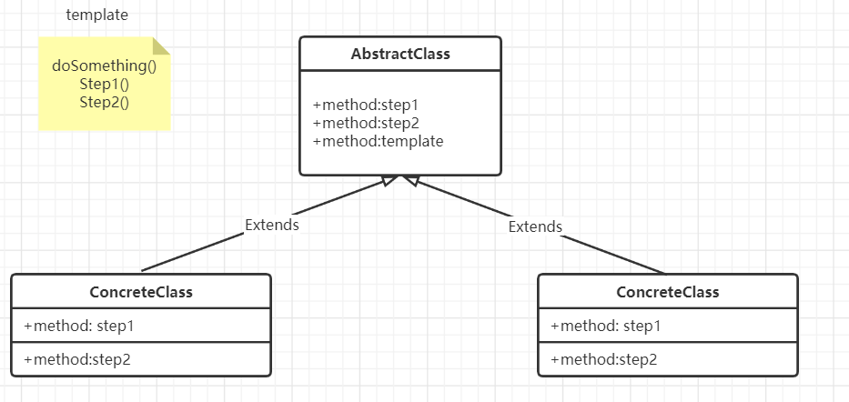
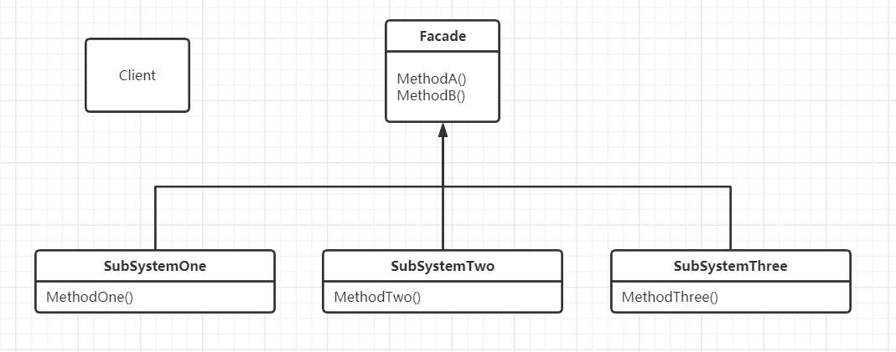

[TOC]


# 设计模式


## 9.原型模式

只需要实现一个Cloneable接口，重写其中的clone方法

以下实现为深拷贝，实现对对象的值的复制

```java
/**
 * 原型模式
 *
 * @author Kou
 * @date: 2021/6/9 14:34
 */
public class Plane implements Cloneable {
    private String name;
    private String type;

    public Plane() {
        this.name = "name" + Math.random();
        this.type = "type" + Math.random();
    }

    public Plane(Plane plane) {
        this.name = plane.name;
        this.type = plane.type;
    }

    public String getName() {
        return name;
    }

    public String getType() {
        return type;
    }

    public void setName(String name) {
        this.name = name;
    }

    public void setType(String type) {
        this.type = type;
    }

    @Override
    protected Object clone() {
        return new Plane(this);
    }
}
```

```java
public class PlaneTest {
    public static void main(String[] args) throws CloneNotSupportedException {
        Plane p1 = new Plane();
        System.out.println("p1= " + p1.getType());
        Plane p2 = (Plane) p1.clone();
        System.out.println("p2= " + p2.getType());
        p1.setType("123456");
        System.out.println("p1= " + p1.getType());
        System.out.println("p2= " + p2.getType());
    }
}
```


## 10.模板方法模式

模板方法模式定义了一个操作中的算法框架，而将一些步骤延迟到子类中。使得子类可以不改变一个算法的结构即可重定义该算法的某些特定步骤。



```java
/**
 * 模板抽象类
 * 封装了不变的部分，扩展了可变的部分
 * 不变的部分在父类中实现，可变的部分在继承类中实现
 * 行为由父类去控制，子类只负责实现
 * 通过扩展这个父类，可以实现更多操作，符合开闭原则
 *
 * @author Kou
 * @date: 2021/8/18 13:32
 */
public abstract class Cooking {
    /**
     * 做饭第一步
     */
    protected abstract void step1();

    /**
     * 做饭第二步
     */
    protected abstract void step2();

    /**
     * 模板方法
     */
    public void cook() {
        System.out.println("做饭开始");
        step1();
        step2();
        System.out.println("做饭结束");
    }
}
```

```java
/**
 * @author Kou
 * @date: 2021/8/18 13:37
 */
public class Cook extends Cooking {
    @Override
    protected void step1() {
        System.out.println("放盐放味精");
    }

    @Override
    protected void step2() {
        System.out.println("放辣椒放胡椒");
    }
}
```

```java
public class Test {
    public static void main(String[] args) {
        Cooking cooking = new Cook();
        cooking.cook();
    }
}
```


## 11.迪米特法则

**迪米特法则（LoD）最少知识原则**：

如果两个类不必彼此直接通信，那么这两个类就不应当发生直接的相互作用。如果一个类需要调用另一个类的某一个方法的话，可以通过第三者转发这个调用。


## 12.外观模式

外观模式

要求一个子系统的外部与其内部的通信必须通过一个统一的对象进行。

外观模式提供一个高层次的接口，使得子系统更易使用。




缺点：不符合开闭原则

```java
public class SubOne {
    public void s1(){
        System.out.println("s1");
    }
}
public class SubTwo {
    public void s2(){
        System.out.println("s2");
    }
}
public class SubThree {
    public void s3(){
        System.out.println("s3");
    }
}

public class Facade {
    private SubOne subOne = new SubOne();
    private SubTwo subTwo = new SubTwo();
    private SubThree subThree = new SubThree();

    public void method1() {
        subTwo.s2();
        subOne.s1();
        subThree.s3();
    }
}

public class Test {
    public static void main(String[] args) {
        Facade facade = new Facade();
        facade.method1();
    }
}

```


## 13.建造者模式（生成器模式）

创建型设计模式

将一个复杂的构建与其表示相分离，使得同样的构建过程可以创建不同的表示。

是在当创建复杂对象的算法应该独立于该对象的组成部分以及它们的装配方式时使用的模式。

idea使用插件builder


```java
package com.builder;

/**
 * @author Kou
 * @date: 2021/9/4 11:16
 */
public class House {
    private Window window;
    private Door door;
    private Wall wall;

    public House(HouseBuilder builder) {
        this.window = builder.window;
        this.door = builder.door;
        this.wall = builder.wall;
    }

    public House() {

    }

    public void setWindow(Window window) {
        this.window = window;
    }

    public void setDoor(Door door) {
        this.door = door;
    }

    public void setWall(Wall wall) {
        this.wall = wall;
    }

    public static final class HouseBuilder {
        private Window window;
        private Door door;
        private Wall wall;

        public HouseBuilder() {
        }

        public static HouseBuilder aHouse() {
            return new HouseBuilder();
        }

        public HouseBuilder withWindow(Window window) {
            this.window = window;
            return this;
        }

        public HouseBuilder withDoor(Door door) {
            this.door = door;
            return this;
        }

        public HouseBuilder withWall(Wall wall) {
            this.wall = wall;
            return this;
        }

        public House build() {
            House house = new House();
            house.setWindow(window);
            house.setDoor(door);
            house.setWall(wall);
            return house;
        }
    }
}

public class BuilderPattern {
    public static void main(String[] args) {
        House house = House.HouseBuilder.aHouse().withDoor(new Door()).withWall(new Wall()).withWindow(new Window()).build();
    }
}

```
