[TOC]


# 项目功能模块

项目模式为B2C模式

springboot版本：2.2.1

+ 系统后台模块（管理员使用）
  + 讲师管理模块
  + 课程分类管理模块
  + 课程管理模块
    + 视频
  + 统计分析模块
  + 订单管理
  + banner管理
  + 权限管理
+ 系统前台（普通用户使用）
  + 首页数据显示
  + 讲师列表和详情
  + 课程列表和课程详情
    + 视频在线播放
  + 登录和注册功能
  + 微信扫描登录
  + 微信扫描支付


# 项目技术点介绍

项目采用	前后端分离开发

后端技术：

+ SpringBoot
+ SpringCloud
+ MyBatisPlus
+ Spring Security
+ Redis
+ Maven
+ EasyExcel
+ jwt
+ OAuth2

前端技术：

+ VUE
+ Element-UI
+ axios
+ node.js

其他技术：

+ 阿里云oss
+ 阿里云视频点播服务
+ 阿里云短信服务
+ 微信支付和登录
+ docker
+ Git
+ Jenkins


## MyBatisPlus

是一个MyBatis的增强工具，简化开发。

+ 导包
+ 写配置

+ 测试

+ Mapper直接继承BaseMapper即可


MP sql日志：

```properties
#mybatis日志
mybatis-plus.configuration.log-impl=org.apache.ibatis.logging.stdout.StdOutImpl
```


### 1.CRUD操作

#### 1.插入

```java
@SpringBootTest
public class Mpdemo1010ApplicationTests {
    @Autowired
    private UserMapper userMapper;

    /**
     * 查询user表中的所有数据
     */
    @Test
    public void findAll() {
        List<User> users = userMapper.selectList(null);
        System.out.println(users);
    }

    /**
     * 添加操作
     * 不需要设置id主键值
     * mp自动生成id值  19位id值
     */
    @Test
    public void addUser() {
        User user = new User();
        user.setName("lucy");
        user.setAge(20);
        user.setEmail("lucy.com");
        int insert = userMapper.insert(user);
        System.out.println("insert:" + insert);
    }

}
```


#### 2.主键策略

https://www.cnblogs.com/haoxinyue/p/5208136.html

1. 自增策略

   自动增长 

   在实体类主键对应字段上标上注解TableId

   ```java
   @TableId(type = IdType.AUTO)
   private Long id;
   ```

   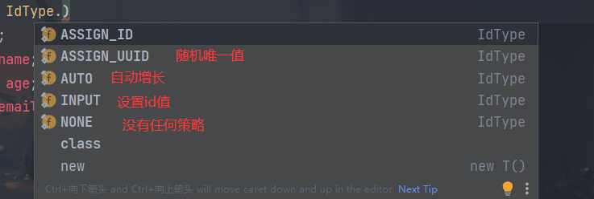

   

2. uuid

   

3. redis原子操作生成id

   

4. ==mp自带策略**snowflake算法**（本项目用的策略）==


#### 3.修改操作

```java
/**
 * 修改操作
 */
@Test
public void updateUser(){
    User user = new User();
    user.setId(2L);
    user.setAge(120);
    int updateById = userMapper.updateById(user);
    System.out.println(updateById);
}
```


#### 4.自动填充

实现过程

+ 在实体类里面进行自动填充属性添加注解

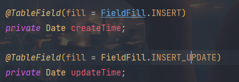

+ 创建类，实现接口MetaObjectHandler

  ```java
  /**
   * @author KouChaoJie
   * @date: 2021/9/22 16:51
   */
  @Component
  public class MyMetaObjectHandler implements MetaObjectHandler {
      /**
       * insertFill
       * 使用mp实现添加方法，这个方法执行
       *
       * @param metaObject 元数据
       */
      @Override
      public void insertFill(MetaObject metaObject) {
          this.setFieldValByName("createTime", new Date(), metaObject);
          this.setFieldValByName("updateTime", new Date(), metaObject);
      }
  
      /**
       * updateFill
       * 使用mp实现修改方法，这个方法执行
       *
       * @param metaObject 元数据
       */
      @Override
      public void updateFill(MetaObject metaObject) {
          this.setFieldValByName("updateTime", new Date(), metaObject);
      }
  }
  ```


#### 5.乐观锁

解决某些问题

主要解决丢失更新。

如果不考虑事务隔离性，会产生读问题

脏读	不可重复读	幻读

写问题：丢失更新问题

**主要适用场景：**当要更新一条记录的时候，希望这条记录没有被别人更新，也就是说实现线程安全的数据更新

多个人同时修改同一条记录，最后提交的把之前提交数据覆盖。


解决方案：悲观锁（串行操作），**乐观锁**

**乐观锁实现方式：**版本号

- 取出记录时，获取当前version
- 更新时，带上这个version
- 执行更新时， set version = newVersion where version = oldVersion
- 如果version不对，就更新失败


+ 乐观锁的具体实现

  + 数据库中添加version字段

  + 对应实体类添加版本号属性

  + 对应属性添加@Version 注解

  + 配置类配置乐观锁插件

    ```java
    /**
     * 乐观锁插件
     *
     * @return 拦截器
     */
    @Bean
    public MybatisPlusInterceptor mybatisPlusInterceptor() {
        MybatisPlusInterceptor interceptor = new MybatisPlusInterceptor();
        interceptor.addInnerInterceptor(new OptimisticLockerInnerInterceptor());
        return interceptor;
    }
    ```

  + 使用自动填充来给version一个默认值

    


​	

+ 测试

  ```java
  /**
   * 测试乐观锁修改
   */
  @Test
  public void updateUser1() {
      //根据id查询数据
      User user = userMapper.selectById(1440610924718231553L);
      //进行修改
      user.setAge(120);
      userMapper.updateById(user);
  }
  ```

**特别说明:**

+ 支持的数据类型只有 int,Integer,long,Long,Date,Timestamp,LocalDateTime

+ 整数类型下 `newVersion = oldVersion + 1`

+ `newVersion` 会回写到 `entity` 中

+ 仅支持 `updateById(id)` 与 `update(entity, wrapper)` 方法

+ 在 `update(entity, wrapper)` 方法下, `wrapper` 不能复用!!!


#### 6.查询

。。。。


#### 7.分页

+ 配置分页插件

```java
 // 最新版
@Bean
public MybatisPlusInterceptor mybatisPlusInterceptor() {
    MybatisPlusInterceptor interceptor = new MybatisPlusInterceptor();
    interceptor.addInnerInterceptor(new PaginationInnerInterceptor(DbType.H2));
    return interceptor;
}

```

+ 编写分页代码

  直接new page对象，传入两个参数

  ```java
  /**
   * 分页查询
   */
  @Test
  public void testPage() {
      //创建Page对象
      //传入两个参数:当前页  每页显示记录数
      Page<User> userPage = new Page<>(1, 3);
      //调用mp分页查询的方法
      //调用mp分页查询过程中，底层封装把分页所有数据封装到page对象里面
      userMapper.selectPage(userPage, null);
      //通过page对象获取分页数据
      //当前页
      System.out.println(userPage.getCurrent());
      //每页数据的list集合
      System.out.println(userPage.getRecords());
      //每页显示记录数
      System.out.println(userPage.getSize());
      //总记录数
      System.out.println(userPage.getTotal());
      //总页数
      System.out.println(userPage.getPages());
      //是否有下一页
      System.out.println(userPage.hasNext());
      //是否有上一页
      System.out.println(userPage.hasPrevious());
  }
  ```


#### 8.删除

##### 1.物理删除

略


##### 2.逻辑删除

将对应数据中代表是否被删除字段状态修改为“被删除状态”，之后在数据库中仍旧能看到此条数据记录。

+ 在数据库中添加deleted字段，对应实体类添加属性

  

+ 默认0为不删除，1为删除

+ 数据库加默认值或者使用自动填充方式

+ 配置类配置插件（**新版本mp不需要配置**）

  ```java
  @Bean
  public ISqlInjector sqlInjector() {
      return new LogicSqlInjector();
  }
  ```

  ```properties
  mybatis-plus.global-config.db-config.logic-delete-value=1
  mybatis-plus.global-config.db-config.logic-not-delete-value=0
  ```

+ 删除操作后，deleted字段值改变，但数据依然存在

  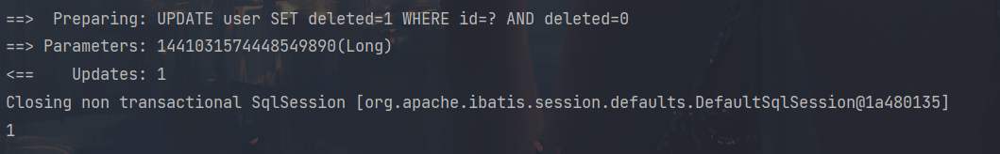

+ 配置逻辑删除后，mp查询已经自动配置上where deleted=0
+ 如果想查被逻辑删除的数据，可以写xml文件，自己写语句


#### 9.性能分析

性能分析拦截器，用于输出每条 SQL 语句及其执行时间

SQL 性能执行分析,开发环境使用，超过指定时间，停止运行。有助于发现问题

参数：maxTime： SQL 执行最大时长，超过自动停止运行，有助于发现问题。

参数：format： SQL是否格式化，默认false。


+ 配置插件

  ```java
  /**
   * SQL 执行性能分析插件
   * 开发环境使用，线上不推荐。 maxTime 指的是 sql 最大执行时长
   */
  @Bean
  @Profile({"dev","test"})// 设置 dev test 环境开启
  public PerformanceInterceptor performanceInterceptor() {
      PerformanceInterceptor performanceInterceptor = new PerformanceInterceptor();
      performanceInterceptor.setMaxTime(100);//ms，超过此处设置的ms则sql不执行
      performanceInterceptor.setFormat(true);
      return performanceInterceptor;
  }
  ```

  


### 2.MyBatis-Plus条件构造器


使用**QueryWrapper**构建条件

Wrapper ： 条件构造抽象类，最顶端父类

  AbstractWrapper ： 用于查询条件封装，生成 sql 的 where 条件

​    QueryWrapper ： Entity 对象封装操作类，不是用lambda语法

​    UpdateWrapper ： Update 条件封装，用于Entity对象更新操作

  AbstractLambdaWrapper ： Lambda 语法使用 Wrapper统一处理解析 lambda 获取 column。

​    LambdaQueryWrapper ：看名称也能明白就是用于Lambda语法使用的查询Wrapper

​    LambdaUpdateWrapper ： Lambda 更新封装Wrapper


```java
/**
 * mp实现复杂查询操作
 */
@Test
public void testSelectQuery() {
    //创建对象
    QueryWrapper<User> wrapper = new QueryWrapper<>();
    //通过QueryWrapper设置条件
    //ge,gt,le,lt 大于 大于等于 小于 小于等于
    //查询大于30岁的user
    //字段名   条件数值
    //wrapper.ge("age", 30);
    
    //eq,ne  等于 不等于
   //wrapper.ne("name", "lilei");
    
    //between 范围
    //wrapper.between("age",20,35);
    
    //like 模糊查询
    //wrapper.like("name","东");
    
    //orderBy 排序
    //wrapper.orderByDesc("id");
    
    //last 拼接sql语句
    //wrapper.last("limit 1");
    //指定要查询的列
    wrapper.select("id","name");
    
    List<User> users = userMapper.selectList(wrapper);
    System.out.println(users);
}
```


# 环境搭建

## 1.前后端分离开发概念

**开发文档**

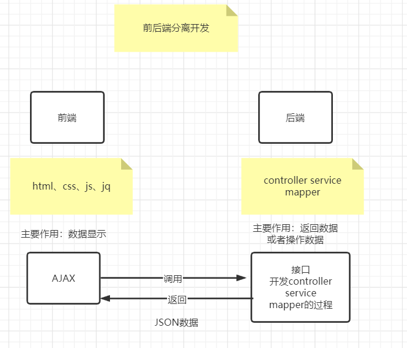


## 2.数据库设计

**讲师管理模块**

以下规约只针对本模块，更全面的文档参考==《阿里巴巴Java开发手册》==：五、MySQL数据库

1、库名与应用名称尽量一致


2、表名、字段名必须使用小写字母或数字，禁止出现数字开头，


3、表名不使用复数名词


4、表的命名最好是加上“业务名称_表的作用”。如，edu_teacher


5、**表必备三字段：id, gmt_create, gmt_modified**

说明：

其中 id 必为主键，类型为 bigint unsigned、单表时自增、步长为 1。

（如果使用分库分表集群部署，则id类型为verchar，非自增，业务中使用分布式id生成器）

gmt_create, gmt_modified 的类型均为 datetime 类型，前者现在时表示主动创建，后者过去分词表示被 动更新。

 

6、单表行数超过 500 万行或者单表容量超过 2GB，才推荐进行分库分表。 说明：如果预计三年后的数据量根本达不到这个级别，请不要在创建表时就分库分表。 


7、表达是与否概念的字段，必须使用 is_xxx 的方式命名，数据类型是 unsigned tinyint （1 表示是，0 表示否）。 

说明：任何字段如果为非负数，必须是 unsigned。 

注意：POJO 类中的任何布尔类型的变量，都不要加 is 前缀。数据库表示是与否的值，使用 tinyint 类型，坚持 is_xxx 的 命名方式是为了明确其取值含义与取值范围。 

正例：表达逻辑删除的字段名 is_deleted，1 表示删除，0 表示未删除。 


8、小数类型为 decimal，禁止使用 float 和 double。 说明：float 和 double 在存储的时候，存在精度损失的问题，很可能在值的比较时，得到不 正确的结果。如果存储的数据范围超过 decimal 的范围，建议将数据拆成整数和小数分开存储。


9、如果存储的字符串长度几乎相等，使用 char 定长字符串类型。 


10、varchar 是可变长字符串，不预先分配存储空间，长度不要超过 5000，如果存储长度大于此值，定义字段类型为 text，独立出来一张表，用主键来对应，避免影响其它字段索 引效率。


11、唯一索引名为 uk_字段名；普通索引名则为 idx_字段名。

说明：uk_ 即 unique key；idx_ 即 index 的简称


12、不得使用外键与级联，一切外键概念必须在应用层解决。外键与级联更新适用于单机低并发，不适合分布式、高并发集群；级联更新是强阻塞，存在数据库更新风暴的风险；外键影响数据库的插入速度。 


## 3.搭建项目工程

### 1.创建项目结构

+ 创建父工程  pom类型，管理依赖版本和放公共依赖       springboot工程
  + 子模块一																		maven工程
    + 子子模块一															 maven工程
    + 子子模块二
  + 子模块二
  + 子模块三
  + ........


添加

```xml
<packaging>pom</packaging>

<properties>
        <java.version>1.8</java.version>
        <guli.version>0.0.1-SNAPSHOT</guli.version>
        <mybatis-plus.version>3.0.5</mybatis-plus.version>
        <velocity.version>2.0</velocity.version>
        <swagger.version>2.7.0</swagger.version>
        <aliyun.oss.version>2.8.3</aliyun.oss.version>
        <jodatime.version>2.10.1</jodatime.version>
        <poi.version>3.17</poi.version>
        <commons-fileupload.version>1.3.1</commons-fileupload.version>
        <commons-io.version>2.6</commons-io.version>
        <httpclient.version>4.5.1</httpclient.version>
        <jwt.version>0.7.0</jwt.version>
        <aliyun-java-sdk-core.version>4.3.3</aliyun-java-sdk-core.version>
        <aliyun-sdk-oss.version>3.1.0</aliyun-sdk-oss.version>
        <aliyun-java-sdk-vod.version>2.15.2</aliyun-java-sdk-vod.version>
        <aliyun-java-vod-upload.version>1.4.11</aliyun-java-vod-upload.version>
        <aliyun-sdk-vod-upload.version>1.4.11</aliyun-sdk-vod-upload.version>
        <fastjson.version>1.2.28</fastjson.version>
        <gson.version>2.8.2</gson.version>
        <json.version>20170516</json.version>
        <commons-dbutils.version>1.7</commons-dbutils.version>
        <canal.client.version>1.1.0</canal.client.version>
        <docker.image.prefix>zx</docker.image.prefix>
        <cloud-alibaba.version>0.2.2.RELEASE</cloud-alibaba.version>
    </properties>

    <dependencyManagement>
        <dependencies>
            <!--Spring Cloud-->
            <dependency>
                <groupId>org.springframework.cloud</groupId>
                <artifactId>spring-cloud-dependencies</artifactId>
                <version>Hoxton.RELEASE</version>
                <type>pom</type>
                <scope>import</scope>
            </dependency>

            <dependency>
                <groupId>org.springframework.cloud</groupId>
                <artifactId>spring-cloud-alibaba-dependencies</artifactId>
                <version>${cloud-alibaba.version}</version>
                <type>pom</type>
                <scope>import</scope>
            </dependency>
            <!--mybatis-plus 持久层-->
            <dependency>
                <groupId>com.baomidou</groupId>
                <artifactId>mybatis-plus-boot-starter</artifactId>
                <version>${mybatis-plus.version}</version>
            </dependency>

            <!-- velocity 模板引擎, Mybatis Plus 代码生成器需要 -->
            <dependency>
                <groupId>org.apache.velocity</groupId>
                <artifactId>velocity-engine-core</artifactId>
                <version>${velocity.version}</version>
            </dependency>

            <!--swagger-->
            <dependency>
                <groupId>io.springfox</groupId>
                <artifactId>springfox-swagger2</artifactId>
                <version>${swagger.version}</version>
            </dependency>
            <!--swagger ui-->
            <dependency>
                <groupId>io.springfox</groupId>
                <artifactId>springfox-swagger-ui</artifactId>
                <version>${swagger.version}</version>
            </dependency>

            <!--aliyunOSS-->
            <dependency>
                <groupId>com.aliyun.oss</groupId>
                <artifactId>aliyun-sdk-oss</artifactId>
                <version>${aliyun.oss.version}</version>
            </dependency>

            <!--日期时间工具-->
            <dependency>
                <groupId>joda-time</groupId>
                <artifactId>joda-time</artifactId>
                <version>${jodatime.version}</version>
            </dependency>

            <!--xls-->
            <dependency>
                <groupId>org.apache.poi</groupId>
                <artifactId>poi</artifactId>
                <version>${poi.version}</version>
            </dependency>
            <!--xlsx-->
            <dependency>
                <groupId>org.apache.poi</groupId>
                <artifactId>poi-ooxml</artifactId>
                <version>${poi.version}</version>
            </dependency>

            <!--文件上传-->
            <dependency>
                <groupId>commons-fileupload</groupId>
                <artifactId>commons-fileupload</artifactId>
                <version>${commons-fileupload.version}</version>
            </dependency>

            <!--commons-io-->
            <dependency>
                <groupId>commons-io</groupId>
                <artifactId>commons-io</artifactId>
                <version>${commons-io.version}</version>
            </dependency>

            <!--httpclient-->
            <dependency>
                <groupId>org.apache.httpcomponents</groupId>
                <artifactId>httpclient</artifactId>
                <version>${httpclient.version}</version>
            </dependency>

            <dependency>
                <groupId>com.google.code.gson</groupId>
                <artifactId>gson</artifactId>
                <version>${gson.version}</version>
            </dependency>

            <!-- JWT -->
            <dependency>
                <groupId>io.jsonwebtoken</groupId>
                <artifactId>jjwt</artifactId>
                <version>${jwt.version}</version>
            </dependency>

            <!--aliyun-->
            <dependency>
                <groupId>com.aliyun</groupId>
                <artifactId>aliyun-java-sdk-core</artifactId>
                <version>${aliyun-java-sdk-core.version}</version>
            </dependency>
            <dependency>
                <groupId>com.aliyun.oss</groupId>
                <artifactId>aliyun-sdk-oss</artifactId>
                <version>${aliyun-sdk-oss.version}</version>
            </dependency>
            <dependency>
                <groupId>com.aliyun</groupId>
                <artifactId>aliyun-java-sdk-vod</artifactId>
                <version>${aliyun-java-sdk-vod.version}</version>
            </dependency>
            <dependency>
                <groupId>com.aliyun</groupId>
                <artifactId>aliyun-java-vod-upload</artifactId>
                <version>${aliyun-java-vod-upload.version}</version>
            </dependency>
            <dependency>
                <groupId>com.aliyun</groupId>
                <artifactId>aliyun-sdk-vod-upload</artifactId>
                <version>${aliyun-sdk-vod-upload.version}</version>
            </dependency>
            <dependency>
                <groupId>com.alibaba</groupId>
                <artifactId>fastjson</artifactId>
                <version>${fastjson.version}</version>
            </dependency>
            <dependency>
                <groupId>org.json</groupId>
                <artifactId>json</artifactId>
                <version>${json.version}</version>
            </dependency>

            <dependency>
                <groupId>commons-dbutils</groupId>
                <artifactId>commons-dbutils</artifactId>
                <version>${commons-dbutils.version}</version>
            </dependency>

            <dependency>
                <groupId>com.alibaba.otter</groupId>
                <artifactId>canal.client</artifactId>
                <version>${canal.client.version}</version>
            </dependency>
        </dependencies>
    </dependencyManagement>
```

做好依赖管理


删除src目录


+ 创建子模块

  

+ 创建子子模块

  


# 后台模块

## 1.开发后台讲师管理模块

### 1.基础配置

+ 写配置文件

  ```properties
  # 服务端口
  server.port=8001
  # 服务名
  spring.application.name=service-edu
  
  # 环境设置：dev、test、prod
  spring.profiles.active=dev
  
  # mysql数据库连接
  spring.datasource.driver-class-name=com.mysql.cj.jdbc.Driver
  spring.datasource.url=jdbc:mysql://localhost:3306/guli?serverTimezone=GMT%2B8
  spring.datasource.username=root
  spring.datasource.password=root
  
  #mybatis日志
  mybatis-plus.configuration.log-impl=org.apache.ibatis.logging.stdout.StdOutImpl
  ```

  

+ 编写controller，service，mapper

  **使用mp提供的代码生成器，生成相关代码**

  放在test中，因为不需要打包

  ```java
  import com.baomidou.mybatisplus.annotation.DbType;
  import com.baomidou.mybatisplus.annotation.IdType;
  import com.baomidou.mybatisplus.generator.AutoGenerator;
  import com.baomidou.mybatisplus.generator.config.DataSourceConfig;
  import com.baomidou.mybatisplus.generator.config.GlobalConfig;
  import com.baomidou.mybatisplus.generator.config.PackageConfig;
  import com.baomidou.mybatisplus.generator.config.StrategyConfig;
  import com.baomidou.mybatisplus.generator.config.rules.DateType;
  import com.baomidou.mybatisplus.generator.config.rules.NamingStrategy;
  import org.junit.Test;
  
  /**
   * @author
   * @since 2018/12/13
   */
  public class CodeGenerator {
  
      @Test
      public void run() {
  
          // 1、创建代码生成器
          AutoGenerator mpg = new AutoGenerator();
  
          // 2、全局配置
          GlobalConfig gc = new GlobalConfig();
          String projectPath = System.getProperty("user.dir");
          gc.setOutputDir(projectPath + "/src/main/java");
          gc.setAuthor("testjava");
          gc.setOpen(false); //生成后是否打开资源管理器
          gc.setFileOverride(false); //重新生成时文件是否覆盖
          gc.setServiceName("%sService");	//去掉Service接口的首字母I
          gc.setIdType(IdType.ID_WORKER); //主键策略
          gc.setDateType(DateType.ONLY_DATE);//定义生成的实体类中日期类型
          gc.setSwagger2(true);//开启Swagger2模式
  
          mpg.setGlobalConfig(gc);
  
          // 3、数据源配置
          DataSourceConfig dsc = new DataSourceConfig();
          dsc.setUrl("jdbc:mysql://localhost:3306/guli");
          dsc.setDriverName("com.mysql.jdbc.Driver");
          dsc.setUsername("root");
          dsc.setPassword("root");
          dsc.setDbType(DbType.MYSQL);
          mpg.setDataSource(dsc);
  
          // 4、包配置
          PackageConfig pc = new PackageConfig();
          pc.setModuleName("edu"); //模块名
          pc.setParent("com.example.demo");
          pc.setController("controller");
          pc.setEntity("entity");
          pc.setService("service");
          pc.setMapper("mapper");
          mpg.setPackageInfo(pc);
  
          // 5、策略配置
          StrategyConfig strategy = new StrategyConfig();
          strategy.setInclude("edu_teacher");
          strategy.setNaming(NamingStrategy.underline_to_camel);//数据库表映射到实体的命名策略
          strategy.setTablePrefix(pc.getModuleName() + "_"); //生成实体时去掉表前缀
  
          strategy.setColumnNaming(NamingStrategy.underline_to_camel);//数据库表字段映射到实体的命名策略
          strategy.setEntityLombokModel(true); // lombok 模型 @Accessors(chain = true) setter链式操作
  
          strategy.setRestControllerStyle(true); //restful api风格控制器
          strategy.setControllerMappingHyphenStyle(true); //url中驼峰转连字符
  
          mpg.setStrategy(strategy);
  
  
          // 6、执行
          mpg.execute();
      }
  }
  ```

  

+ 测试查询所有讲师数据

  ```java
  @RestController
  @RequestMapping("/eduservice/edu-teacher")
  public class EduTeacherController {
      @Autowired
      private EduTeacherService eduTeacherService;
      /**
       * 查询讲师表中所有数据
       * rest风格url操作
       *
       * @return 所有讲师信息
       */
      @GetMapping("findAll")
      public List<EduTeacher> findAllTeacher() {
          //调用service方法实现查询所有讲师数据
          return eduTeacherService.list(null);
      }
  }
  ```


### 2.创建springboot启动类

在service_edu模块中配置springboot启动类

```java
/**
 * @author KouChaoJie
 * @since: 2021/9/24 15:56
 */
@SpringBootApplication
public class EduApplication {
    public static void main(String[] args) {
        SpringApplication.run(EduApplication.class, args);
    }
}
```


### 3.统一返回的json时间格式

```properties
#返回json的全局时间格式
spring.jackson.date-format=yyyy-MM-dd HH:mm:ss
spring.jackson.time-zone=GMT+8
```


### 4.讲师的逻辑删除

+ 配置逻辑删除插件

  ```java
  /**
        * 逻辑删除插件
        */
  @Bean
  public ISqlInjector sqlInjector() {
      return new LogicSqlInjector();
  }
  ```

  

+ 字段添加注解

  ```java
  @TableLogic
  private Boolean isDeleted;
  ```


+ 编写cotroller方法

  略


### 5.跨域配置

#### 1.什么是跨域

浏览器从一个域名的网页去请求另一个域名的资源时，域名、端口、协议任一不同，都是跨域 。前后端分离开发中，需要考虑ajax跨域的问题。

这里我们可以从服务端解决这个问题

#### 2.配置

在Controller类上添加注解

```java
@CrossOrigin //跨域
```


### 6.Swagger2介绍

前后端分离开发模式中，api文档是最好的沟通方式。

Swagger 是一个规范和完整的框架，用于生成、描述、调用和可视化 RESTful 风格的 Web 服务。

+ 及时性 (接口变更后，能够及时准确地通知相关前后端开发人员)

+ 规范性 (并且保证接口的规范性，如接口的地址，请求方式，参数及响应格式和错误信息)

+ 一致性 (接口信息一致，不会出现因开发人员拿到的文档版本不一致，而出现分歧)

+ 可测性 (直接在接口文档上进行测试，以方便理解业务)


1. 生成在线接口文档
2. 方便接口测试


### 7.配置Swagger2

创建一个公共模块common，整合swagger，为了所有模块都能使用

引入依赖

再创建一个子模块service_base

配置类

```java
@Configuration
@EnableSwagger2
public class SwaggerConfig {
    @Bean
    public Docket webApiConfig(){
        return new Docket(DocumentationType.SWAGGER_2)
                .groupName("webApi")
                .apiInfo(webApiInfo())
                .select()
                .paths(Predicates.not(PathSelectors.regex("/admin/.*")))
                .paths(Predicates.not(PathSelectors.regex("/error.*")))
                .build();
    }
    private ApiInfo webApiInfo(){
        return new ApiInfoBuilder()
                .title("网站-课程中心API文档")
                .description("本文档描述了课程中心微服务接口定义")
                .version("1.0")
                .contact(new Contact("Helen", "http://atguigu.com", "55317332@qq.com"))
                .build();
    }
}
```


+ 具体使用

  在service中引用

  ```xml
  <dependency>
      <groupId>com.cucn</groupId>
      <artifactId>service_base</artifactId>
      <version>0.0.1-SNAPSHOT</version>
  </dependency>
  ```

+ **在service-edu启动类上添加注解，进行测试**

  ```java
  @ComponentScan(basePackages = {"com.cucn"})
  ```


+ 访问**swagger**

  http://localhost:8001/swagger-ui.html

  就可以测试项目了


+ 定义接口说明和参数说明

  定义在类上：@Api

  定义在方法上：@ApiOperation

  定义在参数上：@ApiParam

  ```java
  @Api(description="讲师管理")
  @RestController
  @RequestMapping("/admin/edu/teacher")
  public class TeacherAdminController {
  
  	@Autowired
  	private TeacherService teacherService;
  
  	@ApiOperation(value = "所有讲师列表")
  	@GetMapping
  	public List<Teacher> list(){
  		return teacherService.list(null);
  	}
  
  	@ApiOperation(value = "根据ID删除讲师")
  	@DeleteMapping("{id}")
  	public boolean removeById(
  			@ApiParam(name = "id", value = "讲师ID", required = true)
  			@PathVariable String id){
  		return teacherService.removeById(id);
  	}
  }
  ```

  

### 8.统一返回数据格式

```json
{
  "success": 布尔, //响应是否成功
  "code": 数字, //响应码
  "message": 字符串, //返回消息
  "data": HashMap //返回数据，放在键值对中
}
```

+ 在common模块里创建子模块common_utils

  

+ 创建interface，定义数据返回的状态码

  成功20000，失败20001

  ```java
  public interface ResultCode {
      Integer SUCCESS = 20000;
      Integer ERROR = 20001;
  }
  ```

+ 定义返回数据格式

  ```java
  /**
   * 统一返回数据结果类
   *
   * @author KouChaoJie
   * @since: 2021/9/24 17:39
   */
  @Data
  public class Result {
      @ApiModelProperty(value = "是否成功")
      private Boolean success;
  
      @ApiModelProperty(value = "返回码")
      private Integer code;
  
      @ApiModelProperty(value = "返回消息")
      private String message;
  
      @ApiModelProperty(value = "返回数据")
      private Map<String, Object> data = new HashMap<>();
  
      /**
       * 构造方法私有化
       */
      private Result() {
      }
  
      /**
       * 成功静态方法
       *
       * @return 成功的Result结果
       */
      public static Result ok() {
          Result result = new Result();
          result.setSuccess(true);
          result.setCode(ResultCode.SUCCESS);
          result.setMessage("成功");
          return result;
      }
  
      /**
       * 成功静态方法
       *
       * @return 失败的Result结果
       */
      public static Result error() {
          Result result = new Result();
          result.setSuccess(false);
          result.setCode(ResultCode.ERROR);
          result.setMessage("失败");
          return result;
      }
  
      public Result success(Boolean success){
          this.setSuccess(success);
          return this;
      }
  
      public Result message(String message){
          this.setMessage(message);
          return this;
      }
  
      public Result code(Integer code){
          this.setCode(code);
          return this;
      }
  
      public Result data(String key, Object value){
          this.data.put(key, value);
          return this;
      }
  
      public Result data(Map<String, Object> map){
          this.setData(map);
          return this;
      }
  }
  ```


+ 使用统一结果返回

  + service里引入commonutils

  + 将接口返回值全部设置成Result

    ```java
    @GetMapping("/findAll")
    public Result findAllTeacher() {
        //调用service方法实现查询所有讲师数据
        List<EduTeacher> eduTeachers = eduTeacherService.list(null);
        return Result.ok().data("items", eduTeachers);
    }
    ```


### 9.分页与条件查询接口开发

+ 配置分页插件

  ```java
  /**
   * 分页插件
   */
  @Bean
  public PaginationInterceptor paginationInterceptor() {
      return new PaginationInterceptor();
  }
  ```


+ 编写controller

  ```java
  /**
   * 分页查询讲师的方法
   *
   * @param current 当前页
   * @param limit   每页记录数
   * @return 分页Result信息
   */
  @ApiOperation(value = "分页查询讲师")
  @GetMapping("/pageTeacher/{current}/{limit}")
  public Result pageListTeacher(@PathVariable Long current, @PathVariable Long limit) {
      //创建page对象
      Page<EduTeacher> teacherPage = new Page<>(current, limit);
      //调用方法实现分页
      //调用方法时，底层封装，把分页所有数据都封装到了Page对象中
      eduTeacherService.page(teacherPage, null);
      //总记录数
      long total = teacherPage.getTotal();
      //每页数据集合
      List<EduTeacher> records = teacherPage.getRecords();
      return Result.ok().data("total", total).data("rows", records);
  }
  ```


#### 1.多条件组合查询带分页

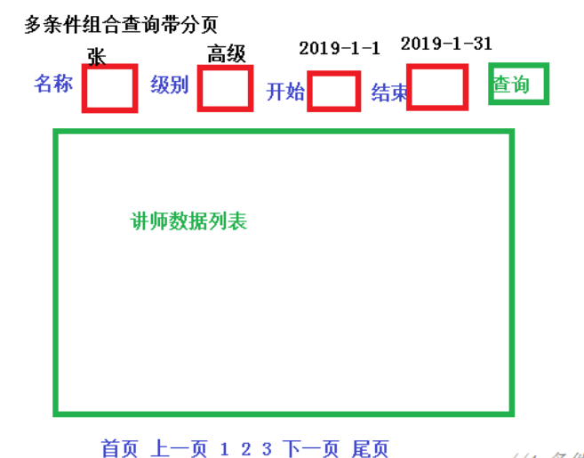

+ 把条件值传递到接口里（VO）

  把条件值封装到对象里面，把对象传递到接口里面

  根据条件值进行判断，拼接条件

  

  

  ```java
  /**
   * 条件查询带分页方法
   *
   * @param current      当前页
   * @param limit        每页记录数
   * @param teacherQuery teacher查询条件对象
   * @return 分页Result信息
   */
  @PostMapping("/pageTeacherCondition/{current}/{limit}")
  public Result pageTeacherCondition(@PathVariable Long current,
                                     @PathVariable Long limit,
                                     @RequestBody(required = false) TeacherQuery teacher
      Page<EduTeacher> teacherPage = new Page<>();
      //构造条件
      QueryWrapper<EduTeacher> wrapper = new QueryWrapper<>();
      //多条件组合查询
      String name = teacherQuery.getName();
      Integer level = teacherQuery.getLevel();
      String begin = teacherQuery.getBegin();
      String end = teacherQuery.getEnd();
      //判断条件值是否为空，如果不为空拼接条件
      if (!StringUtils.isEmpty(name)) {
          wrapper.like("name", name);
      }
      if (!StringUtils.isEmpty(level)) {
          wrapper.like("level", level);
      }
      if (!StringUtils.isEmpty(begin)) {
          wrapper.ge("gmt_create", begin);
      }
      if (!StringUtils.isEmpty(end)) {
          wrapper.le("gmt_create", end);
      }
      eduTeacherService.page(teacherPage, wrapper);
      //总记录数
      long total = teacherPage.getTotal();
      //每页数据集合
      List<EduTeacher> records = teacherPage.getRecords();
      return Result.ok().data("total", total).data("rows", records);
  }
  ```


### 10.添加讲师

+ 做自动填充

  放在service_base模块中

  


### 11.修改讲师功能

+ 根据讲师id进行查询


+ 讲师修改


### 12.统一异常处理

我们想让异常结果也显示为统一的返回结果对象，并且统一处理系统的异常信息，那么需要统一异常处理

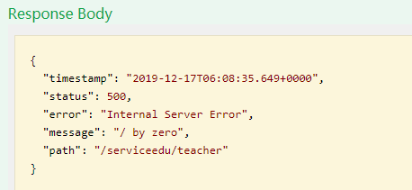

+ 在service-base中创建统一异常处理类GlobalExceptionHandler.java：

  ```java
  /**
   * 统一异常处理类
   *
   * @author KouChaoJie
   * @since: 2021/9/24 23:49
   */
  @ControllerAdvice
  public class GlobalExceptionHandler {
      /**
       * 指定出现什么异常执行
       * -@ResponseBody 为了返回数据
       *
       * @param e 异常
       * @return Result
       */
      @ExceptionHandler(Exception.class)
      @ResponseBody
      public Result error(Exception e) {
          e.printStackTrace();
          return Result.error().message("执行了全局异常处理");
      }
  }
  ```


+ **处理特定异常**

  略

+ **自定义异常处理**

  + 创建自定义异常类继承RuntimeException

  + 写异常属性

    ```java
    @EqualsAndHashCode(callSuper = true)
    @Data
    @AllArgsConstructor
    @NoArgsConstructor
    public class GuliException extends RuntimeException {
        /**
         * 状态码
         */
        private Integer code;
        /**
         * 异常信息
         */
        private String msg;
    }
    ```

  + 放在service_base中

  + 在统一异常类中添加规则

  + 执行自定义异常

    手动抛出

    


### 13.统一日志处理

+ 配置日志级别

  日志记录器（Logger）的行为是分等级的。如下表所示：

  分为：OFF、FATAL、**ERROR、WARN、INFO、DEBUG**、ALL

  默认情况下，spring boot从控制台打印出来的日志级别只有INFO及以上级别，可以配置日志级别

  ```properties
  #设置日志级别
  logging.level.root=WARN
  ```

  这种方式只能将日志打在控制台上


+ 把日志不仅输出到控制台，也可以输出到文件中，使用日志工具

  LogBack工具

  + 删除application.properties日志配置
  + resources 中创建 logback-spring.xml 


+ 如果程序运行出现异常，把异常信息输出到文件中

  在统一异常处理类上加上@Slf4j

  在处理异常方法中log.error   log.warn


### 14.添加讲师实现头像上传功能

+ 使用阿里云oss对象存储   来存储头像

+ 首先创建一个bucket

  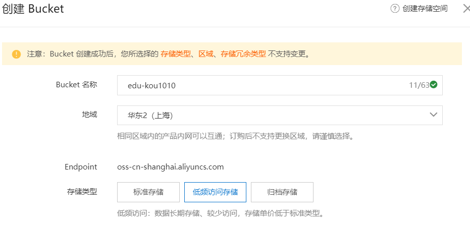


+ java代码操作阿里云oss，上传文件到阿里云oss操作

  + 准备工作：创建操作阿里云oss许可证（阿里云给的id和密钥）
  + 查看阿里云官方api进行操作

+ 后端集成oss

  + 创建service_oss模块

  + 引入相关依赖

  + 写配置文件

    ```properties
    #服务端口
    server.port=8002
    #服务名
    spring.application.name=service-oss
    #环境设置：dev、test、prod
    spring.profiles.active=dev
    #阿里云 OSS
    #不同的服务器，地址不同
    aliyun.oss.file.endpoint=oss-cn-shanghai.aliyuncs.com
    aliyun.oss.file.keyid=1111
    aliyun.oss.file.keysecret=2222
    #bucket可以在控制台创建，也可以使用java代码创建
    aliyun.oss.file.bucketname=1
    ```

  + 遇到问题

    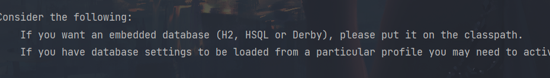

    启动的时候，找数据库配置，但是此模块不需要操作数据库，只是上传oss

    解决方式：1. 添加数据库配置

    ​					2.在启动类添加属性`exclude = DataSourceAutoConfiguration.class`，不去加载数据库


+ 创建常量类，读取配置文件内容

+ 创建controller调用service

  ```java
  /**
   * 上传头像的方法
   *
   * @return Result
   */
  @PostMapping
  public Result uploadOssFile(MultipartFile file) {
      //获取上传的文件 MultipartFile
      //获取上传到oss的地址
      String url = ossService.uploadFileAvatar(file);
      return Result.ok().data("url", url);
  }
  ```

  ```java
  /**
   * @author KouChaoJie
   * @since: 2021/9/28 15:07
   */
  @Service
  public class OssServiceImpl implements OssService {
      @Override
      public String uploadFileAvatar(MultipartFile file) {
          // yourEndpoint填写Bucket所在地域对应的Endpoint。
          String endpoint = ConstantPropertiesUtils.END_POINT;
          // 阿里云账号AccessKey拥有所有API的访问权限
          String accessKeyId = ConstantPropertiesUtils.ACCESS_KEY_ID;
          String accessKeySecret = ConstantPropertiesUtils.ACCESS_KEY_SECRET;
          String bucketName = ConstantPropertiesUtils.BUCKET_NAME;
          try {
              // 创建OSSClient实例。
              OSS ossClient = new OSSClientBuilder().build(endpoint, accessKeyId, accessKeySecret);
              //获取上传文件输入流
              InputStream inputStream = file.getInputStream();
              //获取文件名称
              String fileName = file.getOriginalFilename();
              // 调用oss方法实现上传
              //第一个参数 Bucket名称 
              //第二个参数 上传到oss文件路径和文件名称
              //第三个参数 上传文件输入流
              ossClient.putObject(bucketName, fileName, inputStream);
              // 关闭OSSClient。
              ossClient.shutdown();
              //返回上传后的文件路径返回
              //https://edu-kou1010.oss-cn-shanghai.aliyuncs.com/01.jpg
              return "https://" + bucketName + "." + endpoint + "/" + fileName;
          } catch (IOException e) {
              e.printStackTrace();
              return null;
          }
      }
  }
  ```


+ 问题：

  + 多次上传相同文件，会造成最后一次上传把之前的上传文件覆盖掉了

+ 解决：

  + 在文件名称添加随机唯一值，让每个文件名称不同

    

  + 或者把文件分类存储

    + 根据日期进行分类


+ nginx 反向代理服务器


## 2.课程分类管理模块

课程名称：java基础课程开发     分类：后端开发

课程名称：vue高级开发课程 	 分类：前端开发


二级分类：

后端开发：java,c++......

前端开发：vue,js........


当parentId等于0时，表示此课程为一级分类


### 1.技术点：使用EasyExcel进行写操作

EasyExcel是阿里巴巴开源的一个excel处理框架，**以使用简单、节省内存著称**。EasyExcel能大大减少占用内存的主要原因是在解析Excel时没有将文件数据一次性全部加载到内存中，而是从磁盘上一行行读取数据，逐个解析。


+ 引入依赖

  ```xml
  <dependencies>
      <!-- https://mvnrepository.com/artifact/com.alibaba/easyexcel -->
      <dependency>
          <groupId>com.alibaba</groupId>
          <artifactId>easyexcel</artifactId>
          <version>2.1.1</version>
      </dependency>
  </dependencies>
  ```

  还需要poi的依赖

+ 创建一个实体类，和excel中数据对应上

  ```java
  @Data
  public class DemoData {
      /**
       * 设置excel表头名称
       */
      @ExcelProperty("学生编号")
      private Integer sno;
  
      @ExcelProperty("学生姓名")
      private String sname;
  }
  ```


### 2.技术点：使用EasyExcel进行读操作

+ 创建和excel对应的实体类，标记对应列关系

  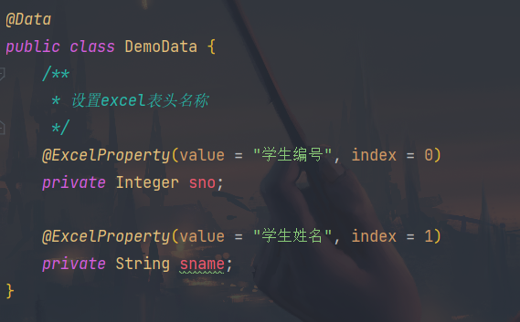

+ 创建一个监听进行excel文件读取

  ```java
  public class ExcelListener extends AnalysisEventListener<DemoData> {
      /**
       * 一行一行读取excel内容
       */
      @Override
      public void invoke(DemoData demoData, AnalysisContext analysisContext) {
          System.out.println("********" + demoData);
      }
      /**
       * 读取表头的内容
       */
      @Override
      public void invokeHeadMap(Map<Integer, String> headMap, AnalysisContext context) {
          System.out.println("表头:" + headMap);
      }
      /**
       * 读取完成之后
       */
      @Override
      public void doAfterAllAnalysed(AnalysisContext analysisContext) {
      }
  }
  ```

+ 最终方法的调用

  


### 3.添加课程分类

+ 引入easyexcel依赖
+ 使用代码生成器把课程分类代码生成
+ 创建一个实体类和excel对应关系
+ 给监听器传入对应service对象，方便进行数据库操作


# 前端模块

使用VScode开发


## 1.相关前端技术点

### 1.ES6基本语法

看为知笔记


### 2.Vue

Vue (读音 /vjuː/，类似于 view) 是一套用于构建用户界面的渐进式框架。

Vue 的核心库只关注视图层，不仅易于上手，还便于与第三方库或既有项目整合。另一方面，当与现代化的工具链以及各种支持类库结合使用时，Vue 也完全能够为复杂的单页应用提供驱动。


+ vue入门

  vue：构建页面前端框架

  看为知笔记


### 3.axios

使用axios经常和vue一起使用进行ajax操作


### 4.element-ui


### 5.Node.js

简单的说 Node.js 就是运行在服务端的 JavaScript。

Node.js是一个事件驱动I/O服务端JavaScript环境，基于Google的V8引擎。


### 6.NPM

+ 在后端开发中，使用过maven，maven构建项目，管理jar依赖，联网下载依赖
+ npm类似于maven，用在前端中，管理前端js依赖，联网下载js依赖，比如jquery

+ 安装node时会顺带安装到了npm
+ npm -v


+ 项目初始化操作

  npm init -y

  项目初始化后生成文件

  

+ 下载js依赖

  npm install 依赖名称

  


### 7.babel转码器


### 8.模块化

+ 开发后端接口时候，开发controller，service，mapper，controller->service->mapper

  后端中，类与类之间的调用称为后端模块化操作

+ 前端模块化，在前端中，js和js之间调用称为前端模块化操作


### 9.webpack
Webpack 是一个前端资源加载/打包工具。它将根据模块的依赖关系进行静态分析，然后将这些模块按照指定的规则生成对应的静态资源。
Webpack 可以将多种静态资源 js、css、less 转换成一个静态文件，减少了页面的请求。 


### 10.搭建前端项目环境

前端框架入口：index.html     main.js

+ 前端页面环境使用框架（模板）

+ 主要基于两种技术实现出来

  vue-admin-template=**vue+element-ui**

+ 框架目录

  + build：构建或编译相关文件

  + config：一些基础配置文件

  + src：
    + api：定义调用方法
    + assets：静态资源
    + components：组件
    + icons：相关图标
    + router：路由
    + store：相关脚本文件
    + style：相关样式文件
    + utils：相关工具类
    + views：项目具体页面


怎么改？：定义请求的方式，写路由，在views写页面进行调用


## 2.讲师管理前端开发

### 临时改造本地登录功能

登录端口改成 http://localhost:8001

修改配置文件请求地址 config/dev.env.js    http://localhost:8001

进行登录调用两个方法，login登录操作方法，和info登录之后获取用户信息的方法。所以，创建接口两个方法实现登录

+ login返回token值
+ info返回roles name avator

```java
@RestController
@RequestMapping("/eduservice/user")
public class EduLoginController {

    /**
     * login
     *
     * @return token
     */
    @PostMapping("/login")
    public Result login() {
        return Result.ok().data("token", "admin");
    }

    /**
     * loginInfo信息
     *
     * @return roles name avator
     */
    @GetMapping("/info")
    public Result info() {
        return Result.ok().data("roles", "[admin]").data("name", "admin").data("avatar", "https://wpimg.wallstcn.com/f778738c-e4f8-4870-b634-56703b4acafe.gif");
    }
}
```


### 解决跨域问题

跨域：通过一个地址去访问另外一个地址，这个过程中如果有三个地方任何一个不一样，就会产生跨域问题

三个地方：访问协议，ip地址，端口号


当前：

本地接口：localhost:8001

默认不能访问


+ 解决方式
  + 在后端接口controller加注解`@CrossOrigin`
  + 使用网关解决


### 前端框架开发过程

+ 第一步添加路由

+ 点击某个路由，显示路由页面内容

  

+ 在api文件夹创建js文件，定义接口地址和参数

+ 创建vue页面引入js文件，调用方法实现功能
+ 最后使用element-ui显示数据内容


### 1.讲师列表（分页条件查询）

+ 添加路由

  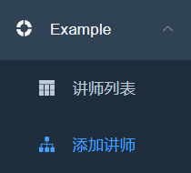

+ 创建路由对应的页面

  

+ 在api文件夹中创建teacher.js定义访问接口的地址

  

+ 在讲师列表页面list.vue页面调用定义的接口方法，得到接口返回数据


+ 把请求接口获取数据在页面进行显示

  使用element-ui实现


+ 分页实现

  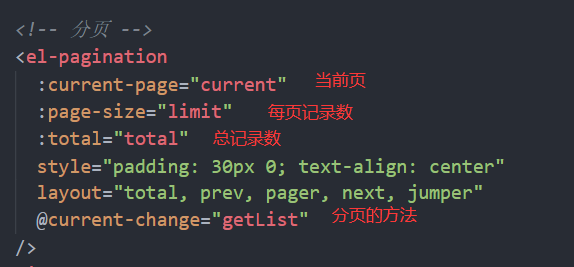


+ 条件查询带分页

  


### 2.讲师添加

+ 点击添加讲师
+ 进入表单页面，输入讲师信息
+ 在表单页面点击保存，提交接口，添加数据库


+ api中定义接口地址


### 3.讲师删除功能

+ 在每条记录后添加删除按钮
+ 在按钮绑定事件
+ 在绑定事件的方法传递删除讲师的id值
+ 在api文件夹teacher.js定义删除接口的地址
+ 调用方法实现删除


### 4.讲师修改功能

+ 在每条记录后面添加上一个修改按钮

+ 点击修改，进入表单页面，进行数据回显

+ 通过路由跳转进入数据回显页面，在路由index页面添加隐藏路由

+ 在表单页面中实现数据回显

  + 在teacher.js里定义根据id查询的接口

  + 页面中调用这个接口实现数据的回显

  + 调用根据id查询的方法

    + 因为添加和修改都使用save页面

      区别添加还是修改，只有修改时候查询数据回显

      判断路径里有没有id值，有就是修改

+ 最终修改实现

  + 在api的teacher.js定义修改接口
  + 判断是添加还是修改，有id值就是修改


### 5.路由切换问题解决

遇到问题

+ 第一次点击修改，进行数据回显
+ 第二次再去点击添加讲师，进入表单页面，但是页面还是显示修改的回显数据，应该是表单空白页


解决：

+ 添加时先清空数据

+ 无法解决的原因：

  多次路由跳转到同一个页面，在页面中created方法只会执行第一次，后面在进行跳转时不会执行

+ 用vue的监听执行


### 6.讲师上传头像前端整合

+ 在添加讲师页面，创建上传组件，实现上传

  使用element-ui

  导入模块

  修改值

  写成功与关闭方法

